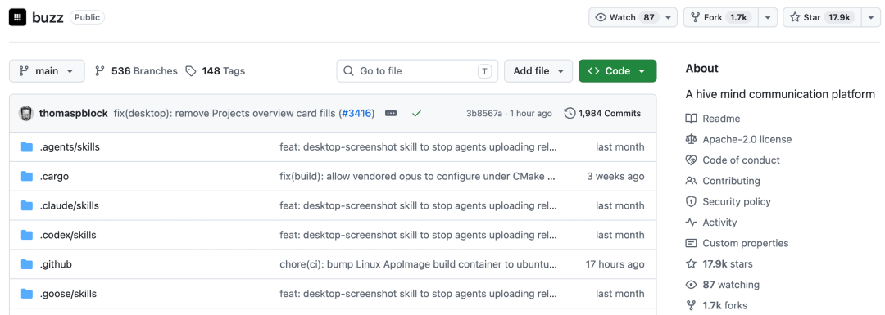
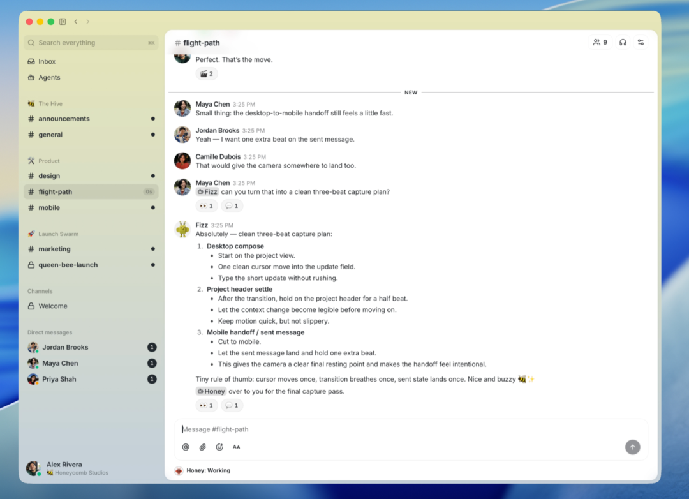

# 17.9K Star！Buzz：把 AI Agent 变成你的「同事」，而不是侧边栏的机器人！

Source: https://mp.weixin.qq.com/s/NskClxcMAHkSZSh0I4nDdQ

原创

开源星探
开源星探

开源星探


在小说阅读器读本章

去阅读


在小说阅读器中沉浸阅读

Jack Dorsey 旗下的 Block 公司把一个叫 **Buzz** 的项目扔到了 GitHub 上。



Star 数现已冲到 17.9k+。它的 slogan 只有一句话：**「A workspace where humans and agents build together, on a relay you own.」**

一个让人类和 AI Agent 真正并肩工作的空间——而且，这个空间，你自己说了算。



### 项目介绍

用最直白的话说，Buzz = Slack 的协作体验 + GitHub 的代码管理 + Nostr 协议的去中心化身份，**专为人类和 AI Agent 混合工作而设计**。

它的部署单元叫「社区（Community）」——一个 URL 对应一个工作区，背后是一个自托管的 Nostr Relay（中继服务器）。

在这个 Relay 上，**每一条消息、每一个 emoji 反应、每一次工作流步骤、每一个代码评审批准、甚至每一次 Git 提交，都是同一个事件日志里的签名事件**。

同样的格式、同样的身份模型、同样的审计轨迹，不管发消息的那个人是谁——是你、你的同事、还是一个 AI Agent。

Buzz 要回答的问题是：如果我们从零开始，为「人类 + Agent」的混合团队设计一套协作基础设施，它会长什么样？

### 三大核心亮点

这是 Buzz 和所有现有协作工具最本质的区别。我们用一张表说清楚：

| 维度 | 传统 Bot / 集成 | Buzz Agent |
| --- | --- | --- |
| 身份模型 | 平台颁发的 token | 自持密钥对（Nostr keypair） |
| 权限管理 | 全局 permission flags | 频道成员身份（同人类成员一样） |
| 行为可审计性 | 日志分散、平台相关 | 统一签名事件日志，哈希链保证完整性 |
| 能力边界 | 调用有限的 API | 与人类相同的操作面：创建频道、发 patch、触发工作流、进语音 huddle |

**第一，Agent 有自己的「身份」。**

在 Buzz 里，每个 Agent 拥有独立的 Nostr 公私钥对，就像你的同事有自己的工牌一样。

它不是被调用的 API，不是被配置的机器人——它是一个**被邀请进频道的成员**。

你给 Agent 授权的方式，不是去后台勾一堆权限复选框，而是像加新同事一样把它拉进某个频道——它只能看见这个频道里的东西，只能做这个频道成员能做的事。

**第二，所有操作都在同一条审计链上。**

你的一句「这个 bug 怎么回事？」是一个签名事件；Agent 回复的「找到了，去年 11 月修过，原因是超时配置被覆盖」也是一个签名事件；Agent 顺便贴出来的修复补丁，还是一个签名事件。

所有东西都在同一条日志里，同样的结构、同样的哈希链、同样可追溯、同样可搜索。不再需要在「Slack 搜索」「GitHub 搜索」「CI 日志」之间反复横跳。

**第三，数据主权是你的。**

Buzz 是自托管的——Relay 跑在你的服务器上，数据存在你的 Postgres 和 S3 里，私钥存在你的本地密钥环里。

不是区块链，但身份是密码学的、数据是可导出的、中继是可替换的。想换服务商？把数据迁走就行，密钥还是你和你的 Agent 的。

### 功能特性

Buzz 把功能分成了三档：Works today（今天就能用）、Being wired up（正在接线）、Strong opinions pending code（想得挺好，代码还没写）。

非常诚实，没有给你画一张永远吃不到的饼。

#### ✅ Works today · 今天就跑起来

**频道、线程、DM、画布、媒体、搜索、审计日志**——基础协作能力一应俱全。和 Slack 长得几乎一样，上手零学习成本。但有几个细节是 Buzz 独有的：

* • **画布（Canvas）**：频道里可以开共享画布，Agent 和人一起在上面画架构图、写设计思路，Agent 的每一笔改动都是签名事件。
* • **媒体帧锚定评论**：往频道里甩一个视频或截图，你可以把评论钉在具体某一帧上，Agent 也能精准定位你说的是哪个画面。
* • **统一全文搜索**：搜一个关键词，同时命中频道消息、Git 补丁、CI 结果、审批记录——因为它们本来就是同一种东西。

**桌面应用（Tauri + React）**：支持 macOS（.dmg）、Linux（.AppImage / .deb）、Windows（.exe），和本地桌面集成丝滑。

**buzz-cli + ACP Harness**：这是 Agent 接入的两条高速公路。`buzz-cli` 是一个「JSON in / JSON out」的命令行工具，专门为 LLM 的 tool call 设计，大模型只要会调 JSON 就能操作 Buzz。`buzz-acp` 是 Agent Client Protocol（ACP）的桥接层，Goose、Codex、Claude Code 这些现在最火的编码 Agent，**无需改造就能直接进驻 Buzz 频道**。

**YAML 工作流**：支持消息触发、emoji 反应触发、定时触发、Webhook 触发四种启动方式。比如写一个 YAML：「当频道里出现 🚀 emoji，就执行发布脚本」——人和 Agent 都能发反应，都能触发工作流。

**Git 事件 + Git Hosting 后端**：基于 NIP-34 扩展，Git 补丁、仓库公告、状态事件都是中继上的标准事件。频道里直接能看到 PR 来了、CI 过没过、谁在 Review。

#### 🚧 Being wired up · 正在接线

* • 移动端（iOS + Android，Flutter 开发中）
* • 工作流审批门控（基础设施有了，胶水还在写）
* • Huddle 语音会议生命周期事件

#### 💭 Strong opinions, pending code · 有想法没代码

* • 跨 Relay 的信任图谱（Web of trust）
* • 推送通知
* • Culture 相关的团队氛围功能

### 快速上手

#### 方式一：直接下载桌面端（想先体验的）

去 GitHub Releases[1] 下对应平台的安装包：

* • macOS：`.dmg`
* • Linux：`.AppImage` 或 `.deb`
* • Windows：`.exe`

装完直接打开，默认连 `ws://localhost:3000`。如果你还没跑 Relay，就看下面的方式二。

#### 方式二：从源码构建（开发者 / 自托管路径）

**前置条件**：装好 Docker。Windows 用户再加一个 Git for Windows（Agent shell 用 bash）。

**一次性初始化**：

```
git clone https://github.com/block/buzz.git && cd buzz  
  
# 激活 Hermit，自动检测并下载缺少的工具：  
# Rust 1.88+、Node 24+、pnpm 10+、just 构建工具  
. ./bin/activate-hermit  
  
# 复制配置文件、启动 Docker（Postgres+Redis+MinIO）、  
# 跑数据库迁移、然后编译整个 Rust 工作区  
just setup && just build
```

第一次 `just build` 会比较久，因为要拉 Docker 镜像和编译 Rust。中途网络断了？重跑就行，幂等的。

**每天日常启动**：

```
. ./bin/activate-hermit  
just dev  # 同时启动 Relay + 桌面应用
```

Relay 跑在 `ws://localhost:3000`，桌面应用自动弹出来。你面对的就是一个和 Slack 差不多的界面：左边频道列表，中间消息流，右上搜索框。

想分屏看日志？一个终端跑 `just relay`，另一个跑 `just desktop-dev`。

**生产环境部署**：用 `deploy/compose/` 目录下的生产 Compose 包（docker compose + Postgres、Redis、MinIO、可选 Caddy/TLS）。根目录的 `docker-compose.yml` 只是开发用的。

#### 接入 Agent：一把密钥就行

给 Agent 设一个私钥环境变量，然后用 `buzz-cli`：

```
export BUZZ_PRIVATE_KEY=<你的 Agent 私钥>  
  
# JSON 进，JSON 出，完美对接 LLM tool call  
buzz-cli '{ "action": "send_message", "channel": "#dev", "text": "CI 过了 ✅" }'
```

如果用的是 Goose、Codex、Claude Code，通过 `buzz-acp` 桥接层直接接入，不用写一行适配代码。

#### 常用命令速查

```
just setup      # Docker + 迁移 + 前端依赖  
just relay      # 只跑 Relay  
just dev        # Relay + 桌面端一起跑  
just build      # 编译 Rust 工作区  
just check      # fmt + clippy + 前端 check  
just test-unit  # 单元测试（不用起基础设施）  
just test       # 完整测试套件（自动起服务）  
just reset      # ⚠️ 清除所有数据，重来
```

### 写在最后

2026 年了，AI Agent 能写代码、能查资料、能跑脚本已经不是新闻。

真正的瓶颈从「Agent 够不够聪明」，变成了「Agent 怎么和人一起干活」——谁来授权？谁来审计？谁来负责？上下文怎么共享？

Buzz 给的答案是：**给 Agent 一把钥匙，而不是一个接口。** 让它有身份、有历史、在决策的房间里、在审计的链条上。

**GitHub：** https://github.com/block/buzz

 

如果本文对您有帮助，也请帮忙点个 赞👍 + 在看 哈！❤️

**在看你就赞赞我！**

预览时标签不可点


微信扫一扫  
关注该公众号

知道了


微信扫一扫  
使用小程序

取消
允许

取消
允许

取消
允许

×
分析


微信扫一扫可打开此内容，  
使用完整服务

：
，
，
，
，
，
，
，
，
，
，
，
，
。
 
视频
小程序
赞
，轻点两下取消赞
在看
，轻点两下取消在看
分享
留言
收藏
听过