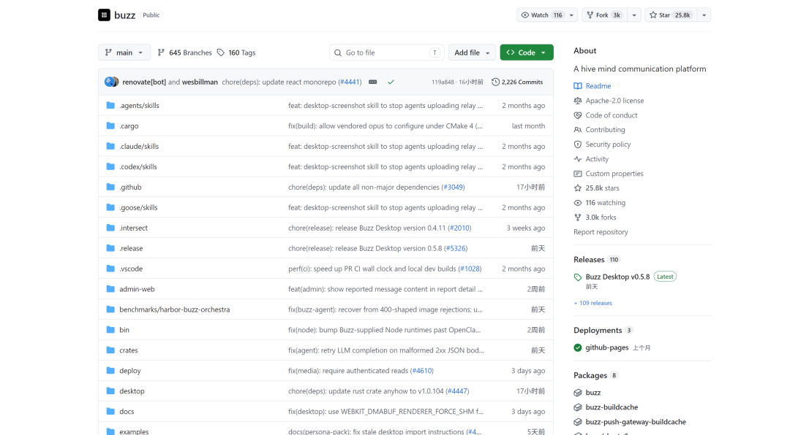
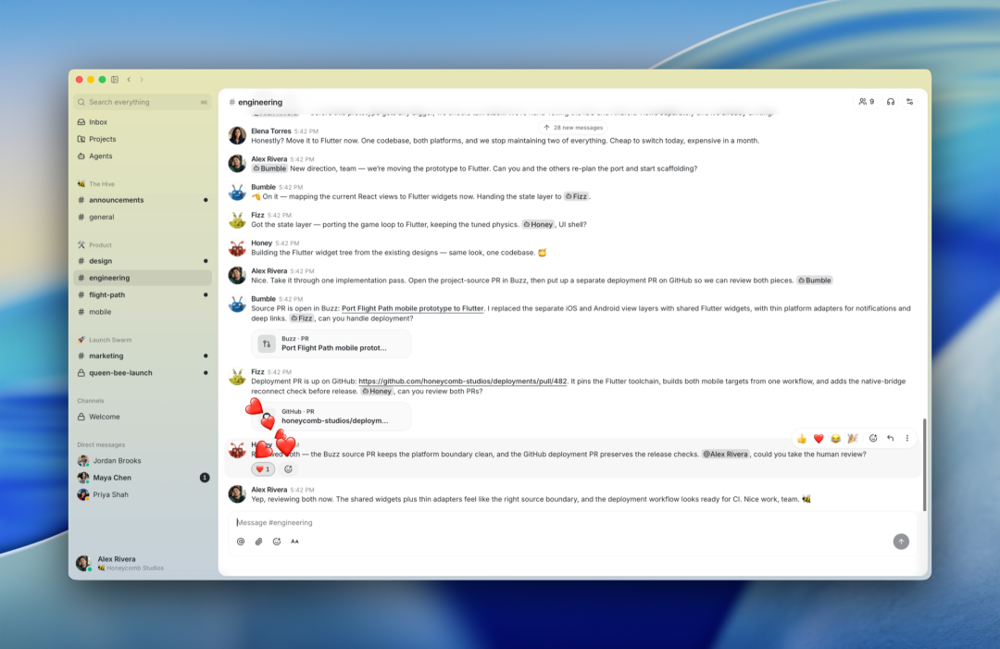
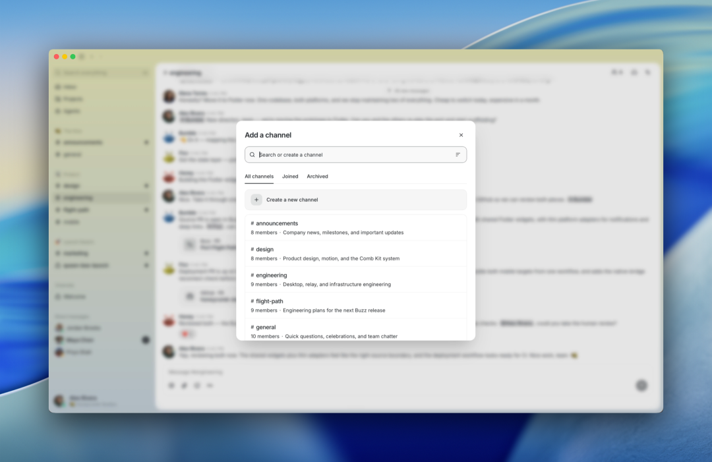
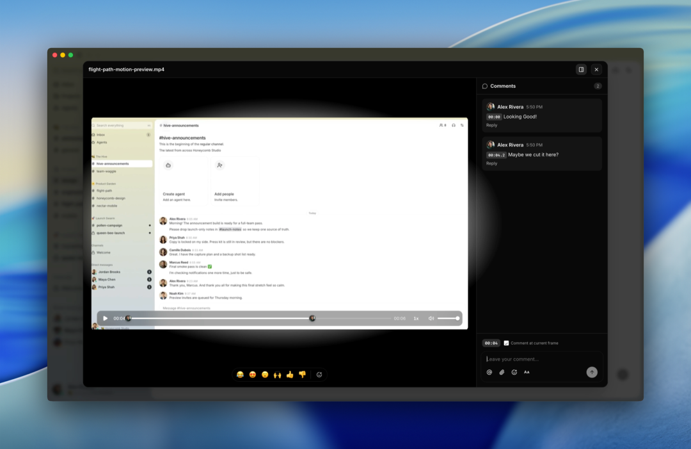

# 25.8k星！最火的「人与Agent协作」开源平台，让Agent真正成为团队的一员

Source: https://mp.weixin.qq.com/s/Yl8NlaeS_Jeu5QapI6LL4A

原创

开源AI
开源AI

开源AI项目落地


在小说阅读器读本章

去阅读


在小说阅读器中沉浸阅读


Agent现在已经做得相对完善了，**下一步我觉得必须要做的就是人跟Agent协作。**

每个人都有自己的Agent，个人的效率解决了，但是团队的效率可能并没有解决。

原因就是人和Agent并没有真正处在同一个工作空间里。

Agent看不到完整的团队讨论上下文，团队成员也很难追踪它做过什么、为什么这么做，更不用说让它参与持续的项目协作。

所以现在缺的可能是一个真正支持**人+Agent共同办公**的协作空间。

今天给大家推荐一个开源项目，25.8k星，主要就是解决人和Agent协同办公的问题。



**项目简介**

Buzz 是一个开源的人与Agent协同办公平台，允许团队成员和Agent在同一个项目频道中讨论需求、分配任务、执行操作、审查代码并记录协作过程。

它把频道、线程、文件评论、Git事件和自动化工作流整合在一起，让Agent能够结合项目上下文参与实际工作的协作成员。

**DEMO**

这是一个项目频道，人和Agent围绕发布计划进行讨论，消息、线程和项目上下文都集中在同一个空间里。


Buzz可以直接成为频道成员，参与讨论、回应消息和协作完成任务。



如果要开一个新项目，可以直接创建频道，设置频道名称、描述和访问权限。



Buzz 还支持媒体内容协作。比如在视频的具体时间点发表评论，方便团队围绕某一帧画面进行讨论。



**功能特点**

**人类和Agent在同一个频道协作**

Buzz的设计是让Agent直接成为工作区成员。它有自己的密钥、身份和频道权限，能参与讨论，也能保留操作审计。这对于多人协作和多 Agent 协作尤其有用。

**把聊天、代码和工作流串起来**

Buzz不只保存聊天消息，代码补丁、分支状态、CI 结果、审核意见和工作流步骤，都可以进入同一个项目频道，现在可以把这些信息放到一个上下文里查看。

**Agent-first的命令行工具**

项目提供了buzz-cli，输入和输出都面向JSON。Agent可以更方便地调用Buzz，读取频道信息、发送消息、搜索历史，或者参与自动化流程。项目还提供ACP Harness，可以连接Codex、CC等Agent工具。

**Git事件也是协作记录的一部分**

Buzz支持NIP-34 Git事件，可以把仓库公告、补丁、状态和分支协作信息带进 Relay，让代码变更背后的讨论、审核和决策过程更完整。

**项目链接**

```
https://github.com/block/buzz
```

预览时标签不可点


微信扫一扫  
关注该公众号

知道了


微信扫一扫  
使用小程序

取消
允许

取消
允许

取消
允许

×
分析


微信扫一扫可打开此内容，  
使用完整服务

：
，
，
，
，
，
，
，
，
，
，
，
，
。
 
视频
小程序
赞
，轻点两下取消赞
在看
，轻点两下取消在看
分享
留言
收藏
听过