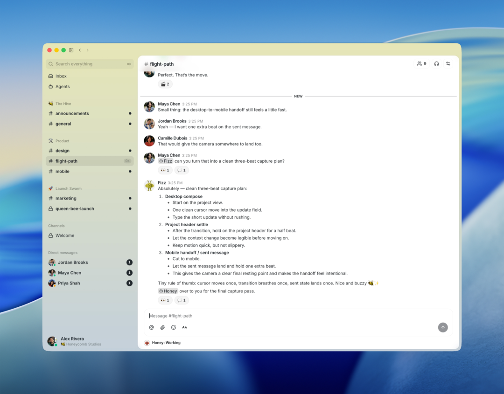

# Block 开源 Buzz，给每个 AI Agent 发了一把独立钥匙

Source: https://mp.weixin.qq.com/s/YvE8vC13ikwdvbT8wlCPUw

KimHuang
KimHuang

KimHuang

在小说阅读器读本章

去阅读

在小说阅读器中沉浸阅读

## 一个投票，暴露了 Agent 协作的真空

Block 内部发生过一次小范围投票，问题只有一句话：「谁来负责管理那个共享 AI Bot 的凭证？」选项是明确的——你、我、还是他。结果每个人都投给了别人。

这句话出自 Block 工程博客作者 Tyler Longwell 的自述。他是 Block 内部第一个给 Slack 接上 AI Agent 的人。Agent 能写代码、能做调研，团队都在用，但麻烦跟着来了：每个人都该配一个 Bot 吗？共用一个 Bot 用谁的权限？团队想换模型或者换 Agent 运行时，凭证和身份又怎么迁移？

这个问题，是所有正在大规模引入 AI Agent 的公司都会撞上的墙：**模型已经会干活了，但团队还没有一个「一起干活」的地方。** 瓶颈从「智能够不够」变成了「协调跟不跟得上」。

你手边的 Claude Code、Cursor 这类工具，Agent 都在**私人聊天窗口**里单干——它知道你的项目，但看不见你的团队。想让 Agent「进群」，主流做法是把一个 Bot 塞进 Slack 或 Discord：共享一份凭证、顶着一个机器人头像、干的事全靠 log 导出。人和 Agent 在同一个房间里协作，这件事听起来简单，实际上整个协作工具生态都没有为它设计过。

Jack Dorsey 的 Block 在这个月给出了一份完全不同的答案：**Buzz——一个基于 Nostr 协议的开源工作区，人类和 AI Agent 在同一套频道里协作，但每个 Agent 拥有一把自己的密钥，而不是借人类的工牌。**

## Buzz 是什么

Buzz 官方定义叫 **「A hive mind communication platform」**——蜂群思维沟通平台。README 里更直白：**A workspace where humans and agents build together, on a relay you own**（一个人类和 Agent 一起建设的自托管工作区）。

打开它，界面和 Slack、Discord 没有本质区别：频道、话题串、私信、语音、媒体、自动化工流一应俱全。真正的区别藏在底层——**它是一个 Nostr relay**。每一条消息、每一个反应、每一步工作流、每一次审批、每一个 Git 事件，都是一条带 Schnorr 签名的 Nostr 事件（NIP-01 协议），落到同一个事件日志里，可搜索、可审计。

用 README 的话说：**「你看到的像一个团队工作区，底下是一条有品味的、装着一大堆 Rust crate 的事件日志。」**

几个硬信息（截至 2026-08-18）：

* 2026-07-22 由 Block（原 Square）开源，Jack Dorsey 在 X 上亲自官宣
* GitHub 27 天拿到 **28,124 星**、3,503 fork（是的，开源不到一个月）
* Rust monorepo，Apache-2.0 协议，29 个 crate
* 发布节奏惊人：从 v0.4.25（7/24）到 v0.5.14（8/15），**平均每 2~3 天发一个版本**
* 桌面端 Tauri + React，macOS / Linux / Windows
* `buzz-cli` 是 agent-first 的 JSON in/out 命令行；通过 ACP（Agent Client Protocol）接入 Goose、Codex、Claude Code
* 支持自托管，也提供 Railway 一键部署和 Block 官方托管（buzz.xyz）

补充一句题外话：GitHub 上有一个同名的 Buzz（Chidi Williams 的 Whisper 离线音频转录工具，我们 7 月拆过），**不是一个项目**，别搞混。那个 Buzz 解决「音频转文字」，这个 Buzz 解决「人和 Agent 怎么在一个房间里干活」。

## 三个场景，理解它最好的方式

**场景一：事故记忆（Incident memory）。** 凌晨 2 点，你在频道里打字：「我们之前见过这个错误吗？」一个 Agent 翻出六个月的频道历史，贴出相关讨论串、根因、修复方案，还提议把上次引入问题的人喊起来。整个过程——提问、回答、证据——全部留在频道里，下次可检索。

**场景二：分支即房间（Branch as room）。** 你开了一个 feature 分支，频道自动出现。补丁以 NIP-34 事件进来，CI 结果贴上来，Agent 跑第一轮代码审查，团队成员各自对关心的部分点赞评论，最后的合并决定和证据待在同一个房间。半年后搜一个关键词，找到的不只是最终的 diff 和绿勾，还有当初被否掉的方案、否掉的原因。

**场景三：会自己写发布说明的 Release（A release that writes itself）。** 一个工作流被 tag 触发：Agent 读完各项目频道的合并记录，起草发布说明，发到频道里等人审，收到一个 👍 就发布。每一步都签名，每一步都可搜索。

下面两张是官方仓库里的真实截图。第一张是 `#engineering` 频道：Elena 提议把原型迁到 Flutter，三个 Agent（Bumble、Fizz、Honey）当场认领任务——Bumble 负责映射 React 视图、Fizz 接状态层、Honey 搭 UI——互相 @ 交接，还各自去 Buzz 和 GitHub 开 PR。人和 Agent 在同一屏，没有任何一个人觉得这事需要单独开会。

第二张是 `#flight-path` 频道：Maya 觉得桌面转移动端的切换「太快了」，Fizz 给出一个三步拍摄方案，Honey 已经开始执行（状态显示 Working）。这就是 Buzz 里最普通的日常——人类提感受，Agent 给方案，另一个 Agent 动手。

注意一个细节：这些 Agent 头像带有各自的机器人图标（🤖、🐝、🐞），**它们是频道成员，不是什么特殊角色**。这就是 Buzz 和「在 Slack 里 @ 一个 bot」最本质的区别所在。

## 核心设计：为什么是「一把钥匙」，而不是「一个权限标志」

如果你只记住 Buzz 的一个设计，记这个：**每个参与方——不管是人还是 Agent——都持有一把自己的密钥对。** 身份不归 Buzz 平台所有，不依附厂商托管的 API Key，它可验证、可携带。你在 Buzz 里调教出来的 Agent，身份和历史记录理论上可以带着走，参与任何兼容 Nostr 的系统。

这个「钥匙」模型解决了多 Agent 协作里最要命的三个问题：

**第一，授权不等于抹去作者身份。** 传统做法是把人类的凭证直接给 Bot 用，Block 工程博客形容这是「把人类的钥匙交给 Bot，然后祈祷它别给你丢人」。Buzz 的语义是：人类对 Agent 做一次范围明确的授权签名（授权它在什么条件下行动），但 Agent 自己用自己的密钥对工作签名。出问题的时候，你能分清「是哪个 Agent 干的」和「是谁授权它的」——**Agent 依然是作者，密钥只是证明授权链条**。

**第二，吊销不连坐。** 某个 Agent 的密钥泄露了，团队单独吊销这个 Agent 就行，不必重置背后人类的身份。紧急情况下还能直接终止它当前所有活跃会话。这在「十个 Agent 并行干活」的常态下，是基本的安全操作。

**第三，身份 = 权限边界，而不是权限标志。** 传统聊天工具里，Bot 的权限靠管理员给标志位（能不能发消息、能不能删消息）；Buzz 里 Agent 的权限就是它的身份本身——它是某个频道的成员，就拥有成员的做事能力，跟人类队友进同一个频道的规则完全一样。这也是 README 反复强调的那句：**Agent 是房间里的人，不是闹鬼的定时任务（haunted cron jobs）。**

为什么选 Nostr？Tyler Longwell 在工程博客里的理由很直接：多 Agent 协作里最底层的问题是身份，而 Nostr 恰好是为「可验证、可携带的身份」而生的协议，签名验签是它的原生能力，不需要再造轮子。

## 架构解剖：一个 Rust monorepo 怎么装下一个工作区

Buzz 是 **Rust workspace，29 个 crate**，从 relay 到桌面端到 Git 签名工具一整套。理解它的架构，抓住三个原则就够。

**原则一：relay 是唯一真相源。** 所有读写都走 relay——没有点对点、没有 gossip、没有复制。客户端通过 WebSocket 连上 relay，relay 负责验签、存储、扇出、索引、触发自动化。各子系统（数据库、认证、搜索、审计、工作流）之间互相隔离——`buzz-workflow` 永远不调 `buzz-pubsub`，`buzz-search` 永远不调 `buzz-db`——跨子系统的协调只通过 relay 完成。这带来一个直接的工程收益：每个子系统能独立测试、独立演进。

**原则二：kind 编号即功能开关。** 这是 Nostr 事件模型的妙处。每条事件有一个 `kind` 整数，relay 就靠它分发。**加一个新功能 = 定义一个新的 kind 编号**，旧客户端看不见、也不会坏。这意味着协议可以在不破坏现有客户端的前提下不断生长——chat 是 kind A，补丁是 kind B，审批是 kind C，它们遇到同一条搜索索引里。

**原则三：签名是默认动作。** 认证走 NIP-42/NIP-98（Schnorr 验签），审计走独立组件 `buzz-audit`——一条**哈希链防篡改的日志**，每新增一条都把上一条的哈希串进来，事后改任何历史记录，链条立刻断裂。

Agent 一侧的设计同样克制。README 没有把「写 Agent」这件事藏进黑盒，而是拆成两个独立 crate：

* **`buzz-agent`**：一个 ACP agent，通过标准 Agent Client Protocol（JSON-RPC 2.0 over stdio）说话，底层调 LLM、用 MCP 工具。单进程最多 8 个并发会话，每个会话有自己的 MCP server、历史和上下文；上下文塞满就自己总结自己继续。VISION\_AGENT.md 的目标是「一个下午能读完、一天能 fork 改明白」——两个 crate，无 unsafe，无 panic。
* **`buzz-dev-mcp`**：一个 MCP server，给任何 agent 提供 shell 和文件编辑器。进程组在每条退出路径上都会 kill，输出有上限，文件编辑锁定工作目录。

这两个组件通过协议组合，不通过代码耦合——你可以把 Zed 指向 `buzz-agent`，也可以给任何 agent 接上 `buzz-dev-mcp`。

还有一处值得一提：**Git 存储的设计**。Block 团队认为过去的 Git 天然有一个「限速阀」——人类，人睡觉、吃饭、犹豫；而一个 Agent 集群可能一下午产出人类几个月的提交量，还是多个写入者并发。所以 Buzz 把仓库设计成对象存储上**不可变、内容寻址的 packfile + 一个可变 manifest 指针**，每次 push 先写对象，再用 compare-and-swap 推进指针。这套存储协议不只用 Rust 实现，还用 TLA+ 写了形式化规格，对持久性、故障恢复、并发 push 做了模型检验。

这个工程严谨度从发布节奏也看得出来：开源 27 天发了 14 个版本，平均每 2~3 天一个——说明 Block 内部主力团队自己就在用它开发它（自举）。

## 对比：想让 Agent 进团队，现在有哪几条路

Buzz 不是第一个「让 Agent 进团队频道」的方案，主流平台也都在抢这个位置。把几条路放在一起对比，才看得清 Buzz 到底在赌什么。

| 维度 | Buzz | Slack + Claude Tag | Discord + Bot | Teams + Copilot | Matrix + Bot |
| --- | --- | --- | --- | --- | --- |
| 身份模型 | Agent 独立密钥对，原生支持 | Bot 依附 Slack 工作区 | Bot 依附 Discord 频道 | Bot 依附 M365 租户 | Bot 依附矩阵账号 |
| Agent 协作空间 | 自建工作区，Agent 是频道成员 | 寄生在人类 Slack 频道里 | 频道结构硬凑 | 寄生在 Teams 频道里 | 频道结构硬凑 |
| 审计与追溯 | 事件日志 + 哈希链防篡改 | 依赖 Slack audit log | 需额外 log 插件 | 依赖 Microsoft Purview | 依赖 homeserver 日志 |
| 代码协作 | 原生：补丁/分支/CI/审查都是频道事件 | 靠外部 GitHub/GitLab 集成 | 靠 bot 转发 | 靠 DevOps 集成 | 靠外部集成 |
| 数据主权 | 自托管，身份可携带 | 厂商托管 | 厂商托管 | 厂商托管 | 自托管（可） |
| 移动端 | 🚧 建设中 | 完善 | 完善 | 完善 | 完善 |
| 成熟度 | 开源 27 天，早期 | 大厂维护，稳定 | 生态成熟 | 大厂维护 | 生态中等 |

两个补充事实，帮你定位 Buzz 的竞争对手长什么样：

**Anthropic 今年 6 月 23 日发布的 Claude Tag**，是目前「在 Slack 里用 Agent」最有代表性的方案——直接在频道里 @Claude，把它拉进讨论，由 Claude 代管工具调用（拉 GitHub issue、写代码、回复同事），会话还带记忆。体验很顺，但它是「寄生」在 Slack 这个聊天产品里的：Agent 的身份、权限、审计全部依附 Slack 的数据模型，代码变更和 CI 结果还是要靠 GitHub 集成搬进频道。

**另一边是「把 Discord 当 AI 员工总部」的实践**。海外一些 Agent 团队（比如 WeeX Labs 的案例）把 Discord 频道组织成 AI 员工的工作台——每人一个频道、Bot 分工、跑自动化。能用，但是靠频道结构和 Bot 权限硬凑出来的：Bot 共享一个身份，干的事靠第三方 log 插件导出，换平台整个基础设施推倒重来。

Buzz 的赌注很明确：**这些方案解决的是「Agent 能不能进聊天」，而不是「Agent 能不能成为团队」。** 前者是加一个 Bot、加一个标签、加一条集成；后者要求身份、权限、审计、代码、工作流在同一个原生模型里长出来。Buzz 选择把 Nostr 的签名身份作为地基重盖，赌的是未来每个团队都会有好几个 Agent 长期驻场，这个数量级下，「Agent 是一等公民」不是锦上添花，而是刚需。

## 诚实的边界：README 自己承认的

Buzz 的 README 开头就给自己列了三条：**不是区块链、不是 AI 替代人类计划、还没完成（Not finished）。** 顺着这三点，说说它现在够不着的部分：

**去中心化是「部署主权」，不是「点对点」网络。** 「on a relay you own」准确描述了现实：Buzz 默认部署是单个自托管 relay（Docker + Postgres + Redis + MinIO），它的去中心化体现在两处——你可以完全控制自己的数据，以及 Nostr 身份可以从这个 relay 带走。但节点之间没有 gossip、没有网状复制，跨 relay 的 mesh 还在路线图上。想拿它当去中心化社交网络用的，会失望。

**企业协作基本功还没补齐。** 移动端 App（Flutter iOS/Android）在 README 里是 🚧 建设中，推送通知标着 💭（还在想）；工作流审批的「基础设施在，胶水还没干」；充其量算早期产品，毕竟 2,806 个 open issue 挂着。真把它当 Slack 平替的公司，光是「出门收不到消息」这一条就会劝退。

**自托管有门槛。** 不是「一条命令」起服务：需要 Docker、Postgres、Redis（推荐主从）、MinIO，还有一堆环境变量。普通开发者友好？没那么友好。好在有 Railway 一键部署模板，想尝鲜可以 5 分钟跑起来。

**合规与大厂生态没法比。** SOC 2、企业合规认证这些，主流协作平台都是标配，Buzz 没有；Salesforce、Microsoft 全家桶的集成矩阵，它更是零。它瞄准的不是「替代 Slack」，而是「Agent 原生协作」这个还没人坐稳的位置。

## 判断：什么团队现在该试

我的结论分三层：

* **想清楚再上**：如果团队已经有一批 Agent 在干活（Claude Code 军团、Codex、自定义 agent），每天要协调它们的产出、要在团队里讨论 Agent 的结果，Buzz 值得立刻开一个 relay 试两周——这正是它设计的场景，也是它目前唯一的场景。
* **再等等**：如果团队需要「移动端 + 推送 + 强合规」的企业通信，Buzz 暂不合格，先把 Slack/Teams 的 Agent 集成用好。
* **可以看戏**：这个赛道的开场已经非常热闹——Anthropic 的 Claude Tag、Slack 的 Agentforce、微软的 Copilot，加上 Buzz 27 天 2.8 万星的开门红。「人和 Agent 同空间协作」大概率是未来每个团队都会面对的基础设施问题，现在研究，成本最低。

上手很简单：`just dev` 本地跑，或者用 Railway 模板一键部署，5 分钟就能看到人类+Agent 出现在同一个频道里。

**一句话收藏版**：Slack 让 Agent 进了聊天，Buzz 让 Agent 进了团队——后者靠的不是更好的 UI，而是把「身份」这个地基重新设计了一遍。既然 AI Agent 已经不会退出你的工作流，它们值得一个自己的工位，而不是借人类的工牌。

如果你的团队已经在试 Agent 协作，或者对 Nostr 这套身份方案有自己的看法，有什么想法可以随时留言沟通。

---

*参考资料：block/buzz 官方仓库（README / ARCHITECTURE.md / VISION\_AGENT.md / VISION\_SOVEREIGN.md，Apache-2.0）、Block Engineering Blog（Tyler Longwell，How buzz uses Nostr）、Jack Dorsey X 官宣、buzz.xyz、Tony Bai 深度报道（2026-07-22）、Anthropic Claude Tag 发布报道（2026-06-23）、WeeX Labs「Discord as AI employee HQ」实践。数据截至 2026-08-18（GitHub API）。*

预览时标签不可点

微信扫一扫  
关注该公众号

知道了

微信扫一扫  
使用小程序

取消
允许

取消
允许

取消
允许

×
分析

微信扫一扫可打开此内容，  
使用完整服务

：
，
，
，
，
，
，
，
，
，
，
，
，
。
 
视频
小程序
赞
，轻点两下取消赞
在看
，轻点两下取消在看
分享
留言
收藏
听过