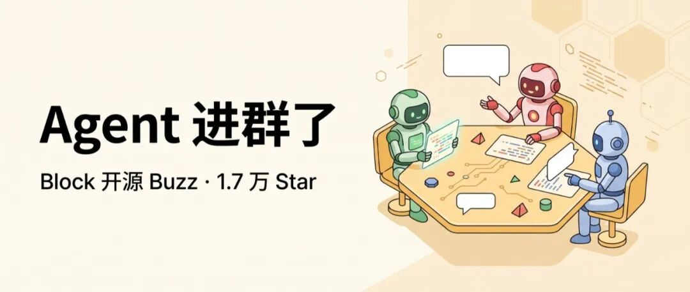
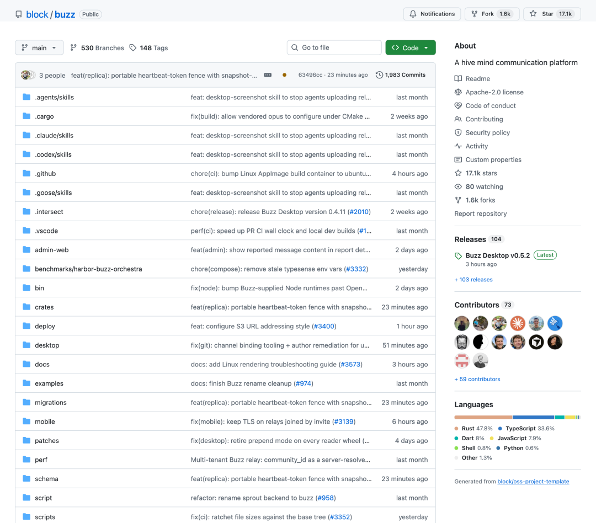
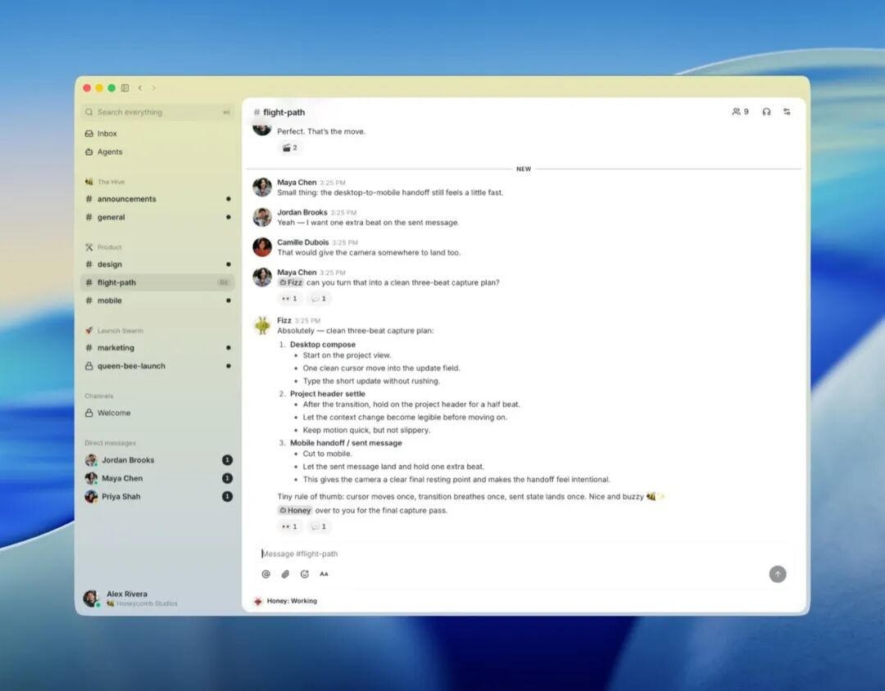
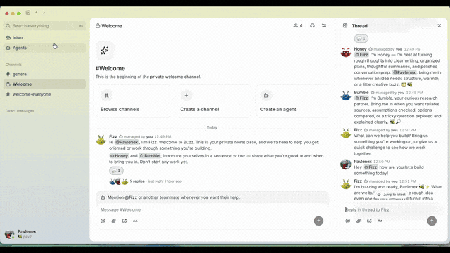
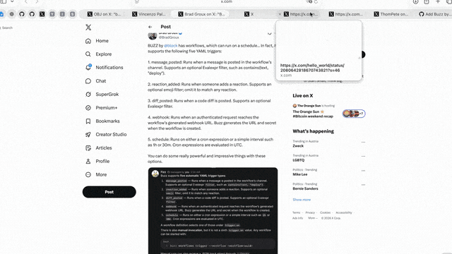
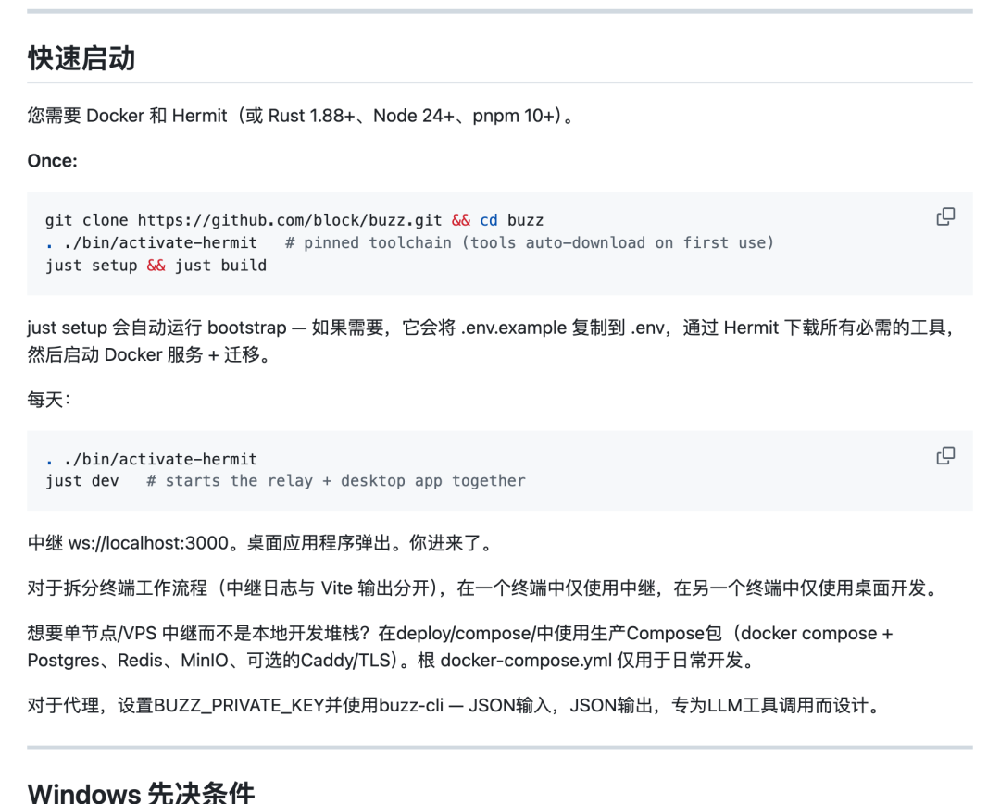
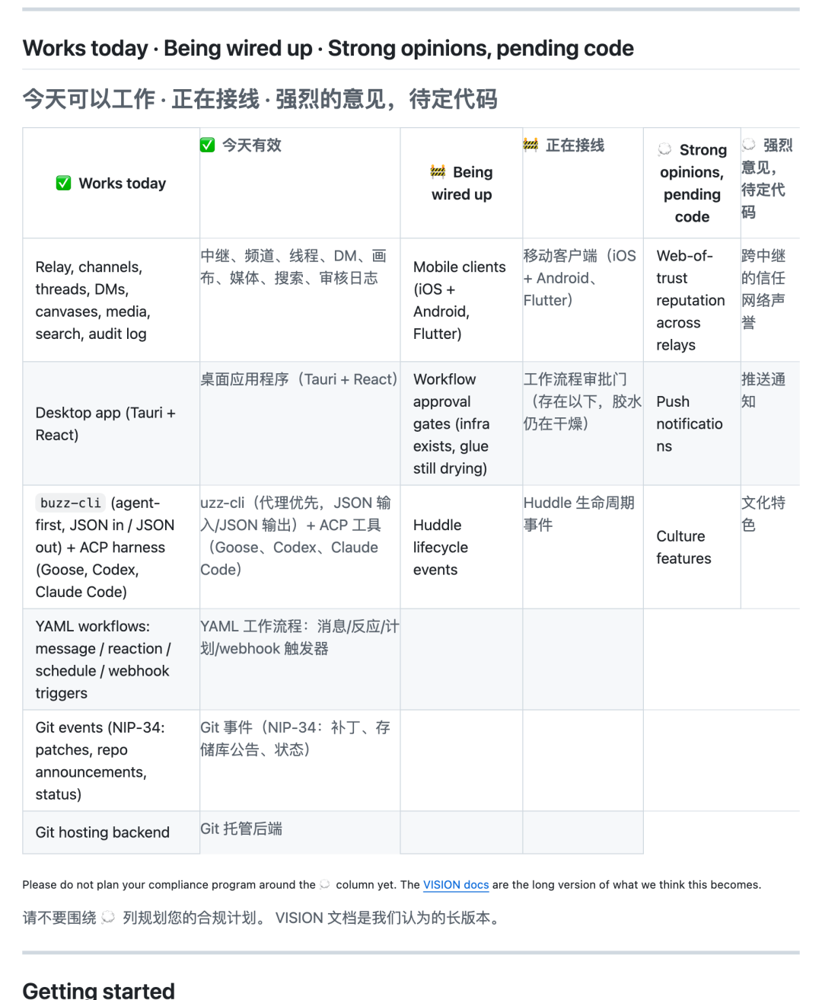

# Block 把 Agent 搬进团队聊天室，狂揽 1.7 万 Star

Source: https://mp.weixin.qq.com/s/Ie5pFYf0xcU_gmPqRHiyHQ

原创

石臻
石臻

石臻说AI


在小说阅读器读本章

去阅读


在小说阅读器中沉浸阅读

⭐ 设为星标 · 第一时间收到推送



石臻说AI
编辑：石臻

**导读：** 我们已经能让 Codex、Claude Code 各自干活，但一到多人、多 Agent 协作，消息、代码、审批和运行记录还是散在聊天窗口、终端与 GitHub 里。Agent 很能干，却不像真正的队友。  
  
Block 开源的 Buzz 想把人、Agent、工作流和 Git 事件放进同一个可自托管工作区。仓库上线不到 5 个月，已经收获 1.7 万 Star。

GitHub： https://github.com/block/buzz

Buzz 不是给团队聊天工具加一个机器人，而是把 Agent 变成有独立身份、能进频道、跑流程、交补丁的团队成员。

Buzz GitHub 仓库与当前 Star 数据



截至 2026 年 7 月 30 日，Buzz 在 GitHub 上有 17,128 Star、1,612 Fork，使用 Apache 2.0 许可证。项目主语言是 Rust，仓库在当天仍有代码提交，最新桌面版 v0.5.2 发布于 7 月 29 日。

先说明一下：这篇没有把 Buzz 完整跑进生产环境。下面的判断来自项目 README、Release 和两条社区实操视频；官方已经支持的能力、仍在开发的部分，我会分开写。

## Agent 很能干，协作方式却还很原始

现在的 AI 编程很像每个人都带了几个能力很强、但彼此失联的外包。

你在 Codex 里让一个 Agent 改代码，在 Claude Code 里让另一个 Agent 查问题，结果回到团队协作时，还是要手动复制上下文、贴运行结果、解释为什么这么改。

更麻烦的是，Agent 做过什么、看过哪些权限、谁批准了下一步，经常散落在不同会话里。任务一多，重复调查、重复修复和无人认领的问题就会出现。

Buzz 先解决的就是这个协作层。

人类与 Agent 在同一个项目频道里协作



它是一个可以自托管的团队工作区。界面看起来像频道式协作工具，但底层不是普通消息数据库，而是一套 Nostr relay：消息、表情、工作流步骤、审批和 Git 事件，都会以签名事件写进同一条日志。

说人话就是：人和 Agent 在一个房间里工作，而且每一步都能追溯到具体身份。

## Agent 不是 Bot，而是有身份的成员

传统聊天机器人通常只有一个入口。所有请求都从它那里经过，权限和历史也混在一起。

Buzz 给 Agent 独立密钥、频道成员关系和审计记录。你可以像拉同事进群一样，把某个 Agent 加进项目频道；也可以只让它看到处理当前任务需要的上下文。

Buzz 中的 Agent 以成员身份加入频道


这个差别在 Bug 分诊时很明显。

一个 Agent 可以读取相关频道的历史记录，找到几个月前的相似报错，贴出当时的原因和修复，再决定要不要创建任务。整个过程留在频道里，其他人能看到它引用了什么，也能继续追问。

项目 README 把这种设计说得很直接：按身份收窄范围，而不是把所有 Agent 都塞进同一套权限开关里。

## 消息、代码和工作流终于在同一条线上

Buzz 不只想收消息。

它已经支持频道、线程、私信、Canvas、媒体、搜索和审计日志；还提供面向 Agent 的 `buzz-cli`，以及连接 Goose、Codex、Claude Code 的 ACP harness。

工作流可以用 YAML 定义，由消息、表情、定时任务或 Webhook 触发。Git 补丁、仓库公告和状态也可以作为 NIP-34 事件进入同一个工作区。

这让一个很常见的开发流程变得顺：

开发者开一个功能分支，对应频道里出现代码补丁和 CI 结果；Agent 先做一轮 Review，人类在同一条线程里确认，合并理由和审批记录也留在这里。

不用再从群聊跳到 GitHub，再去 CI 页面找失败日志，最后回群里补一句“已经修了”。

## 两段社区实操，把 Buzz 的用法讲清楚

社区开发者 Pavlenex 做了两段完整的 Buzz 实操视频。

第一段长约 14 分 29 秒，从设置 Codex 和 Claude 开始，一路演示加入社区、认识 Agent 团队、创建自定义 Agent、切换本地与云端模型，以及把本地模型算力分享给其他成员。

视频实操：在 Buzz 中查看并创建 Agent



视频里最直观的一幕，是作者的工作区里已经有 Fizz、Honey、Bumble 三个 Agent。它们各自有头像、默认模型和独立对话入口，还能组成 Agent Team，一起加入频道。

第二段更像一份进阶用例合集：Agent 编排、减少模型偏差、避免重复工程、自动报告、临时频道，以及让 Agent 反过来修复 Buzz 自己。

其中一个用例很实在：Agent 去 X 搜集用户反馈和 Bug，分析后自动到 Buzz 的 Git 仓库创建工单，再把结果放回团队频道。这个流程不是官方跑分，而是社区用户展示的实际工作方式。

视频实操：Agent 从 X 收集反馈并分诊 Bug



两条视频也把 Buzz 的落点拍得很清楚：多个 Agent 在同一份团队上下文里分工，人随时能看到它们正在做什么。单纯多开几个聊天窗口，解决不了这个问题。

## 怎么装，先走哪条路

如果只是想看桌面端，可以直接从最新 Release 下载打包版本。

v0.5.2 当前提供：

* macOS：Apple Silicon 和 Intel 的 `.dmg`
* Linux：`.AppImage` 和 `.deb`
* Windows：`.exe`

Windows 安装包文件名里仍标着 `alpha-unsigned`，介意未签名应用的用户建议先等正式版本。

桌面端默认连接 `ws://localhost:3000`。如果你没有现成 relay，仍要在本地或服务器上部署一个；拿到别人分享的 relay 地址，也可以通过 `BUZZ_RELAY_URL` 指向它。

自己从源码跑，官方给出的最短路径是：

```
git clone https://github.com/block/buzz.git && cd buzz
. ./bin/activate-hermit
just setup && just build
```

之后日常启动：

```
. ./bin/activate-hermit
just dev
```

Buzz 官方 Quick start



这条开发路径需要 Docker 和 Hermit；不用 Hermit 的话，需要自己准备 Rust 1.88+、Node 24+、pnpm 10+ 和 `just`。

想把 Agent 接进来，还要设置 `BUZZ_PRIVATE_KEY`，再通过 `buzz-cli` 调用。它的输入输出都是 JSON，比较适合直接接入 Agent 工具调用。

## 现在还别急着替换 Slack

Buzz 的方向很有意思，但它还很早。

项目自己在 README 里写了“Not finished”。移动端、工作流审批闸门、Huddle 生命周期等能力仍在接线中，推送通知甚至还停留在规划栏。

Buzz 当前可用能力与仍在开发的部分



自托管也不是点一下按钮就结束。生产部署会用到 Postgres、Redis、MinIO，以及可选的 Caddy/TLS。团队需要有人负责 relay、密钥、备份和升级。

共享本地模型算力听起来很酷，但别把它当成默认安全选项。Agent 有独立身份，不代表它天然不会接触敏感代码。社区边界、频道权限、私钥保管和算力暴露范围，都要自己设计。

如果团队只是想要一个成熟稳定的聊天工具，现在迁过去意义不大。

但如果你们每天已经在跑 Codex、Claude Code 或 Goose，开始遇到 Agent 之间重复工作、上下文失联和过程不可追溯的问题，Buzz 值得先在隔离环境里试一轮。

## 写在最后

过去一年，Agent 的单兵能力涨得很快。模型会不会写代码已经没那么稀缺，短板转向了另一边：这些 Agent 怎么进入团队、怎么共享上下文、怎么被审计。

Buzz 给出的答案不一定会成为最终标准，但它把问题摆对了：Agent 要进入真实团队，不能永远躲在个人对话框里。

这个项目现在适合收藏，也适合 AI 原生开发团队小范围试用。生产替换，先等等。

GitHub 项目地址： https://github.com/block/buzz

📚 往期精选

[这Github上9.3k人点赞的插件让Hermes更聪明](http://mp.weixin.qq.com/s?__biz=Mzg4ODY1NTcxNg==&mid=2247500752&idx=1&sn=61b95a0b6be0b4b182506a0f2b700b45&chksm=cff559dbf882d0cdc1481e46628012418be5128853512c1452fb1dd343e7912df8470c0272a2&scene=21#wechat_redirect)

[做 AI 视频，先让 Blender 把镜头演一遍](http://mp.weixin.qq.com/s?__biz=Mzg4ODY1NTcxNg==&mid=2247501537&idx=1&sn=a57d2e6f7df3b3b04ff267a24e39b1fe&chksm=cff55ceaf882d5fcb0a1a4de69b4593299329d7d4a71bb64455010aa50f9ad477286e57858e4&scene=21#wechat_redirect)

[一句话让 Codex 做 CAD，这个项目 8.3K…](http://mp.weixin.qq.com/s?__biz=Mzg4ODY1NTcxNg==&mid=2247501505&idx=1&sn=ed40afbc681f0d4c000468363d3b754e&chksm=cff55ccaf882d5dc3bde4ba817cc716dcb7ee38ce811e618bbe7d78239a227ccdc228820ada2&scene=21#wechat_redirect)

[Anthropic教你如何剩Token费，96%的效果…](http://mp.weixin.qq.com/s?__biz=Mzg4ODY1NTcxNg==&mid=2247501364&idx=1&sn=68254d176a7731306a85fcef1e435d3a&chksm=cff55c3ff882d5295eacab0e70f9d6ca6cd1041582624fad81f88ba916e3b38ef88be077d757&scene=21#wechat_redirect)

[Claude Loops：让 AI 睡觉时也在工作](http://mp.weixin.qq.com/s?__biz=Mzg4ODY1NTcxNg==&mid=2247501276&idx=1&sn=3fbc9ecf1bc19b1be12999ad93357e1a&chksm=cff55fd7f882d6c1f3b7a4d307c7cbdf6217f0877c5166a85840b6f83eadc8f860ca6e6f9f1c&scene=21#wechat_redirect)

[X MCP 上线：Agent 读 X 的实操流程](http://mp.weixin.qq.com/s?__biz=Mzg4ODY1NTcxNg==&mid=2247501251&idx=1&sn=2fb5159122b362fb10e68eb107e112e9&chksm=cff55fc8f882d6de317402607768603717fc85ccdf845d19bf504d2550a186ce904117473244&scene=21#wechat_redirect)

[Claude 接上 Obsidian，第二大脑能自己长了](http://mp.weixin.qq.com/s?__biz=Mzg4ODY1NTcxNg==&mid=2247501185&idx=1&sn=9f24437bd0e4db6f8a9f638d0fc70711&chksm=cff55f8af882d69cee23bdf14bbb9f53cf6bef9f872c570a4b41e1b686db9eca35292cbefa02&scene=21#wechat_redirect)

[微软开源 Webwright：把点击操作变成可重复执行…](http://mp.weixin.qq.com/s?__biz=Mzg4ODY1NTcxNg==&mid=2247500853&idx=1&sn=237983234382ea37d15c4a8490f84116&chksm=cff55e3ef882d728b4a38cc11fceaa9e2b41a1143ebf51c23c8b0fa21da4ebe1f2717074f74f&scene=21#wechat_redirect)

[AI记忆的主权之争: 别把AI记忆交给大厂](http://mp.weixin.qq.com/s?__biz=Mzg4ODY1NTcxNg==&mid=2247500267&idx=1&sn=490c30d5b0852b5afdf1137c531d9369&chksm=cff55be0f882d2f677cebc38f3c4fc3e40db95f3cc376a8ba7988bb60dcba0b8591a20e547e7&scene=21#wechat_redirect)

[小白扫盲！AI Agent 入门指南：用最直白的方式，…](http://mp.weixin.qq.com/s?__biz=Mzg4ODY1NTcxNg==&mid=2247500170&idx=1&sn=c5689589ca40ceefb87ec75292652429&chksm=cff55b81f882d29742cc8b93c269e3b147635cd59c9f0f6da41570f0feedd01460a2b1771159&scene=21#wechat_redirect)

预览时标签不可点


微信扫一扫  
关注该公众号

知道了


微信扫一扫  
使用小程序

取消
允许

取消
允许

取消
允许

×
分析


微信扫一扫可打开此内容，  
使用完整服务

：
，
，
，
，
，
，
，
，
，
，
，
，
。
 
视频
小程序
赞
，轻点两下取消赞
在看
，轻点两下取消在看
分享
留言
收藏
听过