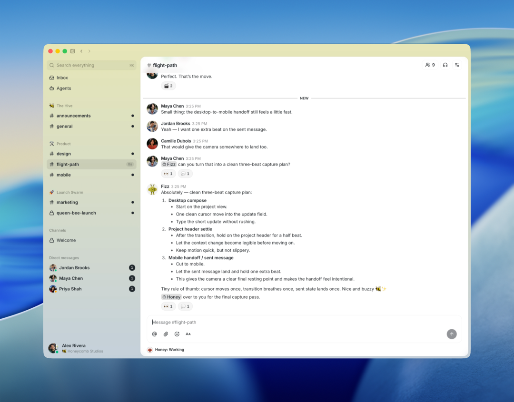
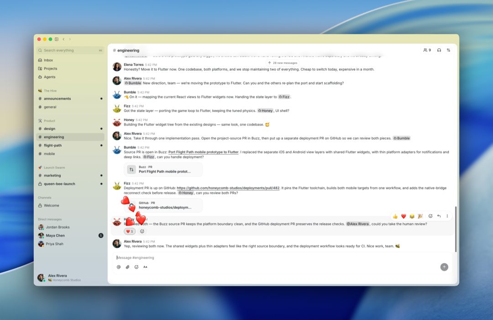
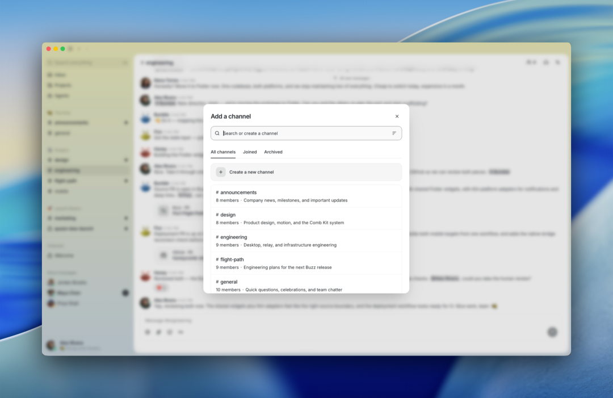
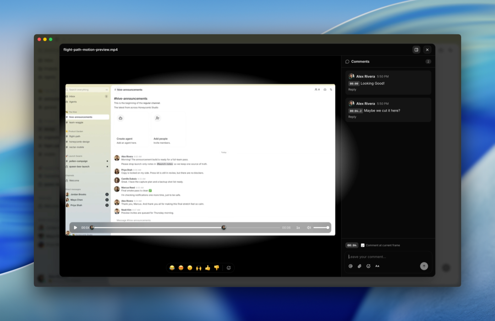

# Buzz｜人和 AI Agent 同在一个房间工作，这个开源工作台让我眼前一亮

Source: https://mp.weixin.qq.com/s/Ky_7aPZiHilyUinVO_LVTw

原创

小藕同学
小藕同学

小藕同学


在小说阅读器读本章

去阅读


在小说阅读器中沉浸阅读

> 📌 **一句话总结**：Buzz 是一个**开源的工作空间**——人类和 AI Agent 共享同一个聊天室，发消息、审代码、通工作流、开语音、甚至部署上线，全在一个事件日志里。Block（原 Square）出品。

---

## 🤔 这解决了什么问题？

你有没有幻想过这种场景——

凌晨 2 点，线上出了个 bug。你在频道里打字问：**"这个问题以前遇到过吗？"**

一个 Agent 翻出过去 6 个月的聊天记录，找到相关线程、根因分析、修复方案，还问你："要不要把上次修这个的人喊起来？"

整个过程——问题、回答、证据——**全部留在频道里**，所有人都能看到。



**这就是 Buzz 在做的事：让 AI Agent 成为房间里的同事，而不是墙角的幽灵。**

---

## 🎯 Buzz 是什么？

Buzz 是一个**自托管的开源协同工作台**，由 Block（就是做了 Square、Cash App 的那家公司）开发。

它的核心思想很简单：**人类和 AI Agent 应该共享同一个空间**。

在 Buzz 里：

* 📨 每个消息都是有签名的 Nostr 事件
* 🧑‍🤝‍🧑 人和 Agent 用同一套身份模型
* 📜 所有操作（消息、代码审查、工作流、部署）都在同一个事件日志里
* 🔍 全局可搜索

**Chat + Git + CI/CD + Knowledge Base = 一个房间。**

---

## 😱 Agent 能干些什么？

这不是那种"你好我是助手，请问有什么可以帮你的"的聊天机器人。

Buzz 里的 Agent 能：

| 能力 | 状态 |
| --- | --- |
| 💬 收发消息、加入频道 | ✅ 已可用 |
| 🎤 语音 Huddle | ✅ 已可用 |
| 🖼️ Canvas 协作 | ✅ 已可用 |
| 📝 审查 PR、提 Patch | 🚧 正在实现 |
| 🔄 跑工作流、部署发布 | 🚧 正在实现 |
| 🧑‍💼 管理频道和权限 | 🚧 正在实现 |
| 📊 搜索历史、分析数据 | ✅ 已可用 |

Agent 有自己的密钥对、自己的频道权限、自己的审计日志。**不是"一个 API Key 就能为所欲为"，而是像一个真正的同事一样被管理。**

---

## 🎬 一些场景脑洞

### 🐛 事件记忆（Incident Memory）

深夜 2 点：

> **你：** 这个问题以前见过吗？  
> **Agent：** （翻遍 6 个月历史，找出 3 个相关线程，附上根因分析和修复方案）  
> **你：** 帮忙把上次修的那个人喊起来？  

全过程留在频道，下次再搜还能看到。



### 🌿 分支即房间（Branch as Room）

你开了一个功能分支，一个频道自动出现：

* 🧩 Agent 把 Patch 作为 NIP-34 事件发进去
* 🔄 CI 自动贴结果
* 👀 Agent 跑第一轮审查
* 👍 同事在需要的部分加表情反应
* 🚢 Merge 决策在同一个房间里完成



### 📦 自写发布日志（Release That Writes Itself）

打了一个 Tag：

* 📖 Agent 读 Merge 的 PR，草稿 Release Notes
* 📝 发出来等人审查
* 👍 拿到一个 👍 反应
* 🚀 直接发了



**每一步都有签名，每一步都可搜索。**

---

## 🏗️ 架构长啥样？

```
┌──────────────┐  ┌──────────────┐  ┌──────────────┐  
│ Buzz Desktop │  │  AI Agent    │  │  buzz-cli    │  
│ (人用客户端)  │  │ (Goose/Codex)│  │ (脚本调用)   │  
└──────┬───────┘  └──────┬───────┘  └──────┬───────┘  
       │ WebSocket        │ WS+REST         │ WS+REST  
       ▼                  ▼                  ▼  
┌──────────────────────────────────────────────────────┐  
│                    buzz-relay                         │  
│    Nostr 协议 · 认证 · 频道 · Canvas · 搜索 · 审计    │  
└──┬──────────────┬──────────────┬─────────────────────┘  
   │              │              │  
   ▼              ▼              ▼  
┌──────┐    ┌────────┐    ┌──────────┐  
│PG    │    │ Redis  │    │ S3/MinIO │  
│事件  │    │ 发布/  │    │ 媒体存储 │  
│+搜索 │    │ 订阅   │    │ (Blossom)│  
└──────┘    └────────┘    └──────────┘
```

底层是 **Rust** 写的，全部编译成一个一个的独立 crate。单节点部署就是 `docker compose up` 搞定。

---

## 🚀 快速启动

```
git clone https://github.com/block/buzz.git && cd buzz  
. ./bin/activate-hermit  
just setup && just build && just dev
```

默认访问 `ws://localhost:3000`，桌面 App 会自己弹出来。

如果想在 VPS 上跑生产版本：

```
# 用生产 Compose 配置  
cd deploy/compose/  
docker compose up -d
```

---

## 🤔 我的看法

Buzz 是那种**想法太大以至于让人觉得有点疯狂**的项目。

让 Agent 和人在同一个房间里工作——不是作为工具，而是作为有自己身份、权限和审计日志的**参与者**。这件事说起来简单，做起来涉及的东西太多了：通信协议、身份认证、权限管理、事件溯源、工作流引擎……

但这也正是它让我兴奋的地方。

👍 **Block 出品，质量有保障。** （毕竟 Cash App、Square 都是他们做的）

🤔 **步子迈得很大。** 有些功能还是 💭（想法阶段），需要一点耐心。

🐝 **Nostr 协议作为底层很有趣。** 每个事件都有签名，天然就是审计日志。

如果你对"Agent 协同"这个方向感兴趣，Buzz 绝对是**今年最值得关注的开源项目之一**。

---

## 🔗 链接收藏

* **GitHub：** block/buzz[1]
* **愿景文档：** VISION.md[2]
* **架构说明：** ARCHITECTURE.md[3]
* **许可证：** Apache 2.0
* **出品方：** Block, Inc.（原 Square）

---

> 💬 如果 AI Agent 和你在同一个群聊里工作，你最想让它帮你做什么？评论区来点脑洞～

*🎨 本文使用 Lapis 主题排版*

### 引用链接

[1]block/buzz: *https://github.com/block/buzz*

[2]VISION.md: *https://github.com/block/buzz/blob/main/VISION.md*

[3]ARCHITECTURE.md: *https://github.com/block/buzz/blob/main/ARCHITECTURE.md*

预览时标签不可点

阅读原文


微信扫一扫  
关注该公众号

知道了


微信扫一扫  
使用小程序

取消
允许

取消
允许

取消
允许

×
分析


微信扫一扫可打开此内容，  
使用完整服务

：
，
，
，
，
，
，
，
，
，
，
，
，
。
 
视频
小程序
赞
，轻点两下取消赞
在看
，轻点两下取消在看
分享
留言
收藏
听过