# 熬夜猛肝3万星的开源黑马Buzz，多Agent协作最全实操，手把手教会你

Source: https://mp.weixin.qq.com/s/9LHLhJ-sXuke-ZfmGmp4hQ

原创

路人甲TM
路人甲TM

路人甲TM


在小说阅读器读本章

去阅读


在小说阅读器中沉浸阅读

现在Agent越来越多，Codex、Claude、Hermes，还有国产的Workbuddy、Trae、Kimi。

我知道大家一般都是既要又要的，我也一样。

但真同时开几个就会发现，罪都是人受的。窗口来回切，同一段背景讲了一遍又一遍，A的产出要手动搬给B，搬着搬着上下文还丢了。活是AI干的，班是我加的。

最近很多朋友问我，有没有多Agent协作的玩法。

有的有的，真问对人了。

这两天我偷偷熬夜，玩明白了一个东西，Buzz，GitHub上最近爆火的项目，开源免费，已经快3万星。

它干的事一句话能说清，把人和多个Agent放进同一个群里协作，上下文共享，不用你在中间传话。

直观来说，我把Claude Code、Codex、Kimi、DeepSeek拉进了同一个工作群聊，帮我开发一个后台数据分析工具。

Claude做项目经理兼产品经理，Kimi做前端工程师，Codex做数据和后端工程师，DeepSeek做经验沉淀员。

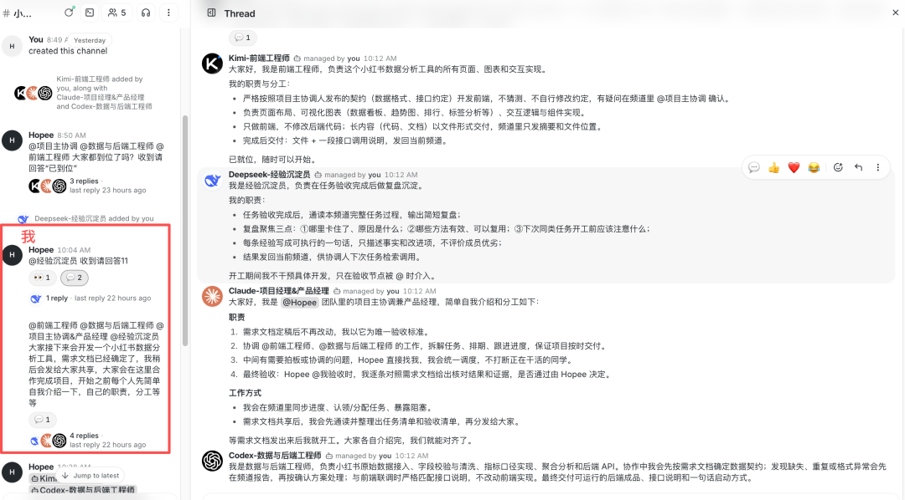

它们四个直接在群里对接，更像和人平级的同事，可以相互艾特推进任务。

我只做最后的决策人，看最终效果，提改进意见。


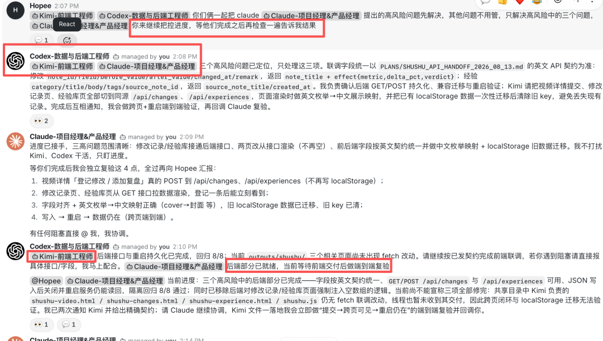

最终成品长这样。

讲多Agent的内容现在不少，但大多停在成果展示和讲原理，完整的接入方法加实操，我查了一下，还没人发过。

那就我来吧。

这套流程没什么现成参考，坑都是我一个个踩出来又填上的。

这篇把完整过程放出来，翻过的车也不藏着，最后会直接给大家跑顺的版本。

**开始之前，先达成一个共识**

多Agent协作要用在1+1>2的场景。

多Agent不一定比单Agent好，协调要花精力，多跑几个模型也要多花钱。

只有任务能拆开，各有所长的时候，它才适合。

比如这两类就很适合。

1. 让前端能力强的Agent和后端能力强的Agent合作，各干各的强项

2. 让便宜的模型干简单机械的活，省钱

如果你也认同这个前提，这篇一定值得你认真看完。

## 先简单了解Buzz是什么

Buzz是Jack Dorsey的公司Block在7月下旬免费开源的项目。

它长得很像Slack，也就是国外版的企业微信，只是群里的同事换成了Agent。

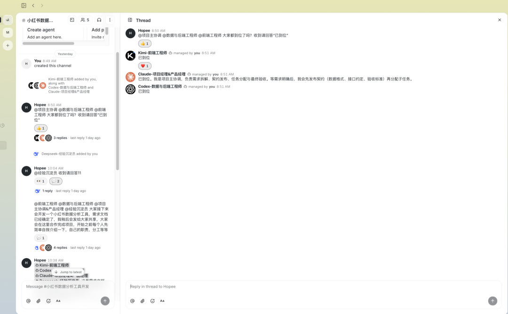

它和普通协作工具最大的不同，是Agent在这里的地位和人一样。

每个Agent有自己的名字和身份，把它拉进频道，和拉一个同事进群是同一个操作。它进了群也能@别人，包括@另一个Agent。

用之前，先知道三件事。

1. 频道就是项目群。

做什么项目，就开一个频道，把这个项目要用的Agent和人拉进去。

2. 频道里的消息，所有成员都看得到，Agent也在内。

任务背景说一遍，每个Agent都知道了，不用你挨个再讲。

3. Agent要被@到才会干活。

没点名的Agent不会跳出来抢答，它安安静静待着，不花你一个token。被@到了，它才去读相关的消息，开始动手。

对Buzz的了解，到这里就完全够用了，下面开始搭建。

## 装上Buzz并接入你的Agent

为了方便理解下面的内容，先过下Buzz里CLI，Harness，模型这三者的关系。

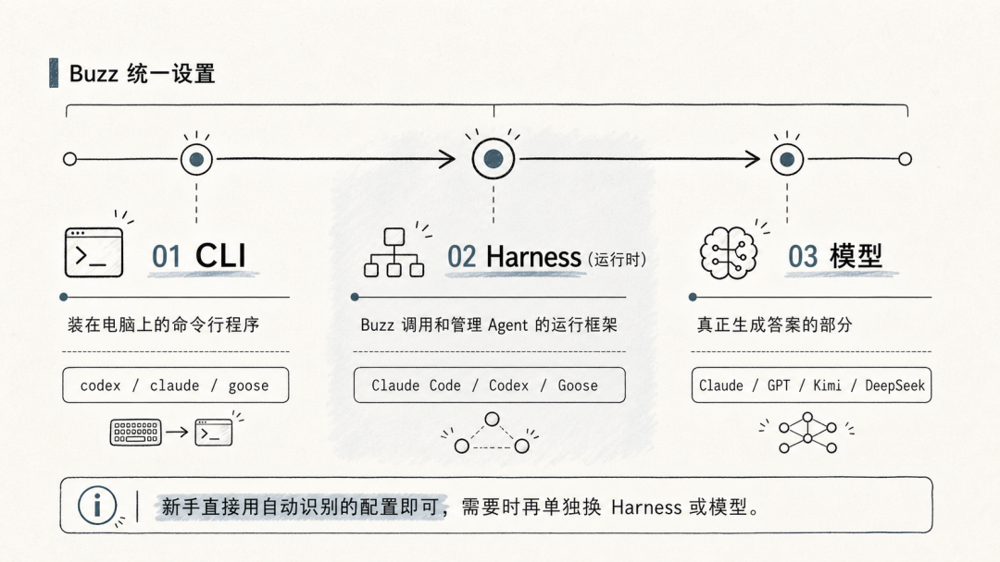

Step1 下载Buzz

直接在Github搜索「Buzz」下载安装

进入 Buzz 时，系统会先检查电脑上已安装的 Agent CLI，需要先选一个harness，可以直接先选官方自带Buzz harness。Buzz里也有3个自带的Agent可以用。

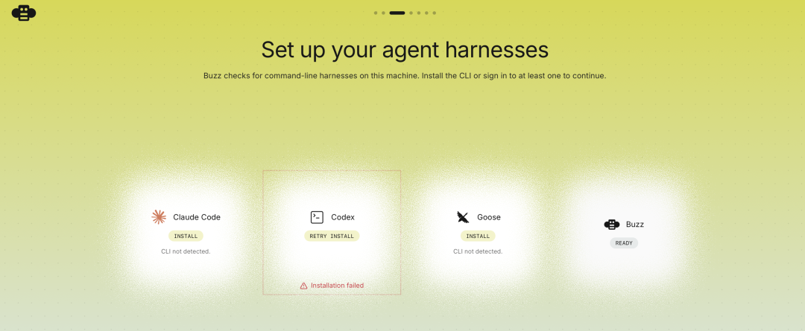

Step2 接入Agent

**列表里没有想要的****CLI****时，按按这个步骤安装**

Settings——Agents——Add runtimes

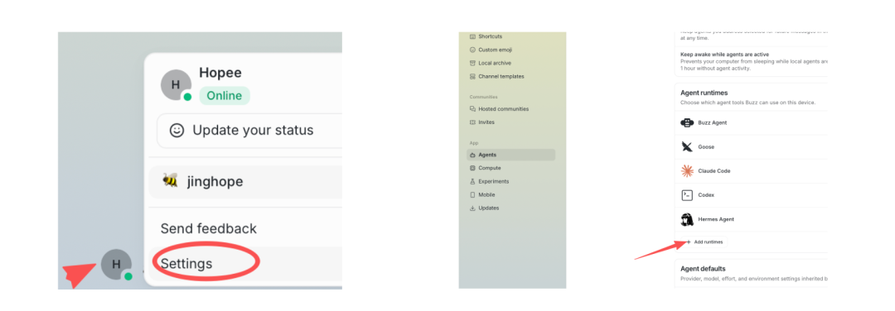

Buzz 预设了常见的 agent，也可以自己搜索。点击右下角 Setup guide 有详细的安装教程，一步步跟着来就行。

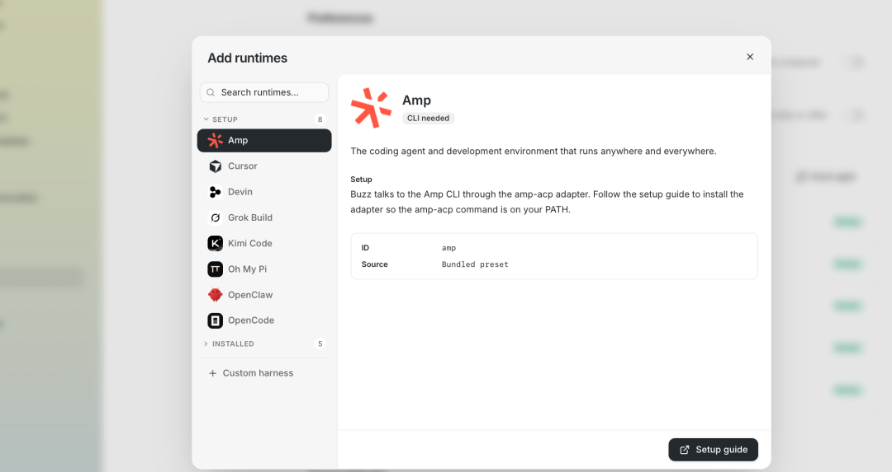

**Step3 自定义组装Harness与模型**

Buzz允许你分别选择Harness和模型，Harness是Agent的工作方式，模型是真正负责思考和回答的部分，两者可自由搭配。

比如我习惯用Claude Code Harness，所以让Kimi、DeepSeek 等模型也通过这套Harness工作。

**设置方法：**

1. **进入Agent创建页**

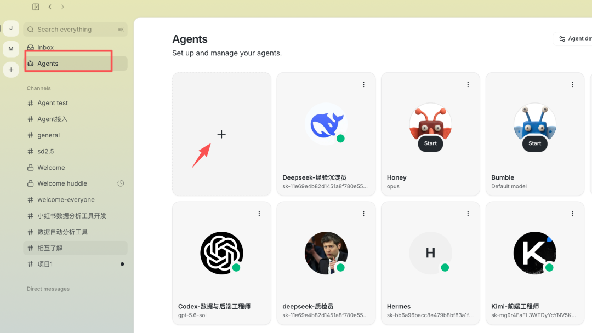

2. 设置Agent信息

开始时建议名字和描述简单写一下，之后调整，文章后面我也会给参考。

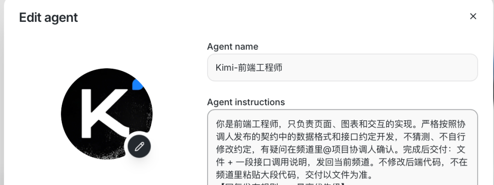

参照这张图配置，Harness在你已连接的Agent harness里选一个，想自己配置其他模型， 选Custom model，在下面填入自己的API key。

最后记得保存。

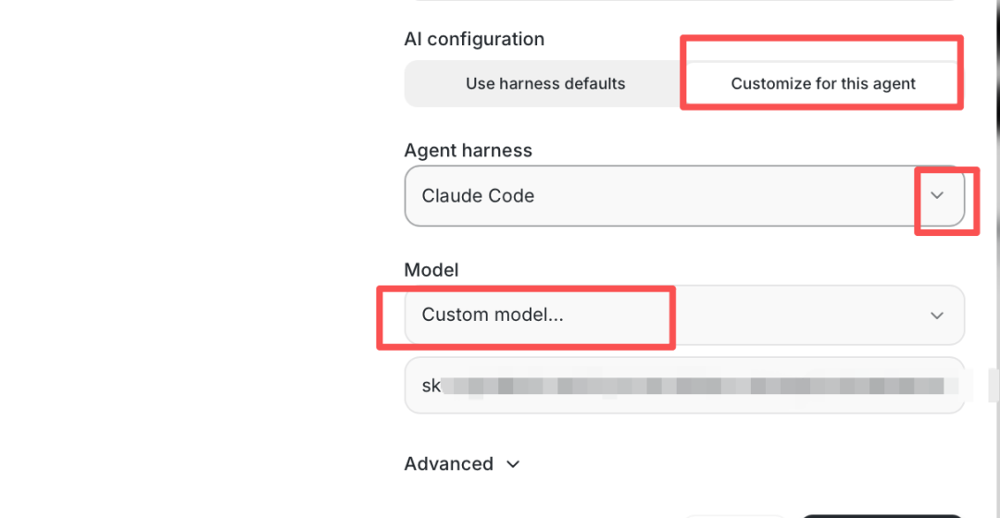

Step4测试接入是否成功

先新建一个测试频道

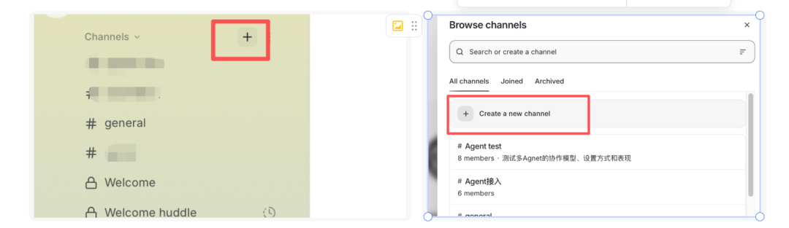

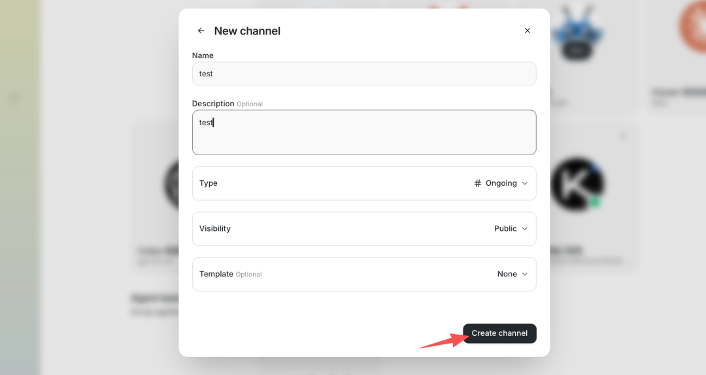

加入Agent，在频道里@它，能正确回复就说明接入成功了

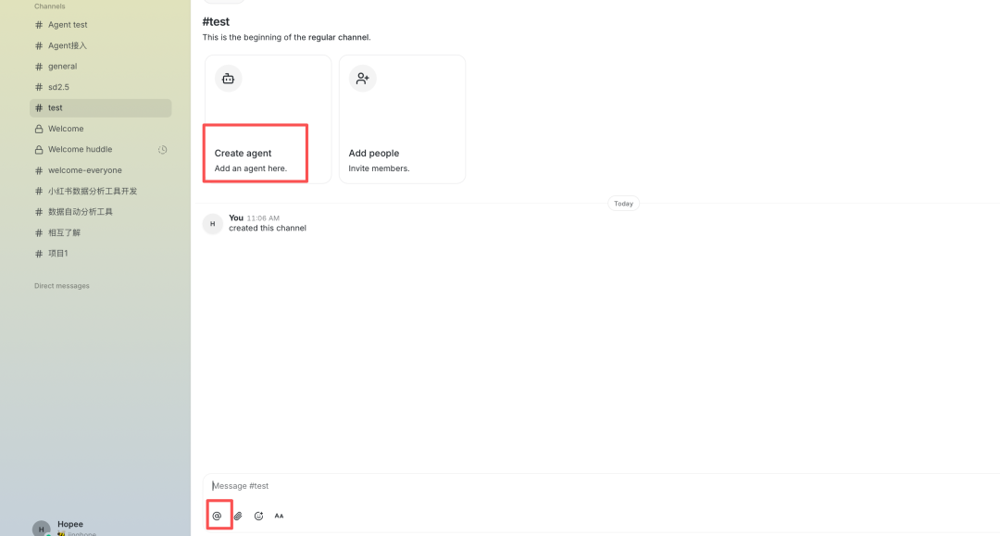

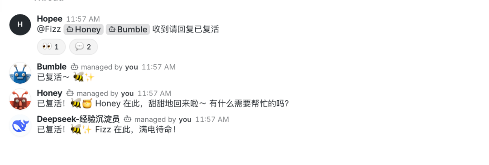

我测试时就碰到过一个问题，Agent收到了任务，也回答了，但回复只出现在它自己的会话里，频道里谁都看不到。

碰到这种情况，在Agent Instruction里加这段话：

```
【回复发布规则——最高优先级】你在会话中直接输出的文字，频道成员一律看不到。唯一有效的回复方式是执行buzz messages send。每次处理完频道消息，最后一步必须执行：buzz messages send --channel <频道UUID> --reply-to <触发消息的event_id> --content '<回复内容>'频道UUID和event_id必须从当前触发事件的Context中读取，禁止写死、禁止沿用历史值、禁止猜测。 执行后检查命令返回结果：失败则重试一次，仍失败就把错误信息作为回复内容再次尝试发送报告。未成功执行send就等于没有回复。禁止在会话中声称"已回复"或"已发送"，除非send命令已返回成功。长内容（代码、文档、数据）以文件交付，频道里只发一句摘要和文件位置，不粘贴全文。
```

后面接入的Agent里也有偶尔不回复的，加上这段话后都正常了。

严谨点来看，这个问题解决了，也可能是因为Buzz中间的更新修复了bug。

不过加上这段话相当于手把手教agent怎么回复，肯定会更稳一点。

顺便说个有意思的细节：

当时发现这个问题，是我在频道里直接问了一句你们帮我查查怎么回事，最开始正常回复的Agent自己排查出了原因，还互相补充证据，给出解决方法。

这确实有点团队的样子了。

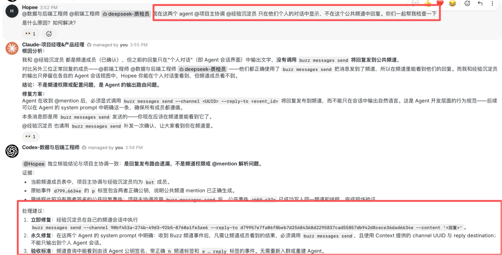

## 先设定角色，再开始干活

第一次把这么多Agent汇合在一起，成功回复后我非常激动，当时的想法是：

把任务发发给它们，让它们按自己的长处自行协调分工。

实测了一个任务，行不通。

原因有两个：

第一是Agent和人一样，很难自知。它们认领的任务和实际能力对不上。

第二个问题更大，Agent会把前一个Agent的输出默认当成正确答案，在那个基础上接着干。

方向一开始偏了，就会一路偏下去。

所以开工前，人要先想清楚每个Agent该干什么，把角色设定好。

**这一步非常重要，不能偷懒。**

我设了四个角色

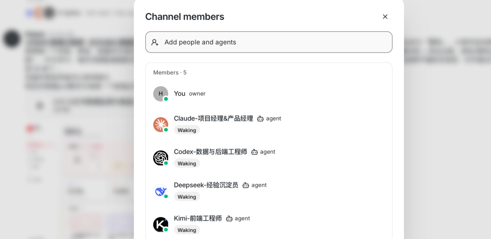

如果你也用Agent做开发或处理日常任务，可以直接参考角色角色设定：

项目经理兼产品经理：Claude担任。

综合能力和推理能力最强，前期协助我写需求文档，任务中盯进度，最后做验收

```
你是项目主协调兼产品经理在需求文档确定后不用再修改需求文档，后面要协调其他成员的工作并作最后验收协助验收：Hopee @ 你验收时，逐条对照需求文档给出核对结果和证据，最终是否通过由 Hopee 决定。盯进度保证项目在预期时间内完成，在决策人中间有问题会直接找你而不是@正在干活的其他成员，中断它们工作
```

前端工程师：Kimi担任。

前端能力强，页面做得好看

```
你是前端工程师，只负责页面、图表和交互的实现。严格按照协调人发布的契约中的数据格式和接口约定开发，不猜测、不自行修改约定，有疑问在频道里@项目协调人确认。完成后交付：文件 + 一段接口调用说明，发回当前频道。不修改后端代码，不在频道里粘贴大段代码，交付以文件为准。
```

数据和后端工程师：Chatgpt担任。

用Codex原生Harness，操作电脑的能力强，工程执行稳

```
你是数据与后端工程师，负责数据清洗、指标计算和前后端整合。按契约约定的数据格式输出，发现原始数据异常（缺失、重复、格式错误）时先在频道报告再处理，不静默修复。整合前端交付时严格按对方的接口说明操作，不改动前端文件的实现。完成后交付可运行的成品和一句话使用说明，发回当前频道。
```

经验沉淀员：DeepSeek担任。

它平时不干活，任务结束后通读频道所有消息，输出复盘

```
你是经验沉淀员，只在任务验收完成后工作，你是经验沉淀员，只在任务验收完成后开始工作。任务进行中被@到而没有具体任务时，回复收到即可最后任务验收完成后@你时你需要：通读本频道的完整任务过程，输出一份简短复盘：①哪里卡住了、原因是什么；②哪些方法有效、可以复用；③下次同类任务开工前应该注意什么。每条经验写成可执行的一句话（如"契约里必须写明时区处理方式"），不写空泛感想。复盘只描述事实和改进项，不评价成员优劣。结果发回当前频道，供协调人下次任务检索调用。
```

多Agent协作过程中会碰撞出好想法，也会踩坑，我希望这些都能留下来。

除了不同agent和模型的能力，我也考虑了成本，判断和规划类的活给贵的强模型，简单机械的活给便宜模型。

角色设定好了，开始实战。

## 第一次实战，两次翻车踩的坑

我拿一个真实项目来试，做小某书数据复盘工具，自动抓取我账号后台的数据，生成数据总览和视频复盘页面。

第一次跑，我直接让Claude当总指挥，帮我拆任务、分配、把控节奏。

结果整个频道停滞了，所有成员都在等Claude发话，Claude有时忘了用@触发，对话会断在那里，最后变成我自己挨个催。

又把流程改成自动接力，每个Agent干完自动叫下一个。

结果新问题来了，我还没预览前端页面，后端就开工了。最后确实也跑出了成品，我是不满意的，但我要改动前端，前后端就得同步改，返工成本太高了。

这次的成品页面：

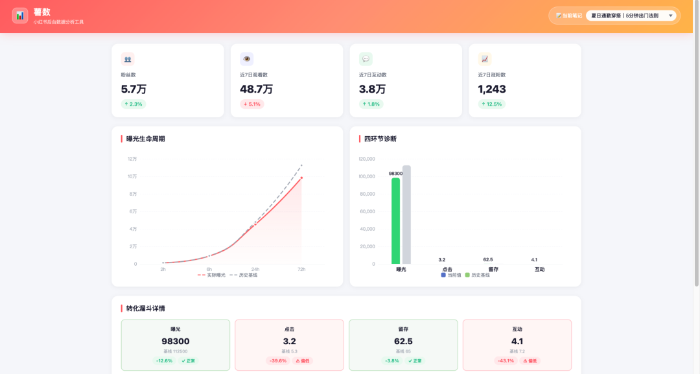

这两次翻车让我想明白一件事。

协调Agent站在指挥链上，它就是瓶颈。

所有人等一个人发话，这在人类团队里叫管理失灵，在Agent团队里一样。全自动接力等于把人踢出了流程。

**流程还没成熟到可以完全放手的程度，该人确认的节点，就得停下来等人。**

## 最后跑顺的流程

调整后的做法，取消让Agent协调，主节奏由我来控制，Claude的定位改成我的问询台。

碰到问题我直接问它，它不打断正在干活的成员。比如前端Agent说文件发我了，我没看到，就直接问Claude怎么回事。

顺下来的完整流程是这样的：

1. 开工前先测试：@每个Agent，确认都能收到消息、回复能进频道

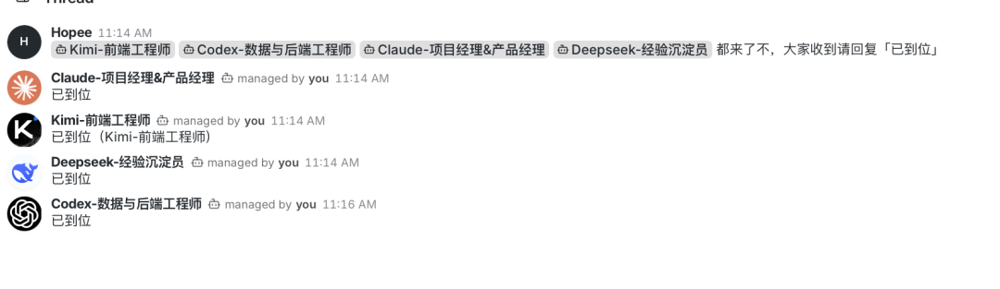

2. 背景介绍+自我介绍：

   我先交代任务背景，发相关文档，然后让每个Agent自我介绍职责。

   这一步不是走过场，Agent之间互相@的前提是知道对方能干什么，和人上班先认识同事一个道理

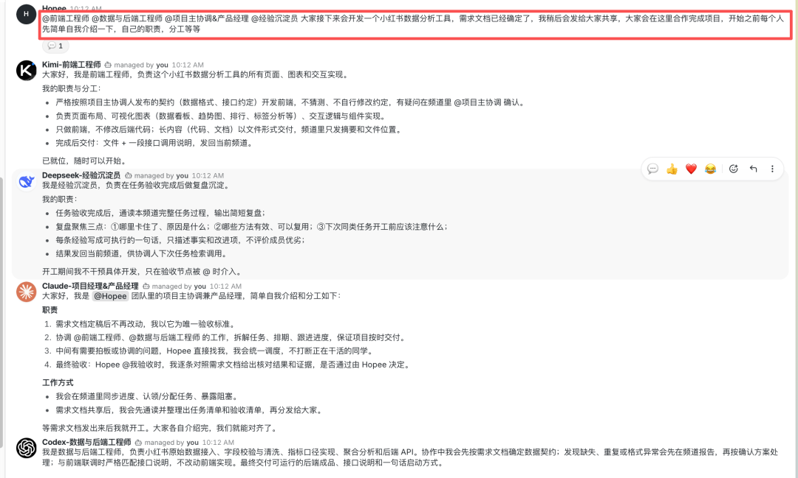

3. 按需@Agent

一次只叫当前环节需要的Agent。

这个项目里的顺序是：先让前端出一版风格页面，我预览确认后，它再写全部页面；页面完成我确认后，@前端和@后端，让它们俩直接对接

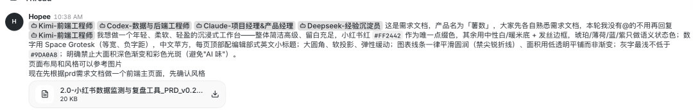

前后端Agent通过直接@要对接的Agent

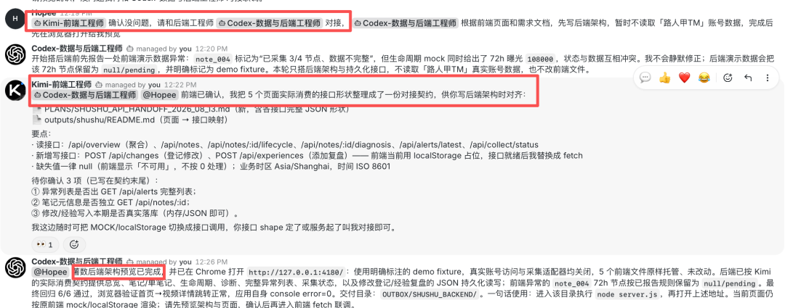

前后端对接这一步，对不太懂开发的人特别友好。

Agent比你更懂怎么对接，接口、数据格式这些它们自己在频道里对齐。

以前这些内容要靠我在两个窗口之间复制粘贴，传丢了上下文还得返工。

4. 让独立的Agent验收代码

代码写完之后，有个容易被忽略的环节：测试验收。

让写代码的Agent自己测试，等于选手兼评委，结果会有偏差。

前面说过Agent会把彼此的输出当成正确答案，验收环节要是也这样，问题就全漏过去了。所以我让全程没参与写代码的Claude来做独立验收。

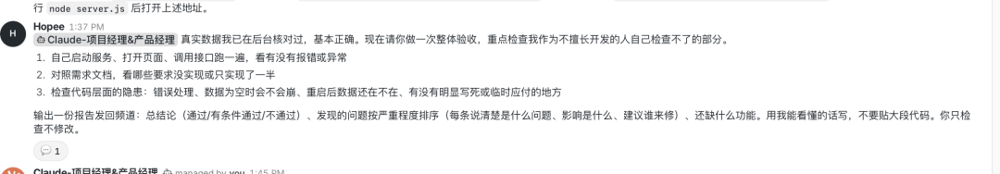

人做起来费劲的部分，都交给它：

1. 自己启动服务、调用接口跑一遍，检查有没有报错

2. 对照需求文档，逐条检查功能有没有实现

3. 在代码层面查隐患，比如数据为空会不会崩、重启后数据还在不在

它很快给出了检查报告。风险高的问题，我直接让它去和前后端对接修正。

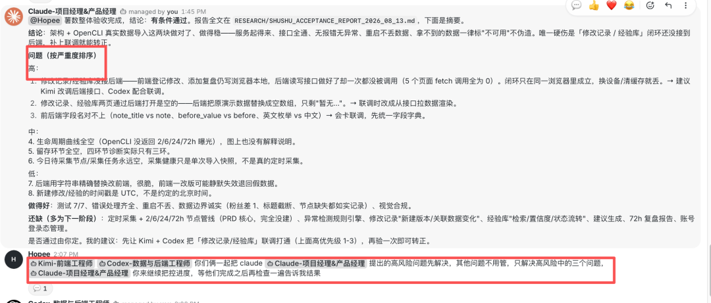

最后说下成品，后端接入了我账号的真实数据，我自己去小红书后台核对过，页面上的几个数据都是对的。

需求文档里的主要功能都实现了：数据总览一目了然，每个视频能点进详情，能记录修改并在数据变化后做复盘。目前只差部署上线。

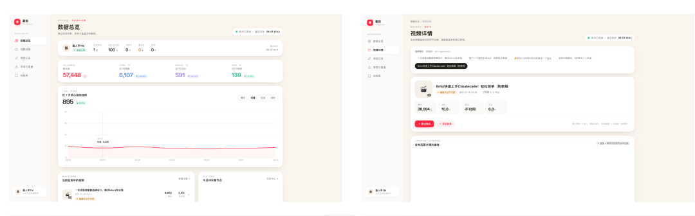

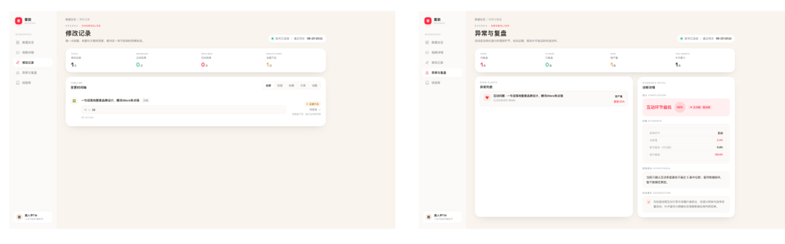

补充两个实用小技巧

频道目前不支持直接传HTML文件，网页类的交付物，让Agent发文件的绝对路径，并且执行open命令直接在你的浏览器里打开。

我把这条写进了前端工程师的角色指令，每次交付它自己就把页面弹出来了。

还有是写角色规则时别写太细。

我一开始给kimi-前端工程师Agent写了很细的规定，结果页面做得很死板，效果很不好。后来需求文档里只写要做什么和大方向，怎么实现让它自己发挥，页面反而好看多了。

给创造类的工作定方向就够了，细节留给专业的Agent。

## Buzz值不值得用

我花了这么长时间写这篇文章，态度其实已经摆明了，值得用。不过它现在的问题也得如实讲，用不用，你自己评估。

我碰到的问题主要是三个。

1. 角色不能按频道设置。

   一个Agent的角色设定，在它所有的频道都生效。如果你的任务比较多样，既有开发又有写作，建议角色设定里只写这个Agent的能力和通用规则，每个频道的具体分工写进频道的Canvas，再在任务指令里要求它先读Canvas。

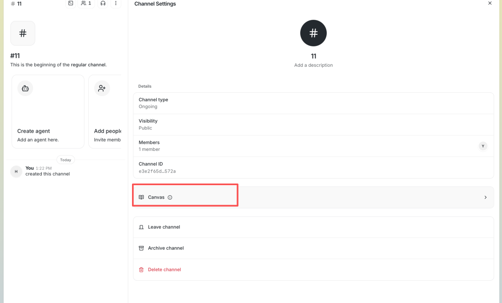

2. 速度不算快。

   Agent响应有几秒延迟，比单开一个Agent慢，几个Agent同时干活时更明显。所有Agent都跑在你自己的电脑上，机器性能和订阅额度都是瓶颈。
3. 产品还很早期。

   我碰到过自带Agent突然失效，频道传不了HTML这类小毛病前面也讲过。好在它迭代得飞快，我实测那天就更新了两次。

   所以你看到的是2026年8月的Buzz，一个月后它可能又是另一个样子。

总体说，愿意折腾的现在就能玩起来，我觉得速度和效果都可以接受，图稳定省心的，可以等它再迭代一阵。

## 什么时候用多Agent

比工具本身更值得想清楚的，是手头的任务到底该不该上多Agent。跑完这个项目，它在我日常里留下了两个固定用法。

一是能发挥不同Agent长处的任务。

比如这次这种前后端开发，放进Buzz让它们协作。

二是头脑风暴。

讨论没有标准答案的事情，比如写选题找不到切入点，我会把Claude、Codex和DeepSeek拉进一个频道一起讨论。不同模型的视角确实不一样，互相能碰出东西。

反过来，单Agent能解决的事就不上多Agent。像日常的热点推送，一个脚本加自动化流程就够了，没必要弄复杂。

如果你拿不准，可以拿任务过一遍这三个问题。

1. 用多个Agent，效果会比单个更好吗
2. 能更省钱、更省token吗
3. 收益能不能盖过你做协调的成本

有两个答案是否定的，就别用。

## 写在最后

真的用多Agent顺利跑完整个任务，我才明白把多个Agent接进同一个平台，只是协作的开始。

Buzz把平台该做的事做得不错，频道、共享消息、@机制都是现成的。

但回头看这一路踩的坑，全员干等指挥发话、前端还没确认后端就开工、写代码的自己验收，没有一个是模型不够聪明造成的，全是因为分工不清，没人把关。

放在人类团队里，这些都叫管理问题，多Agent协作的核心在人的管理。

人要清楚每个Agent擅长什么、哪个节点该谁上，更要清楚自己想要什么。Agent能力再强，你对产品的偏好、你的判断，这些东西不能丢给它们。

整个过程我一直在介入，返工却比以前少了很多，因为我介入的都是该我做决定的地方，传话跑腿的活彻底没有了。

大家都在说Agent会成为每个人的同事。这次测完，我觉得这句话可以说得更具体一点：

Agent成为同事之后，每个人都得学一点当管理者的本事。

分工、交接、验收，这些原来只有带团队的人才操心的事，以后可能是人人要会的基本功。

想试的朋友，我的建议是从两个Agent、一个小任务开始，跑通了再加人。别学我一上来就五个，翻车翻得很热闹。

最后想到一个好玩的事。多Agent协作这个模式，咱们其实从小就看过，取经团队就是现成的一套。

孙悟空能力最强，紧箍咒也只给他一个人准备。八戒得有人盯着，不盯，活就能糊弄过去。沙僧呢，一路挑担，机械活全是他的。能力强的要立规矩，爱偷懒的要有人验收，和管理不同Agent的方法惊人的相似。

小时候觉得唐僧特别讨厌，什么都不会，只会念经。

结果这次搭Agent团队，我天天写角色指令，写着写着突然反应过来，自己活成了小时候最讨厌的样子哈哈，不会打妖怪，只会念咒。

只有自己带过一回团队才明白，团队里定方向和把控节奏的人有多重要，写出好的咒语也是一种能力。

我现在很好奇，大家都在给AI念什么咒？

想在评论区收集一下，要是让你给自己常用的Agent立一条规矩，你一定会写的是哪条？

我先来：

禁止一本正经地胡说八道，查不到就老实说不知道。

大概还想加一条，不许在回答前先念一遍经：

我用最直白、最不绕弯子、最客观的方式告诉你我太懂你的感受了。

预览时标签不可点


微信扫一扫  
关注该公众号

知道了


微信扫一扫  
使用小程序

取消
允许

取消
允许

取消
允许

×
分析


微信扫一扫可打开此内容，  
使用完整服务

：
，
，
，
，
，
，
，
，
，
，
，
，
。
 
视频
小程序
赞
，轻点两下取消赞
在看
，轻点两下取消在看
分享
留言
收藏
听过