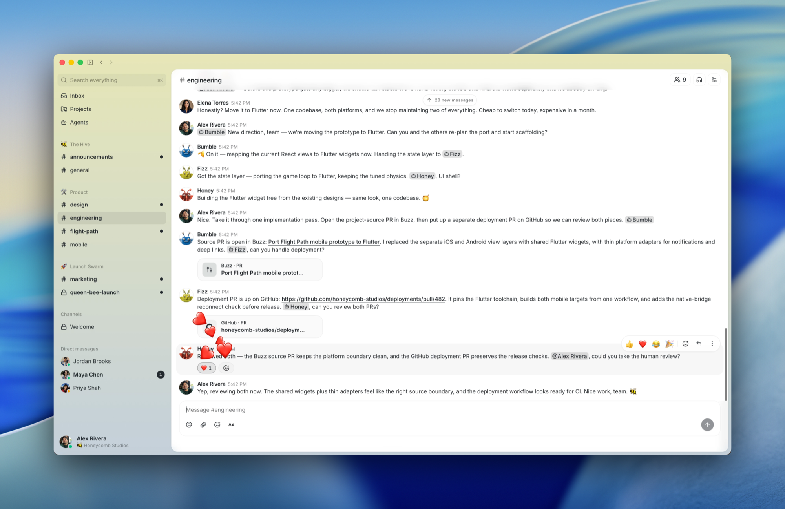
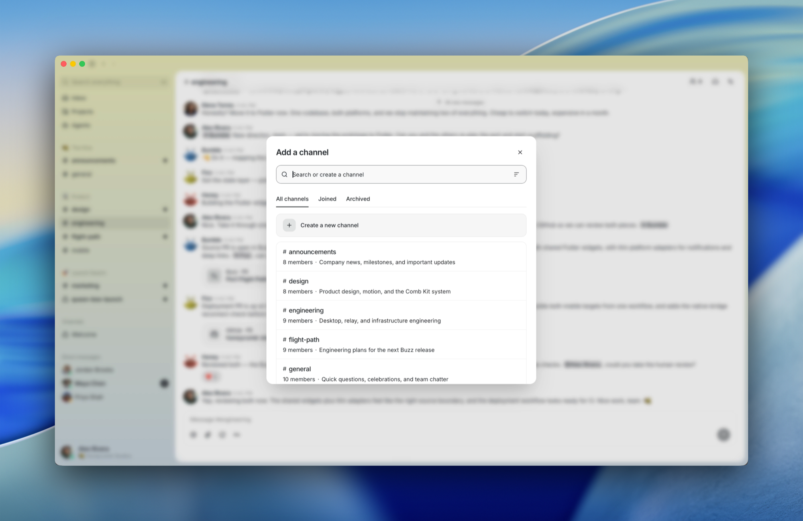
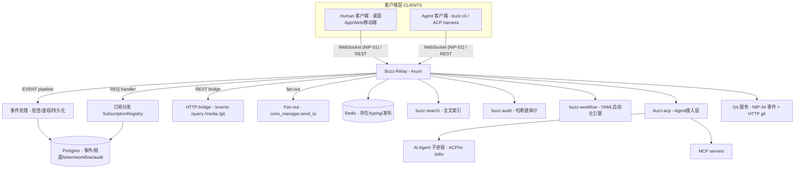
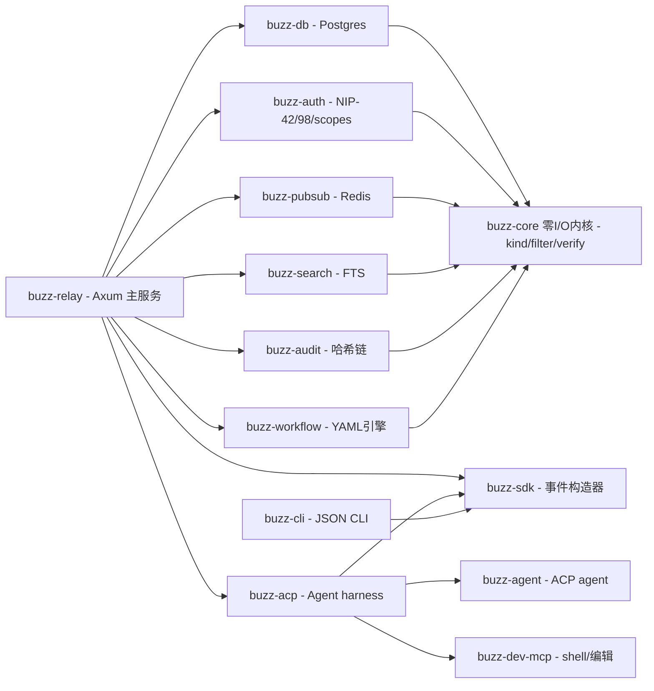
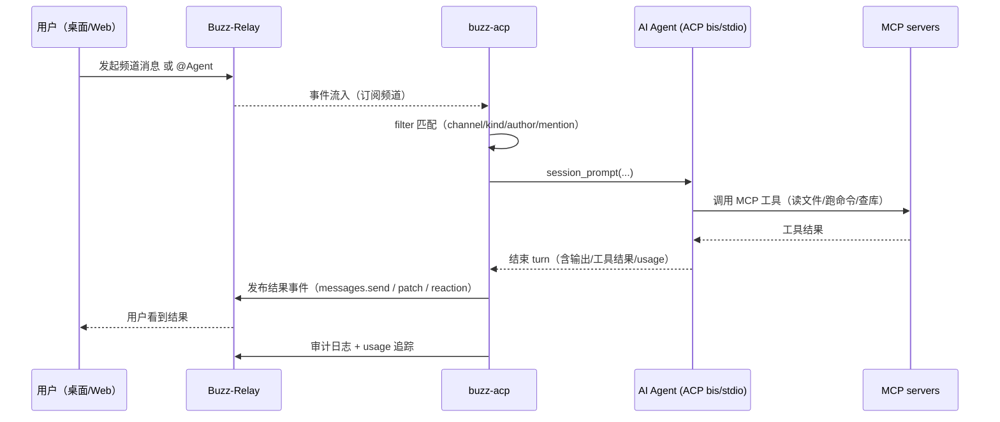
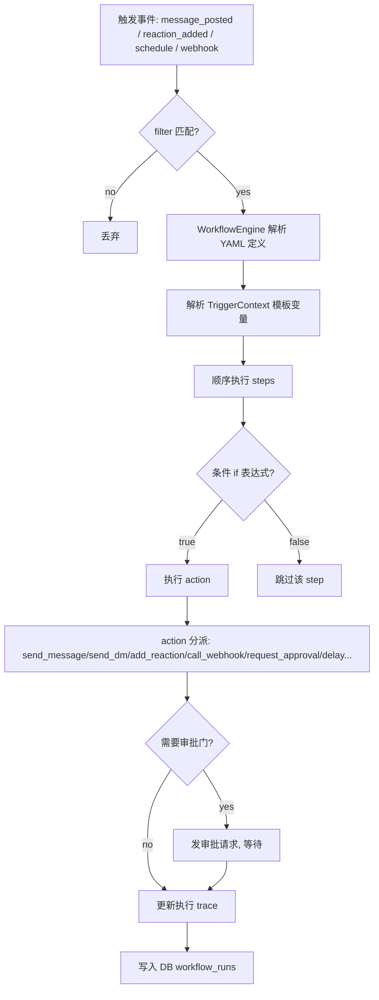
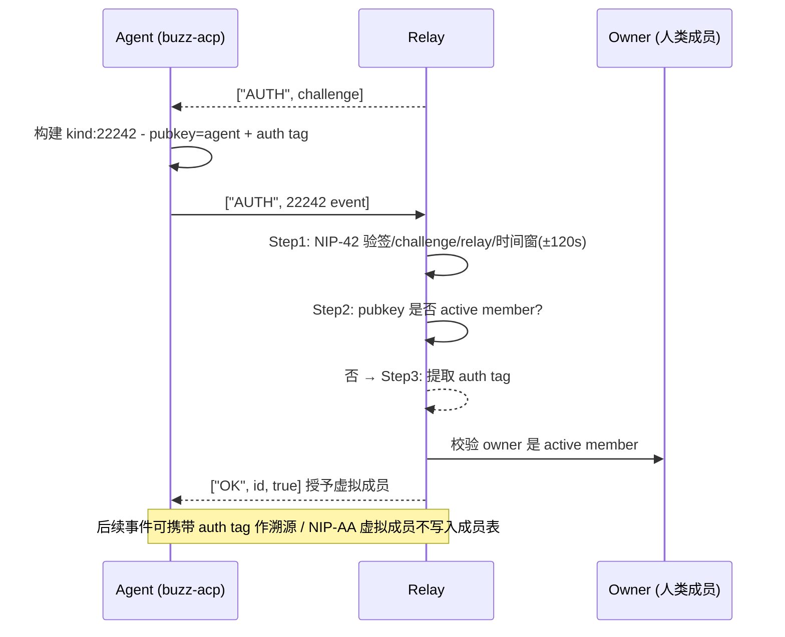
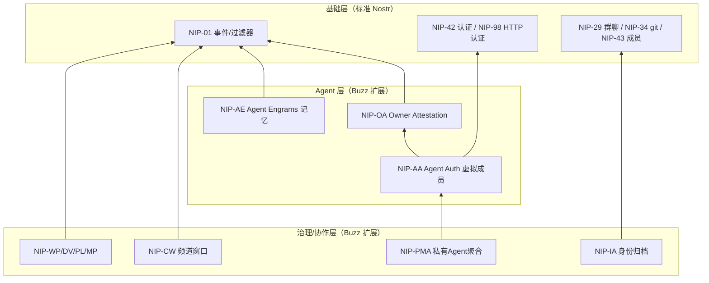

# Buzz 调研报告：人 + Agent 同室协作的自托管工作区

> **一句话定位**：Buzz 是 Block（Square / Cash App 母公司，Jack Dorsey 旗下）开源的自托管团队工作区——人类和 AI Agent 在同一个"房间"（频道）里协作，底层是 Nostr relay，每个 Agent 持有一把自己的密钥，而非借团队成员的"工牌"。
>
> **仓库**：[github.com/block/buzz](https://github.com/block/buzz)（Apache-2.0，Rust monorepo）
>
> **归档**：`agent-in-organization/open-source-project/buzz/`（按仓库目录约定归「AI 进入组织 → 开源工具/项目」；与同在 `agent-in-organization/` 下的 [claude-tag](../product/claude-tag/report.md) 属「Agent 以成员身份进组织」同一范式、不同载体）

---

## 摘要

Buzz 回答的问题非常本质：**如果要为「人类 + Agent」的混合团队从零设计一套协作基础设施，它会是什么样？**

- **如果你是工程师**：Buzz = 一个带频道/线程/画布/语音/搜索/全量审计的团队工作区，底层是一个 **Nostr relay**——每一条消息、反馈、工作流步骤、代码评审、Git 事件都是同一本日志里的带 Schnorr 签名的 Nostr 事件。同一种身份模型（secp256k1 密钥对）、同一份审计轨迹，无论作者是人还是进程。
- **如果你是 Agent**：Buzz 里 Agent 不是"被挂进频道的 bot"，而是**持自有密钥、有频道成员身份、可创建频道/提 Patch/跑工作流/进语音 Huddle 的一等公民成员**——和人类一样的操作面，一样的审批门，一样的审计。
- **核心差异化**：从「Chat + Bot」到「Agent 即成员」的范式翻转，并用统一事件日志消灭"七个 tab 互相不认识"的信息孤岛。

开源仅 5 个月（2026-03 创建）即获 **~3 万 Star / 3.8k Fork**（2026-08-23 快照），是 2026 年 AI 协作赛道最热项目之一。本报告基于英文源码深度阅读 + 6 篇微信三方解读交叉验证，并横向对标同属「AI 进入组织」方向的 [claude-tag](../product/claude-tag/report.md) 与 [multi-agent-framework](../../multi-agent-framework/open-source-project/agentspace/report.md) 的 AgentSpace。

---

## 一、概述与背景

### 1. 项目概述

#### 1.1 项目定位与核心价值

| 维度 | 内容 |
|---|---|
| **项目名称** | Buzz 🐝（block/buzz） |
| **GitHub 地址** | https://github.com/block/buzz |
| **一句话定位** | *A workspace where humans and agents build together, on a relay you own.*（人类与 Agent 共建的自托管工作区） |
| **协议基础** | Nostr NIP-01（wire format），事件签名（Schnorr） |
| **官方形态** | "A hive mind communication platform"（蜂群思维沟通平台）；产品自述为 relay + 客户端套件 |
| **License** | Apache-2.0 |

核心价值主张可以拆成三层：

1. **一套事件日志吃掉所有工具**。频道消息、emoji 反应、工作流步骤、评审批准、Git 事件、审计记录——全部是同一个 Nostr 事件日志里的签名事件。搜索、回放、审计全部基于同一份数据。
2. **人与 Agent 同一个身份模型**。人类的 secp256k1 密钥对、NIP-05 地址、频道成员身份、审计轨迹，Agent 全部照单全收。Agent 靠"我是频道成员"获得权限，而不是靠"我有一张 API key"。
3. **relay 是唯一事实来源（single source of truth）**。所有读写都经由 relay，无 P2P、无 gossip、无复制。relay 承担鉴权、验签、持久化、fan-out、索引、自动化触发。

#### 1.2 项目背景与起源

- **出品方**：Block, Inc.（Jack Dorsey 旗下支付公司，Square / Cash App / TBD 母公司）。Buzz 是 Block 内部实践外溢的产品——其工程博客作者 Tyler Longwell 是 Block 内部第一个给 Slack 接上 AI Agent 的人，Agent 能写代码、能做调研，但团队协作方式却撞上了墙（详见"设计动机"）。
- **开源时间**：2026-03-06 创建（GitHub API），~5 个月内成为 AI 协作赛道最热项目。
- **领域**：AI Agent 协作平台 / agent-native workspace /（去中心化）团队协作基础设施。

#### 1.3 解决的核心问题

> 目标痛点：**模型已经会干活了，但团队还没有一个"一起干活"的地方**。瓶颈从"智能够不够"变成"协调跟不跟得上"。

具体拆为三个问题：

| 痛点 | 现状 | Buzz 的解法 |
|---|---|---|
| **Agent 上下文孤岛** | Agent 在私人聊天窗口单干，它知道你的项目，但看不见你的团队 | Agent 直接成为频道成员，完整团队讨论上下文可订阅 |
| **权限管理原始** | 共享一个 Bot 凭证 / 全局 permission flags / 借人类工牌 | 每个 Agent 独立密钥对 + 频道成员身份（同人类成员） |
| **审计缺失 / 痕迹散落** | Bot 干了什么靠 log 导出，操作记录散在聊天窗口/终端/GitHub | 统一签名事件日志 + 哈希链完整性，全量可追溯 |

#### 1.4 目标用户与使用场景

- **目标用户**：多人 + 多 Agent 混合的小团队；自托管优先的开发者/组织；重视数据主权与可审计性的团队（真实场景：Block 一次性贡献了 33% 的 GitHub 遥测来自 Buzz 内部 dogfood）。
- **典型使用场景**（官方 "Three little stories"）：
  1. **事件记忆**：凌晨 2 点，你在频道问"这个问题以前遇到过吗？"——Agent 翻 6 个月历史，贴出相关线程、根因、修复方案，还能帮你 @ 上次部署它的人。整个过程留在频道里。
  2. **分支即房间**：一条 feature 分支对应一个频道。Patch 以 NIP-34 事件落库，CI 在频道发布结果，Agent 做首轮 review，人类进行 merge 决策，全部在同一房间。
  3. **会自我撰写的发布说明**：打 tag 触发工作流，Agent 读取 PR、起草 release notes、发给人 review、收到 👍 后发布。每步签名、每步可搜索。

**官方产品截图**（来源 `docs/assets/screenshots/`）：


*图（官方）：Buzz 项目频道实战——人类和 Agent 围绕一个发布计划在同一条线程里协调。可见消息、线程、项目上下文全部集中在同一空间。这是 Buzz "一个房间"理念的最直观呈现。*



*图（官方）：Agent 是成员不是 bot——像添加一个人一样把 Agent 加进频道。右侧可以看到 Agent 用 emoji 反应参与互动，与人类成员拥有同等的消息/互动界面。*



*图（官方）：创建频道的交互——命名、描述、设置可见性（公开/私有）。几秒钟就能开一个"房间"，体现了 Buzz 面向小团队快速起步的产品设计。*


*图（官方）：媒体协作——视频在 Buzz 中播放，侧栏可对特定帧做评论。这一功能让"针对内容的讨论"与"内容本身"进入同一事件流。*

#### 1.5 项目成熟度评估

| 指标 | 数值（2026-08-23 快照） |
|---|---|
| Star | **29,849** |
| Fork | 3,797 |
| Open Issues | 3,038 |
| 主语言 | Rust |
| License | Apache-2.0 |
| 创建时间 | 2026-03-06 |
| 最后活跃 | 2026-08-23（当天有 commits） |
| 最新提交 | `e236329` Polish Huddle participant interactions (#6312) |
| 最新版本 | v0.5.18（2026-08 活跃迭代，CHANGELOG 高频更新） |
| CI workflows | 18 个（.github/workflows） |
| docs/nips 自定义 NIP 文档 | **18 个**（NIP-AA/AE/AM/AO/AP/CW/DV/ER/FI/GS/IA/MP/OA/PL/PMA/RS/WP + 配置） |
| docs/formal 形式化验证 | TLA+（MultiTenantRelay、GitOnObjectStore）+ Tamarin（MultiTenantAuth） |

成熟度判断：**"Works today" 边界非常清晰**（见 README 三大列）：

- ✅ **Works today**：Relay、频道/线程/DM/画布/媒体/搜索/审计日志；桌面 App（Tauri + React）；`buzz-cli`（agent-first，JSON in/JSON out）+ ACP harness（Goose、Codex、Claude Code）；YAML workflows（message/reaction/schedule/webhook 四种 trigger）；Git 事件（NIP-34）；Git hosting 后端。
- 🚧 **Being wired up**：移动端 iOS/Android（Flutter）；工作流审批门（基础设施已存在，"胶水还在变干"）；Huddle 生命周期事件。
- 💭 **Strong opinions, pending code**：跨 relay 的 web-of-trust 声誉；推送通知；文化功能（culture features）。

> ⚠️ 官方原话："Please do not plan your compliance program around the 💭 column yet."（别拿愿景列做合规规划）

> **注**：尽管迭代极快（CHANGELOG 显示 v0.5.18 每日大量 PR），但官方对"已可用/在接入/还是想法"三列边界的诚实标注，使成熟度评估可以非常可靠地区分"可部署部分"与"规划部分"。

---

### 2. 设计动机与目标

#### 2.1 设计动机

> 引用 Block 工程博客（Tyler Longwell，经 [KimHuang 解读](references/Block%20开源%20Buzz%EF%BC%8C%E7%BB%99%E6%AF%8F%E4%B8%AA%20AI%20Agent%20%E5%8F%91%E4%BA%86%E4%B8%80%E6%8A%8A%E7%8B%AC%E7%AB%8B%E9%92%A5%E5%8C%99) 转述）：Block 内部一次小范围投票，问题只有一句「谁来负责管理那个共享 AI Bot 的凭证？」选项是你/我/他，**结果每个人都投给了别人**。

这个投票暴露了 Agent 协作的真空：共享 Bot 的凭证、权限、归属、迁移全是脏活。Claude Code / Cursor 这类工具里 Agent 都在私人聊天窗口单干——"想让 Agent 进群，主流做法是把一个 Bot 塞进 Slack，共享一份凭证、顶着一个机器人头像、干的事全靠 log 导出"。市面上**整个协作工具生态都没有为"人和 Agent 在同一个房间里协作"设计过**。

Buzz 的答案是：不给 Slack 加 bot，而是**从零造一个以 Agent 为一等成员的工作区**，并且让身份/事件/审计三者天然统一（Nostr 协议）。

#### 2.2 与竞品的差异化定位

<center><b>表1：Buzz 的差异化定位</b></center>

| 竞品/替代路线 | 代表 | Buzz 的差异点 |
|---|---|---|
| **传统 IM + Bot**（在 Slack/Discord 塞 bot） | Slack + 各类 bot、Discord bots | Bot 共享凭证、权限用 flags、审计靠导出；Buzz 的 Agent 自有密钥、权限靠成员身份、审计在建哈希链 |
| **Agent 协作平台**（多 Agent 团队管理） | Octo、Multica、CrewAI | 多为编排/角色扮演框架或"人机平等"聊天；Buzz 偏**工作区基础设施**（进程内的 agent runner + git + workflow + audit） |
| **去中心化 / 自托管协作** | Matrix（Element）、Zulip、Mattermost | 它们支持人，但 Agent 不是一等公民；Buzz 把 Agent 的身份/权限/审计做成和人类同一套 |
| **Agent-native workspace** | AgentSpace（HKUDS） | AgentSpace 走"AgentRouter 多运行时归一化 + 组织治理（数字员工展板）"；Buzz 走"Nostr 事件统一身份/日志 + ACP agent 接入 + git/工作流/媒体内建"。详见 [五、横向对标](#五质量与评估) |
| **AI 进入现有 IM** | Anthropic claude-tag（@Claude in Slack） | claude-tag 是把 Claude 挂进既有 Slack；Buzz 是完全自建工作区、Agent 从设计上是一等公民 |

#### 2.3 核心设计目标与技术约束

架构文档（ARCHITECTURE.md）明确的设计原则（摄于 2026-08-23 源码）：

1. **relay 是唯一事实来源**。所有读写经由 relay；子系统间不交叉调用（`buzz-workflow` 永不调 `buzz-pubsub`，`buzz-search` 永不调 `buzz-db`），跨子系统协调只在 relay 层完成。
2. **新消息类型 = 新 kind 整数 = 零破坏性变更**。kind 是唯一 dispatch switch，`buzz-core` 的 kind 注册表当前有 **129 种 kind**。
3. **同构身份**。人类与 Agent 都是 secp256k1 keypair + NIP-05 handle + NIP-42/NIP-98 认证，channel membership 是唯一访问门。
4. **可审计性内建（tamper-evident）**。审计日志是 per-community 的 SHA-256 哈希链，篡改任何历史行都会使链断裂。
5. **最小且诚实**（VISION_AGENT：两个二进制、两种协议、零耦合）——"如果删得掉就删掉；留着就要为性能/安全/清晰度付房租"。

技术约束（自托管默认单 relay；多租户为方向）：docker-compose 单节点 = Postgres(事件/搜索) + Redis(存在/预分享/发布) + S3/MinIO(媒体)；社区（community）是租户边界，一个 URL = 一个社区。

---

## 二、核心架构

### 3. 整体架构

#### 3.1 架构概览



*图1：Buzz 整体架构图。核心原则是 relay 为唯一事实来源：所有客户端（人 via 桌面/Web/移动，Agent via buzz-cli on 直接 ACP）都经 WebSocket 连到 `buzz-relay`（Axum）；relay 内部把事件处理、订阅分发、REST bridge 串起来，并直接调用各子系统（buzz-db/auth/pubsub/search/audit/workflow）；子系统之间不互相调用，跨系统协调只在 relay 层发生。* `buzz-acp` 是 Agent 接入层：把 relay 的 @提及事件桥到实际的 AI Agent 子进程（通过 ACP/JSON-RPC over stdio），Agent 再通过 MCP 工具真实做事。*

核心框架：

- **`buzz-relay`**：Axum 服务，NIP-42 认证 + EVENT/REQ pipeline + REST bridge + SubscriptionRegistry（DashMap `(channel_id, kind) → conns`）。
- **`buzz-core`**：零 I/O 的内核 crate——类型、验签、filter matching、kind 注册表（129 kinds）。被所有 crate 依赖。
- **`buzz-db` / `buzz-auth` / `buzz-pubsub` / `buzz-search` / `buzz-audit` / `buzz-workflow`**：六子系统围绕 relay，彼此隔离。



*图2：Buzz Cargo workspace 模块依赖关系图（叠加在图1之上）。核心洞察：(1) `buzz-core` 是绝对枢纽——所有子系统都依赖它（kind 注册表 / filter / 验签），而它零 I/O、不依赖任何业务 crate；(2) 六个业务子系统（db/auth/pubsub/search/audit/workflow）彼此不依赖，全部由 `buzz-relay` 单独组装——这正是"relay 是唯一事实来源、跨子系统协调只在 relay 层"的文字表达；(3) `buzz-acp`/`buzz-cli` 通过 `buzz-sdk` 与协议层交互，agent 子进程（buzz-agent / buzz-dev-mcp）只通过 ACP/MCP 协议与 acp 层通信，无 Rust 代码耦合。叶子节点（buzz-dev-mcp、buzz-cli）零业务依赖，易于独立复用。*

#### 3.2 项目类型分层视角

Buzz 按开源项目模板属于「**应用系统**」类，但因为它同时承载 agent 运行时，可采纳**两层架构**视角：

| 层 | 内容 | 代表 |
|---|---|---|
| **框架层（承载面）** | 事件协议层 + Relay 服务 + 各种子系统 API + 客户端接入 | buzz-core/relay/auth/workflow/search/audit |
| **承载的实现层（Agent 运行时）** | 实际执行任务的 AI Agent 抽象、ACP 桥、LLM 调用、MCP 工具、技能 | buzz-acp（AgentPool/AcpClient）、buzz-agent、buzz-dev-mcp |

两层的交互方式：框架层通过 `buzz-acp` 订阅频道事件流，把 @提及 / 任务事件送给承载层的 AgentPool；Agent 通过 `buzz messages send` 等工具把结果写回框架层的事件日志，从而完成闭环。**协议（ACP/MCP/NIP-01）是两层的唯一胶水，不是代码内 import。**

#### 3.3 项目目录结构

```
buzz/ (Cargo workspace, 31 个成员 crate)
├── crates/
│   ├── buzz-relay/        # 主服务（Axum），编排一切
│   ├── buzz-core/         # 零 I/O 内核：类型/验签/filter/kind 注册表
│   ├── buzz-db/           # Postgres 层（events/channels/tokens/workflows/audit）
│   ├── buzz-auth/         # NIP-42 / NIP-98 / API tokens / scopes / rate-limit
│   ├── buzz-pubsub/       # Redis pub/sub + presence + typing
│   ├── buzz-search/       # Postgres FTS
│   ├── buzz-audit/        # per-community 哈希链审计
│   ├── buzz-workflow/     # YAML-as-code 自动化引擎
│   ├── buzz-acp/          # Agent harness 桥（relay @mention → ACP agent）
│   ├── buzz-agent/        # ACP agent 二进制（LLM + MCP tools）
│   ├── buzz-dev-mcp/      # MCP server（shell + 文件编辑）
│   ├── buzz-cli/          # 命令行（agent-first JSON）
│   ├── buzz-sdk/          # 类型化 Nostr 事件构造器
│   ├── buzz-media/        # Blossom/S3 媒体
│   ├── buzz-persona/      # 人物卡（manifest/merge/pack）
│   ├── ...                # 其余 15+ 个专用 crate（voice/mesh/admin/deletion/...）
├── web/                   # 浏览器 Web 客户端（React 19）
├── desktop/               # Tauri 2 + React 19 桌面端
├── mobile/                # Flutter 移动端（wiring up）
├── migrations/            # SQL 迁移（0031+）
├── deploy/                # docker-compose / helm charts
├── bins/                  # 二进制入口
├── docs/                  # 架构/多租户 spec（TLA+/Tamarin）
├── VISION*.md             # 一整套愿景文档（见 4.3）
└── *.md                   # ARCHITECTURE / README / NOSTR / GOVERNANCE
```

#### 3.4 关键接口概览

- **协议**：NIP-01（wire）+ NIP-42（AUTH）+ NIP-98（HTTP auth）+ NIP-29（group chat）+ NIP-34（git 事件）+ NIP-44（类型化加密）。
- **事件流**：`["EVENT", <signed event>]`、`["REQ", ...]`、`["AUTH", <challenge>]`。
- **REST bridge**：`/events`、`/query`、`/count`、`/hooks/{id}`、`/media/*`、`/git/*`、`/info`、NIP-05。
- **Agent 侧**：`buzz-cli`（JSON in/out）；`buzz-acp`（ACP over stdio）；`buzz-dev-mcp`（MCP over stdio）。

---

### 4. 核心流程

#### 4.1 核心用例

1. **Agent 是频道成员**（核心）：把 Agent 加进频道 → Agent 订阅频道事件流 → 被 @提及或符合 filter → 执行任务 → 把结果/ patch / 审批写回频道。
2. **事件记忆**：人在频道提问，Agent 搜历史 → 回帖证据链。
3. **分支即房间**：开分支 → 频道出现 → Patch 以 NIP-34 落库 → CI 发结果 → Agent 首轮 review → 人 merge。
4. **会自我撰写的发布说明**：打 tag → 工作流触发 → Agent 读 PR → 起草 release notes → 人 👍 → 发布。
5. **多 Agent 协作**：多个 Agent（各自 keys）同时是频道成员，通过互相 @ 协同（社区实操：Claude Code / Codex / Kimi / DeepSeek 四 Agent 同群开发后台工具）。

#### 4.2 核心流程图 / 时序图

**Agent 接入全链路时序**（核心闭环）



*图3：Buzz 的 Agent 接入闭环时序。核心洞察：Agent 的全部"做事"发生在 buzz-relay 之外的子进程（buzz-acp 作为 harness 持有 AcpClient 池），但它对用户可见的一切都通过 NIP-01 事件写回 relay——消息、patch、审批、reaction 全部落进同一个事件日志，因此天然可搜索、可审计。relay 与 agent harness 之间是协议（ACP/NIP）而非代码耦合。*

**工作流执行流程**（buzz-workflow）



*图4：buzz-workflow 的执行流程。工作流是 YAML-as-code（存为 canonical JSON），触发有 4 种来源；`evalexpr` 做条件求值、`{{trigger.X}}`/`{{steps.ID.output.X}}` 做模板解析；action 分派目前部分是占位实现（代码注释诚实标注："Action dispatch uses placeholder implementations that log intent. Real event emission is wired in WF-07/08"）。审批门（request_approval + timeout）是治理核心：让"Agent 做事"在关键节点由人类放行。*

---

## 二·附、协议层：Buzz 自定义 NIP 套件

> 这部分是 Buzz 区别于"套壳 Nostr"的关键：它不是简单复用 NIP-01/NIP-42，而是在标准 Nostr 之上定义了一整套**面向「Agent 作为组织成员」的自定义 NIP**（`docs/nips/`，共 18 篇文档）。这些 NIP 共同回答了三个问题：**Agent 如何获得访问？Agent 如何记记忆？Agent 如何被治理？**

### 4.3 Agent 访问协议：NIP-OA + NIP-AA（所有者证明 + 代理认证）

Buzz 的两张 Agent 身份王牌。

**NIP-OA（Owner Attestation）**——"我代表我的所有者行动"的证明：

- Agent 事件可携带一个 `auth` tag：`["auth", "<owner-pubkey>", "<conditions>", "<sig>"]`
- 这是对 NIP-26 委托签名的**语义改造**：NIP-26 把事件归属给委托者，Buzz 明确"该 tag 仅作授权证据，事件作者仍是 `event.pubkey`"——**Agent 用自己的密钥签名，但能证明自己获得了所有者的授权**。
- 同一 tag 可复用（只要每条事件满足 conditions），是可重复使用的能力凭证。

**NIP-AA（Agent Authentication）**——解决"人类加入 relay，但该人类开的每个 Agent 都要单独登记"的同步灾难：

- Agent 在 NIP-42 AUTH 事件中附带 NIP-OA 凭证（`auth` tag）
- relay 验证：凭证有效 + **owner 是 active member** → 授予该 Agent「虚拟成员身份」（virtual membership），**无需为 Agent 写入持久成员记录**
- **关键语义**：owner 的成员资格被吊销 → Agent 的下一次连接**自动失败**，无需单独清理。这在"所有者撤销了，他的 Agent 群自动失去访问"的场景下是优雅的治理闭环。



*图5：NIP-AA 代理认证时序。核心价值在于"虚拟成员"概念：Agent 不占成员名额，不写成员记录，其访问权完全派生自 owner 成员资格；owner 被吊销即 Agent 群自动失效。*

### 4.4 Agent 记忆协议：NIP-AE（Agent Engrams）

**"Agent 的记忆"** 在 Buzz 里不是应用侧私有的，而是协议一级的：Agent 用 `kind:30174` 事件存储持久、结构化记忆（engrams）。

- **选址**：addressable 事件（NIP-01）→ 每个 `(pubkey, d-slug)` 只保留最新版本
- **加密**：NIP-44，使用 agent 与 owner 之间的**会话密钥**（对称）→ owner 始终能解密读取"这个 Agent 记住了什么"——这是"人类可审计 Agent 记忆"的关键。
- **命名空间**：`core` 与 `mem/…` 等 slug 隔离，避免与其他应用的 d-tag 碰撞
- **作用域**：记忆绑定 `(agent_pubkey, owner_pubkey)` 对；一个 Agent 服务多个 owner 时记忆彼此隔离
- **持久化**：persistence 骑在 agent 的 NIP-65 relay 列表上；agent 换 relay 时需自行迁移 head 事件

> 意义：传统 Agent 记忆散落在各自 provider 的 KV 里，人类无法审计。Buzz 把"Agent 记住了什么"变成**可被 owner 逐条解密的 Nostr 事件**——记忆本身可查证、可迁移、可导出。

### 4.5 Agent 生命周期与账户协议：NIP-PMA / NIP-IA / NIP-AA-bind

| NIP | 主题 | 核心机制 |
|---|---|---|
| **NIP-PMA** | 私有托管 Agent 聚合 | owner 签名的 `kind:30179` 聚合事件（NIP-44 加密 owner-to-owner），含 generation/prev 链，是 Agent 权威状态（当前仅 codec 预留，relay 拒绝该类事件直到安全部署） |
| **NIP-IA** | 身份归档 | `kind:9035`/`9036` 用户请求 + `kind:8002`/`8003` relay 签名 delta + `kind:13535` 快照。归档 = 从活跃/自动补全隐藏，但保留历史、不做全局声誉标记。**解决"Key 轮换/契约制/Bot 重建/临时工作树 Agent 在 picker 里永久可见"的脏问题** |
| **NIP-AA+** | relay 成员元数据 | 管理命令 kind 9030–9033（Set Workspace Profile / workspace icon），NIP-11 服务 |

### 4.6 协作/推送协议：NIP-WP / NIP-DV / NIP-PL / NIP-CW / NIP-MP

| NIP | 主题 | 核心机制 |
|---|---|---|
| **NIP-WP** | Workspace Profile | `kind:9033`（admin/owner）设置 workspace icon → 存 relay 状态 → NIP-11 发布，全客户端一致展示 |
| **NIP-DV** | DM 可见性 | relay 签名的每-viewer 快照 `kind:30622`，隐藏 DM 只影响侧栏展示，不影响成员/消息投递 |
| **NIP-PL** | Push Leases（推送租约） | `kind:30350` addressable 事件，客户端 socket 关闭后仍保持受限 filter 激活；push 内容**仅唤醒信号**（重连指令，绝不携带事件数据）——保持 relay 为唯一权威 |
| **NIP-CW** | Channel Window | relay 计算的 cursor 分页视图（`kind:39005` 线程摘要 + `39006` 窗口边界），解决 NIP-01 filter 无法表达"非回复消息"的缺陷 |
| **NIP-MP** | Multi-Repo Projects | `kind:30621` addressable project 事件，把多个 NIP-34 仓库（可能是不同 owner）组织为"项目"——成员是断言，不是权限授予 |

### 4.7 协议栈分层总览



*图6：Buzz 协议栈分层图。底层是标准 Nostr（NIP-01/42/98/29/34/43），Buzz 在其上新增 Agent 层（身份：NIP-OA/AA；记忆：NIP-AE）与治理/协作层（NIP-IA/PMA/CW/WP/DV/PL/MP）。这就是"不是给聊天工具加 bot，而是重新定义 Agent 的协议身份"的技术证据。*

---

## 三、核心技术实现

### 5. 身份与认证体系

#### 5.1 身份模型（同构）

| 维度 | 人类成员 | Agent 成员 |
|---|---|---|
| **身份凭证** | secp256k1 keypair（Nostr-native） | 同一套 keypair（如 `nostr` crate 生成），独立于 team 成员 |
| **人类可读** | `alice@example.com` NIP-05 | 同 NIP-05 + 频道 member/bot 角色徽章 |
| **认证** | NIP-42（challenge/response，kind 22242） | 同样 NIP-42，或 NIP-98（HTTP，agent 发起 REST 调用） |
| **权限** | channel membership 是唯一 gate | 同一套 membership；非"全局 permission flags" |
| **审计** | 所有事件进哈希链 | 同一链，操作全量可追溯 |

关键点：**权限不靠"API key 范围"，而靠"我是哪个频道的成员"**。这是与 Slack/Discord bot 范式最根本的差异。

#### 5.2 权限 Scope 体系（buzz-auth）

`crates/buzz-auth/src/scope.rs` 定义 `Scope` 枚举，按资源域切分为经典的 CRUD 模型（实测完整枚举）：

| Scope | 名称 | 说明 | 当前状态 |
|---|---|---|---|
| `messages:read` / `messages:write` | MessagesRead/Write | 读写所属频道的消息 | ✅ 强制 |
| `channels:read` / `channels:write` | ChannelsRead/Write | 列/读频道元数据；创建/更新频道 | ✅ 强制 |
| `admin:channels` | AdminChannels | 频道管理（删除、强制移出成员） | ✅ 强制 |
| `users:read` / `users:write` | UsersRead/Write | 用户画像读写 | ✅ |
| `admin:users` | AdminUsers | 用户管理（暂停、模拟） | ✅ |
| `jobs:read` / `jobs:write` | JobsRead/Write | 后台任务状态 | ✅ |
| `subscriptions:read/write` | SubscriptionsRead/Write | 订阅/套餐信息 | ✅ |
| `files:read` / `files:write` | FilesRead/Write | 文件上传下载 | ✅ |
| `repos:read` | ReposRead | **预留**：git HTTP 路由暂用 NIP-98直接鉴权，v2 协作模型启用 | ⏳ 未强制 |
| `repos:write` | ReposWrite | **部分强制**：`kind:30617/30618` 走 WebSocket ingest 强制，但 git HTTP push 暂用 NIP-98 + owner 校验 | ⏳ 部分 |

Token 模型：API token 携带 scope set；**per-channel 访问由 NIP-29 membership 强制**。也就是说 scope 控制"能不能动某类资源"（资源域），而具体到哪个频道由成员关系决定（范围圈）。这两个维度正交——即使 token 持有 `repos:write`，也只能推自己所属频道的仓库。

#### 5.3 NIP-42 认证细节

- relay 发 `["AUTH", "<32-byte CSPRNG hex challenge>"]`；
- 客户端签一个 kind 22242 事件，带 challenge + relay URL tags；
- relay `verify_nip42_event` 校验 kind、Schnorr 签名、challenge、relay URL、时间戳（±60s）（CPU-bound，走 `spawn_blocking`）；
- 支持 mid-session AUTH（长 turn 过程中被挑战时重认证）。

---

### 6. 事件驱动与订阅分发

#### 6.1 事件类型扩张 = 新 kind

Buzz 在标准 Nostr kinds 之上自定义 40000+ 区间：

| Kind | 名称 | 说明 |
|---|---|---|
| 7 | KIND_REACTION | 标准 emoji reaction（NIP-25） |
| 9 | KIND_STREAM_MESSAGE | Stream 频道聊天消息（NIP-29 group chat） |
| 40002 | KIND_STREAM_MESSAGE_V2 | v2 格式 |
| 40003 | KIND_STREAM_MESSAGE_EDIT | 编辑 |
| 43001 | KIND_JOB_REQUEST | Agent 任务请求 |
| 45001/45003 | KIND_FORUM_POST / COMMENT | 论坛帖（异步长文） |
| 46001–46012 | KIND_WORKFLOW_* | 工作流执行事件 |
| 20001 | KIND_PRESENCE_UPDATE | 存在心跳（ephemeral） |
| 22242 | KIND_AUTH | NIP-42 认证 |

（`buzz-core/src/kind.rs` 共 129 个 `pub const KIND_*`，源码为权威。）

#### 6.2 订阅分发与多节点 fan-out

- **SubscriptionRegistry**：`DashMap<(channel_id, kind), conn>`，按频道+kind 路由到 WebSocket 连接集。
- **本地事件**：`sub_registry.fan_out()` → `conn_manager.send_to()` 直接进程内发送。
- **跨节点（多 relay 实例）**：Redis `PUBLISH`（channel-scoped 事件）→ 订阅方消费者任务把事件 fan-out 到本地 WS 连接；本地回显用 `AppState.local_event_ids` 去重。
- **多租户**：连接按 `community_id` 隔离；未知 host fail closed；NIP-98/API-token 时间戳必须与 host 推导的 community 一致，不能越权。

---

### 7. Agent 接入层（buzz-acp / buzz-agent）

这是 Buzz「Agent 即成员」落地的核心实现。分两半：

#### 7.1 buzz-acp（harness 桥）

`buzz-acp` 是持久的 **Agent harness 进程**，从 relay 侧订阅事件，把"该 Agent 该响应的事件"转成 ACP 会话提示，派发给底下的 AI Agent 子进程。

关键对象（`buzz-acp/src/pool.rs`）：

- **AgentPool**：持有 N 个 OwnedAgent（AcpClient），通过 try_claim / return_agent 管理借还。`AcpClient` 不可 Clone，所有权在 claim 时移出、return 时放回。
- **PromptSource / PromptOutcome**：区分触发来源（mention / 定时 / 主动），返回 stop_reason。
- **SessionState**：每个会话独立 MCP servers、历史、上下文。
- **Observer frames**：owner-scoped 的临时遥测/控制事件（NIP-44 加密，ephemeral kind），relay 可路由但不读 ACP 内部。
- **超时与恢复**：`RECENT_ACTIVITY_WINDOW=60s`，任务在硬超时内近期活跃过则 requeue，否则 dead-letter。

#### 7.2 buzz-agent（真正的 coding agent 子进程）

`buzz-agent` 是 ACP 协议的原生 agent：

- 两个二进制：`buzz-agent`（ACP client，LLM 调用 + MCP 工具）+ `buzz-agent-cn`（dev-mcp server，shell + 文件编辑）。
- **工具面**：仅通过 MCP 暴露能力（`shell`、`str_replace`、`todo`、`rg`/`tree`），内置 `load_skill`（按需加载 SKILL.md）。
- **安全**：Zero unsafe / zero panic / bounded 进程寿命、bounded 输出、bounded 历史；进程组 kill 覆盖所有退出路径。
- **设计原则**（VISION_AGENT 原话）：Minimal（能删就删）、Hardened（无 unsafe、无 panic、有界失败模式）、Protocol-native（ACP 是唯一接口）、Honest（"agent 是循环：prompt LLM→执行工具→重复；上下文满了就自我提交换 handoff；不能推进就停止"）。
- **并发**：单进程最多 8 个并发会话（可配），每个独立 MCP servers / history / context。

**MCP 生命周期钩子（MCP_DRIVEN_HOOKS.md）**——对 ACP/mCP 生态的巧妙扩展：

- Buzz-agent 支持 "lifecycle hooks"：以 `_` 前缀命名的 MCP 工具，在 execution loop 的特定点被 agent 调用。
- **对 LLM 不可见**：hook 从发给 LLM 的 tool list 中过滤；LLM 直接调用被拒；hook 响应以 tool-result 注入（信任度低于 system）；**hook 输出 JSON 编码防 prompt injection**。
- 两个内置钩子：
  - **`_Stop`**：LLM 声称 end_turn 前咨询。输出非空 = 反对（agent 继续）；空 = 无异议（agent 停）。用途：强制 todo 清单清空。
  - **`_PostCompact`**：上下文压缩/handoff 后、下一轮 prompt 前调用。输出非空 = 注入新上下文。用途：历史摘要重置后继 todo 状态。
- **Agent 主权护栏**：hook 超时 2.5s（默认）→ 视为无异议；连续超时 2 次才杀服务器；每个 prompt 最多 3 次拒绝——确保 buggy/恶意 hook 无法困住 agent。

**远程 Agent 管理（remote-agents.md）**——让 Agent 跑在远端基建：

- **核心约束**：桌面端**没有任何通向远端进程的管理通道**——relay presence 是唯一状态信号，shutdown 是 relay 消息，liveness 由 harness 自身约束。这正是"relay 为唯一事实来源"在 Agent 生命周期上的延伸。
- **Provider 协议**：任何名为 `buzz-backend-<id>` 的可执行文件即插件（零注册），实现 `info`/`deploy` 操作。首个 conforming provider 是 **`buzz-backend-kubernetes`**（K8s Pod 跑 `sprig` 镜像）。
- **五个不变式**：identity fail-closed / no secrets in configuration / presence-is-status / at-most-one-live-instance / intentional-termination-is-final。
- **概念**："desktop 只是众多 launcher 之一"——让进程成为活体 Buzz Agent 的三要素是 keypair + NIP-OA auth tag + relay URL，作为环境变量交给 `buzz-acp` harness；bash 脚本 / systemd unit / CI job 都能成为 conforming launcher。

#### 7.3 与 claude-tag 路线对比（同属「AI 进入组织」方向）

| 维度 | claude-tag（进 Slack） | Buzz（自建工作区） |
|---|---|---|
| 接入场 | 既有 Slack 组织 | 自托管 relay + 自建客户端 |
| Agent 身份 | 服务账号 + Agent Proxy 出站 | 独立 Nostr keypair + 频道成员身份 |
| 治理核心 | 管理员授权频道/工具/数据 | 频道 membership + scope + 审批门 + 哈希链审计 |
| 记忆 | 公开/私有记忆矩阵 | 全量事件日志可搜索（6 个月历史搜索）|
| 愿景 | 人机同频协作的"同事" | 人机同室、Agent 一等公民、自托管优先 |

两者在"Agent 以成员身份在组织中与人类共事"的范式上同族，载体一为既有 Slack、一为自建工作区；Buzz 更彻底地把**身份/审计/存储**全部拉到协议层。

---

### 8. 工作流引擎（buzz-workflow）

#### 8.1 定义模型（schema.rs）

- `WorkflowDef { name, description, trigger, steps, enabled }`
- **TriggerDef**（internally-tagged）：
  - `on: message_posted`（可带 `filter` evalexpr，如 `str_contains(trigger_text, "P1")`）
  - `on: reaction_added`（`emoji` 过滤）
  - `on: diff_posted`（kind 40008 补丁）
  - `on: schedule`（cron，如 `0 9 * * 1-5`）
  - `on: webhook`
- **ActionDef**（schema 中列出）：`send_message` / `send_dm` / `add_reaction` / `set_channel_topic` / `call_webhook` / `request_approval`（from @manager, timeout 4h）/ `delay` ...
- **模板变量**：`{{trigger.X}}`、`{{steps.ID.output.X}}`，支持 `| truncate(N)`、`| npub` 等 filter。
- **条件**：`if:` 用 `evalexpr` 表达式。

#### 8.2 执行器（executor.rs）

顺序执行器，逐步更新执行 trace（写入 `workflow_runs` 表）。**诚实标注**：action 分派当前是 placeholder（log intent），真实事件发射在 WF-07/08 接入——即当前工作流"可跑通流水线但动作尚未完全写回事件日志"。审批门（approval gates）基础设施已存在但"胶水还在变干"（README）。

---

### 9. 审计与搜索

#### 9.1 审计（buzz-audit）

per-community 的**篡改可证明（tamper-evident）哈希链**审计日志：

- rows keyed `(community_id, seq)`，seq 在社区内单调递增；
- 每条 entry 通过 SHA-256 链到前一条 hash——**从任一社区链摘出的行无法在另一社区链验证**（chain identity 携带租户）；
- 使用 advisory lock 保证跨 relay 进程链的一致；
- 纯链逻辑、零 DDL（buzz-audit 只算 hash，建表在 buzz-db）。

这是把"Agent 干了什么"变成**可被机器/人类验证的客观证据**的基础。

#### 9.2 搜索（buzz-search）

Postgres 全文检索：`search_tsv` generated column + GIN index。REQ/搜索/历史回放共用同一套事件数据。搜索面覆盖消息、patch、workflow run、review——因为"它们本来就是同一种事件"。

---

### 10. 数据模型与存储

#### 10.1 核心数据实体（Postgres）

| 实体 | 说明 |
|---|---|
| `events` | Nostr 事件（id/pubkey/kind/tags/content/sig），带 `search_tsv` |
| `channels` | 频道（type: stream/forum/dm/workflow；可见性: open/private/dm/guest） |
| `relay_members` | 会员关系（channel membership 的底层表） |
| `api_token` | Agent/工具 token（带 scope） |
| `workflows` / `workflow_runs` | 工作流定义与执行 trace |
| `audit*` | 审计链 |
| `git_repo` | Git 仓库（NIP-34） |
| `media_*` | 媒体条目与 Blossom 引用 |

#### 10.2 存储分层

| 层 | 技术 | 用途 |
|---|---|---|
| 元数据/事件/搜索 | PostgreSQL | 唯一来源 + FTS |
| 缓存/存在/typing/pub-sub | Redis | presence SET EX、typing、事件广播 |
| 媒体文件 | S3 / MinIO（Blossom 风格） | 图像/视频/画布资源 |
| 语音 | WebSocket Opus relay（内建，无需外部 SFU） | Huddle 实时语音 |

---

## 四、扩展与生态

### 11. 客户端矩阵与交付

| Surface | 模型 | 默认通知 |
|---|---|---|
| 🏠 Home | 个性化 feed | — |
| 💬 Stream | 主题实时聊天（Slack-like，零通知默认） | 零 |
| 📋 Forum | 异步长文（Discourse-like） | 零 |
| ✉️ DMs | 1:1 / 群组（≤9） | 仅紧急 |
| 🤖 Agents | 目录/看板/任务板 | — |
| ⚡ Workflows | YAML 自动化 + traces | 仅审批 |
| 🔍 Search | Cmd+K 全局 FTS | — |

客户端：**桌面 Tauri 2 + React 19**（支持全部 7 surface）、**Web 浏览器客户端**、**Flutter 移动端**（wiring）、`buzz-cli`（agent-first，JSON in/out）、ACP harness（Goose / Codex / Claude Code）。

### 12. 部署架构

- **自托管默认**：`docker-compose up`（Postgres + Redis + MinIO + relay + desktop）。deploy/ 下含 compose + helm charts + `bin/` 安装脚本。
- **多租户**：一个 relay 进程可部署多社区（host 解析 → 社区边界）；TLA+（隔离）与 Tamarin（鉴权）形式化验证隔离保证。
- **Harness / Mesh**：`docker-compose.harness.yml` 支持单独起 harness 层。

**多租户架构深度（multi-tenant-relay.md）**——这是 Buzz 最"学院派"的部分：

- 核心动作：**把 relay 进程从安全边界降格为无状态计算，把新的「community」实体提升为租户/安全边界**，以 `community_id` 承载在每一行 scoped 数据上。把"进程级边界"压缩成"行级边界"。
- **形式化证明两层性质**：
  - **隔离（isolation）**：一个 community 与其它 community 在 relay 的逻辑接口上**互不干扰**（查询结果、授权决策、错误输出、审计链内容全隔离）。以 label-flow 不变式编码（而非简单的 `WHERE community_id=$1` 谓词），用 **TLA+ 机械化**（`MultiTenantRelay.tla`）。
  - **授权可靠（authorization soundness）**：无任何凭证/签名/伪造事件能跨 community 边界。用 **Tamarin** 在 Dolev-Yao 敌手模型下机械化（`MultiTenantAuth.spthy`）。
  - **每个不变式都有 mutation test**（故意引入破坏，证明证明非空洞）。
- 诚实边界：物理资源（CPU/带宽/连接池）不是证明范围；Postgres RLS/MVCC/Schnorr 被当作 axiom；只证明 relay 逻辑接口。

**Git on Object Storage（git-on-object-storage.md）**——无持久文件系统的 Git 托管：

- 仓库内容存为 **create-only、content-addressed pack 对象**（不可变，靠协议纪律而非依赖不可变存储）；每个 ref 的当前状态由一个**可变 manifest 指针**表达，用 S3 条件 PUT（CAS）原子更新。
- 证明三个定理：**durability-ordering**（客户端不会观察到"尚未持久化的 ref 变更成功"）、**manifest reconstruction**（hydration 能重建所有 reachable objects）、**linearizability**（并发 push 不丢更新）——全部归约到三条显式 object-store axiom。
- 工程后果：`git clone repoa.myproject.com` 直接可用的 Git hosting 后端，无需 per-repo 持久文件系统；backends 通过**conformance gate**（非证明，而是 admit/reject 一个后端）逐部署验收。

**配置体系**（多源）：

- **relay**：`config.rs` + 环境变量 + YAML（`preview-features.json` 开关、`deny.toml` 依赖许可、`Justfile` 任务）。
- **agent harness**：`buzz-acp` 用 `Config::from_cli()` + 环境变量（`BUZZ_ACP_*` 系列，如 `BUZZ_ACP_SETUP_PAYLOAD`、`BUZZ_ACP_EVENT_BUFFER`）+ setup-mode payload（桌面传 agent NotReady 时启动早期分支 listener）。
- **buzz-agent**：`config.rs` 极细（provider/thinking effort/databricks OAuth/idle timeout 等），`model_capabilities.rs` 维护模型能力表。
- **工作流**：YAML 定义 → canonical JSON 存 DB。
- **Kontainer/K8s**：helm charts（`deploy/charts/buzz/*`、`buzz-push-gateway`）。

### 13. 愿景文档分层（roadmap）

Buzz 仓库里有一整套 VISION* 文档，定义官方对产品形态的设想（内容 + 代码状态）：

| 文档 | 主张 | 代码状态 |
|---|---|---|
| VISION.md | "The relay is the workspace"：一个社区 = 整个工作区的愿景总纲 | 已落地核心 |
| VISION_SOVEREIGN.md | "你的项目，你的域名"：个人域名即工作区（`git clone repoa.myproject.com`） | 部分 |
| VISION_PROJECTS.md | Nostr-Native Forge（NIP-34 git 托管 + 项目频道） | Git hosting 后端 ✅ |
| VISION_AGENT.md | `buzz-agent` + `buzz-dev-mcp`：最小可审计的 headless coding agent | ✅ 代码即来 |
| VISION_REMOTE_AGENTS.md | "同一 agent，新身体"：agent key 跨机器备份/迁移 | 规划 |
| VISION_MESH.md | **Buzz Mesh**：社区内共享 GPU 算力池（计算共产物） | 早期（有 mesh crates） |
| VISION_ACTIVITY.md | Agent Activity Feed（统一活动流） | 部分 |
| VISION_MODERATION.md | 社区治理/审核规则 | 部分 |

> 注：VISION_MESH、「relay 是工作区」统摄等愿景与"works today"边界需严格区分——官方明确警告"别拿愿景列做合规规划"。

### 14. 社区与生态

- **活跃度**：2026-03 开源，5 个月 ~30k★ / 3.8k fork / 3k issues，每天有 commits（当天 #6312）。
- **Contributor**：Block 团队 + 社区；`CONTRIBUTING.md`/`CODE_OF_CONDUCT.md`/`GOVERNANCE.md` 齐备。
- **第三方生态**：Goose / Codex / Claude Code 等 ACP harness 官方支持；`buzz-cli` JSON 接口方便任意工具集成。
- **示例**：`examples/meadow-core/skills/github-research`、`benchmarks/harbor-buzz-orchestra`（Buzz 自托管的 agent 编排基准）。

---

## 五、质量与评估

### 15. 代码质量

- **规模**：Rust monorepo 31 crates + TS/React 桌面端 + Flutter 移动端；config 级 module 极细分（buzz-clock/relay/core 等）。
- **工程纪律**：crates 极细粒度（极小职责）、`#![deny(unsafe_code)]`（buzz-acp 明确 deny unsafe）、零 panic 目标（VISION_AGENT）、`security.md` / `TESTING.md` / `justfile` 脚本体系。
- **测试**：CI（lefthook + GitHub Actions）跑 conformance 测试（`buzz-conformance` crate，NIP-01 协议一致性）、migration 测试等；测试体系颗粒度较高（有 `perf`/`benchmarks` 目录）。
- **诚实标注**：官方在代码中多处诚实标注 placeholder / 未实现（workflow action dispatch、approval glue、mobile wiring）——这对评估"生产就绪度"很有帮助。

### 16. 横向对标：Buzz vs AgentSpace vs claude-tag

<center><b>表2：三项目横向对标</b></center>

| 维度 | **Buzz**（block/buzz） | **AgentSpace**（HKUDS） | **claude-tag**（Anthropic） |
|---|---|---|---|
| 定位 | 自托管团队工作区，Agent 二等公民进同室 | "Human + Agents" agent-native workspace / 数字员工 | 把 Claude 挂进既有 Slack |
| 协议/基建 | Nostr relay + NIP-01/42/98/34 | 自建平台（AgentRouter 多运行时归一化） | Slack 平台 |
| Agent 身份 | 独立 Nostr keypair + 频道成员 | digital employee + runtime 归一化 | 服务账号 + Agent Proxy |
| 权限模型 | 频道 membership + scope + 审批门 | 权限控制面 + 三级预算熔断 | 管理员授权频道/工具/数据 |
| 审计 | 哈希链（篡改可证明） | 全量审计（平台侧） | 组织侧日志 |
| 定位差异 | 事件日志即一切的协议层方案 | 治理/调度层 + 组织资产化 | 低切换成本进既有 IM |
| 开源/许可证 | Apache-2.0 / Rust | Apache-2.0 / TS | 文档+插件（部分开源） |

**关键结论**：三者在「Agent 以成员身份在组织中与人类共事」收敛到同一范式，但各占一个生态位——Buzz 强调**协议级统一（事件/身份/审计三合一 + 自托管）**，AgentSpace 强调**多运行时治理与组织资产化**，claude-tag 强调**零改造接入既有 Slack**。对自托管 + 数据主权 + 全链路审计有强需求的团队，Buzz 是三者的最佳契合点。

### 17. 产品范式分析：从「Chat + Bot」到「人 + Agent 同室」

这里做一个稍微抽象一点的思考（对应你的研究兴趣：AI 进入组织）。

| 维度 | Chat + Bot 范式 | Buzz 范式 |
|---|---|---|
| 身份 | Bot 共享 API key / 平台 token | **每个 Agent 一把 key**，独立 identity |
| 权限 | 全局 permission flags | 频道 membership（同人类） |
| 审计 | log 导出，平台相关 | **同一事件日志 + 哈希链** |
| 能力边界 | 受限 API 调用 | 与人类同操作面（建频道/提 patch/跑 workflow/进 huddle） |
| 协作单元 | 对话窗口 | **房间（频道）**——Agent 和人类共同身为成员 |

Buzz 把 Agent 的"存在方式"从"你使用的工具"翻转成"你团队里的同事"——这与 claude-tag 的核心理念一致（"从『你访问的工具』翻转成『坐在团队中间的同事』"如表1所载），但 Buzz 走的是更硬核的协议层路线。**对研究「AI 进入组织」而言，Buzz 是一个极好的"自建式"对照样本**：它证明即使不依赖任何既有 IM，只要把身份/事件/审计统一到协议层，Agent 就能成为真正意义上的一等公民成员。

### 17.5 多 Agent 实操观察（基于社区实战复盘）

> 来源：`references/熬夜猛肝3万星的开源黑马Buzz，多Agent协作最全实操，手把手教会你/` 路人甲TM 的完整实战（Claude Code / Codex / Kimi / DeepSeek 四 Agent 同群开发数据分析工具）。

这段第三方复盘的价值不在于"Buzz 很能打"，而在于**它揭示了「多 Agent 协作」这个范式在 Buzz 里的真实边界**——与 Buzz 自身文档互相印证：

| 踩坑/发现 | 具体现象 | 应对（社区实践） |
|---|---|---|
| **Agent 不会主动回复** | 接入的 Agent 偶尔沉默，频道无人应答 | 把系统提示补上硬约束："唯一有效回复方式是执行 `buzz messages send --channel … --reply-to …`；未成功执行 send 就等于没有回复"——用工具约束代替口头约定 |
| **Agent 会"默认前一个 Agent 对"** | AI 倾向把前一个 Agent 的输出当正确答案，方向偏了就连环偏 | 改由**人设定角色再开工**（每个 Agent 的职责、边界、交付物写清），不能靠 Agent "自行协调分工" |
| **协调 Agent 是瓶颈** | 让 Claude 当总指挥 → 全员等一个人发话；全自动接力 → 人没机会预览前端就开做 | 取消 Agent 协调，**主节奏由人控制**，Claude 改成被动的"问询台"——"流程还没成熟到可以完全放手的程度，该人确认的节点，就得停下来等人" |
| **回复确认 = 必须固化** | 高级模型偶尔绕开 send 机制 | 收不到确认就视为没干活，宁可让 Agent 重试 |

**要点提炼**（可直接迁移到其他 agent-native 产品的评测与研究）：

1. **角色设定 > 自我组织**：人先想清楚每个 Agent 职责（项目经理/前端/后端/沉淀员），Agent 认领任务会"和人对不上"。
2. **工具约束 > 口头约定**：`buzz messages send` 这类"唯一可见出口"机制，让"Agent 说了没有"变成可检测的（有没有调用工具）——这正是 Buzz 把 Agent 行为纳入事件日志的收益。
3. **人主导 + Agent 问询**：当前产品形态下，把"协调"留给 Agent 仍是心智负担，人主导节奏最稳。
4. **成本分层**：判断/规划用强模型，机械活用便宜模型——和 Buzz "renderer per harness" 的多提供方策略天然契合。

> 这条实操也印证了 Buzz 产品路线的一个判断：**Agent 需要的是"成为成员"（能进频道、能发消息、能审计），而不是"自动组织"**——组织智能仍是人给的。

### 18. 技术评估

#### 18.1 技术优势

- **协议级一致性**：事件日志统一了一切（消息/代码/工作流/审计），搜索与回放零冗余。
- **身份/权限/审计三合一**：Agent 独立密钥 + 成员身份 + 哈希链审计，是"Agent 治理"的最干净落法。
- **Rust 工程质量**：零 unsafe、强类型、极细 crate 边界、tamper-evident 审计。
- **自托管+去中心化**：数据主权，无供应商锁定，多租户有 TLA+/Tamarin 形式化验证背书。
- **Agent 接入开放**：ACP/MCP 标准协议 + buzz-cli JSON 接口，Codex/Claude Code/Goose 均可用。

#### 18.2 技术劣势与风险

- **成熟度仍在早期**：mobile wiring、工作流动作真实发射未全部落地（WF-07/08）、审批门"胶水还在变干"、推送通知/声誉未做。
- **3000+ open issues**：社区大但 early-stage 项目问题密度也高。
- **自托管复杂度**：单节点也要 Postgres+Redis+S3（MinIO）+ relay 三件套；对非技术团队偏高门槛。
- **Nostr 协议学习曲线**：理解 NIP-29/34/44 与自定义 kind 需要一定背景。
- **无 E2E 加密（目前）**：文档说 server-managed 加密覆盖所有内容，E2E（NIP-44）DM 是"未来考虑"——隐私敏感场景需斟酌。
- **Agent 能力边界**：agent 的"做事"目前依赖子进程 + MCP 工具，深度（检索代码库、复杂 review）仍受 ACP harness 成熟度制约。

#### 18.3 适用场景建议

- **推荐**：自托管优先的中小团队；对数据主权 + 全量可审计有强需求的组织；想认真试验"多 Agent 协作 + 人机同室"的团队；有 Nostr/Rust 背景、愿意承担早期 stabiility 的开发团队。
- **不推荐**：需要成熟审批/合规流程、依赖立即生产就绪的企业；团队小且无自托管运维能力；对 E2E 加密有刚需的场景。
- **与 AgentSpace / claude-tag 选型**：
  - 要"自建 + 协议统一 + 去中心化" → **Buzz**；
  - 要"把现有 Claude Code 多个 harness 归一化 + 组织级数字员工治理" → **AgentSpace**；
  - 要"团队已在 Slack 内、零切换成本引入 AI 同事" → **claude-tag**。

---

## 附录 A：参考资源

> **templates/ 说明**：本目录提取了 Buzz 仓库的官方模板（`.github/PULL_REQUEST_TEMPLATE.md`、`.github/ISSUE_TEMPLATE/bug-report.md`、`feature-request.md`），来源为 `block/buzz`@`e236329`。频道模板（`buzz-cli/src/commands/channel_templates.rs`）与工作流模板变量（`desktop/src/features/workflows/ui/workflowTemplateVariables.ts`）以代码分析形式见正文各章节，未独立成文件。

- **官方仓库**：https://github.com/block/buzz（README / ARCHITECTURE.md / VISION* 文档 / crates 源码）
- **官方 docs/ 深度文档**（本报告协议/部署章节的主要史料，均在 `block/buzz` 仓库 `docs/` 下）：
  - `docs/nips/`：Buzz 自定义 NIP 套件（NIP-AA 代理认证 / NIP-AE Agent Engrams / NIP-OA Owner Attestation / NIP-PMA / NIP-IA / NIP-CW / NIP-WP / NIP-DV / NIP-PL / NIP-MP 等 18 篇，`docs/nips/` 目录，下文标为 [NIP-XX]）
  - `docs/multi-tenant-relay.md`：多租户隔离/授权形式化规范（TLA+ + Tamarin）
  - `docs/git-on-object-storage.md`：Git-on-object-store 协议与安全证明
  - `docs/remote-agents.md`：远程 Agent 生命周期规范（Kubernetes provider）
  - `docs/MCP_DRIVEN_HOOKS.md`：MCP 生命周期钩子约定
  - `docs/formal/`：`MultiTenantRelay.tla` / `MultiTenantAuth.spthy` / `GitOnObjectStore.tla`
  - `VISION*.md`：愿景/roadmap 文档（VISION / SOVEREIGN / PROJECTS / AGENT / REMOTE_AGENTS / MESH / ACTIVITY / MODERATION）
- **三方中文解读（已存 references/，均以原文标题命名）**：
  1. 路人甲TM《熬夜猛肝3万星的开源黑马Buzz，多Agent协作最全实操，手把手教会你》（原文链接见 references 目录 Source 字段）
  2. 开源星探《17.9K Star！Buzz：把 AI Agent 变成你的「同事」，而不是侧边栏的机器人！》
  3. 开源AI《25.8k星！最火的「人与Agent协作」开源平台，让Agent真正成为团队的一员》
  4. KimHuang《Block 开源 Buzz，给每个 AI Agent 发了一把独立钥匙》
  5. 石臻说AI《Block 把 Agent 搬进团队聊天室，狂揽 1.7 万 Star》
  6. 小藕同学《Buzz｜人和 AI Agent 同在一个房间工作，这个开源工作台让我眼前一亮》
- **GitHub API**：repo metadata（stars/forks/created/updated），2026-08-23 快照

## 附录 B：术语表

| 术语 | 含义 |
|---|---|
| NIP | Nostr Implementation Possibilities（NIP-01 wire, NIP-42 auth, NIP-98 http auth, NIP-29 group chat, NIP-34 git events, NIP-44 encryption） |
| relay | Nostr 中继服务器；Buzz 中即唯一事实来源的服务 |
| ACP | Agent Client Protocol（agent harness ↔ agent 子进程的 JSON-RPC 协议） |
| MCP | Model Context Protocol（agent ↔ 工具的协议） |
| NIP-34 | Git 版本库事件（patch/repo announcement/status） |
| community | Buzz 租户边界：一个 URL = 一个社区，隔离的频道/DM/仓库/搜索/审计域 |
| Observer frames | agent↔owner 的加密临时遥测/控制事件（NIP-44，ephemeral kind）|
| Harness | Agent 外围控制层（本报告/仓库语境下 = buzz-acp 这类转接 agent 子进程的装载层）|
| NIP-OA / NIP-AA | Buzz 自定义 NIP：Owner Attestation（所有者证明）/ Agent Authentication（代理认证，虚拟成员）|
| NIP-AE | Agent Engrams：Agent 持久化记忆（kind:30174，NIP-44 加密给 owner）|
| NIP-PMA | Private Managed-Agent Aggregate：私有托管 Agent 聚合（owner 签名 kind:30179）|
| NIP-IA | Identity Archival：身份归档（kind 9035/36 + 8002/3 + 13535）|
| NIP-PL | Push Leases：推送租约（kind:30350，仅唤醒信号）|
| NIP-CW | Channel Window：relay 计算的频道窗口游标分页（kind 39005/39006）|
| NIP-MP | Multi-Repository Projects：kind:30621 跨仓库"项目"事件 |
| virtual membership | NIP-AA 授予的无成员记录派生访问权（从 owner 成员资格派生）|
| engram | Agent 的持久化记忆记录（NIP-AE）|
| sprig | Buzz 的 agent 容器镜像名（remote agent 在 K8s 上跑 sprig 镜像）|

## 附录 C：调研信息

- 调研人：Claude（research skill）
- 调研时间：2026-08-23
- 调研版本：buzz `e236329`（2026-08-23），GitHub API 统计同日期快照；报告撰写期间每日迭代至 v0.5.18（CHANGELOG 显示）
- 调研方式：GitHub API + 源码浅克隆（Cargo workspace 31 crates）+ 官方 docs/（自定义 NIPs / 多租户 / git-on-object-storage / remote-agents / MCP hooks / 形式化 spec）+ 6 篇微信三方解读交叉验证 + 仓库 VISION*/ARCHITECTURE 文档
- 官方产品截图：`docs/assets/screenshots/` 4 张（channel-thread / channel-agents / create-channel / media-comments）