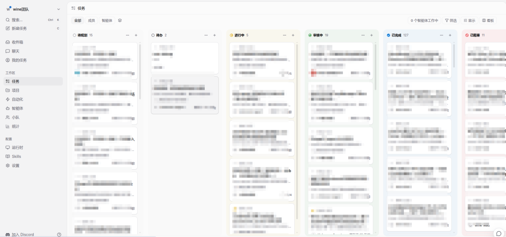
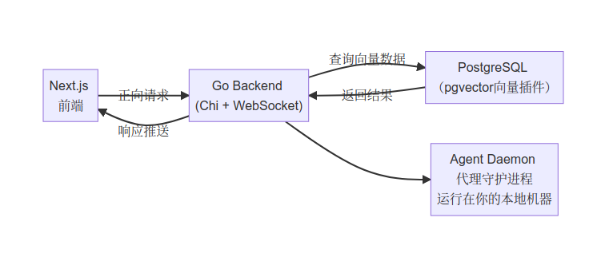

# AI 编程从单兵作战，升级为团队协作

Source: https://mp.weixin.qq.com/s/AIV_SW7bnlzKOEV7hXSEjg

原创

陈正勇
陈正勇

云水木石


在小说阅读器读本章

去阅读


在公众号小说中沉浸阅读

# 经过一年多时间的普及，我想大多数程序员都用上了 AI 编码吧。

我目前的主力AI编程方案是Open Code + 智谱GLM 5.2编程模型。在 WINE 项目中，我的日常工作场景是：发现程序运行中的 BUG，然后描述述故障现象，Open Code 会自己访问源代码，辅助以调试 skill。Open Code 就能自己修改代码，编译代码，并运行，分析日志，找出问题所在。

绝大多数时候，我只需围观 AI 的分析逻辑与编码过程。如果有些操作需要人工操作（比如点击链接、移动鼠标等），我再手动介入。因为目前编码AI还没有接入视觉模型，所以如果是界面显示异常的问题，还需要我告诉 AI。

比较早古的程序员，应该都听过**结对编程**的概念。

这个理念诞生之初，很违反人的直觉：两名开发者协同编码，一人编写、一人审阅监督，看似消耗了双倍人力。也正因如此，结对编程虽然在国外很流行，却始终没能在国内开发团队普及落地。

谁也没想到，在AI时代，这个经典的编程模式终于迎来了完美落地，**AI与开发者的结对编程，真正实现了降本增效**。

目前实测体验下来，这种结对编程确实好用。当下主流编码AI的编程能力，已经远超普通开发者，尤其是日志分析能力，更是碾压绝大多数人工排查效率。对于 WINE 这类日志输出量大、排查难度高的项目， AI 的加持让开发调试效率实现了质的飞跃。

最近公司的小伙伴又整了一个新玩意：Multica。经过了解和试用，发现这个开源项目又将 AI 编程智能体往前推进了一大步。

为什么这么说呢？因为目前的 AI 编程工具存在一个核心痛点：只能单兵作战，无法团队规模化协作。

无论是Open Code还是各类AI编码工具，都聚焦于个人提效。团队成员各自使用独立的AI工具、存储独立的提示词、沉淀独立的解决方案，没有统一的任务看板、没有进度同步、没有能力复用，AI编程的优势无法在团队内流转放大。

Multica 是一个旨在解决上述痛点的开源项目。它的核心理念很简单：像对待人类团队成员一样管理AI智能代理。给它们分配任务工单，查看它们提交的进度更新，接收它们上报的阻塞问题，让编程代理随着时间不断沉淀、积累处理能力。

截张图大家感受一下：



## Multica 核心能力：重构团队AI研发工作流

Multica的核心价值，是让AI编码代理深度融入团队现有研发流程，告别零散的碎片化人机交互，实现标准化、可追溯、可复用的团队级AI协作。你可以像给同事分配 GitHub Issue 一样，给AI代理派发任务。代理接手任务后，会在运行环境（本地电脑或者云服务器）执行任务，实时回传执行进度；遇到需要确认信息或者任务受阻时，还会提交评论反馈问题。

### 1. 任务全生命周期可视化管理

彻底告别“输入指令、听天由命”的粗放模式。所有AI任务都会完整经历入队、认领、执行、完成、失败全流程状态流转。团队成员可通过看板，清晰掌握每一项AI任务的实时进度、执行状态，全程可控可追溯。

### 2. 团队可复用技能库，积累研发资产

这是Multica最核心的亮点。当AI代理成功完成代码迁移、脚本部署、代码审查、BUG修复等任务后，对应的成熟解决方案会自动沉淀为团队专属技能。后续同类需求可直接复用，无需重复调试、重复写提示词，让团队AI研发能力持续迭代升级。

### 3. 多代理、多工作空间隔离协作

支持在多台设备、多个运行环境中，同时运行多个AI代理实例，并通过独立工作空间实现资源隔离。不同项目、不同业务线可配置专属代理与工单体系，互不干扰，完美适配多场景、多任务并行的团队研发需求。

### 4. 全厂商中立，不绑定工具生态

Multica兼容市面上主流的AI编码工具，包括Claude Code、Codex、OpenCode、OpenClaw、Gemini、Cursor Agent等。用户可自由选择适配自身业务的AI模型与工具，无需绑定单一厂商，灵活度拉满。

## Multica系统架构

Multica采用前后端分离的成熟技术架构，整体基于 TypeScript + Go 开发，代码边界清晰、轻量化、易部署，单侧迭代几乎不会影响另一侧业务。系统架构图如下：



各模块核心作用清晰明确：

* **前端**：基于 Next.js 16 App Router 构建，提供可视化任务看板、工作空间管理、任务派发与进度查看界面，是团队协作的操作入口。
* **后端**：Go 语言，基于Chi路由框架搭建，通过sqlc实现类型安全数据库查询，依托gorilla/websocket完成实时流式数据传输，保障任务调度、进度推送的稳定性。
* **数据库**：PostgreSQL 17，搭配 pgvector，存储任务工单、团队技能库等核心数据，通过向量插件实现技能相似度检索，精准复用历史解决方案。
* **代理运行时**：本地守护进程，是整个系统的关键组件。它运行在本地机器，自动识别环境变量中已安装的各类AI代理命令行工具，承接服务端下发的任务，拉起代理进程执行，并通过WebSocket实时回传执行日志与进度，打通云端服务与本地运行的链路。

从上述架构不难看出，Multica 的定位并非取代本地 AI 编程代理，而是在现有代理之上新增一层集中管理层，充分复用已有的本地 AI 能力。

## 快速上手部署

这套系统是公司的小伙伴研究并部署的，并且整了一个脚本完成所有的安装与配置。但我看了一下 Multica 的文档，安装其实也挺简单，仅需一行命令：

macOS / Linux：

```
brew install multica-ai/tap/multica  
# 不使用Homebrew的安装方式：  
curl-fsSL https://raw.githubusercontent.com/multica-ai/multica/main/scripts/install.sh | bash
```

Windows：

```
irmhttps://raw.githubusercontent.com/multica-ai/multica/main/scripts/install.ps1|iex
```

安装完成后执行初始化：

```
multica setup   # 一条命令完成身份校验并启动守护进程
```

完成后打开网页端应用，进入「设置→运行时」，就可以看到本机已经被识别。接下来创建代理实例（选择服务商与运行环境），就可以开始派发任务。

常用的命令有：

| 命令 | 作用 |
| --- | --- |
| multica setup | 一次性完成配置、身份认证、启动守护进程 |
| multica daemon start | 手动启动本地运行守护进程 |
| multica daemon status | 查看守护进程运行状态 |
| multica issue list | 列出当前工作空间的任务工单 |
| multica issue create | 新建任务工单 |
| multica update | 升级到最新版本 |

如果你想要完整自建部署（包含服务端），安装脚本增加 `--with-server` 参数：

```
curl-fsSL https://raw.githubusercontent.com/multica-ai/multica/main/scripts/install.sh | bash-s----with-server  
multica setup self-host
```

该命令会从GHCR拉取官方Docker镜像，环境需要预先安装Docker。完整自建部署文档在仓库内的`SELF_HOSTING.md`文件。

## Multica VS 原生AI代理CLI

相比于直接使用各类AI代理命令行工具，Multica 并非替代原有工具，而是在其之上叠加团队协作与资产管理能力，利弊十分清晰：

✅ 核心增益能力

* 团队共享看板：全员可实时查看所有AI代理的任务进度、运行状态，彻底告别信息孤岛。
* 实时流式输出：无需等待任务执行完毕，全程实时查看日志与执行动态，及时发现阻塞问题。
* 技能资产沉淀：优质解决方案统一存入团队技能库，不再依附个人提示词，成为团队永久研发资产。
* 多代理智能调度：支持多设备、多代理并行工作，按需分发不同类型研发任务。
* 完整审计溯源：所有任务的派发人、执行过程、操作记录全程留痕，可审计、可复盘。

⚠️ 所需运维成本

* 本地需常驻运行Agent守护进程，私有化部署需维护完整服务端。
* 需要独立维护PostgreSQL数据库，用于存储任务与技能数据。
* 相较于原生CLI工具，多了网页看板、任务管理的基础运维开销。

如果你是独立开发者，只是偶尔跑一下AI代理任务，直接用CLI就足够。但如果你处在团队环境（哪怕是小团队），需要跨项目协调多个AI代理，Multica 可以填补这一块真实存在的协作缺口。

## 到底值不值得上手？

如果是独立开发者，仅偶尔使用AI代理处理零散开发任务，原生CLI工具完全能够满足需求，Multica的整套基础设施会略显冗余。

但如果是团队开发者、技术负责人，已经深度使用AI编码工具，且遇到这些痛点：多设备AI代理杂乱无章、团队自动化能力无法同步、相同问题反复解决、AI研发成果无法沉淀复用，那么 Multica 就是精准解决痛点的刚需工具。

目前项目处于 v0.2.x 早期迭代版本，部分细节功能仍在优化完善，但核心的任务派发、代理执行、进度上报、技能复用工作流已经稳定可用，且项目迭代活跃，具备极高的长期使用与落地价值。

AI编程的下半场，从来不是单纯比拼模型能力，而是团队AI能力的规模化、资产化、协作化。Multica 正是助力团队实现AI研发能力复利的优质开源方案。

---

你们在项目中使用了哪些 AI 工具？欢迎留言讨论。

预览时标签不可点


微信扫一扫  
关注该公众号

知道了


微信扫一扫  
使用小程序

取消
允许

取消
允许

取消
允许

×
分析


微信扫一扫可打开此内容，  
使用完整服务

：
，
，
，
，
，
，
，
，
，
，
，
，
。
 
视频
小程序
赞
，轻点两下取消赞
在看
，轻点两下取消在看
分享
留言
收藏
听过