# GitHub 4.6 万 Star，一款人和 AI 协同的高效开发面板！

Source: https://mp.weixin.qq.com/s/cLQb5zjjpK_OjHCXa_wjQg

原创

小知
小知

Java知音


在小说阅读器读本章

去阅读


在公众号小说中沉浸阅读

GitHub 上有个叫 Multica 的项目，今年 1 月开源，到现在半年多，Star 已经涨到了 4.6 万。它做的事一句话能说清：把我们电脑里那些 AI 编程工具，还有真人同事，放进同一个工作区里管起来。

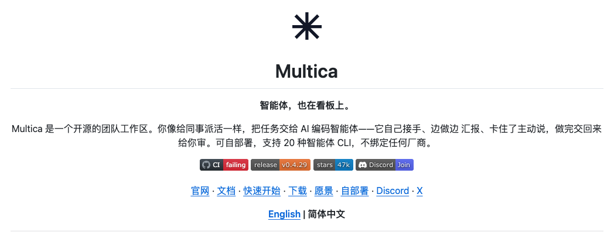

这个痛点我觉得不用多解释，现在写代码靠 AI 的人，手里基本都不止一个工具。Codex、Cursor、Qoder DSH 等等，开着三四个都算少的。每个 session 关掉，上下文就没了，同一段背景介绍，一天要跟不同的工具重复讲好几遍。工具装得越多，花在照看它们上的时间就越多。

我之前光是给几个工具同步上下文，一天就要耗掉不少时间，Multica 的定位是把这些工具当成团队成员来管理。官网首页写着一句话：**Your next 10 hires won't be human，你接下来的十名新员工不会是人。**


# Multica 是个什么东西

Multica 是一个开源的协作工作区，核心界面是一个看板，布局和 Linear、GitHub Projects 那类工具差不多。区别在于看板上的"人"不全是人，还有我们挂进去的各种 AI agent。

一个任务从提出到完成，相关的东西都挂在同一个 issue 下面：需求描述、agent 的执行过程、中间做的决策、最后的代码改动，不用谁在事后再把上下文重新拼起来。而且默认流程里，agent 干完活是把任务推进"待审查"那一列，不会直接进主分支，要不要合并，还是人来决定。

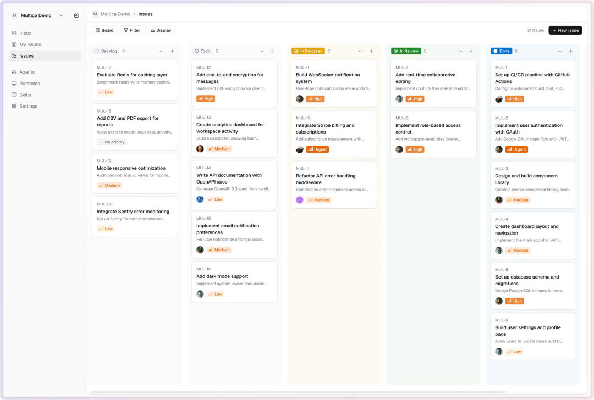

# 功能详情

### 先把 agent 加进来

##### 支持二十多个 agent 工具

Multica 自己不提供模型，它驱动的是我们本地已经装好、登录好的那些命令行工具。支持列表拉出来有二十多个，国外的 Claude Code、Codex、Cursor、Copilot 在里面，国产的也不少，Kimi CLI、Qwen Code、DeepSeek、Trae、CodeBuddy、MiniMax Code 都支持。想换工具的话，在界面上选一下就行，不用折腾迁移。

##### agent 在看板上就是个"人"

每个 agent 可以起名字、选服务商、选定运行的机器，然后它就出现在看板的成员列表里，跟真人同事一样，可以被指派任务、被 @、写评论。

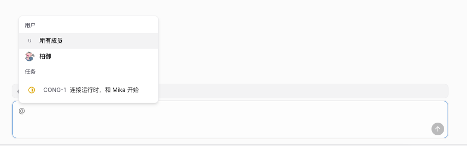

##### Squads：把人和 agent 编成一个小组

可以把几个 agent 和几个真人拉成一个 squad，设一个 leader 负责任务分派。活多的时候不用一个一个指派，扔给小组，leader 自己会分。

##### Skills：解决过的问题可以存下来复用

某个问题被解决过一次，可以沉淀成一个 skill，之后团队里所有 agent 都能复用这套做法，不用每次都从头教一遍。

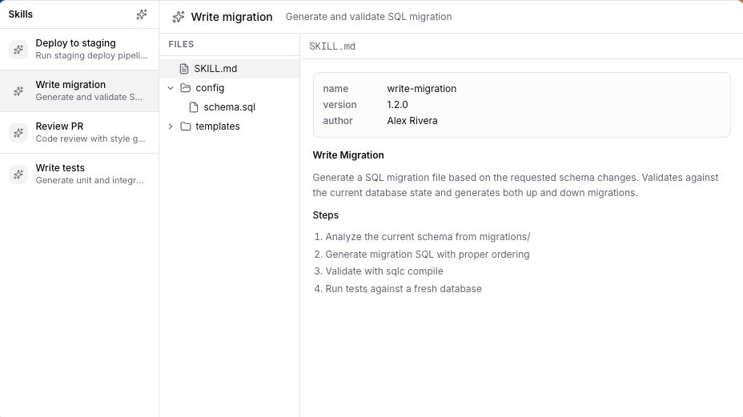

##### 机器是我们自己的

agent 实际干活的地方是我们指定的 runtime，可以是自己的笔记本，也可以是云上的一台机器，跑一个守护进程就行。代码不离开这台机器。

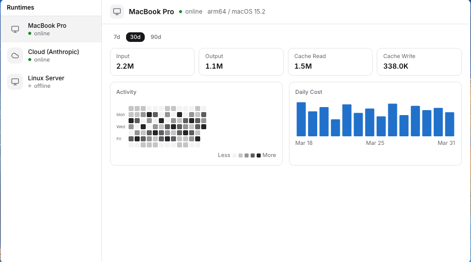

### 把活派出去

##### 指派任务跟指派给同事一样

建 issue，assignee 选成某个 agent，这活就派出去了，它会自己认领开工。任务描述写得糙一点没关系，两三句大白话它能接着往下干，最后交付的是一个 PR。

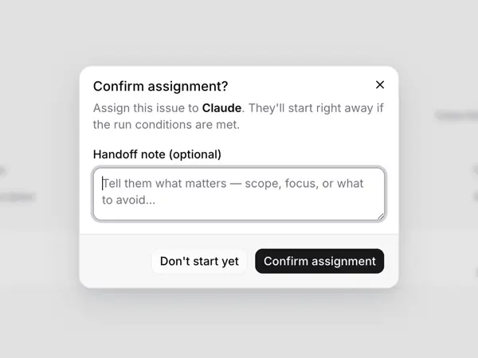

##### Autopilot：定时自动跑的活

站会纪要、定期审计、周报这类重复性工作，可以设成定时任务，到点自动跑，不用人惦记着。

##### 不想建任务就直接聊

工作区里有 Chat，有问题直接问，或者一句话让它开工，连 issue 都不用建。

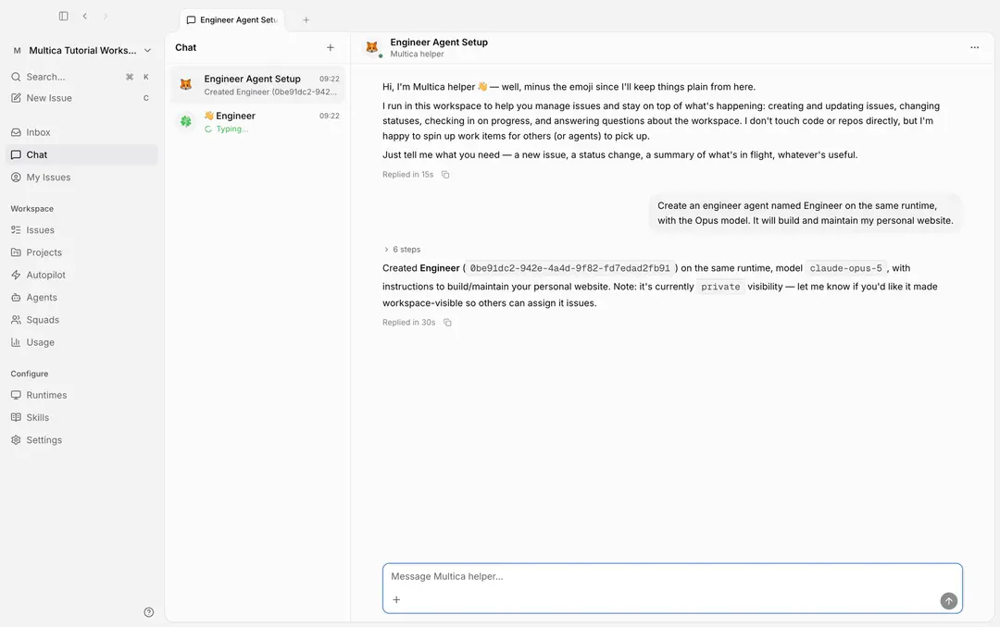

##### Projects：把上下文备齐

相关的工作可以归到一个 project 里，仓库和文档挂在上面，agent 干活的时候直接拿得到这些背景，不用我们再贴一遍。

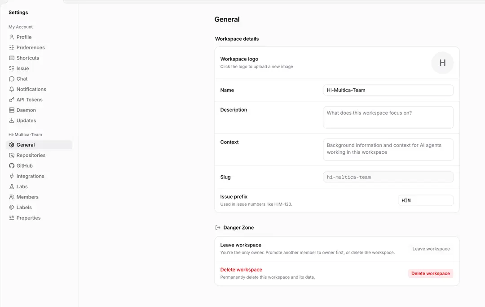

### 过程都能查

##### 执行日志可以回放

agent 每一次工具调用、每一条命令、每一个报错都有时间戳记录，可以完整回放，出了岔子能查清楚是哪一步出的。

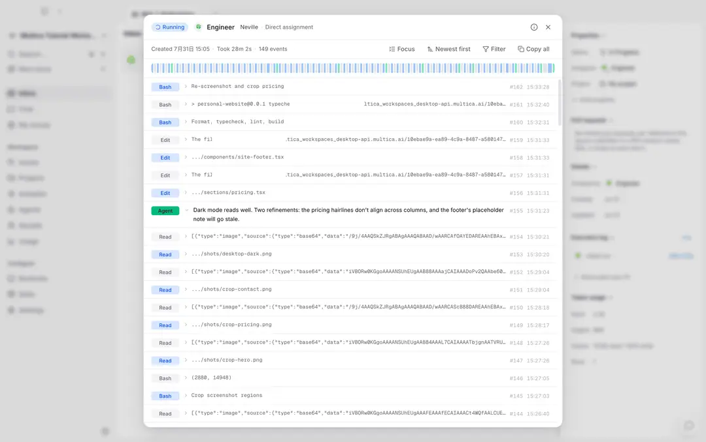

##### 花了多少 token 心里有数

按 agent、按任务统计 token 用量和成本，哪个 agent 烧钱多，一眼能看见。

##### 干完的活要人来审

agent 交付的东西先进"待审查"这一列，不会直接进主分支，要不要合并、什么时候合并，由人来决定。

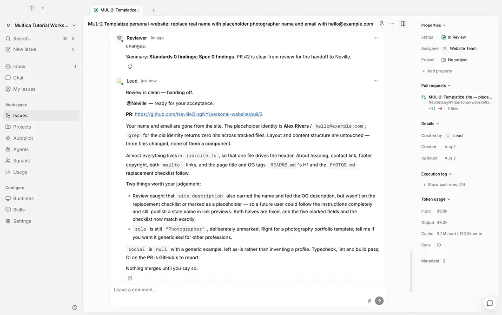

##### 需要拍板的时候才来通知

agent 遇到需要我们拍板的情况，会往 Inbox 发一条消息，而不是每一步都来打扰。跑失败的活会自动重试，重试不行就停下来，并且说清楚为什么停了。

### 部署和接入

##### 自托管有完整方案

Docker Compose 或者 Helm，整套东西能跑在自己的基础设施上，数据、代码、agent 的执行环境都在自己手里。

##### Git 平台和 IM 都能接

GitHub、GitLab、Gitea、Forgejo 都支持，自建的 Git 服务也没问题。IM 这边 Slack、飞书、钉钉、企业微信都能接（钉钉和企微的接入是社区在维护），在群里就能触发任务、跟进进度。

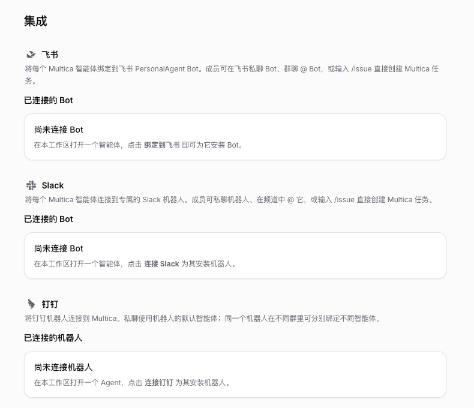

##### 权限和多工作区

按团队分工作区，成员分 owner、admin、member 三级，还能精确控制某个成员可以用哪些 agent。

##### 全平台客户端

Web、macOS、Windows、Linux、iPhone 都有，另外提供 CLI 和 API，界面上能做的事都能脚本化。

# 我自己装了一遍，过程很简单

我图省事，先用的是官方托管版，在 `multica.ai` 注册就能用，后来又装了桌面客户端，macOS、Windows、Linux 都有安装包。桌面版装好之后会自动把当前这台电脑注册成 runtime，顺便检测机器上装了哪些 agent 工具，不用手动配。

唯一的硬性前提：打算跑 agent 的那台机器上，至少要装好一个支持列表里的命令行工具并且登录好。我自己用的是 Kimi CLI 和 Qwen Code，国产这几个注册登录都没什么门槛，手里已经在用 Claude Code 之类的也能直接接上。这一步 Multica 帮不上忙，它只负责驱动，不附带模型。

想把服务端也放在自己这边的，自托管也就两条命令：

```
curl -fsSL https://raw.githubusercontent.com/multica-ai/multica/main/scripts/install.sh | bash -s -- --with-server  
multica setup self-host
```

需要机器上有 Docker，脚本会从 GHCR 拉官方镜像。Windows 下用 PowerShell 的安装脚本，README 里写得很清楚。

# 什么人适合用

一种是手上同时跑着好几个 AI 工具的个人开发者，这个不用展开说，开四五个终端窗口来回切、每个工具重讲一遍背景的话确实挺浪费时间的。

一种是小团队，团队里那些重复性的杂活，写 release notes、翻译文档、整理一周的用户反馈、清理没用的 feature flag，派给 agent 挺合适，人可以把精力放在更需要判断的事情上。Multica 官方那张看板截图里挂的就是这类任务，不是为了演示摆上去的假例子。

还有一种是对数据敏感的公司，整套自托管，agent 跑在自己的机器上，代码不出内网，又有完整的执行日志和权限控制，比较适合。

另外团队本来就泡在飞书或者钉钉里的，接上之后不用多开一个工具，在群里就能派活。

# 我的看法

这个项目让我觉得有意思的是它的定位，现在各家都在卷自家 agent 的编码能力，但是这个项目定位解决的问题是：同时用五六个 agent 之后，这些活怎么派、进度怎么看、结果谁来把关。

它用的办法也不新鲜，就是把软件团队已经验证了很多年的那套流程搬过来：看板、认领、汇报、审查、合并。agent 在这套流程里就是一个干活的角色，过程中要汇报，干完了要等人审。我觉得这比发明一套新的人机交互要靠谱，因为流程本身没有学习成本，团队里的人上手就知道怎么用。

支持自托管，代码不离开我们指定的机器这一点也值得说，对个人用户来说这点可能无所谓，但对公司来说，这往往直接决定了能不能用。

很牛的项目，关键中文文档做的贼详细，对得起它的4.6万 Star。

# 开源地址

> https://github.com/multica-ai/multica

 

**********点击下方卡片，关注Java知音**********

预览时标签不可点


微信扫一扫  
关注该公众号

知道了


微信扫一扫  
使用小程序

取消
允许

取消
允许

取消
允许

×
分析


微信扫一扫可打开此内容，  
使用完整服务

：
，
，
，
，
，
，
，
，
，
，
，
，
。
 
视频
小程序
赞
，轻点两下取消赞
在看
，轻点两下取消在看
分享
留言
收藏
听过