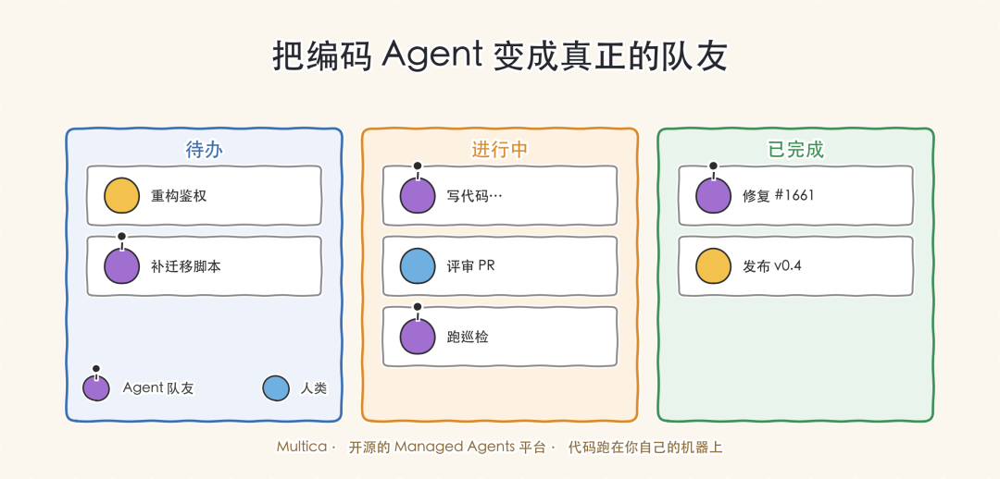
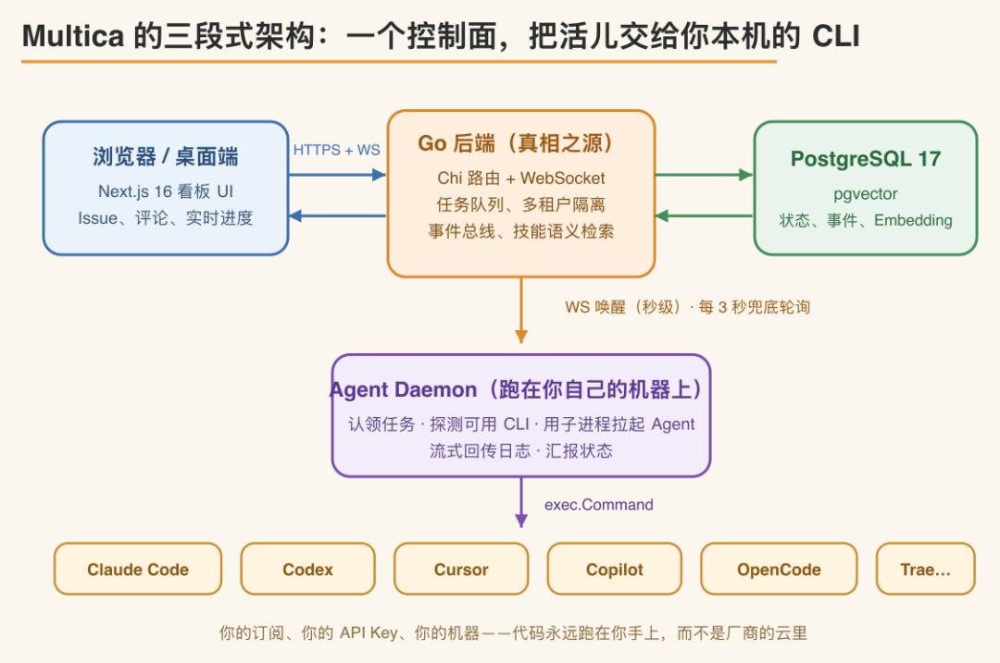
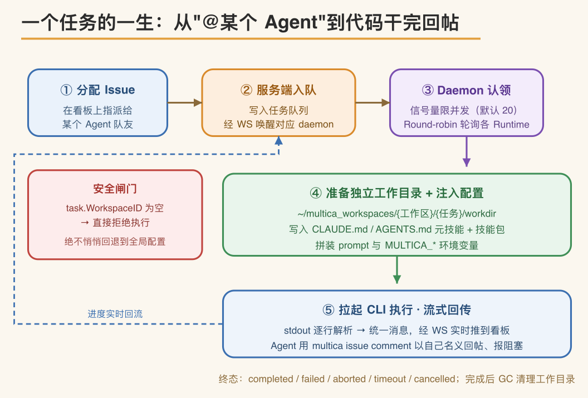

# Multica 深读：把编码 Agent 变成真正的队友，靠的是「不造循环，只做控制面」

Source: https://mp.weixin.qq.com/s/0Dwi6E0LN0yrHAf0EUEJlQ

原创

朱小厮
朱小厮

朱小厮的博客

在小说阅读器读本章

去阅读

在公众号小说中沉浸阅读

# 点击上方“朱小厮的博客”，选择“设为星标”

## 定位与边界

Multica（GitHub: multica-ai/multica）是一个开源的 Managed Agents 平台，产品形态接近 Linear：包含 Issue、项目、评论、收件箱和实时看板。区别在于看板上的负责人除了人，还可以是 AI 编码 Agent。将一个 Issue 指派给某个 Agent 后，它会接手任务、修改代码、在评论中反馈阻塞、更新状态，无需手动复制 prompt 或在终端旁监控输出。该仓库在 GitHub 上已有数万 star，是目前较为完整的开源 Managed Agents 实现之一。

需要先厘清一个前提：**Multica 本身不是 Agent**。它不发起 LLM 调用，不解析工具调用，也不包含 RAG。实际执行任务的是本机已安装的编码 CLI——Claude Code、Codex、Cursor、Gemini、GitHub Copilot CLI、OpenCode，以及 Kimi、Kiro、Trae CLI 等。Multica 是这些 CLI 之上的控制面，只负责调度、状态管理和协作。就职责而言，它相当于 Linear 与 GitHub Actions 的组合，区别在于任务的执行方是 AI Agent。

名字来源于 Multiplexed Information and Computing Agent，呼应 1960 年代的分时操作系统 Multics——后者让多个用户共享同一台机器且互不干扰。Multica 借此表达的思路是：以往软件协作以单个工程师、单个任务、单个上下文为单位串行推进，而现在被多路复用进系统的参与者既包括人类，也包括自主运行的 Agent。

## 三段式架构：控制面调度本机 CLI

整个系统只有三个进程角色。前端是浏览器或桌面端，运行 Next.js 编写的看板界面；中间是 Go 编写的后端，用 Chi 做路由、gorilla/websocket 提供实时通道、PostgreSQL 加 pgvector 存储全部状态，是系统的单一真相源；后端之下是 Agent Daemon，运行在用户本机，负责拉起 CLI。前端与后端之间走 HTTPS 加 WebSocket，后端与 daemon 之间采用「WS 唤醒 + HTTP 轮询兜底」的双通道，daemon 最终通过 exec.Command 启动本地 CLI。这一拓扑决定了系统的安全边界：代码始终在用户本机运行，使用用户自己的订阅和 API Key，不上传到第三方云端。

*图 1　三段式架构：控制面调度本机 CLI*

## 核心设计：不自建 Agent 循环，而是封装现成 CLI

项目以较小的团队实现了较大的功能面，关键在于一个设计决定：**不自行实现 Agent runtime，而是作为控制面把任务分派给现成的 CLI。**落到代码上分三步。第一步，定义一个 Go 接口 `Backend`，只有一个流式的 `Execute` 方法，返回一个 `Session`，内含一条消息通道和一条最终结果通道。第二步，每种 CLI 对应一个实现文件，本质是一次 `exec.Command` 加一个逐行解析 stdout 的解析器。第三步，把各 CLI 格式不一的 JSON 输出，翻译成一套统一的消息分类——text、thinking、tool-use、tool-result、status、error、log。此层之上的全部功能，无论任务分配、排期、评论，还是 autopilot、技能、UI，都只面向这套统一抽象，不感知底层 CLI 的差异。

*图 2　核心设计：一个接口，多份 CLI 实现*

这种设计带来几点直接收益：新增一个 Agent 只需新增一个 Go 文件，无需改动协议、数据库或前端；不产生供应商锁定，用户继续使用自己的 CLI 订阅和配置；底层 CLI 能力提升时平台自动获益；某个 CLI 崩溃时，受影响的只是一个子进程，不波及服务端。README 中说明这套模式借鉴自 happy-cli 的 AgentBackend，并用 Go 重新实现。

实现细节能反映项目的工程取向。以结构最清晰的 `claude.go` 为例，它用 `--output-format stream-json` 让 Claude 以 NDJSON 逐行输出，并自动批准所有工具调用的控制请求——因为人工审批发生在 Issue 和评论层，而非每次工具调用。另一处值得借鉴的做法是，每个子进程都挂一个有界的 64KB stderr 环形缓冲区；缺少它时，底层 CLI 的崩溃只会返回一句 `exit status 3`，缺乏可排查的上下文。这类「每条经验对应一个真实 bug」的约束，是该仓库工程价值的集中体现。

## 任务执行流程：从指派到回帖

Daemon 通过 `multica daemon start` 运行在本地。启动时先占用一个健康检查端口（默认 19514）做 fail-fast，防止同机重复启动两个 daemon 冲突；接着用 `exec.LookPath` 探测本机已装的 CLI，执行版本门禁，再向服务端将自己注册为一个个 Runtime。核心是 pollLoop：用一个容量默认为 20 的信号量控制并发，round-robin 轮询各 Runtime 认领任务，默认三秒一轮。同时 daemon 维持一条 WS，服务端一旦入队新任务就发来唤醒，使轮询立即返回。由此兼得 WebSocket 的秒级延迟和轮询在断网后的自愈能力。

*图 3　任务执行流程：从指派到回帖*

每个任务分配一个独立工作目录，路径形如 `~/multica_workspaces/{工作区}/{任务}/workdir`。Daemon 将一份元技能写为 `CLAUDE.md` 或 `AGENTS.md` 注入该目录，说明 Agent 如何使用 `multica issue` 这套 CLI——get、comment add、update、assign 均统一带 `--output json`，多行内容一律用 `--content-stdin` 配合 HEREDOC 传入——HEREDOC 是 shell 的多行输入语法（`命令 <<'EOF' ... EOF`），把中间整段文本原样作为标准输入喂给命令，带引号的 `<<'EOF'` 形式不做变量展开或转义——以避免把内容塞进 `--content "..."` 参数时双引号中 `\n` 不展开、真正换行错乱成字面量的问题。团队沉淀的技能包写入各 CLI 的原生技能目录。此处有一道安全闸门：一旦发现 `task.WorkspaceID` 为空，daemon 直接拒绝执行，不回退到用户的全局配置，避免跨工作区串用。任务终态统一为 completed、failed、aborted、timeout、cancelled 五种，执行完成后由 GC 按 TTL（默认 24 小时）清理工作目录。

## 与各 CLI 的交互：一次性流式与持续协议会话

前面的 `Backend.Execute` 隐含了一个前提：交互的粒度是「一次运行（run）对应一个子进程」，而非一直挂着的常驻 Agent 进程。Daemon 认领任务后拉起 CLI，任务结束进程即退出；同一个 Issue 被多次执行——追加评论、重试、后续跟进——时，每一次都是一个全新的 run、一个全新的子进程，可用 `multica issue runs` 查看某个 Issue 的全部执行历史，用 `multica issue usage` 汇总它历次运行的 Token 消耗。至于「进程内部如何与 CLI 通信」，则按 CLI 支持的协议分成两条路径。

第一条是一次性流式执行，覆盖 Claude Code、Qwen、Cursor、Copilot、OpenCode 等。模式是：拉起进程，prompt 经 argv 或 stdin 送入，随后逐行读取 stdout 上的 NDJSON 事件流，直到进程自行退出——一轮活干完即结束。`claude.go` 用 `--output-format stream-json`、Qwen 用 `qwen -p <prompt> --output-format stream-json` 均属此类。第二条是持续的 stdio 协议会话，覆盖 Codex 以及走 ACP 的 Kiro、Qoder、Trae、Grok 等。以 Codex 为例，它启动的是 `codex app-server --listen stdio://`，通过 stdin/stdout 上的 JSON-RPC 2.0 建立长连接：握手后发送 `thread/start`、`turn/start`，持续接收 `item/started`、`item/completed`、`turn/completed` 等 notification；遇到执行命令或修改文件的审批请求，daemon 在无人值守下自动回 accept；任务结束时关闭 stdin 让进程优雅退出，并留出约 10 秒供其 flush 遥测。ACP 家族（如 `traecli acp serve`、`grok agent stdio`、`qodercli --acp`）同理，走的是基于 stdio 的双向协议。因此在单个任务生命周期内，这类进程是持续、可多轮交互的，但它仍只服务这一个任务，结束即退出。

这里要厘清一个容易误读的地方：「持续」和前面说的「不常驻」并不矛盾，因为它们描述的是不同的时间尺度。可以分三层看。跨 run 层，也就是一个 Issue 从首次修复到评论追加、重试的整个生命周期，没有任何常驻进程，每一次 run 都拉起一个新子进程、跑完即退，这是「不常驻」的含义。单个 run 内，即一个子进程从启动到退出的这段时间，才是「一次性流式」与「持续会话」分野的地方。而两次 run 之间的空档，不存在任何进程。所以「持续」这个词的作用域被严格限定在单个 run 内部：一次性流式是把 prompt 喂进去后只单向读输出、读完进程即散，形同寄一封信；持续的 stdio 会话则是在这个子进程存活期间，daemon 与它保持一条能反复收发的 JSON-RPC 连接，可多轮交互、能应答中途的审批回调，形同一通电话。但无论信还是电话，都只服务这一个任务，办完即断——它不会跨越到 run 之外，下一次 run 是重新拉起、而非复用一条常驻热线。

跨 run 之间的「上下文连续」不依赖进程存活，而由会话恢复承接。`ExecOptions` 带有 `ResumeSessionID`：Codex 的会话状态——rollout JSONL、auth 与 config——保存在任务本地的 codex-home，GC 清理构建产物时会特意保留这部分，文档原话是保留下来「以便 Agent 能恢复它」。下一次 run 带上 session id 即可接续上一轮上下文；若恢复被拒（transcript 丢失、账号不匹配等），`Result.ResumeRejected` 置位，daemon 回退到全新会话重跑。归纳起来：结构上是「每次运行一个一次性子进程」，Codex/ACP 一类在进程内部是持续的协议会话，而多次运行之间的连续性由 resume 机制、而非长驻进程来保证。

## 技能、Squads 与 Autopilot

技能（Skill）是可复用的 markdown 指令包，在每次任务启动时注入工作目录。部署流程、数据库迁移、代码审查这类经验一旦写成技能，就沉淀为团队共享的资产、被历次任务反复调用；仓库根目录的 `skills-lock.json` 锁定各技能的版本，确保本地 daemon 每次取到的是可复现的同一份。Squads（小队）面向较大团队，在指派与执行之间加了一层稳定路由：任务交给一个由 leader agent 带队的小队，由队长决定具体谁接手，因此团队扩容或人员调整时，`@前端组` 这样的写法始终不变，无需改成一串具体成员。Autopilot 则把「创建任务」这一步也自动化——由定时（Cron）、Webhook 或手动触发，自行建出 Issue 并指派给 Agent，适合日报周报、定期巡检、告警转工单等场景。任务入口也不止一条：直接指派、评论中 @ 提及、Chat 对话，以及把自然语言异步转成一次 `issue create` 的 quick-create——结果以收件箱通知返回，全程不阻塞界面。这几项能力单看都不复杂，价值在于和前面的调度、执行机制串起来后的协同，下面用一个完整案例把它们走一遍。

## 一个端到端案例：从告警到合并

把前面的机制串起来，设想一个场景：某团队的线上服务在半夜触发一条错误率告警。告警平台经 Webhook 打到 Multica 的 Autopilot，规则将其转成一个 Issue——标题带上错误摘要，正文附上堆栈与日志链接，并指派给 `@后端组` 这个 Squad，而非某个具体成员。小队的 leader agent 判断由谁接手后，daemon 认领任务，在 `~/multica_workspaces/backend/{任务}/workdir` 拉起一个 Codex 子进程（`codex app-server --listen stdio://`），把仓库、注入的 `AGENTS.md` 元技能，以及团队沉淀的「排查线上错误」技能一并带上。Agent 通过 JSON-RPC 会话定位到一处判空缺失，改完代码、跑过测试，用 `multica issue comment add --content-stdin` 把改动摘要与自测结果回帖，任务转为 completed。整个过程里发起人只在收件箱收到一条通知，界面不阻塞。

接手的人 review 后觉得修复过窄，在同一个 Issue 的评论里补一句「顺手把同类调用的判空补上」。这条评论触发一次全新的 run——一个新的子进程——但它带上上一轮的 `ResumeSessionID`，Codex 从任务本地的 codex-home 恢复出之前的 rollout，接着原有上下文继续改，而不必从零重新理解这个 Issue。若某次运行超时或恢复被拒，任务落到 timeout、或由 `Result.ResumeRejected` 触发的全新会话重跑；人可以用 `multica issue runs` 回看这个 Issue 的历次执行，用 `multica issue usage` 核对累计的 Token 花费。等改动令人满意，最后一轮 run 在 `multica repo checkout` 拉出的 git worktree 上提交并推出一个 PR，PR 与 Issue 关联后可用 `multica issue prs` 查看，最终合并由人来点。Agent 全程只在工作目录里干活并回帖，合并权始终在人手里。

综合来看，Multica 的核心并非某个新模型，而是一组工程约束：一个接口配多份实现，一套工作目录约定，一个单一真相源，以及一份将多数规则都标注了对应触发 bug 的工程文档。对于研究「人与 Agent 协作」如何落地的开发者，它是一个值得逐行阅读的开源参考实现。

---

**近日最近文章汇总**

中间件相关：

[Kafka 从 2.0 至今：关键技术演进、原理与架构](https://mp.weixin.qq.com/s?__biz=MzU0MzQ5MDA0Mw==&mid=2247505988&idx=1&sn=59717c03167339bc17ed06b413aa518f&scene=21#wechat_redirect)

[Redis 近些年核心演进全景——从单线程缓存到实时数据平台](https://mp.weixin.qq.com/s?__biz=MzU0MzQ5MDA0Mw==&mid=2247506190&idx=1&sn=fbc159b65c51de3680c18cc8d3b557ff&scene=21#wechat_redirect)

[RabbitMQ 怎么有点 Kafka 的味道了？—— 细说 RabbitMQ 进化史](https://mp.weixin.qq.com/s?__biz=MzU0MzQ5MDA0Mw==&mid=2247506389&idx=1&sn=ef1ed5cf22ee37e38751eda7402e807e&scene=21#wechat_redirect)

[实时协同编辑的魔法揭秘——多人同时敲一个文档，为什么不会乱套？](https://mp.weixin.qq.com/s?__biz=MzU0MzQ5MDA0Mw==&mid=2247506469&idx=1&sn=3878ad31dd6be957cddc4c4b0902d097&scene=21#wechat_redirect)

[分布式事务通关指南·图解](https://mp.weixin.qq.com/s?__biz=MzU0MzQ5MDA0Mw==&mid=2247506579&idx=1&sn=f25c08d9e90d86db6686bb44429d6b6f&scene=21#wechat_redirect)

LLM 系列：

[Claude Code 核心架构与原理研究](https://mp.weixin.qq.com/s?__biz=MzU0MzQ5MDA0Mw==&mid=2247506006&idx=1&sn=718d0e233a1840bdece12a4baaeaaf2d&scene=21#wechat_redirect)

[Loop Engineering：当你不再给 AI 打字，而是给 AI 设计一位"老板"](https://mp.weixin.qq.com/s?__biz=MzU0MzQ5MDA0Mw==&mid=2247506185&idx=1&sn=21bd564a0621df07575145f26c152ae1&scene=21#wechat_redirect)

[Codex 刚出炉的「Record & Replay」是什么？](https://mp.weixin.qq.com/s?__biz=MzU0MzQ5MDA0Mw==&mid=2247506191&idx=1&sn=f84ce5dd9cb52bc1121311f7f8a4bc2e&scene=21#wechat_redirect)

[RAG 还是 LLM Wiki？一次讲透怎么把知识喂给 AI](https://mp.weixin.qq.com/s?__biz=MzU0MzQ5MDA0Mw==&mid=2247506188&idx=1&sn=ad31b79767ebc67490eb23205ee5289b&scene=21#wechat_redirect)

[万人血书留下的 LLM 实战经验](https://mp.weixin.qq.com/s?__biz=MzU0MzQ5MDA0Mw==&mid=2247506225&idx=1&sn=a23e3e9d52caa01a5153974be2e0f72d&scene=21#wechat_redirect)

[当 AI 拿起键盘：一文看懂 LLM 沙箱的门道](https://mp.weixin.qq.com/s?__biz=MzU0MzQ5MDA0Mw==&mid=2247506245&idx=1&sn=775966d25b4322defe64d87b6d87ce9d&scene=21#wechat_redirect)

[看得见的 Agent：怎么把 AI 智能体的可观测性做好](https://mp.weixin.qq.com/s?__biz=MzU0MzQ5MDA0Mw==&mid=2247506259&idx=1&sn=ecfcc80f62fe47d250bca0dfb03159a0&scene=21#wechat_redirect)

[Claude Code 为什么“只用 Grep、不碰 Code RAG”？——一道被问错的面试题](https://mp.weixin.qq.com/s?__biz=MzU0MzQ5MDA0Mw==&mid=2247506269&idx=1&sn=2a29b66a1e10b50e077391f0ff3d5369&scene=21#wechat_redirect)

[图解 Codex: 核心架构和原理研究](https://mp.weixin.qq.com/s?__biz=MzU0MzQ5MDA0Mw==&mid=2247506347&idx=1&sn=0915ac27d93d6280fa29aa74ff8539e6&scene=21#wechat_redirect)

[Claude 账号是怎么被封的？](https://mp.weixin.qq.com/s?__biz=MzU0MzQ5MDA0Mw==&mid=2247506387&idx=1&sn=3ebf452ab29caa4407eb1ff7c458daf8&scene=21#wechat_redirect)

[图解·为什么 Agent Skill 不靠向量 RAG 召回？](https://mp.weixin.qq.com/s?__biz=MzU0MzQ5MDA0Mw==&mid=2247506428&idx=1&sn=a044d6c61025d9651151350aeddad058&scene=21#wechat_redirect)

[Skill / Prompt 优化后,如何守住老 case?——写给程序员的 LLM 回归评测实战](https://mp.weixin.qq.com/s?__biz=MzU0MzQ5MDA0Mw==&mid=2247506500&idx=1&sn=2110a6d85f3c31d51fc9616fe4a1ba7a&scene=21#wechat_redirect)

[为什么 Claude Code 和 Opus 更搭、Codex 和 GPT 更搭？一篇讲透「模型与工具的双向奔赴」](https://mp.weixin.qq.com/s?__biz=MzU0MzQ5MDA0Mw==&mid=2247506501&idx=1&sn=83946529e0b1ec7b029c20ff1d6adfbe&scene=21#wechat_redirect)

[分身有术：一文读懂大模型里的 Sub Agent 机制](https://mp.weixin.qq.com/s?__biz=MzU0MzQ5MDA0Mw==&mid=2247506502&idx=1&sn=944d547d2344c4a08b377cf3ef86114b&scene=21#wechat_redirect)

[Agent 如何按任务自主切换模型：原理、架构与 Claude Code / Codex / Cursor 实战](https://mp.weixin.qq.com/s?__biz=MzU0MzQ5MDA0Mw==&mid=2247506503&idx=1&sn=10810af751a4dd44f854ed4547d245e4&scene=21#wechat_redirect)

[当 AI 学会"组队打怪"：一文读懂 Agent Team](https://mp.weixin.qq.com/s?__biz=MzU0MzQ5MDA0Mw==&mid=2247506504&idx=1&sn=bb7ea299f84e60f9e4c68aecbd3108fa&scene=21#wechat_redirect)

[为什么 LLM 会吐出“亚洲AV”“无码”：从语料、概率到安全对齐的底层解释](https://mp.weixin.qq.com/s?__biz=MzU0MzQ5MDA0Mw==&mid=2247506535&idx=1&sn=6702198ddccf245394a2ba4befedf0a9&scene=21#wechat_redirect)

[被误传的 92%：Claude Code 上下文压缩阈值的计算逻辑与成本权衡](https://mp.weixin.qq.com/s?__biz=MzU0MzQ5MDA0Mw==&mid=2247506542&idx=1&sn=06e13709e946d6ddfd820e08d41df1d9&scene=21#wechat_redirect)

[Claude Code 的上下文压缩机制：阈值、分层策略与守卫](https://mp.weixin.qq.com/s?__biz=MzU0MzQ5MDA0Mw==&mid=2247506553&idx=1&sn=c62a4c5aaf5425d420e41cc24c6606b0&scene=21#wechat_redirect)

[grill-me、brainstorming、plan：三种"先想清楚再写代码"的机制差在哪](https://mp.weixin.qq.com/s?__biz=MzU0MzQ5MDA0Mw==&mid=2247506578&idx=1&sn=1b4495a202bc85a438b84ceea440b1c5&scene=21#wechat_redirect)

[git worktree：Agent 并行编程背后的隐藏功臣](https://mp.weixin.qq.com/s?__biz=MzU0MzQ5MDA0Mw==&mid=2247506580&idx=1&sn=1a875b6af28c09f0cd107570d1c61425&scene=21#wechat_redirect)

[大模型推理底层原理：从一个 Token 到一句完整回答](https://mp.weixin.qq.com/s?__biz=MzU0MzQ5MDA0Mw==&mid=2247506581&idx=1&sn=38a881726a6f4f26373b217767df15ca&scene=21#wechat_redirect)

[大模型推理流量的限流与调度：原理、架构与应用场景](https://mp.weixin.qq.com/s?__biz=MzU0MzQ5MDA0Mw==&mid=2247506582&idx=1&sn=4e58a12c2da4cd050615e38a806addb5&scene=21#wechat_redirect)

加入新技术群。备注：加群/技术

**想知道更多？马上****关注我**

预览时标签不可点

微信扫一扫  
关注该公众号

知道了

微信扫一扫  
使用小程序

取消
允许

取消
允许

取消
允许

×
分析

微信扫一扫可打开此内容，  
使用完整服务

：
，
，
，
，
，
，
，
，
，
，
，
，
。
 
视频
小程序
赞
，轻点两下取消赞
在看
，轻点两下取消在看
分享
留言
收藏
听过