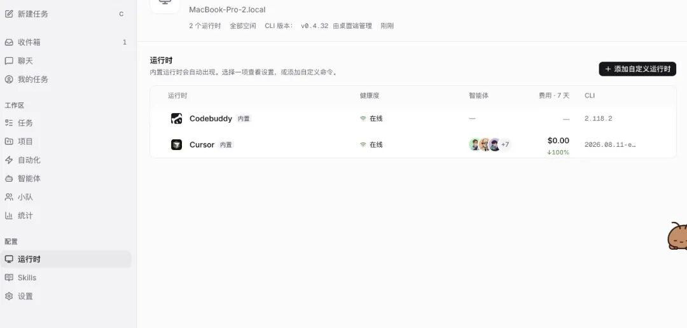
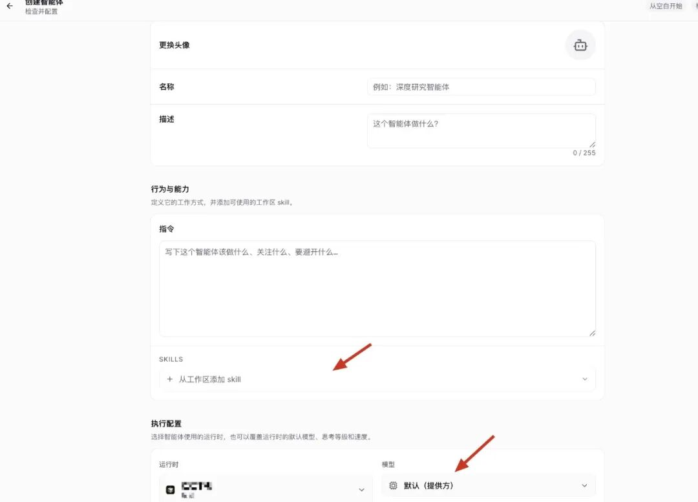
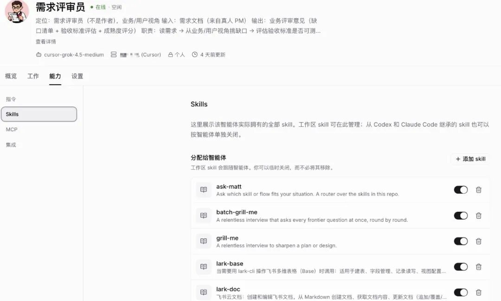
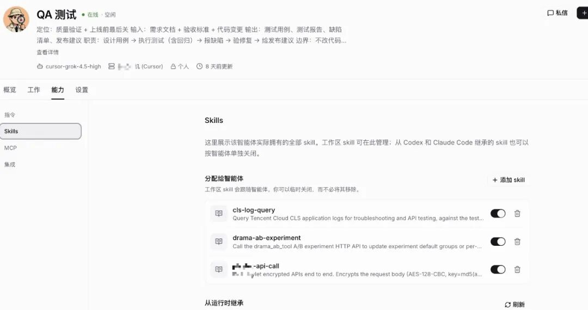
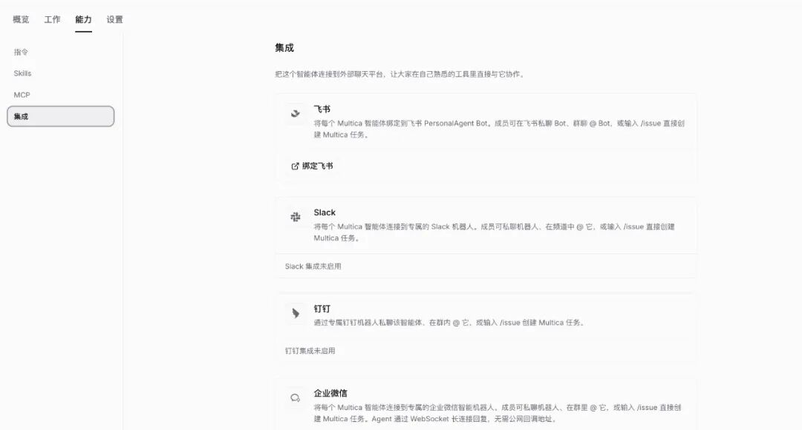

# 使用multica打造专属的AgentTeam

Source: https://mp.weixin.qq.com/s/4vNJMFv618imSlgwj8rfIQ

原创

松松哥
松松哥

不做虫子


在小说阅读器读本章

去阅读


在公众号小说中沉浸阅读

> 字数 1196，阅读大约需 6 分钟

# 使用multica打造专属的AgentTeam

> 手搓一下正经的技术文章

## 写在前面

multica是一个智能平台，可以创建agent智能体，并且可以将多个agent组成一个小队，用来处理专门的场景。

而且接入常用的办公软件非常方便，飞书、钉钉、企业微信这些一键接入，可以在办公软件上直接给agent或者小队分派任务，非常方便。

哦，对了，还支持多个大模型平台，例如claudecode、Codex、CodeBuddy 等等，可以充分利用平台提供的免费额度，最大程度薅羊毛。

## 安装

地址：https://multica.ai/


进入地址后，直接下载安装到本地即可  
安装完成后，它会扫描本地已经安装的大模型平台，还是比较方便的，无需一个一个配置。



## 配置

### 配置agent



可以通过**手动**和**AI 自动**创建智能体，手动可以指定这个智能体**使用什么模型**和**搭载哪些 skill**。

写方案和规划就使用好一点的模型纯写代码和执行测试就使用一般的模型这样也算充分利用了



另外，方案设计类智能体就上 grill-me 等反复追问 skill  
写代码的智能体就搭载 ponytail 等写代码类 skill



灵活度还是非常高的

### 配置小队

多个 agent 智能体可以组建成一个小队


一个小队需要指定一个队长，来统筹整个流程，基本上交给小队的任务可以全全自动完成，队长会承担起管理责任，某个智能体输出的交付物不符合规范时，会重新打回。


当然期间你也插话修正下任务的走向

我目前创建了三个小队，分别对应日常开发的三个场景：

* • 需求开发
* • 排查线上问题
* • 需求评审

以下是一个小队的指引（经历过AI扩充修改）

```
你是这个小队的 Leader，也是规则的源头和守门人。以下规则贯穿全队，每次任务都要遵守，并在派活的 SendMessage 中点明给 teammates。  
  
【人工闸门】发布、线上 DB 写、外部影响动作（发消息、调外部 API、改线上配置）必须人审批。停下汇报老板，不自动执行。无论多急，闸门不省。  
  
【不瞎猜不越权】没数据/没证据不下判断，宁说"待确认"。越权动作回报不擅动。MCP/工具做不了的事直说做不了，不硬凑不伪造。  
  
【风险边界】线上 DB 写权限不给 agent。发布不自动，止于发布准备+人工审批。外部动作谨慎，内部查询大胆。  
  
【结构化交接】方案/报告/缺陷/证据链用固定格式文档，不靠口头。研发放 docs/，排查放 incident/，文件名带阶段和日期。  
  
【失败回退】研发：QA 报缺陷→回 engineer，严重→回 architect。排查：复验不过→回 engineer，根因不清→回 investigator。回退带问题清单回流。  
  
【调度】研发：流水线五阶段角色常驻。排查：核心常驻+按需 spawn。再急不省闸门、不跳自测复验。  
  
【派活前】多 agent 不抢同一批文件（针对单体发版冲突）。
```

### 配置办公软件

接入办公软件也挺方便，直接按照指引配置就可以了，会创建一个机器人，直接在办公软件中和它对话即可，不用频繁切换，挺好使的。



如果下班电脑不关机留在公司，你甚至可以不带电脑回家，通过办公软件远程指挥。

## 使用过程中的评价

* • **交付质量高**：你还别说，一个小队交出来的成果还可以，需求开发可以贯穿代码编写到全自动测试，再到输出测试报告，非常省心
* • **慢慢慢**：交付质量是挺高，但慢也是真慢，一个 cursor 会话+人工 10 分钟能搞定的活，它能跑半小时，再复杂一点的它甚至能跑一个小时。所以日常简单点的、需要快速排查出结果的我就交给 cursor 了，把一些可以并行、难度中等的交给他，慢慢跑吧，我先吃饭/下班了
* • **比较适合开发内部系统/前端**：由于小队基本可以实现全自动，可以打开浏览器自动检测，但是仅限于流量小、爆炸半径小的任务/系统，例如前端页面这些，可以自己检测是否修改成功，像涉及到 App、高流量高并发后台的系统，还是稍微有点危险，需要多多把关。

预览时标签不可点


微信扫一扫  
关注该公众号

知道了


微信扫一扫  
使用小程序

取消
允许

取消
允许

取消
允许

×
分析


微信扫一扫可打开此内容，  
使用完整服务

：
，
，
，
，
，
，
，
，
，
，
，
，
。
 
视频
小程序
赞
，轻点两下取消赞
在看
，轻点两下取消在看
分享
留言
收藏
听过