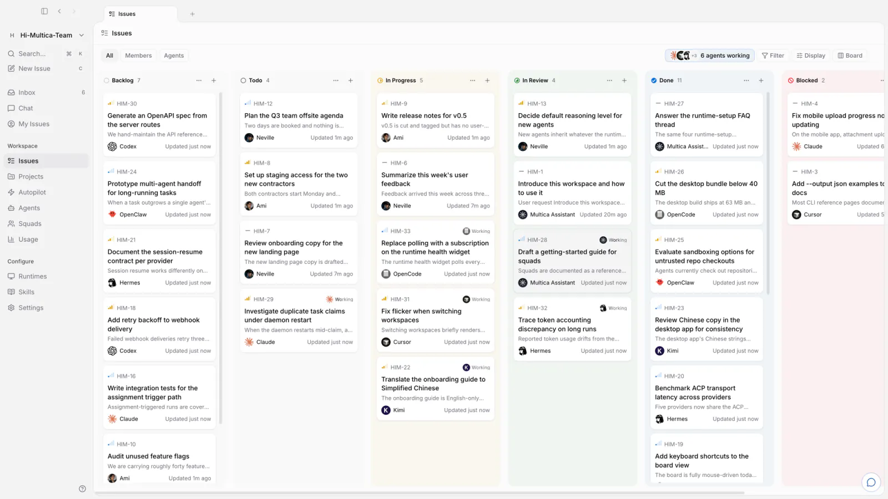
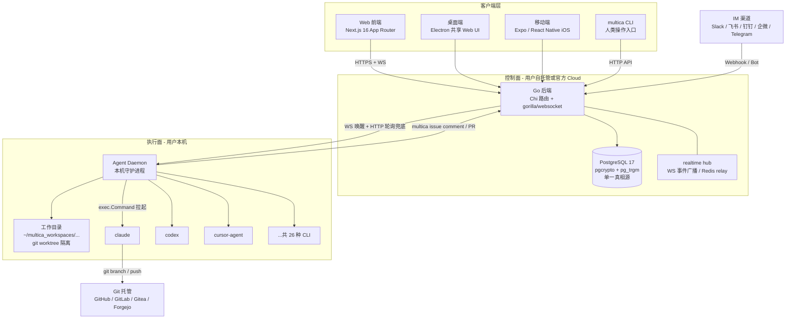
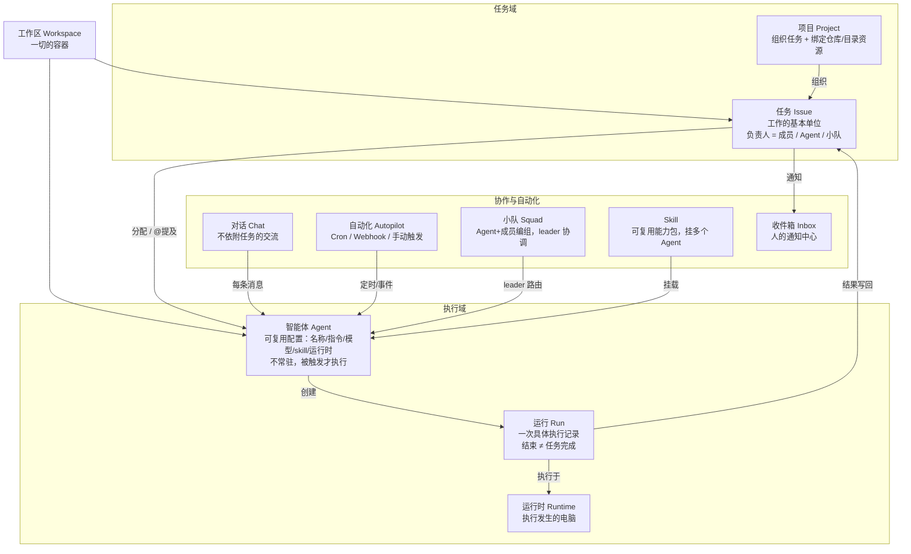
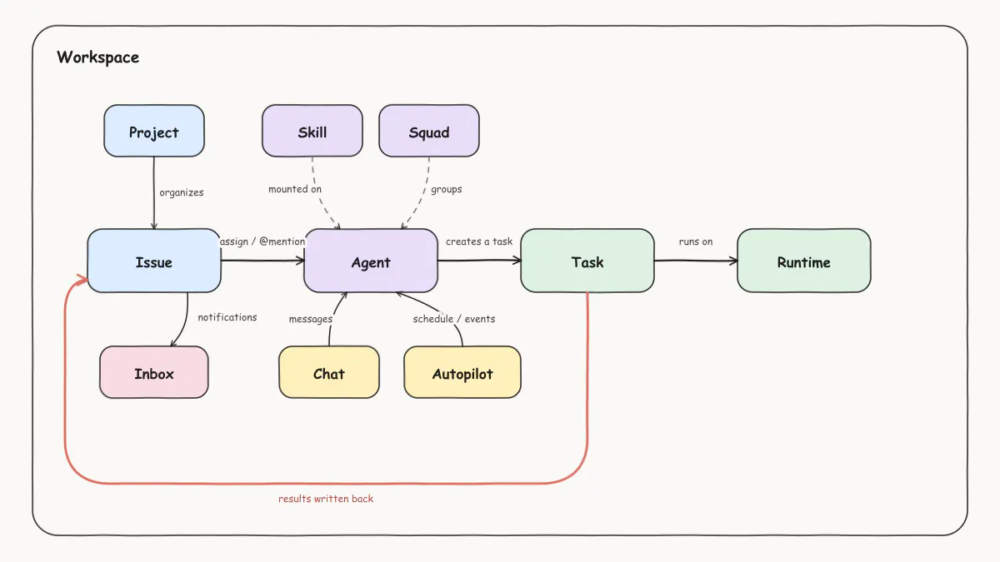
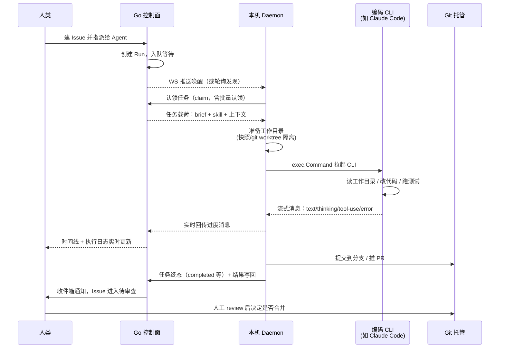
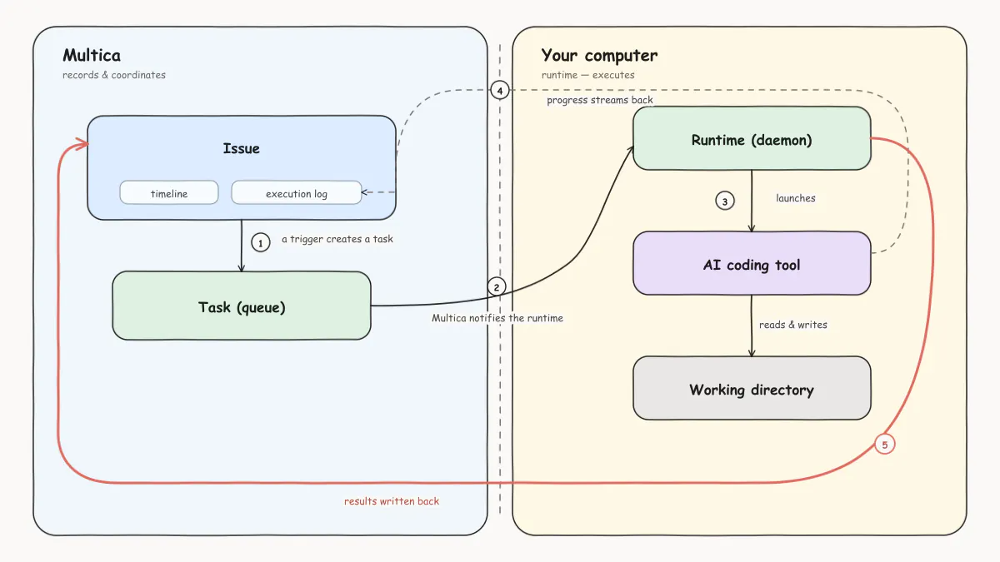
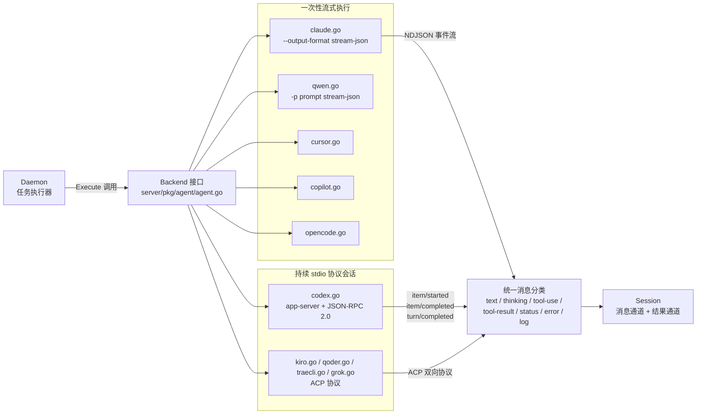
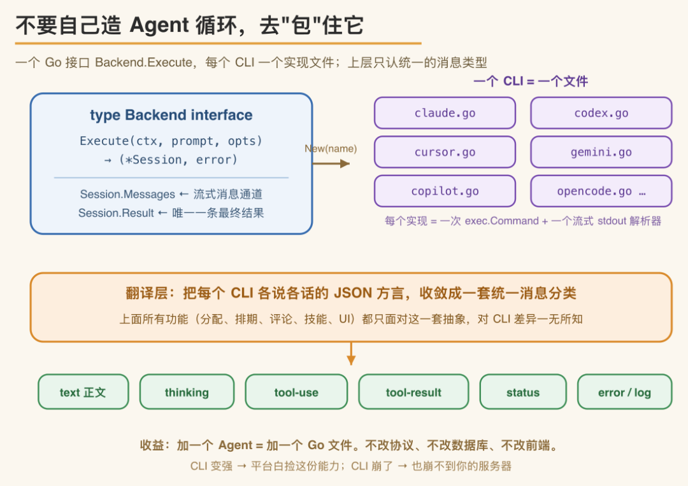
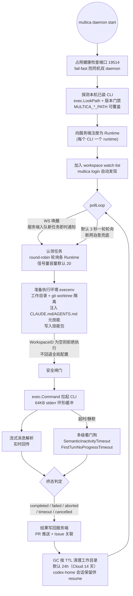
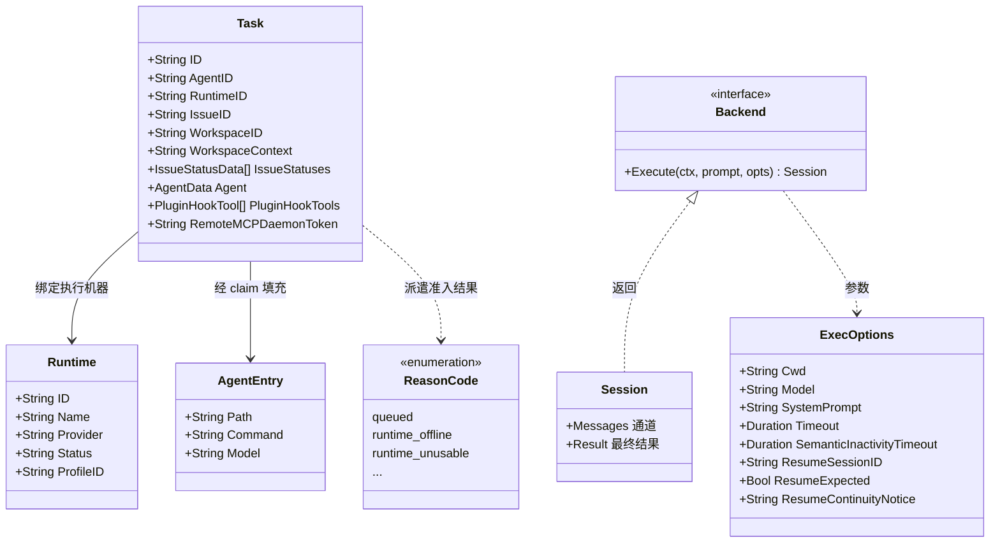

# Multica 调研报告：让 AI 编码 Agent 成为看板上的「一等公民同事」

> **一句话定位**：Multica 是一个开源、可自托管的 AI-native 任务管理平台（产品形态接近 Linear + GitHub Actions 的合体）——人类像给同事派活一样把 Issue 指派给 AI 编码 Agent（Claude Code、Codex、Cursor 等 26 种 CLI），Agent 自己认领任务、在**你的机器**上执行、实时回帖汇报、交付后进入「待审查」列，**合并权始终在人手里**。Multica 本身不是 Agent、不做模型调用，它是驱动现成编码 CLI 的**控制面**。
>
> **仓库**：[github.com/multica-ai/multica](https://github.com/multica-ai/multica)（Multica License = Apache 2.0 + 托管服务/商业嵌入附加条款）
>
> **归档**：`agent-in-organization/open-source-project/multica/`（按仓库目录约定归「AI 进入组织 → 开源工具/项目」；与同方向的 [buzz](../buzz/report.md)、[claude-tag](../../product/claude-tag/report.md) 同属「Agent 以成员身份进组织」范式，但 Multica 的载体是**任务看板**而非聊天频道）

---

## 摘要

- **如果你是工程师**：Multica = 一个 Go + Next.js 的 monorepo，核心是「三层拓扑」（Next.js 前端 / Go 控制面 / 本机 Agent Daemon），加上一个 `Backend` 接口（一个 `Execute` 方法）与 26 份 CLI 适配实现。代码量约 67 万行 Go + 43 万行 TS，测试文件近 1600 个，工程密度极高。
- **如果你是团队负责人**：Multica 回答的问题是「当团队同时雇佣多个 AI 编码 Agent 时，任务从哪来、上下文放哪、过程怎么可见、结果谁来审」。它把 Agent 变成看板上可被指派、被 @、写评论的成员，把意图-执行-决策-代码改动钉在同一条 Issue 时间线上。
- **如果你是研究者**：Multica 是目前最完整的开源 Managed Agents 参考实现之一——它不造 Agent 循环，而是通过「控制面调度本机 CLI」的设计，把「人与 Agent 协作」的组织问题转译为调度、状态与权限问题。其「会话恢复而非常驻进程」「运行时边界（代码不出本机）」「dispatch reason code 词汇表」等设计值得逐行阅读。
- **热度**：截至 2026-09-05，GitHub **48,950 Star / 6,323 Fork / 100+ 贡献者**，2026-01 开源，工作日级别发版节奏（最新 v0.4.40，2026-09-04）。

---

## 目录

- [一、概述与背景](#一概述与背景)
- [二、核心架构](#二核心架构)
- [三、核心技术实现](#三核心技术实现)
- [四、扩展与生态](#四扩展与生态)
- [五、质量与评估](#五质量与评估)
- [附录](#附录)

---

## 一、概述与背景

### 1.1 项目概述

| 属性 | 内容 |
|------|------|
| 项目名称 | Multica（**Mul**tiplexed **I**nformation and **C**omputing **A**gent） |
| GitHub | [multica-ai/multica](https://github.com/multica-ai/multica) |
| 官网 / 文档 | [multica.ai](https://multica.ai) / [multica.ai/docs](https://multica.ai/docs)（含中文文档） |
| Star / Fork | 48,950 / 6,323（2026-09-05） |
| 主语言 | Go（后端）+ TypeScript（前端 monorepo） |
| 开源时间 | 2026-01-13 创建仓库 |
| 最新版本 | v0.4.40（2026-09-04），工作日发版节奏 |
| 贡献者 | 100+（Top 3：Bohan-J 1425、NevilleQingNY 1096、forrestchang 1037 次提交） |
| License | Multica License：完整 Apache 2.0 文本 + 附加条件（禁止用源码向第三方提供托管服务/商业嵌入，自托管、修改、内部商用允许） |
| 部署形态 | 官方 Cloud、桌面端（macOS/Windows/Linux）、自托管 Docker Compose/Helm |

**名字的由来**是一个精心设计的产品隐喻：1960 年代的 Multics 操作系统发明了分时（time-sharing），让多个用户共享一台机器且互不干扰。Multica 认为同样的拐点正在发生——过去软件团队是「单线程」的：一个工程师、一个任务、一次上下文切换；而 Agent 让多路复用重新变得有意义，只不过现在 multiplexing 系统的「用户」既包括人也包括 Agent。官方原话：**"Your next 10 hires won't be human."**（你接下来的十名新员工不会是人。）

### 1.2 解决的核心问题

Multica 对准的痛点非常具体：**当一个团队同时使用多个 AI 编码 Agent 时，协作基础设施是缺失的**。

- **工具碎片化**：每个 Agent 住在自己的终端标签页里，session 关掉上下文就没了；同一段背景介绍一天要向不同工具重复讲四遍。
- **无法规模化**：现有 AI 编码工具全部聚焦「个人提效」——独立的提示词、独立的解决方案沉淀，没有统一看板、没有进度同步、没有能力复用（引用自三方文章《AI 编程从单兵作战，升级为团队协作》）。
- ** babysitting 成本**：Agent 越多，花在「照看」它们上的时间越多——监控输出、复制粘贴结果、把上下文搬来搬去。
- **上下文蒸发**：Agent 的工作记录在聊天、终端或私有会话里，决策消失在对话线程中；工作移交时团队只能从头再讲一遍。

Multica 的解法不是再造一个更强的 Agent，而是**给 Agent 群体补上组织协作层**：一个 Agent 被指派 Issue 后自己认领、在受控运行时上执行、边干边评论、干完把 Issue 推进「待审查」列。意图、执行、决策、diff 全部连在同一条 Issue 上——没有人需要事后重建上下文，也没有任何东西在人类点头之前进入主分支。



*Multica 工作区看板全景。看板布局与 Linear/GitHub Projects 类似，核心区别在于列上的「负责人」既有真人也有 Agent；每个 Issue 的指派人、评论、状态流转与 PR 关联都在同一时间线内。官方标语 "Your next 10 hires won't be human" 点明其产品立场：Agent 不是工具面板里的一个按钮，而是组织成员名册上的一行。*

### 1.3 设计动机与定位边界

**一个必须先厘清的前提：Multica 本身不是 Agent。**它不发起 LLM 调用、不解析工具调用、不包含 RAG（引用自三方深读文章《Multica 深读：不造循环，只做控制面》）。实际执行任务的是本机已安装、已登录的编码 CLI——Claude Code、Codex、Cursor 等 26 种。Multica 是这些 CLI 之上的**控制面**，只负责调度、状态管理和协作。

三方深读文章给出一个精准的类比：**Multica ≈ Linear（任务管理）+ GitHub Actions（任务执行编排），区别在于任务的执行方是 AI Agent 而非 CI 脚本。**

与竞品的差异化定位：

| 对比对象 | 定位差异 |
|---------|---------|
| Linear / Jira / GitHub Projects | 它们的 assignee 只能是人；Multica 的 assignee 可以是 Agent，且任务生命周期专为「无人值守执行 + 人工审查」设计 |
| Claude Code / Codex 等单 Agent 工具 | 它们是「发动机」；Multica 是让多台发动机协同的「车队管理系统」，不与之竞争 |
| Devin / 全自主 Agent 产品 | Devin 自带模型与云端沙箱；Multica 零模型、零沙箱，代码不出本机，用户用自己的 CLI 订阅 |
| Block/buzz、@Claude（Slack） | 同属「Agent 进组织」范式，但 buzz 的载体是 Nostr 聊天频道、claude-tag 的载体是 Slack 提及；Multica 的载体是**结构化任务看板**——更适合有交付物（代码/PR）的研发工作流 |
| dev.to 等社区评价 | "Multica — An Open-Source Platform for Managing AI Coding Agents Like Teammates"，普遍将其归类为 Agent 编排/管理平台而非 Agent 本身 |

### 1.4 目标用户与使用场景

**目标用户**：已经在用 AI 编码工具、且手里不止一个工具的小型工程团队（官网愿景原文："two engineers and a fleet of agents can move like twenty"——两个工程师加一组 Agent 应该能像二十人团队一样干活）。

**典型使用场景**：

1. **Issue 指派**：建 Issue、assignee 选 Agent，描述写得糙一点没关系（官方称两三句大白话即可），Agent 认领后自走，最后交付 PR。
2. **评论 @ 触发**：在既有 Issue 评论里 @Agent 追加要求，触发一次新的 run。
3. **Chat 直聊**：不建 Issue 直接问工作区问题或下达开工指令。
4. **Autopilot 定时任务**：站会纪要、定期巡检、周报日报、告警转工单——由 Cron/Webhook 触发自动建 Issue 并派活。
5. **Squads 小队**：任务扔给一个由 leader Agent 带队的小组，队长自行分派（三方实测文章用三个小队分别跑「需求开发、排查线上问题、需求评审」）。
6. **IM 集成派活**：在飞书/Slack/钉钉/企微/Telegram 里直接给 Agent 或小队分派任务，下班不带电脑也能远程指挥（引用自三方文章《使用multica打造专属的AgentTeam》）。

### 1.5 项目成熟度评估

- **社区热度**：48.9K Star（开源 8 个月），open issues 1493，工作日发版（8 月内发布 v0.4.26→v0.4.40 共 15 个版本）。
- **团队结构**：前 4 名贡献者贡献了约 4000 次提交，是典型的「核心团队主导 + 社区补充」结构；代码中的 issue 编号（MUL-xxxx）显示内部有成熟的缺陷追踪流程。
- **工程成熟度**：Go 测试文件 919 个（daemon + agent 两个包就有 2022 个测试函数），前端 test/spec 文件 677 个，e2e 用 Playwright（16 个 spec）；958 个数据库迁移文件；CI 覆盖 Go + Node 22 + pgvector 服务。
- **风险点**：版本仍处 0.4.x，API 与数据模型仍在快速演进；「26 个 CLI 适配」中相当一部分是国产 CLI（Kimi、Qwen、Trae、CodeBuddy 等），适配深度可能参差（三方实测文章显示了明显的完成率差异）。

---

## 二、核心架构

### 2.1 整体架构：三段式拓扑

整个系统只有三个进程角色，拓扑决定了安全边界——**代码始终在用户本机运行，使用用户自己的订阅和 API Key，不上传到第三方云端**（三方深读文章对此有精确总结）。



*Multica 三段式架构图。左（客户端）：Web/桌面/移动/CLI/IM 五个入口全部汇入同一个 Go 控制面；中（控制面）：Go 后端 + PostgreSQL 构成系统的单一真相源，所有任务、评论、状态、配置都存这里；右（执行面）：Daemon 运行在用户机器上，通过「WS 唤醒 + HTTP 轮询兜底」的双通道与控制面通信，用 `exec.Command` 拉起本地 CLI。值得注意的设计决策：执行面与控制面之间只传任务描述和执行记录，**代码本身不经过 Multica 服务器**——Agent 直接操作本机文件和 Git，这是「代码不出本机」承诺的架构基础。*

官方文档对数据与执行的边界给出明确划分（引用自官方文档《Multica 的工作方式》中文版）：

| Multica 侧（控制面） | 连接的电脑（执行面） |
|---|---|
| 工作区、任务、评论和状态 | AI 编程工具及其凭据 |
| 智能体配置与 skill | 代码目录和本地文件 |
| 运行状态、执行记录和结果 | 实际的文件修改与命令执行 |

唯一的例外：保存到 Agent `custom_env` 的内容存在服务端、执行时传给运行时——不想离开本机的 secret 不应写进 `custom_env`（官方文档警告）。


*三方深读文章《Multica 深读》绘制的三段式架构图，与源码结构完全对应：前端（Next.js）→ Go 后端（Chi + WS + PostgreSQL）→ Agent Daemon → 本地 CLI。该图强调的关键洞察：后端与 daemon 之间采用「WS 唤醒 + HTTP 轮询兜底」双通道——WebSocket 提供秒级派活延迟，轮询保证断网自愈；daemon 最终通过 `exec.Command` 启动 CLI，这一拓扑决定了整个系统的安全边界。*

### 2.2 核心设计原则

从源码与官方文档提炼出四条贯穿性设计原则：

1. **不造循环，只做控制面**：不自建 Agent runtime，把执行完全委托给现成 CLI。收益是新增 Agent 只需新增一个 Go 文件、不产生供应商锁定、底层 CLI 升级自动受益、CLI 崩溃只波及一个子进程。
2. **单一真相源**：PostgreSQL 存全部状态；daemon 无独立状态存储，任务列表、运行记录、评论全部以服务端为准。
3. **运行时边界（runtime boundary）**：Agent 是身份（配置），runtime 是执行它的电脑。Agent 不常驻——只在被触发时执行；代码、凭据、文件修改全部留在本机。
4. **审查门禁（review gate）**：Agent 交付物进「待审查」列而非主分支；人工审批发生在 Issue 和评论层，而非每次工具调用（因此 daemon 对 CLI 内部的工具审批请求一律自动放行）。

### 2.3 核心对象模型

官方《核心概念》文档定义了一组精确的对象关系，这是理解 Multica 的钥匙：



*Multica 核心对象关系图（依据官方 concepts 文档重绘）。关键洞察有三：其一，Agent 是一份**可复用配置**而非进程，被四种入口（分配、@提及、对话、自动化）触发后才产生 Run；其二，一个 Issue 可以先后产生多次 Run——「运行结束不等于任务完成」，任务状态才是交付真相；其三，Skill 挂在 Agent 上而非任务上，使成功经验能跨任务、跨 Agent 复用，这是团队能力沉淀的载体。*



*官方文档《核心概念》配图，与上图对应。图中把触发源（任务分配/提及、对话、自动化）、执行链（Agent → Run → Runtime）、结果回流（写回任务、通知进收件箱）画成一张闭环——这个闭环是 Multica 全部产品功能的骨架。*

### 2.4 一次执行的完整链路



*一次执行的端到端时序。两个值得注意的设计决策：其一，控制面通过 WS 唤醒 + 认领（claim）模型派活——daemon 主动来取任务而非服务端推任务体，避免了服务端维护 daemon 连接状态的复杂性，且支持一次 HTTP 请求为本机多个 runtime 批量认领（源码 `client_batch_claim_test.go`，MUL-4257）；其二，PR 由 daemon 直接推到 Git 托管平台并与 Issue 关联，**合并动作永远由人完成**——这是审查门禁原则在数据流上的体现。*



*官方文档《Multica 的工作方式》配图。左侧 Multica 区域负责记录与调度，右侧「你的电脑」区域中守护进程领取运行、启动 AI 编程工具、读写工作目录；过程消息实时流回执行日志，最终结果由守护进程写回任务。这张图与上方时序图互补：官方图强调「边界」（Multica 记录、电脑执行），时序图强调「顺序」（谁先谁后、哪一步阻塞）。*

官方定义的运行链路五步（引用自官方文档）：① 任务提供上下文（工作说明 + Agent 的指令/模型/skill/运行时配置）→ ② Multica 创建运行并入队（无在线运行时则等待）→ ③ 运行时领取执行 → ④ AI 编程工具在本地执行 → ⑤ 结果写回任务的时间线与执行日志。

### 2.5 项目目录结构

```
multica/
├── server/                  # Go 后端（约 67 万行，含测试）
│   ├── cmd/                 # 入口：multica(CLI)、server(API)、migrate、5 个 backfill 工具
│   ├── internal/
│   │   ├── daemon/          # ★ Daemon 核心：runtime 注册/探测、任务执行、GC、自更新
│   │   │   └── execenv/     # ★ 执行环境准备：worktree 隔离、per-CLI 配置（41 文件）
│   │   ├── handler/         # HTTP handlers（376 文件）
│   │   ├── service/         # 业务逻辑（103 文件）：issue/autopilot/squad/skill/builtin_agents
│   │   ├── dispatch/        # ★ 派遣准入词汇表（ReasonCode 枚举）
│   │   ├── realtime/        # WS hub、Redis relay、分片流式 relay
│   │   ├── integrations/    # slack/lark/dingtalk/wecom/telegram/vcs(GitHub/GitLab/Forgejo)
│   │   ├── daemonws/        # 控制面侧的 daemon WebSocket 管理
│   │   ├── scheduler/       # Autopilot 调度
│   │   └── ...              # auth/metrics/featureflags/entitlement 等 40+ 包
│   ├── pkg/
│   │   ├── agent/           # ★ 26 个 CLI 适配器（claude.go/codex.go/cursor.go...）
│   │   ├── protocol/        # WS 事件与消息协议
│   │   ├── remotemcp/       # 远程 MCP 连接
│   │   └── skillbundle/     # 技能包
│   └── migrations/          # 958 个 SQL 迁移文件（000 → 450）
├── apps/
│   ├── web/                 # Next.js 16 Web 前端
│   ├── desktop/             # Electron 桌面端（共享 Web UI 包）
│   ├── mobile/              # Expo / React Native iOS
│   └── docs/                # Fumadocs 文档站（5 语言）
├── packages/                # 前端共享包（pnpm workspace）
│   ├── core/                # 无头业务逻辑（React Query hooks + Zustand stores）
│   ├── ui/                  # 原子 UI 组件（shadcn/Base UI，零业务逻辑）
│   ├── views/               # 共享业务页面（web/desktop 复用）
│   └── plugin-sdk/          # 插件 SDK
├── e2e/                     # Playwright 端到端测试（16 spec）
├── CLAUDE.md / AGENTS.md    # 给 AI Agent 的仓库贡献指南
├── VISION.md                # 产品愿景
└── SELF_HOSTING.md          # 自托管指南
```

*目录结构反映架构分层。三个「★」标出的目录是理解 Multica 的核心入口：`internal/daemon`（执行面大脑）、`internal/daemon/execenv`（执行环境准备，41 个文件处理 26 种 CLI 各自的 home 目录/沙箱/技能注入差异）、`pkg/agent`（CLI 适配层）。特别值得注意：仓库自带 `CLAUDE.md`/`AGENTS.md`——Multica 自己的开发流程就是人机协作的，这与其产品理念形成有趣的自指。*

**前端包依赖的硬边界**（摘自 CLAUDE.md，属仓库的硬约束）：`views → core + ui`，`core` 与 `ui` 必须互相独立；`packages/core/` 禁止 react-dom/localStorage/process.env；`packages/ui/` 禁止 import `@multica/core`；Next.js API 只允许出现在 `apps/web/platform/`。状态管理规则：**React Query 拥有全部服务端状态，Zustand 只拥有客户端/视图状态**，WS 事件只更新 Query 缓存、绝不把服务端数据镜像进 Zustand。

### 2.6 数据模型概览

数据库共 136 张表（958 个迁移），按域划分：

| 域 | 代表表 | 说明 |
|----|--------|------|
| 协作核心 | `workspace`, `member`, `issue`, `comment`, `issue_status`, `issue_dependency`, `activity_log`, `inbox_item` | 任务管理与时间线 |
| Agent 体系 | `agent`, `agent_runtime`, `agent_invocation_target`, `agent_mcp_server`, `agent_skill` | Agent 配置、运行时绑定、权限 |
| 小队 | `squad`, `squad_member`（`leader_id` 引用 agent） | leader 必须是 Agent |
| 执行 | `agent_task_queue`, `task_message`, `task_token`, `daemon_connection`, `daemon_token` | 任务队列与 daemon 连接 |
| 用量 | `task_usage`, `task_usage_hourly`, `task_usage_daily`, `client_usage_daily` | token/成本多维统计 |
| Skill | `skill`, `skill_file`, `skill_to_label` | 结构化技能包 |
| 自动化 | `autopilot`, `autopilot_rule_version`, `autopilot_run`, `autopilot_trigger`, `autopilot_quota_*` | 定时/事件触发 + 配额 |
| IM 渠道 | `channel_installation`, `channel_inbound_audit`, `channel_outbound_card_message`, `lark_*` / `dingtalk_*` | 五个 IM 的绑定与审计 |
| VCS | `vcs_connection`, `vcs_pull_request`, `issue_pull_request`, `github_pull_request_check_run` | 多 Git 托管 + PR 关联 |
| 插件 | `plugin_package`, `plugin_release`, `plugin_secret`, `plugin_workspace_capability_state` | 插件系统 |

*数据模型的特点：刻意不使用数据库外键（CLAUDE.md 硬规则：「禁止 FOREIGN KEY，关系与级联清理在应用层用事务显式执行」——服务于 zero-downtime 迁移）；所有索引用 `CREATE INDEX CONCURRENTLY` 且单独成迁移文件；task_usage 有完整的 hourly/daily 预聚合与脏标记表体系，支撑「按 Agent、按任务看 token 成本」的产品功能。*

---

## 三、核心技术实现

### 3.1 CLI 适配层：一个接口，26 份实现

这是 Multica 最重要的设计决定，也是三方深读文章着墨最多的部分。落到代码上分三步：

1. **定义统一接口**：`Backend` 只有一个流式 `Execute` 方法（`server/pkg/agent/agent.go:18`），返回 `Session`（消息通道 + 最终结果通道）。
2. **每种 CLI 一个实现文件**：本质是 `exec.Command` + 逐行解析 stdout 的解析器——`claude.go`（1255 行）、`codex.go`（3839 行）等 26 份。
3. **统一消息分类**：把各 CLI 格式不一的输出翻译成 text / thinking / tool-use / tool-result / status / error / log 七类，此之上的全部功能不感知 CLI 差异。



*CLI 适配层结构图。26 份实现分成两个家族：一次性流式（拉起进程、prompt 从 argv/stdin 送入、单向读 NDJSON 输出直到进程退出，形同「寄一封信」）和持续 stdio 协议会话（Codex 走 `codex app-server --listen stdio://` 的 JSON-RPC 2.0 长连接，ACP 家族走各自的双向协议，形同「一通电话」，可多轮交互、应答中途的审批回调）。图中未画出的关键点：无论信还是电话，进程都只服务一个任务、办完即退——「持续」严格限定在单个 run 内部。源码注释表明该模式借鉴自 happy-cli 的 AgentBackend，用 Go 重新实现。*



*三方深读文章《Multica 深读》的配图，直观展示了「一个 `Backend` 接口 → 多份 CLI 实现 → 统一消息分类」的适配层。文章特别指出这套设计的四点直接收益：新增 Agent 只需新增一个 Go 文件；无供应商锁定（用户继续用自己的 CLI 订阅）；底层 CLI 升级平台自动获益；CLI 崩溃只影响一个子进程。*

**实现细节中的工程取向**（三方深读文章总结，与源码互相印证）：

- `claude.go` 用 `--output-format stream-json` 让 Claude 以 NDJSON 逐行输出，**自动批准所有工具调用控制请求**——因为人工审批在 Issue/评论层，而非每次工具调用。
- 每个子进程挂一个**有界的 64KB stderr 环形缓冲区**（`server/pkg/agent/stderr_tail.go`）——没有它，CLI 崩溃只返回一句 `exit status 3`，无从排查。
- `ExecOptions` 携带一组精细的超时参数：`Timeout`、`SemanticInactivityTimeout`（运行中的 turn 是否沉默了）、`FirstTurnNoProgressTimeout`（进程是否曾经产出过）、`IdleWatchdogTimeout`、`HandshakeTimeout`——源码注释明确区分「did the process ever start producing?」和「has a running turn gone quiet?」两个问题。

### 3.2 Daemon：执行面的大脑

Daemon（`multica daemon start`）是整个系统最有技术含量的组件，其生命周期：



*Daemon 主循环流程图。四个关键设计：其一，「WS 唤醒 + 3 秒轮询」双通道兼顾秒级延迟与断网自愈；其二，默认并发 20 由信号量控制（`DefaultMaxConcurrentTasks = 20`，可 `MULTICA_DAEMON_MAX_CONCURRENT_TASKS` 覆盖），round-robin 轮询各 Runtime 保证公平；其三，安全闸门——`task.WorkspaceID` 为空直接拒绝执行，绝不回退到用户全局配置，避免跨工作区串用凭据；其四，GC 按 TTL（默认 24h，自托管可关）清理工作目录，但**特意保留 Codex 的会话状态**（rollout JSONL、auth、config），因为跨 run 上下文连续性靠 resume 而非常驻进程。此外 daemon 还会周期性比对自身编译版本与二进制 `--version`，发现升级后等运行中任务结束再重启进新二进制——「跟随被替换的二进制」机制与 GitHub 自更新轮询是相互独立的两条路径。*

**工作目录与会话恢复**：每个任务一个独立工作目录，路径形如 `~/multica_workspaces/{工作区}/{任务}/workdir`。Daemon 将一份**元技能**写为 `CLAUDE.md`/`AGENTS.md` 注入该目录，说明 `multica issue` CLI 的用法（get / comment add / update / assign 统一带 `--output json`，多行内容用 `--content-stdin` 配合 HEREDOC 传入——避免把内容塞进 `--content "..."` 参数时双引号中 `\n` 不展开、换行错乱成字面量的问题，三方深读文章对此有细致的 bug 考据）。团队沉淀的技能包写入各 CLI 的原生技能目录。

跨 run 的上下文连续性：`ExecOptions.ResumeSessionID` 让下一次 run 带上 session id 接续上一轮上下文（Codex 的 rollout 保存在任务本地 codex-home）。若恢复被拒（transcript 丢失、账号不匹配），`Result.ResumeRejected` 置位，daemon 回退全新会话重跑，并注入一条**会话连续性通知**（`prompt.go` 中的 `sessionContinuityNoticeFor` 会区分「Issue 评论还在可以重读」与「聊天记录不可恢复」两种情形，措辞不同）——这类细节在源码注释中大量存在，是该仓库工程质量的缩影。

**git worktree 隔离**（`execenv/local_worktree.go`）：对本地目录资源，每个任务获得用户仓库的一个 git worktree，三个保证写入注释——① Agent 看到用户看到的（快照回放含未提交修改，而非 `worktree add` 只看 HEAD）；② 用户目录永不被写（一切副作用落在一次性 worktree 内，留下的是分支）；③ 无静默丢弃（未提交内容在 worktree 移除前强制提交到分支，无法合并的用户编辑下一轮再次提供）。这让同目录任务并行执行而非在 per-path 互斥锁上排队。

### 3.3 控制面：派遣准入与派活模型

控制面对「一次触发是否真的会运行」有一套形式化的准入词汇表（`server/internal/dispatch/reason.go`）——`ReasonCode` 枚举在 service 层产生、handler 层序列化上送，**从不从人类可读的失败字符串反向解析**。代码注释逐条解释了为什么每个码必须存在：

<p align="center"><b>表 1：dispatch ReasonCode 派遣准入码</b></p>

| ReasonCode | 含义 | 设计意图 |
|-----------|------|---------|
| `queued` / `coalesced` / `deferred` | 成功路径：入队 / 合并 / 延迟 | 区分「新开 run」与「并入已有 run」 |
| `invocation_not_allowed` | 触发者无权触发该目标 | 故意含糊——不区分「目标是私有的」和「目标不存在」，防信息泄露 |
| `runtime_offline` | 运行时不在线 | 任务不丢，等机器回来；修复动作是「把电脑开机」 |
| `runtime_unusable` | 机器可达但 CLI 无法执行 | 与 offline 刻意区分：例如 npm postinstall 被拦留下的占位 stub（MUL-6164）；等待无意义，要用户跑一条命令 |
| `agent_runtime_required` | Agent 没绑定任何运行时 | 与 offline 再度区分：没有机器可开机，唯一修复是绑定 runtime（MUL-5559）——把两者合并会让用户去找一台不存在的离线电脑 |
| `attribution_blocked` | fail-closed 工作区无法归责到人 | 每次运行必须能归责到一个负责任的人类 |
| `already_active` / `self_trigger_suppressed` | 已有活跃 run / 自触发抑制 | 防重复、防 Agent 自己 @ 自己所在小队造成循环 |

*这张表是理解 Multica 工程哲学的最佳切片：每个错误码背后都有一个真实事故编号（MUL-xxxx），且「区分语义相近的失败」被当作一等设计目标——用户看到的错误决定了他下一步的正确动作是什么。*

**任务入口**共四条：直接指派、评论 @ 提及、Chat 对话、quick-create（自然语言异步转成 `issue create`，结果以收件箱通知返回、不阻塞界面）。Squads 在指派与执行之间加一层**稳定路由**——任务交给 `@前端组` 这样的队名而非具体成员，leader Agent 决定谁接手，团队扩容时写法不变。

**内置系统 Agent（Mika）**：服务端 embed 了一个内置 Agent（`builtin_agents/mika/INSTRUCTIONS.md`），定位是工作区的 Chief of Staff——它自己不写代码（「Never check out a repository, edit code, or produce a deliverable inside a chat turn」），职责是路由：把成员的意图转成 Issue、指派给自己/队友/新专家 Agent/小队/自动化。配套一个 `multica-platform` 内置 skill（带 8 个分域 reference 文档），教所有 Agent 正确使用平台 CLI 的合同（「A name is not an id」「`--output json` 写 stdout，警告走 stderr，不要 `2>&1` 合并」等不变式）。

### 3.4 端到端案例：从告警到合并

三方深读文章给出的完整案例，把上述机制串成闭环（此处转述并配图）：

1. **告警触发**：线上服务半夜错误率告警 → Webhook 打到 Autopilot → 规则转成 Issue（标题带摘要、正文附堆栈与日志链接）→ 指派给 `@后端组` Squad。
2. **小队路由**：leader Agent 判断谁接手 → daemon 认领 → 在任务工作目录拉起 Codex 子进程，带上仓库、`AGENTS.md` 元技能和团队沉淀的「排查线上错误」技能。
3. **执行与回帖**：Agent 经 JSON-RPC 会话定位到判空缺失，改代码跑测试，`multica issue comment add --content-stdin` 回帖改动摘要与自测结果 → 任务 completed。发起人只在收件箱收到一条通知。
4. **评论追加**：review 人补一句「顺手把同类调用的判空补上」→ 触发全新 run（新子进程），但带上 `ResumeSessionID`，从本地 codex-home 恢复 rollout，接着原上下文继续改。
5. **交付与合并**：最后一轮 run 在 git worktree 上提交并推 PR → PR 与 Issue 关联（`multica issue prs` 可查）→ **合并由人点击**。


*三方深读文章《Multica 深读》的任务执行流程图，覆盖「指派 → 认领 → 执行 → 回帖 → review」全链路。与官方时序图互补之处在于它标注了 daemon 侧的内部细节：健康端口 fail-fast、CLI 探测与版本门禁、信号量并发控制、工作目录 TTL 清理。*

### 3.5 关键数据结构



*核心数据结构关系图（基于 `server/internal/daemon/types.go` 与 `server/pkg/agent/agent.go`）。`Task` 是 claim 载荷的中心结构，把任务 ID、Agent 配置、运行时绑定、工作区上下文、插件工具、MCP 连接一次带齐；`RemoteMCPDaemonToken` 字段的注释值得注意——「只留在 daemon 内部、绝不能进入 agent env/config」。`ExecOptions` 的字段密度体现了多级超时/会话恢复的精细度。`Task.WorkspaceContext`（工作区级 system prompt）每次 claim 都会送达，per-turn 上下文块则单独追加在用户消息尾部——源码注释解释这是为了不破坏 Claude Code 的 prompt cache（MUL-5377）。*

### 3.6 创新点与亮点

1. **「不造循环，只做控制面」**：与绝大多数 Agent 平台（自带 runtime/沙箱/模型代理）相反，Multica 把执行完全下放给用户已装的 CLI。代码零模型依赖，供应商切换是下拉框而非迁移。
2. **组织化的 Agent 身份模型**：Agent = 名称 + 提供商 + 运行时 + 技能 + 权限（access scope）的可复用配置，出现在看板成员列表里，可被指派、@、写评论——把「管理 Agent」统一进「管理团队」的既有心智模型。
3. **会话恢复而非常驻进程**：跨 run 上下文连续性由 `ResumeSessionID` + 本地会话文件承接，避免常驻 Agent 进程的资源占用与状态漂移；恢复失败有显式的连续性通知而非静默重启。
4. **派遣准入的形式化**：`ReasonCode` 枚举把「为什么没跑」变成可本地化、可枚举、防信息泄露的稳定词汇表，每个码对应一个真实事故。
5. **工程细节密度极高**：64KB stderr 环形缓冲、多级语义超时（首轮无进度 vs 运行中沉默）、prompt-cache 感知的上下文注入位置（MUL-5377）、HEREDOC 多行回帖约定——源码注释中几乎每条约束都标注了触发它的 bug 编号。

---

## 四、扩展与生态

### 4.1 Agent 生态：26 种 CLI

Multica 驱动用户本地已装、已登录的 CLI（不附带模型），切换提供商是下拉框而非迁移：

<p align="center"><b>表 2：Multica 支持的 26 种 Agent CLI</b></p>

| 提供商 | CLI | 提供商 | CLI |
|--------|-----|--------|-----|
| Claude Code | `claude` | OpenAI Codex | `codex` |
| Cursor Agent | `cursor-agent` | GitHub Copilot CLI | `copilot` |
| OpenCode | `opencode` | OpenClaw | `openclaw` |
| Hermes | `hermes` | Pi | `pi` |
| Antigravity | `agy` | CodeBuddy | `codebuddy` |
| DevEco Code | `deveco` | Grok | `grok` |
| Kimi | `kimi` | Kiro CLI | `kiro-cli` |
| Qoder CLI | `qodercli` | Qoder CN | `qoderclicn` |
| Qwen Code | `qwen` | QwenPaw | `qwenpaw` |
| Reasonix | `reasonix` | Trae CLI | `traecli` |
| DeepSeek Harness | `dsh` | Oh-My-Pi | `omp` |
| MiniMax Code | `mcode` | Dim | `dim` |
| Huawei Cloud CodeArts | `codearts` | — | — |

*国产 CLI 占据半壁江山（Kimi/Qwen/Trae/CodeBuddy/DeepSeek/MiniMax/华为 CodeArts/通义等），显示 Multica 对中文市场的明确倾斜（官方中文文档、飞书/钉钉/企微原生集成亦是佐证）。三方实测文章（下文 5.3 节）表明各 CLI 在 Multica 下的表现差异显著，适配深度不一。*

### 4.2 Skills：团队经验的复用载体

Skill 是可复用的 markdown 指令包，每次任务启动时注入工作目录；部署流程、迁移操作、代码审查经验一旦写成技能即沉淀为团队资产。仓库根目录 `skills-lock.json` 锁定技能来源与 hash（当前锁定的官方技能：`frontend-design`←anthropics/skills、`shadcn`←shadcn/ui、`ui-ux-pro-max`、`web-design-guidelines`←vercel-labs），确保本地 daemon 每次取到可复现的同一份。三方文章《使用multica打造专属的AgentTeam》的实践是按角色配 skill：方案设计类 Agent 挂 grill-me（反复追问），编码类 Agent 挂 ponytail 等写代码类 skill。

### 4.3 集成与部署

**IM 渠道**：Slack、飞书（Lark）、钉钉、企业微信、Telegram——官方维护前两者，钉钉/企微/Telegram 由社区维护。机器人在群里即可触发任务、跟进进度；三方文章甚至展示了「电脑留在公司不关机，下班通过办公软件远程指挥」的用法。

**VCS**：GitHub、GitLab、Gitea、Forgejo（含自建），PR 自动关联 Issue，GitHub 侧还有 check run/check suite 集成表。

**部署形态**：

<p align="center"><b>表 3：Multica 部署形态对比</b></p>

| 形态 | 方式 | 特点 |
|------|------|------|
| 官方 Cloud | multica.ai 注册即用 | 零部署；控制面在官方云，执行仍在用户本机 |
| 桌面端 | macOS/Windows/Linux 安装包 | 自动把本机注册为 runtime 并探测已装 CLI |
| 自托管 | `install.sh --with-server` + `multica setup self-host` | GHCR 官方镜像（backend/web/pgvector:pg17），Docker Compose 或 Helm |
| 源码构建 | `make selfhost-build` / `make dev` | 开发者全栈本地起（`make dev` 自动建库/迁移/启动全部服务） |

自托管栈仅三个容器：Go 后端单二进制 + Next.js web + PostgreSQL 17（`pgcrypto`+`pg_trgm`），架构极简；每个要跑 Agent 的用户机器上另装 `multica` CLI + daemon。

### 4.4 可编程性

所有界面能力都有 CLI 与 API：`multica issue list/create`、`multica repo checkout`、`multica issue runs/usage/prs` 等，统一 `--output json`。官方另发布 [multica-cli skill](https://github.com/multica-ai/multica-cli)，让 Codex/Claude Code/Cursor **驱动 Multica 本身**——Agent 通过与人类相同的 CLI 操作平台，这是「Agent 是一等公民」在工具层的落实。

### 4.5 社区与商业

- **社区**：Discord 官方频道、中文社区文章密集（微信生态已有多篇深度解读，见 references/）；X 官方账号活跃。
- **商业模式**：Multica License 在 Apache 2.0 之上加两条——禁止用源码向第三方提供托管服务/商业嵌入（需商业授权），自托管与组织内部使用完全自由。产品侧存在 Cloud 付费能力（`entitlement` 包从 Multica Cloud 拉取工作区级配额策略，plan 细节刻意不进开源代码）；seat capacity 表和 autopilot quota 表显示配额体系已落地。

---

## 五、质量与评估

### 5.1 代码质量

<p align="center"><b>表 4：代码规模与测试体系</b></p>

| 指标 | 数值 |
|------|------|
| Go 源码（含测试） | 约 66.9 万行（1620 文件） |
| TypeScript/TSX（前端 monorepo） | 约 43.5 万行（2217 文件） |
| Go 测试文件 | 919 个（仅 daemon+agent 两包就有 2022 个测试函数） |
| 前端 test/spec | 677 个 + e2e Playwright 16 spec |
| 数据库迁移 | 958 个文件、136 张表 |
| 文档 | 官方 docs 站 5 语言 + 仓库内 8 份专题 md（VISION/SELF_HOSTING/CLI_AND_DAEMON 等） |

**工程质量亮点**：

- **注释即设计文档**：关键文件的包注释/函数注释达到罕见密度，且几乎每条硬约束都标注事故编号（MUL-xxxx）与理由。例如 dispatch 包注释逐条解释每个错误码「为什么必须与相邻码区分」；`local_worktree.go` 开头列出「本文件存在的三条理由」。
- **架构纪律工具化**：包边界、状态管理规则、迁移规则写进 CLAUDE.md 作为硬约束，配 knip（死代码检测）、turborepo、sqlc（类型安全 SQL）守护。
- **测试哲学**：单测以「真实 bug 回归」命名（`codex_compaction_annotation_test.go`、`openclaw_cli_timeout_test.go`...），集成测试直接起 PostgreSQL。
- **CLAUDE.md 的自指性**：仓库为 AI 贡献者准备了一等文档，与产品「Agent 是同事」的理念互证。

**不足**：单体文件过大（daemon.go 9814 行、codex.go 3839 行）；0.4.x 版本 API 快速演进；136 张表 + 958 个迁移的学习曲线陡峭；26 个 CLI 适配的深度不均。

### 5.2 技术优势

1. **零锁定 + 数据主权**：代码不出本机、用自己的订阅、任何 Git 托管、全栈自托管——对企业安全审查友好。
2. **组织心智复用**：不发明新交互，把 Agent 塞进 Issue/看板/指派/评论这些团队已会的概念里，学习成本近乎为零。
3. **上下文资产化**：Skill + Project 绑定资源 + Issue 时间线，让「解释背景」从每次重复变成一次性沉淀。
4. **可观测性**：执行日志逐工具调用回放、token 用量按 Agent/任务/小时聚合、失败自动重试并报告原因。
5. **审查门禁**：交付进「待审查」列、合并权在人、运行归责到人（attribution）——AI 参与度可调的组织级安全阀。

### 5.3 技术劣势与风险

- **多跳延迟与成本**：三方实测（《使用multica打造专属的AgentTeam》）显示小队全自动交付质量高但**慢**——「一个 cursor 会话 + 人工 10 分钟能搞定的活，它能跑半小时」，简单快速排查类任务仍应人直接做。
- **token 成本管理是新技能**：三方实测（《用上 Multica，我该 Pick 哪个 Coding Agent？》）发现 CodeBuddy 每轮上下文**叠加而非覆盖**，token 消耗随轮次滚雪球；需要手动 close 长会话、拆细任务粒度、设 token 预算上限。
- **CLI 适配深度参差**：Pi Agent 缓存命中率可达 97%（DeepSeek V3.1 Flash 实测）但任务失败率「遥遥领先」——其 bash 工具无 wall-clock timeout，`find` 撞上大目录无限递归挂死；作者用 AGENTS.md 强制约束（禁裸 find、强制 timeout、禁 sudo）后失败率降到接近 Codex 水平。Codex 完成率最高但要求模型支持 responses API。这提示：**Multica 的体验上限取决于底层 CLI，平台本身无法兜底**。
- **可靠性依赖 daemon 在线**：runtime 离线任务只能排队等待（`runtime_offline`），无云端兜底执行——与 Devin 类全托管产品相比，代价是「必须有人开着电脑」。
- **商业可持续性**：48.9K Star 的热度和工作日发版背后是核心团队的持续投入，Multica License 对云厂商的防御条款说明其商业化路径是 Cloud 托管，开源版与 Cloud 版的功能差距策略需观察。
- **适用边界**：三方实践认为最适合「流量小、爆炸半径小」的内部系统/前端类全自动场景；App、高并发后台等高危系统仍需人严格把关。

### 5.4 适用场景与选型建议

<p align="center"><b>表 5：适用性矩阵</b></p>

| 场景 | 适配度 | 说明 |
|------|--------|------|
| 团队多 Agent 并行的日常研发（前端/内部系统/脚本） | ★★★★★ | 核心设计场景，Squads + Skills + Autopilot 全部到位 |
| 定期巡检/日报/告警转工单 | ★★★★★ | Autopilot 的标准用法 |
| 需求上下文沉淀与跨人交接 | ★★★★☆ | Issue 时间线 + Project 资源绑定 |
| 简单快速排查类任务 | ★★☆☆☆ | 多跳编排反而更慢，直接人 + CLI 更高效 |
| 高危生产系统变更 | ★★★☆☆ | 可用但需人工闸门规则严格配置（三方文章的小队指引示例值得参考） |
| 无 CLI 安装权限的封闭环境 | ★☆☆☆☆ | 平台不附带模型与 CLI，硬性前提不满足 |
| 与 buzz/claude-tag 对比选型 | — | 需要聊天室式人机混编协作选 buzz；需要 Slack 生态内 @Claude 选 claude-tag；需要**结构化任务交付（代码/PR）与审查门禁**选 Multica |

**选型决策要点**：如果你的团队 ① 已在用 ≥2 个编码 Agent CLI、② 关心任务可追溯与成本可观测、③ 能接受执行机在线的约束、④ 有审查纪律——Multica 是当前开源生态中完成度最高的选择。反之，如果只需要单 Agent 个人提效，装 Multica 是过度设计。

---

## 附录

### A. 参考资源

**官方**：
- 仓库：https://github.com/multica-ai/multica ｜ 官网：https://multica.ai ｜ 文档：https://multica.ai/docs（含中文）
- 关键仓库文档：`VISION.md`（产品愿景）、`SELF_HOSTING.md`、`CLI_AND_DAEMON.md`、`CLAUDE.md`（仓库贡献规范）、`LICENSE`（Multica License 条款）
- 多 Agent 驱动 skill：https://github.com/multica-ai/multica-cli

**三方深度文章**（全文与配图存于 `references/`，目录名 = 文章原标题）：

<p align="center"><b>表 6：references/ 三方文章清单</b></p>

| 文章 | 作者/公众号 | 核心贡献 |
|------|------------|---------|
| 《Multica 深读：把编码 Agent 变成真正的队友，靠的是「不造循环，只做控制面」》 | 朱小厮的博客 | 最深入的源码级解读：三段式架构、Backend 接口、daemon 生命周期、Codex/ACP 双路径、resume 机制——本报告 2/3 章多处引用并与源码交叉验证 |
| 《用上 Multica，我该 Pick 哪个 Coding Agent？跑了 5 个，说点真实感受》 | 你的 AI Crush | 5 款 CLI 实测数据：CodeBuddy token 滚雪球、Codex 完成率天花板、Pi 缓存 97% 但 find 挂死及 AGENTS.md 解法 |
| 《使用multica打造专属的AgentTeam》 | 不做虫子 | 实操教程：Agent/小队/办公软件配置、三个场景小队实践、慢但质量高的实测评价 |
| 《AI 编程从单兵作战，升级为团队协作》 | 云水木石 | 痛点 framing：个人提效 vs 团队规模化协作；系统架构解读 |
| 《GitHub 4.6 万 Star，一款人和 AI 协同的高效开发面板！》 | Java知音 | 功能全景走查 + 安装实测，适合快速了解功能面 |

**社区补充**：[dev.to 评测](https://dev.to/arshtechpro/multica-an-open-source-platform-for-managing-ai-coding-agents-like-teammates-2469)、[知乎《从Multics到Multica》](https://zhuanlan.zhihu.com/p/2029366601904351854)、[John's Blog 解析](https://johng.cn/ai/multica-multi-agent-collaboration-platform)

### B. 术语表

| 术语 | 含义 |
|------|------|
| Runtime | 连接到 Multica 的一台电脑及其中的 CLI，执行实际发生的地方 |
| Run | Agent 的一次具体执行；一个 Issue 可有多次 Run；Run 结束 ≠ 任务完成 |
| Daemon | 本机守护进程，探测 CLI、注册 Runtime、认领并执行任务 |
| Squad | Agent + 成员的编组，leader（必须是 Agent）协调派活 |
| Skill | 可复用的 markdown 指令包，任务启动时注入工作目录 |
| Autopilot | Cron/Webhook/手动触发的自动化，自动建 Issue 并派活 |
| Mika | 内置系统 Agent（Chief of Staff），负责意图路由，不写代码 |
| dispatch ReasonCode | 派遣准入的稳定错误码枚举 |
| execenv | Daemon 侧执行环境准备模块（worktree 隔离、per-CLI 配置） |

### C. 图片索引

<p align="center"><b>表 7：报告图片清单</b></p>

| 文件 | 来源 | 插入位置 |
|------|------|---------|
| workspace-overview.png | 官方 docs | 1.2 核心问题（看板全景） |
| concepts-core-objects.png | 官方 docs | 2.3 核心对象模型 |
| how-a-run-works.png | 官方 docs | 2.4 执行链路 |
| blog-arch-3tier.png | 朱小厮深读文章 | 2.1 三段式架构 |
| blog-backend-interface.png | 朱小厮深读文章 | 3.1 CLI 适配层 |
| blog-task-flow.png | 朱小厮深读文章 | 3.4 端到端案例 |
| Mermaid ×6 | 本报告绘制 | 架构图、对象模型、时序图、适配层、daemon 流程、数据结构 |

### D. 调研信息

- **调研人**：henry hu（Claude Code 协助）
- **调研时间**：2026-09-05
- **调研版本**：v0.4.40（commit 7a438bd5，2026-09-05）
- **调研方法**：GitHub API 元数据 + 浅克隆源码逐模块阅读（server/internal/{daemon,dispatch,service,handler,realtime}、pkg/agent、migrations、apps/docs 官方文档源）+ 5 篇微信三方文章交叉验证 + 官方 zh 文档比对
