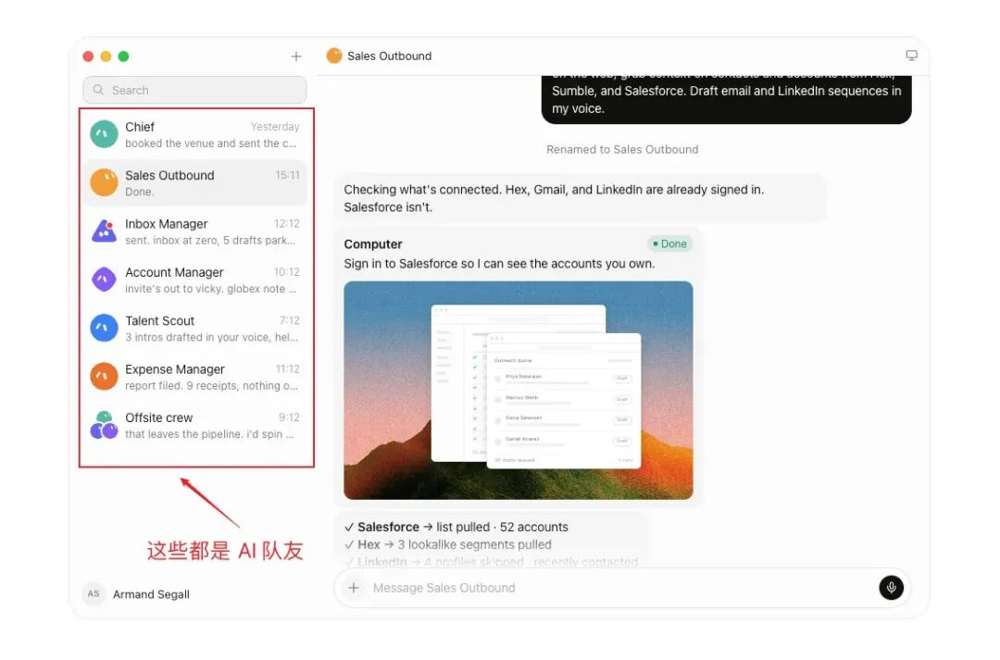
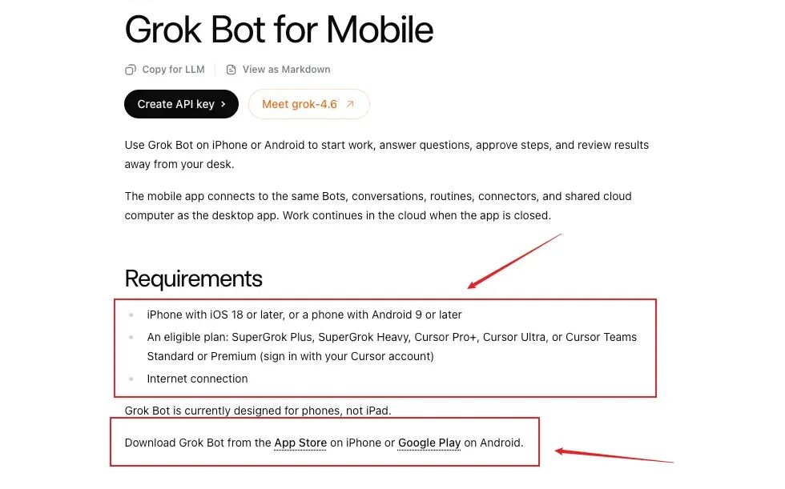
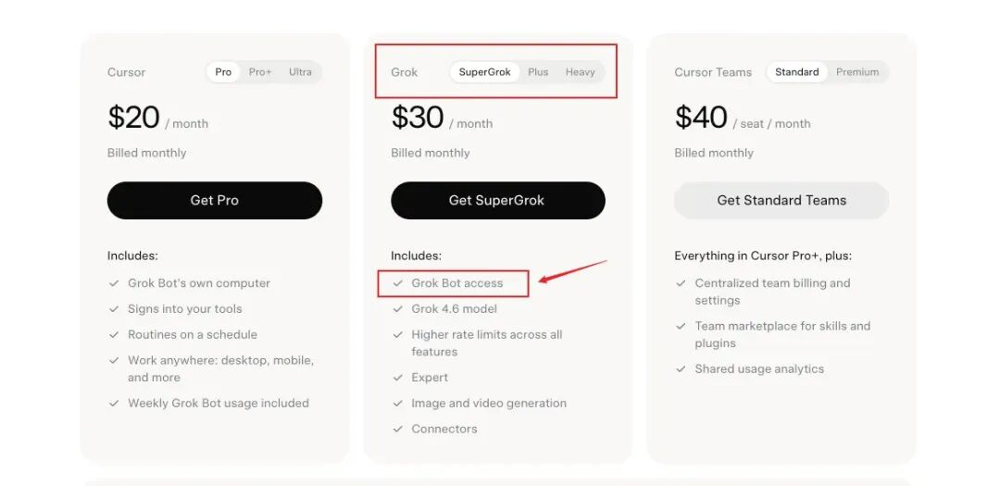
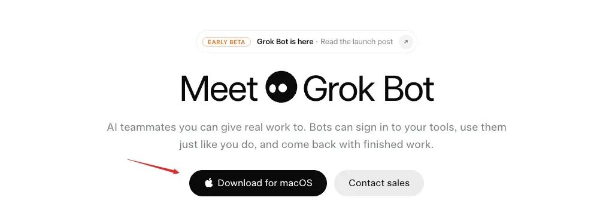
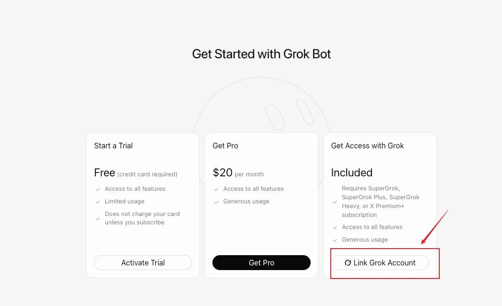
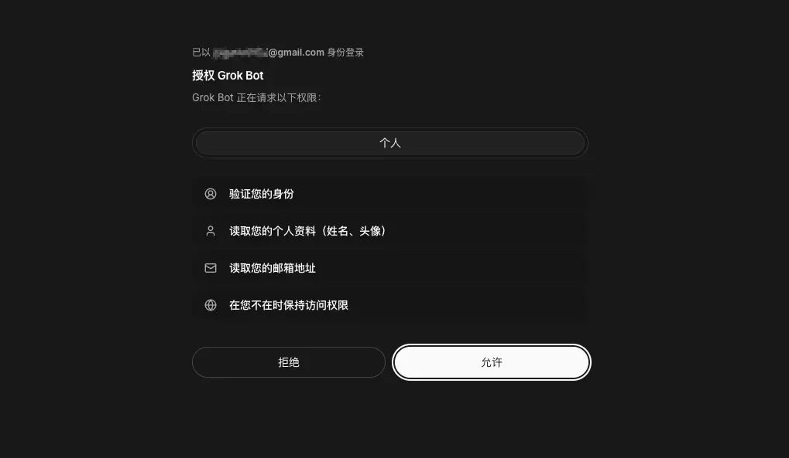
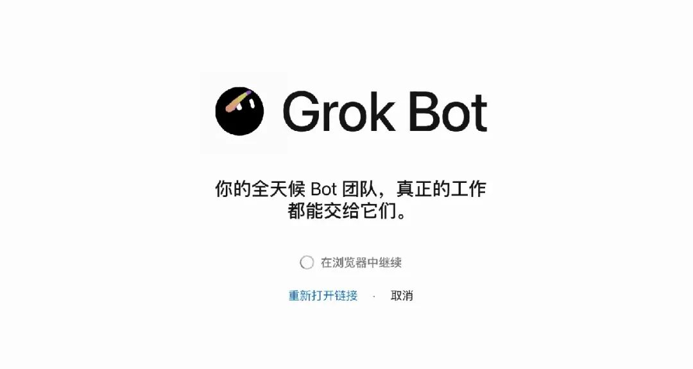
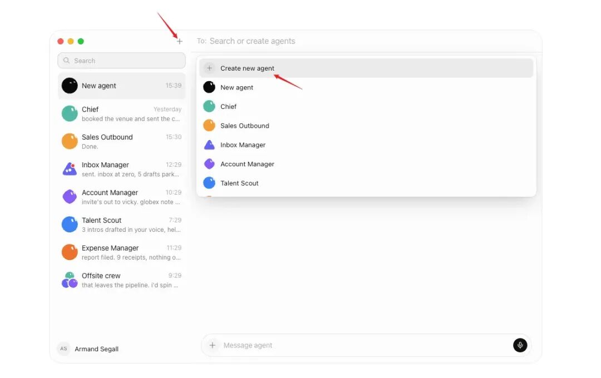
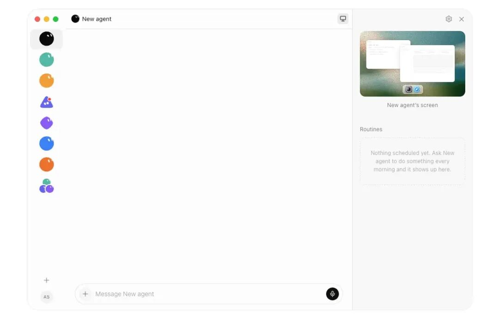

# Grok Bot 保姆级教程：是什么、怎么用，SuperGrok 如何升级？

Source: https://mp.weixin.qq.com/s/RIWTTb1rNOawyMOqYaL5ZA

原创

摆烂工程师
摆烂工程师

摆烂工程师

在小说阅读器读本章

去阅读

在公众号小说中沉浸阅读

过去我们使用 AI，通常是“问一个问题，得到一个回答”。

但 Grok Bot 想做的，并不只是陪你聊天，而是像一名真正的 AI 队友一样，接收任务、打开网页、操作软件、处理文件，并把结果完整交付给你。

简单来说：**Grok 帮你回答问题，Grok Bot 帮你完成工作。**

目前 Grok Bot 已经面向符合条件的 SuperGrok 和 Cursor 用户开放。本文将从零开始讲清楚：Grok Bot 是什么、能做什么、需要什么会员，以及国内用户如何升级 SuperGrok 并完成安装与使用。

> ❝
>
> 说明：Grok Bot 仍处于快速更新阶段，界面和入口可能随版本调整。本文依据 2026 年 9 月初官方公开信息整理，实际资格请以 Grok Bot Access 页面显示为准。

## 一、Grok Bot 是什么？

Grok Bot 是 xAI 推出的 AI 执行型助手。官方把每一个 Bot 定义为一名可以长期协作的 AI teammate，也就是“AI 队友”。

它与普通 AI 对话最大的区别，是拥有一台持续运行的 **云端电脑** （还是一台 8核16G，硬盘 120 GB SSD，网络带宽约 900Mbps 的云电脑了！），里面包括浏览器、文件系统和终端。获得授权后，它可以像人一样进入网站或应用完成工作，而不只是告诉你“应该怎么做”。

例如，你可以直接交代：

> ❝
>
> 帮我收集最近一周 AI 行业的重要新闻，优先查看 xAI、OpenAI、Anthropic 和 Google 的官方信息，整理成中文摘要，并给出 5 个适合公众号的选题。不要发布，只把结果交给我确认。

接到任务后，Grok Bot 可以自行查找资料、保存链接、整理内容并输出成稿，不需要你一步一步指挥它点击哪里。

| 普通 Grok | Grok Bot |
| --- | --- |
| 更偏向问答和内容生成 | 更偏向执行完整任务 |
| 通常是一问一答 | 可以持续工作并汇报进度 |
| 主要在聊天窗口中完成 | 拥有独立的云端电脑 |
| 需要用户自己操作网站 | 授权后可操作网页和应用 |
| 更像智能助手 | 更像可以长期协作的 AI 队友 |

而且 Bot 是持久存在的。它可以逐渐记住自己的工作职责、常用文件、浏览器登录状态和你的输出偏好，不必每次都从零开始解释。

## 二、Grok Bot 可以用来做什么？

Grok Bot 更适合目标清晰、需要多个步骤才能完成的工作。

### 1. 自动查资料

例如：

> ❝
>
> 搜集最近 7 天 Grok 相关的重要更新，每条保留发布时间、原始链接和核心变化，最后整理成一份中文周报。

### 2. 处理文件

你可以上传 PDF、表格、图片或其他资料，让它提取信息、做对比、整理重点。

例如：

> ❝
>
> 总结这份 PDF 的 5 个核心结论，并单独列出所有日期、决定和待处理事项。每一项注明对应页码。

### 3. 操作网站和后台

在获得授权后，它可以打开数据后台、CRM、邮箱或其他网页工具，读取信息并完成指定操作。

例如：

> ❝
>
> 打开数据后台，对比本周与过去四周的新用户转化情况，找出变化最大的环节，并整理一份排查建议。不要修改后台数据。

### 4. 创建不同岗位的 AI 队友

你可以分别建立：

* 内容运营 Bot
* 行业调研 Bot
* 数据分析 Bot
* 产品经理 Bot
* 开发与测试 Bot
* 客服复盘 Bot

相比创建一个“什么都做”的万能助手，让每个 Bot 只负责一种明确工作，更容易积累有效的长期上下文。

## 三、什么会员可以使用 Grok Bot？

关于 Grok Bot 的访问和使用权限，这是很多用户最关心的问题。

Grok Bot 刚开放时，官方文档只列出了部分高阶套餐；不过 xAI 在 2026 年 8 月 26 日进一步扩大了使用范围。按照目前官方公布的最新资格，个人用户可使用的套餐包括：

* SuperGrok
* SuperGrok Plus
* SuperGrok Heavy
* Cursor Pro
* Cursor Pro+
* Cursor Ultra
* Cursor Teams Standard / Premium

也就是说，**目前普通的 SuperGrok 会员已经包含 Grok Bot 使用资格**，并不一定要升级到更高价的 SuperGrok Plus 或 Heavy。

需要注意的是，Grok Bot 拥有单独的使用额度，它的消耗不会直接占用现有 Grok 或 Cursor 套餐中的普通使用额度。不同会员档位的额度和开放状态可能调整，建议进入 Grok Bot Access 页面再次确认。

### 设备要求

目前官方支持：

* macOS：Apple 芯片和 Intel 芯片
* Windows：x64 和 Arm64
* iPhone：iOS 18 或更高版本

目前还没有 Linux 桌面客户端，但也可以下载对应系统进行安装 Grok Bot，就是安装流程会相对比较复杂。

关于桌面客户端的官方的下载和安装地址文档：https://x.ai/bot

## 四、没有 SuperGrok，国内用户怎么升级？

如果你没有 Cursor 会员，也没有可用的 SuperGrok 套餐，可以先完成 SuperGrok 升级，再进入 Grok Bot。

如果没有升级为 SuperGrok 的话，授权时，无法访问 Grok Bot 的页面。

### 方法一：通过官方订阅

有可用海外支付方式的用户，可以直接登录 Grok 官网，在会员页面选择 SuperGrok，并按照页面提示付款。

### 方法二：通过国内升级入口完成充值

如果没有海外信用卡，可以使用 SuperGrok 升级服务：

> ❝
>
> **SuperGrok 升级入口：grokng.com**

目前该站点采用充值码与 Grok User ID 的直充方式，不需要提供 Grok 账号密码。大致流程如下：

1. 在网站进入购买入口，完成下单并取得充值码；
2. 在充值页面验证充值码；
3. 登录自己的 Grok 账号，找到并复制 Grok 用户 ID；
4. 将用户 ID 填回充值系统，核对账号后提交升级；
5. 升级完成后，返回 Grok 会员页面确认套餐状态。

Grok 用户 ID 一般是类似下面这样的 UUID 格式：

> ❝
>
> xxxxxxxx-xxxx-xxxx-xxxx-xxxxxxxxxxxx

整个过程充值到自己的 Grok 账号，只需要 User ID，不需要把登录密码交给其他人。

升级完成后，建议先打开 Grok 会员页面确认已经显示 **SuperGrok**，然后再前往 Grok Bot Access 页面登录。由于会员资格和产品入口可能分批同步，如果刚升级后暂时没有显示，可以稍后重新登录或刷新资格页面。

## 五、Grok Bot 下载与安装教程

完成会员准备后，打开 xAI 官方 Grok Bot 页面 x.ai/bot，进入 Access 或 Download 区域。

### macOS 用户

首先确认自己的 Mac 使用哪一种芯片：

* 在左上角点击苹果图标；
* 选择“关于本机”；
* 显示“芯片”一般代表 Apple Silicon；
* 显示“处理器”一般代表 Intel。

然后按照设备选择对应版本：

1. 下载 Apple Silicon 或 Intel 版本；
2. 打开下载好的 DMG 文件；
3. 将 Grok Bot 拖入 Applications；
4. 打开 Grok Bot；
5. 如果 macOS 弹出安全确认，点击“打开”。

### Windows 用户

可以进入“设置 → 系统 → 系统信息”，查看电脑属于 x64 还是 Arm64，然后：

1. 下载对应的安装程序；
2. 双击运行安装；
3. 安装完成后，从开始菜单打开 Grok Bot。

Grok Bot 会自动检查更新，也可以在 Settings → Beta → Check for Updates 中手动检查。

## 六、第一次登录，为什么会出现 Cursor？

打开 Grok Bot 后，点击欢迎页面中的 **Get started**，浏览器会自动打开认证页面。按照页面提示完成登录后，再返回 Grok Bot 客户端。

你大概率会疑惑：

> ❝
>
> 我明明开通的是 SuperGrok，为什么页面上出现了 Cursor？

这是因为当前 Grok Bot 使用 Cursor 的账号认证和部分数据设置。官方同时支持符合资格的 SuperGrok 与 Cursor 套餐，出现 Cursor 登录字样并不代表你必须重新购买 Cursor 会员。

**这边你选择 Grok 账户进行授权登录即可：**

首次进入时，系统会简单介绍 Bots、共享云电脑和 Routines，并询问你经常使用哪些工具。这一步主要用于推荐适合你的 Bot，不会自动连接或修改这些工具。

如果登录后提示套餐不符合资格，可以依次检查：

1. SuperGrok 是否已经在 Grok 账户中正常生效；
2. 当前登录的是否为同一个账号或对应的认证账号；
3. 退出 Grok Bot 后重新登录；
4. 回到 Access 页面重新检查资格；
5. 仍未识别时，通过官方支持入口反馈。

## 七、创建你的第一个 Grok Bot

首次登录后，可以从推荐的 AI 队友中选择一个，也可以点击 **Create your own** 自己创建。

创建时主要填写三个内容：

### Name：Bot 名称

名称尽量简单，方便以后快速找到，例如：

> ❝
>
> AI 情报员

### Job：主要工作

只写它最核心的职责，例如：

> ❝
>
> AI 行业信息研究

### Description：工作方式

把长期有效的工作要求写在这里，例如：

> ❝
>
> 持续关注 xAI、OpenAI、Anthropic 和 Google DeepMind 的官方更新，优先使用一手来源。输出中文摘要，保留发布日期和原始链接，并区分官方事实与个人判断。未经确认，不发布任何内容，也不向外发送消息。

一个 Bot 最好只承担一个清晰岗位。与其创建“万能 AI 助手”，不如分别创建内容 Bot、调研 Bot 和数据 Bot。这样每个 Bot 的历史、文件和偏好都更聚焦。

后续也可以通过侧边栏的 **New → Create new agent** 创建更多 Bot。

## 八、如何正确给 Grok Bot 分配任务？

虽然 Grok Bot 可以理解自然语言，但任务写得越清楚，结果通常越稳定。

一个完整的任务最好包含 5 个部分：

1. **目标**：最终要完成什么；
2. **来源**：需要查看哪些网站、文件或应用；
3. **限制**：哪些事情不能做，哪些操作必须先询问；
4. **交付物**：最终用什么格式返回；
5. **确认节点**：执行到哪一步必须停下来等你确认。

下面是一段可以直接复制测试的提示词：

> ❝
>
> 帮我整理最近一周 Grok 相关的重要更新。
>
> 优先查看 xAI 官方网站、官方文档和 X 上的官方账号，找出最值得关注的 10 条信息。
>
> 每条内容包含：事件、发布时间、信息来源、核心变化和可能影响，并保留原始链接。
>
> 最后整理 3 个适合公众号的选题，每个选题附一个标题和内容角度。
>
> 不要发布、转发或发送任何内容，只把整理结果交给我确认。

这里最后一句非常重要。**第一次使用时，建议先让 Bot 做“读取、整理、起草”类工作，不要一开始就授权它直接删除、支付、发布或发送消息。**

## 九、云电脑、Take Over、Skills 和 Routines

### 1. 云端电脑

Grok Bot 拥有持续运行的云端电脑（全天候 24 小时运行），可以使用浏览器、文件系统、终端、Plugins 和 MCP。即使你暂时离开电脑，已经分配的任务也可以继续在云端运行。

需要特别注意：同一账号下的多个 Bot 会共享这台云电脑，也会共享里面的文件、浏览器 Session 和网站登录状态。因此，不能把不同 Bot 当作互相隔离的安全空间。

### 2. Take Over：需要登录时由你接管

当 Bot 打开的网站需要密码、Passkey、两步验证码或 CAPTCHA 时，它会提示你接管电脑。

正确操作方式是：

1. 打开对话中的 Agent Computer；
2. 点击 Take Over 接管；
3. 自己输入密码、验证码或完成 CAPTCHA；
4. 完成后把控制权交还给 Bot；
5. 告诉它继续执行。

> ❝
>
> **不要把密码或一次性验证码直接发送在普通聊天窗口中。**

### 3. Skills：把成功方法保存下来

当某项工作已经跑通，可以让 Bot 把操作过程保存成 Skill。

例如：

> ❝
>
> 把刚才整理 AI 周报的方法保存成一个 Skill，名称为“AI 周报整理”。保留信息来源、筛选标准、输出格式，以及任何发布操作都必须经过我确认的规则。

Skill 更像一套可重复使用的标准操作方法。

### 4. Routines：让任务按计划自动运行

Routine 用来规定某个 Bot 在什么时间或条件下执行工作，例如：

* 每天早上整理行业新闻；
* 每周一生成运营周报；
* 定期检查后台数据；
* 每晚汇总当天的客户反馈。

比较稳妥的使用顺序是：**先手动完成一次任务 → 调整到稳定 → 保存为 Skill → 最后再设置 Routine。**

## 十、Grok、Grok Build 和 Grok Bot 有什么区别？

这三个产品很容易被混在一起，其实定位并不相同。

| 产品 | 主要定位 | 更适合的任务 |
| --- | --- | --- |
| Grok | 通用 AI 助手 | 问答、写作、分析、图片和日常创作 |
| Grok Build | AI 编程 Agent | 写代码、修改项目、运行命令和开发软件 |
| Grok Bot | 通用执行型 AI 队友 | 跨网页、应用和文件完成完整工作 |

可以简单理解为：

> ❝
>
> **Grok 帮你想，Grok Build 帮你写代码，Grok Bot 帮你把工作真正做完。**

Grok Bot 能做的事情非常广，你可以让他去给你注册 Claude、ChatGPT 账号、给你做 MV 视频都行。

## 十一、使用 Grok Bot 前，建议先做好这些安全设置

Grok Bot 能真正操作工具，因此权限边界比普通聊天更加重要。

建议在任务中明确写出：

> ❝
>
> 任何发送消息、发布内容、购买付款、删除文件、修改权限和生产环境变更，都必须先向我展示具体内容并获得确认。

同时注意以下几点：

* 第一次使用时，优先安排只读或起草类任务；
* 只连接当前工作真正需要的应用；
* 密码、验证码和付款确认自己接管完成；
* **重要操作优先选择 Allow once，不要随意设置 Always allow；**
* 不再使用某个网站时，及时退出登录或撤销授权；
* 定期检查已经启用的 Plugins、Skills 和 Routines；
* 对重要结果要求保留链接、截图或操作记录。

AI 可以代替你执行操作，但最终权限仍然应该由你掌握。但在日常使用时，我觉得没有什么重要的东西，也相信 AI，我大部分都设置为  Always allow，他就一直运行，我只需要看到结果就行。

## 十二、Grok Bot 常见问题

### 1. 普通免费 Grok 能使用 Grok Bot 吗？

目前免费账号不是官方列出的常规完整使用方案。部分页面可能提供试用，但长期使用仍建议准备符合资格的 SuperGrok 或 Cursor 套餐。

### 2. 普通 SuperGrok 能使用吗？

可以。xAI 在 2026 年 8 月 26 日宣布扩大资格后，SuperGrok、SuperGrok Plus 和 SuperGrok Heavy 都已被列入支持范围。

### 3. 没有海外信用卡怎么升级？

可以通过 grokng.com 获取 SuperGrok 升级服务，按照充值码和 Grok User ID 的流程升级自己的账号，无需提供账号密码。

### 4. Grok Bot 可以在手机上使用吗？

可以。目前官方支持 iOS 18 或更高版本的 iPhone，桌面端与手机端会同步 Bot、对话、Routines 和云端电脑。

### 5. 关掉电脑后，任务还会继续吗？

Bot 的主要工作运行在云端电脑中，因此已经交付的任务可以继续运行。不过涉及人工确认、登录验证或批准的步骤时，它仍会暂停并等待你处理。

### 6. 多个 Bot 的账号和文件是完全隔离的吗？

不是。同一用户下的 Bots 共享一台云端电脑及其中的文件、浏览器登录状态和部分权限，不要把不同 Bot 当成独立的安全边界。

## 最后总结

Grok Bot 真正值得关注的地方，不是它又增加了一个聊天窗口，而是 AI 开始从“给出答案”进一步走向“完成任务”。

它可以拥有自己的岗位、云端电脑和长期工作上下文，也可以把稳定的方法保存成 Skill，再通过 Routine 重复执行。对于内容运营、行业调研、数据分析、产品工作和日常办公来说，它都可能成为一个非常实用的 AI 队友。

如果你已经拥有符合资格的 SuperGrok 或 Cursor 套餐，可以直接进入 Grok Bot 官方页面下载安装。

如果还没有 SuperGrok，可以先完成账号升级：

> ❝
>
> **SuperGrok 升级入口：grokng.com**

建议收藏站点，后续续费时可以直接使用。

## 官方参考资料

* Grok Bot 官方介绍 (https://docs.x.ai/grok-bot/overview)
* Grok Bot 入门教程 (https://docs.x.ai/grok-bot/get-started)
* Grok Bot 扩大会员支持范围公告 (https://x.ai/news/grok-bot-more-plans)
* Grok 官方套餐对比 (https://x.ai/pricing)
* Grok Bot 安全与权限说明(https://docs.x.ai/grok-bot/approvals-security-and-privacy)
* Grok Bot Skills 与 Routines (https://docs.x.ai/grok-bot/skills-routines-and-automations)
* Grok Bot iOS 使用说明 (https://docs.x.ai/grok-bot/mobile)

预览时标签不可点

微信扫一扫  
关注该公众号

知道了

微信扫一扫  
使用小程序

取消
允许

取消
允许

取消
允许

×
分析

微信扫一扫可打开此内容，  
使用完整服务

：
，
，
，
，
，
，
，
，
，
，
，
，
。
 
视频
小程序
赞
，轻点两下取消赞
在看
，轻点两下取消在看
分享
留言
收藏
听过