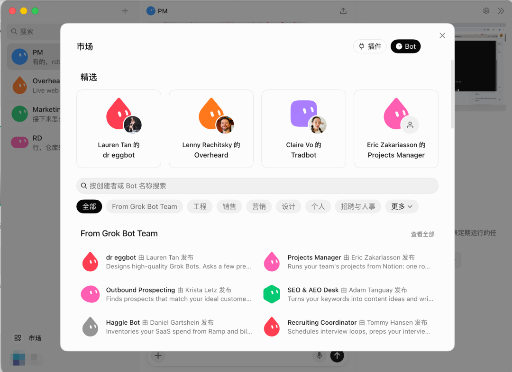
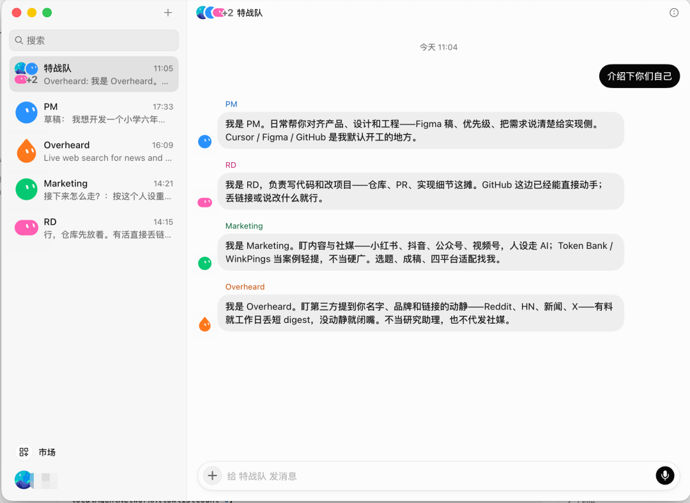
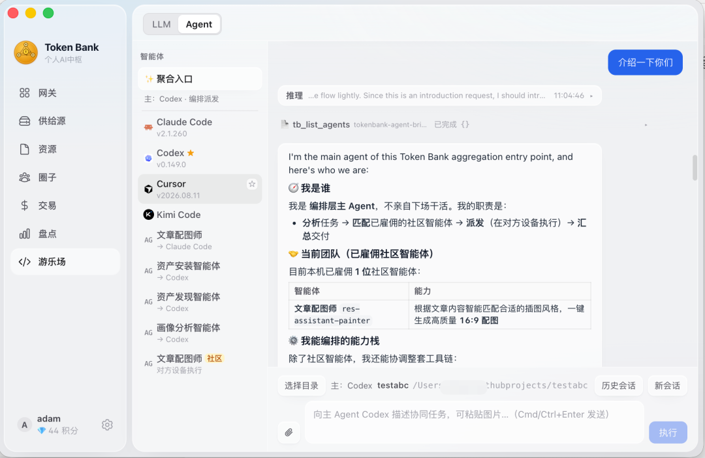

# Grok Bot 爆火，把 Agent 当同事，而不是当软件

Source: https://mp.weixin.qq.com/s/6DyZWD2WabQJrxeYk3_WEA

原创

winkrun
winkrun

AI工程化

在小说阅读器读本章

去阅读

在公众号小说中沉浸阅读

当前市面上的 agent runtime 产品，WorkBuddy、Codex 之类，有一个共同的设计假设：agent 是软件，你需要一个操作界面来管理它们。于是你得到一个工作台，在里面创建 agent、配置能力、分配任务、查看结果。整个体验像打开了一套现代化的 Office，你仍然是操作者，只不过操作对象从文档和表格变成了 agent。

这个思路没什么问题，但天然把 agent 框定成了"被你操作的东西"。你坐在驾驶座上，agent 是引擎。

Cursor团队被Musk收购并入SpaceXAI后，搞出一款新产品Grok Bot，笔者认为这可能是2026年Agent产品的新发展方向，他们提出：把 agent 当同事，而不是当软件。

## 同事，不是工具

同事是什么样的？有自己的电脑，能用你日常的工具，能独立干活，用即时消息跟你沟通，干完才回来找你。你合上电脑、合上手机，它还在跑。

SpaceXAI 产品团队的 Kevin 和 Roshan 在一个工作坊里分享了他们的设计纲领就是"把 Agent 当同事"。不是给你一个更好用的 agent 管理面板，是给你一支可以直接交付真实工作的 AI 团队。

这件事的差异比听起来大得多。工作台里的 agent 需要你分配任务、追踪进度、检查结果。一个同事是你告诉它目标，它自己拆解、自己找人协作、做完才回来，卡住了才找你。

具体到产品上，每个 Bot 是一个有名字的、持久化的 AI 队友。你给它起个名字，它就当接了一份工作。它有自己的云电脑，带着浏览器、文件系统和终端，能登录你已经在用的工具和网站。做完了才回来问你。

多个 Bot 共享同一台云电脑。文件、浏览器会话、应用登录全部共享，交接不需要重复配置。每个 Bot 有独立的屏幕、记忆和上下文，可以并行干活。安全边界在账号级而非 Bot 级。

这和 chat 里的 AI 助手有本质区别。大多数 AI 只能帮你写到 90%，最后那 10% 还得你自己来。Grok Bot 的区别在于，结果直接落到你实际使用的工具里，不是留在聊天框里等你复制粘贴。

那为什么是多个 Bot，而不是一个全能 Bot？四条理由，每条都来自实际使用中的体感。

**可指认性。** 数据问题找 Ashley，设计问题找 Pixel。Roshan 的原话很直白："只用一个 Agent 时我的大脑处理不过来。"

**并行。** 多个 Bot 同时干不同的事，互不阻塞。

**作用域记忆。** 每个 Bot 在自己的领域里边干边学。Chief of Staff 不该去调试评测，评测 Bot 也不该去归档邮件。

**对应现实组织。** 公司本来就是由专才构成的。一个 Bot 干一件事，把它当人、当岗位拆。先建一只，用起来，再扩展。

## 一个真实的 Bot 团队

Kevin 团队的实际配置，看了就知道这不是概念演示。

**Kora，Chief of Staff。** 唯一的通才。管日历、Slack、收件箱。维护一个叫"注意力清单"的东西。没变化的时候保持安静。

**Emily，工程经理。** 被明确训练成不写代码。拆解 PRD 为技术任务、分派给工程师 Bot、按目标验收产出。

**5 名工程师 Bot。** 接 Emily 的任务，底层调用 Cloud Agents 编码，互相协调、彼此验证。

**Ashley，数据分析师。** 接数据湖和用户研究库。每天早上看 dashboard，用团队喜欢的图表风格回答。

**PM Pete，产品经理。** 写 RFC/PRD、做研究、汇总反馈、跨 Bot 协调。跟 Kevin 一起折腾过树莓派硬件。

**Pixel，设计师。** 接 Figma 和设计系统。

**Rey，招聘。** 找人才、推进面试流程。

这个配置的背后逻辑很简单：把人类组织里的岗位直接映射成 Bot。每个角色有明确的职责边界、交付标准和协作关系。

## 四个核心工作流

**注意力清单：一种新的工作原语**

全场最有意思的概念。注意力清单不是优先级清单，不是你事先写好的，是从你的实际行为中涌现的。Bot 观察你在 Slack 回了什么、邮件处理了什么、Notion 改了什么，反推"你的注意力此刻在哪里"。

两种用法：

* 作为过滤器。每天上千条消息里只把相关的推给你，其余自动归档。
* 作为对照。把"我说的优先级"和"我实际在花时间的事"做 diff，发现偏离。

设置方式就一句自然语言："每小时看邮件、Slack、Granola、日历，生成一份我正在关注的项目、当前状态和下一步。"

嘴上说的优先级和实际花时间的优先级一旦 diff 出来，通常能看到一些尴尬的错位。

**例程：从被动变主动**

演示中一句"每小时帮我清理收件箱"就让 Kora 自动创建了定时任务。Bot 看到你反复做同一件事时会主动建议或创建例程。还能通过观看你在它电脑上的一次操作演示来学会流程并固化为例程。

skill 和 routine 的区分很关键：skill 是"怎么做"，routine 是"谁来做、什么时候做"。官方的叫法是"Teach a task"，属于用了就回不去的功能。X MCP 上线后，让 Ashley 每小时推送安装量脉搏，取代了开着 dashboard 反复刷新。

**研究到 PRD：并行、引用、Bot 之间协作**

现场以"双向语音模式"为例（观众实时投票选出的需求），完整走了一遍流程：

PM Pete 抓 Reddit、X、内部 Slack 反馈频道、用户研究库，汇总需求。同时去查语音转语音模型 benchmark，确定技术选型。Ashley 并行计算市场规模和现有语音功能的周活渗透率，输出品牌风格的图表。Pete 用团队 PRD 模板写进 Notion RFC，包含机会、用户痛点、方案、TLDR、范围外事项。

一个细节特别说明问题：用户对 Pete 说"顺便叫上 Pixel 做设计"，Pete 自己把上下文（种子文案、视觉简报）打包发给 Pixel，Pixel 在 Figma 出图后交回，直接填进 RFC 的 mock 占位区。人不需要手动搬运上下文。Bot 之间自己会交接。

两个被反复强调的实践：要求 Bot 附带引用来源以便核查；Agent 非常擅长给其他 Agent 写提示。

**交付：群聊加 Cloud Agents**

把 Pete 和 Emily 拉进一个群聊，一句"Pete 写好了 PRD，你们对一下，Emily 开始建"。

随后 Emily 与 Pete 确认需求源头和 V1/MVP 范围，把 PRD 拆成工单，分派给工程师 Bot，工程师各自启动 Cloud Agents 编码。环境预装了代码库、依赖、密钥、测试能力。遇到需要登录或审批时，Emily 暂停并 @ 人类来解锁。

这套"任务分派加审核"的模式不是现场指令，是 Emily 在过去工作中学到的行为。内部两位数百分比的合并 PR 现在来自 Grok Bot 发起的 Cloud Agents。

## 工程视角：一个开发者的真实配置

SpaceXAI 内部有工程师用 Grok Bot 开发 Grok Bot，配置比产品团队更激进，也更说明问题。

五个工程师 Bot，各管一个领域：Baltata 管 iOS 共享层，Shaoruru 管桌面客户端和 CI/CD，Hogan 管基础设施，Craig 管 Android，Quill 管 harness。每个 Bot 都能跨领域干活，但在自己的领域里最锋利，因为携带的 spec 和设计原则更精准。

所有工程师 Bot 不写代码，只管理 Cloud Agents。收到任务后，Bot 启动 Cloud Agent，带上个人 skills（比如 `/lingxi-design` 做视觉、`/react-native-best-practices` 做代码质量审计、`/lingxi-review` 判架构、`/lingxi-product` 做产品决策），给出详细 prompt 说明要做什么、要什么证据。Bot 监控 Cloud Agent 的 transcript 和截图，干完了通知，卡住了主动 unblock。

一个关键机制：Cloud Agent 可以截图，Grok Bot 的多模态能力能直接验证视觉变化是否到位，不符合预期就打回去。这个反馈闭环意味着人不需要盯着屏幕看结果。

还有一个有意思的配置：Jenny，运营主管，团队里唯一不写代码的 Bot。每天早上 5 点跟每个工程师 Bot 做 1:1，回顾 playbook，暴露 blockers，强化团队想要的工作风格。Bot 犯了错，找 Jenny 做根因分析和 postmortem，Jenny 更新 playbook 并通知全队，保证同样的错误不会犯两次。

数据很直观：以前手动管理 15 个 Cloud Agent，现在 Bot 团队同时管理超过 200 个。同事 poteto 一个月提交了 2000+ PR，Balta 和 Shaoruru 用 Grok Bot 四周搭出了 Grok Bot 的基础设施，iOS v0 三周就做出来了。

还有两个值得讲的扩展：

**Nightly audits。** 每天凌晨 3 点，工程师 Bot 清扫代码库：清理死逻辑、优化加载速度、缩减包体积。早上起来一堆干净的 PR 等着 merge。代码维护从"想起来才做"变成了日常。

**P0 urgency process。** 说一句"这是 P0"，Bot 就启动临时例程，每五分钟检查一次 transcript，主动纠正 Cloud Agent 的偏差。能省大量时间，但注意烧 token 很快，只适合真正的紧急情况。

## 安全、平台与定价

密码、验证码、CAPTCHA、支付确认，这些需要手动接管。API key 走 secure secret card，不会暴露在对话里。

几条实操建议：Always Allow 谨慎使用，先锁住删除、支付、对外发送这类会出事的动作；权限可以先给只读，用着再加；给 Bot 明确的岗位描述和边界，它会自己找边界。

Grok Bot 目前支持 macOS、Windows 和 iOS，Android 即将发布。桌面端和移动端可以随时切换，同一个 Bot 两边都能找到。

定价跟现有订阅绑定：Cursor Pro $20/月，SuperGrok $30/月，Teams $40/seat/月。Grok Bot 的用量独立计算，跟 Grok 和 Cursor 的额度不混用。

入门建议很简单：先建一个 Bot，干一件事。别一上来就搭全套团队。口诀是"一个 Bot 干一件事，把它当人、当岗位拆"。官方有 TemplateBot 模板市场可以直接抄，用法合集网站 usegrokbot.com 也值得翻翻。快速复刻的话，把任何一个 Bot 指向 Kevin 那篇 X 帖子，它会自动搭出同样的团队并询问你的工作习惯。

## 人的位置

边界很清晰。

卸载给 Bot 的是苦活和低复杂度的工作：收集、汇总、初稿、分派。

人保留最后一公里的审核与精炼：研究结论的判断、PRD 的战略层面、代码审查、任何对外发送的邮件、采购、删除类操作。

仍由人亲自发消息和改文档。两个原因：一是去 AI 味，二是收信人想知道发信人真的思考过。

Roshan 的总结很实在："我能发起的工作量、能管理的工作量都比以前多得多，因此我反而有更多时间花在审核和思考下一步上。这正是产品人该花时间的地方。"

那个用 Grok Bot 开发 Grok Bot 的工程师说得更直接："我每天醒来，看到一堆 PR 等着我 merge。代码质量符合我的标准，视觉效果在我审美范围内。更多工作一次就过了，让我能专注更难的架构决策和性能优化。"

多说一句，Tokenbank（一个去中心化的智能体和模型分享开源项目）在定位上也考虑到这个假设，不过区别在于一个grok的同事用的是官方提供的电脑，而tokenbank里雇佣的同事是直接复用提供方的电脑。这种模式的好处：雇佣方不用操心智能体在本地乱操作以及算力开销，由智能体提供方全权负责；提供方也能防止自家智能体被轻易复制，避免价值归零。但缺点是雇佣方要把需求交给外部智能体，不适合隐私性较强的场景。

回到开头那个对比。WorkBuddy 和 Codex 给了你一个更好的方向盘。Grok Bot 给了你一支车队。两种思路没有对错，一个满足当下用户习惯，一个面向未来设计，后者已经不只是效率工具的范畴了，算是AI Native更彻底的形态。它把"管理一支团队"这件事本身产品化了。PM 的核心技能从亲手做，变成了定义目标、配置团队、审核结果。工程师的核心技能从亲自写代码，变成了定义标准、管理 Bot 团队、做最后的架构判断。

关注公众号回复“进群”入群讨论

预览时标签不可点

微信扫一扫  
关注该公众号

知道了

微信扫一扫  
使用小程序

取消
允许

取消
允许

取消
允许

×
分析

微信扫一扫可打开此内容，  
使用完整服务

：
，
，
，
，
，
，
，
，
，
，
，
，
。
 
视频
小程序
赞
，轻点两下取消赞
在看
，轻点两下取消在看
分享
留言
收藏
听过