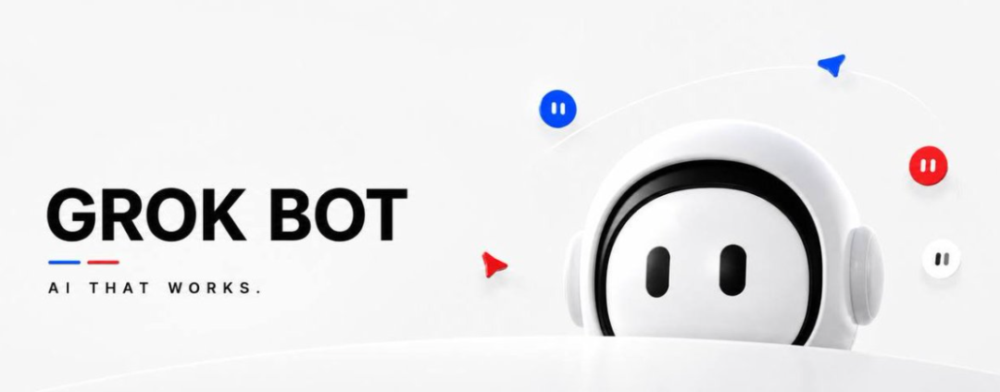

# Grok Bot来了：AI不再是你使用的工具，而是你可以“雇佣”的数字员工

Source: https://mp.weixin.qq.com/s/Hp1IZs8gwpom87fMYCyAgg

小军的求知笔记

在小说阅读器读本章

去阅读

在公众号小说中沉浸阅读

过去三年，我们一直在使用 AI。

**接下来，我们可能开始“雇佣”AI。**

想象一下。

你下班了，电脑关了。

但你交给 AI 的任务还在继续：

它登录你的邮箱，查看新客户；

打开网站，研究潜在客户；

把信息整理进 CRM；

根据客户情况准备开发邮件；

持续关注邮箱回复；

遇到重要决策时，再回来问你：

**“这一步需要你的批准。”**

这听起来不像传统意义上的聊天机器人。

更像是：

**你真的雇了一个员工。**

这正是 xAI 推出的 **Grok Bot** 想要实现的事情。

xAI 官方将 Grok Bot 定义为可以持续工作的 AI teammates。每个 Bot 都拥有自己的持久化云端计算机，可以使用浏览器、文件系统、终端以及连接的工具，并且不依赖你的电脑一直开着。

而我认为，这背后真正重要的变化，并不是：

**Grok 又变聪明了一点。**

真正重要的是：

# **Grok开始拥有自己的“工作场所”。**

---

## 

## 01｜我们使用AI的方式，其实一直没变

回想一下过去几年我们是怎么使用 AI 的。

你问 ChatGPT：

> “帮我研究10家公司。”

AI给你结果。

然后呢？

你复制。

粘贴到 Excel。

接着，你又说：

> “帮我给这些客户写开发邮件。”

AI写完以后，你复制到 Gmail。

然后自己检查。

客户回复了，你又把新的上下文复制回来。

再问 AI：

> “这个客户是什么意思？我应该怎么回复？”

整个过程中，AI可能完成了 **70%的思考工作**。

但你仍然完成了：

**100%的流程编排。**

你负责：

打开软件 → 切换窗口 → 复制 → 粘贴 → 检查 → 再次输入指令 → 再复制 → 再粘贴……

所以过去的 AI，本质上是：

> **AI负责思考，人负责操作。**

而 Agent 正在改变这件事情。

---

# 

# 02｜从“帮我做”到“把它做完”

传统 AI 的交互方式是：

> **“帮我完成这件事情。”**

未来的 Agent 更接近：

> **“把这件事情做完。”**

这是一个非常大的变化。

因为前者的最终产品是：

**答案。**

而后者的最终产品是：

# **结果。**

这就是 Grok Bot 最值得关注的地方。

一个 Bot 可以拥有自己的电脑环境，进入你正在使用的网站和应用，执行多步骤任务，并在需要的时候回来找你。xAI 官方目前也明确强调了它可以登录用户的工具、并行运行多个 Bot，以及持续工作。

于是：

**AI不再只是一个工具。**

它开始成为：

**一个工作主体。**

---

# 

# 03｜xAI其实已经为这一天准备了很久

Grok Bot并不是突然出现的。

如果把 xAI 最近推出的一系列能力放在一起看，会发现一条非常清晰的路线。

### Memory： 让 AI 记住你的工作方式。

### Skills：让 AI 掌握特定任务和工作能力。

### Connectors：让 AI 进入邮箱、文件、日历以及其他工作系统。

### Tools：让 AI 获得真正的操作能力。

### Automations：让 AI 可以按照计划或者事件自动运行。

### Background Execution：让任务不需要你一直盯着屏幕。

### Persistent Computer

最后：

**给 Agent 一台属于自己的电脑。**

这些能力连接起来之后，AI 才真正从：

**“聊天机器人”**

变成：

**“数字员工”。**

---

# 

# 04｜最值得想象的场景：销售

我们拿最普通的销售工作举个例子。

过去，一个销售团队可能这样工作：

**第一步**

导出100个潜在客户。

↓

**第二步**

让 AI 研究这些客户。

↓

**第三步**

人工整理信息。

↓

**第四步**

让 AI 写个性化开发信。

↓

**第五步**

人工检查。

↓

**第六步**

复制到邮箱发送。

↓

**第七步**

第二天检查回复。

↓

**第八步**

继续处理下一批客户。

看起来 AI 已经参与了大量工作。

但你会发现：

**人依然是整个系统的“操作员”。**

---

## 如果换成一个Agent呢？

你可以直接告诉它：

> 研究所有新进入的合格销售线索。
>
> 查看他们的网站、公司信息和业务情况。
>
> 判断我们的哪个产品最适合他们。
>
> 准备个性化开发内容。
>
> 更新 CRM。
>
> 持续监控邮箱。
>
> 如果客户产生积极回复，准备下一步方案。
>
> 涉及重要操作时，先通知我。

然后：

**你去做别的事情。**

这就是完全不同的产品形态。

因为你不再是在：

**使用 AI。**

而是在：

# **管理一个 AI。**

---

# 

# 05｜人类的角色，会从“操作员”变成“审批者”

很多人想象 AI Agent 时，会想到一个完全不需要人的系统。

但我认为，更现实、也更有价值的模式恰恰不是这样。

**人依然存在。**

只是：

**人出现的次数越来越少。**

过去一个工作流程可能需要你做40个决定。

未来可能只需要：

> **批准这个营销活动。**
>
> **批准这笔采购。**
>
> **批准这次代码修改。**

剩下的几十个步骤：

**交给机器。**

这意味着，人机交互可能发生一次非常大的变化。

### 过去：

**点击 → 输入 → 复制 → 粘贴 → 点击 → 检查 → 重复**

### 未来：

# **分配 → 检查 → 批准**

这可能会成为 Agent 时代非常重要的交互模式。

---

# 

# 06｜“24小时工作”可能比你想象的更重要

一个人有工作时间。

传统软件需要有人打开。

而一个持续运行的 Agent：

**不需要。**

它可以持续运行。

即使你已经关闭电脑，它依然可以继续执行任务。xAI 官方文档明确描述了 Grok Bot 的持久化云端计算机环境，因此它的工作并不依赖用户电脑持续在线。

这并不意味着：

> **一个 Bot 马上取代一个员工。**

真正有意思的是另一件事。

过去很多工作：

**太琐碎。**

**太重复。**

**太碎片化。**

所以不值得安排一个人一直盯着。

但如果有一个 Agent 可以一直做：

那经济价值就出现了。

例如：

* 每15分钟检查一次邮箱
* 每天自动生成报告
* 持续监控 Bug
* 监控数据变化
* 自动更新 CRM
* 研究每一个新销售线索
* 检查运营系统
* 发现异常后通知负责人

这些事情一点都不酷。

但它们每天都在消耗大量人类时间。

所以未来最有价值的 Agent：

**可能不是那些最会炫技的。**

而是那些：

# **最擅长处理“无聊工作”的。**

---

# 

# 07｜下一代AI Benchmark，可能是“还给人多少时间”

过去几年，AI 行业一直在比较：

* 模型参数
* Context Window
* Token速度
* Coding Benchmark
* 数学能力
* 推理能力

这些当然仍然重要。

但 Agent 时代可能出现一个新的指标：

# **它到底消除了多少人工操作？**

比如：

过去一个工作流程需要：

**46次人工操作。**

现在只需要：

**4次审批。**

这对企业来说，可能比模型 Benchmark 提高几个百分点更有意义。

再比如：

以前每天早上，一个员工需要打开5个系统。

现在一个 Agent 可以持续监控这5个系统。

即使它没有生成一篇漂亮的文章：

**它也已经创造了价值。**

所以 AI 的价值衡量方式可能正在发生变化。

以前我们问：

> **“这个模型能生成多少 Token？”**

以后我们可能更应该问：

# **“它每个月还给人类多少小时？”**

---

# 08｜这会彻底改变软件吗？

过去的软件逻辑非常简单：

**软件给你工具。**

Photoshop 给你图片编辑工具。

Salesforce 给你客户管理工具。

Excel 给你单元格、公式和函数。

然后：

**你学习软件。**

**你操作软件。**

**你适应软件。**

但 Agent 正在反过来。

未来：

**软件开始适应你。**

如果 Agent 可以帮你操作 Photoshop，你还需要知道每个按钮在哪里吗？

如果 Agent 理解 CRM 的业务逻辑，你还需要记住每一个字段是什么意思吗？

如果 Agent 能够操作 Excel，你还需要熟练掌握所有公式吗？

这会给传统软件公司提出一个非常尖锐的问题：

> **如果 AI 操作软件的能力超过了普通用户，那么用户还需要多少软件界面？**

这可能是未来 SaaS 行业最值得关注的问题之一。

---

# 09｜SaaS可能正在走向“数字劳动力”

过去几十年，SaaS 教会企业：

> **每个月付钱，购买软件的使用权。**

但 Agent 时代可能出现一种完全不同的商业模式：

> **直接购买“完成工作的能力”。**

两者看起来差别不大。

实际上差别非常大。

传统软件的购买逻辑是：

> **“这个软件能帮助我的员工做什么？”**

Agent 的购买逻辑可能变成：

> **“哪些工作以后可以不再分配给员工？”**

注意：

这并不等于：

**“AI马上取代所有员工。”**

现实中的一个岗位，往往包含几十种不同的任务。

AI 不需要消灭整个岗位。

它只需要：

**消灭其中足够多的重复性工作。**

10分钟。

25分钟。

每天一份报告。

每周一个没人愿意维护的 Excel。

300 个没人有时间研究的客户。

……

自动化通常不是轰轰烈烈地发生。

它往往是：

# **一次消灭一个无聊的工作流。**

---

# 10｜但Agent时代，也会带来新的风险

Grok Bot 目前仍处于早期阶段。

而当 AI 真正拥有一台电脑之后，问题也会随之增加。

### 权限

AI 到底可以访问什么？

### 安全

如果 AI 可以登录邮箱和 CRM，会不会造成数据泄露？

### 可靠性

如果一个任务有30个步骤，其中一步出错怎么办？

### 成本

让一个 Agent 24/7 工作，成本究竟是多少？

### 审批

什么事情可以自动完成？

什么事情必须经过人类批准？

这些都不是小问题。

因为：

> **给 AI 一个聊天框，它回答错了，最多是一段错误答案。**
>
> **但给 AI 一台电脑，它可能真的执行错误操作。**

能力越强：

**风险也越大。**

这很可能成为未来 Agent 平台竞争的关键。

---

# 11｜真正的变化已经发生

无论最终哪家公司胜出，方向已经非常清楚。

上一代 AI：

> **等待你打开一个网页。**

下一代 AI：

> **拥有一个账号、一台电脑、一段记忆、一套工具，以及一份工作。**

这就是为什么我认为 Grok Bot 值得关注。

它真正改变的并不是：

**“AI能不能回答问题。”**

而是：

# **“AI能不能自己把事情做完。”**

xAI 目前也在继续扩展 Grok Bot 的可用范围，并将其与 Grok、Cursor 等产品体系结合。官方资料显示，Grok Bot 已经被定位为可以并行工作的 AI teammates，而不是传统意义上的单一聊天助手。

---

# 12｜真正重要的问题来了

未来几年，我们可能越来越少问：

> **“AI能做什么？”**

而越来越多问：

> **“哪些事情应该交给AI？”**

这是两个完全不同的问题。

过去：

**谁更会使用 AI，谁就拥有优势。**

未来：

**谁更早发现哪些工作可以交给 AI，谁就可能拥有优势。**

这可能才是 Agent 真正带来的生产力革命。

---

# **AI真正的竞争，可能已经从“谁更聪明”，进入了“谁能完成更多工作”。**

而 Grok Bot，只是这个时代刚刚露出的一个信号。

接下来真正值得观察的，不是 AI 又获得了多少新的功能。

而是：

**一个人，究竟可以管理多少个 AI Agent？**

当一个人可以同时管理：

一个销售 Agent，

一个市场 Agent，

一个程序员 Agent，

一个运营 Agent，

一个研究 Agent，

甚至十几个、几十个 Agent……

那么：

**“一个人+AI”到底能创造多大的产出？**

这可能才是下一场生产力革命真正的答案。

---

### 写在最后

如果给你一个**24小时工作的 AI Agent**，并且它可以访问你日常使用的软件、邮箱和工作系统：

**你最想把哪一项工作交给它？**

欢迎在评论区告诉我。

也许你现在觉得它只是一个小功能。

但几年之后，我们回头看今天，很可能会发现：

> **AI真正进入工作场所的那一天，并不是它第一次回答问题的时候。**
>
> **而是它第一次拥有自己的电脑，并开始替我们完成工作的时候。**

---

预览时标签不可点

微信扫一扫  
关注该公众号

知道了

微信扫一扫  
使用小程序

取消
允许

取消
允许

取消
允许

×
分析

微信扫一扫可打开此内容，  
使用完整服务

：
，
，
，
，
，
，
，
，
，
，
，
，
。
 
视频
小程序
赞
，轻点两下取消赞
在看
，轻点两下取消在看
分享
留言
收藏
听过