# Grok Bot：4个插件、8个现成Bot，直接就能干活

Source: https://mp.weixin.qq.com/s/RWtHocbd23gxveyJ1GLGUA

原创

深夜开发者
深夜开发者

深夜开发者LND

在小说阅读器读本章

去阅读

在公众号小说中沉浸阅读

Grok Bot 发布了自己的 bot 市场插件和官方BOT，我花 20 美元开通,整理了 4 个插件和 8 个现成 Bot。

## Grok Bot 插件怎么选怎么用呢

我先让 Grok Bot 上网查了一下：别人到底怎么评价它自己的？

限定过去 24 小时，最多找 10 条，好的坏的都要，附上原帖链接。

它最后交回了 **6 条讨论，还做成了一页网页**。它还写明了，哪些网站这次没查到。

这是它实际做出来的网页

这个活，用的是我从市场里添加的 Overheard。它专门找网上别人对你或产品的讨论，不用我从头教它该干什么。

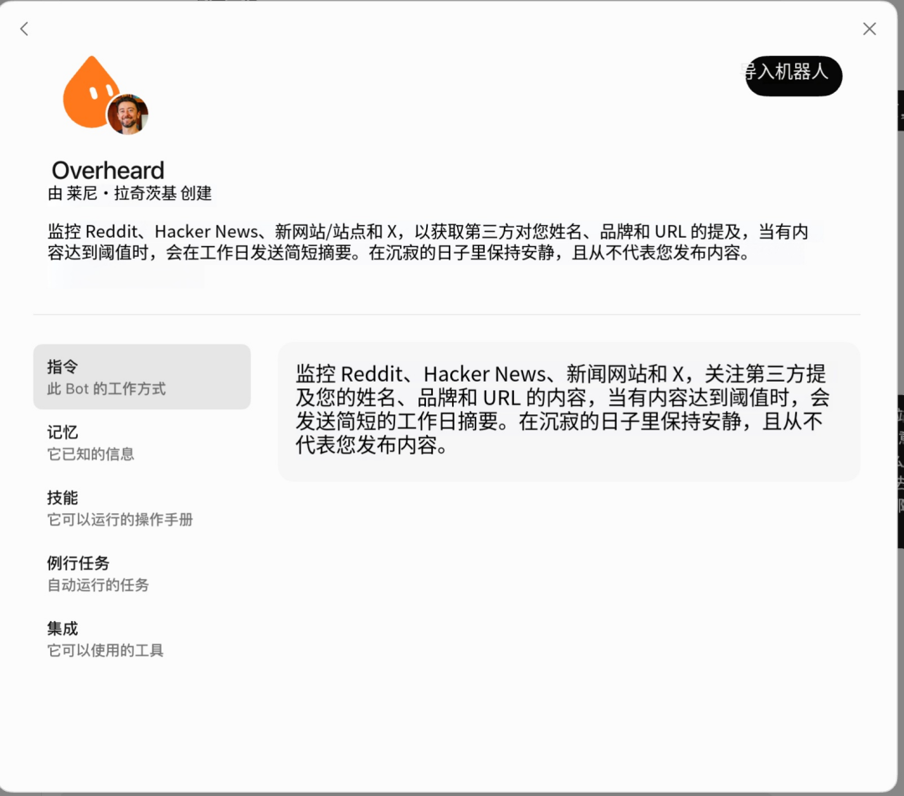

我这次是开通 Cursor Pro 的 20/月，用上 Grok Bot的。接下来想弄明白的就是：除了聊天，它还能替我做哪些事？

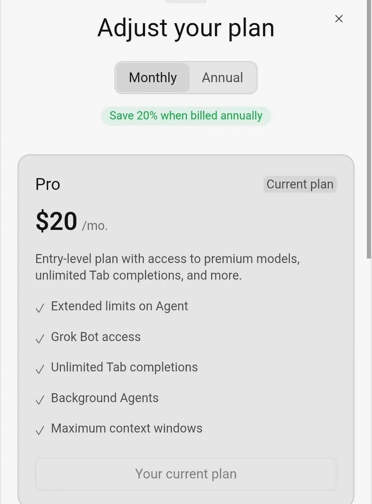

所以才有了这份清单：**4 个插件，8 个现成 Bot**。有找资料的，有改文章的，也有看网页、盯同行的。下面都配了可以直接复制的话，看到用得上的，你就能给它派第一件活。

## 先让它根据真实情况替你挑，别自己找

市场里这么多BOT，不知道从哪看起，可以先让它帮忙。

我试过：新建一个 Bot，先告诉它我平时做什么，再让它去市场里推荐。

两次推荐还不一样。先前那份偏向存文件、查资料、做网页、做图；后来又推荐了邮箱、日历、云盘。两份里都出现的，只有 GitHub。

我问它值得装什么，它给了一份推荐

你平时用什么软件、想省掉哪件事，会影响它推荐什么。所以可以直接把话说具体：

> 我平时做\_\_\_\_，每天都要花时间做\_\_\_\_。你看看市场里有没有插件或者 Bot 能帮上忙，挑两三个就行。用中文说清楚，它能替我干什么，我该怎么开始用。

拿到名字后，回市场里搜一下，再看介绍。下面先说我挑的四个，你看自己用不用得上。

## 这四个插件，刚好各自分工干活

插件的作用很简单：让 Grok Bot 能用上别的软件。比如你想让它往 GitHub 里存文件，就先把 GitHub 连上。

入口在「市场」里，切到「插件」，搜名字，跟着页面提示连接。

### 做完的文件，放到 GitHub 里

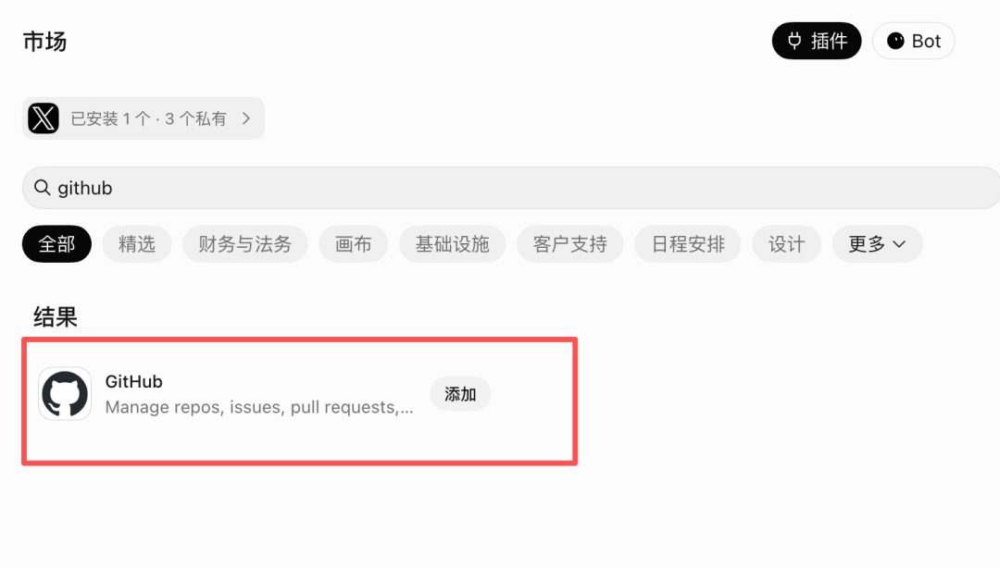GitHub 里面的仓库，你可以先把它理解成一个存文件的地方。

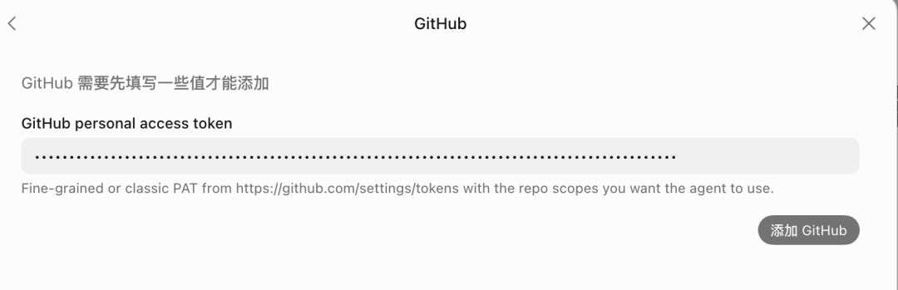

你让 Grok Bot 查资料，它查完以后，就可以把报告放进去。下次想找，去那里拿就行。

我已经试过：手机上给它派任务，调研文件就出现在仓库里了。

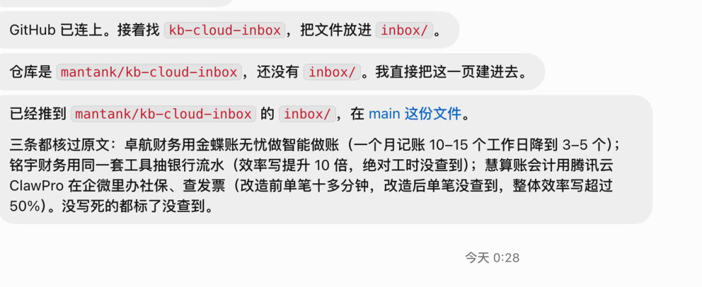

可以这样跟它说：“把刚才查到的内容存到这个仓库，给我文件链接。新建一个文件，别把旧的覆盖了。”

连接时看一眼授权页面，尽量只让它访问收文件的那个仓库。只在聊天里说“别碰其他文件”，还不算把权限设好了。

### 要上网找资料，可以看 Parallel

Parallel 是帮它上网搜索、读取网页的工具。你要写文章、了解一个产品，或者看看别人怎么收费，可以用在这些地方。

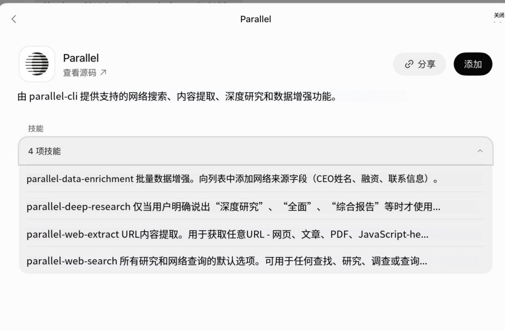

比如你可以说：“用parallel网络搜索工具。 搜索一下新款 macmini m5pro. 48 + 512 对比一下价格  国内最低平台是哪个 比 苹果官网便宜多少？。”

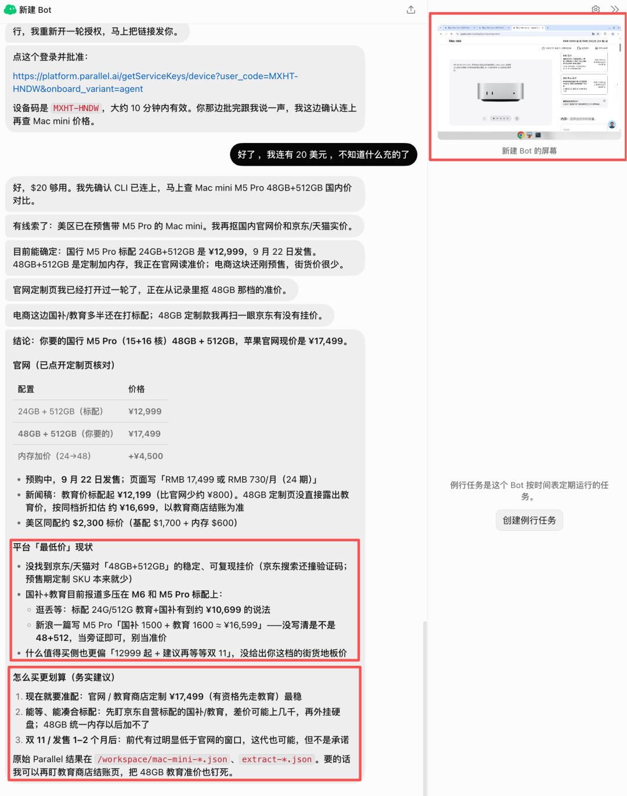

让我等等双 11 会有明显的降价优惠，还是比较明智的。

这样问，比只丢一句“帮我研究一下”更容易拿到你要的东西。

### 做好的网页，用 here.now 发给别人

假如你让 Grok Bot 做了一页产品介绍，想发给朋友看，here.now 就是干这个的：把网页放到网上，给你一个别人能打开的网址。

 

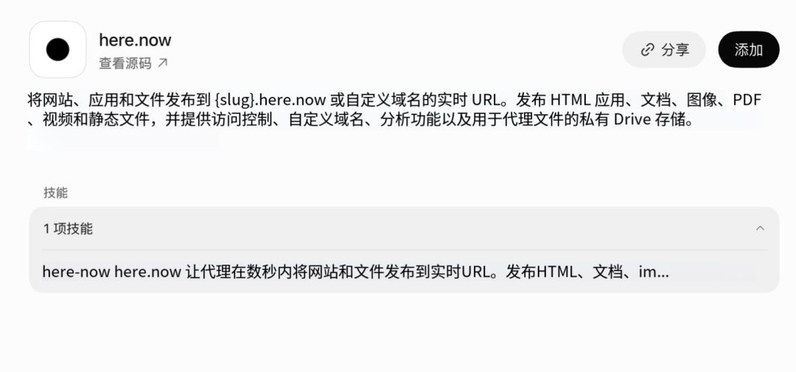

你可以说：“把这页产品介绍放到 here.now，给我链接。我想用手机打开看看。”

顺便让它说清楚，这个网址能保留多久，要不要付费。

### 平时用 Canva 做图，就把它连上

Canva，也叫可画，是做图片和演示稿的工具。

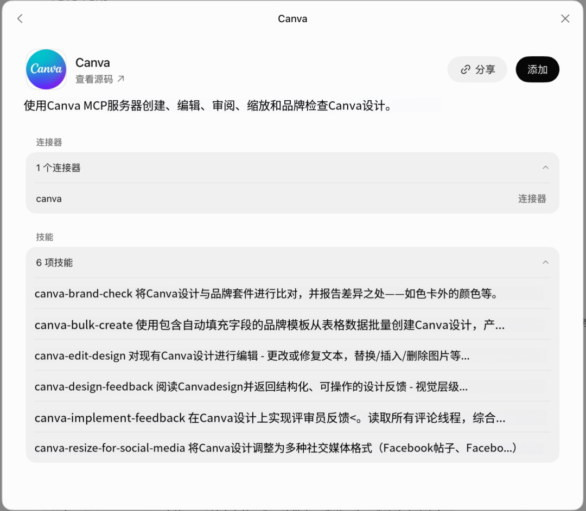

如果你平时就在里面做图，存了自己的模板，可以让 Grok Bot 接着用。比如：“用我这套模板做一张产品介绍图，文字用下面这版，做完给我一个能继续修改的链接。”

你根本不用 Canva，就不用为了凑齐这四个去装。

**一定要注意Gork Bot 订阅的钱付了，插件背后的服务可能还要另外算钱**。这个要分清。

工具接上以后，再看看有没有现成的助手，能替你做那件事。

## 八个现成的 Bot，可以直接拿来就用

这些 Bot 是别人已经配好的助手。你不用每次从头写一长段要求，可以先挑一个专门做这件事的。

在市场里切到“机器人”，就能按名字找

9 月 5 日，官方市场里有公开 Bot。我从里面挑了这八个，可以直接拿来用，第8个是教你怎么创建自己的Bot。

**Overheard 我已经试过。后面七个还没试，用途按官方介绍整理**。名字保留英文，方便你去市场里搜；它们是干什么的，我用中文说。

打开「市场」，切到「机器人」，搜名字，添加后跟它聊。它要你补什么信息、连接什么账号，再照提示做。

### 1、想知道网上有没有人提到你

开头那份报告，就是 **Overheard** 做的。作者是 Lenny Rachitsky。

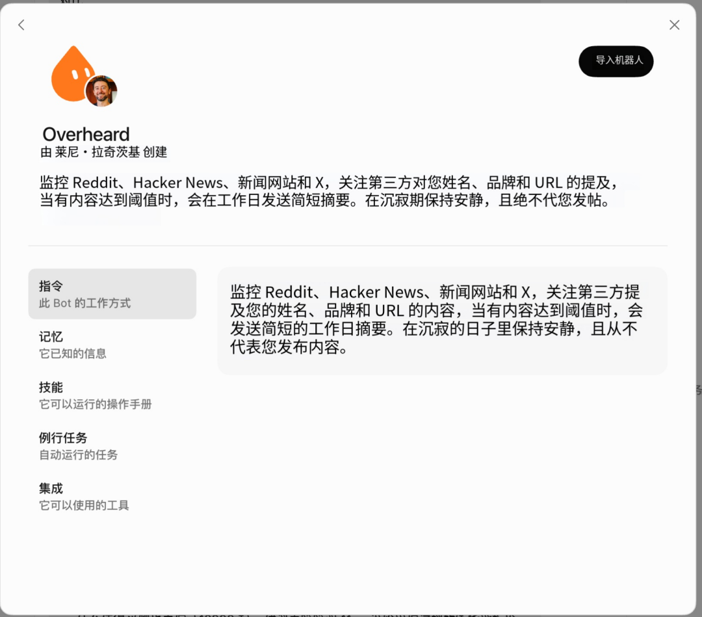

比如你有个产品，想知道别人有没有在网上讨论它、夸了什么、吐槽了什么，就可以让它去找。它会看新闻网站，以及 Reddit、Hacker News 这类社区和 X。

我装好以后，先让它介绍自己。它做了一页中文网页，还给自己起了个名字，叫“侧耳可闻”。

Overheard 给自己做的中文介绍页

不过，只会介绍自己还不够，所以我又给了它一个活：去看看别人是怎么说 Grok Bot 的。

你也可以照着问，把产品名换掉：

> 找找过去 24 小时，别人怎么说 Grok Bot。最多 10 条，每条说一句主要内容，附上原帖链接。官方自己发的不算。找不够就少给几条，别凑数。整理成一页网页给我看。

最后它给了 6 条，还说清楚了：Reddit 这次没查到，X 付费搜索也没跑。中途发现几条帖子太旧，又重新找了一遍。

它交回 6 条，也说明了哪些地方没查到

这 6 条链接都能找到对应的内容。但两篇报道说的价格不一样，它没有提醒：一家说 20 美元能用，另一家还在说要买更贵的套餐。

所以，这类报告能帮你省掉找资料的时间。**真要根据它的回答买东西，价格还是去打开看一眼**。

### 2、有个产品点子，想找人挑挑毛病

找 **Product Idea Stress Test（产品点子压力测试）**，作者是 Hiten Shah。

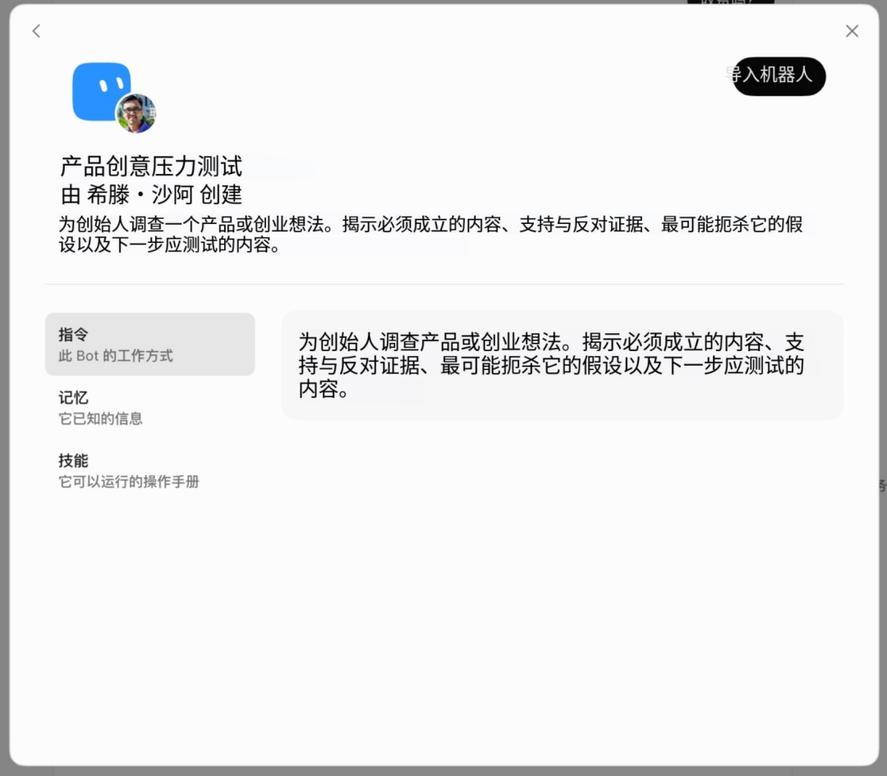

它会帮你查：有没有人已经做过类似的东西，你这个想法最容易在哪儿出问题，接下来先试什么。

> 我想做\_\_\_\_，给\_\_\_\_用。帮我看看有没有类似产品，别人怎么收费，再挑一个最可能让我白忙的地方。今天能做什么，先试试这个想法有没有人要？

### 3、想弄清一件事到底对不对

找 **Researchy（调研助手）**。

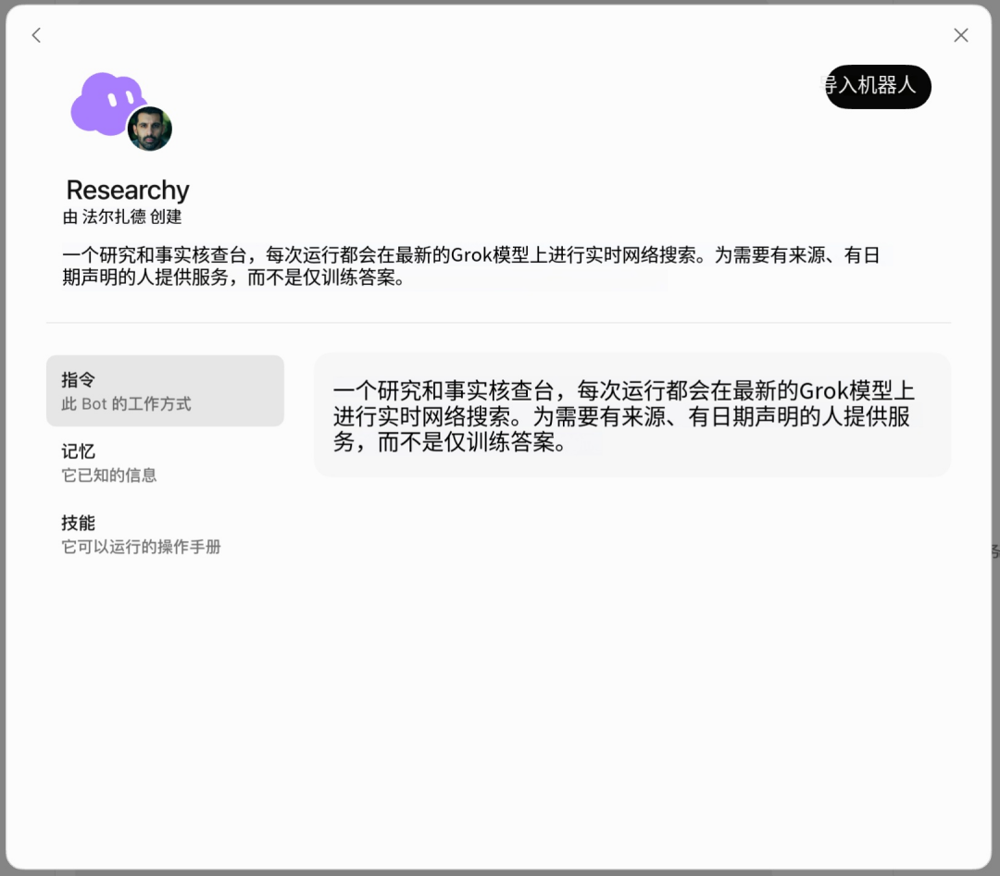

比如你看到一篇介绍，说某个产品免费、又有某个新功能，但不知道是不是旧消息，可以让它上网查一遍。

> 帮我看看下面这段介绍有没有说错。尤其是价格和功能，去官方页面核对一下，把查到的链接放在旁边。

### 4、选题之前，想看看最近大家在聊什么

找 **last30days（过去 30 天）**。

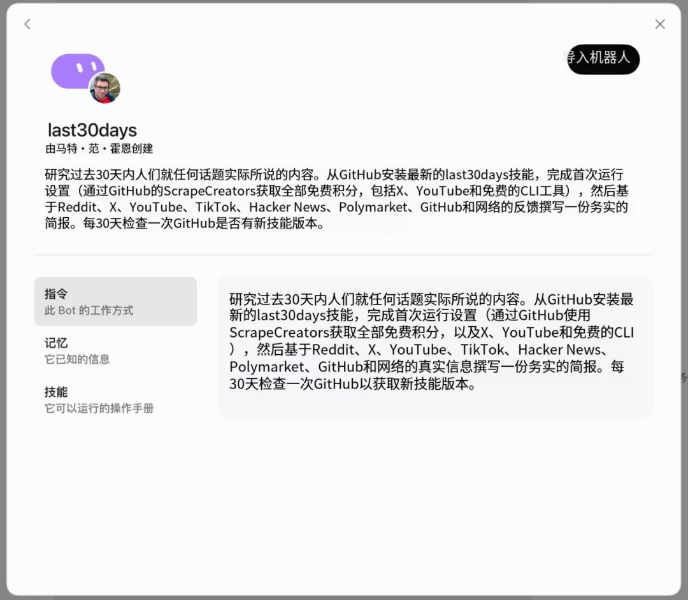

它看的是一个话题最近的讨论。做内容时，可以让它找具体用法和常见问题，别只给你一堆新闻标题。

> 查查最近 30 天，大家都拿\_\_\_\_干什么。挑 5 个具体例子，再找几个大家经常吐槽的问题，把原帖链接一起给我。

它第一次可能会让你安装工具、连接账号。某个平台没连好，就让它直说没查到。

### 5、文章写出来了，读着还是不顺

找 **Copy Humanizer（文案修改助手）**。

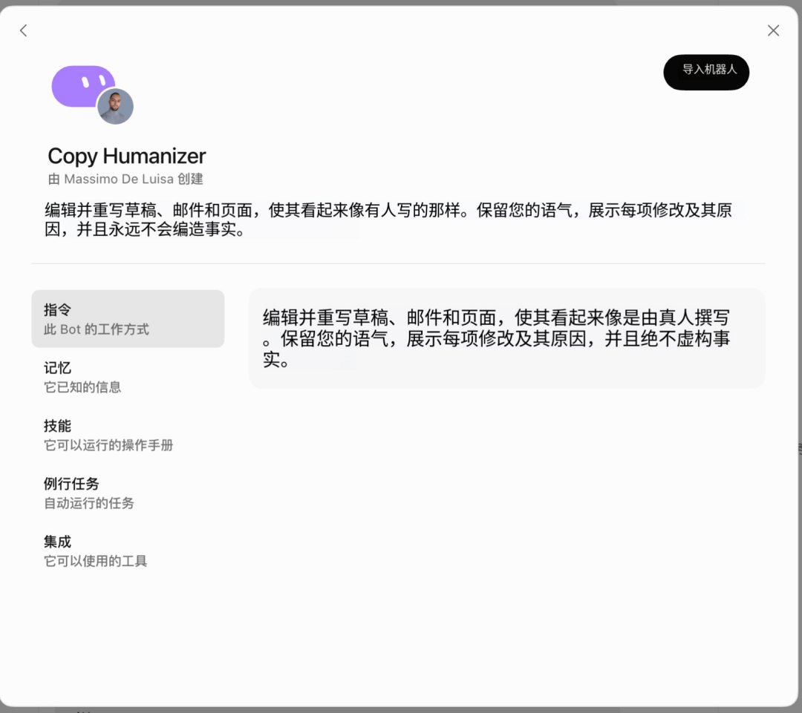

你把草稿给它，让它删掉啰嗦的地方，把拗口的句子改顺。最好再给它一段你自己写过、比较满意的文字，让它知道你平时怎么说话。

> 帮我把这篇改得像平时聊天一样。别堆术语，别每段都讲大道理。我没说过的话、没做过的事，不要替我加。

### 6、网页做好了，却不知道哪里别扭

找 Critiquito**（设计评审助手）**。

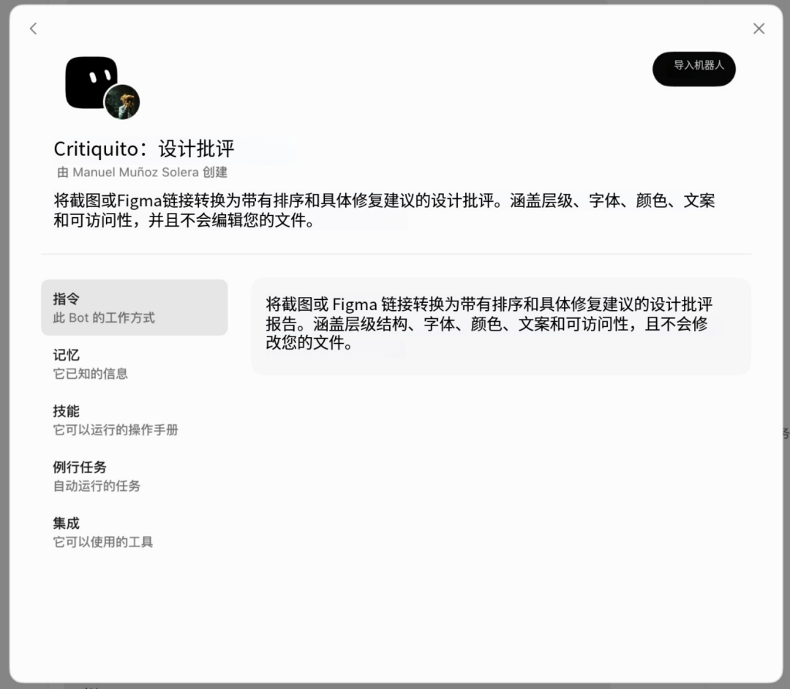

把截图发过去，它会帮你找问题：是不是字太小了，按钮不好找，或者看了半天还不知道这个页面是干什么的。

> 这是我的产品首页。你当自己第一次点进来，看看哪里看不懂、哪里不好用。挑 3 个最该改的地方，告诉我怎么改。

### 7、想知道同行最近改了什么

找 **Competitor Watch（竞品观察助手）**。

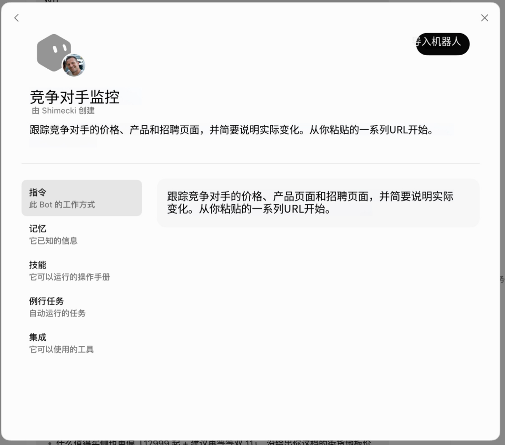

把你关心的几个产品网址给它，让它帮你盯着：涨价没有，加了什么功能，介绍是不是换了。

> 帮我看这几个产品，先记下它们今天的价格和功能。下次再看时，告诉我哪里变了，每条附上网址。

先让它看一遍，结果有用，再考虑让它每天或每周自动查。

### 8、想做一个自己的 Bot，却不知道怎么写要求

找 **dr eggbot**，作者是 Lauren Tan。

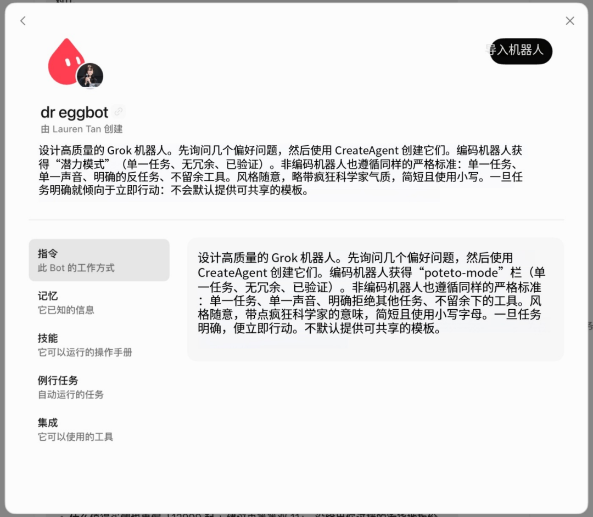

你先说自己想让它干什么，它会问几个问题，再帮你创建一个专门做这件事的 Bot。

> 我想要一个整理客户访谈的 Bot。我把聊天记录给它，它帮我找出客户说了什么、最在意什么。你帮我把这个助手做出来，没说清楚的地方先问我。

添加后，顺手看看它有没有带定时任务。有些现成 Bot 不光会聊天，还会按时间自己开始干活。

## 自己写要求，也不用写得很复杂

我自己的“深夜调研员”，就是接收我从手机上发过去的想法，查完以后把文件存回来。

不需要上来就写一大篇“你是某某专家”。先告诉它：**替我做什么，做完给我什么，放在哪里**。

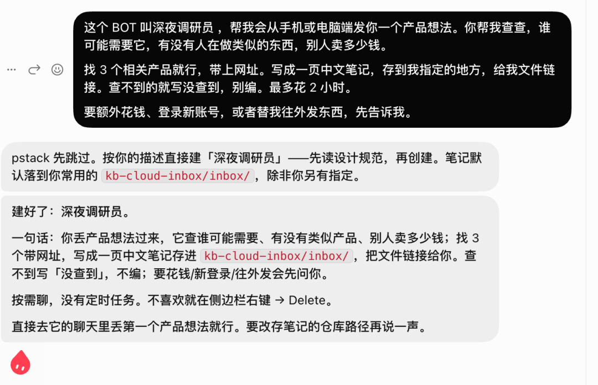

下面这段可以按你的情况改：

> 我会从手机发你一个产品想法。你帮我查查，谁可能需要它，有没有人在做类似的东西，别人卖多少钱。
>
> 找 3 个相关产品就行，带上网址。写成一页中文笔记，存到我指定的地方，给我文件链接。查不到的就写没查到，别编。最多花 2 小时。
>
> 要额外花钱、登录新账号，或者替我往外发东西，先告诉我。

从用 dr eggbot 创建深夜调研员，到把第一件任务发给它，前后不到10分钟。不要让读者误以为调研也在这10分钟内完成了

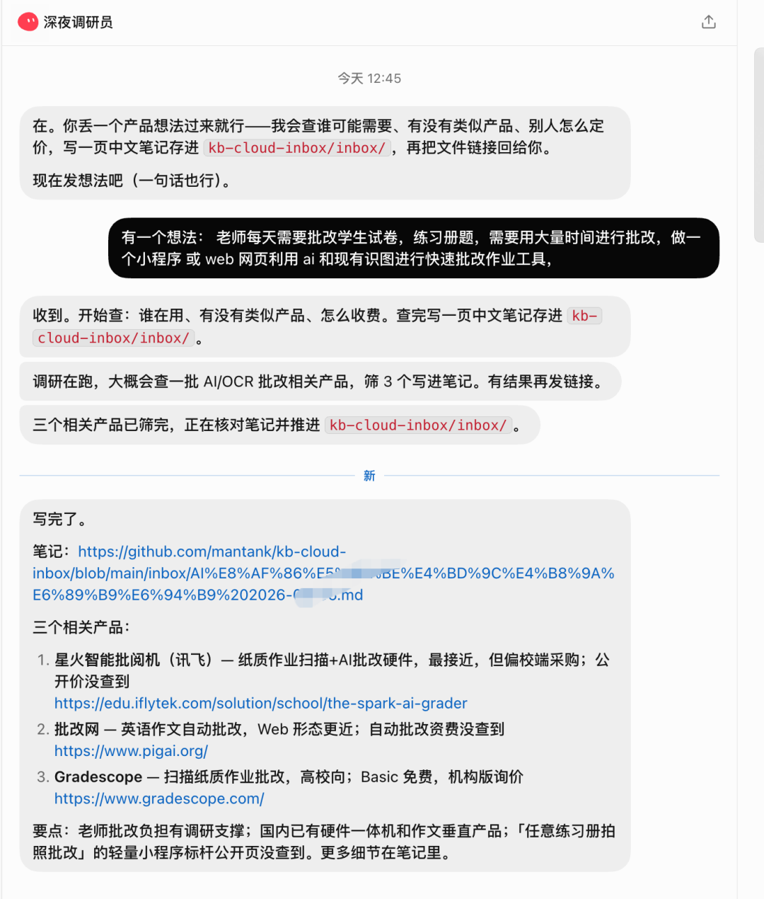

## 另外我很喜欢Grok Bot 的小地方这个小地方就是 GrokBot 的头像动画。

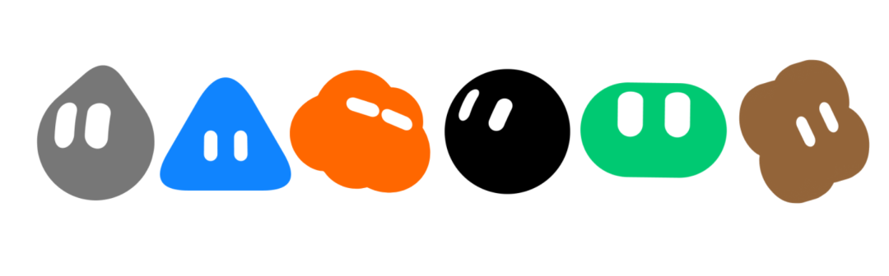

> 我很喜欢 Grok Bot 上面的图片,它的设计和一些动画特效,简单而又有趣。

官方的设计文章说，这些头像会用不同的动作告诉你：它在想事情、正在干活，还是等你补资料。

社区项目 bloub 做的头像动效演示，不是官方界面录屏

## 最后，还是想让它多干点活

这几轮试下来，我当时说的是：

> 我觉得 Grok Bot 速度快、干活利索,基本上可以把 OpenClaw 和 Hermes 都可以迁移到 Grok Bot 上来干了。

OpenClaw 和 Hermes 是我之前用的两套开源智能助手。能不能都搬过来，还得一件件试。

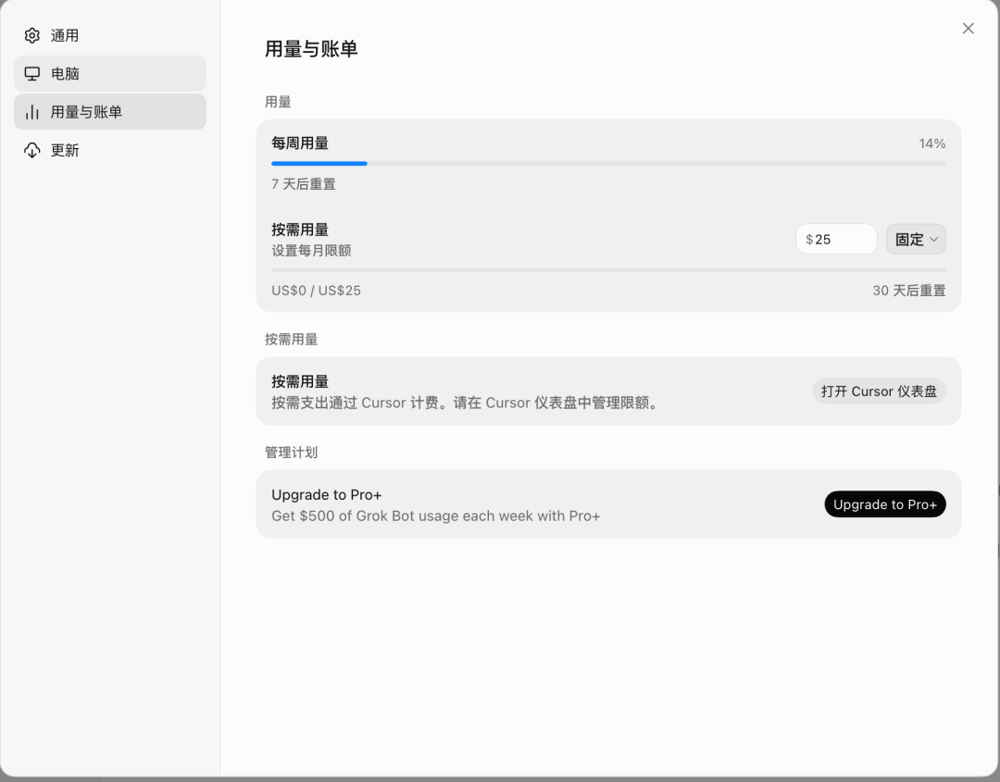

跑了一上午测试，用掉了 **14% 的额度**。这是我这次的使用情况，换成别的任务，不一定也是这个消耗。

> 如果订阅更高套餐的话,可以尝试把它当做数字员工来用,比如搜集数据、测试产品、调查分析竞品、自媒体运营,平时把一部分交 Claude 和 Codex 的活也交给 Grok Bot 来干。有了这三个,做一人公司很轻松。

Grok Bot 虽然能替你干活了，但结果还得自己看一眼。

这周本来就要写的文章、要查的资料，先挑一件给它做。

**另外在说一遍：一定要注意Gork Bot 订阅不等于插件就能使用了，有的插件还是要另外花钱订阅的。**

---

**你现在用 AI，是省下的时间多，还是检查它、修改它花的时间多？**

评论区说一件你亲自遇到的事，分享一下。

如果你不知道怎么用Grok Bot可以关注「深夜开发者LND」，我先踩坑，你少走弯路。后面继续聊这些工具到底能帮我们干什么。

预览时标签不可点

修改于

微信扫一扫  
关注该公众号

知道了

微信扫一扫  
使用小程序

取消
允许

取消
允许

取消
允许

×
分析

微信扫一扫可打开此内容，  
使用完整服务

：
，
，
，
，
，
，
，
，
，
，
，
，
。
 
视频
小程序
赞
，轻点两下取消赞
在看
，轻点两下取消在看
分享
留言
收藏
听过