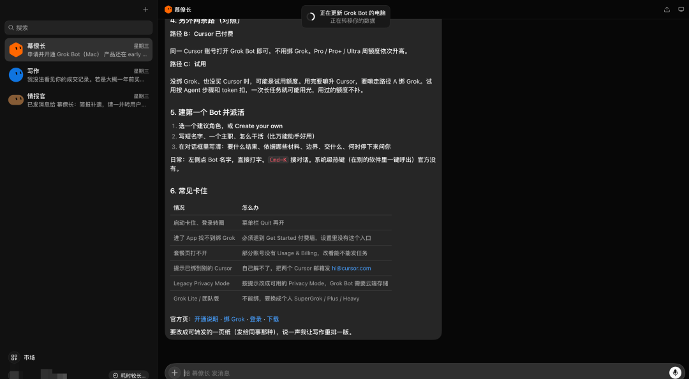

# grok bot 使用体验

Source: https://mp.weixin.qq.com/s/sx6k2FO9NTJw6L04z1TSHg

凌晨两点的书桌

在小说阅读器读本章

去阅读

在公众号小说中沉浸阅读

9 月 1 日，有人发现 Google Play 上悄悄多了一个新 App：**Grok Bot**。

没有发布会，没有官宣推文，APKMirror 在 9 月 2 日同步收录了 v1.5.0（48.63 MB），开发商显示 **SpaceXAI**。至此，这个 8 月 11 日才以 Early beta 发布的"数字同事"，把 macOS、Windows、Linux、iOS、Android 全平台凑齐了。

这是马斯克把 xAI 和 Cursor 先后收进 SpaceX 之后（后者作价 600 亿美元）憋出来的东西。今天这篇讲清楚三件事：**它到底是什么、去哪下、怎么派第一个活。**

## 一、先分清：它不是聊天机器人，也不是 Claude Code

一句话定位：**每个 Bot 在云端有一台自己的电脑，能登录你的工具，像人一样操作，7×24 小时干活，你合上笔记本它也不停。**

三个和现有东西的本质区别：

•

**和聊天机器人比**：不是你问一句它答一句，是把一个项目整段交出去，它只在"需要你批准"的时候回来找你

•

**和 Claude Code 这类编程 Agent 比**：它不写代码给你看，它去登录你的 Zendesk 处理客服队列、去 CRM 里写跟进邮件——**官方明说包括"没有干净 API 或 MCP 的平台"**，就是当人用浏览器那样用

•

**和 RPA 比**：不用提前编排流程，你可以让它围观你做一遍（Teach a Task），它记成例行任务，以后定时自动跑

预设岗位已经有六个：销售外联、人才搜寻、付费媒体、费用管理、Bug 复现、幕僚长。多个 Bot 还能拉一个群自己分工，只在需要判断时拉你进群。

## 二、去哪下、多少钱

**下载入口：**

| 平台 | 入口 | 状态 |
| --- | --- | --- |
| 官方主入口 | **x.ai/bot** | macOS（Apple silicon）直装 + iOS |
| 安卓 | Google Play 搜 **Grok Bot**（认准开发商 SpaceXAI，别下成主 Grok app） | 9 月 1-2 日上架 |
| Windows / Linux 桌面 | 官网 More downloads | 8 月 21 日起提供 |

**价格门槛（这是关键）：**

Grok Bot **不单卖**，包含在订阅里：

•

**Cursor Pro / Pro+ / Ultra：$20/月起** ——含 Bot 专用电脑、工具登录、定时例程

•

**SuperGrok Plus / Heavy：$30/月** ——含 Grok Bot 访问权 + Grok 4.6 模型

•

**Cursor Teams：$40/席位/月**

两个细节值得注意：**Bot 有独立的用量额度，不占你 Grok/Cursor 原有计划的量**；企业版目前要排 waitlist。第三方介绍称最多可开 50 个 Bot（官方未标注上限，待核实）。

翻译一下：如果你本来就是 Cursor 或 SuperGrok 订阅户，**这东西是白送的，直接下就是了。**

## 三、派第一个活：五步走

**第 1 步：安装并登录订阅账号。** macOS 从 x.ai/bot 直装，安卓从 Play 商店装。【待补：安装完成首屏截图】

**第 2 步：创建第一个 Bot，选预设角色。** 建议第一次别选"幕僚长"这种模糊角色，从**费用管理**或 **Bug 复现**这种边界清晰的任务开始——成功率高，容易建立信任。【待补：角色选择界面截图】

**第 3 步：给它工具登录权限。** 登录一次，Bot 之后就像你本人一样用这个工具。这一步是整个产品的灵魂，也是整个风险的源头（下一节展开）。【待补：工具授权界面截图】

**第 4 步：Teach a Task 示范教学。** 你亲自把工作流做一遍，Bot 在旁边看，存成 Routine，设定时间自动执行。比如每周五让它把本周发票整理进表格、起草付款申请。【待补：录制过程截图】

**第 5 步：等它回来找你审批。** 平时不用管，它遇到需要拍板的事会来问你。手机和桌面是同一个会话线程，出门在外用手机批。

## 四、三盆冷水，必须泼

**1. 它还是 Early beta。** 官方 FAQ 一半问题没答案，企业版在排队。别把它接进核心生产流程。

**2. 隐私账要自己算。** Bot 替你登录工具，意味着凭据和数据都要进它的云端电脑；更微妙的是，**Cursor 的 Legacy Privacy Mode（本地隐私模式）和 Grok Bot 直接互斥，开了就用不了**。而整个发布公告里，没有一个专门的安全/隐私章节。我的建议：第一批只授给它**出了事也无所谓**的账号（专门的报销邮箱、测试环境），主力账号再等等。

**3. 预期管理：中文实测说它"更像 RPA 重做版"。** 教过的流程能稳定重复，没教过的不一定能自己搞定。把它当"记性特别好、不用睡觉的实习生"，比当"能力出众的同事"更接近真相。

## 五、谁该现在就用

•

**Cursor / SuperGrok 订阅户**：白送的，今天就装，吃第一个螃蟹的成本是零

•

**有大量重复流程的个体户/小团队**：费用、外联、Bug 复现这三类先试

•

**其他人**：不急。这个品类三个月一个样，等它出正式版再看一眼不迟

下一篇我会写《数字员工三家怎么选：Grok Bot vs Claude Cowork vs ChatGPT》——毕竟 Anthropic 家的 Cowork 今年 4 月就已经正式商用了，这场仗才刚开始。

**如果你已经在用了，评论区说说你派给它的第一个活是什么，干得怎么样？**

---

**参考资料**

1.

Introducing Grok Bot — SpaceXAI 官方发布公告

2.

Grok Bot 官方产品页（下载/定价/角色）

3.

APKMirror：Grok Bot v1.5.0（9 月 2 日收录）

4.

9to5Mac：Grok Bot iPhone/Mac 应用发布，Android 标 coming soon

5.

Threads：xAI 悄然在 Google Play 上架 Grok Bot

6.

CNBC：SpaceX 600 亿美元收购 Cursor

7.

财联社："数字同事"Grok Bot 上线

8.

腾讯云开发者社区：Grok Bot 实测几天，更像 RPA 重做版

9.

老爸聊 AI：Grok Bot 介绍（50 个数字员工说法出处）

预览时标签不可点

微信扫一扫  
关注该公众号

知道了

微信扫一扫  
使用小程序

取消
允许

取消
允许

取消
允许

×
分析

微信扫一扫可打开此内容，  
使用完整服务

：
，
，
，
，
，
，
，
，
，
，
，
，
。
 
视频
小程序
赞
，轻点两下取消赞
在看
，轻点两下取消在看
分享
留言
收藏
听过