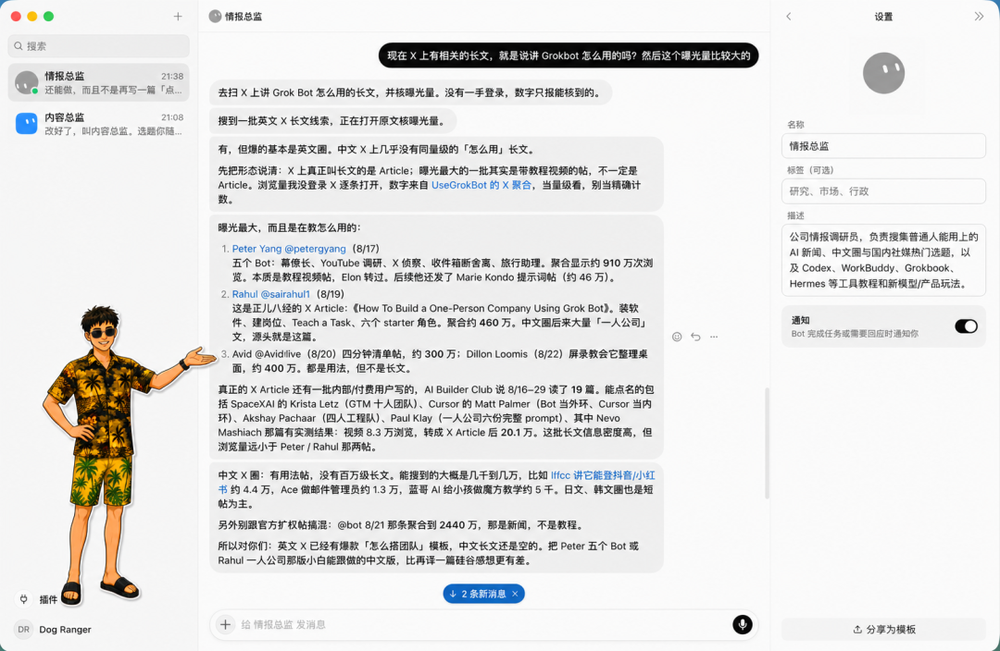
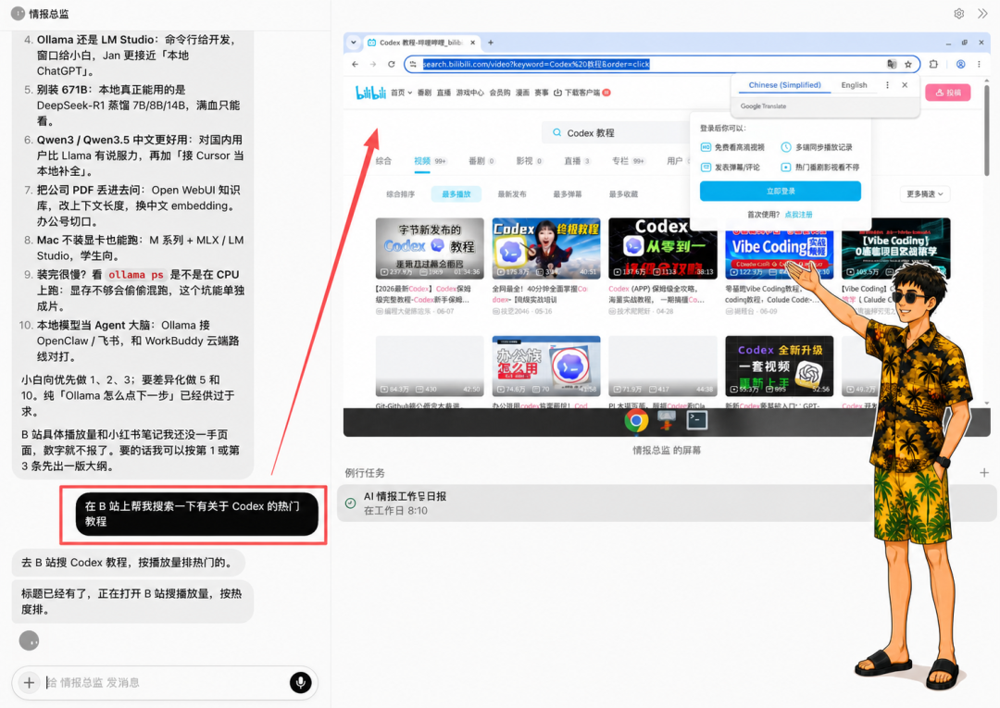
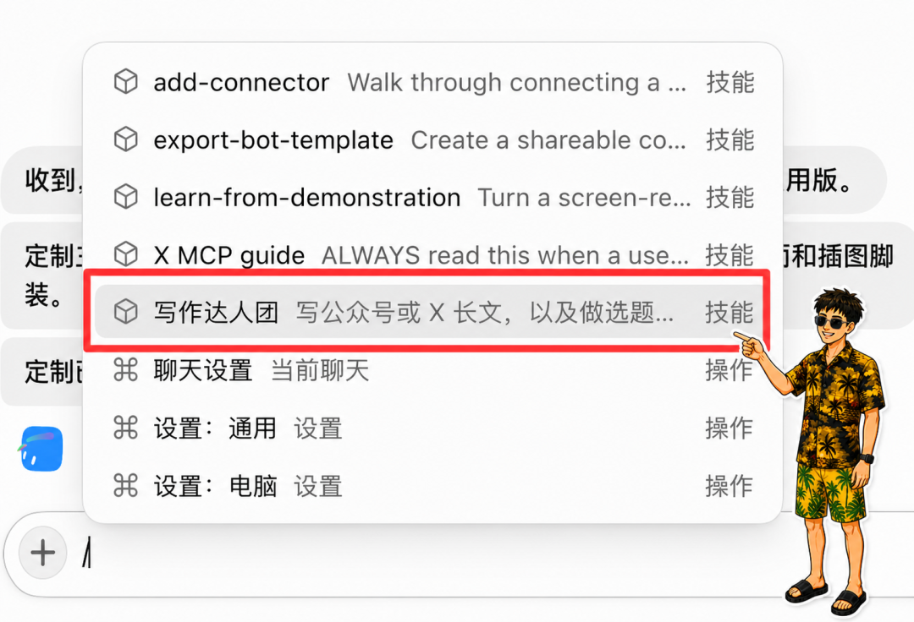
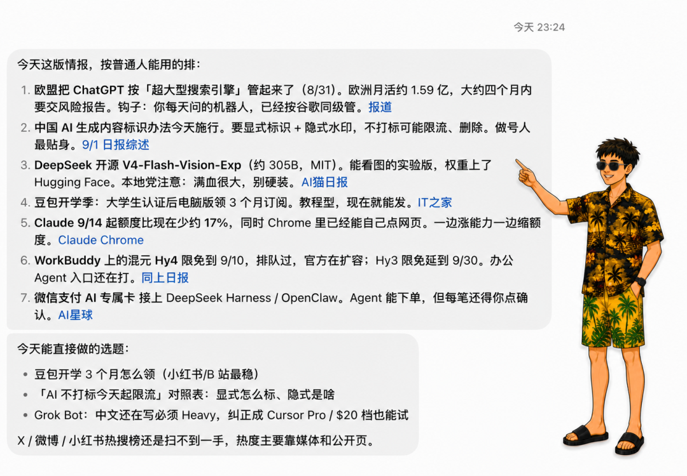
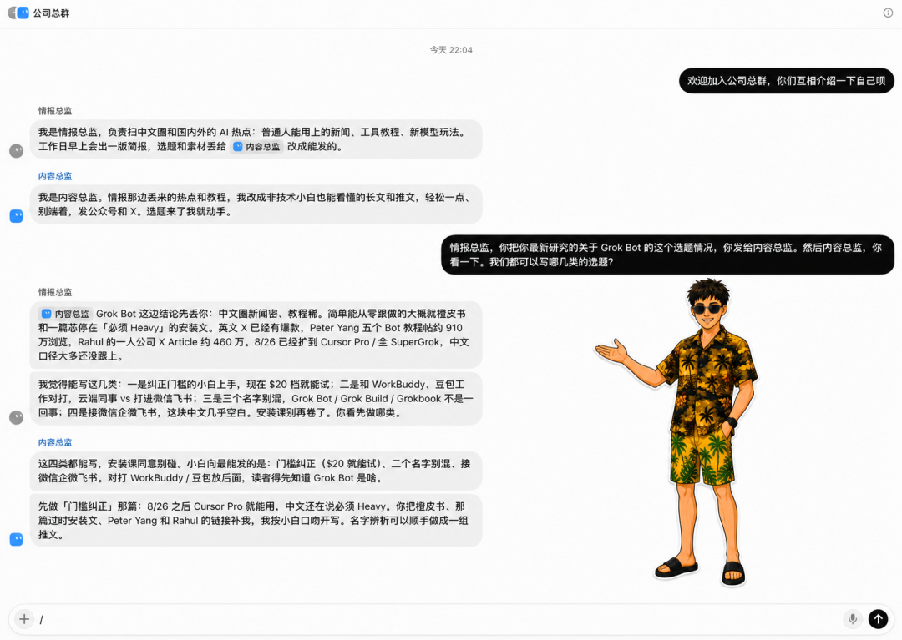

# 万字长文｜Grok Bot 从入门到精通

Source: https://mp.weixin.qq.com/s/EYkTNDtWBKlPQoV4taelnA

原创

金尘马
金尘马

金尘马


在小说阅读器读本章

去阅读


在公众号小说中沉浸阅读

朋友们大家好啊，我是金尘马。

过去一年，我们使用 AI 的方式正在发生非常明显的变化。

以前打开一个聊天窗口，问一个问题，拿到一个答案，这次协作基本就结束了。现在的 Agent 已经可以读取文件、调用工具、操作浏览器，直接进入数字世界替我们干活。

**在我看来，我们已经从对话时代走到了 Agent 时代。**

不过，今天大部分人与 AI 的协作入口仍然是一轮轮聊天。需要干活的时候临时把 AI 叫过来，重新交代背景，再派一个任务。任务结束以后，这个临时小组也就散了。整个产品仍然以一段具体对话为中心。

xAI 在 2026 年 8 月 11 日推出了 Grok Bot，**这个产品就是开始围绕「长期工作」来组织的。**

它把每个 Agent 包装成一名有名字、长期在岗的 AI 同事。你可以给它一个职位，让它长期负责一类结果。工作做得越多，它越熟悉你的要求，也能调用云电脑和外部工具。需要多人协作时，Bot 之间还可以直接交接任务。

**本文把每个 Bot 称为一名数字员工。创建一个 Bot，就当作招聘了一名数字员工。**

好了，废话不多说。下面就从创建第一名数字员工开始，一步步把整套流程跑完。最后再用一家电商公司为例，演示怎样搭建一支数字员工团队。

## 创建第一名数字员工

使用 Grok Bot 需要满足三个条件：

* 账号具备 Grok Bot 使用资格。
* 桌面客户端支持 macOS 和 Windows，移动端目前支持 iPhone。
* 开启云端存储。

安装并登录以后，在左侧点击 `New`，选择 `Create new agent`。新 Bot 创建完成后，打开它的菜单，进入 `Edit Profile`，填写名称、职位和岗位说明。

我创建的第一名数字员工叫「情报总监」。

它的岗位说明是这样的：

> 公司情报调研员，负责搜集普通人能用上的 AI 新闻、中文圈与国内社交媒体上的热门选题，以及 Codex、WorkBuddy、Grokbook、Hermes 等工具教程和新模型、新产品玩法。

岗位说明用来保存长期有效的内容，比如它负责什么、常用哪些来源、怎样判断和交付什么。

某一次任务的临时要求，直接放进当次消息里。今天研究 Grok Bot，明天研究 Codex，这些都属于临时任务，不需要反复修改岗位说明。

创建完成后，我给情报总监派出的第一项真实任务，大意是：

> 搜集 X 上讲 Grok Bot 怎么用、曝光量较高的长文。区分 X Article 和教程视频帖，列出作者、发布时间、公开可见的曝光数据、主要内容和原文链接。无法取得一手数据时直接说明，不要猜测数字。

一项任务写清五件事：

**1. 最终要完成什么结果。****2. 去哪些地方找资料。****3. 有哪些限制条件。****4. 最后用什么格式交付。****5. 做到哪一步要回来找人确认。**

只发一句「帮我研究一下 Grok Bot」，结果很容易变成一份泛泛的资料汇总。

情报总监第一次交回的结果里，主动区分了 X Article 和带教程视频的帖子，也分别整理了作者、曝光数据和原文链接。



第一次交付后，直接告诉它哪一部分错了、缺了什么、以后固定使用什么格式。

## Grok Bot 和其他 AI Agent 的区别

现在市面上常见的 AI Agent，大多围绕一段对话或一个具体项目组织工作。聊天类工具以当前对话为中心。

**Grok Bot 默认从一个长期岗位出发，围绕跨软件任务、长期工作背景、固定工作和同事交接组织起来。**

Bot 可以保留稳定偏好、岗位背景和既往工作的摘要。

Grok Bot 和 Codex、Claude Code 也有明显差别。

Codex 与 Claude Code 默认从项目或代码库出发，主要围绕文件、终端、构建、测试和 Git 组织工作。Grok Bot 默认从一个岗位出发，围绕跨软件任务、长期工作背景、固定工作和同事交接组织起来。

这些产品的能力已经有不少重叠。它们都能读写文件、运行命令、接入工具，也都在向云端任务和多 Agent 协作发展。选择时可以先看自己的主要工作对象。

长期负责跨软件工作的数字员工，用 Grok Bot 会更加直观。围绕代码仓库开发、测试和审查，Codex 与 Claude Code 的工作重心更明确。

Grok Bot 还给用户提供了一台云电脑。

这是一台由平台管理的 Linux 虚拟机，里面有可视化桌面、浏览器、文件系统和终端。

任务需要浏览器时，远程浏览器小窗口会自动出现在对话旁边，可以随时查看和接管。

遇到登录、验证码或需要人工操作时，再进入云电脑画面接管控制。



**任务运行在云端还有一个现实好处。关闭 Grok Bot、合上笔记本，已经开始的后台任务和定时任务仍然可以继续。**

## 认识五个核心组件

```
●●●  
Bot：谁长期负责这份工作  
Skill：这份工作具体怎么做  
定时任务：什么时候自动开始做  
群聊：多名数字员工怎样公开交接  
连接器：这份工作要进入哪些真实软件和数据源
```


岗位说明里放长期都要遵守的职责。一次聊天任务只管今天具体做什么。等一类任务已经跑通，再把稳定做法保存成 Skill。

## 从真实工作中提炼一个岗位

我刚开始研究 Grok Bot 的时候，也想直接创建营销总监、运营总监、产品总监和财务总监，把传统公司的组织架构照搬进去。

一到派活，问题就出来了。岗位名字很大，长期负责的结果很模糊，最后得到一批不知道每天该干什么的数字高管。

xAI 官方给出的建议，是从一套最小但真正有用的人员配置开始。**先让一个 Bot 完整负责一项结果。工作里出现稳定的专业分工后，再创建新的 Bot。**

适合长期交给 Bot 的工作有几个特征：

* 结果会长期出现，或者需要反复交付。
* 使用的数据源和工具相对稳定。
* 工作方法可以逐渐说清楚。
* 交付结果能够检查。
* 哪些动作需要人工审批，可以提前划出边界。

以情报总监为例，我长期需要研究 AI 新闻、热门选题和工具教程。它有相对固定的来源，也有明确的交付物。这个真实需求自然形成了一个岗位。

「营销总监」这类名字覆盖范围太大。把它改成「每周筛选 10 个值得继续研究的 AI 选题，并附上来源、数据和判断理由」，工作就具体多了。

岗位说明可以按照下面这个结构来写：

```
●●●  
负责结果：  
长期数据源：  
工作步骤与判断：  
固定交付物：  
验收标准：  
禁止动作：  
人工审批点：  
失败时如何处理：
```

先写出最低可用的岗位说明，完成一项真实任务，再根据结果补充规则。

## 配置云电脑、连接器和本地文件

### 使用云电脑

只要任务需要访问网页，Bot 会自行调用云端浏览器。远程浏览器小窗口出现以后，可以随时查看它目前正在做什么。

如果要让两个 Bot 交接文件，可以要求它们把中间结果保存在 `/workspace` 下面的专用目录。这个目录位于共享云电脑中，其他 Bot 也可以读取。

每个项目使用单独文件夹和明确的文件名，重要结果同时回传到对话中。

### 安装连接器

有连接器时，优先使用连接器。它通常比让 Bot 反复模拟点击网页更加稳定。

官方文档给出的路径是进入 `Settings → Plugins`，找到需要的连接器后点击 `Add`，再按照提示在浏览器完成授权。安装完成后，可以在聊天框里输入 `@` 引用它。

官方已经发布 X 连接器，可以搜索帖子、读取时间线和查看提及。

连接器覆盖不到的网站，可以继续使用浏览器操作。网站可能要求重新登录，或者弹出人机验证，这时由用户接管。

密码、Passkey、双重验证码和付款确认等，都需要用户输入或确认。敏感信息不要复制到普通聊天里。

### 读取本地文件

**云电脑和我们面前的 Mac 或 Windows 是两套环境。**

三种文件使用方式可以这样区分：

* 一次性资料直接发进聊天。
* 多个 Bot 之间交接的文件放进 `/workspace`。
* 需要直接处理本地目录时，再开启本地电脑授权。

Grok Bot 可以读取本地文件，但需要单独授权。设置入口位于 `Settings → General → Agent → Execution on Local Computer`。

开启以后，Bot 可以在本地运行命令、读取文件，也可以在云端与本地之间移动文件。本地动作会显示具体命令并请求同意。

## 把工作方法保存成 Skill

**一项任务稳定跑通以后，可以保存成 Skill。**

保存前，先检查来源、判断和交付格式，再换一种输入重新测试。

以情报总监为例，可以先连续完成两次不同主题的情报搜集。确认它已经掌握热门内容的判断标准和数据核对方法，再发送下面这类指令：

> 把刚才已经跑通的情报搜集与核验方法保存成一个 Skill，名称叫「AI 教程情报搜集」。写清使用时机、需要的输入与权限、完整步骤、来源核验规则、交付格式、验收标准、失败处理和人工审批点。

保存后，检查 Skill 里有没有这些内容：

**1. 什么时候应该调用。****2. 需要哪些输入和权限。****3. 工作按照什么顺序完成。****4. 怎样判断结果合格。****5. 遇到缺失数据和失败怎样处理。****6. 哪些动作必须等待批准。**

然后在聊天框输入 `/` 调用这个 Skill，换一个 AI 工具或时间范围重新测试。



如果 Skill 没有出现在当前 Bot 的菜单里，可以到 `Settings → Plugins → Yours` 检查是否已经为它启用。

`Teach a task` 可以通过最长十分钟的浏览器操作演示生成 Skill。

## 设置定时任务

**Skill 解决的是告诉 AI 一项工作应该怎样做，定时任务负责安排 AI 循环、定点地执行这项工作。**

一项工作准备进入定时运行之前，先确认负责人、时区、输入来源和预期结果。

比如，可以直接告诉它：

> 每个工作日早上 8:10，使用「AI 教程情报搜集」Skill，整理过去 24 小时值得关注的 AI 新闻，并把结果发给我。

第一次测试安排在 5 到 10 分钟以后。创建后核对下一次运行时间，再从对话详情进入定时任务页面，执行一次 `Test run`。

测试完成后，可以关闭客户端等待云端执行。重新打开时，检查运行时间、执行状态和实际交付内容。



定时运行最容易出现两类问题：用了旧数据，或者只完成了一部分，却仍然显示任务已经结束。

无人值守任务至少要补上这些质量规则：

**1. 每次结果写明实际来源、数据时间和读取范围。****2. 没有当期数据或数据过期时直接报错。****3. 只完成一部分时，分别写明已完成、未完成和失败原因。****4. 重试不能重复发送、重复写入或生成冲突文件。****5. 发布、删除、付款和生产环境变更继续等待人工审批。****6. 网站、连接器或数据格式变化后，重新执行测试。****7. 人定期抽查来源和结果，不把连续成功当成永久可靠。**

## 创建第二名数字员工并完成交接

**第二名数字员工应该在专业分工已经出现以后再创建。**

继续用情报工作举例。情报总监长期负责搜集和核验材料。随着任务增多，另一个稳定职责会逐渐出现：根据目标读者、内容价值和作者方向，判断哪些选题值得继续写。

这时可以创建「内容总监」。

情报总监负责找材料，内容总监负责做取舍。两名数字员工使用不同的判断标准，也交付不同的结果，独立岗位就有了实际意义。

先验证最简单的文件交接：

```
●●●  
情报总监把情报初稿保存到 /workspace/grokbot-demo/  
→ 内容总监读取文件并给出选题取舍  
→ 情报总监根据反馈补充证据  
→ 最终结果交给人确认
```

一对一交接时，Bot 可以直接给另一名 Bot 发消息。接收方会被唤醒，处理任务后再回复。

当交接过程需要被所有参与者看见时，再创建群聊。点击 `New`，选择 2 到 6 个 Bots，设置群名，并在第一条消息中写清共同结果、当前负责人、交接顺序和最终停止位置。

第一条消息可以这样写：

> 共同目标是完成本周 AI 选题清单。情报总监先整理材料，内容总监负责筛选并提出补充要求，情报总监完成返修，最终结果停在我这里确认。



群聊里可以用 `@Bot名称` 指定下一名负责人。每个阶段只设一名负责人，避免两个 Bot 同时改写同一份文件。

`@everyone` 会同时唤醒整组 Bot，只在所有成员都需要处理时使用。

Bot 发到群里的交接消息目前只支持文本；需要检查图片时，直接把图片发送给下一名 Bot。

## 设置权限和审批边界

**同一账号下的 Bots 共用云电脑、文件和登录状态。多个 Bot 只负责岗位分工，无法隔离账号权限。**

发送邮件和私信、发布内容、付款和退款、删除文件、修改权限、改动生产系统，这些动作都应该停在人工审批。

可以进入 `Settings → General → Auto-review`，为高风险动作添加范围明确的 `Require Approval` 规则。

审批规则需要写明具体范围。比如，发布任何 X 内容前必须审批，删除 `/workspace/client-a/` 下的文件必须审批。

密码、验证码和付款确认由用户接管完成。

## 搭建电商数字员工团队

下面以一家电商公司为例，演示怎样搭建一支数字员工团队。

### 创建店铺经营值班员

第一阶段只创建一名「店铺经营值班员」。

它每天读取商品表、库存表、订单表、内容表现表和经营目标，生成一份供老板决策的经营晨报。

晨报包含昨日销售、订单、流量和内容表现概况，列出缺货、积压与订单异常，再给出当天最需要处理的三到五件事。

岗位边界也要直接写进说明：

> 只读数据并生成报告。不改价，不改库存，不发布或修改线上内容，不退款，不取消订单，不发送客户消息。数据缺失时明确报错，不使用旧数据冒充当天数据。

先用一套脱敏 CSV 跑通经营晨报，修正格式和判断，再保存成「每日店铺经营诊断」Skill。换第二天的数据测试通过以后，最后创建每天早晨运行的定时任务。

### 创建三名专业员工

随着工作稳定下来，可以把三个专业职责分别交给不同 Bot。

**第一名是「内容增长专员」。**

它负责分析内容表现、用户搜索与互动、平台热点、竞品内容和商品卖点，输出选题优先级、内容角度、待制作内容清单，以及已有内容的优化建议。发布或修改线上内容必须审批。

**第二名是「商品与库存分析员」。**

它负责缺货风险、积压 SKU、剩余库存天数、售罄率和销售趋势，输出补货、清仓或调整内容推广节奏的建议。改库存、生成采购单、改价和发布促销都要审批。

**第三名是「订单与售后异常助理」。**

它负责付款、履约、退款、物流和咨询异常，输出异常队列、证据、建议动作和客户回复草稿。退款、取消订单、改变履约状态和发送客户消息继续由人确认。

原来的店铺经营值班员可以升级为「电商运营主管」，负责汇总三名员工的结果，生成最终经营晨报和老板决策清单。

共享目录可以这样安排：

```
●●●  
/workspace/ecommerce-ops/日期/  
├── 内容增长建议.md  
├── 库存风险.csv  
├── 订单异常.csv  
└── 经营晨报.md
```

### 完成一次跨岗位交接

假设商品与库存分析员发现某个爆款只剩三天库存。

它把 SKU、剩余库存天数、近期销量和证据交给内容增长专员。内容增长专员发现接下来的内容计划仍然在重点推广这件商品，于是建议暂停相关选题，把流量转向库存充足的商品，并生成一份调整后的内容计划。

订单与售后异常助理同时发现，这个 SKU 的延迟发货咨询正在增加，于是准备一份客户回复草稿。

最后，电商运营主管把三份结果合并成老板需要决定的三件事：是否补货、是否调整接下来的内容计划、是否修改预计发货时间和客户话术。

**库存问题会同时影响内容和售后。专业岗位分别检查自己的数据，运营主管再把三份建议集中成一份决策清单。**

## 回顾整个 Grok Bot 的搭建流程

```
●●●  
从真实工作中提炼一个长期岗位  
→ 创建 Bot，写清名称、职位和岗位说明  
→ 派出第一项有明确结果的真实任务  
→ 根据需要使用云电脑、连接器和本地文件  
→ 检查结果并纠正工作方式  
→ 把跑通的方法保存成 Skill  
→ 用第二份输入验证 Skill  
→ 创建并测试定时任务  
→ 稳定的专业分工出现后创建第二个 Bot  
→ 通过直接消息或群聊完成交接  
→ 为有外部后果的动作设置人工审批
```

## 写在最后

Grok Bot 目前还处于 Beta 阶段，里面的一些功能和操作流程可能还不够成熟，也在不断迭代当中。

但我觉得，它依然是一款非常值得尝试和关注的产品。

**未来我们和 AI 的交互方式，可能会逐渐从「我今天一句一句指挥 AI 干什么」，转向「我直接交代数字员工要负责哪些工作结果」。然后让他们真的像现实世界里的员工一样，开始自己运转。**

最终真正实现 Human in the loop。

金尘马｜211计算机硕士｜ex大厂程序员

AI自媒体博主｜全网粉丝4w+

分享程序员转型、AI自媒体、创业搞钱实录

职场转型OPC咨询 | 企业AI落地陪跑

预览时标签不可点


微信扫一扫  
关注该公众号

知道了


微信扫一扫  
使用小程序

取消
允许

取消
允许

取消
允许

×
分析


微信扫一扫可打开此内容，  
使用完整服务

：
，
，
，
，
，
，
，
，
，
，
，
，
。
 
视频
小程序
赞
，轻点两下取消赞
在看
，轻点两下取消在看
分享
留言
收藏
听过