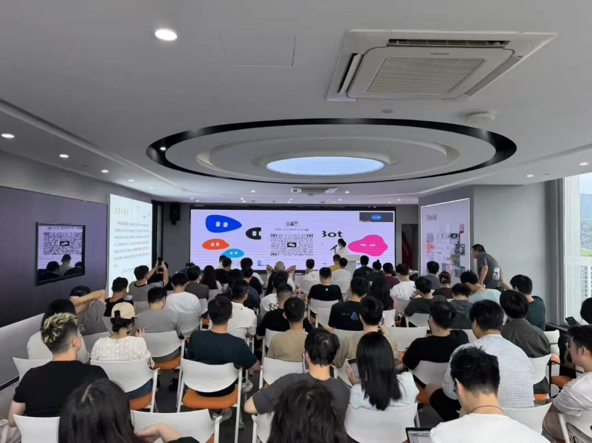

# 从浏览器验收到企业退款，Grok Bot 已经能做什么

Source: https://mp.weixin.qq.com/s/2S0XSkbkk_tMAe1t8reFLg

宁为玉
宁为玉

共识酒馆

在小说阅读器读本章

去阅读

在公众号小说中沉浸阅读

长三角首场 Grok & GrokBot 交流会｜杭州站回顾

9月5日，长三角首场 Grok & GrokBot 交流会在杭州举行。本次活动由青云里、EverMind、持续加载、Ordyn AI 等联合举办，共识酒馆协办。

这次现场请来了几位长期在 AI、Agent 和企业落地一线实践的朋友。杨文主要关注 AI Coding 与 Context Engineering，曹铁柱有十年全栈开发经验，QingYue长期折腾各类 Agent 工具，Davis一直在做 FDE 和企业 AI 落地，Jason Lee 则已经把多个 Grok Bot 放进自己的业务里并行运行。

所以昨天台上出现的内容，也没有停留在“Grok Bot 有哪些功能”。

一份产品刚发版，Bot已经可以留在云端，把桌面端、移动端、登录和支付链路重新走一遍；另一边，一条业务线被单独交给一个 Bot，代码改完后连验收都继续往下做。再往后，Bot有了自己的邮箱，可以收验证码、发邮件、跟进线程。到了企业场景，屏幕里的角色已经变成 Research、Content、Sales、Ops、Finance，一封客户的退款邮件进来以后，后面的流程甚至直接连到了 Stripe。

这些案例放在一场活动里看，Grok Bot 的位置就变得很具体了。

当 Agent 只能回答问题时，我们关心模型聪不聪明；等它开始操作浏览器、调用工具、长期留在一条业务里，问题很快会换一批：任务怎么分，结果谁验，账号归谁，权限开到哪里，涉及资金的时候又在哪一步停下来等人。

下面是我们根据当天几场分享整理出的6个主要内容。

## 01

## 产品上线以后，哪些检查可以先交给 Grok Bot

《Grok Bot 一周使用体验》的第二页，放的是一次视觉回归测试。

右边没有复杂的架构图，而是一段 Bot 已经跑完的检查记录：官网 desktop 9/9、mobile 9/9，登录态、Stripe 流程、404页面继续往下测，并返回具体结果。

这类工作很典型。

产品开发完成，并不代表发布流程结束。每次上线以后，总要有人重新打开官网，把几个关键页面走一遍：移动端有没有错位，登录有没有问题，支付链路还能不能走，某个刚改过的页面会不会把其他地方带坏。

以前这部分工作很容易夹在开发和运营之间。功能刚改完，人又切到浏览器；发现一个问题，再回到代码；改完以后，还得重新检查。

Grok Bot 的云端环境让这类“需要操作电脑、流程又相对固定”的任务有了另一个处理方式：把检查路径写清楚，让 Bot 留在云端继续走，最后带着截图、异常和结果回来。

同一份分享里，后面的案例开始往日常运营延伸。

接通 X API 后，可以定期整理产品资讯和用户反馈；如果某个账号值得长期关注，还可以建立 Routine，让 Bot 定时查看有没有新帖，有更新时继续执行收藏等动作。

另一个例子来自展览资讯：给 Bot 一批长期关注的公众号，定期查近期新展，再把筛出来的信息补进数据库。App发新版时，也可以把不同语言的 What's New 交给它继续处理。

这些任务放在一起，有一个共同点：单次操作都不难，真正麻烦的是它们不断出现。

你每天不会因为“检查一个页面”觉得工作量很大，但如果产品、内容、运营和数据里同时存在十几个这样的动作，人一天会被切断很多次。

因此，第一批适合交给 Bot 的工作，未必需要很复杂。那些已经有固定路径、能够明确验收结果，却总要人抽身处理的事情，往往更容易先跑起来。

当一两个任务交出去以后，执行能力最显眼；等几条业务同时开始跑，人的注意力很快成了新的瓶颈。

Jason Lee 的分享就从这里开始。

## 02

## 几条业务同时推进，一个人怎么分配 Bot

Jason的第一页只有一句非常直接的话：

> 贵的不是 Token，是注意力。

后面紧跟着的是一个做产品的人很熟悉的场景：软件写完之后，还有验收、浏览器检查、配置、上线和运营。每件事情单独拿出来都不重，可它们会不断把人从当前工作里拉走。

因此他的处理方式并不复杂——把业务线和 Bot 对应起来。

一条业务长期由一个 Bot，或者一队 Bot 跟着。人把目标、边界以及遇到例外时的处理方式讲清楚，执行和后续验收尽量留在这条线上。

产品验收就是一个很好的例子。

代码改完后，Bot继续在云端测试，再打开浏览器把关键页面跑完，最后把截图和结果送回来。人不需要陪着整个流程，只在结果回来以后决定这一版能不能过。

这会改变一个人同时做几条业务时的节奏。

过去是A项目刚改完，切去验收；B项目有个线上问题，再切过去；C项目要补一段运营内容，又开一个窗口。现在可以让不同业务在后台各自推进，人等到真正需要判断的时候再进去。

当然，什么都交出去也不现实。

Jason在PPT里把边界划得很清楚：路径明确的任务适合给 Bot，模糊的产品判断依然留在人手里；权限、付费以及那些很难提前说清楚的选择，也要保留人的决策口。

这里有一句我觉得很准确：

> Bot = 更耐跳的你。

它的优势更多来自耐心、并行和持续执行，而不是替产品负责人突然多长出一套判断力。

因此，第一次尝试也不需要同时开十条业务线。Jason最后给的建议很简单：先选一条最烦、但路径清楚的业务，把这一条交出去，看它能不能稳定跑。

业务线能够独立推进以后，另一个此前不太显眼的问题就出现了。

如果 Bot 要长期待在一条业务里，它迟早会注册服务、收验证码、发邮件、联系别人。到了这一步，它使用谁的账号、以谁的身份对外，就不能再含糊。

## 03

## Bot 要长期工作，最好先把邮箱和身份分开

关于专属邮箱的分享，开头直接把两种方案摆在了一起。

最省事的做法，是让 Grok Bot 连接个人 Gmail。但这样一来，私人邮件、密码重置链接、2FA验证码都处在同一个收件箱里，Bot同时还拥有发信能力；如果邮件内容里藏有恶意提示，也可能进一步影响它后续的行为。

现场给出的替代方案是 AgentMail：单独给 Grok Bot 建一个 Inbox。

安装过程本身很短。注册 AgentMail，在 Plugins 中安装对应插件，通过浏览器完成 OAuth 授权，确认连接器正常以后，剩下的建邮箱和验证过程就可以继续交给 Bot。整个过程不需要手工复制 API Key。

真正有意思的是后面的 Demo。

用户只给了一句：

> get yourself an email address

随后，Bot检查可用地址，创建了自己的邮箱，并向用户的真实邮箱发出一封测试邮件。人收到以后直接回复，再回到 Bot，它能够在同一个邮件线程里读取这封回复。

到这里，收信、发信和线程上下文都通了。

一个邮箱跑通以后，它的作用会迅速超过“帮我读邮件”。

Bot可以用自己的地址去注册 Notion、Vercel、GitHub 等服务，验证码进入自己的收件箱；可以用独立地址处理外联；客服场景里，它也可以拥有单独的支持邮箱。进入多人邮件线程时，把它 CC 进去，它就能够沿着已有历史继续参与。

邮箱因此变成了 Agent 的一部分身份。

这同时意味着，权限必须重新设计。

分享里的做法是，把个人 Gmail彻底留在访问范围之外；每次对外发信前，先展示收件人、主题和正文，等人确认后再发送。身份分开以后，谁发了这封邮件、谁拥有这个账号，也变得更清楚。

当 Bot 只是在浏览器里检查页面时，身份问题还不突出；一旦它开始注册账号、收验证码、参与外部沟通，账号和权限就会自然进入系统设计。

而到了企业里，这个问题还会再扩大一层。

## 04

## 一家公司里，到底需要哪几类 Agent

Davis的分享题目是：

《当 Agent 永久在线：从 Grok Bot 到企业 Runtime》

第一张内容页先画了一条变化曲线：今天，Agent更多还是经济活动的辅助者；未来如果执行能力继续增加，它会更深地参与经济活动本身。

下一页把这个变化画得更直观。

左侧是 Human ↔ Human，人围绕销售、内容、财务、运营发生协作；右侧已经变成 Agent ↔ Agent，Research、Content、Sales、Ops、Finance、Support 等角色进入同一张网络。

随后，企业需要准备的东西被拆成两块：

Enterprise Ontology和Always-on Agent Team。

Agent Team这一侧更接近组织设计。

PPT里给出了Research Bot、Content Bot、Sales / Outreach Bot、Ops Bot、Finance Bot、Governance Bot六类角色。研究、内容、销售、运营、财务和治理分别交给不同数字员工，每个角色按照自己的职责范围运行。

后面还放了一张真实的8 Bots组织图。

Founder下面先有Chief of Staff，再往下分出不同职能Bot。整个画面已经很像一张小团队组织架构，只是其中相当一部分岗位由Agent承担。

这一点和前面Jason讲的“一条业务线对应一个Bot”有某种连续性。

个人使用时，最容易按业务线拆；进到企业以后，职责、数据和权限变复杂，再按职能划分会更清楚。Sales Bot和Finance Bot显然不应该拿到完全相同的系统权限，Research Bot也不需要直接执行资金动作。

Agent数量增加以后，组织问题会自然冒出来：哪些数据归哪个角色读取，任务做完后交给谁继续，哪个Agent拥有执行权限，又有哪些动作必须回到人工审批。

这时，仅仅有一群会干活的Bot还不够。

它们还需要理解自己正在服务的是一家什么样的公司。

## 05

## Agent 要在企业里工作，先得知道公司现在是什么状态

Davis把另一块称为Enterprise Ontology。

这一页其实已经把企业本体拆得很具体：Objects、Relations、States、Actions、Policies 和 Security。

也就是说，Agent首先需要知道企业里有哪些对象，例如客户、订单、商品、合同或设备；这些对象之间存在什么关系，目前又分别处在什么状态。再往后，才是能做哪些动作、动作受什么规则约束，以及谁拥有对应权限。

这样看，企业本体和Agent Team承担的是前后两段工作。

前者提供足够的业务上下文，让Agent知道“现在发生了什么”；后者才有条件接着处理任务。

PPT接下来又专门拆了一页 Action。

一个企业动作要真正运行，前面会经历几层定义：先规定输入、输出和调用方式，再确定动作类型；继续往下，还要加入行业约束和一家公司的具体规则。到了 Runtime，动作才开始在真实系统中执行。

这套设计的价值，在于同样一个动作放进不同公司时，执行条件不会被简单抹平。

比如“退款”。

名称一样，企业规则可能完全不同：什么订单能退、由哪个角色发起、金额达到多少需要审批、最终调用哪个系统。这些约束如果没有被表达出来，Agent即便已经会操作Stripe，也很难直接进入生产环境。

个人自动化跑错一次，通常还能重来；企业里的订单、资金和客户状态一旦发生变化，后果会直接落在真实业务里。

因此，讨论到这里，重点已经不再是模型能不能完成操作，而是企业有没有把允许它怎么操作讲清楚。

PPT下一页恰好给了一个完整案例。

## 06

## 一封退款邮件进来以后，Human Gate 放在哪里

最后的案例，从一封客服邮件开始。

屏幕左侧是 Customer Support Bot 收到客户请求；中间的 Grok Bot 判断内容以后，进入 Refund Action。流程继续往下走到一个紫色节点时停住了：

Human Approval。

人工批准以后，Stripe API 才继续执行退款，随后状态更新为 Refund Completed。

这张图把前面的几场分享一下连了起来。

专属邮箱那一场解决了“Bot怎么独立收邮件”；企业本体告诉它客户、订单和退款请求分别是什么；Agent Team规定客服与其他角色的职责；Runtime负责把一次Action继续推到真实系统。

客服邮件也因此不再只是“生成一段回复”的输入。

它可能直接触发一个业务动作。

客户发来退款请求以后，系统要先找到相关信息，判断是否符合规则，再进入执行流程。碰到资金操作时，人重新出现，确认以后才把权限交给Stripe。

Human Gate放在哪里，也就成了企业Agent设计里很现实的一件事。

风险较低、结果容易校验的动作，可以让Agent多走几步；越接近资金、合同、重要账号和不可逆操作，人的确认就越需要靠前。

一旦真实API被调用，事情的性质也会随之变化：资金状态会改变，订单会更新，客户收到的是一次真实执行后的结果。

这时再讨论Agent，关注点已经不只是“它会不会做”，还要问清楚它凭什么做、做到哪一步，以及出了问题由谁负责。

昨天几场分享的切口并不相同。

有的从一次产品发布后的浏览器检查开始，有的关心几条业务并行以后怎么减少上下文切换；邮箱分享把问题推进到了Agent的账号和身份，到了企业场景，又出现了角色、本体、Runtime和Human Approval。

把这些内容放到同一天里，反而能看到Grok Bot进入真实工作之后的一条自然路径。

最开始，人愿意把那些步骤清楚、结果容易检查的任务交出去。随着任务运行时间拉长，Agent需要自己的环境、账号和通信入口；进入企业以后，它还要理解业务对象、遵循公司规则，并在权限边界内调用真实系统。

人的位置也没有消失，只是介入点开始变化。

过去，人承担大量具体操作；当一部分执行被交给Agent以后，注意力会更多留在目标、异常、权限和最终判断上。哪些动作可以连续跑完，哪些动作应该停下来确认，也会成为每一套工作流都要单独回答的问题。

这些实践现在还很早。

多Agent长期协作怎么保持稳定，Agent身份最终应该怎样管理，企业里的权限颗粒度要做到多细，Runtime在什么条件下才适合进入生产环境，这些都没有统一答案。

但昨天现场已经很少有人停留在“Agent以后也许能做什么”。

屏幕上更多是已经跑起来的任务：浏览器真的被打开，测试真的在执行，邮箱真的创建出来，业务线真的交给Bot，退款流程也已经接到了Stripe前面。

于是问题开始变得更务实——哪些工作今天就能交出去，结果回来后怎样验收；哪些环节可以让它继续运行，又有哪些决定最好始终留在人手里。

这可能也是接下来继续讨论Agent时，更值得追踪的一条线。

## 共识酒馆

共识酒馆是一个面向AI爱好者、从业者与探索者的线下交流空间。我们每周都会举办1到2场共识小圆桌，邀请嘉宾分享AI、Agent、自动化工作流和产业落地相关的真实经验。

如果你想持续获取更多前沿AI资讯、活动预告和嘉宾分享干货，或者希望链接资源与合作，欢迎加入共识酒馆交流群。

预览时标签不可点

微信扫一扫  
关注该公众号

知道了

微信扫一扫  
使用小程序

取消
允许

取消
允许

取消
允许

×
分析

微信扫一扫可打开此内容，  
使用完整服务

：
，
，
，
，
，
，
，
，
，
，
，
，
。
 
视频
小程序
赞
，轻点两下取消赞
在看
，轻点两下取消在看
分享
留言
收藏
听过