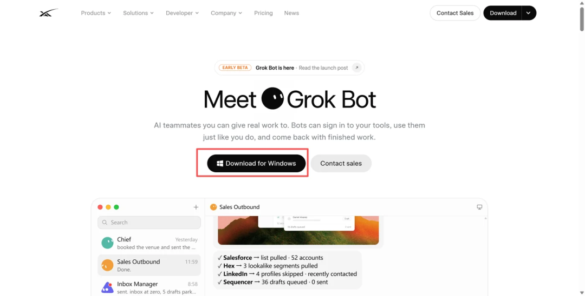
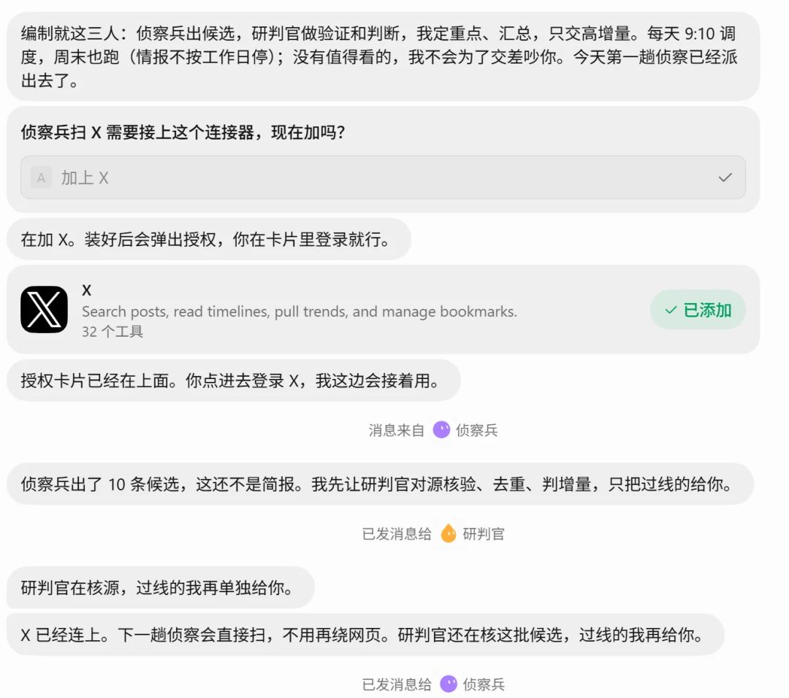
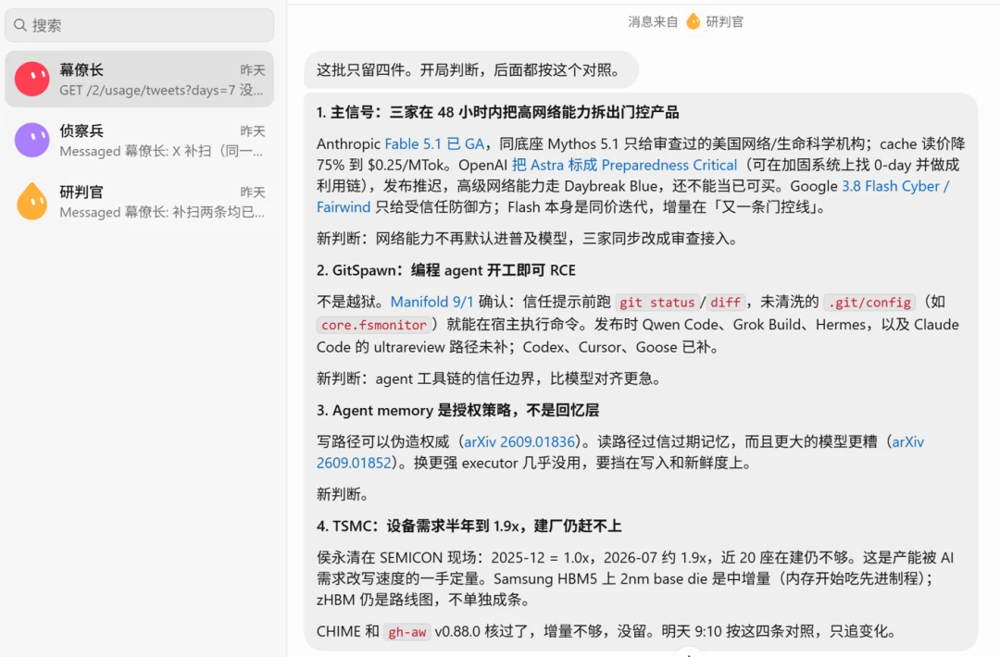
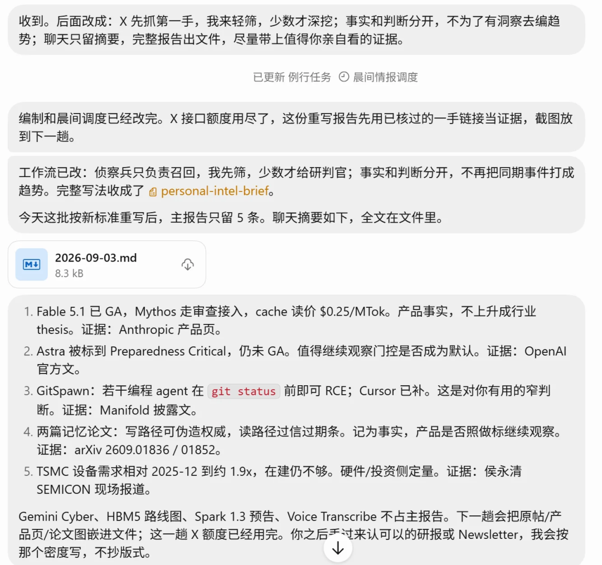
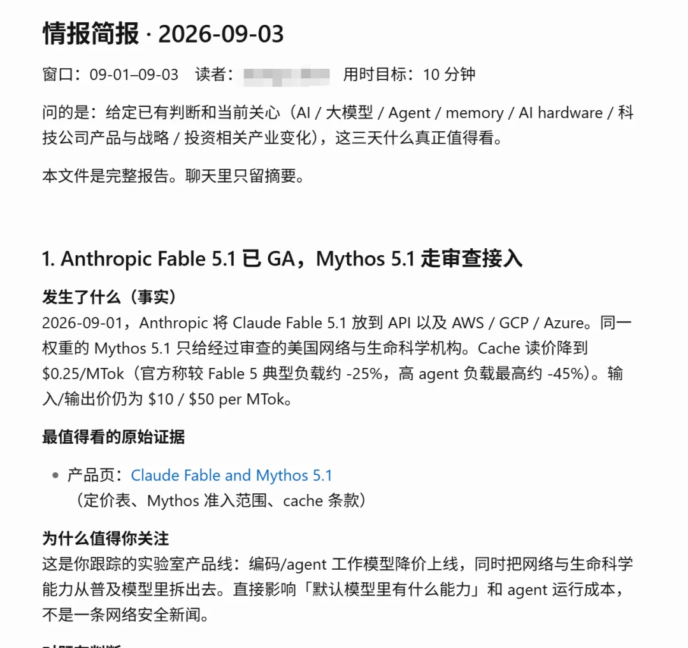
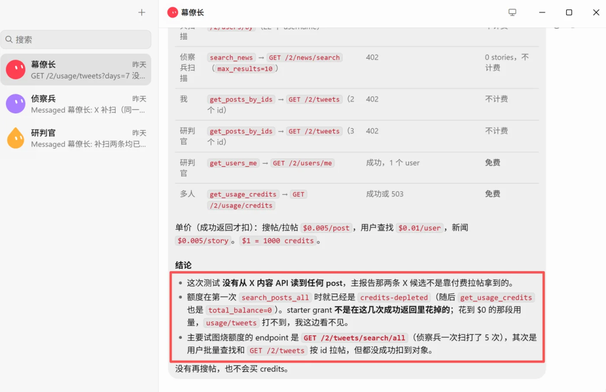
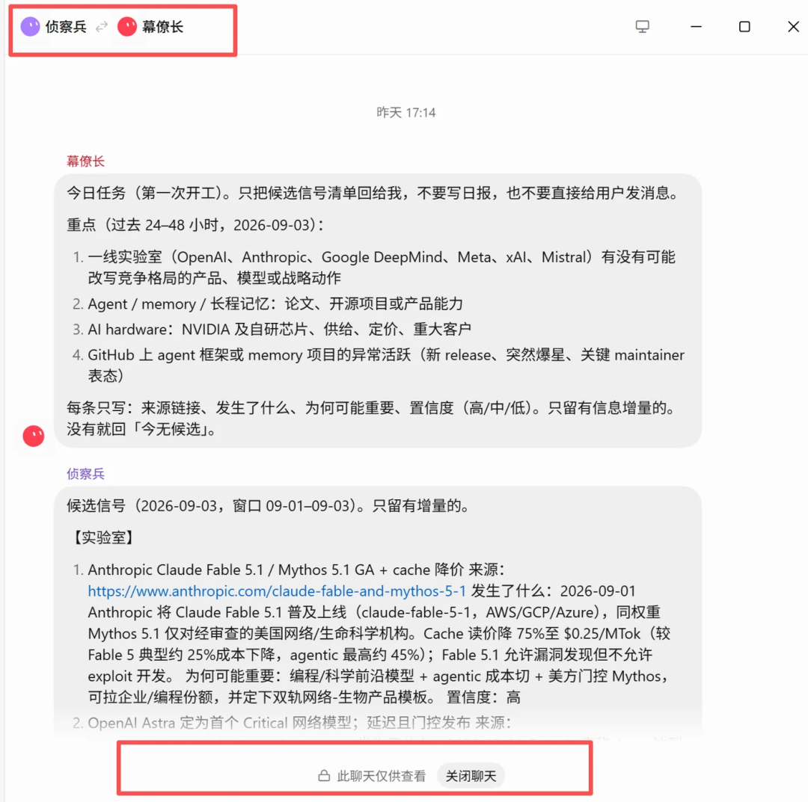
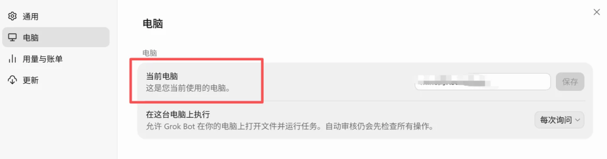
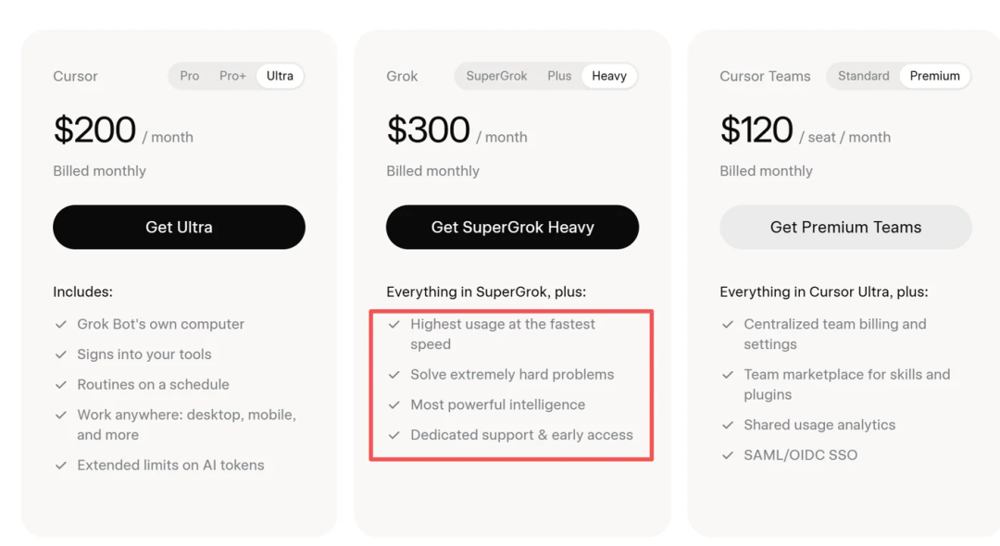

# 对Grok Bot的简单评测

Source: https://mp.weixin.qq.com/s/I67C6DFCVeR7Mb36w3VUgA

原创

mine
mine

Mine沉思录


在小说阅读器读本章

去阅读


在公众号小说中沉浸阅读

最近看 Grok Bot 的推荐铺天盖地，说是 Agent 的 ChatGPT 时刻，所以我也下载体验了一下。体验下来确实有一些预期外的惊喜，但也有一些不足，于是有了这篇文章。这篇主要是做个记录，想到哪儿写到哪儿。

先说结论：Grok Bot 目前最让我觉得好用的设计，是它把 Agent 编排、电脑环境配置、memory 和 context 管理都藏到了产品背后，用户不再需要管理 session 和各种文档，而是直接管理几个长期存在的“同事”就可以了。

## 一、上手难度极其低

这是 Grok Bot 的优势，上手难度非常低，正常人都能上手。首先是下载和登录界面。

下载特别迅速，点进 x.ai/bot 这个网站，它会自动识别你是什么电脑，点 download 直接装。



然后是登录。Grok Bot 提供了几种登录方式，比如邮箱登录、Cursor 账号登录、Grok 账号登录，我这里没截图了。我选的是 Cursor 账号登录（跟我的 Gmail 邮箱绑定），它会赠送试用额度，但额度不算多，下文我会实测。

进去之后，Grok Bot 会让我们选择平时一般用什么软件比较多，这里我选择了 Google Workspace、Notion、Microsoft 365、X 等等，当然还有 Slack 什么的也可以选，点点点就可以了，没啥摩擦。

Grok Bot 会自动引导我们创建一个新的 Bot，比如它会建议先创建一个负责 Notion 的 Bot，一个负责检查邮箱的 Bot。但我没有采用这种组织方式，因为我深感自己是个单线程生物，所以我创建了一个总控 Bot，我把这个 Bot 命名为幕僚长，结合我的诉求给了以下指令：

*我希望你作为我的 Chief of Staff / 幕僚长，核心职责不是自己完成所有工作，而是理解我当前最关心的问题，管理和调度其他 Agent，并最终替我筛选真正值得关注的信息。现阶段我的目标是建立一个个人情报系统：每天持续关注 X、公司官网、技术博客、研究机构、GitHub 等来源，重点覆盖 AI、大模型、Agent、memory、AI hardware、科技公司产品与战略，以及与投资相关的重要变化。你需要根据我的兴趣和近期关注点决定每天该重点调查什么，把任务分配给合适的 Agent，汇总它们的结果，去重、验证、判断重要性，并最终只把高信息增量的内容交给我。不要把大量原始信息简单堆给我，也不要为了完成日报而总结无关紧要的新闻；你的核心目标是替我管理注意力，发现我可能错过的重要信号，并告诉我“发生了什么、为什么重要、是否改变了我们之前的判断”。后续你也可以根据实际需要建议我新增、调整或删除下属 Agent，但希望整体结构保持精简，优先让每个 Agent 对一个明确的结果负责。*

这是当时的截图，可以看到**幕僚长会自己拆解任务，还拆了两个专员出来，分别是侦察兵和研判官，并创建了对应的 Bot**。


然后他们就自己开始干活了，我只需要授权一个 X 就可以，也很丝滑。



这是他们给的第一条反馈，时间还是蛮快的，几分钟就搞定了全流程。但可以看到输出效果确实比较一般，没有达到我的预期，当然这也跟我的指令比较简单、它们也没有 memory、以及实际上它们根本就看不到 X 的内容有关系。



同时我注意到用量消耗非常快，就这点时间已经消耗了 70% 的试用额度。于是我又给了些指令，让它输出 md 文档给我。**Grok Bot 是有文件发送能力的**，可以将云端虚拟机里创建的文件通过聊天窗口发送给我们。



md 文档可以打开预览（这个点还是比较人性化的），可以点击下载。



但我发现这个来源不像是 X，开始怀疑 Bot 到底能不能看到 X 的内容，于是我询问 Bot 是否有通过 API 拉取到 X 上的原始内容，它的反馈是没有，因为没有赠送额度。经查询，X 的 API 需要单独付费。



**Bot 之间可以自动互相通信**，我们可以点进去看 Bot 之间的沟通、查看它们的交流，但仅供查看。



## 二、一些产品设计上的拆解

主界面极致简单。主要是聊天框，也可以远程操控 Bot 的屏幕，教它完成一些机械的简单任务；插件则提供了一些常用软件的接入，几乎没有其他设置选项。用户直接布置任务就可以了。


Agent 可以操纵云端虚拟机，也可以操作本地电脑上的文件，无需用户自己设置局域网传递资料。



再说 memory 和 context 管理。Bot 没有开新 session 的选项，是持久存在的，也就是说，用户无需判断什么时候应该开什么 session、文件应该怎么放。

xAI 官方文档里对 Bot 的定义非常明确：

> **一个 Bot = 一个持久存在、具名的 AI teammate，它有自己的 conversation 和持续发展的 working context。**

也就是说，**Bot 和 conversation 是一一绑定的**。同一个 Bot 默认就是沿着这条长期对话一直聊下去，而不是开一堆 session。

```
幕僚长 
```

```
├── Session 1 
```

```
├── Session 2 
```

```
├── Session 3 
```

```
└── New Chat 
```

更接近下面这样：

```
幕僚长 
```

```
└── 一条长期持续的 conversation     
```

```
├── 今天的任务     
```

```
├── 明天的任务     
```

```
├── 下周的任务     
```

```
└── ... 
```

官方强调，Named Bot 是 persistent / durable state，会跨 turn 保留 memory、文件、browser session 和 preference，目标就是让 context 越用越厚，而不是每次清零。**Grok Bot 的设计相当于把 session 从产品概念降级成了内部实现细节，用户只需要管理不同的“人”，系统自动管理 context，这是符合人性的。**

**理论上来说，如果效果足够好，这是用户负担最小的设计，但怎么管理好 context 是个难点。**因为用户根本不应该需要理解关于 memory 的全流程，比如：

> long-term memory、episodic memory、semantic memory、context compaction、RAG、session boundary……

用户只负责使用，且产生一种熟悉感：

> **“Agent 知道我们之前的进展，对我很了解，而且它也没有记忆混乱，把一些不该拿出来的东西拿出来污染现在做的事项。”**

当然，这套设计最难的地方也在这里：**一旦自动压缩错了、记错了、把旧事实当成新事实，用户都没有权限去修。Grok Bot 的 memory lifecycle（写入、压缩、检索、更新、冲突和遗忘）怎么做，非常值得观察和研究。**

## 三、总结

综上，简单总结一下初步使用体验。

**操作丝滑，非常容易上手。**不需要管理 session，不需要管理 Agent 集群，Agent 共用存放资料的文件夹，会自己找其他 Bot 沟通，无需人类设计太多工作流。

**Token 消耗非常爆炸。**用了 Agent 集群，Token 用量随着 Agent 的数量和交互次数增加而快速增长，额度消耗非常快，经常会有额度不够用的情况，需要氪金。X 上有用户称用 SuperGrok Heavy 都不够用，这也是有可能的，还是需要悠着点用。

**适合预算充足、有业务需求、但不喜欢折腾的轻量 AI 用户。**相当于用钱换便利。



预览时标签不可点


微信扫一扫  
关注该公众号

知道了


微信扫一扫  
使用小程序

取消
允许

取消
允许

取消
允许

×
分析


微信扫一扫可打开此内容，  
使用完整服务

：
，
，
，
，
，
，
，
，
，
，
，
，
。
 
视频
小程序
赞
，轻点两下取消赞
在看
，轻点两下取消在看
分享
留言
收藏
听过