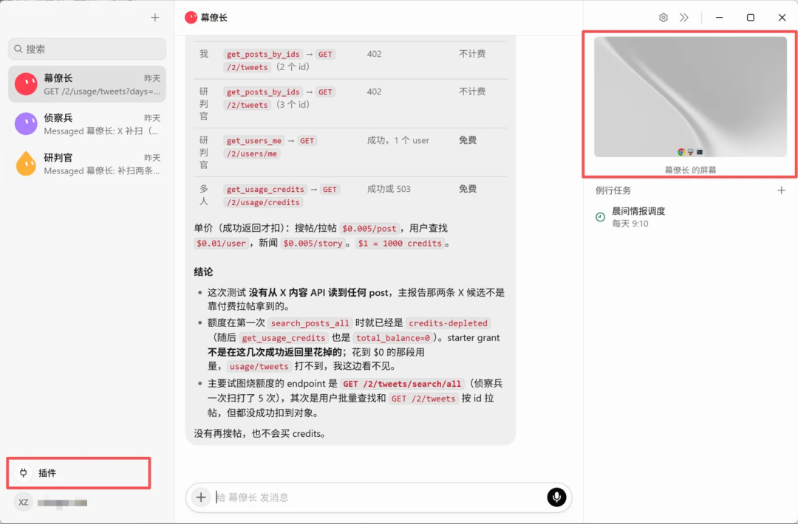
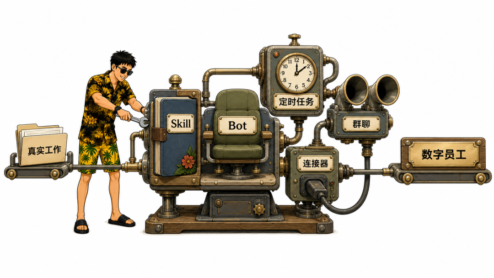
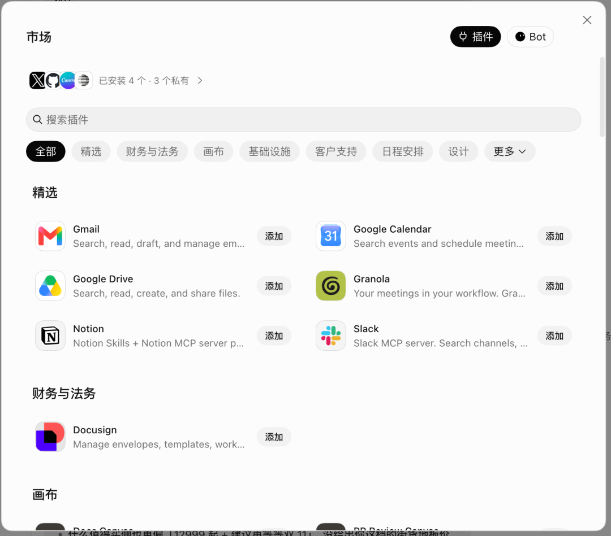
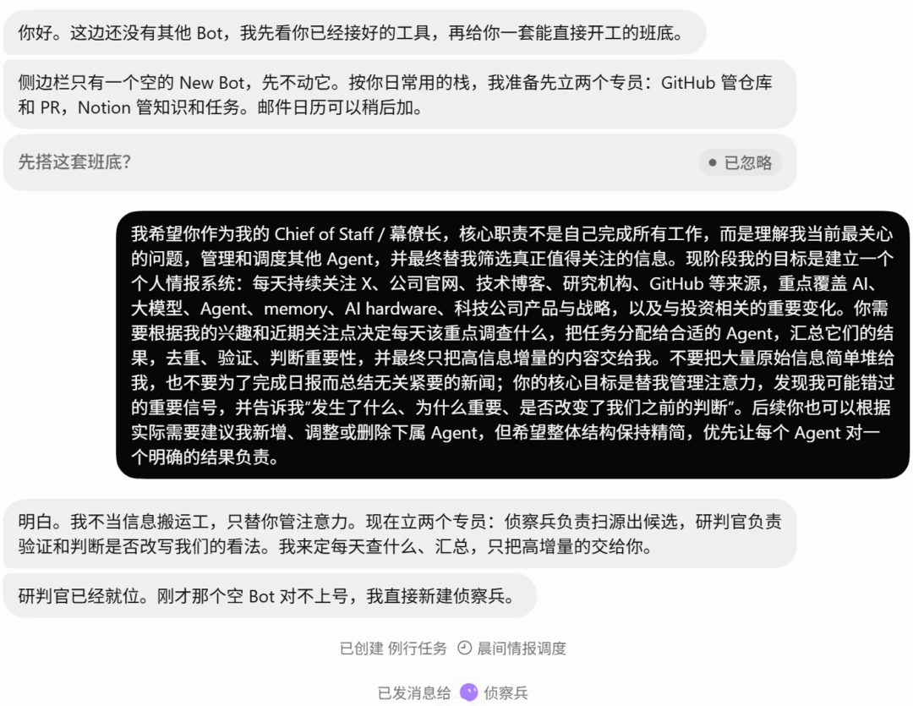
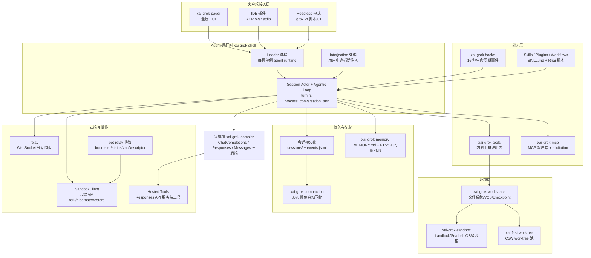
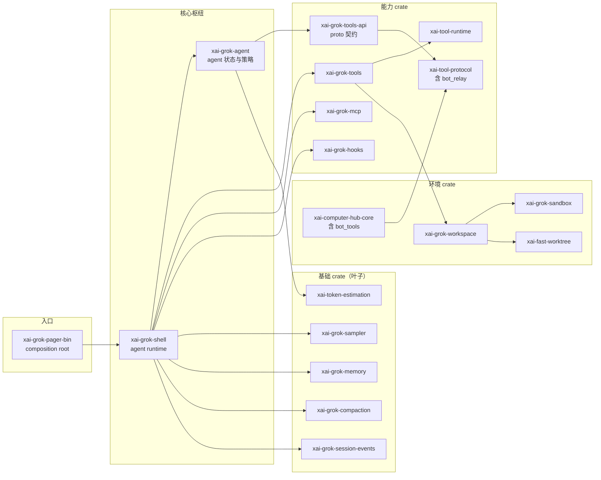
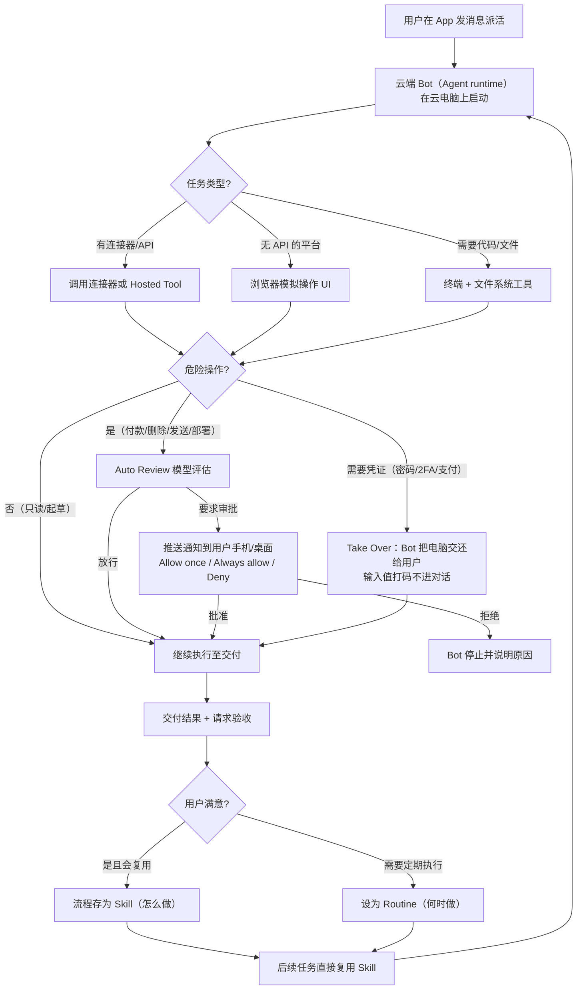
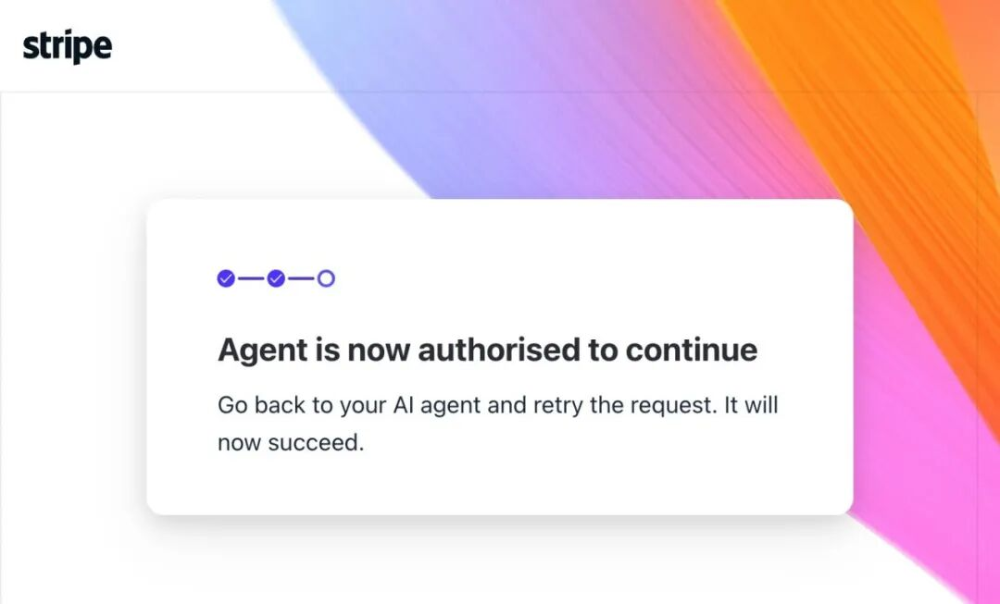
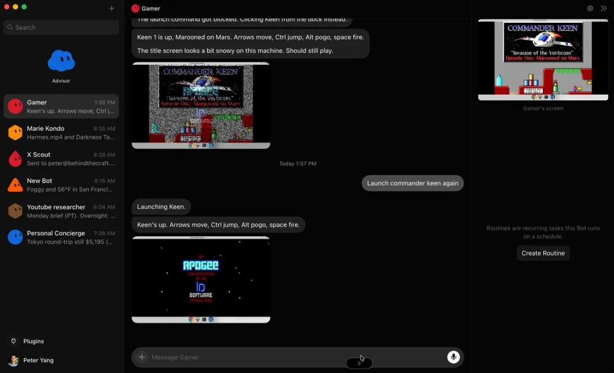
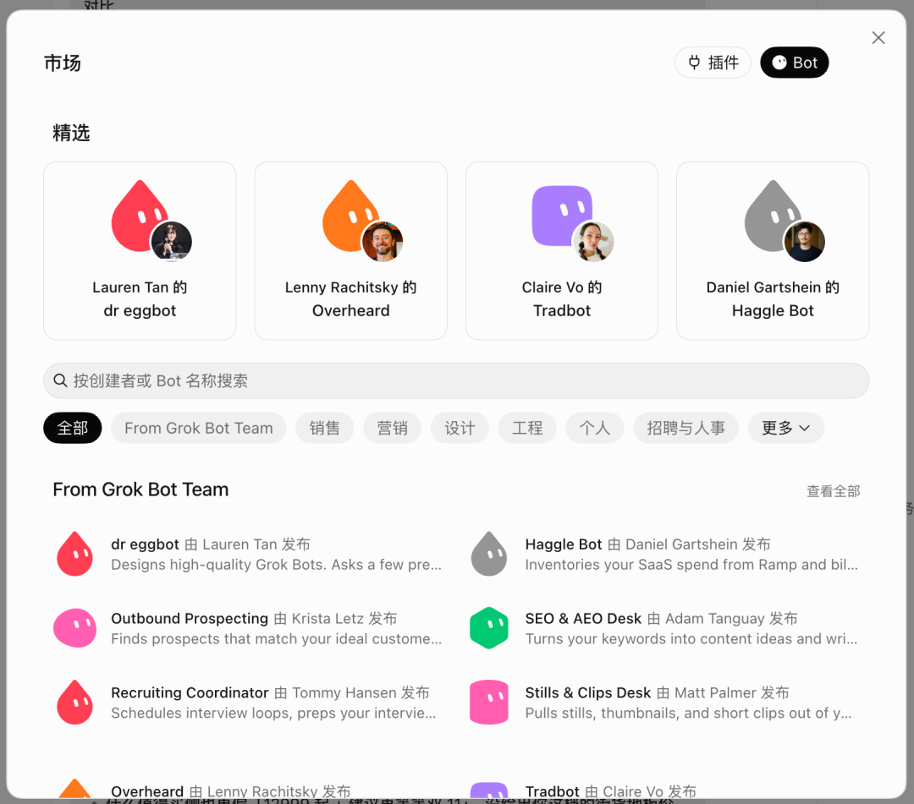

# Grok Bot（xAI）调研报告

> 调研日期：2026-09-06 ｜ 产品版本：Early Beta（2026-08-11 发布）至 Grok Bot for Enterprise（2026-09-03）
> 调研对象：xAI 的 Grok Bot —— 云端常驻、拥有自己电脑的 AI 数字员工产品
> 资料来源：xAI 官方公告与文档（x.ai）、开源仓库 xai-org/grok-build 源码分析、10 篇微信公众号深度解读（存档于 references/）

---

## 目录

1. [执行摘要](#1-执行摘要)
2. [产品概述](#2-产品概述)
3. [发布时间线与可用性](#3-发布时间线与可用性)
4. [核心机制：一个 Bot 如何工作](#4-核心机制一个-bot-如何工作)
5. [多 Bot 协作：从单个 Agent 到数字团队](#5-多-bot-协作从单个-agent-到数字团队)
6. [安全模型：身份、审批与治理](#6-安全模型身份审批与治理)
7. [定价与商业化](#7-定价与商业化)
8. [代码分析：grok-build 开源 Harness](#8-代码分析grok-build-开源-harness)
9. [真实案例与生态](#9-真实案例与生态)
10. [竞品对比与定位分析](#10-竞品对比与定位分析)
11. [批评、局限与未解决问题](#11-批评局限与未解决问题)
12. [启示与展望](#12-启示与展望)
13. [附录](#13-附录)

---

## 1. 执行摘要

**Grok Bot 是 xAI 于 2026 年 8 月 11 日发布的常驻型 AI Agent 产品**。产品定义一句话概括：**每个 Bot 是一个具名的、持久化的 AI 队友（AI teammate），拥有自己的云端电脑，可以登录你的工具和应用，像人一样跨软件完成任务，7×24 小时运行——你合上笔记本它也不停。**

与既有 Agent 产品的根本差异在于三个翻转：

| 维度 | 传统 Agent 产品（ChatGPT/Claude/Copilot 类） | Grok Bot |
|------|--------------------------------------------|----------|
| 产品单位 | 会话（session）——用完即弃 | **具名的人（Bot）**——长期在岗 |
| 运行位置 | 请求时才运行，人在场 | **云端独立电脑**，人离场也持续运行 |
| 工作方式 | 给答案 / 写代码给你看 | **替你登录系统干活**，交付结果 |
| 交互范式 | "帮我做"——产品是答案 | **"把它做完"——产品是结果** |
| 人的角色 | 操作员（AI 思考，人执行） | **审批者（分配 → 检查 → 批准）** |

五大核心机制：

1. **云电脑**：每个（组）Bot 运行在一台持久化云端 Linux 虚拟机上（据三方实测：8 核 16G / 120GB SSD / 带宽约 900Mbps），带可视化桌面、浏览器、文件系统、终端；空闲自动休眠（hibernation ≠ deletion），可被唤醒。
2. **像同事一样沟通**：iMessage 式聊天界面，手机/桌面同一线程续接；Bot 与**一条长期 conversation 一一绑定**——session 被从产品概念降级为内部实现细节，用户管理"人"而非 context。
3. **多 Bot 协作**：Bot 之间自动互发消息、拉群分工、`/workspace` 目录交接文件；常见形态是一个"幕僚长（Chief of Staff）"管理各专项 Bot。
4. **示范学习**：Teach a Task——让 Bot 观看你操作一遍（最长 10 分钟），流程存为 **Skill**（怎么做），再配 **Routine/定时任务**（何时做）实现无人值守。
5. **审批与人机交接**：交互式审批（Allow once / Always allow / Deny）+ 独立审查模型 Auto Review + Take Over 人工接管（密码/2FA/CAPTCHA/支付环节由 Bot 把电脑交还给你）。

**商业化路径**：不单卖，随订阅赠送——Cursor Pro（$20/月起）、SuperGrok（$30/月起）、Cursor Teams（$40/席/月）；Bot 用量独立计算。2026-09-03 推出 Grok Bot for Enterprise，补齐 SSO（SAML 2.0）、SCIM 2.0、网络出口白名单、审计三管道（Audit Logs / Action Recording / OTel Export）等企业治理能力。客户已含 Legora、Supermicro、ServiceTitan。

**代码层面**：Grok Bot 本体闭源，但同一产品线开源了 [xai-org/grok-build](https://github.com/xai-org/grok-build)（约 169 万行 Rust、97 个 crate，Apache-2.0）。源码证据显示 **Grok Build 就是 Grok Bot 产品线的本地/终端 harness 与云端 runtime 共用的代码基**：同一套工具语义词表（`x.ai/tool` 信封）、同一套上下文压缩引擎（85% 阈值两侧共享）、同一套 bot-relay 协议（`bot.roster`/`bot.status`/`bot.vncDescriptor`——客户端可直接查看云端 Bot 的屏幕）、同一套云端沙箱 API（fork/hibernate/restore，per-turn rootfs 快照）。

**一句话定位**：Grok Bot 把"管理一支团队"这件事本身产品化了——它不是更好的 agent 工作台（方向盘），而是让 AI 以"同事"身份进入组织的一次产品化落地。诚实的边界同样清晰：Early Beta 成熟度、额度消耗爆炸、多 Bot 共享云电脑带来的安全边界模糊、以及"更像 RPA 重做版"的能力真相争议。

---

## 2. 产品概述

### 2.1 官方定义

xAI 官方公告（[Introducing Grok Bot](https://x.ai/news/introducing-grok-bot)，2026-08-11）的核心表述：

> "Grok Bot is your team of helpful AI teammates... Each Bot has its own computer in the cloud and can sign into your tools and apps — even platforms with no clean API or MCP — to complete work end-to-end, around the clock."

四个官方要点：

1. **拥有自己的电脑**：Bot 在云端有独立计算机，可登录并跨应用、工具、网站工作，包括没有标准 API 或 MCP 的平台；任务在你离开后不会中断，完成后才回来找你审批。
2. **像同事一样沟通**：手机或桌面端像给同事发消息一样分配任务，无需先搭建工作流或自动化规则；同一会话串可在两端续接。
3. **多 Bot 协作**：可并行运行多个 Bot，Bot 之间可独立互发消息、共享上下文、自动协调；可拉群让 Bot 自行交接工作，仅在需要人为判断时叫你。
4. **示范学习**：让 Bot"跟看"你完成一次任务，它把工作流保存为 routine（例程），接受纠正，下次独立复跑。

公告原文的关键句："It saves your workflow as a routine" / "only come back when something needs your approval"——这两句话分别定义了**效率来源**（例程化）和**人的位置**（审批点）。

### 2.2 产品线区分：Grok / Grok Build / Grok Bot

xAI 产品线三件套（三方教程普遍采用的三分法）：

<p align="center"><b>表 1：Grok 产品线三分法</b></p>

| 产品 | 定位 | 形态 | 开源情况 |
|------|------|------|----------|
| **Grok** | 问答/对话助手 | 聊天窗口（grok.com、X 内嵌、App） | 闭源 |
| **Grok Build** | 终端编码 Agent | 全屏 TUI（`grok` CLI），理解代码库、改文件、跑命令 | **开源**（[xai-org/grok-build](https://github.com/xai-org/grok-build)，Rust，Apache-2.0） |
| **Grok Bot** | 通用执行/数字员工 | 聊天式 App + 云端电脑 | 闭源 |

三方教程的一句话版本："**Grok 帮你想，Grok Build 帮你写代码，Grok Bot 帮你把工作真正做完。**"

### 2.3 核心交互界面

Grok Bot 主界面刻意做到了极致简单：聊天框 + 可远程操控的 Bot 屏幕小窗 + 插件入口。整个产品的复杂度（Agent 编排、电脑环境配置、memory 和 context 管理）都被藏到了产品背后。



*Grok Bot 主界面（三方实测截图）。左侧为 Bot 会话列表——每个 Bot 是一个具名的长期联系人；右侧为聊天窗口与云端电脑屏幕小窗。注意界面中没有任何 session/context/记忆管理的暴露——这是产品最核心的设计决策：用户管理"人"，系统自动管理 context。截图来源于微信公众号《对Grok Bot的简单评测》。*

关键架构洞察（来自三方实测的设计拆解）：

> **"Grok Bot 把 session 从产品概念降级成了内部实现细节。Bot 与 conversation 一一绑定——'幕僚长'下没有 Session 1/2/3 + New Chat，而是一条长期持续 conversation。用户只需要管理不同的'人'，系统自动管理 context，这是符合人性的。"**

这意味着用户不再需要理解 long-term memory、context compaction、RAG、session boundary 这些概念——这是对"Agent 产品该长什么样"的一次重要重新设计。

---

## 3. 发布时间线与可用性

### 3.1 时间线

<p align="center"><b>表 2：Grok Bot 发布与迭代时间线（2026 年）</b></p>

| 日期 | 事件 | 来源 |
|------|------|------|
| 2026-08-11 | Grok Bot 以 Early Beta 发布，面向 SuperGrok 全线与 Cursor Pro/Pro+/Ultra/Teams 订阅者 | [官方公告](https://x.ai/news/introducing-grok-bot) |
| 2026-08-12 | Grok 4.6 发布（专注长时运行智能体的模型） | [官方](https://x.ai/news/grok-4-6) |
| 2026-08-19 | 移动端通知与多账号管理更新 | 官方 news |
| 2026-08-21 | Windows/Linux 桌面端下载开放 | 三方实测 |
| 2026-08-26 | 资格扩大至 SuperGrok 全线（普通 SuperGrok 即可用） | 官方 news |
| 2026-08-29 | Grok Bot now works with X（赠送 X API 额度） | [官方](https://x.ai/news/grok-bot-and-x) |
| 2026-09-01/02 | Google Play 悄然上架（APKMirror 收录 v1.5.0，48.63MB）——至此全平台凑齐 | 三方实测 |
| 2026-09-03 | **Grok Bot for Enterprise** 发布（访问/网络/审计三控制 + 两周免费试用） | [官方](https://x.ai/news/grok-bot-for-enterprise) |
| 2026-09-05 | 官方市场已有公开 Bot 与插件；同日长三角首场 Grok Bot 线下交流会（杭州） | 三方 |

背景事实：马斯克先后将 xAI 与 Cursor 并入 SpaceX 体系（三方报道称 Cursor 作价 600 亿美元），Grok Bot 是合并后"模型公司 + 开发工具公司"融合的第一个重量级产品——这也是为什么 Grok Bot 使用 Cursor 账号认证、云电脑由 Cursor 托管。

### 3.2 平台与获取

- **平台**：macOS（Apple Silicon/Intel）、Windows（x64/Arm64）、iOS 18+、Android（v1.5.0）；无 Linux 桌面客户端（但 Windows/Linux 桌面下载已开放）。入口 x.ai/bot。
- **资格**：不单卖，随订阅赠送——Cursor Pro / Pro+ / Ultra、Cursor Teams Standard/Premium、SuperGrok / SuperGrok Plus / SuperGrok Heavy。
- **首次登录细节**：会出现 Cursor 认证页（Grok Bot 当前使用 Cursor 的账号认证体系），选 Grok 账户授权即可。
- **企业**：Grok Bot for Enterprise 可通过管理后台激活，两周免费试用，可邀请整个组织（含无现有席位的成员）。

---

## 4. 核心机制：一个 Bot 如何工作

### 4.1 五个核心组件

三方深度教程将 Grok Bot 的运行时归纳为五个核心组件，这张图是 10 篇三方文章中最接近架构图的素材：



*Grok Bot 五个核心组件示意图（三方教程配图）。Bot（谁负责）、Skill（怎么做）、定时任务 Routine（何时自动做）、群聊（如何公开交接）、连接器 Connector（进入哪些真实软件）。这五个组件共同构成"数字员工"的岗位抽象：Bot 是人格载体，Skill 固化方法，Routine 赋予主动性，群聊提供组织协作面，连接器打通真实软件。截图来源于微信公众号《万字长文｜Grok Bot 从入门到精通》。*

### 4.2 云电脑：持久化的执行环境

云电脑是 Grok Bot 一切能力的物理基础：

- **规格**（三方实测）：Linux 虚拟机，可视化桌面 + 浏览器 + 文件系统 + 终端；约 8 核 16G 内存 / 120GB SSD / 带宽约 900Mbps，24 小时运行。
- **持久性**：持久磁盘跨会话保留文件与浏览器登录状态。官方安全文档明确："Idle computers hibernate automatically; **hibernation is not deletion**"——空闲自动休眠，唤醒后状态完整恢复（源码侧证据见 §8：云端 sandbox 有 fork/hibernate/restore 全套 API + per-turn rootfs 快照）。
- **共享模型**：多个 Bot **共享同一台云电脑**（文件、浏览器 Session、登录状态全共享）——这决定了安全边界在账号级而非 Bot 级（详见 §6）。
- **覆盖范围**：官方强调 Bot 可操作"**没有干净 API 或 MCP 的平台**"——通过浏览器直接操作 UI，这是与传统 Agent 产品（依赖 API/工具调用）的本质区别，也是它常被拿来与 RPA 对比的原因。

### 4.3 派活方式：五要素与安全节奏

三方教程总结的派任务五要素：**目标、来源、限制、交付物、确认节点**。

10 篇文章交叉验证出的**稳妥使用节奏**（多方共识）：

```
先派"读取、整理、起草"类任务
   → 人批准发送/购买/删除/退款
      → 跑通后存为 Skill
         → 规则稳定再上 Routine（无人值守）
```

三方案例集（《推特上，Grok Bot 的全部真实案例都在这里》）的共性结论与此一致："最充分的任务都是跨好几个网站的；稳妥顺序 = 先读取起草 → 人批准敏感动作 → 跑通存 Skill → 稳定再上 Routine。"

### 4.4 Skill 与 Routine：方法固化与时间触发

两原语的分工（xAI 产品团队工作坊的表述）：

> "**Skill 是怎么做，Routine 是谁来做、什么时候做。**"

- **Teach a Task（示范学习）**：让 Bot 观看你操作一遍（最长 10 分钟演示），流程被记录并存为 Skill；Bot 接受你的纠正，下次独立复跑，无需重复讲解。三方评测普遍反馈"用了就回不去"。
- **Routine（定时任务）**：按计划自动执行 Skill。三方教程给出 7 条无人值守质量规则：写明数据时间、过期报错、部分完成要写明、重试不重复、发布/删除/付款/生产变更留人工、环境变化后重测、人定期抽查。
- **推荐顺序**："手动跑通 → 稳定 → 存 Skill → 再设 Routine"——先把方法验证对，再交给时间。

### 4.5 记忆系统：注意力清单与长期 context

- **Bot 的记忆**：随使用加深，Bot 学习你的语气、边界情况和偏好，"知道何时该打扰你、何时继续推进"（官方公告）。
- **注意力清单（Attention List）**：来自 xAI 产品团队工作坊的独家概念——不是你写的优先级，而是 **Bot 从你在 Slack/邮件/Notion 的实际行为反推"你的注意力在哪"**。两种用法：过滤器（上千条消息只推相关的）+ 对照（你说的优先级 vs 实际花时间的 diff，暴露错位）。
- **记忆的风险**：三方实测指出——一旦自动压缩出错、记错、把旧事实当新事实，**用户没有权限去修**。memory lifecycle（写入/压缩/检索/更新/冲突/遗忘）是黑盒，这是"把 context 管理藏到产品背后"的代价。

### 4.6 人工接管（Take Over）

涉及密码、Passkey、2FA、CAPTCHA、支付的环节，Bot 不代输凭证，而是"把电脑交还给你"（官方安全文档："the Bot hands the computer to the member rather than typing credentials"）：

- 远程浏览器小窗口出现在对话旁，可随时接管操作；
- 安全密钥请求功能对输入值打码——不进入对话记录、不暴露给模型；
- 三方教程的安全建议：**勿在聊天窗发密码**；重要操作优先 Allow once 而非 Always allow。

### 4.7 连接器与插件生态

- **连接器优先于模拟点击**：有官方连接器/API 的服务优先走连接器（Settings → Plugins → Add），聊天框 @ 引用；浏览器模拟点击是无 API 平台的兜底路径。
- **首批插件**（三方实测，2026-09-05）：GitHub（存交付文件）、Parallel（联网搜索/读网页）、here.now（网页发布成可访问链接）、Canva（模板做图）。
- **X 连接器**：2026-08-29 上线，搜帖/读时间线/看提及，赠 X API 额度。
- **插件收费陷阱**：订阅费 ≠ 插件免费，插件背后的服务可能另外收费（三方实测提醒）。



*Grok Bot 官方市场插件页（三方实测截图，2026-09-05）。插件是 Bot 触达外部世界的一等通道，与连接器、MCP 共同构成工具面。截图来源于微信公众号《Grok Bot：4个插件、8个现成Bot，直接就能干活》。*

---

## 5. 多 Bot 协作：从单个 Agent 到数字团队

### 5.1 为什么是多 Bot 而不是一个全能 Bot

xAI 产品团队（Kevin & Roshan）给出四条理由：

1. **可指认性**：数据找 Ashley、设计找 Pixel——组织记忆落在"人"上；
2. **并行**：多个 Bot 同时跑不同任务；
3. **作用域记忆**：每个 Bot 只积累自己岗位的 context，避免全能 Bot 的 context 灾难；
4. **对应现实组织**：组织结构本身就是人类验证过的任务分解方式。

Roshan 的原话："只用一个 Agent 时我的大脑处理不过来。"

### 5.2 xAI 内部的 Bot 组织（工作坊独家数据）

Kevin 团队的真实 Bot 配置：

<p align="center"><b>表 3：xAI 产品团队的 Bot 组织（工作坊分享）</b></p>

| Bot | 岗位 | 职责 |
|-----|------|------|
| Kora | Chief of Staff | 管日历/Slack/收件箱，维护老板的"注意力清单" |
| Emily | 工程经理 | 被明确训练成**不写代码**——拆 PRD、派活给工程师 Bot |
| Baltata/Shaoruru/Hogan/Craig/Quill | 5 名工程师 Bot | 各管一个平台（iOS/桌面+CI-CD/基础设施/Android/harness），**全部不写代码，只管理 Cloud Agents** |
| Jenny | 运营主管 Bot | 每天早上 5 点与每个工程师 Bot 做 1:1、复盘 playbook、做 postmortem 通知全队 |
| Ashley | 数据分析师 | 数据查询与分析 |
| PM Pete | 产品经理 | RFC/PRD，自己把上下文打包发给 Pixel |
| Pixel | 设计师 | Figma 设计 |
| Rey | 招聘 | 招聘流程 |

内部数据（工作坊披露）：

- 以前手动管理 15 个 Cloud Agent，现在 Bot 团队同时管理 **超过 200 个**；
- 同事 poteto 一个月提交 **2000+ PR**；
- 内部两位数百分比的合并 PR 来自 Grok Bot 发起的 Cloud Agents；
- Balta 和 Shaoruru 四周搭出 Grok Bot 基础设施，iOS v0 三周做出；
- **Nightly audits**：每天凌晨 3 点工程师 Bot 清扫代码库（死逻辑/加载速度/包体积）；
- **P0 urgency process**：说一句"这是 P0"，每 5 分钟检查一次 transcript 纠偏（代价是烧 token 很快）。

值得注意的机制："**Agent 非常擅长给其他 Agent 写提示**"——Bot 间协作不需要人搬运上下文，Pete 自己把 PRD 打包发给 Pixel。人仅供查看 Bot 间的自动通信。

### 5.3 幕僚长模式与 Bot 招 Bot

用户侧最常见的多 Bot 形态是"**幕僚长（Chief of Staff）+ 专项 Bot**"。三方实测记录了一个完整过程：作者建了一个单线程总控"幕僚长"Bot，幕僚长**自己拆解任务、自己创建"侦察兵"和"研判官"两个专员 Bot**，几分钟完成全流程。



*幕僚长 Bot 自主拆解任务并创建两个专员 Bot 的界面（三方实测截图）。这是"Bot 招聘 Bot"的直接证据——多 Bot 组织不必由人预先搭建，总控 Bot 可以按需创建专员。这与官方公告"通常设一个幕僚长管理各专项 Bot"的推荐形态一致。截图来源于微信公众号《对Grok Bot的简单评测》。*

多 Bot 协作的操作规则（三方教程）：

- 第二名"员工"在专业分工出现后再创建，别一开始搭全组织；
- 群聊选 2–6 个 Bots；@Bot名称 指定下一名负责人，**每阶段只设一名负责人**；@everyone 谨慎用；
- Bot 间交接消息目前**只支持文本**（能力边界）；
- `/workspace` 共享目录做 Bot 间文件交接。

### 5.4 企业侧的 Bot 组织设计

杭州线下交流会（三方活动纪实）中 Davis 提出的企业落地框架：

- **Enterprise Ontology**：Objects / Relations / States / Actions / Policies / Security——企业需要先把自身业务本体说清楚，Agent 才能在真实系统上执行；
- **6 类企业角色 Bot**：Research / Content / Sales·Outreach / Ops / Finance / Governance；
- **Action 分层**：输入输出与调用方式 → 动作类型 → 行业约束 + 公司具体规则 → Runtime 在真实系统执行。同样叫"退款"，什么订单能退、谁发起、多少金额要审批、调哪个系统，各公司不同；
- **Human Gate 放置原则**：风险低、易校验的多走几步自动化；接近资金/合同/重要账号/不可逆操作的，人靠前。

完整退款案例链：Customer Support Bot 收邮件 → Grok Bot 判断进入 Refund Action → **Human Approval（人工批准）** → Stripe API 执行 → Refund Completed。

---

## 6. 安全模型：身份、审批与治理

Grok Bot 的安全模型是本次调研中官方文档披露最充分的部分（[security](https://docs.x.ai/grok-bot/security) / [identity-and-access](https://docs.x.ai/grok-bot/identity-and-access)），也是个人版与企业版差异最大的部分。

### 6.1 身份模型：Bot 无独立身份

核心原则："**Bots act as the signed-in member**"——

- Bot 没有独立机器身份，**"A Bot can never hold more access than the person it belongs to"**（权限上限 = 所属成员的权限）；
- 所有操作可归因到具名成员，无需单独配置、轮换或审计 Bot 凭证；
- 例外：团队管理的连接器可使用团队或服务账号凭证。

这与本仓库已调研的 Buzz（每个 Agent 持独立 secp256k1 密钥）和 Claude Tag（Claude 用自身服务账号 + Agent Proxy）形成三种不同的 Agent 身份哲学——Grok Bot 选择了最保守的一种：**Agent 是人的影子而非独立法人**。

### 6.2 审批机制：三层防线

<p align="center"><b>表 4：Grok Bot 审批机制三层防线</b></p>

| 层 | 机制 | 说明 |
|----|------|------|
| 1. 交互审批 | Allow once / Always allow（可存匹配规则）/ Deny | 每次危险操作弹窗确认；本地执行默认逐条审批 |
| 2. Auto Review | 独立审查模型 | 在危险操作运行前评估，覆盖：shell 命令、插件调用、computer use、自动化写入（例程与事件触发器）、委派（Cloud Agent 及子代理）；结果三值：放行 / 要求审批 / 拒绝 |
| 3. 企业策略 | Require Approval 规则 + 团队级指令 | 成员可在 Settings → General → Auto-review 设个人规则；管理员可设团队级阻止/允许指令；Require Approval 优先于 Always Allow |

已知局限（官方文档如实披露）：

- **"An organization-level lock is not available"**——组织级锁定尚不可用，成员可自行关闭 Auto Review；
- Auto Review 不审查所有副作用（如记忆写入、多数设置变更），应配合网络策略与隔离使用。

### 6.3 沙箱隔离与凭证处理

- **每用户隔离**：每 Bot 运行在独立的按用户隔离的 Cursor 托管云计算机上；不支持本地部署、自建镜像或在客户网络内运行；不提供 VPN/隧道/私有链接。
- **凭证零落地**："Connector tokens stay on Cursor's backend"——Bot 调用工具**不接触 OAuth token**，tokens never stored on the computer。
- **快速撤销**：Enterprise 管理员可从仪表盘远程终止成员计算机（保留持久磁盘），同时应在 IdP 撤销会话；删除 Bot 不会删除计算机文件或浏览器会话（需注意的残留风险）。

### 6.4 企业治理（Grok Bot for Enterprise，2026-09-03）

<p align="center"><b>表 5：企业版治理能力清单</b></p>

| 类别 | 能力 | 说明 |
|------|------|------|
| 访问控制 | SAML 2.0 SSO（Okta / Microsoft Entra ID / Google Workspace / OneLogin） | 可强制 SSO 禁止密码登录；SCIM 2.0 自动开通/停用 |
| 访问控制 | 目录组 | 组级策略覆盖团队策略 |
| 网络控制 | Network Controls 四模式 | 无策略（全放行）/ 显式全放行 / 默认目标+团队白名单 / 仅团队白名单；域名与带端口的 IP 段，条目无上限；出口经共享静态 IP 段 |
| 审计 | 三条独立管道 | Audit Logs（管理/安全/认证事件，可流送 SIEM）；Action Recording（Bot 操作记录含脱敏 shell 命令，保留 90 天，默认关闭）；OpenTelemetry Export（送自有采集器） |
| 运维 | org-wide 开关、Team Setup、MCP allowlist、远程终止计算机 | 管理后台统一操作 |

合规基线：数据驻留美国、DPA 服务终止后 30 天内删除/返还、隐私模式开启时客户数据不用于训练、ISO/IEC 27001 与 42001 认证（Schellman 签发）。

### 6.5 个人版的安全短板（三方批评汇总）

三方文章对企业版之前的个人版安全模型提出了集中的批评，如实记录：

1. **发布公告没有一个专门的安全/隐私章节**（三方评测明确指出）；
2. **凭据和数据都进云端电脑**——Cursor 的 Legacy Privacy Mode 与 Grok Bot 直接互斥；
3. **多 Bot 共享同一台云电脑**，安全边界在账号级而非 Bot 级——一个 Bot 被污染可横向影响同机其他 Bot；
4. **memory 压缩出错用户无权修复**——context 黑盒化的代价；
5. **邮件接入风险**：AgentMail 方案的提出正是针对此——给 Bot 单独 Inbox，避免连个人 Gmail（密码重置/2FA 全在同一个收件箱 + Bot 有发信能力 + 恶意提示注入风险）。规则：个人 Gmail 留在访问范围外、对外发信前展示收件人/主题/正文确认。"**邮箱变成了 Agent 的一部分身份**"。

---

## 7. 定价与商业化

<p align="center"><b>表 6：Grok Bot 获取途径与价格（2026-09）</b></p>

| 途径 | 价格 | 说明 |
|------|------|------|
| Cursor Pro / Pro+ / Ultra | $20 / 月起 | 三方实测 $20 开 Cursor Pro 即可用 |
| SuperGrok / Plus / Heavy | $30 / 月起 | SuperGrok Plus/Heavy 捆绑 Grok 4.6 模型 |
| Cursor Teams | $40 / 席位 / 月 | 团队版 |
| Enterprise | 两周免费试用（Grok/Cursor 企业客户） | 2026-09-03 起 |
| 独立订阅 | 三方报道称 $120–200/月（随 Cursor 捆绑口径不一） | **不单卖**为官方口径 |

关键计费特性：

- **Bot 用量独立计算**，不计入现有 Grok/Cursor 套餐额度——"交给 Bot 的任务不占用原有套餐额度"；
- **消耗速度是最大槽点**：三方实测数据——几分钟烧掉 70% 试用额度；一上午测试用掉 14% 月额度；有用户称 SuperGrok Heavy 都不够用；多 Bot 架构下 Token 随 Agent 数量与交互次数**超线性增长**；
- 隐性成本：插件背后的服务可能另外收费；24/7 运行的成本账（休眠省多少、唤醒贵多少）尚无透明披露。

商业化逻辑（三方观点综合）：Grok Bot 的本质是把订阅从"软件席位费"转向"**数字劳动力工资**"——SaaS 购买逻辑从"软件帮员工做什么"变成"哪些工作不再分配给员工"。三方趋势文的判断："以后我们可能更应该问：它每个月还给人类多少小时？"

---

## 8. 代码分析：grok-build 开源 Harness

**重要前提**：Grok Bot 本体闭源。本章分析的是同一产品线中开源的 [xai-org/grok-build](https://github.com/xai-org/grok-build)（Grok Build，`grok` CLI，2026-07-15 开源）。之所以把它纳入调研，有两条理由：

1. 源码证据表明 **Grok Build 与 Grok Bot 共享同一套 harness 代码基与协议面**（下文 §8.9 给出六条证据）——分析它可以理解 Grok Bot 云端 runtime 的工作方式；
2. 它是 xAI"Agent = Model + Harness"工程哲学的唯一公开源码入口。

### 8.1 代码仓库概述

| 项 | 值 |
|----|-----|
| 仓库 | [xai-org/grok-build](https://github.com/xai-org/grok-build) |
| 语言 | Rust（约 **169 万行**，2,885 个 .rs 文件，**97 个 crate**） |
| 许可证 | Apache-2.0（**不接受外部贡献**；从内部 monorepo 周期性同步，`SOURCE_REV` 记录上游 SHA） |
| 快照 | 同步于 2026-09-01（monorepo commit `a549186d`） |
| 测试 | 356 个名字含 test 的文件 + 746 个位于 tests/ 目录；loom 并发测试 feature——测试密度显著高于一般开源 CLI |
| 特别声明 | THIRD_PARTY_NOTICES 承认 **in-tree source ports 自 openai/codex（Apache-2.0）与 sst/opencode（MIT）** 的部分工具实现 |

### 8.2 系统架构图



*Grok Build 系统架构图。整个仓库是一个 Rust workspace，分四纵：客户端接入层（TUI/IDE/Headless 三种形态全部汇入同一个 Leader 进程）、Agent 运行时（session actor 主循环 + agentic loop）、能力层（工具/MCP/hooks/skills）、环境与持久层。最右侧的云端互操作列是理解 Grok Bot 关系的钥匙：CLI 通过 relay 同步会话、通过 SandboxClient 驱动云端 VM、通过 bot-relay 协议观察和操控云端 Bot——本地与云端是同一 harness 的两种部署形态。采样层支持三种 API 后端（含 Anthropic Messages 兼容），说明 harness 刻意与模型解耦。*

### 8.3 Agent 循环与上下文管理

**核心 turn loop**（`xai-grok-shell/src/session/acp_session_impl/turn.rs`，L2409 起的 agentic loop）：

1. `emit LoopStarted` → 检查 **action-stationarity**（连续相同工具调用超阈值 → nudge 或终止回合——本地防死循环兜底）；
2. safe point 排水中途插话/skill reminder/monitor 事件；
3. 采样（`xai-grok-sampler` 三层 API：原始 chunk 流 → `SamplingEvent` 流 → actor 句柄；重试 15 次封顶 30s 退避 + jitter + 尊重 Retry-After）;
4. `execute_tool_calls()` → 工具结果回填 → 下一轮，直到无 tool call。

**两层防死循环**：

- 本地：action-stationarity 检查（连续相同工具调用 → nudge/终止）；
- 服务端：**doom loop 信号**（`sampler/src/doom_loop.rs`——服务端下发"模型陷入循环"信号，达置信阈值可流中 abort 并走 recovery）。

**Compaction（上下文压缩）**——与 Grok Bot 云端共享的关键证据链：

- 引擎在 `crates/common/xai-grok-compaction`，三种风格：`code_compaction`（grok-build：整会话摘要 full-replace）、`intra_compaction` / `inter_compaction`（Grok chat 侧）；
- **触发阈值 85%**：`config.rs` L13 `DEFAULT_AUTO_COMPACT_THRESHOLD_PERCENT = 85`，注释明确"**grok-build 与 Grok chat 两侧同为 ~85%**"；
- `xai-compaction-transcript` 注释明确"**与 Python compaction 实现对齐**"（`render_segment_to_markdown`/`compute_turn_stats`）——云端 Bot 侧是 Python 实现，Rust 侧刻意对齐其输出格式；
- 高级策略：两遍压缩（pass1 后台预摘要 95% 历史 + pass2 合并尾部）+ **memory flush turn**（压缩前先让模型把要点写入 memory，专用 compact 模型、5 分钟预算）。

**用户中途插话（Interjection）**：`xai-interjection-core`——`"The user sent a message while you were working:"` 信封注入；>25k 字符截断；错过回合的插话降级为队首 prompt 防丢消息。这对应产品层"像同事一样随口插一句"的交互体验。

### 8.4 模块依赖关系图



*模块依赖关系图（按 crate 分组）。`xai-grok-shell` 是核心枢纽——所有入口与能力都汇聚于此；`xai-tool-protocol`（含 bot-relay 协议）与 `xai-grok-tools-api`（proto 契约）是被跨层共享的协议层，工具身份与 wire format 的单一事实源；`xai-token-estimation`（bytes/4 启发式）是典型的叶子 crate，被 agent 层用于压缩门与 `/context` 显示。依赖方向清晰无循环：入口 → shell → agent/工具 → 环境 → 基础叶子。*

### 8.5 工具系统

**内置工具清单**（注册点 `xai-grok-tools/src/registry/types.rs` L677-767，工具 id 形如 `GrokBuild:read_file`）：

<p align="center"><b>表 7：grok-build 内置工具分类清单</b></p>

| 类别 | 工具 |
|------|------|
| 文件 | ReadFile、SearchReplace、ListDir、Grep、fuzzy-file-search |
| 终端 | Bash、KillTerminalCommand、GetTerminalCommandOutput、KillTask、WaitTasks、TaskOutput |
| 任务管理 | TodoWrite、UpdateGoal、Workflow、Task（subagent）、SendSubagentMessage |
| 网络 | WebSearch、WebFetch |
| 多模态生成 | ImageGen、ImageEdit、ImageToVideo、ReferenceToVideo |
| 规划/交互 | EnterPlanMode/ExitPlanMode、AskUserQuestion、Monitor（事件监视+限流） |
| 定时 | SchedulerCreate / SchedulerDelete / SchedulerList |
| 记忆 | MemorySearch、MemoryGet |
| 元工具 | UseTool（动态发现/调用 MCP 等工具） |
| **codex port** | ApplyPatch、CodexListDir、CodexGrepFiles、CodexReadFile |
| **opencode port** | OpenCodeBash/Read/Edit/Write/Grep/Glob/TodoWrite/Skill |

值得注意的三点：

1. **工具来源的开放性**：官方承认部分工具实现直接 port 自 openai/codex（Apache-2.0）与 sst/opencode（MIT）——xAI 在 harness 工具层大量复用了社区验证过的实现，而非全部自研。
2. **`tool_taxonomy.rs`——跨端工具词表**：harness 无关的 canonical 字段名（`path/offset/limit/command`）+ `_meta` 信封 `x.ai/tool`（版本化）+ `ToolKind` 统一展示名与 `is_read_only()` 分类。注释"mirroring `x.ai/mcp_tool`"，设计目标就是 **CLI 与云端多 harness 共享工具身份与 UI 标签**——新增 Kind 必须显式分类否则编译失败（类型系统强制完整性）。
3. **Hosted Tools**：web search 等可作为 **Responses API 原生 server-side 工具**由采样服务端执行（`backend_search_enabled` 与模型 `supports_backend_search` 取 AND）——工具执行位置本身是可协商的。

### 8.6 沙箱与执行隔离

`xai-grok-sandbox`：**OS 级内核沙箱**（基于 [nono](https://crates.io/crates/nono)）：

- Linux：**Landlock** + bubblewrap（re-exec）+ 子进程网络按 spawn 装 **seccomp** 过滤；
- macOS：**Seatbelt**（网络过滤 no-op）；
- Profile：`Workspace`（默认）/ `Devbox` / `ReadOnly` / `Strict` / `Off` / `Custom`（支持 deny glob 如 `**/*.pem`，kernel-enforced）；
- 细节防注入：hook 目录 write-deny（防 prompt-injection 改写全局 hook，fail-closed）、read-deny 自验证、symlinked `$GROK_HOME` 拒启。

Workspace 层：`xai-fast-worktree` 提供 `git worktree add --no-checkout` + 并行 CoW 克隆、Linux **BTRFS 快照 O(1)**、overlayfs、SQLite 元数据 + auto-GC；Grove（`grok clone`）内容寻址存储 + 投影工作树。

### 8.7 记忆系统

`xai-grok-memory`：`~/.grok/memory/` 下 markdown 文件（全局 `MEMORY.md` + 每 workspace `MEMORY.md` + 按日会话日志）：

- 索引：**SQLite FTS5 + sqlite-vec 向量 KNN** 混合检索（`FtsOnly / Hybrid / EmbeddingFallback` 三模式）；
- MMR 重排 + 查询扩展；
- **dream（autoDream 整合）**：按 min_hours/min_sessions 门限定期把多会话日志合并提炼，`dream_lock` 防并发——记忆的"睡眠整理"机制。

这与产品层"Bot 越用越懂你"的体验对应：会话日志 → 定期 dream 提炼 → MEMORY.md 全局人格。

### 8.8 核心流程图：一次 Grok Bot 式任务的执行链路



*一次 Grok Bot 式任务的执行链路。三个关键决策点值得注意：(1) 执行路径按"连接器优先、浏览器模拟兜底"分流——这是它覆盖无 API 平台的能力来源；(2) 危险操作经 Auto Review 模型 + 交互审批双层把关，凭证环节由 Take Over 人机交接兜底——人的注意力只花在审批点上；(3) 任务跑通后沉淀为 Skill/Routine 形成正循环——同一流程第二次执行的成本趋近于零。这对应产品层"先读取起草 → 人批准 → 存 Skill → 再上 Routine"的稳妥节奏。*

### 8.9 Grok Build 与 Grok Bot 的关系：六条源码证据

这是本次代码分析最重要的结论——**Grok Build 是 Grok Bot 产品线的本地/终端 harness 与云端 runtime 共用的代码基**：

1. **同一 compaction 实现**：`xai-compaction-transcript` 注明"与 Python compaction 实现对齐"（云端为 Python 实现）；85% 阈值注释"grok-build 与 Grok chat 两侧共享"；
2. **工具身份跨端统一**：`tool_taxonomy.rs` 的 `x.ai/tool` 信封设计目标就是多 harness（CLI + 云）共享词表；
3. **bot-relay 协议面**（`xai-tool-protocol/src/bot_relay.rs`）：`bot.command / bot.vncDescriptor / bot.roster / bot.status / bot.transcript_offbox / bot.subscribe / bot.bindConversation / bot.event` 全套能力；注释中反复出现 "the box"（用户的盒子）、"wakes a hibernated box"、"pod migration"——`bot.vncDescriptor` 给客户端返回 **VNC URL 查看云端 agent 的屏幕**（即产品里那个远程屏幕小窗）；
4. **bot_tools**（`xai-computer-hub-core/src/bot_tools.rs`）：hub 合成的 Grok Bot 工具——`bot_create_agent / bot_list_agents / bot_send_prompt / bot_get_agent_transcript / bot_await_turn`，模型可在 CLI 里"在用户的 box 上创建 Grok Bot agent 并发 prompt"，带 hibernate/wake 语义；
5. **云端沙箱 API 共享类型**（`prod/mc/cli-chat-proxy-types`）：`SandboxForkRequest`（fork 沙箱、GCS snapshot bucket）、`SandboxHibernateResponse`、`SandboxRestoreRequest`、`SandboxMode::{WorkspaceServer, Bare}`——注释"由服务端（cli-chat-proxy）与客户端共享，防止漂移"；checkpoint store 注释"**per-turn rootfs snapshot … across a sandbox restore**"证实云端每回合 rootfs 快照；`xai-grok-workspace/src/bin/workspace_server.rs`（`SERVICE_NAME = "prod_grok_workspace"`)——**云端 sandbox VM 内跑的就是这个 workspace-server + 同一 workspace harness**；
6. **会话互通**：`ConversationsClient` 直接操作 grok.com 的 `PUT /rest/app-chat/conversations/{id}`（与 grok-web 同源）；relay 协议中 `AgentType::{Tui, Agent}` 注释"distinguishes local TUI agents and cloud-hosted agents"——本地 CLI 会话与云端 agent 会话在 relay 侧是同构对象。

### 8.10 产品概念→代码实现映射

<p align="center"><b>表 8：Grok Bot 产品概念 ↔ grok-build 源码实现映射</b></p>

| 产品概念 | 代码实现 | 文件位置 |
|---------|---------|---------|
| 云电脑 / Bot 的电脑 | Sandbox VM：fork/hibernate/restore + per-turn rootfs 快照 | `prod/mc/cli-chat-proxy-types/src/sandbox_types.rs` |
| 远程屏幕小窗 | `bot.vncDescriptor`（VNC URL） | `xai-tool-protocol/src/bot_relay.rs` |
| 多 Bot 消息 / 拉群 | `bot.roster` / `bot.status` / `bot.event`；CLI 侧 `bot_send_prompt` | 同上 + `xai-computer-hub-core/src/bot_tools.rs` |
| 上下文自动管理（用户无感） | 85% 阈值 auto-compact + 两遍压缩 + memory flush turn | `xai-grok-compaction/src/lib.rs` |
| Bot 记忆 / 越用越懂你 | MEMORY.md + FTS5 + 向量 KNN + dream 整合 | `xai-grok-memory/src/lib.rs` |
| Teach a Task → Skill | SKILL.md discovery + skills 目录热重载 + 远端 product skills | `xai-grok-tools/src/implementations/skills/` |
| 定时任务 Routine | SchedulerCreate/Delete/List 工具 | `xai-grok-tools/src/registry/types.rs` |
| 审批（Allow once / Deny） | permission 系统 + PreToolUse hook allow/ask/deny | `xai-grok-workspace/src/session/permission` + `xai-grok-hooks` |
| 插件 / 连接器 | plugin marketplace + MCP（OAuth + elicitation） | `xai-grok-plugin-marketplace` + `xai-grok-mcp` |
| 中途插话 | InterjectionBuffer + safe point 注入 | `xai-interjection-core` |
| 幕僚长 → 专员 Bot | TaskTool（subagent）+ SendSubagentMessage | `xai-grok-tools` |
| 手机/桌面同线程续接 | relay WebSocket 同步 + 磁盘游标断点续传 | `xai-grok-shell/src/relay/` |

### 8.11 代码质量评估

**优点**：

- 测试密度极高（746 个测试文件 + loom 并发测试），persistence 等关键文件测试覆盖充分；
- 协议-first：工具契约走 proto（`xai-grok-tools-api`）、wire format 客户端服务端共享类型防漂移；
- 工程自洽：97 个 crate 职责单一，依赖无环，叶子 crate（token-estimation/circuit-breaker）可独立复用；
- 诚实标注：THIRD_PARTY_NOTICES 明确列出 codex/opencode port 来源与许可证。

**局限**：

- 不接受外部贡献（CONTRIBUTING.md），社区只能 fork 不能合入；
- Windows 构建官方标注 "best-effort, not currently tested"；
- 根 `Cargo.toml` 是生成物不可手编——同步流程对贡献者不友好；
- 云端服务端代码（cli-chat-proxy、Python compaction）不在开源范围——harness 开源、服务闭源。

---

## 9. 真实案例与生态

### 9.1 官方 X 串文的 14 个真实案例

官方 X 串文浏览量超 3300 万，三方文章对 14 案例做了逐条批判性编译（明确声明"未独立复现每一步，帖子没展示的结果不替它补出来"）：

<p align="center"><b>表 9：Grok Bot 官方串文 14 案例清单</b></p>

| # | 案例 | 当事人 | 类型 |
|---|------|--------|------|
| 1 | 控制Matic 机器人吸尘器（发"dock"一个词） | Yun-Ta Tsai | IoT |
| 2 | 两个提示词完成建站+买域名+部署（tryground.dev 上线 HTTP 200） | Wayne Sutton | 全栈交付 |
| 3 | Marie Kondo 数字整理 24 小时（提示词明确"未经批准不移动文件、不删除、不取消订阅"） | Peter Yang | 个人文件 |
| 4 | Stripe 客服退款：从读邮件走到调支付工具 | Gergely Orosz | 企业支付 |
| 5 | 游戏美术资源批量替换 | Danny Limanseta | 游戏 |
| 6 | 管道公司办公室经理：盯 Gmail/ServiceTitan/Slack 处理工单排班派工 | Jon ONeill | 传统行业 |
| 7 | 清理两个 Gmail 共 9 万封邮件（未公开规则与误删率） | Mike P | 邮件 |
| 8 | 查并预订更可能有 Starlink 的航班 | Ben Lang | 生活 |
| 9 | 播客摘要器约 15 秒搭好且比原工具好（交付可播放音频） | Gavin Baker | 工具 |
| 10 | 销售团队：PG Bot 草稿进 Gmail、Slides Bot 按 Granola 会议记录更新文稿、Forecast Bot 维护 Salesforce | Krista Letz（SpaceXAI 企业销售） | 企业多 Bot |
| 11 | 云电脑装并玩 Commander Keen | Peter Yang | 能力展示 |
| 12 | 代替用户参加会议并通知与会者 | Kiara | 会议 |
| 13 | Arduino + LED 屏显示 SPCX 股价和 SpaceX 新闻 | — | 硬件 |
| 14 | 扫旧邮件找出 5 笔未到账退款并追讨（追回金额超过月费） | Darian Shirazi | 资金 |

两个极端案例的截图：



*Stripe 授权 Grok Bot 继续执行客服退款（官方串文截图，三方编译）。注意流程中的授权节点——Bot 从读邮件开始，走到需要调支付工具时停下来请求用户授权，批准后继续执行。这是"HUMAN Gate 放在资金操作前"的产品化呈现，也是官方案例中最接近企业级真实业务的一条。*



*Commander Keen 在 Grok Bot 云电脑里运行（官方串文截图，三方编译）。Bot 在云端电脑上下载并安装 1990 年的 DOS 游戏、配置模拟器并游玩——这条案例的营销价值大于实用价值，但它最直观地证明了云电脑是一个完整的通用计算机而非受限沙盒：Bot 拥有这台机器的完整控制权。*

### 9.2 三方实测案例

- **视觉回归测试**（杭州交流会）：Bot 留在云端跑官网检查——desktop 9/9、mobile 9/9，登录态、Stripe 流程、404 页面继续测，带截图和异常回来；
- **视频转博客流水线**：字幕 → 关键画面 → 插图判断 → 中文稿 → 生成图 → 发布工具上线，"把原本散落在十几个软件里的动作，压缩成一次对话"；
- **Overheard（Lenny Rachitsky 出品的现成 Bot）**：查过去 24 小时别人怎么说 Grok Bot → 交回 6 条 + 一页网页，**主动说明 Reddit 没查到、X 付费搜索没跑，发现帖子太旧会重找**——诚实报告缺失来源的细节被三方评测特别称道；
- **用 dr eggbot 创建自己的 Bot**：到发出第一件任务前后不到 10 分钟。

### 9.3 市场生态



*Grok Bot 官方市场"机器人"标签页（三方实测截图，2026-09-05）。官方市场已有 8 个现成 Bot：Overheard（Lenny Rachitsky，监控全网讨论）、Product Idea Stress Test（Hiten Shah）、Researchy（事实核查）、last30days、Copy Humanizer（去 AI 味文案）、Critiquito（设计评审）、Competitor Watch、dr eggbot（Lauren Tan，帮你创建 Bot）。第三方生态还包括 TemplateBot 模板市场与 usegrokbot.com 用法站——"把任一 Bot 指向 Kevin 的 X 帖子可自动复刻同款团队"。截图来源于微信公众号《Grok Bot：4个插件、8个现成Bot，直接就能干活》。*

Bot 的分发模式值得注意：**优质 Bot 可作为模板分发给同事**（官方企业公告）——Bot 本身成为可复制的组织资产，类似"招聘了一个优秀员工后克隆他"。

---

## 10. 竞品对比与定位分析

### 10.1 与各类产品的对比

<p align="center"><b>表 10：Grok Bot 与相邻产品品类对比</b></p>

| 品类 | 代表 | 假设 | 与 Grok Bot 的差异 |
|------|------|------|--------------------|
| Agent 工作台 | WorkBuddy、Codex 云端面板 | "Agent 是软件，需要工作台管理" | "WorkBuddy 和 Codex 给了你一个更好的方向盘。Grok Bot 给了你一支车队。" |
| 编码 Agent | Claude Code、Codex CLI、Grok Build | 围绕代码库/文件/终端组织 | Grok Bot 从**岗位**出发，围绕跨软件任务、长期背景、交接组织 |
| RPA | UiPath 等 | 预编排流程 | Teach a Task 围观学习即可固化，无需编排；但保守评价认为它本质接近"RPA 重做版" |
| 开源个人 Agent | OpenClaw、Hermes Agent | 本地自建、自己折腾 | 三方出现"完全卸载 OpenClaw/Hermes 迁移到 Grok Bot"的完整叙事——自建 → 官方托管的迁移趋势 |
| 同类常驻 Agent | Claude Cowork（2026-04 商用） | 数字员工 | "这场仗才刚开始"；本仓库 claude-tag 调研（@Claude in Slack）是 Anthropic 走的"进 Slack 频道"路线 |
| 去中心化 Agent | Tokenbank | 复用提供方电脑 | Grok Bot 用官方电脑：体验统一但隐私集中；Tokenbank 算力外包但牺牲隐私 |

### 10.2 与本仓库已调研产品的对照

<p align="center"><b>表 11：三条"Agent 以成员身份进组织"路线对比</b></p>

| 维度 | Grok Bot | Claude Tag（@Claude in Slack） | Buzz（Block） |
|------|----------|-------------------------------|---------------|
| 组织形态 | 专属 App 内的多 Bot 团队 | 常驻 Slack 频道的成员 | 自托管 Nostr 工作区 |
| Agent 身份 | **人的影子**（act as signed-in member，权限 ≤ 所属成员） | 自身服务账号 + Agent Proxy 三层出口控制 | **独立法人**（每个 Agent 持 secp256k1 密钥） |
| 执行环境 | Cursor 托管云电脑（闭源） | Anthropic 托管沙箱 | 自托管（ACP 桥接本地 agent） |
| 治理 | Auto Review + 企业三控制（新） | Agent Proxy default-deny | Nostr 事件全量哈希链审计 |
| 开放性 | 闭源（harness 部分开源） | 闭源（连接器插件开源） | Apache-2.0 全开源 |

三种身份哲学中，Grok Bot 最保守（Agent 是人的影子），Buzz 最激进（Agent 是独立密钥持有者），Claude Tag 居中。这与各家的 trust model 相关：xAI 用"权限不超过人"换取归因简单与 IdP 集成简单，代价是组织无法给 Bot 配置超出个人权限的岗位能力。

### 10.3 定位总结

Grok Bot 的差异化定位可以压缩为一句（三方工作坊纪要）：

> "它把'管理一支团队'这件事本身产品化了。"

PM 的核心技能从亲手做，变成了"定义目标、配置团队、审核结果"——这是产品对使用者角色的重新定义。

---

## 11. 批评、局限与未解决问题

如实汇总三方批评与官方文档承认的局限：

### 11.1 能力真相

- **"更像 RPA 重做版"**：教过的流程能稳定重复，没教过的不一定自己搞定（三方引腾讯云社区实测）；
- **"当'记性特别好、不用睡觉的实习生'，比当'能力出众的同事'更接近真相"**（三方评测）；
- **数据可靠性**：X API 需另行付费（试用额度不含），Bot 实际拉不到原始内容时输出来源不可信；Overheard 报告里两篇报道价格矛盾它不提醒——"真要根据它的回答买东西，价格还是去打开看一眼"。

### 11.2 成本

- 额度消耗爆炸：几分钟烧掉 70% 试用额度；多 Bot 架构下 Token 随 Agent 数量与交互次数超线性增长；
- 24/7 运行的成本账（休眠/唤醒的经济性）无人算清；
- 插件背后服务可能另外收费。

### 11.3 安全与隐私

- 多 Bot **共享同一台云电脑**，边界在账号级而非 Bot 级——横向污染风险；
- 组织级锁定不可用（"An organization-level lock is not available"），成员可自行关闭 Auto Review；
- memory 压缩/记忆出错用户无权修复——context 黑盒化的代价；
- 会议 Bot 引发的在场知情问题（Bot 代替开会，与会者是否知情）。

### 11.4 成熟度

- Early Beta：官方 FAQ 一半没答案；
- Bot 间群聊交接消息只支持文本；
- "最多 50 个 Bot"仅为第三方说法，官方未标注；
- 企业版需 waitlist（个人版后已开放试用）。

### 11.5 未解决的问题

- 提示注入的持久化风险（与 claude-tag 调研结论一致：这是所有常驻 Agent 的共同软肋）；
- 多 Bot 组合的行为不可预测性（组合惩罚）；
- 供应商锁定：全部状态（云电脑磁盘、记忆、Skill）在 xAI/Cursor 云上，无导出路径；
- Bot 劳动力的合规地位（审计、责任归属——企业版 Action Recording 是第一步，但 90 天保留期对企业场景偏短）。

---

## 12. 启示与展望

### 12.1 对 Agent 产品设计的启示

1. **"人"是比"session"更好的产品抽象**。Grok Bot 最大的产品创新不是模型能力，而是把 session 降级为实现细节、把"具名的长期同事"提升为唯一用户可见概念——管理对象从 context 变成了"人"，认知负担大幅下降。
2. **云电脑把 Agent 的能力边界从 API 图谱扩展到整个软件世界**。"没有干净 API 或 MCP 的平台"这句话值得划线——当 Agent 可以像人一样操作 UI，工具生态的冷启动问题（没有 API 就没有集成）被绕开了。
3. **Skill/Routine 是"把验证过的自动化从人手里接过来"**。先人肉跑通 → 存 Skill → 上 Routine 的节奏，本质是把传统自动化的"编写工作流"换成了"示范工作流"——这是 RPA 十几年没做到的易用性。
4. **人的位置被重新定义为审批点**。"分配 → 检查 → 批准"，注意力花在 Human Gate 上。三方交流会的一句话值得记住："**贵的不是 Token，是注意力。**"

### 12.2 对 Agent 工程的启示（来自源码）

1. **Harness 与模型严格解耦**：采样层三后端（含 Anthropic Messages 兼容）、工具身份与模型无关——换模型不换 harness。
2. **85% 压缩阈值 + memory flush** 是一个可借鉴的长时运行 Agent 上下文管理配方：压缩前先把要点写进持久记忆，再压缩对话。
3. **防死循环是双层的**：本地 action-stationarity（无状态启发式）+ 服务端 doom loop 信号（有状态的模型行为监控）。
4. **本地与云端同构**：同一 harness、同一工具词表、同一持久化格式，部署位置只是参数——这是"agent 基础设施"与"agent 应用"的正确分界。

### 12.3 展望

- **数字劳动力定价**的成熟：从订阅赠送走向按结果/按工时计费；
- **Bot 市场与组织模板**：Bot 作为可复制组织资产的分发模式刚刚起步（dr eggbot 已在探索"Bot 帮你建 Bot"的元层）；
- **与 Claude Cowork / ChatGPT Agent 的正面战争**：2026 下半年常驻 Agent 品类会进入同质化竞争，差异点将落在治理能力（企业版已先行）与生态（Bot 市场）；
- **身份哲学的演化**：当 Bot 需要跨组织协作（甲方 Bot 对接乙方 Bot），"Bot 是人的影子"模型会遇到边界——独立 Bot 身份（Buzz 路线）与影子身份（Grok Bot 路线）的融合是待解问题。

---

## 13. 附录

### 13.1 关键图表索引

| 图 | 位置 | 来源 |
|----|------|------|
| Grok Bot 主界面 | §2.3 | 三方《对Grok Bot的简单评测》 |
| 五个核心组件 | §4.1 | 三方《万字长文｜Grok Bot 从入门到精通》 |
| 官方市场插件页 | §4.7 | 三方《Grok Bot：4个插件、8个现成Bot》 |
| 幕僚长自主创建子 Bot | §5.3 | 三方《对Grok Bot的简单评测》 |
| 官方市场 Bot 列表 | §9.3 | 三方《Grok Bot：4个插件、8个现成Bot》 |
| Stripe 退款案例 | §9.1 | 官方串文（三方编译） |
| Commander Keen 案例 | §9.1 | 官方串文（三方编译） |
| 系统架构图 / 模块依赖图 / 执行链路图（Mermaid） | §8.2 / §8.4 / §8.8 | 本报告基于源码自绘 |

### 13.2 参考资料

**官方**：

- [Introducing Grok Bot](https://x.ai/news/introducing-grok-bot)（2026-08-11）
- [Grok Bot for Enterprise](https://x.ai/news/grok-bot-for-enterprise)（2026-09-03）
- [Grok Bot security / identity-and-access / security-faq](https://docs.x.ai/grok-bot/security)（官方文档）
- [Grok Build is Now Open Source](https://x.ai/news/grok-build-open-source)（2026-07-15）
- [xai-org/grok-build](https://github.com/xai-org/grok-build)（源码，快照 2026-09-01）

**三方（微信公众号，全文存档于 references/，目录名 = 文章原标题）**：

1. 《Grok Bot 保姆级教程：是什么、怎么用，SuperGrok 如何升级？》—— 摆烂工程师（教程 + 国内开通）
2. 《Grok Bot 爆火，把 Agent 当同事，而不是当软件》—— AI工程化（xAI 团队工作坊纪要，信息密度最高）
3. 《Grok Bot来了：AI不再是你使用的工具，而是你可以"雇佣"的数字员工》—— 小军的求知笔记（趋势框架）
4. 《Grok Bot：4个插件、8个现成Bot，直接就能干活》—— 深夜开发者（生态盘点 + 实测）
5. 《grok bot 使用体验》—— 凌晨两点的书桌（时间线 + 三盆冷水）
6. 《万字长文｜Grok Bot 从入门到精通》—— 金尘马（最系统教程 + 电商案例）
7. 《从浏览器验收到企业退款，Grok Bot 已经能做什么》—— 共识酒馆（杭州线下会企业案例）
8. 《对Grok Bot的简单评测》—— Mine沉思录（实测 + "session 降级"洞察）
9. 《我为什么卸载 OpenClaw 和 Hermes Agent：用了一段时间后，我认为 Grok Bot 才像 Jarvis》—— 孙加峰（竞品迁移叙事）
10. 《推特上，Grok Bot 的全部真实案例都在这里》—— 饭团聊AI（14 案例批判性编译）

**其他三方分析**：[Vellum: Official Grok Bot Breakdown](https://www.vellum.ai/blog/official-grok-bot-breakdown)、[Beam AI: Grok Bot for Enterprise](https://beam.ai/agentic-insights/grok-bot-enterprise-ai-agents)、[MarkTechPost: xAI Open-Sources Grok Build](https://www.marktechpost.com/2026/07/15/spacexai-open-sources-grok-build-the-rust-agent-harness-tui-and-tool-layer-behind-its-coding-cli/)
