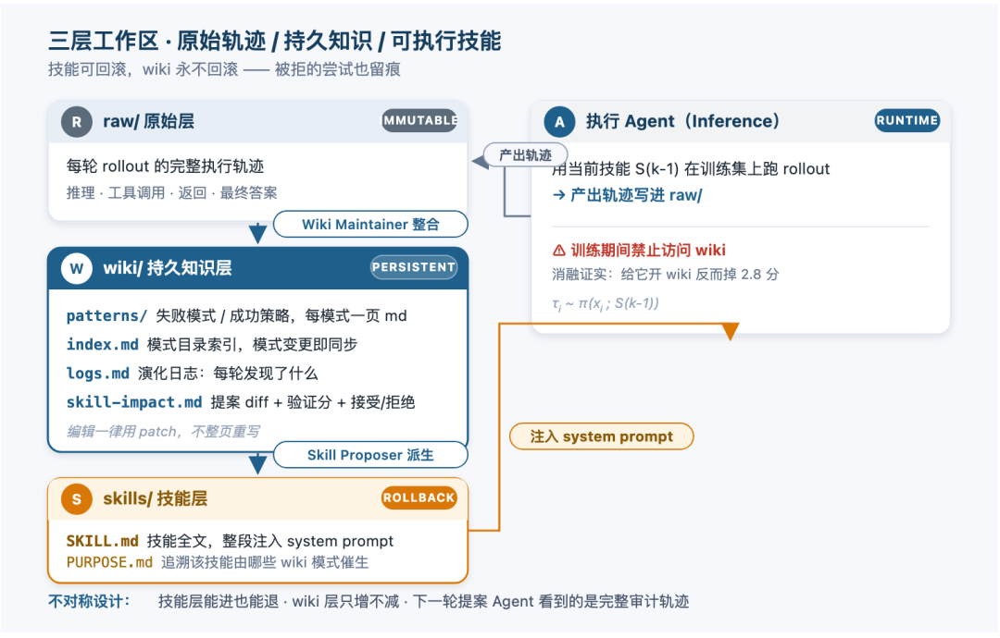
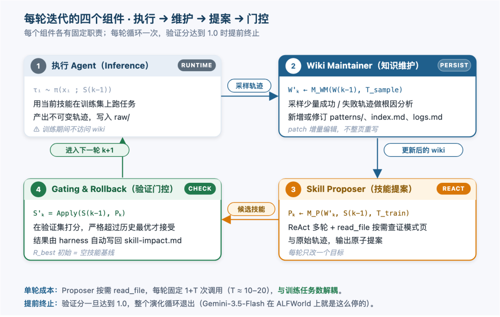
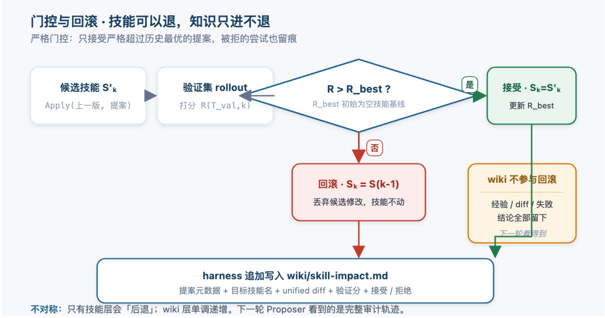
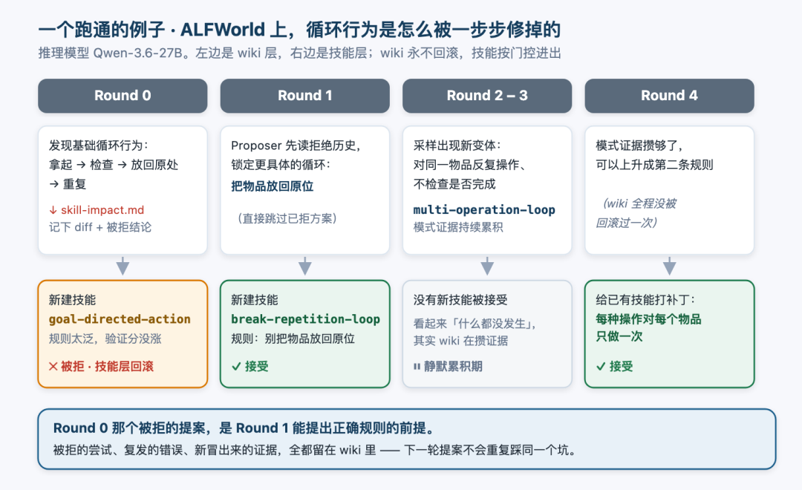
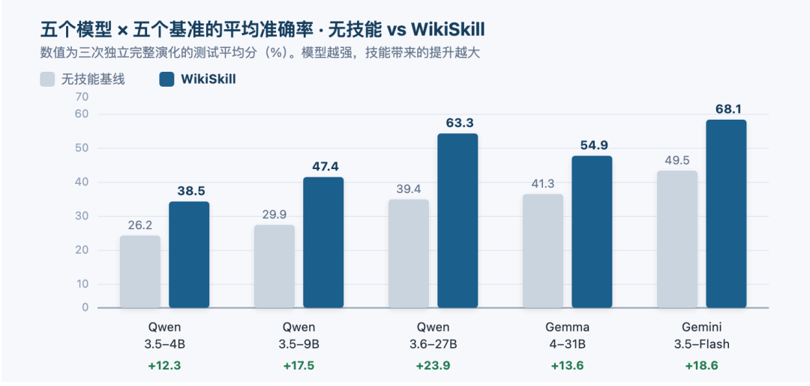
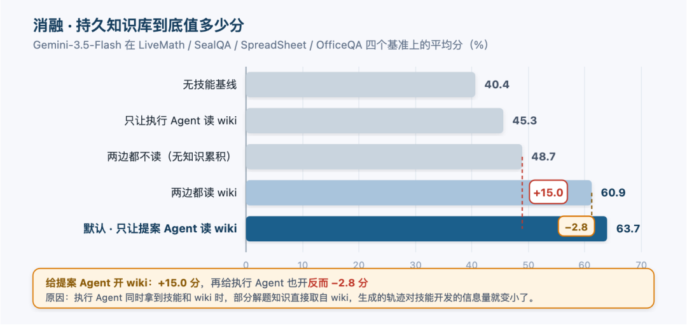

# Google Research 把 Agent 经验写进了一份 Wiki：WikiSkill 拆解

Source: https://mp.weixin.qq.com/s/PREYd2Nxp5gCC0SFbFDHfA

原创

硅基星尘
硅基星尘

硅基星尘

在小说阅读器读本章

去阅读

在公众号小说中沉浸阅读

这一期想聊一篇 arXiv 上的论文：WikiSkill。Google Research 做的，主题是「agent 技能进化」。一句话讲明白👉🏻 他们把 agent 跑任务的经验整理成一份持续累积、永不回滚的 wiki 知识库，让技能每一轮的更新都站到以前学过的内容之上，不再依赖散落在各处的优化记录。

读完论文我最直接的感受是：这件事本来该这么做。论算法复杂它一点都不复杂，就是「知识该积累起来」这么一个朴素的念头，被他们用工程做实了。论文里 9B 小模型带技能反超 27B 大模型无技能、别人炼的技能能比自己炼的更好，都是这个朴素念头的副产品。

下面把背景、问题、架构、原理、数据、复现一路摊开讲。结论先放最前面，省时间👇🏻

> **TL;DR：**
>
> 在 5 个基准 × 5 个模型上，WikiSkill 平均分比 EvoSkill / SkillOpt 这类 SOTA 方法高 3.3–12 分；Qwen-3.5-9B 配 WikiSkill 拿到 47.4%，反超 Qwen-3.6-27B 无技能的 39.4%；消融证实「持久知识库」是主要增益来源（+15.0 分），而把 wiki 同时给执行 agent 看反而掉 2.8 分。

---

## 一、背景：Skill 是什么，为什么大家都在做

先把「skill」这个概念摆在桌上。给 LLM 配的 agent 已经能完成不少真实任务，但有一类能力很难靠训练参数获得：某个领域里「具体怎么做」的操作经验 —— 比如按规则改电子表格、在长文档里找证据、按步骤整理家中物品。这些知识更新快又依赖环境，写进模型权重不划算。

业界的通用做法是把它做成 skill：一个文件夹，里面装说明文档、脚本、适用条件，agent 干活时读它就行。轻量、可审计、可复用，关键是不改模型参数就能积累知识。Claude Code 的 CLAUDE.md、Manus 的工具调用模板、各家框架里的 agent prompt 包，本质都是 skill。

问题出在「怎么写」。手工写技能需要预判 agent 会遇到哪些流程和坑，成本高还不一定写得对。近两年冒出了一批自动技能进化方法，让 agent 在训练任务上跑，分析成功和失败的轨迹，据此修改技能，再迭代。代表工作有 EvoSkill、Trace2Skill、SkillOpt。思路都对，但有一个共同的毛病：每轮把分析结论散落在各自的优化记录里。有的保留历史提案与评估结果，有的从轨迹里提炼教训，有的把被拒修改当反馈。下一轮改技能时，这些记录既没有形成一份独立的、持续演进的知识表示，提案 agent 也没法系统地站到以前学过的内容之上。

WikiSkill 想解决的就是「学到的知识怎么保存、怎么组织」这件事。思路是受 Karpathy 2026 年那个 LLM Wiki 想法的启发：把经验整理成持久、可累积的知识。WikiSkill 在原始经验和可执行技能之间加了一层结构化的知识库，让技能进化每一轮都建立在越来越完整、越来越整合的知识上。

> 可以把它类比成「编辑一个文档」这件事：传统方法是从 git blame 出发改代码（散落的 commit message），WikiSkill 是从一份维护良好的设计文档出发（持久、可引用）。后者显然更靠谱。

---

## 二、问题：经验为什么没被系统地复用

我自己维护过一段时间的 agent skill 库，被这个毛病反复绊倒过 ——

我会在某次失败后给技能加一条「不要这样做」的补丁；下周再遇到类似情况，新加的补丁已经过期了，agent 又把那条错路走一遍；于是我只能再补一版。三五轮下来，技能文件被改得面目全非，注释里堆满了「v3 改：之前那条规则被拒了，改成……」「v5 改：上一条在新基准上掉分了，回滚……」这种考古记录。

本质上，问题出在「技能文件」这个唯一载体上：它既负责承载当前生效的程序性知识，又被迫兼任优化历史。文档越来越长，越来越没人愿意读，再过几轮就没人知道哪条规则还活着、哪条是已经被否掉的。EvoSkill / Trace2Skill / SkillOpt 都在尝试解决「怎么写更好」，但都没解决「怎么把『为什么这样写』积累下来」这一层。

WikiSkill 的诊断很准：skill-evolution 系统把三件不同的事挤在一个 blob 里。一是原始执行轨迹（发生了什么），二是累积的知识（我们学到了什么），三是可执行技能（下次该怎么用）。三件事更新频率不同、存储形态不同、读者不同。硬塞在一起，每一次回滚都会丢掉一些值得留下的东西。

论文里的解法也很直白：把三件事拆开，让 wiki 永远不回滚。被拒的尝试、复发的错误、新冒出来的证据，全部留在知识里；技能层能进也能退。

---

## 三、核心架构：三层工作区

WikiSkill 把 agent 的工作目录拆成三个层，各自承担不同职责：

▲ 三层工作区：原始轨迹 → 持久知识 → 可执行技能

**Raw 层（raw/）**：每轮训练采样得到的完整执行轨迹，包括推理过程、工具调用、工具返回、最终答案。这一层只写不改，保留原始历史。Wiki Maintainer 和 Skill Proposer 可以回读，但 Inference Agent 在训练期间被禁止访问，原因后面消融会说。

**Wiki 层（wiki/）**：把原始轨迹整理成结构化、可累积的知识。目录里这几个东西比较关键 ——

|  |  |
| --- | --- |
| patterns/ | 失败模式 / 成功策略，每模式一页 md，附可操作解法 |
| index.md | 模式目录索引，模式变了就同步更新 |
| logs.md | 演化日志，每轮发现了什么 |
| skill-impact.md | 提案 diff + 验证分 + 接受/拒绝，由外层 harness 程序化写入 |

**Skills 层（skills/）**：当前生效的技能集合。每个技能目录两个文件 —— `SKILL.md` 是技能全文，`PURPOSE.md` 记录这个技能由哪些 wiki 模式催生、经历过什么演化。运行时 SKILL.md 整段注入 system prompt。

关键的不对称是：技能更新可以回滚，wiki 永不回滚。被拒的尝试、失败的结论，留在 wiki 里给下一轮提案看。这是 EvoSkill / Trace2Skill / SkillOpt 都没有的审计轨迹。

---

## 四、每轮迭代：四个组件怎么协作

三层工作区是「数据」长什么样，运作起来还需要四个组件每一轮循环一次：

▲ 一轮迭代 = 执行 → 维护 → 提案 → 门控

**① 执行 Agent（Inference Agent）**：用当前技能 S(k-1) 在训练集上跑任务，`τi ~ π(xi; S(k-1))`，产出不可变轨迹写进 raw/。训练期间禁止访问 wiki —— 这条限制不是随意加的，消融里会解释为什么。

**② Wiki Maintainer（知识维护）**：每轮从训练轨迹里采样一小批成功 / 失败的执行，做根因分析，对照现有 wiki 决定「新增模式 / 修订现有模式 / 只追加日志」。`W'k ← M_WM(W(k-1), T_sample)`。不设 pattern 数量上限，编辑一律走增量 patch，不整页重写。

**③ Skill Proposer（技能提案）**：以 ReAct 多轮方式自主行动。先读 wiki 索引、skill-impact.md 和训练任务结果摘要；再用 `read_file` 按需查具体的 pattern 页和原始轨迹，做完根因诊断后输出一个原子提案：要么新建一个技能，要么对某个现有技能打一次补丁。`Pk ← M_P(W'k, S(k-1), T_train)`。每轮只改一个目标，方便门控判定。

**④ Gating and Rollback（门控与回滚）**：把候选技能在验证集上打分，严格超过历史最优才接受，否则回滚。验证结束后由 harness 把提案元数据、target skill、unified diff、验证分、接受结果追加到 `skill-impact.md`。验证分一旦达到 1.0，整个演化提前终止。

一个不容易被注意到的好处是：Proposer 按需 read\_file、不预采样轨迹，每轮分析开销与训练任务数解耦。EvoSkill / SkillOpt 那些方法要随任务数线性增长，WikiSkill 始终是 1+T 次调用（T 是 ReAct 轮数，实验里大概 10~20）。任务从 10 条涨到 1000 条，每轮 API 调用基本不变。代价是推理成本可能更高（ReAct 多轮），换来的是稳定领先的性能。

---

## 五、门控与回滚：技能可以退，知识只进不退

门控机制是 WikiSkill 整套设计里最像「规矩」的部分。我把它单独画了一张图：

▲ 严格门控：只接受严格超过历史最优的提案，被拒的尝试也留痕

规则是这样的：候选技能在验证集上打分 R(T\_val,k)，对比历史最优 R\_best ——

* R > R\_best → 接受新技能，更新 R\_best
* 否则 → 回滚到 S(k-1)，丢弃候选修改

不管接受还是拒绝，harness 都会把这一轮的信息（diff、验证分、接受/拒绝）写进 skill-impact.md。wiki 层完全不参与回滚 —— 这一步的经验、diff、失败结论，全留下。

论文里明确说，这条「严格优于历史最优」的门控标准是为了和 EvoSkill / SkillOpt 公平对比，是有点保守的。一个中性的提案 —— 不涨分也不掉分，但可能在下一轮解锁新提升 —— 在当前规则下会被拒。论文把这个列为 limitations，留给未来更灵活的接受标准。

> 我自己的判断：这个保守是值得的。一份可解释的「为什么没接受」比一份默默接受了但其实没用的技能，对长期维护更友好。

---

## 六、一个跑通的例子：ALFWorld 上 Round 0 → 4

论文用一个 ALFWorld（交互式家庭任务环境）的例子把整套机制跑了一遍，模型用的是 Qwen-3.6-27B。跑下来从 52.8% 提到 77.6%，+24.8 分。这个过程特别能说明「为什么需要 wiki」：

▲ Round 0–4：被拒的提案，是 Round 1 能提出正确规则的前提

**Round 0**：Maintainer 发现一个基础循环 —— agent 拿起物品、检查、放回原处、重复。Proposer 据此提了一个 `goal-directed-action` 技能，规则太泛，验证分没涨，被拒。

**Round 1**：Proposer 翻 skill-impact.md 看到上一轮的失败结论，把循环锁定到更具体的形态 ——「把物品放回原位」。提出 `break-repetition-loop` 技能，规则只有一条：别把物品放回原位。接受。

**Round 2 – 3**：没有新技能被接受。看起来「什么都没发生」。其实 wiki 在悄悄攒证据 —— 采样里冒出了新变体：对同一物品反复操作而不检查是否完成。multi-operation-loop 模式页的证据越来越厚。

**Round 4**：证据够了，Proposer 给已有技能打补丁，加第二条规则：每种操作对每个物品只做一次。接受。

关键点：Round 0 那个被拒的提案，是 Round 1 能提出正确规则的前提。被拒的尝试、复发的错误、新冒出来的证据，全都在 wiki 里留着。下一轮提案 agent 不会重复踩同一个坑。EvoSkill / SkillOpt 把这些信息扔在各自的优化日志里没人看，WikiSkill 把它沉淀到结构化的模式页和审计文件里。

---

## 七、主结果：5 个模型 × 5 个基准，WikiSkill 全面领先

论文在 5 个基准上做了完整对比：LiveMath（数学竞赛题推理）、SealQA（网络检索问答）、SpreadSheet（表格操作）、OfficeQA（长文档问答）、ALFWorld（交互式家庭任务）。推理模型覆盖 Qwen-3.5-4B / 9B / 27B、Gemma-4-31B、Gemini-3.5-Flash。所有方法都从空技能集出发，技能直接写进 system prompt，报告的是三次独立完整演化的测试平均分，用配对自助法做显著性检验。

▲ 五个模型的 5 基准平均准确率：灰柱 = 无技能基线，蓝柱 = WikiSkill

三个值得展开的要点 ——

**第一，WikiSkill 全面领先。**跟每个模型的最强竞争方法相比，平均分分别高 **3.3、5.1、10.0、5.8、12.0** 个百分点（对应 Qwen-4B / 9B / 27B、Gemma-31B、Gemini-Flash）。个别提升幅度很大：Gemini-Flash 在 LiveMath 上从 33.0% 提到 72.6%，在 SpreadSheet 上从 50.5% 提到 76.6%；Qwen-27B 在 ALFWorld 上从 52.8% 提到 77.6%。对比方法的表现不太稳定：EvoSkill 在 LiveMath 上把 Qwen-9B 从 28.2% 提到 58.1%，同一基准上把 Gemma-31B 从 33.9% 拖到 29.8%；SkillOpt 更狠，把 Gemini-Flash 在 SealQA 上从 29.4% 打到 28.2%。WikiSkill 是既强又稳。

**第二，技能进化与模型规模互补。**模型越大，技能收益越高。Qwen 家族的平均提升从 4B 的 +12.3 涨到 27B 的 +23.9；SpreadSheet 上差距最悬殊，27B 比 4B 多赚约 34 个百分点（+40.9 对 +6.5）。反过来，小模型带技能可以追平规模差距：Qwen-3.5-9B 配 WikiSkill 平均 47.4%，超过 Qwen-3.6-27B 无技能的 39.4%；Qwen-3.5-4B 配技能也有 38.5%。强模型能从技能里榨出更多价值，好技能又能让小模型反超明显更大的模型。这条对工程团队很关键：成本账上，你不需要每换一个大模型就重训技能。

**第三，不同基准的受益程度不同。**LiveMath 上 5 个模型都涨（+20.6 到 +39.6），ALFWorld 上（除提前停的 Gemini-Flash）都涨 14.0 到 29.3。OfficeQA 是例外：长文档检索场景下大模型能跑完技能里的多步检索流程（Qwen-27B +11.6、Gemini-Flash +12.1），Qwen-4B 会在长上下文里丢失多步指令、退回默认阅读行为，反而略降。技能进化的收益，取决于模型有没有能力把技能执行到底。

---

## 八、消融：持久知识库到底值多少分

最有说服力的实验是消融 —— 控制执行 Agent 和提案 Agent 在进化过程中能不能读 wiki。论文在 Gemini-3.5-Flash 上跑了 5 个配置（4 个基准平均）：

▲ 消融：给提案 Agent 开 wiki 涨 15 分，再给执行 Agent 也开反而掉 2.8 分

两个结论 ——

**持久知识库是主要增益来源。**把「两边都不读（无知识累积）」的 48.7% 和「默认：只让提案 Agent 读 wiki」的 63.7% 拿来对比，+15.0 个百分点。分基准看：LiveMath 从 51.3% 涨到 72.6%，SpreadSheet 从 49.9% 涨到 76.6%。没有跨轮累积的知识，提案 Agent 很难解开复杂的失败模式。

**训练时给执行 Agent 开 wiki 反而有害。**从 63.7% 降到 60.9%，LiveMath 从 72.6% 掉到 64.8%。论文的解释是：执行 Agent 同时拿到技能和 wiki 时，部分解题知识直接取自 wiki，生成的轨迹对技能开发的信息量就变小了。wiki 是给提案 Agent 看的，不该让执行 Agent 抄答案。所以默认配置里，wiki 只对 Proposer 开放。

这条消融单独拿出来说是因为它违反直觉 —— 看着 wiki 里那么多有用的知识，不让模型看好像很浪费。但 WikiSkill 的判断是：执行 Agent 的任务是「干净地产生训练数据」，wiki 的任务是「让提案 Agent 学到规律」，两个角色不能合并。

---

## 九、跨模型迁移：别人炼的技能，可能比自己炼的更好

更有意思的是迁移实验：拿一个源模型进化出来的技能，注入另一个推理模型跑同一套基准。结果里有几条反常识的：

**迁移经常有效，甚至反超自炼。**Qwen-27B 炼的技能把 Qwen-9B 在 SpreadSheet 上带到 50.5%，而无技能只有 24.3%、自炼只有 33.6%；同样的技能把 Gemma-31B 在 LiveMath 上带到 73.7%（无技能 33.9%、自炼 56.7%）。ALFWorld 上 Qwen-9B 用 Qwen-27B 的技能拿到 70.2%，比自己炼的 63.4% 高。小模型往大模型迁移也行：Qwen-4B 的技能把 Gemma-31B 在 LiveMath 上提到 73.1%、ALFWorld 提到 66.9%。

**负迁移真实存在。**Qwen-4B 的技能把 Gemini-Flash 在 SpreadSheet 上从 50.5% 打到 18.1%。错误分析给出两个原因：一是 4B 技能编码的是底层绕行技巧（单行 Python 命令、字符串转换规则），这些技巧帮小模型避开执行失败，却束缚了强模型写完整的端到端脚本；二是碎片化的诊断流程带来冗余工具调用，会在任务完成前用光 Gemini-Flash 可用的工具调用次数。同一个基准上，Qwen-27B 的技能却把 Gemini-Flash 提到 63.4%。

还有一个耐人寻味的例子：OfficeQA 上 Qwen-4B 的技能降低了自己的成绩（30.2% → 28.5%），却把 Qwen-27B 从 42.1% 提到 52.9%。原因还是上一节那条 —— 小模型在长上下文里执行不了技能描述的多步检索，大模型能。

把这些观察合在一起，论文给出一个有用的区分：技能发现（从经验里提炼可用的程序性知识）和技能执行（推理时把知识用出来）是两种能力。自己炼技能的方法通常把它们混为一谈，跨模型实验把它们分开了。迁移好不好，取决于技能捕获的是通用流程还是模型特定的绕行技巧 —— 后者是负迁移的主要来源。

对工程团队的含义：你可能不需要为每个部署的模型单独跑一套技能进化循环。一份由「最强的炼药师」维护的 wiki + 一份共享的 skill 包，可以分发给不同尺寸的模型使用，负迁移的极端情况注意避开就行。

---

## 十、成本与规模：分析开销不随任务数增长

工程上最关心的就是开销。论文专门比较了各方法每轮的 API 调用次数：

| 方法 | 每轮分析调用 | 与训练任务数关系 |
| --- | --- | --- |
| Trace2Skill | 逐条分析全部轨迹 | 线性增长 |
| EvoSkill | 每条提案独立优化 | 线性增长 |
| SkillOpt | 逐 epoch 元指令生成 | 线性增长 |
| WikiSkill | 1 + T 次（ReAct 按需 read\_file） | 与任务数解耦 |

训练任务从 10 条涨到 1000 条，WikiSkill 每轮分析次数基本不变；其他方法都跟任务数线性增长。代价是 WikiSkill 的推理成本可能更高（ReAct 多轮 + ReAct 自检），换来的是一致领先的性能和可预测的成本结构。

另一个值得提的细节：各模型最后生成的技能规模差异明显。Qwen 系列产出较长的技能（118.9 到 128.6 行 markdown），Gemma-31B 只有 45.1 行，Gemini-Flash 在 ALFWorld 上提前终止（验证集 100%）所以没产出新技能。技能长度不是越短越好，但 Gemma-31B 在 SpreadSheet 拿了 68.0% 的高分这件事说明：代码能短就短，价值看的是 wiki 里的整合质量。

---

## 十一、局限：诚实列出来

论文自己列了四条 limitations，挑重点说 ——

**1. 没评估 skill 检索 / 触发。**为了隔离变量，研究里把活跃技能整段塞进 system prompt，没走检索触发那套。这条设计在技能数量少时没问题，一旦技能数到几十上百，token 成本和检索准确率会变出新瓶颈，本论文没回答。

**2. 严格门控过严。**「严格超过历史最优」才接受，会拒掉那些短期中性、但能解锁下一轮突破的中性提案。作者明确说这是为了和 Yang et al.、Alzubi et al. 的基线公平对比。更灵活的接受标准（如相对历史均值的提升、或基于多步 rollout 的稳定性）是留白。

**3. wiki 缺乏自动剪枝。**wiki 跨轮只增不减，长期运行后模式页会越来越厚。当前没有自动机制判断「这条 pattern 已经被新证据反驳、可以归档」或「这条 pattern 长期不被引用、可以合并」。对长周期技能库是隐忧，尤其当 wiki 超过 LLM 上下文窗口时。

**4. 没覆盖超长周期任务。**论文的 benchmark 包括长文档检索（OfficeQA）和多步工具交互（ALFWorld），但都不涉及「一次 rollout 跨几百步动作、几小时时间跨度」这种超长周期任务。在线技能自适应（single rollout 内动态细化程序知识）也还是未来方向。

我个人还想加一条：负迁移的边界条件还没量化。哪些类型的技能容易负迁移、源模型和目标模型的什么指标差到一定程度会触发负迁移，这些论文没系统回答。对想做「一份 skill 服务多个模型」的工程团队来说，这条信息蛮关键的。

---

## 十二、应用场景：什么时候该上 WikiSkill 思路

不是所有 agent 都需要 skill 进化。我把它抽象成「三个条件全满足」时，WikiSkill 思路的收益最大：

* **任务有清晰的成功 / 失败信号。**

  技能进化靠 rollout 打分，没法自动判对错的任务（开放对话、创意生成）不适合本思路
* **有 50 条以上带标签的训练任务。**

  太少样本下模式页证据不足，提案 Agent 容易跑偏
* **有可重复执行的执行环境（工具 + 验证集）。**

  能跑 rollout、能跑验证集打分，是整套系统能转起来的前提

满足这三点的典型场景：

* **企业内 RPA / 流程自动化**

  （财务对账、工单分发、合规检查），有清晰的「通过 / 不通过」出口
* **代码任务 pipeline**

  （批量改 schema、写单元测试、生成 SQL 模板），能跑测试用例给反馈
* **垂直领域问答 / 检索 agent**

  （法律、医学文档问答），有标注集 + 答案可自动校验
* **多模型部署的 agent harness**

  ，一个 wiki + 一份 skill 集服务多尺寸模型（参考 §9 迁移实验）

不太适合：单次问答、创意写作、开放式闲聊、缺验证信号的探索型任务。

---

## 结语

WikiSkill 这篇论文让我最满意的是：没有什么花哨的算法，就是把「经验该积累起来」这个朴素念头用工程做实了。论文里 9B 配 skill 反超 27B 无技能、别人炼的技能比自己炼的好、消融里「只让 Proposer 读 wiki」是关键选择 —— 这些结论都不需要复杂理论支持，但每一个都对得起一次工程实测。

对工程团队的实际建议有三条：

1. 如果你的 agent 跑的是「有清晰成功/失败信号 + 有训练集 + 有验证集」的任务，先别急着搞大模型微调，先按 WikiSkill 思路搭一个能跑几轮的 skill 进化循环，成本小、效果稳定
2. 把 wiki 当作一等公民维护：patterns/ 目录、index.md、logs.md、skill\_impact.md 四件套，跨轮只增不减，必要时用 diff 风格编辑
3. 为多个部署模型维护一份共享技能 + 一份共享 wiki，迁移带来的正收益比负迁移多得多，跨模型实验里几个强证据都支持这点

论文链接：https://arxiv.org/abs/2608.27454（Google Research + Virginia Tech）

预览时标签不可点

微信扫一扫  
关注该公众号

知道了

微信扫一扫  
使用小程序

取消
允许

取消
允许

取消
允许

×
分析

微信扫一扫可打开此内容，  
使用完整服务

：
，
，
，
，
，
，
，
，
，
，
，
，
。
 
视频
小程序
赞
，轻点两下取消赞
在看
，轻点两下取消在看
分享
留言
收藏
听过