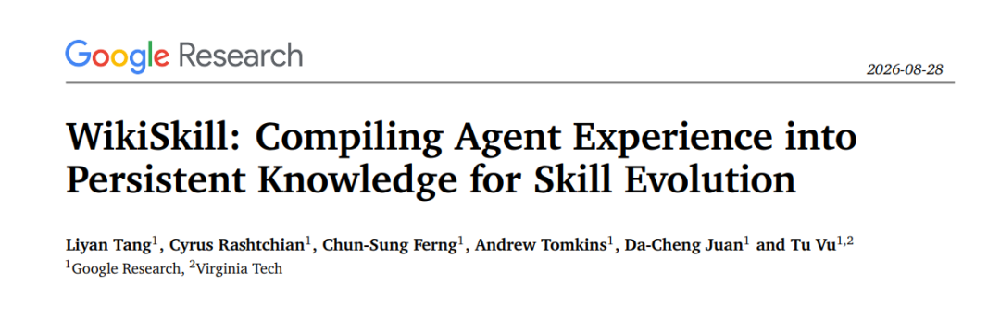
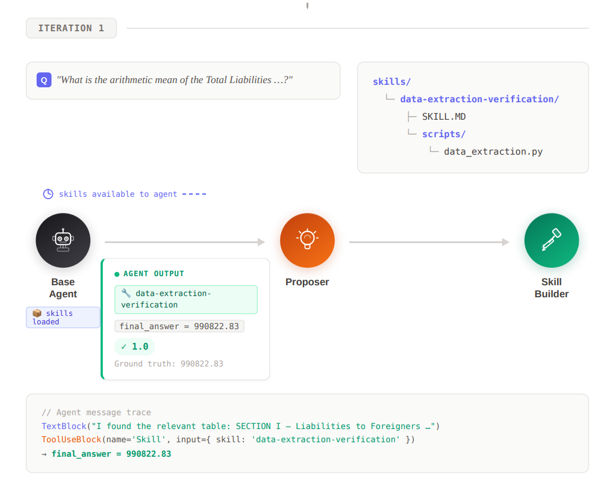
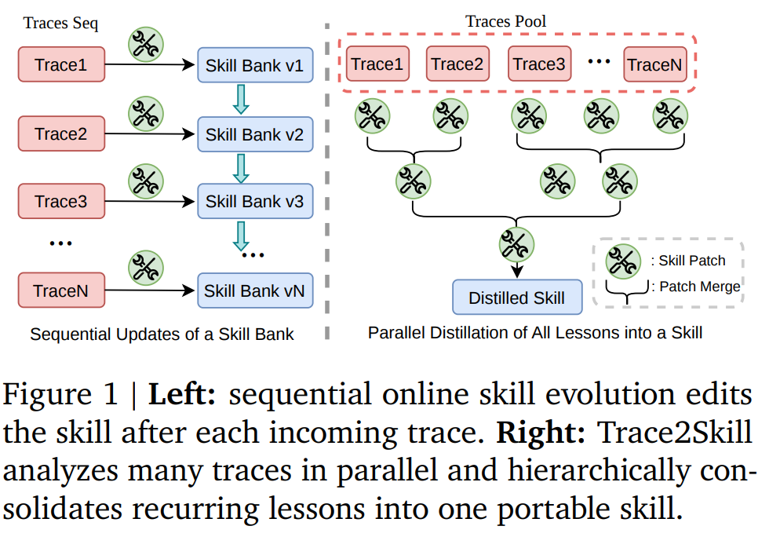
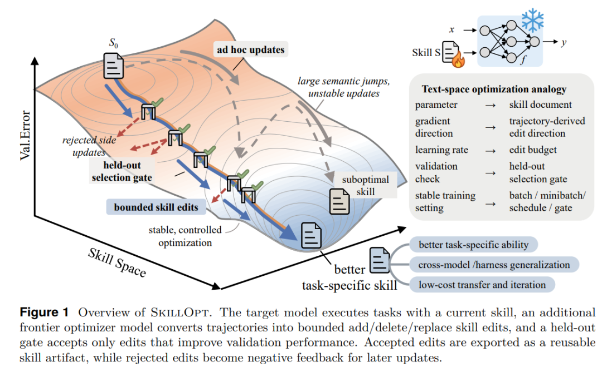
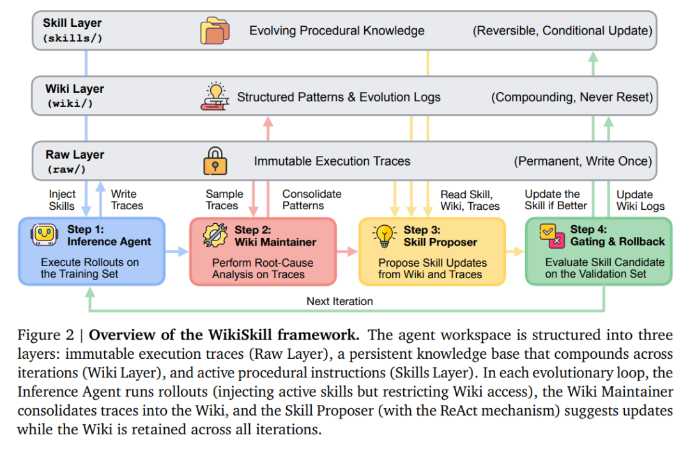
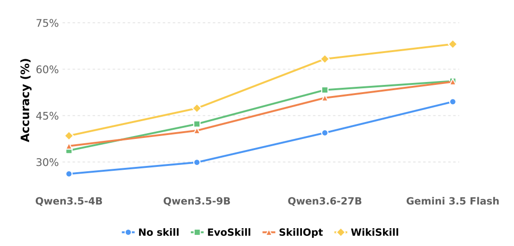
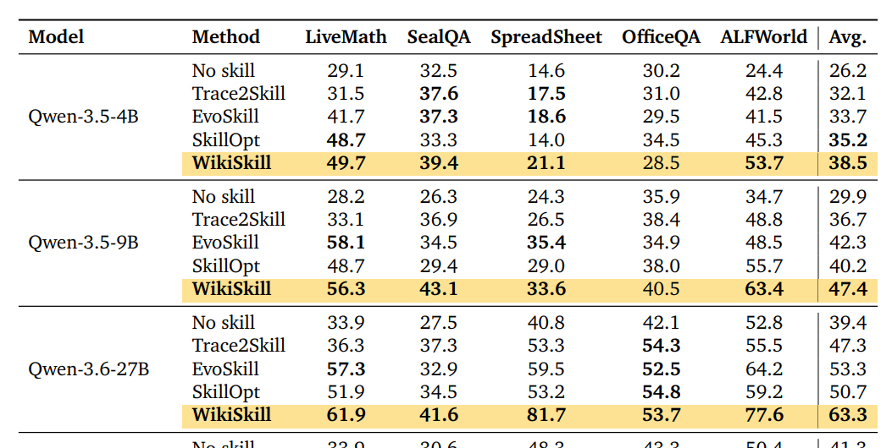

# Google WikiSkill：把 Agent 的“经验”真正变成可持续积累的能力

Source: https://mp.weixin.qq.com/s/VH4x9MW3UeSYRzHTHVwkIw

Coggle数据科学

在小说阅读器读本章

去阅读

在公众号小说中沉浸阅读

过去一年，Agent 系统的一个明显变化，是研究重点正在从“如何让模型在一次任务中推理得更好”，转向“如何让 Agent 在完成大量任务之后，真正留下点什么”。

于是，**Agent Skill** 开始成为一种重要的参数之外能力载体：把领域知识、操作流程、工具使用方式、脚本和失败规避策略组织成可复用的文件，让冻结参数的模型也能够获得新的程序性能力。WikiSkill 正是在这一背景下出现的，它试图进一步回答一个比“自动生成 Skill”更深的问题：**如果 Agent 已经运行了几百、几千条 trajectory，那么这些经验究竟应该以什么形式长期存在？**

2026 年 8 月，Google Research 与 Virginia Tech 的 Liyan Tang、Cyrus Rashtchian、Chun-Sung Ferng、Andrew Tomkins、Da-Cheng Juan 和 Tu Vu 提出了 **WikiSkill: Compiling Agent Experience into Persistent Knowledge for Skill Evolution**。

这篇工作的关键并不是简单地在 Skill 外面再套一个 Wiki，而是重新定义了 Agent 自我进化过程中应该维护的“状态”：Agent 不应该只有当前的 Skill，也不应该只保留一堆 execution traces 或 optimizer history，而应该同时拥有**不可变的原始经验、持续演化的知识状态，以及面向执行的技能状态**。换句话说，WikiSkill 真正提出的是一种 Agent Experience Compiler：将 trajectory 从一次性的运行日志，编译成可以跨迭代累积、修正、引用并最终重新生成 Skill 的长期知识。

### 为什么 Agent 开始需要 Skill？

传统的大模型应用主要有两种增强模型能力的路径。一种是改变模型内部参数，例如 supervised fine-tuning、RL 或持续训练；另一种是保持模型参数不变，通过 Prompt、RAG、Tools 和 Agent Harness 改变模型运行时能够看到和使用的信息。

Skill 可以看作第二条路线进一步模块化之后的结果：它通常不是一句 prompt，而是一个 filesystem-based module，可以包含 `SKILL.md`、元数据、适用条件、参考资料，以及 Python、Shell 等辅助脚本。WikiSkill 所采用的定义也是如此：Skill 本质上是对**领域程序性知识（procedural knowledge）**的封装，而不是简单的事实数据库。

Skill 的真正意义并不是给模型增加更多“知识文本”，而是在模型和环境之间增加一层**外部程序性能力（external procedural state）**。模型参数被冻结，但是 Agent 能做什么，却可以随着 Skill repository 的变化持续改变。

一个 Skill 文件天然追求的是**短、直接、可执行**。它需要告诉 Agent “什么时候触发、应该怎么做、遇到某种错误怎么处理”，却并不适合完整保存“为什么形成这个规则”“这个规则在哪些 trajectory 中被验证”“哪些相似方案以前失败过”“这个策略在 Qwen 上有效还是 Gemini 上有效”等演化历史。

# Skill 的是经验去了哪里？

EvoSkill、Trace2Skill 和 SkillOpt 实际上已经解决了 Skill Evolution 的第一阶段问题：**如何从 execution experience 中自动获得比人工 Skill 更好的程序性知识。**

EvoSkill 建立了 Executor、Proposer 和 Skill Builder 三个 Agent。Executor 执行任务，Proposer 根据失败 trajectory 和 ground truth 做 root-cause analysis，Skill Builder 再把高层建议物化成新的 Skill 文件或脚本。

Trace2Skill 则从另一个方向解决问题。它认为逐条 trajectory 顺序修改 Skill 容易产生 order dependence：第 20 条 trajectory 看到的 Skill 已经被前 19 条修改过，于是后面的知识抽取受到此前修改顺序影响。Trace2Skill 因此先对大量 trajectory 并行提取 trajectory-local lessons，再通过层级式归纳将大量局部经验合并为紧凑的 Standard Operating Procedures。

SkillOpt 又进一步把整个过程变成类似深度学习 optimizer 的受控优化。它不允许模型随意 rewrite 整个 Skill，而是把 append、insert、replace、delete 看成离散的 text-space update，引入 textual learning rate 来限制每一步允许修改多少内容；同时设置 held-out validation gate，只有新 Skill 在验证集上严格优于旧版本才接受。

但是，从 WikiSkill 的视角看，这三个方法仍然共享一个问题：**学习到的知识最终主要服务于 Skill 更新，而没有成为独立于 Skill 的一等状态。**

EvoSkill 有 history，但 history 更接近 optimization log；Trace2Skill 有 trajectory lessons，但最终目标是把这些 lesson 压缩进 Skill；SkillOpt 有 rejected buffer 和 meta guidance，但它们主要属于 optimizer state。换句话说，这些方法都有某种形式的“记忆”，却没有明确建立一个独立的、结构化的、可以持续修订和积累的 **knowledge representation**。

### Skill 和 Wiki 到底有什么不同？

**Skill 面向执行，Wiki 面向学习。**

Skill 的目标是让 Inference Agent 在真正面对任务时尽可能高效地采取正确动作，因此它天然偏向 concise、actionable 和 procedural。例如“如果搜索结果不充分，不要立即回答；修改 query 并继续检索”“读取 Spreadsheet 时先确认 sheet name，再执行 range extraction”“完成 take → operate → move 后不要再次对同一 item 重复操作”。这些规则最好能够直接改变 action policy，而不是展开几十页解释。

Wiki 则不同。Wiki 保存的是产生这些规则之前的知识状态，例如哪些失败模式已经连续出现三轮、在哪些 training examples 中出现、某个 workaround 曾经有效但在 validation 中失败、某条 Skill 修改为什么被拒绝，以及后来出现了什么新证据。

WikiSkill 因而实际上对 Agent Memory 做了一次非常有意义的**职责分离（separation of concerns）**：Raw Layer 保存“发生了什么”，Wiki Layer 保存“我们目前认为这些经验意味着什么”，Skill Layer 保存“下一次应该怎么做”。

### WikiSkill：把 Agent Skill Evolution 变成三层知识编译系统

WikiSkill 将第 (k) 次迭代的系统状态写成 ((S\_k,W\_k))。其中 (S\_k) 是当前可执行 Skill 集合，(W\_k) 则是持久化 Wiki。这里真正重要的是：**Skill 与 Wiki 有不同的更新规则。**

假设 Agent 在第 1 轮发现一个 failure pattern，于是提出 Skill A。Skill A 在 validation 上失败，因此按照传统 evolutionary search，这个 candidate 通常就成为一个 rejected mutation，最多在 optimizer history 中留下一条记录。但 WikiSkill 会把“failure pattern 是什么”“为什么提出 A”“A 的 diff 是什么”“A 被 validation 拒绝”全部继续保存在 Wiki 中。下一轮 Skill Proposer 可以进一步得出：**问题诊断可能是对的，只是解决方案 A 不对。**

### 为什么不能直接把 Wiki 给 Agent 用？

WikiSkill 有一个乍看非常反直觉的设计：**训练 trajectory 中，Inference Agent 只能看到 Skill，不能看 Wiki。**

Wiki 只提供给 Wiki Maintainer 和 Skill Proposer。

如果 Wiki 里已经积累了大量高质量知识，为什么不让执行任务的 Agent 也直接读取它？

论文的消融实验给出了非常有意思的答案。以 Gemini-3.5-Flash 为例，当 Inference Agent 看不到 Wiki、但 Skill Proposer 可以访问 persistent Wiki 时，四个 benchmark 的平均结果从没有 persistent Wiki 时的 48.7% 上升到了 63.7%，提升达到 15 个百分点，其中 LiveMath 从 51.3% 上升到 72.6%，SpreadsheetBench 从 49.9% 上升到 76.6%。但是当 Inference Agent 在 rollout 阶段也能访问 Wiki 时，平均性能反而从 63.7% 降到了 60.9%，LiveMath 更从 72.6% 降到 64.8%。([arXiv][2])

> **Wiki 应该帮助产生能力，而不是替代能力。**

从机器学习角度看，可以把 Wiki 理解成一种 teacher-side state，把 Skill 理解成需要真正部署到 student agent 上的 artifact。如果训练阶段允许 student 直接读取 teacher 的全部知识，最终得到的 Skill 就未必真正吸收了这些知识。

因此 WikiSkill 不是简单的：

而更接近：

### 对比 WikiSkill 和 LLM Wiki

WikiSkill 明确受到 Andrej Karpathy 2026 年 LLM Wiki 思路的启发。LLM Wiki 对传统 RAG 的批评可以概括为：如果系统每次回答问题都从 raw documents 检索 chunks，再重新理解和综合，那么大量 synthesis 工作实际上被不断重复。更合理的方法是让 LLM 把 source material 持续编译进一个结构化、相互链接、可以不断更新的 Wiki，使已经完成的理解成为 persistent artifact，而不是下一次查询时从零开始。

WikiSkill 把同样的思想从“知识问答”迁移到了“Agent 学习”。

Karpathy LLM Wiki 大致是：

WikiSkill 则变成：

所以这里的 Wiki 不再只是知识消费层，而成为**能力生成层**。

这意味着 WikiSkill 实际上给 LLM Wiki 增加了一个非常重要的闭环：Wiki 中的知识不是只等待未来被查询，而是被编译成程序性能力，能力进入环境运行之后又产生新的 trajectory，新 trajectory 再反过来修正 Wiki。

### 对比不同的四条路线

| 方法 | 核心学习单元 | 长期状态 | Skill 更新思想 | 最突出的能力 |
| --- | --- | --- | --- | --- |
| EvoSkill | failure + proposal | cumulative feedback history | evolutionary mutation + Pareto selection | 自动发现新 Skill |
| Trace2Skill | trajectory-local lesson | 聚合中的 trajectory evidence | parallel induction + hierarchical consolidation | 把大量经验蒸馏成 transferable SoP |
| SkillOpt | scored rollout + edit | rejected buffer + slow/meta optimizer state | bounded text optimization + validation gate | 稳定、可控地训练 Skill |
| WikiSkill | experience pattern | persistent structured Wiki | knowledge accumulation + proposal + gating | 跨 iteration 复用“已经学到的知识” |

WikiSkill 在五个 benchmark、五种模型上的实验确实很强。论文覆盖 LiveMathematicianBench、SealQA、SpreadsheetBench、OfficeQA 和 ALFWorld，同时测试 Qwen-3.5-4B、Qwen-3.5-9B、Qwen-3.6-27B、Gemma-4-31B 和 Gemini-3.5-Flash。

WikiSkill也远没有解决 Agent long-term learning 的全部问题。就是 Wiki 自身会不断增长。论文当前允许 pattern pages 持续积累，却没有自动 pruning 机制。作者自己也指出，随着 evolution horizon 拉长，Wiki pruning 将不可避免。

从这个角度看，未来 Agent 系统的核心资产可能不再只是 foundation model，也不只是越来越大的 vector database，而会是一套持续增长的、具有 provenance 的 **Experience → Knowledge → Skill compilation pipeline**。

# *学习大模型 & 讨论Kaggle*#

△长按添加竞赛小助手

每天大模型、算法竞赛、干货资讯

与 36000+来自竞赛爱好者一起交流~

预览时标签不可点

微信扫一扫  
关注该公众号

知道了

微信扫一扫  
使用小程序

取消
允许

取消
允许

取消
允许

×
分析

微信扫一扫可打开此内容，  
使用完整服务

：
，
，
，
，
，
，
，
，
，
，
，
，
。
 
视频
小程序
赞
，轻点两下取消赞
在看
，轻点两下取消在看
分享
留言
收藏
听过