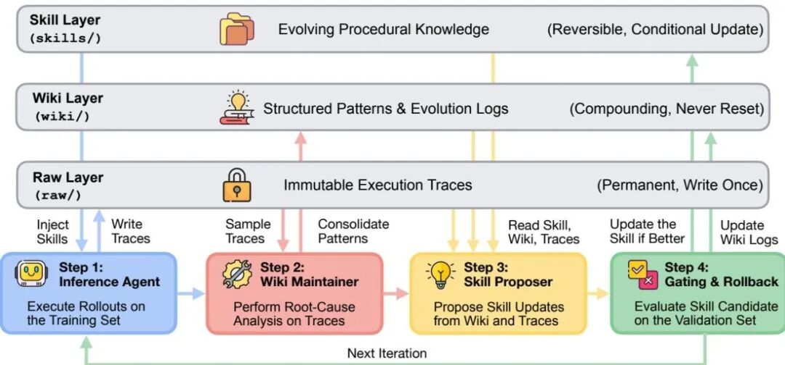
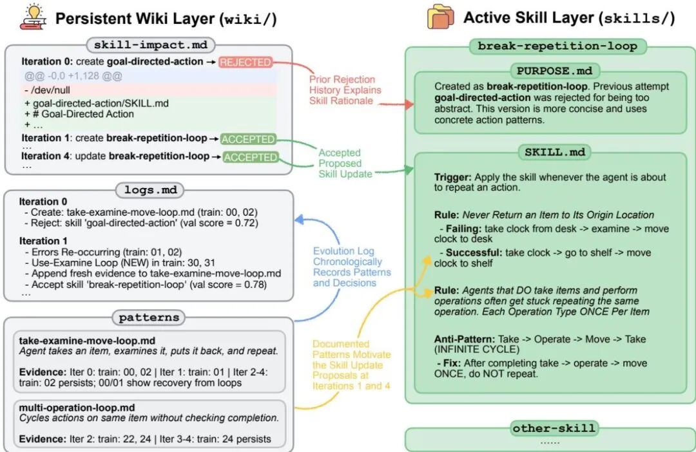
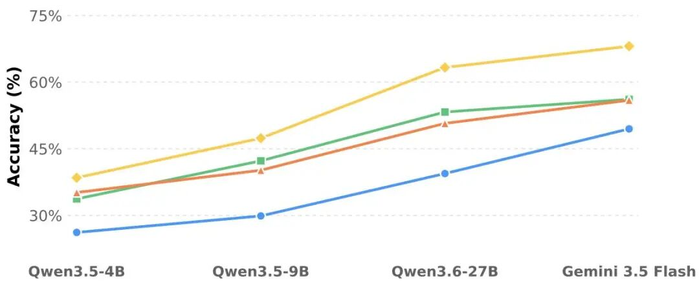

# Google最新自进化论文！WikiSkill的非对称知识设计

Source: https://mp.weixin.qq.com/s/YHj_SvqWeX64gRCy-dlCRw

原创

杨沐白
杨沐白

沐白AI笔记

在小说阅读器读本章

去阅读

在公众号小说中沉浸阅读

# 

> 论文：WikiSkill: Compiling Agent Experience into Persistent Knowledge for Skill Evolution
> 时间：2026 年 8 月
> 一句话：把 Agent 的执行经验编译成只增不减的 Wiki，再让技能站在 Wiki 上进化——Qwen-3.5-9B + WikiSkill 平均准确率 47.4%，反超无技能的 Qwen-3.6-27B（39.4%），三倍参数差被一份技能抹平。

---

这是一篇很好的论文，我会一步一步地分享给大家，然后让大家知道这篇论文在实战中能够怎么应用。

Google Research 这周放出来的 WikiSkill，给 Qwen-3.5-9B 喂上它自动进化出来的技能，平均准确率 47.4%。同一家厂的 Qwen-3.6-27B，什么技能都没有，准确率 39.4%。9B 把 27B 拍在沙滩上，靠的不是参数、不是 RL、不是更大上下文——是一份会自动长大的错题本。

我在算法岗做过的 Agent 项目里，我遇到很多「这个 Agent 跑了 200 个失败 case，学到的教训全藏在 200 条轨迹日志里，下一个版本脚本一翻还是从零开始」。WikiSkill 这篇论文，等于把我自己 harness 里手动攒的那套东西正式化了。所以我想写一篇，把它的核心思路拆给你看，特别是那个让我拍桌子的非对称设计。

## 以往Agent 进化方法的局限性

这半年大家都在卷「技能自动进化」，也就是让 Agent 自己改自己的 SKILL.md，改完了打分，分高就留，分低就回滚。EvoSkill、SkillOpt、Trace2Skill 都是这个套路。跑起来效果是不错，但有一个共同的暗伤：经验没有独立的存储层。

具体说就是三种痛点。第一种是优化历史和可复用知识混成一坨——EvoSkill 维护的是「提案历史清单」，Trace2Skill 把教训蒸馏成补丁塞回技能文档。它们记录了「发生过什么」，但没把「为什么失败、哪种模式反复出现、哪些提案被拒过」抽成独立的、可检索的结构化资产。下一轮提案者面对的还是一堆原始轨迹，不是一本整理好的错题本。第二种是回滚把教训一起回滚了——所有进化方法都有验证集门控，分低就回滚。但「这个提案为什么不行」如果只附着在技能 diff 上，很快就被后续迭代淹没，结果是提案者反复提同类失败方案，进化在低水平循环。第三种是发现技能和执行技能被绑死在同一个模型上——直觉上，从经验里归纳通用程序性知识（悟套路）和严格按说明书执行（干苦力），对模型能力要求完全不同，但当前自进化方法默认是一个模型既当研究员又当操作工，没法各司其职。

三个痛点指向同一个缺口：技能进化缺一个独立的、只增不减的记忆层。WikiSkill 补上的就是这一层。

## 论文核心：三层各管各的，最妙在「不对称」

WikiSkill 把 Agent 工作区切成三层，每层生命周期完全不同。

| 层级 | 放什么 | 谁能改 |
| --- | --- | --- |
| Raw Layer（raw/） | 训练任务 rollout 出的完整轨迹 | 只追加，不可改 |
| Wiki Layer（wiki/） | 从轨迹提炼出的 pattern 页、进化日志、技能影响台账 | 持续累积，永不回滚 |
| Skills Layer（skills/） | 当前生效的技能，每个含 SKILL.md 和反向链接的 PURPOSE.md | 验证打分决定接受或回滚 |

论文 Figure 2 把这套结构画得挺直观——一眼就能看出三层各管各的命：

> 三层生命周期拆开：Raw 只追加、Wiki 永累积、Skills 可回滚；被拒的提案 diff 被程序化留底，不擦。

整个循环跑四个角色：Inference Agent 带技能跑训练且被禁止访问 Wiki（否则它会跑去抄答案，给提案者提供失真信号）、Wiki Maintainer 把轨迹固化进 Wiki、Skill Proposer 用 ReAct 方式按需取证提案、外层门控在验证集上决定接受还是回滚。

最妙那笔我先单独拎出来：**技能可以回滚，Wiki 永不回滚**。提案被拒时，技能回到上一版，但提案的 diff、验证分数、拒绝结论会被 harness 程序化写进 skill-impact.md，失败 pattern 的证据也留在 Wiki 里。技能是易错的假设，错了就扔；知识是沉淀的资产，错了的尝试也是资产——它保证同一个坑不会被重复提案。

论文里有个具体例子我读到会心一笑。Qwen-3.6-27B 在 ALFWorld（具身家务任务）上的进化第 0 轮，Wiki 记录了「拿取→检查→移动」死循环模式，提案者拿出一个过于抽象的 goal-directed-action 技能，验证集拒绝。换以前，教训随回滚一笔勾销。这一轮提案者读到那份审计记录，反过来提「永远不要把物品放回原处」的 break-repetition-loop 规则，第 1 轮就被接受。第 1 轮能提对规则，正因为第 0 轮的失败没被回滚掉。论文 Figure 3 把这条迭代轨迹完整画了出来：

> ALFWorld 进化轨迹：第 0 轮被拒的死循环模式没被回滚吞掉，第 1 轮提案者直接翻 Wiki 提对了 break-repetition-loop 这条规则。

这其实就是把软件工程玩了四十年的那套——代码可以 revert，事故报告永远留着——搬进 Agent 进化。Google 这一刀只是把两个生命周期拆开，效果就有 +15 个点。

## 技能可以跨模型迁移

主结果先列出来感受一下。

| 组合 | 平均准确率 |
| --- | --- |
| Qwen-3.5-4B（无技能） | ~25% |
| Qwen-3.5-9B（无技能） | ~30% |
| Qwen-3.6-27B（无技能） | 39.4% |
| Qwen-3.5-9B + WikiSkill | 47.4% |

论文 Figure 1 是这个主结果的原始柱状图，换成图看一眼到底有多夸张：

> 五模型 × 五基准，WikiSkill 在每一根柱子上都是最高那根——模型越强，领先幅度越大。

9B 加技能，反超 27B 无技能。Gemini-3.5-Flash 加 WikiSkill 在 LiveMath 上从 33.0% 涨到 72.6%，在 SpreadSheet 上从 50.5% 涨到 76.6%，单项增益比一些新模型的版本号还狠。

论文把 Qwen-3.6-27B 进化出的技能给 Qwen-3.5-9B 用，ALFWorld 拿到 70.2%，**比 9B 自进化的 63.4% 还高 7 个点**。27B 的 SpreadSheet 技能把 9B 从 24.3% 拉到 50.5%。甚至小模型也能帮大模型：Qwen-3.5-4B 的技能把 Gemma-4-31B 的 LiveMath 推到 73.1%，高于它自进化的 56.7%。

这证明了一件事：发现技能和执行技能是两种独立能力，自进化把两者绑死在同一个模型上是种浪费。它直接指向一种新的生产关系：用强模型当技能研究员，把进化好的技能蒸馏给便宜的小模型去批量执行。进化阶段的 token 消耗是一次性的，执行阶段是每天烧的——这本账，工业界太好算了。

但迁移也有明确边界。Qwen-3.5-4B 进化出的 SpreadSheet 技能，把 Gemini-3.5-Flash 从 50.5% 坑到 18.1%。错误分析发现，小模型的技能里塞满了「单行 Python 命令」「字符串转换规则」之类帮它自身避开执行报错的低级补丁，这些补丁反而捆住了强模型写端到端脚本的手脚。

也就是说，技能里夹带的 workaround 就是债务。技能审核时应该专门问一句：这条规则是通用程序，还是某个模型的拐杖？

## 实际如何落地

WikiSkill 不是银弹，论文 Limitations 和我的判断叠在一起是这样的。技能是全文注入 prompt 的，没做技能检索，真实系统里技能库涨到上百个，检索和触发失效会成为新瓶颈，Wiki 层怎么和技能路由配合还是开放问题。Wiki 目前只增不减，pattern 页、日志、diff 无限累积，长跑之后知识层本身会变成需要治理的资产，论文没给自动剪枝机制。Wiki 也不是万能，schema 设计错就翻车——和 SKILL.state 那篇对照着看，同 token 预算下小模型掉链子不在推理能力，在结构化输出的遵守度，Wiki 的 pattern 页写得稀烂，强模型也救不回来。

如果让我现在就把它接到自己的 harness 上，我会先做三件事。第一件是起一个 wiki/ 目录，把现有失败轨迹分类抽出 pattern，每条配反向链接到原始任务 ID，先人工填几个，后面再让 LLM 维护。第二件是把 skill 改造的 diff 自动落进 skill-impact.md，被验证拒掉的提案连同拒绝原因一起留底，不再擦掉。第三件是技能分类打标，标 work-around-heavy 的先关在强模型的库房里，不放进 weak-model-only 技能池。

## 结尾

一个非对称的存储哲学——技能可以错，知识不行。一个新生产关系的可能性——贵的脑子想套路，便宜的模型跑日常。

这两件事都不需要 270 亿参数，需要的是把十几年前 GitHub 教会我们的流程治理，现在老老实实搬到 Agent 工作区了。

如需沟通，欢迎进一步交流～

预览时标签不可点

微信扫一扫  
关注该公众号

知道了

微信扫一扫  
使用小程序

取消
允许

取消
允许

取消
允许

×
分析

微信扫一扫可打开此内容，  
使用完整服务

：
，
，
，
，
，
，
，
，
，
，
，
，
。
 
视频
小程序
赞
，轻点两下取消赞
在看
，轻点两下取消在看
分享
留言
收藏
听过