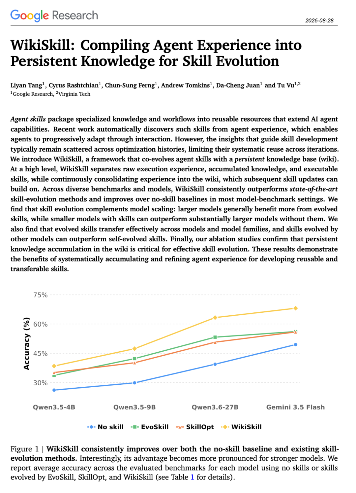
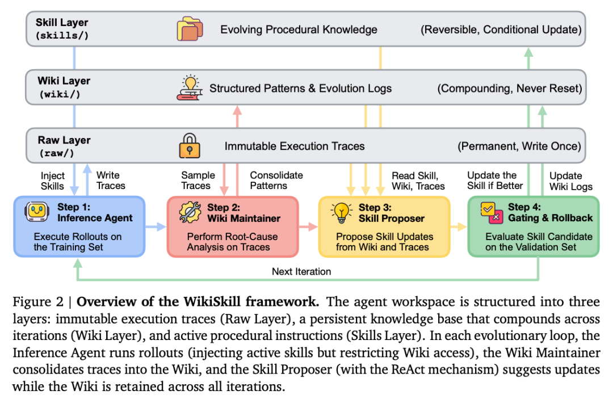
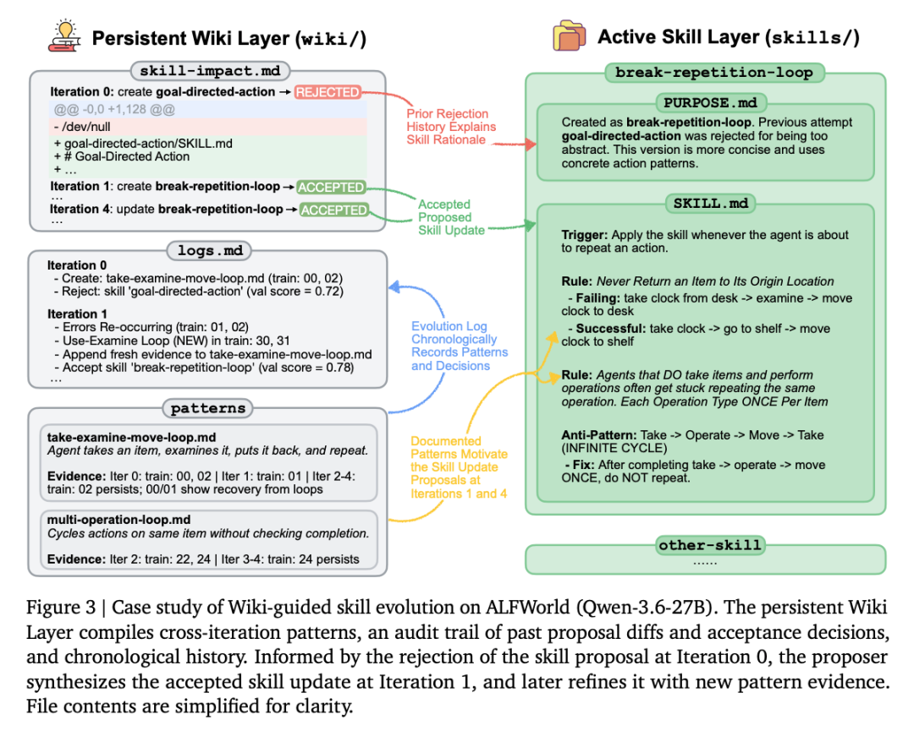
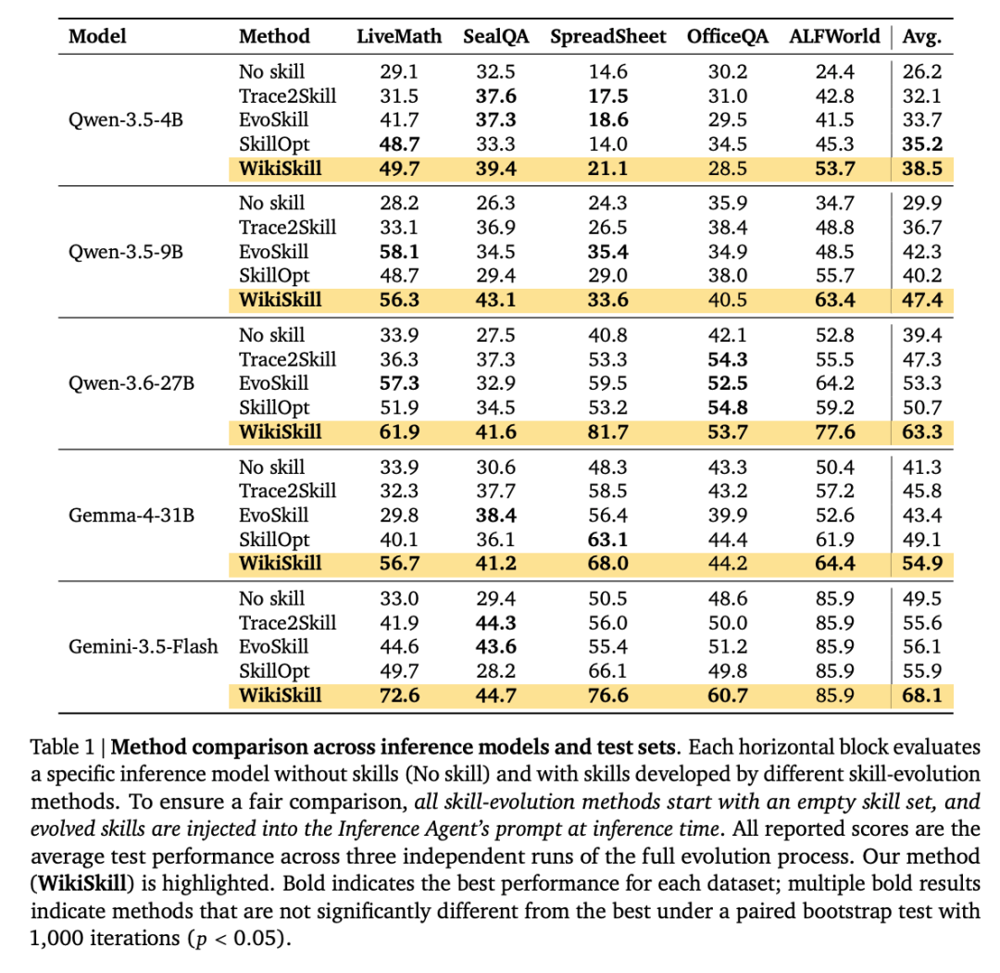
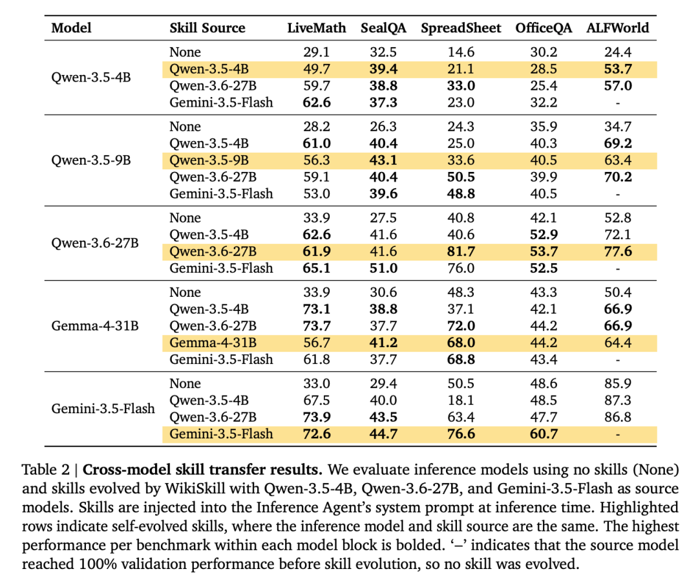
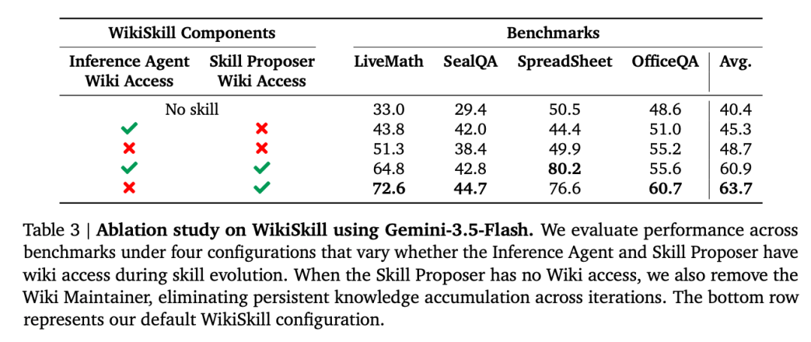

# WikiSkill：把Agent的执行历史从日志，变成可验证的能力资产

Source: https://mp.weixin.qq.com/s/DA30oyXZlWgn3jpmn5GViA

原创

无影寺
无影寺

AI帝国

在小说阅读器读本章

去阅读

在公众号小说中沉浸阅读

同一组五项 benchmark 里，Qwen-3.5-9B 加上 WikiSkill 后的平均成绩是 47.4%，高于未使用 skill 的 Qwen-3.6-27B 的 39.4%。比较口径是“9B 配合 WikiSkill”与“27B 不配合 skill”，用来衡量一套从执行经验中持续产出 skill 的流程，能在多大程度上缩小模型规模带来的差距。

WikiSkill 的切入点很具体：agent 在任务中积累的成功经验、失败原因、被拒绝过的改法，通常散在轨迹和优化历史里。下一轮改 skill 时，很容易重复踩坑，或者只根据最近几条轨迹做局部修补。Google Research 的这项工作把这部分经验单独整理成持续积累的 wiki，再用它驱动 skill 演化。

> **[图1：WikiSkill 相比无 skill 基线和既有 skill 演化方法持续改进]** 图中报告 Qwen3.5-4B、Qwen3.5-9B、Qwen3.6-27B 和 Gemini 3.5 Flash 在各项评测上的平均准确率，比较无 skill、EvoSkill、SkillOpt 与 WikiSkill。

## 执行轨迹为什么没能变成下一轮 skill

skill 可以理解为一个文件系统中的可复用目录，里面放操作说明、脚本和适用条件。已有方法也会让 agent 执行训练任务，分析成功或失败轨迹，再修改 skill。问题在于，很多经验只留在提案历史、拒绝反馈或单次轨迹里，后续迭代难以判断哪些模式已经验证过、哪些修改曾经失败、哪些错误会反复出现。

WikiSkill 增加了一个持久知识层。它不替代 skill，也不把所有历史记录直接塞给执行任务的 agent。原始轨迹、归纳后的模式和当前可执行的 skill 被放在不同位置，各自承担不同职责。

> **[图2：WikiSkill 框架概览]** 工作区包含不可变的执行轨迹、跨迭代累积的持久 wiki 与持续演化的 skill；一次循环依次执行 rollout、模式汇总、skill 提案和验证门控/回滚。

## 三层目录怎样把经验变成skill

Raw Layer 保存不可变的执行轨迹，包括推理、工具调用、返回结果和最终答案。Wiki Layer 把这些轨迹整理成失败模式、成功策略、演化日志和 skill 影响记录。Skills Layer 保存推理时会读取的程序性指令；每个 skill 还用 PURPOSE.md 回指它由哪些 wiki 模式推动产生或修改。

每一轮演化分成四步：Inference Agent 用当前 skill 跑训练任务；Wiki Maintainer 从轨迹中归纳模式并更新 wiki；Skill Proposer 读取 wiki 和最新轨迹，提出新 skill 或修改；Gating and Rollback 在验证集上决定接受还是回滚这次 skill 更新。被回滚的是 skill，wiki 仍会保留已经积累的模式和提案记录。

> **[图3：ALFWorld 上由 wiki 引导的 skill 演化案例研究]** 持久 Wiki Layer 汇总跨迭代模式、以往提案差异及接受决策的审计记录和时间线；Skill Proposer 根据第0轮被拒绝的提案，在第1轮形成被接受的 skill 更新，并继续结合新模式证据迭代。

## 五项基准里的提升来自哪里

实验覆盖数学推理 LiveMathematicianBench、网页搜索 SealQA、表格操作 SpreadsheetBench、长上下文文档问答 OfficeQA 和交互式环境 ALFWorld，使用 Qwen、Gemma、Gemini 五个模型设置。每种方法的完整演化流程独立运行三次，表中的分数是三套 evolved skill 的平均测试表现，并用配对 bootstrap 检验比较差异。

> **[表1：不同推理模型和测试集上的方法比较]** 各横向区块比较同一推理模型在无 skill 与不同 skill 演化方法下的表现；所有方法从空 skill 集合开始，推理时将演化出的 skill 注入 Inference Agent 的 prompt。

WikiSkill 在五个模型上的平均表现都高于最强的对比 skill 演化方法，提升从 3.3 到 12.0 个点。Qwen-3.6-27B 在 ALFWorld 从无 skill 的 52.8% 提高到 77.6%；Gemini-3.5-Flash 在 LiveMath 从 33.0% 到 72.6%，在 SpreadsheetBench 从 50.5% 到 76.6%。在 Qwen 家族中，模型越大，平均增益越高：4B、9B、27B 分别提高 12.3、17.5、23.9 个点。

## skill能迁移，也会把小模型的习惯带过去

论文还把一个模型演化出的 skill 交给另一个模型执行。许多组合有正向迁移：Qwen-3.6-27B 演化的 skill 让 Qwen-3.5-9B 在 SpreadsheetBench 从 24.3% 到 50.5%；同一来源的 skill 让 Gemma-4-31B 在 LiveMath 从 33.9% 到 73.7%。这说明发现可复用流程的能力，与推理时执行这些流程的能力可以分开看。

> **[表2：跨模型 skill 迁移结果]** 推理模型分别使用无 skill，以及由 Qwen3.5-4B、Qwen3.6-27B、Gemini3.5-Flash 演化出的 WikiSkill；高亮行表示 skill 来源与推理模型相同。

迁移并非总会带来提升。Qwen-3.5-4B 演化的 SpreadsheetBench skill 把 Gemini-3.5-Flash 从 50.5% 拉低到 18.1%。文中的轨迹分析显示，这类 skill 带有较多面向小模型的低层规避规则和碎片化诊断步骤；它们会限制更强模型使用完整脚本，也可能耗尽交互预算。skill 的来源模型更大，并不能保证它在所有目标模型上更好。

## wiki交给 Skill Proposer，四项平均多出15个点

WikiSkill 的默认做法并不让 Inference Agent 在训练 rollout 时读取 wiki。wiki 提供给 Wiki Maintainer 和 Skill Proposer，用来复盘轨迹、生成更新和避免重复提案。消融实验中，在 Inference Agent 不读取 wiki 的条件下，给 Skill Proposer wiki 访问权，会让 Gemini-3.5-Flash 在四项 benchmark 的平均成绩从 48.7% 提升至 63.7%，增加 15.0 个点；默认配置也是这一组合。

> **[表3：使用 Gemini-3.5-Flash 的 WikiSkill 消融研究]** 该表比较 Inference Agent 与 Skill Proposer 在 skill 演化期间是否访问 wiki；当 Skill Proposer 无 wiki 访问时，Wiki Maintainer 也被移除，持久知识不再跨迭代累积。

这个结果说明，持久知识在“改 skill”阶段有价值，不代表越多上下文越应该直接给执行任务的 agent。直接注入 active skills 的实验设定也意味着，这项工作没有测试 skill 库规模变大后的检索和触发问题。wiki 目前不会自动清理；验证门槛只接受立即提高验证分的提案，可能放弃短期持平但长期有益的更新；评测也尚未覆盖跨数百步或数小时的超长任务。

WikiSkill 给出的更实用结论是：要让 agent 从经验中进步，首先得把经验沉淀成可追溯、可复用的知识，再把它转化为可验证的 skill 更新。模型大小、skill 的发现能力和 skill 的执行能力都在影响最终效果，不能只看其中一个。

📄 原文标题

WikiSkill: Compiling Agent Experience into Persistent Knowledge for Skill Evolution

🔗 原文链接

https://arxiv.org/abs/2608.27454

预览时标签不可点

微信扫一扫  
关注该公众号

知道了

微信扫一扫  
使用小程序

取消
允许

取消
允许

取消
允许

×
分析

微信扫一扫可打开此内容，  
使用完整服务

：
，
，
，
，
，
，
，
，
，
，
，
，
。
 
视频
小程序
赞
，轻点两下取消赞
在看
，轻点两下取消在看
分享
留言
收藏
听过