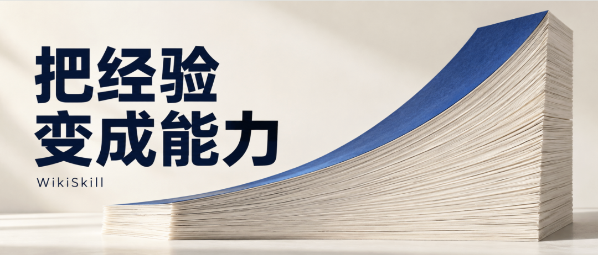

# 谷歌WikiSkill：模型可以换，经验留下来

Source: https://mp.weixin.qq.com/s/aetoilwKmQVWtHNgH0K9ww

原创

DeepThink
DeepThink

子非AI

在小说阅读器读本章

去阅读

在公众号小说中沉浸阅读

一个90亿参数的模型，带上从任务成败中反复修订的技能，在五项基准测试中拿到47.4%的平均成绩，超过了没有技能加持的270亿参数模型：39.4%。

模型权重没有变，做事的方法变了。这组结果来自Google Research与弗吉尼亚理工大学研究者2026年8月27日发布的WikiSkill论文：先针对不同任务离线演化技能，再让Agent带着这些方法接受测试。

这里的技能，可以理解为Agent的工作手册：先检查什么，按什么顺序操作，遇到错误怎样处理。WikiSkill要回答的是一个很实际的问题：一次任务完成，结果交付了，日志也留下了，上次付出的试错成本，能不能换来下一次更好的做法？

一个工程师处理过上百份表格，会逐渐知道哪些地方容易出错。Agent的工作经验，也应该有这样的价值。

## 一、9B反超，强模型也在进步

研究覆盖数学推理、网页搜索、电子表格、长文档问答和文本家务模拟五类任务。技能按每项基准分别演化，训练、验证和测试任务互不重叠。每种设置从空技能集起步，独立运行三次，再对五项测试成绩取平均。

原论文图1。黄色线为WikiSkill，蓝色线为无技能基线；图中展示四个模型和两种演化对照方法，完整五模型汇总见下表。

9B反超的条件很清楚：它用了技能，27B没有。同样使用WikiSkill，27B达到63.3%，依然明显领先。小模型借经验弥补了一部分差距，更强模型也能从中获益。

在这组Qwen模型中，4B、9B、27B的平均增益分别是12.3、17.5、23.9个百分点。电子表格任务尤其突出：27B从40.8%提高到81.7%，约为原来的两倍。

对照方法也会分析轨迹、修改技能。WikiSkill在五个模型的平均成绩上都超过了它们；Gemini的优势达到12个百分点。这说明，把经验组织得更好，能在已有技能优化方法之上继续带来收益。

## 二、技能可以退回，教训继续保留

经验究竟怎样改变操作？论文给出了一段具体过程。

在ALFWorld文本家务模拟环境中，Qwen-3.6-27B反复取物、检查、移动。动作一直在发生，任务却没有向前推进。

第0轮，系统提出“目标导向行动”技能，试图用一个宽泛原则纠正行为。验证成绩没有提高，方案被拒绝。第1轮，技能提议者参考留下的失败记录，改成更具体的防循环规则：\*\*不要把物品放回原来的位置。\*\*这次修改通过了验证。

新的循环形式随后出现。到第4轮，规则进一步补充：对每件物品，同一种操作只执行一次。这些规则服务于特定模拟任务，展示了操作方法如何在一次次试错中变得具体。

原论文图3，文件内容经作者简化展示。左侧保留失败提案、经验模式与演化记录；右侧显示第1轮生成、第4轮继续修订的防循环技能。

第一份方案没有进入执行手册，它为什么失败、改了哪些内容，却留下来了。后续提议者因此能沿着已有证据继续修改，避免把同一个宽泛建议重新说一遍。

WikiSkill用一条明确的规则管理这个过程：每轮只针对一个技能提出新增或局部修改，放到独立验证集上评估。**分数必须严格超过历史最佳，修改才被接受；打平或下降，都退回此前的技能。**

Wiki不随之回滚。修改内容、验证分数、接受或拒绝的结果，会继续保留。这既保护了当前可用的方法，也为下一轮留下了改进线索。

这种改进延续到了后期。在网页搜索任务中，28%的获准修改出现在第5—7轮。最初几轮之后，系统仍能从积累的记录中形成有效的新方法。

## 三、把经验整理成知识，再写进技能

支撑这段演化的，是原始记录、经验知识和执行技能三个层次。

Raw保存不可改写的执行轨迹，供系统回头查证；Wiki持续整理错误模式、有效策略及修改历史；Skills保存当前采用的工作方法。以SKILL.md为核心的技能文件可以附带脚本和参考资料，而促成这些技能的分析与历史留在Wiki里。三层结构

原论文图2。下方四步依次为执行任务、整理Wiki、提出技能修改、验证与回滚；三层存储从下往上依次为原始记录、经验知识和执行技能。默认配置中，执行Agent使用技能，Wiki供演化环节分析。

三个Agent各有分工：执行者按当前技能做任务；维护者对照成功与失败轨迹，检查具体操作和错误原因；提议者按需查阅Wiki及原始记录，再提出修改。提议者能看到训练任务的标准答案与成败摘要，修改有明确的依据。

EvoSkill等方法已经会保存提案或利用失败反馈。WikiSkill增加的价值，是把分散在优化历史中的认识组织成独立、持续更新的知识。这也延续了Karpathy的LLM Wiki思路：保留已经整理过的知识，让后面的工作接着前面的积累往下做。

多出这一层，究竟有没有用？研究者用Gemini-3.5-Flash做了对照实验：

| 演化期间的Wiki使用方式 | 最终平均成绩 |
| --- | --- |
| 提议者、执行者均不读Wiki，移除维护环节 | 48.7% |
| Wiki供提议者使用，执行者不读 | **63.7%** |
| 提议者、执行者都读Wiki | 60.9% |

原论文表3节选，统计四项基准，不含ALFWorld。改变的是技能演化阶段的权限，评估的是最终技能效果。

保留Wiki及维护环节，这组实验的均分提高了15个百分点；让执行者也读取Wiki，均分反而下降。作者推测，执行者可能直接借助Wiki解题，使技能本身的缺陷不容易在轨迹中暴露，后续改进也就少了线索。

这项解释仍是假说，电子表格单项在开放读取后反而改善。

## 四、经验能传，也会传错

如果技能保存的是工作方法，一个模型总结出来的经验，能不能交给另一个模型？

论文做了直接交换，既出现了比自己摸索更好的结果，也出现了明显倒退。

| 任务与执行模型 | 对照状态 | 换用其他模型的技能 |
| --- | --- | --- |
| ALFWorld · Qwen-9B | 自身技能：63.4% | 27B技能：**70.2%** |
| 数学 · Gemma-31B | 自身技能：56.7% | 4B技能：**73.1%** |
| 表格 · Gemini-Flash | 无技能：50.5% | 4B技能：**18.1%** |

原论文表2节选。来源4B为Qwen-3.5-4B，27B为Qwen-3.6-27B；执行模型分别为Qwen-3.5-9B、Gemma-4-31B、Gemini-3.5-Flash。各行均为对应单项任务成绩。

经验可以从大模型流向小模型，也能反过来，甚至跨越模型家族。长文档问答还有一个更具体的例子：4B使用自己演化的技能，成绩从30.2%降到28.5%；同一套技能交给27B，却让后者从42.1%升到52.9%。

作者观察到，小模型容易在长上下文中偏离多步检索流程，更强模型则能更稳定地执行。**发现有用的方法，和把方法执行到位，是两种不同的能力。**

但表格任务中的负迁移也很醒目。4B为了避开错误，发展出单行Python、字符串转换等具体办法。这些补丁限制了Gemini使用完整脚本；碎片化诊断又增加了冗余工具调用，可能在任务完成前耗尽交互预算。

一份成功经验里，可能同时包含可复用的方法和为某个模型量身定做的补丁。换一个执行者，哪些仍然有效，必须重新验证。

## 五、经验，最终要在下一次任务里兑现

WikiSkill展示了离线积累经验的效果。它依赖明确反馈，验证集每项只有10—40题，距离在真实工作中长期稳定地进化，还有一段路。

实验把当前技能全文放进提示词，没有检验技能库扩大后的检索与触发；只接受立即提分的修改，可能放弃有助于后续改进的铺垫；Wiki还没有自动修剪机制，长期运行后怎样处理冗余与过期知识，需要继续研究。持续数小时、涉及数百次环境操作的超长任务，也尚未覆盖。

成本同样要算完整。每轮仅维护Wiki和提出修改，就约需11—21次模型调用，任务执行与验证另算。后续复用能否收回这些投入，需要实际检验。

这篇论文让“积累经验”有了具体的落点：一次失败促成哪条修改，这条修改能否帮助后续任务，换一个模型还能不能用。模型升级之外，Agent还多了一条通过改进工作方法取得进步的路径。

**做过多少次任务，最终要兑现为下一次少走多少弯路。**

---

预览时标签不可点

微信扫一扫  
关注该公众号

知道了

微信扫一扫  
使用小程序

取消
允许

取消
允许

取消
允许

×
分析

微信扫一扫可打开此内容，  
使用完整服务

：
，
，
，
，
，
，
，
，
，
，
，
，
。
 
视频
小程序
赞
，轻点两下取消赞
在看
，轻点两下取消在看
分享
留言
收藏
听过