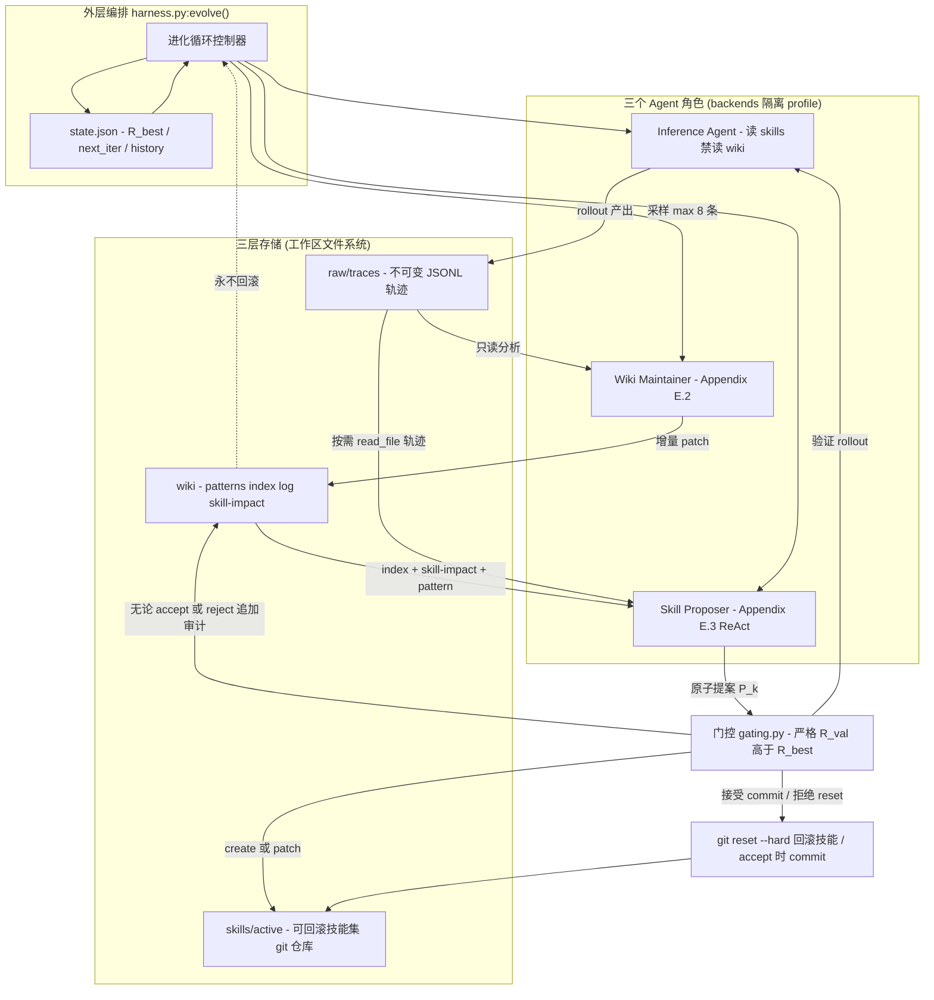
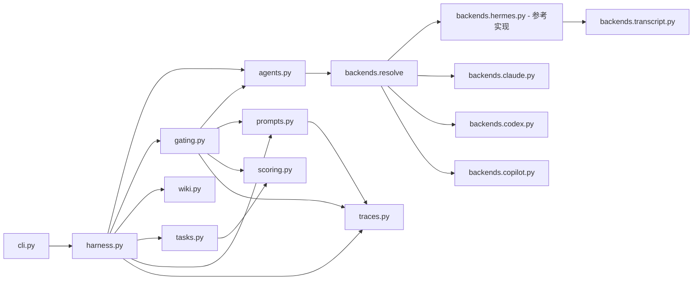
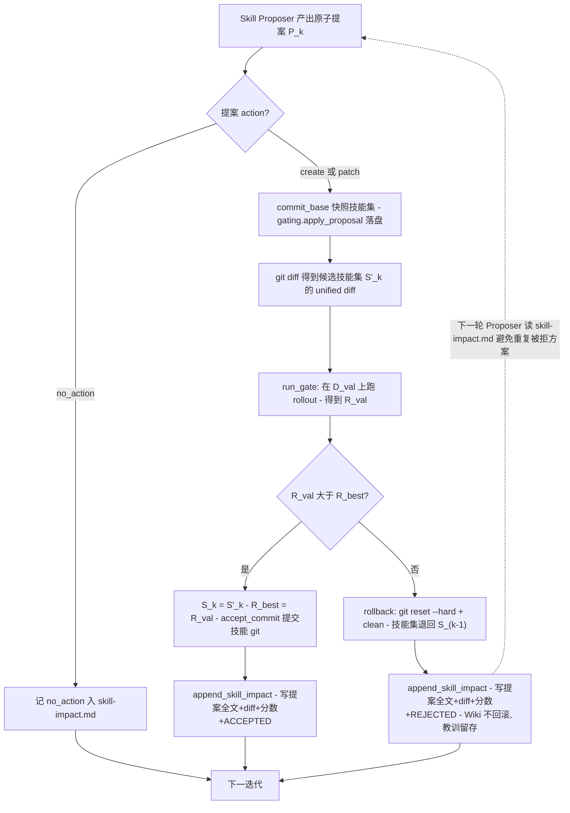
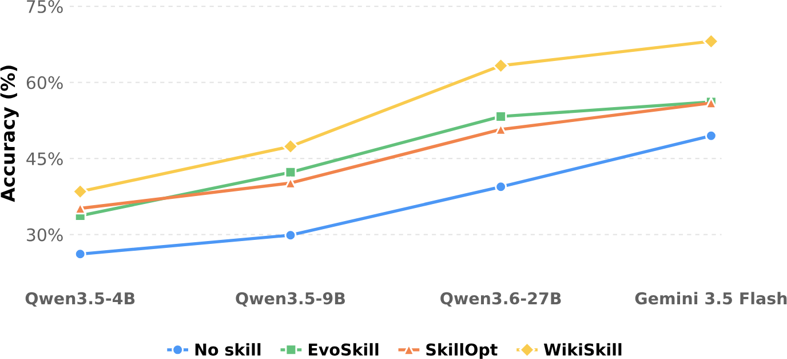
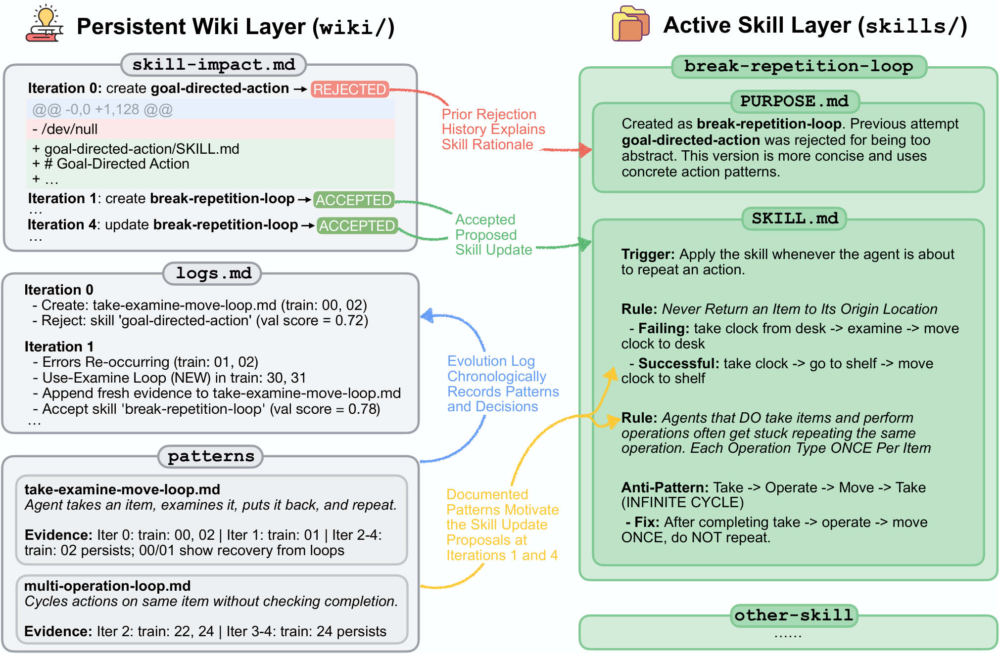

# WikiSkill 调研报告：把 Agent 经验编译成持久知识，驱动技能进化

> **C3 论文+代码综合调研**。本报告基于 arXiv:2608.27454 全文（含正文 7 节 + 附录 A–E）、论文全部 3 张原图、2 个社区开源实现的源码（Python 版 `ashutoshsinghpr7/wikiskill`、TypeScript 版 `ranjithrajv/wikiskill`），以及 7 篇微信公众号解读交叉验证。官方 `research.google` 经查证**无专文 blog**（作者经 arXiv + X 发布，第三方媒体 The Decoder / MindStudio 等报道），已如实记录。

---

## 📋 基本信息

<p align="center"><b>表1：论文基本信息</b></p>

| 项目 | 内容 |
|-----|------|
| 论文标题 | WikiSkill: Compiling Agent Experience into Persistent Knowledge for Skill Evolution |
| 作者 | Liyan Tang、Cyrus Rashtchian、Chun-Sung Ferng、Andrew Tomkins、Da-Cheng Juan、Tu Vu |
| 机构 | Google Research（Tu Vu 兼 Virginia Tech；Liyan Tang 为 Google Research 研究科学家、通讯作者） |
| 发表形式 | arXiv 预印本（`cs.AI`），2026-08-27 提交，v1 |
| 论文链接 | https://arxiv.org/abs/2608.27454 |
| HTML 版 | https://arxiv.org/html/2608.27454v1 |
| 通讯邮箱 | lytang@google.com、ttvu@google.com |
| 许可证 | CC BY 4.0 |
| **官方代码** | **截至 2026-09 未发现官方开源仓库**（arXiv 页、HF Papers、google-research GitHub org 均无；作者在 X 公告亦未附 repo 链接） |
| 社区实现 | ① Python `ashutoshsinghpr7/wikiskill`（123★，2026-08-29 创建，忠实 Algorithm 1 + 多后端）；② TypeScript `ranjithrajv/wikiskill`（npm 包，跨 CLI harness） |
| 第三方报道 | The Decoder（2026-08-29）、MindStudio、daily.dev、Reworked、DAIR Academy、eesel.ai 等 |
| 核心命题 | 在「原始执行经验」与「可执行技能」之间插入一层**只增不减的持久知识 Wiki**，让技能进化每一轮都站在以往学到的知识之上 |

**一句话总结**：技能（Skill）可以因为验证掉分被回滚，但知识（Wiki）永远不回滚——被拒绝的提案、复发的错误、新出现的证据全部沉淀在 Wiki 里，下一轮提案者据此不再重复踩坑。论文用这一「非对称生命周期」在 5 基准 × 5 模型上稳定超越 EvoSkill / SkillOpt / Trace2Skill，并让 **9B 小模型配进化技能（47.4%）反超 27B 大模型无技能（39.4%）**。

---

## 1. 研究背景与动机

### 1.1 问题定义

通用 AI Agent 越来越能胜任跨领域复杂任务，但可靠完成真实任务往往需要**领域特定的程序性知识**（procedural knowledge）与工作流——比如「按约束改电子表格」「在超长文档里定位证据」「按步骤整理家居物品」。这类知识更新快、依赖环境、写进模型权重不划算。

**Agent Skill（技能）** 业界给出的答案：把指令、脚本、资源打包成一个**基于文件系统的可复用目录**（`SKILL.md` + frontmatter 元数据 + 适用条件），在不更新模型参数的前提下让冻结的模型获得新的程序性能力。它天然支持 progressive disclosure（按需加载、省上下文），也让「知识积累」与「模型参数」解耦。

问题出在**「技能怎么持续写好」**。当前主流是**自动技能进化（skill evolution）**：让 Agent 在训练任务上反复执行 → 分析成功/失败轨迹 → 据此修改技能 → 迭代。代表工作有 EvoSkill、Trace2Skill、SkillOpt。思路都对，但论文指出一个共同的结构性缺陷——

> **指导技能开发的「洞见」散落在各自的优化历史里，无法被系统性复用。**

具体表现为三种痛点（第 1、3 篇公众号将其归纳为「经验没有独立存储层」）：

<p align="center"><b>表2：现有技能进化方法的三类结构性缺陷</b></p>

| 痛点 | 含义 | 现有方法的表现 |
|-----|------|--------------|
| **优化历史 ≠ 可复用知识** | 记录了「发生过什么」，但没把「为什么失败、哪类模式反复出现、哪些提案被拒过」抽成独立、可检索的结构化资产 | EvoSkill 维护的是「提案历史清单」；Trace2Skill 把教训蒸馏成补丁塞回技能文档 |
| **回滚把教训一起回滚** | 「这个提案为什么不行」只附着在技能 diff 上，回滚后即被淹没，导致同类失败方案被反复提出、进化在低水平循环 | 所有带验证门控的方法都有此问题；SkillOpt 的 rejected buffer 属 optimizer state 而非独立知识 |
| **发现技能与执行技能被绑死** | 从经验归纳通用套路（研究员）与按说明书精确执行（操作工）对模型能力要求完全不同，但自进化默认让同一个模型身兼二职 | EvoSkill/SkillOpt/Trace2Skill 均在单一模型上闭环 |

### 1.2 研究动机

灵感来自 **Karpathy（2026）的「LLM Wiki」主张**：与其每次查询都从原始文档检索片段、重新理解和综合（大量 synthesis 工作被反复重做），不如让 LLM 把素材**持续编译进一个结构化、可累积、可更新的 Wiki**，使已完成的「理解」成为持久资产。

WikiSkill 把这一思想从「知识问答」迁移到「Agent 学习」，提出研究问题：

> **能否把 Agent 经验同样编译成持久知识，来支撑长期的技能进化？**

第 2 篇公众号（Coggle 数据科学）对此的提炼很到位：WikiSkill 本质是一种 **Agent Experience Compiler（经验编译器）**——把 trajectory 从一次性运行日志，编译成可跨迭代累积、修正、引用并最终重新生成 Skill 的长期知识。它给 LLM Wiki 补上了一个关键闭环：Wiki 里的知识不再只等待被查询，而是被**编译成程序性能力 → 能力进入环境运行 → 产生新 trajectory → 反过来修正 Wiki**。

### 1.3 研究目标

1. 提出一个框架，让 Agent 技能与持久知识库（Wiki）**共同进化（co-evolve）**；
2. 把「原始执行经验 / 累积知识 / 可执行技能」三者**职责分离**，让技能更新建立在越来越完整、越来越整合的知识之上；
3. 系统研究进化出的技能如何与**模型能力**交互（缩放关系、跨模型迁移）。

---

## 2. 核心贡献

### 2.1 主要贡献

<p align="center"><b>表3：论文明确声明的主要贡献</b></p>

| 编号 | 贡献描述 |
|-----|---------|
| C1 | **框架贡献**：提出 WikiSkill，一个让 Agent 技能与持久知识库共同进化的框架，在原始经验与可执行技能之间插入一个结构化、持续精炼的知识层 |
| C2 | **实证贡献**：在 5 个基准、5 个模型上一致超越 SOTA 技能进化方法，并通过消融确认「持久知识积累」是有效技能进化的关键 |
| C3 | **认知贡献**：系统研究进化技能与模型能力的关系——技能进化与模型缩放**互补**（越大收益越高），且进化技能可**跨模型/跨家族迁移**，有时甚至优于自进化技能 |

### 2.2 创新点

1. **方法创新——非对称生命周期**：三层工作区（Raw / Wiki / Skills）各有不同的更新规则——Raw 只追加不可改、Wiki 持续累积永不回滚、Skills 可被门控接受或回滚。被拒提案的 diff、验证分、拒绝结论由**外层 harness 程序化**写入 `skill-impact.md`，构成一份客观的「既往干预审计轨迹」，供后续提案者查阅以避免重复失败修改。第 3 篇公众号（沐白 AI 笔记）称之为「非对称知识设计」——**技能可以错，知识不行**，类比「代码可以 revert，事故报告永远留着」。

2. **技术创新——训练期禁止读 Wiki**：反直觉的关键设计。Inference Agent 在训练 rollout 时只注入 active skills、**被禁止访问 Wiki**。消融证明这一「不对称访问」是增益关键：把 Wiki 同时给执行者反而掉分（见 §5.4）。

3. **实验创新——把「发现」与「执行」解耦**：跨模型迁移实验首次把「从经验里发现有用程序性知识」与「推理时有效执行该知识」两种能力区分开（自进化方法通常把两者混为一谈）。

---

## 3. 方法详解

### 3.1 问题形式化

设数据集 $\mathcal{D} = \{(x_i, y_i)\}_{i=1}^{N}$，划分为训练集 $\mathcal{D}_{\text{train}}$、验证集 $\mathcal{D}_{\text{val}}$、测试集 $\mathcal{D}_{\text{test}}$ 三部分。Agent $\pi$ 是配备工具集 $\mathcal{U}$（bash、搜索 API、文件读取等）与 active skill set $S = \{s_1, \dots, s_M\}$ 的 LLM 系统。每个 skill 是含 `SKILL.md`（frontmatter 元数据 + 程序性指令 + 适用条件）的文件系统目录，$S$ 初始化为空集 $\emptyset$、按数据集逐一进化。

执行任务 $x_i$ 时，Agent 与环境多步交互产生轨迹：

$$\tau_i \sim \pi(x_i;\, S), \qquad \tau_i = (o_1, a_1, o_2, a_2, \dots, o_T, a_T)$$

其中 $o_t$ 为观测、$a_t$ 为动作（含调用 $\mathcal{U}$ 中工具），末动作 $a_T$ 给出预测答案 $\hat{y}_i$，由领域打分函数 $f(\hat{y}_i, y_i) \in [0, 1]$ 评估。对任意划分 $\mathcal{D}_{\text{split}}$，rollout 得到轨迹集 $\mathcal{T}_{\text{split}}$，其性能 $\mathcal{R}(\mathcal{T}_{\text{split}})$ 为该划分上所有任务得分的平均值。

**WikiSkill 的核心状态**：迭代 $k$ 时系统状态为元组 $(S_k, W_k)$——$S_k$ 为 active 程序性技能集，$W_k$ 为持久知识库（Wiki）。**关键区分在于两者更新规则不同**：候选技能更新受验证门控、掉分即回滚；而 $W_k$ **跨迭代持续累积、永不回滚**。从 $(S_0, W_0) = (\emptyset, \emptyset)$ 出发，通过训练 rollout、模式固化、验证门控共同进化联合状态，最大化最终测试性能 $\mathcal{R}(\mathcal{T}_{\text{test}})$。

### 3.2 三层知识架构


*Figure 2: WikiSkill 框架总览。Agent 工作区被组织成三层——不可变的执行轨迹（Raw Layer）、跨迭代累积的持久知识库（Wiki Layer）、当前生效的程序性技能（Skills Layer）。一次进化循环依次执行四步：（1）Inference Agent 用 active skills 跑 rollout（注入技能但**禁止访问 Wiki**）；（2）Wiki Maintainer 把轨迹固化进 Wiki；（3）Skill Proposer（ReAct 机制）按需查阅 Wiki 与轨迹、提出技能修改；（4）门控/回滚机制在验证集上决定接受还是回滚。底部三个目录 `raw/`、`wiki/`、`skills/` 分别对应三层，箭头标出 1→4 的执行顺序以及「Wiki 只累积不回滚、Skills 可回滚」的非对称关系。*

**三层各自的职责与可变性**（让不看图也能理解架构）：

<p align="center"><b>表4：三层工作区的职责、内容与可变性</b></p>

| 层 | 目录 | 内容 | 谁能读 | 可变性 |
|----|------|------|--------|--------|
| **Raw Layer** | `raw/` | 每轮训练采样的完整执行轨迹 $\tau_i \in \mathcal{T}_{\text{train},k}$（推理、工具调用、工具返回、最终答案） | Wiki Maintainer / Skill Proposer | **不可变**（immutable，只追加，保留原始历史） |
| **Wiki Layer** | `wiki/` | 把轨迹编译成结构化累积知识（见下表展开） | Wiki Maintainer / Skill Proposer（**Inference Agent 禁止访问**） | **永不回滚**，跨迭代持续累积 |
| **Skills Layer** | `skills/` | active 技能集 $S$，Inference Agent 运行时读取 | Inference Agent | 受门控，**可接受或回滚** |

**Wiki 层内部结构**（第 1 篇公众号「硅基星尘」整理得最清楚）：

<p align="center"><b>表5：Wiki 层的关键文件</b></p>

| 文件 | 作用 | 谁写 |
|------|------|------|
| `patterns/` | 每个失败模式 / 成功策略一页 md，含描述 + **根因分析（WHY 而非 WHAT）** + 轨迹里的确切命令序列 + 可操作 workaround | Wiki Maintainer |
| `index.md` | 模式目录，一行一条；格式 `[pattern-name](wiki/patterns/xxx.md): PROBLEM + ROOT CAUSE + FIX`，具体到让 Agent 不读全文即可判断相关性 | Wiki Maintainer（每次 pattern 变动同步） |
| `logs.md` | 时序演化日志（迭代、分数、接受/拒绝） | Wiki Maintainer 追加 |
| `skill-impact.md` | 提案元数据 + 目标技能名 + unified diff + 验证分 + 接受/拒绝结论（**含被拒提案全文**） | **外层 harness 程序化写入**（非 LLM），客观审计轨迹 |

**Skills 层内部结构**：每个技能目录含两个文件——`SKILL.md`（技能全文）与 `PURPOSE.md`（把技能回指到催生它的那些 Wiki 模式，记录演化历史）。

### 3.3 四个组件与进化循环

```
Algorithm 1: WikiSkill 进化循环
Input: 训练任务 D_train, 验证任务 D_val, 性能度量 R, 迭代次数 K
Output: 最终技能集 S_K, 最终 Wiki W_K

 1. 初始化 S_0 ← ∅, W_0 ← ∅
 2. 基线验证: T_val,0 ← {τ_i ~ π(x_i; S_0)} (x_i ∈ D_val),  R_best ← R(T_val,0)
 3. for k = 1 … K:
 4.     if R_best = 1.0: break                          # 达到满分提前终止
 5.     Inference:  T_train,k ← {τ_i ~ π(x_i; S_{k-1})} (x_i ∈ D_train)   # 注入技能、禁止读 Wiki
 6.     采样子集 T_sample,k ⊂ T_train,k                  # ≤5 失败 + ≤3 成功，防上下文溢出
 7.     Wiki Maintenance:  W'_k ← M_WM(W_{k-1}, T_sample,k)                # 固化进中间 Wiki，永不回滚
 8.     Skill Proposal:    P_k  ← M_P(W'_k, S_{k-1}, T_train,k)            # ReAct 多轮，按需读 pattern/trace
 9.     Apply:             S'_k ← Apply(S_{k-1}, P_k)
10.     Validate:          T_val,k ← {τ_i ~ π(x_i; S'_k)} (x_i ∈ D_val)
11.     if R(T_val,k) > R_best:                          # 严格优于历史最优才接受
12.         S_k ← S'_k;  R_best ← R(T_val,k);  a_k ← Accepted
13.     else:
14.         S_k ← S_{k-1};  a_k ← Rejected              # 只回滚技能；Wiki 保留
15.     Update Wiki Log:   W_k ← Update(W'_k, P_k, R(T_val,k), a_k)        # 程序化追加 skill-impact.md
16. end for
```

**四步逐一解读**：

<p align="center"><b>表6：单轮迭代的四个组件</b></p>

| 组件 | 符号 / 公式 | 职责 | 关键约束 |
|------|-----------|------|---------|
| **Inference Agent** | $\tau_i \sim \pi(x_i;\, S_{k-1})$ | 用 active skills 跑训练任务，产出不可变轨迹写入 `raw/` | 技能全文注入 system prompt（full-injection，消除检索/触发失败的混淆变量）；**训练期禁止访问 Wiki** |
| **Wiki Maintainer** | $W'_k \leftarrow \mathcal{M}_{\text{WM}}(W_{k-1},\, \mathcal{T}_{\text{sample},k})$ | 对失败轨迹做根因分析、从成功轨迹提取策略，增量 patch 更新 pattern 页与日志 | 每轮采样 ≤8 条轨迹（≤5 失败 + ≤3 成功），单条日志截断 15000 字符；pattern 编辑走 append/replace/insert_after，无数量硬上限 |
| **Skill Proposer** | $P_k \leftarrow \mathcal{M}_{\text{P}}(W'_k,\, S_{k-1},\, \mathcal{T}_{\text{train},k})$ | ReAct 多轮自主行动：先读 `index.md` + `skill-impact.md` + 结果摘要，再按需 `read_file` 查 pattern 页与原始轨迹，诊断后输出**一个原子提案** | 提案前至少读 4 条失败轨迹；每轮只针对**单个**技能（create 或 patch）；优先 patch 而非 create |
| **Gating & Rollback** | 见下方分段函数 | 在验证集上评测候选技能，严格超历史最优才接受，否则回滚 | 无论接受/拒绝都追加 `skill-impact.md`；验证分达 1.0 提前终止 |

门控接受判据（式 4）：

$$
S_k \leftarrow \begin{cases} S'_k & \text{if } \mathcal{R}(\mathcal{T}_{\text{val},k}) > \mathcal{R}_{\text{best}} \\[4pt] S_{k-1} & \text{otherwise} \end{cases}
$$

验证结束后的 Wiki 状态转移（式，程序化写审计）：

$$W_k \leftarrow \text{Update}\bigl(W'_k,\; P_k,\; \mathcal{R}(\mathcal{T}_{\text{val},k}),\; a_k\bigr), \qquad a_k \in \{\text{Accepted},\, \text{Rejected}\}$$

`R_best` 在循环开始前初始化为空技能集 $S_0$ 在 $\mathcal{D}_{\text{val}}$ 上的基线分 $\mathcal{R}(\mathcal{T}_{\text{val},0})$。**被拒绝时，候选技能修改被丢弃、技能集回退到最近一次成功配置 $S_{k-1}$；但 $W_k$ 无论如何都不回滚——累积的 pattern 与日志跨所有迭代保留。**

### 3.4 与现有方法的核心区别

<p align="center"><b>表7：WikiSkill 与三条进化路线的对比（综合论文 §6 + 第 2、3 篇公众号）</b></p>

| 方法 | 核心学习单元 | 长期状态形态 | 技能更新思想 | 最突出能力 | 「学到的知识」去哪了 |
|------|------------|------------|------------|-----------|-------------------|
| **Trace2Skill** | trajectory-local lesson | 聚合中的轨迹证据 | 并行归纳 + 层级合并成 SOP | 把大量经验蒸馏成可迁移 SoP | 最终压缩进 Skill 文档 |
| **EvoSkill** | failure + proposal | 累积反馈历史（flat optimization log） | 演化变异 + Pareto 前沿选择 | 自动发现新 Skill | 留在 optimizer history，非独立表示 |
| **SkillOpt** | scored rollout + edit | rejected buffer + 周期级 meta guidance | ReflACT 六阶段 + 文本学习率 + 验证门控 | 稳定可控地「训练」Skill | 属 optimizer state |
| **WikiSkill** | **experience pattern** | **持久结构化 Wiki（独立、可累积、可检索）** | 知识累积 + 原子提案 + 严格门控 | **跨迭代复用「已学到的知识」** | 独立为一等知识状态 |

**关键差异**：前三者都有某种形式的「记忆」，但都没有把「学到了什么」维护成一个**独立的、持续演化的知识表示**。WikiSkill 显式建立这一层，从而让技能开发建立在有充分支撑、被整合的知识之上，而非散落的进化产物。

### 3.5 方法设计的关键洞察

1. **职责分离（separation of concerns）是根本**：第 2 篇公众号精辟概括——Raw 层保存「发生了什么」，Wiki 层保存「我们目前认为这些经验意味着什么」，Skill 层保存「下一次应该怎么做」。三件事更新频率不同、存储形态不同、读者不同，硬塞在一个 blob 里时每次回滚都会丢掉值得留下的东西。

2. **Skill 面向执行，Wiki 面向学习**：Skill 追求短、直接、可执行（能立刻改变 action policy）；Wiki 保存产生这些规则之前的知识状态（哪类失败连续出现三轮、某 workaround 曾在 validation 失败、某条技能为何被拒）。因此二者读者天然不同——执行者只需 Skill。

3. **Wiki 是 teacher-side state，Skill 是 student artifact**：把 Wiki 理解成「教师侧」状态、Skill 理解成要部署到 student agent 的产物。若训练时允许 student 直接读 teacher 全部知识，得到的 Skill 未必真正吸收了这些知识——这正是训练期禁读 Wiki 的直觉（§5.4 消融证实）。

4. **严格门控是保守但有意的**：「严格优于历史最优才接受」会拒掉那些短期中性、但可能解锁后续突破的提案。作者明确这是为与 SkillOpt/EvoSkill 公平对比而采用的既有标准，列为 limitation。第 1 篇公众号的判断「这份保守是值得的——一份可解释的『为什么没接受』比一份默默接受但其实没用的技能对长期维护更友好」代表社区主流看法。

---

## 4. 代码实现分析

> **重要前提**：**WikiSkill 官方未开源代码**。本报告分析的是两个社区独立实现，二者都声称「faithful（忠实）」还原论文 Algorithm 1，但在工程取向上各有侧重。分析目的有三：① 检验论文可复现性；② 建立论文概念 → 真实代码的映射；③ 暴露论文文字未讲清、但落地必须回答的细节（如门控如何保证「只评测候选技能集」）。

### 4.1 两个仓库概览

<p align="center"><b>表8：社区实现仓库信息</b></p>

| 项目 | Python 版 `ashutoshsinghpr7/wikiskill` | TS 版 `ranjithrajv/wikiskill` |
|------|--------------------------------------|------------------------------|
| 地址 | github.com/ashutoshsinghpr7/wikiskill | github.com/ranjithrajv/wikiskill |
| 语言 / 分发 | Python ≥3.10，PyPI 包 `wikiskill`（wheel + sdist） | TypeScript，npm 包 `wikiskill`（bin `wikiskill`） |
| Star / Fork | 123★ / 9fork | 1★ / 0fork |
| 创建 / 最近 push | 2026-08-29 / 2026-09-01 | 2026-09-02 / 2026-09-03 |
| 定位 | 面向 **Hermes Agent** 的生产级进化引擎，多后端 | 面向 **编码 CLI**（OpenCode / Claude Code / Codex CLI）的经验积累工具 |
| 许可 | MIT | CC BY 4.0（同论文） |
| 核心引擎风格 | 编排 + 隔离 profile + git 审计 | 「文件系统 + 纯 prompt 文本、零框架依赖」的 core + adapters |
| 后端 / harness | Hermes（参考实现）、Claude Code、Codex、Copilot CLI（OpenCode 计划中） | OpenCode、Claude Code、Codex、DeepSeek、Pi、Hermes（**仅 Claude Code runner 实装真实 held-out 验证**） |
| 对论文的态度 | 逐字采用 Appendix E.2/E.3 prompt | 逐字采用 Appendix E.1/E.2/E.3，存于 `skills/framework/verbatim/` |

两个仓库都**如实标注自身局限**：Python 版 README 明说「目前实跑中还没有提案通过门控」（记录了一次 neutral、一次 harmful 被拒 + 弱模型一次 `no_action`）；TS 版则明说除 Claude Code 外「Codex/OpenCode runner throws not implemented」。这种诚实值得肯定，也提醒读者：**「论文可复现」与「社区已复现出论文级增益」是两件事**——截至快照，增益复现尚无人公开坐实。

### 4.2 目录结构

Python 版（核心包 `wikiskill/`）：

```
code-py/
├── wikiskill/
│   ├── harness.py          # Algorithm 1 主循环编排（init_workspace / evolve）
│   ├── wiki.py             # Wiki 层骨架 + git 审计 commit + append_skill_impact
│   ├── gating.py           # 门控：apply_proposal / rollback / run_gate / state.json
│   ├── prompts.py          # 三角色 prompt（Appendix E 改写）+ 门控结果条目
│   ├── agents.py           # 后端无关的 run_agent facade（dispatch 到 backends）
│   ├── scoring.py          # grader：exact / contains / json_field / code_stdout
│   ├── tasks.py            # tasks.json 注册表 + split + sandbox 物化
│   ├── traces.py           # Raw 层：轨迹 JSONL 落盘
│   ├── compare.py / transfer.py / bench.py / cli.py
│   └── backends/           # hermes.py（参考）、claude/codex/copilot、transcript.py
├── skills/                 # 随包分发的 framework skills + 5 个实操 skills
│   ├── wikiskill-maintainer/SKILL.md   # Appendix E.2 逐字
│   ├── wikiskill-proposer/SKILL.md     # Appendix E.3 ReAct 逐字
│   └── search-miss-binary 等           # 从实跑固化出的 pattern（wiki 层素材）
├── tests/                  # test_core / test_harness / test_gating / test_backends / test_compare / test_transfer
└── docs/                   # index / COMPARING / CRON / RUNS
```

TS 版（引擎与适配器分层）：

```
code-ts/
├── src/
│   ├── core/               # 零框架依赖的进化引擎
│   │   ├── gating.ts            # §3.2.4 门控 + 真实 held-out 验证（runValidationGate）
│   │   ├── bounded-update.ts    # ★ SkillOpt 文本学习率（论文未含，属额外增强）
│   │   ├── wiki-maintainer.ts / skill-proposer.ts / wiki-manager.ts
│   │   ├── cross-model.ts / transfer.ts   # 跨模型迁移
│   │   ├── analysts.ts          # fleet mode（并行分析师 + 合并）
│   │   ├── discover.ts / bench.ts / compare.ts / state.ts / ...
│   │   └── *.test.ts            # 单测（bounded-update / gating / analysts）
│   └── adapters/           # 各 harness 适配层
│       ├── claude-code/    # PostToolUse hook + /wiki-* 斜杠命令（唯一实装验证的 runner）
│       ├── codex/ opencode/ deepseek/ pi/ hermes/
├── skills/framework/verbatim/   # Appendix E 逐字 prompt
└── dsh-plugin/             # DeepSeek Cordis 插件
```

### 4.3 系统架构图（社区实现如何落地论文）



*WikiSkill 社区实现（Python 版）系统架构图。外层 `harness.py:evolve()` 是论文 Algorithm 1 的编排器，持有 `state.json`（`R_best`/`next_iter`/`history`）；三个 Agent 角色各自运行在**隔离 profile**（`backends/hermes.py` 的专用 `HERMES_HOME`）内，保证门控评测的正是候选技能集 $S$ 本身、不被用户真实 memory/skills 污染；三层存储落在工作区文件系统。最值得注意的设计有两点：① **`skill-impact.md` 由门控后「无论接受/拒绝」统一追加**（`prompts.py:gate_outcome_entry` 把提案全文嵌进条目），这是论文「Wiki 永不回滚 + 被拒提案保持可见」的落地核心；② **Skills 层是一个 git 仓库**，接受时 `accept_commit`、拒绝时 `rollback()` 用 `git reset --hard` + `clean -fd` 回退——而 Wiki 层只做 `commit` 从不做 reset，从机制上锁死「知识只进不退」的非对称生命周期。*

### 4.4 模块依赖关系图（Python 版源码）



*Python 版模块依赖关系图。`harness.py` 是核心枢纽（被 `cli.py` 调用、向下扇出到几乎所有其他模块），它只做编排、不含业务细节；`agents.py` 是一个刻意保持 API 稳定的 facade（README 称之为 issue #13 重构产物——所有函数从旧的单一 `agents.py` 拆出、按 workspace pin 的后端 dispatch，无 `workspace.json` 的旧工作区默认解析到 Hermes，保证向后兼容）。叶子节点 `scoring.py`（4 类 grader）与 `traces.py`（Raw 层落盘）不反向依赖任何模块，可独立测试。`backends/` 家族呈「一参考 + 多适配」结构：`hermes.py` 是被完整测试的参考实现，其余后端复用同一 `RunResult` 契约。整体无循环依赖，分层清晰——这正是论文抽象得以「换个 Agent CLI 也能跑」的模块边界保证。*

### 4.5 核心流程图：提案生命周期与非对称回滚



*单轮提案生命周期流程图。从 `propose_step` 产出原子提案开始，分支处理 `no_action`（直接记审计、跳过验证）与 `create`/`patch`（走完整门控）。**关键在最后两个分支的共同汇合点**：无论 `accept`（`gating.accept_commit` 把技能提交进 git、更新 `R_best`）还是 `reject`（`gating.rollback` 用 `git reset --hard` 回退技能），`append_skill_impact` **都要执行**——这正是社区代码把论文「失败本身也是知识」这条抽象落成可执行代码的地方。底部虚线箭头回指起点，标出「下一轮 Proposer 通过 `read_file` 查阅 `skill-impact.md` 里被拒提案的全文」的反馈闭环，即 §5.3 案例中 Iter 1 能提对规则的信息来源。*

### 4.6 核心数据结构与论文概念映射

提案（proposal）是连接 Skill Proposer 与门控的中间结构，其 schema 严格对应论文 §3.2.3 的 create/patch 语义：

```json
{"action": "create", "name": "snake_case",
 "skill_md": "YAML frontmatter + When to Apply + When NOT to Apply + Instructions",
 "purpose_md": "Origin + Patterns Addressed + Evolution History"}

{"action": "patch", "name": "existing-skill",
 "edits": [
   {"op": "append",       "content": "..."},
   {"op": "replace",      "target": "exact text", "content": "..."},
   {"op": "insert_after", "target": "exact text", "content": "..."}
 ]}

{"action": "no_action"}
```

其中 `purpose_md` 对应论文 `PURPOSE.md`（技能回指 Wiki pattern），`edits` 的三种 patch op 对应论文与 Wiki Maintainer prompt（Appendix E.2）里「增量 patch 编辑」的同名操作。`gating.apply_proposal` 里 `replace`/`insert_after` 要求 `target` 必须是文件内**精确子串**，找不到即 `raise ValueError`——这把论文「patch-based editing」落成了强约束。

进化状态（`gating.load_state` 返回的 `state.json`）持有 `r_best`、`baseline`、`next_iter`、`history[]`（每项记 `iter/train_mean/r_val/accepted/proposal`），对应论文 $(S_k, W_k)$ 状态机里外层 harness 需要持久化的标量。

### 4.7 论文概念 → 代码实现对应关系

<p align="center"><b>表9：论文概念与社区代码（Python 版为主）对应</b></p>

| 论文概念 | 公式/章节 | 代码实现 | 文件位置 |
|---------|---------|---------|---------|
| 进化循环整体 | Algorithm 1 | `evolve()` | `wikiskill/harness.py:88` |
| 工作区三层目录 | §3.1 | `init_workspace()` 建 `raw/traces` `wiki/patterns` `skills/active` | `harness.py:34` |
| Wiki 状态转移 $W_{k-1}\to W'_k$ | 式 2 | `maintain_step()` → `run_agent` + MAINTAINER prompt | `harness.py:66` |
| 提案 $P_k$ | 式 3 | `propose_step()` → 读 `runs/proposals/iter-NN.json` | `harness.py:74` |
| 严格门控 $R_{\text{val}}>R_{\text{best}}$ | 式 4 | `accepted = r_val > prev_best` | `harness.py:159` |
| 只回滚技能不回滚 Wiki | §3.2.4 | `rollback()`=git reset（仅 skills）；Wiki 无 reset | `gating.py:107` |
| 程序化写 skill-impact | §3.2.4 | `gate_outcome_entry()` + `append_skill_impact()`（accept/reject 都调） | `prompts.py:123` / `gating.py` via `wiki.py:52` |
| 达满分提前终止 | Algorithm L5 | `if state["r_best"]==1.0: break` | `harness.py:124` |
| 分层采样 ≤5 失败 ≤3 成功 | Appendix C | `sample_traces(max_fail=5, max_pass=3)` | `harness.py:50` |
| full-injection 技能 | §3.2.1 | `set_active_skills()` 重建隔离 profile 的 skills symlink | `backends/hermes.py:66` |
| 训练期禁读 Wiki | §3.2 | inference run 不带 framework、toolsets 仅 task 工具 | `backends/hermes.py:169` |
| create/patch 落地 | §3.2.3 | `apply_proposal()` append/replace/insert_after | `gating.py:67` |
| 性能 $\mathcal{R}$（均值） | §2 | `mean_score()` | `gating.py:169` |
| Wiki git 审计 | §3.1（隐式） | `wiki.commit()` 每轮 maintainer/gate 各一次 | `wiki.py:23` |

### 4.8 配置参数详解（论文实验设置 vs 代码默认值）

<p align="center"><b>表10：关键参数与论文实验设置的对应</b></p>

| 参数 | 论文值（Appendix C） | Python 代码默认 | TS 代码默认 | 说明 |
|------|-------------------|----------------|------------|------|
| 采样轨迹数 | ≤8/轮 | `max_total=8` | fleet mode 并行 analyst | 防上下文溢出 |
| 失败/成功配比 | ≤5 / ≤3 | `max_fail=5, max_pass=3` | 同 | 根因分析 + 防回退 |
| 单轨迹截断 | 15000 字符 | transcript 导出（未硬截，依赖后端） | 同 | 论文侧限制 |
| Proposer ReAct 轮数 $T_{\text{ReAct}}$ | 10–20 | `max_turns=60`（含读文件） | — | 论文指推理轮，代码是工具轮上限 |
| 门控判据 | $\mathcal{R}_{\text{val}} > \mathcal{R}_{\text{best}}$ | `r_val > prev_best` | `shouldAccept(score,best)` | 严格、两侧一致 |
| batch size | $B = N_{\text{train}}$（全量） | 全量 rollout | 全量 | 论文实验固定全量批 |
| 文本学习率 | （论文无） | （未实现） | `maxEdits=4`（cosine decay floor 2）、`maxEditFraction=0.3`、`maxNewLines=120` | **TS 版从 SkillOpt 移植的额外约束** |
| grader 类型 | 领域 $f(\hat y,y)\in[0,1]$ | exact/contains/json_field/code_stdout | verify 脚本通过率 | 社区简化为二值 |

### 4.9 社区实现相对论文的两点偏离

1. **TS 版引入「文本学习率」有界更新（bounded-update.ts）**：这**不在论文里**，是从 SkillOpt（arXiv:2605.23904）移植的防「破坏性重写」机制——限制单轮编辑数（`maxEdits` 余弦衰减、floor 2）、单文件改动行占比（`maxEditFraction=0.3`）、新技能总行数（`maxNewLines=120`），并在门控层用 `lineDiffCount`/`editFraction` 实测 diff、超预算即在跑 bench 前直接拒绝。代码注释解释其动机：「小的、经验证的步进让相邻修订足够接近，使 impact history 保持有意义的优化信号，而不是被整篇重写淹没成噪声」。这是对论文「原子提案」思路的工程强化。

2. **TS 版早期门控是「LLM 自评」，后被真实 held-out 验证替代**：`buildValidationPrompt` 让 LLM 按 correctness/actionability/completeness/non-redundancy 四维打分（论文 §3.2.4 要求的是「验证集上跑分」，不是 LLM 自评）；但 `gating.ts` 同时提供 `runValidationGate`——把候选技能装进隔离 workdir、headless 跑 bench、按 verify 脚本通过率打分，`accepted = shouldAccept(score,bestScore)` 与论文「严格 $\mathcal{R}_{\text{val}} > \mathcal{R}_{\text{best}}$」完全一致。README 亦点明「只有 Claude Code runner 实装了真实 held-out 验证」。这说明社区仍在补齐论文要求与实际 harness 能力之间的鸿沟。

### 4.10 复现指南

```bash
# —— Python 版（面向 Hermes / Claude Code / Codex / Copilot）——
pip install wikiskill                 # Python ≥3.10；需要一个 agent CLI 后端在 PATH 上并已登录
wikiskill init demo                   # 建工作区 + 22 题自动判分 bench（13 train / 9 val），pin 后端
wikiskill status                      # 查看 wiki/skills/state
wikiskill evolve --iters 3            # 跑完整进化循环（可 --backend/--model/--provider）
wikiskill compare                     # 配对 win/loss/tie + 精确二项 p 值
# 关键机制：隔离 HERMES_HOME（空 memory、排除 bundled skills、symlink active skills）保证门控只评候选技能集

# —— TS 版（面向 OpenCode / Claude Code / Codex CLI）——
npm install --save-dev wikiskill      # postinstall 自动探测 .claude/ 或 AGENTS.md 并接线（不臆造配置）
npx wikiskill init --claude-code      # 或 --codex/--opencode/--deepseek/--all；OpenCode 需手动加 opencode.jsonc plugin
# 正常工作 → 轨迹自动采集；然后：
#   /wiki-evolve   进化一轮     /wiki-status  看 stats/patterns/logs     /wiki-reset  重置状态保留 wiki
npx wikiskill validate                # 真实 held-out 验证（目前仅 Claude Code runner）
```

---

## 5. 实验分析

### 5.1 实验设置

<p align="center"><b>表11：五个基准概览（论文 Table 6）</b></p>

| 基准 | 领域 | 交互模式 | Train / Val / Test | 环境工具 |
|------|------|---------|-------------------|---------|
| **LiveMath**（LiveMathematicianBench） | 数学竞赛选择题推理 | 单步 | 35 / 18 / 124 | 无（直接推理） |
| **SealQA** | 学术事实检索问答 | 多步 | 16 / 10 / 85 | `web_search`、`read_file` |
| **SpreadSheet**（SpreadsheetBench） | 代码约束下表格操作 | 多步 | 80 / 40 / 280 | `bash`（Python） |
| **OfficeQA** | 长上下文财务文档 QA | 多步 | 50 / 24 / 172 | `glob`、`grep`、`read` |
| **ALFWorld** | 交互式具身家务任务 | 多步 | 39 / 18 / 134 | admissible actions（模拟器） |

- **模型（5 个）**：闭源 Gemini-3.5-Flash；开源 Qwen-3.5-4B/9B-Instruct、Qwen-3.6-27B、Gemma-4-31B-It（vLLM 部署）。
- **基线（4 种）**：No skill（空技能）、Trace2Skill、EvoSkill、SkillOpt——后三者共享「rollout → 分析轨迹 → 提案修改 → 验证门控」的通用循环。所有进化方法都从空技能集出发、进化出的技能在推理时注入 Inference Agent prompt，公平对比。
- **协议**：每个「方法 × 模型」完整进化过程独立跑 **3 次**，报告的是三套进化技能集的平均测试表现；差异用 **paired bootstrap（1000 次重采样）** 在 $p < 0.05$ 下判定显著性（多粗体 = 与最优统计无显著差异的并列）。
- **对照基线的取舍**：论文**不与通用 prompt 优化器（如 GEPA）比**，理由是既有工作显示专用技能进化管线稳定优于通用 prompt 优化。

> ⚠️ 评测鲁棒性注记（论文 Appendix B）：沿用 SkillOpt/EvoSkill 的设置，验证集较小（10–40 题），会引入门控决策噪声——这也是「3 次独立进化 + bootstrap 检验」的动机。

### 5.2 主结果：跨模型跨任务一致领先



*Figure 1: 五个模型 × 五个基准的平均测试准确率柱状图，灰柱 = 无技能基线、蓝 = Trace2Skill、红 = EvoSkill、黄 = SkillOpt、绿 = WikiSkill。核心洞察有三：① **每个模型上 WikiSkill（绿柱）都是最高的一根**——相对最强竞品，Qwen-3.5-4B / 9B / 27B、Gemma-4-31B、Gemini-3.5-Flash 的平均分分别高 3.3 / 5.1 / 10.0 / 5.8 / 12.0 分；② **优势随模型变强而扩大**——无技能基线本身在涨（灰柱递增），但 WikiSkill 与基线的差距同步拉开，说明技能进化与模型缩放互补；③ 竞品明显更不稳定（如 EvoSkill 红柱在部分模型上甚至低于灰柱无技能基线，Gemma 上 LiveMath 反而掉分），印证 WikiSkill「既强又稳」。*

<p align="center"><b>表12：主要结果（5 基准平均，对应论文 Table 1；★=该模型最强竞品）</b></p>

| 模型 | No skill | Trace2Skill | EvoSkill | SkillOpt | **WikiSkill** | vs 最强竞品 |
|------|---------|-------------|----------|----------|--------------|-----------|
| Qwen-3.5-4B | 26.2 | 32.1 | 33.7 | 35.2★ | **38.5** | +3.3 |
| Qwen-3.5-9B | 29.9 | 36.7 | 42.3★ | 40.2 | **47.4** | +5.1 |
| Qwen-3.6-27B | 39.4 | 47.3 | 53.3★ | 50.7 | **63.3** | +10.0 |
| Gemma-4-31B | 41.3 | 45.8 | 43.4 | 49.1★ | **54.9** | +5.8 |
| Gemini-3.5-Flash | 49.5 | 55.6 | 56.1★ | 55.9 | **68.1** | +12.0 |

三个值得展开的要点：

1. **个别提升幅度惊人**：Gemini-3.5-Flash 在 LiveMath 从 33.0% → 72.6%（+39.6）、SpreadSheet 从 50.5% → 76.6%（+26.1）；Qwen-3.6-27B 在 ALFWorld 从 52.8% → 77.6%（+24.8）、SpreadSheet 从 40.8% → 81.7%（+40.9）。对比方法不稳定——EvoSkill 把 Qwen-9B 在 LiveMath 提到 58.1% 却把 Gemma-4-31B 从 33.9% 拖到 29.8%；SkillOpt 把 Gemini-Flash 在 SealQA 从 29.4% 打到 28.2%。

2. **技能进化与模型规模互补**：Qwen 家族从 WikiSkill 获得的平均增益随规模递增，4B → 9B → 27B 分别 +12.3 / +17.5 / +23.9 分；SpreadSheet 上最悬殊（+6.5 / +9.3 / +40.9）。**同时进化技能能抹平规模差**：Qwen-3.5-9B 配 WikiSkill 达 47.4%，超过无技能的 Qwen-3.6-27B（39.4%）；Qwen-3.5-4B 配技能也有 38.5%。含义：成本账上不必每换一个大模型就重跑技能进化。

3. **不同基准受益度差异大**：LiveMath 五个模型都涨（+20.6 到 +39.6）、ALFWorld 除提前停的 Gemini-Flash 外都涨 14.0–29.3；OfficeQA 是例外——长文档检索要求下大模型能跑完技能里的多步检索流程（Qwen-27B +11.6、Gemini-Flash +12.1），而 Qwen-3.5-4B 在长上下文里丢失多步指令、退回默认阅读行为，反而略降。**技能进化的收益取决于模型能否把技能执行到底。**

### 5.3 跨模型迁移：别人炼的技能可能比自己炼的更好

<p align="center"><b>表13：跨模型技能迁移关键结果（节选自论文 Table 2，均含 No skill / 自进化对照）</b></p>

| 目标模型 · 基准 | 无技能 | 自进化技能 | 迁移技能（来源模型 → 成绩） |
|---------------|-------|-----------|--------------------------|
| Qwen-3.6-27B → Qwen-3.5-9B · SpreadSheet | 24.3 | 33.6 | **50.5**（27B 技能） |
| Qwen-3.6-27B → Gemma-4-31B · LiveMath | 33.9 | 56.7 | **73.7**（27B 技能） |
| Qwen-3.6-27B → Qwen-3.5-9B · ALFWorld | 34.7 | 63.4 | **70.2**（27B 技能，比自进化高 6.8） |
| **Qwen-3.5-4B → Gemma-4-31B · LiveMath** | 33.9 | 56.7 | **73.1**（4B 技能，小→大迁移） |
| Qwen-3.5-4B → Qwen-3.6-27B · OfficeQA | 42.1 | — | **52.9**（4B 技能，却把 4B 自己从 30.2 拖到 28.5） |
| **Qwen-3.5-4B → Gemini-3.5-Flash · SpreadSheet** | 50.5 | — | **18.1 ⚠️ 负迁移**（4B 技能） |
| Qwen-3.6-27B → Gemini-3.5-Flash · SpreadSheet | 50.5 | — | **63.4**（27B 技能，同基准正迁移） |

三条结论：

- **迁移常有效、甚至反超自进化，且小→大也行**：Qwen-3.5-4B 的技能把 Gemma-4-31B 的 LiveMath 从 56.7（自进化）推到 73.1。说明「更强的源模型不一定产出更好的技能」，程序性知识可跨规模与家族迁移。
- **负迁移真实存在，根因是「模型特定 workaround」**：4B 为避开执行报错，在技能里塞满单行 Python 命令、字符串转换规则等低级补丁——这些帮小模型避坑，却束缚 Gemini-Flash 写端到端脚本；碎片化诊断流程又引入冗余工具调用，在任务完成前耗光交互预算。同一个 SpreadSheet，27B 的技能却把 Gemini 提到 63.4%。**一份成功经验里可能同时混着可复用的方法和为某模型量身定做的补丁。**
- **迁移效用取决于目标模型的执行能力**：OfficeQA 上 4B 技能害了自己（长上下文里跑不完多步检索）、却帮到 27B。论文据此给出一个核心区分——**技能发现（从经验提炼程序性知识）与技能执行（推理时把知识用出来）是两种能力**，自进化把它们混为一谈，跨模型实验把它们拆开。工程含义：可用强模型当「技能研究员」进化技能、蒸馏给便宜的小模型批量执行；进化阶段 token 一次性消耗、执行阶段每天消耗，这本账工业界很好算。

### 5.4 消融：持久知识库值多少分，为什么训练期不能读 Wiki

<p align="center"><b>表14：Wiki 访问消融（Gemini-3.5-Flash，4 基准平均，对应论文 Table 3）</b></p>

| Inference Agent 读 Wiki | Skill Proposer 读 Wiki | LiveMath | SealQA | SpreadSheet | OfficeQA | **Avg** |
|:--:|:--:|------|------|------|------|------|
| ✗ | ✗（同时移除 Maintainer，无知识累积） | 51.3 | 38.4 | 49.9 | 55.2 | 48.7 |
| ✗ | ✓（**默认配置**） | **72.6** | **44.7** | **76.6** | 60.7 | **63.7** |
| ✓ | ✗ | 43.8 | 42.0 | 44.4 | 51.0 | 45.3 |
| ✓ | ✓ | 64.8 | 42.8 | 80.2 | 55.6 | 60.9 |

- **持久知识是主要增益来源**：「两边都不读」48.7% → 「只让 Proposer 读」（默认）63.7%，**+15.0 分**（LiveMath 51.3→72.6、SpreadSheet 49.9→76.6）。没有跨轮累积的知识，Proposer 难以解开复杂失败模式。
- **训练期给执行者开 Wiki 反而有害**：默认 63.7% → 两边都开 60.9%（LiveMath 从 72.6 掉到 64.8）。论文假设：执行者同时拿到技能与 Wiki 时，部分解题知识直接从 Wiki 取而非从技能取，使生成的轨迹对技能开发信息量下降——**Wiki 应该帮助产生能力，而不是替代能力**。这条违反直觉的设计正是第 1、2、3、4 篇公众号都在强调的「非对称知识设计」。

### 5.5 定性分析与接受更新分布

<p align="center"><b>表15：进化产物统计（节选，对应论文 Table 4）</b></p>

| 维度 | 技能平均长度（行） | Wiki pattern 创建 / 编辑 | pattern 平均长度 |
|------|-----------------|----------------------|---------------|
| Qwen-3.5-4B | 126.2 | 8.8 / 18.4 | 48.2 |
| Qwen-3.5-9B | 128.6 | 7.3 / 10.9 | 26.6 |
| Qwen-3.6-27B | 118.9 | 6.5 / 17.9 | 47.7 |
| Gemma-4-31B | **45.1**（最紧凑） | 6.3 / 13.7 | 23.7 |
| Gemini-3.5-Flash | 81.2 | 8.9 / 7.0 | 18.1 |
| SpreadSheet 基准 | **142.5**（最长） | 9.8（最多） | 38.5 |
| LiveMath 基准 | **84.6**（最短） | 4.4（最少） | 31.7 |

Qwen 产出较长程序性技能、Gemma/Gemini 更紧凑；SpreadSheet 产生最长技能与最多 pattern，LiveMath 反之——技能结构与 Wiki 积累量都随模型和数据集变化。

**接受更新的时序分布（论文 Table 5）**：初始阶段（Iter 0–1）占 39%–52%，但中后段（Iter 2–4 / 5–7）仍有可观份额，SealQA 上中期 33%、晚期 28% 尤为突出——**技能精炼贯穿整个进化过程**，而非早期就收敛。这与 §5.4 消融呼应：持久知识让 Proposer 在中后期仍有累积上下文可继续改进。

### 5.6 成本：分析开销不随任务数增长

<p align="center"><b>表16：每轮进化 Optimizer API 调用复杂度（论文 Table 7）</b></p>

| 方法 | 每轮调用公式 | 复杂度 | 全量批下 |
|------|------------|--------|---------|
| Trace2Skill | $N_{\text{train}} + \left(1 + \frac{1}{c-1}\right)\frac{N_{\text{train}}}{B} + 1$ | $\mathcal{O}\!\left(N_{\text{train}} + \frac{N_{\text{train}}}{B}\right)$ | 严格 $\mathcal{O}(N_{\text{train}})$（每条轨迹独立 LLM 分析） |
| EvoSkill | $\dfrac{2 N_{\text{train}}}{B}$ | $\mathcal{O}\!\left(\frac{N_{\text{train}}}{B}\right)$ | 线性 |
| SkillOpt | $\dfrac{K_{\text{opt}} \cdot N_{\text{train}}}{B}$（$K_{\text{opt}}\approx 6\text{–}8$） | $\mathcal{O}\!\left(\frac{N_{\text{train}}}{B}\right)$ | 线性 |
| **WikiSkill** | $\left(1 + T_{\text{ReAct}}\right)\dfrac{N_{\text{train}}}{B}$ | $\mathcal{O}\!\left(\frac{N_{\text{train}}}{B}\right)$ | **全量批 $B=N_{\text{train}}$ 时 $= 1 + T_{\text{ReAct}}$，对 $N_{\text{train}}$ 为 $\mathcal{O}(1)$** |

$$\mathcal{C}_{\text{WikiSkill}} = \left(1 + T_{\text{ReAct}}\right)\,\frac{N_{\text{train}}}{B}$$

论文实验固定 $B = N_{\text{train}}$（全量批），$T_{\text{ReAct}} \approx 10\text{–}20$。因此每轮优化器调用是 **$1 + T_{\text{ReAct}}$ 次、与训练集规模无关**——Proposer 按需 `read_file` 选读 pattern 与轨迹，不预采样。训练任务从 10 条涨到 1000 条，每轮分析次数基本不变。代价是单轮推理成本可能更高（ReAct 多轮），换来一致领先的性能与可预测的成本结构。

### 5.7 案例研究：ALFWorld 上被拒提案如何催生正确规则



*Figure 3: Qwen-3.6-27B 在 ALFWorld 上的进化案例（技能从 52.8% → 77.6%，+24.8 分）。持久 Wiki 层（左栏）固化跨迭代 pattern（`take-examine-move-loop.md`、`multi-operation-loop.md`）、既往提案 diff 与接受决策的审计记录（`skill-impact.md`）、以及时序 `logs.md`；技能层（右栏）是被接受的具体规则。**核心叙事在 Iter 0 → Iter 1**：Iter 0 时 Maintainer 发现「拿起-检查-放回-重复」死循环，Proposer 据此提 `goal-directed-action`（规则太泛），验证分没涨被拒——但 `skill-impact.md` 把提案 diff 与拒绝结论留了底；Iter 1 的 Proposer 读到这份审计轨迹，把循环锁定到更具体的形态，提出 `break-repetition-loop` 技能、规则「绝不要把物品放回它原来的位置」，**被接受**；Iter 4 又结合新出现的 `multi-operation-loop` 证据打补丁加第二条规则「每种操作对每个物品只做一次」。关键洞察：**第 1 轮能提对规则，正因为第 0 轮的失败没被回滚吞掉——失败本身成了下一次成功的先决条件**，这是 EvoSkill/SkillOpt 都不具备的审计轨迹。*

### 5.8 实验结果总体分析

把五组实验串起来，可见一条清晰的「现象 → 归因 → 泛化 → 边界」逻辑链：

- **现象层（§5.2）**：WikiSkill 在 5 模型 × 5 基准上一致且稳定领先，竞品则不稳定——确立「持久知识层有效」这一总命题。
- **归因层（§5.4）**：消融把增益精确归因到「给 Proposer 开 Wiki、但不给 Inference Agent 开」这一非对称配置（+15 分），并证明反向配置有害——回答「**为什么**有效」。
- **泛化层（§5.2 互补性 + §5.3 迁移）**：技能进化与模型缩放互补、且技能可跨模型/跨家族迁移甚至反超自进化——把结论从「一个模型上一个基准有效」推广到「技能是可与模型解耦的可共享资产」。
- **动态层（§5.5 + §5.7）**：接受更新贯穿中后期、案例还原被拒提案催生正确规则——从**过程**上展示持久知识如何逐轮兑现。
- **边界层（§5.2 第 3 点 + §5.3 负迁移）**：OfficeQA 上小模型跑不完多步检索、SpreadSheet 上小模型 workaround 束缚大模型——划定「收益取决于执行能力、迁移取决于技能是否夹带模型特定补丁」。

**归纳核心结论**：① 让 Agent 从经验进步，**首先要沉淀成可追溯、可复用的知识**，再转化为可验证的技能更新；② 模型大小、技能发现能力、技能执行能力三者共同决定最终效果，不能只看其一；③ 持久知识层是增益的主要来源，而「训练期禁止读 Wiki」是这套机制成立的关键约束。**适用边界**：任务需有清晰成功/失败信号 + 有训练集与验证集 + 有可重复执行环境；不适合无自动判分的开放生成、单次问答、超长周期（数百步/数小时）任务。

---

## 6. 相关工作

<p align="center"><b>表17：论文提到的关键相关工作</b></p>

| 论文/方法 | 年份 | 核心思想 | 与本文关系 |
|----------|-----|---------|-----------|
| Karpathy LLM Wiki | 2026 | 把经验编译进持久、可累积的 Wiki | **本文的直接灵感来源**（迁移到 Agent 学习） |
| EvoSkill | 2026（2603.02766） | 在候选程序前沿上做演化搜索 + Pareto 选择 | 对比基线 |
| Trace2Skill | 2026（2603.25158） | 并行轨迹分析 + 层级合并成 SOP | 对比基线 |
| SkillOpt | 2026（2605.23904） | ReflACT 六阶段 + 文本学习率 + 验证门控 | 对比基线；TS 社区版移植其 bounded update |
| Voyager | 2023 | Minecraft 自动课程 + Skill 库 + 迭代 prompt | 经典技能进化系统，无 Wiki 持久层（第 4 篇公众号推荐作落地参考） |
| GEPA | 2025（ICLR） | 反思式 prompt 进化 | 通用 prompt 优化，论文明确**不作对比**（专用管线更强） |
| Anthropic Agent Skills | 2026 | `SKILL.md` 技能规范 | 本文技能格式与其**兼容** |
| SkillRouter / SkillRet / Skill1 | 2026 | 技能检索/路由 | 互补方向——本文聚焦**技能质量本身**，与检索解耦（为隔离变量用 full-injection） |
| AutoHarness / Meta-Harness / HarnessX / Self-Harness | 2026 | 优化整个 agent harness | 互补方向——本文**固定 harness、只进化可复用的程序性技能** |

**本文与相关工作的位置**：第 6 节把技能相关工作切成两线——① 经验驱动的技能进化（EvoSkill/Trace2Skill/SkillOpt，本文补上独立知识层）；② 技能增强 Agent 与自改进（检索/路由、harness 优化）。本文**只专注技能质量**，明确与技能检索正交、与 harness 优化互补。

---

## 7. 局限性分析

### 7.1 论文声明的局限性（四条）

1. **未评估技能检索/触发**：为隔离技能质量、避免检索混淆，把活跃技能整段注入 prompt。技能数到几十上百时，token 成本与检索准确率会成瓶颈——本文未回答。
2. **严格门控过严**：只接受立即提高验证分的提案，会拒掉「短期中性但能解锁后续突破」的铺垫。为与 SkillOpt/EvoSkill 公平对比而采用，更灵活的接受标准留作未来工作。
3. **Wiki 缺自动剪枝**：pattern 页、演化日志、提案 diff 跨轮只增不减，长期运行后知识层本身会成需治理的资产；当 Wiki 超过 LLM 上下文窗口时尤其棘手。
4. **未覆盖超长周期任务**：基准含长文档检索与多步工具交互，但不涉及单次 rollout 跨数百步、数小时的超长任务；单条 rollout 内的在线技能自适应仍是未来方向。

### 7.2 调研发现的潜在问题

<p align="center"><b>表18：从论文与社区实现交叉观察到的潜在问题</b></p>

| 问题类型 | 描述 | 影响 |
|---------|-----|------|
| 方法层面 | 负迁移的**边界条件未量化**——哪类技能易负迁移、源/目标模型差到多少会触发，论文未系统回答 | 做「一份 skill 服务多模型」的工程团队难判安全性 |
| 实验层面 | 验证集小（10–40 题）引入门控噪声；依赖 3 次独立进化 + bootstrap 缓解，但门控单次决策仍不稳 | 增益稳健性部分建立在重复次数上 |
| 实验层面 | 增益高度依赖「有清晰可自动判分的 $f(\hat y,y)$」——5 基准都可判分 | 不可判分场景（开放对话/创意）效果未知 |
| 复现层面 | **官方无开源**；社区两版截至快照均无公开坐实论文级增益（Python 版自陈「尚无提案通过门控」） | 「论文有效」与「社区已复现」之间存在证据鸿沟 |
| 复现层面 | 论文用 15000 字符截断 + 分层采样控上下文，社区实现多以 transcript 导出为主、截断策略不一 | 长轨迹下门控/维护质量可能偏移 |
| 应用层面 | Wiki 只增不减 + full-injection 双瓶颈，随技能库与运行时长上升 | 需配合检索层与剪枝层才能规模化 |

---

## 8. 个人评价

### 8.1 优点

1. **问题诊断精准、解法朴素有力**：把「学到的知识没有独立表示」这一被 EvoSkill/Trace2Skill/SkillOpt 共同忽略的结构性缺口摆上台面，用一个「只增不减的 Wiki 层 + 非对称回滚」就解决。第 1 篇公众号「这件事本来就该这么做」的评价代表社区共识——不复杂，但被他们真正用工程做实了。
2. **实验设计严谨、结论可辩护**：5 模型 × 5 基准 × 3 次独立进化 + paired bootstrap；消融把增益精确归因到非对称配置；跨模型迁移实验开创性地把「发现」与「执行」解耦，产出多条反直觉但有据的结论（小→大迁移、他人技能反超自进化）。
3. **工程视角完整**：论文自带 Algorithm 1、Appendix C 采样/截断细节、Appendix E 三角色逐字 prompt、Appendix D API 调用复杂度分析——几乎是一份可直接落地的实现规范，这也是社区能在几天内写出忠实实现的原因。

### 8.2 不足

1. **规模化路径未闭环**：full-injection + Wiki 无剪枝两个假设在小规模实验里无碍，但恰恰是技能库变大、进化跑长了之后最先崩的地方，论文把它们都推给了 future work。
2. **负迁移只给了定性解释**：识别出「模型特定 workaround」是元凶，但没给出可操作的「通用流程 vs 模型拐杖」自动判别/审核方法——而这恰是工程落地最需要的。
3. **严格门控牺牲了「铺垫型」改进**：对需要「先中性重构、后突破」的任务可能过早停。

### 8.3 适用场景

任务满足「清晰成败信号 + 有训练集 + 有可重复验证环境」时收益最大：企业内 RPA/流程自动化（财务对账、工单分发、合规检查）、代码任务 pipeline（批量改 schema、写单测、生成 SQL）、垂直领域可自动校验的检索问答（法律/医学文档）。**多模型部署的 agent harness** 尤其契合——一份由「最强炼药师」维护的 Wiki + 共享技能包，分发给不同尺寸模型（§5.3 迁移证据支撑）。

### 8.4 不适用场景

单次问答、创意写作、开放式闲聊、缺自动验证信号的探索型任务；技能库已达数百、需强检索/触发的大规模场景（本文未覆盖）；单次执行跨数百步/数小时的超长周期任务。

---

## 9. 启发与思考

### 9.1 技术启发

- **非对称生命周期是一种通用的自进化原语**：「可回滚的假设（技能/代码）」与「不可回滚的记录（知识/事故报告）」分离，是软件工程玩了四十年的规矩，本文把它搬进 Agent 进化。可迁移到任何「搜索—验证—回滚」型自改进系统。
- **训练期信息屏蔽是防止「信号污染」的通用技巧**：让执行者只看技能、不看知识，逼迫缺陷在轨迹中暴露，从而给改进环节提供真实信号——类似「训练/评测隔离」思想在 harness 自进化里的新用法。
- **把「发现」与「执行」解耦**催生一种新的生产关系：贵模型当研究员进化技能、便宜模型跑日常执行，进化 token 一次性、执行 token 每天烧。

### 9.2 可借鉴之处（对照本仓库既有工作）

- 与本目录邻居 **MemoHarness**（双层经验库 $B_t=(E_t,G_t)$，测试时案例适配）、**RHO**（自偏好 pairwise ranking 离线优化 harness）同属 L2 单 agent harness 优化，但 WikiSkill 的差异化在于**把经验固化为独立的、结构化、可检索的 Markdown 知识资产**，而非 per-case 经验条目或排序信号。
- 与 **Self-Harness / Meta-Harness**（把 harness 当代码空间搜索）互补：后者改 harness 结构，WikiSkill 只在固定 harness 下改程序性技能，且引入「只增不减」的知识层——这一层在多数 harness 优化工作里是缺失的。
- 落地可直接借三件事（第 3 篇公众号「实际如何落地」）：① 先起 `wiki/patterns/`，把现有失败轨迹人工 + LLM 抽出 pattern、每条反向链接原始任务 ID；② 把技能改造 diff 自动落进 `skill-impact.md`，被拒提案连同拒绝原因留底；③ 技能分类打标，workaround-heavy 的技能关在强模型库房、不放进弱模型技能池。

### 9.3 潜在改进方向

1. **Wiki 自动剪枝/归档**：识别「被新证据反驳可归档」「长期不被引用可合并」的 pattern，配合检索层做上下文预算管理。
2. **可操作的负迁移防护**：训练一个「通用流程 vs 模型拐杖」判别器，或在技能上标注适用模型族，门控阶段加跨模型 held-out 验证。
3. **更灵活的接受准则**：允许短期不降分但降低后续 loss 预期的「铺垫型」提案，或引入多步 rollout 稳定性作门控信号。
4. **与技能检索/路由联合**：把 WikiSkill 产出的技能挂到 SkillRouter/SkillRet 类检索层下，评估规模化后「质量 × 检索」的联合表现。

### 9.4 后续行动

- [ ] 深入阅读 EvoSkill（2603.02766）、SkillOpt（2605.23904）、Trace2Skill（2603.25158）——理解三条被对比路线的细节与 WikiSkill 的真实增量。
- [ ] 跟进 Liyan Tang（tangliyan.com / X @LiyanTang4）与 google-research GitHub org，监控官方代码是否释出。
- [ ] 复现：用社区 Python 版在自建的 22 题 demo bench 上跑通 `wikiskill evolve`，坐实「被拒提案留审计、下一轮避免重复」这一核心机制的实际行为。
- [ ] 尝试改进：在 MemoHarness / RHO 的 harness 上嫁接一个「只增不减 skill-impact.md」审计层，检验 WikiSkill 的非对称知识设计能否迁移到其他 L2 工作。

---

## 参考文献（关键条目 BibTeX）

```bibtex
@article{tang2026wikiskill,
  title   = {WikiSkill: Compiling Agent Experience into Persistent Knowledge for Skill Evolution},
  author  = {Tang, Liyan and Rashtchian, Cyrus and Ferng, Chun-Sung and Tomkins, Andrew and Juan, Da-Cheng and Vu, Tu},
  journal = {arXiv preprint arXiv:2608.27454},
  year    = {2026}
}
@article{alzubi2026evoskill,  title  = {EvoSkill: Automated Skill Discovery for Multi-Agent Systems},
  author = {Alzubi, S. and others}, journal = {arXiv:2603.02766}, year = {2026}}
@article{ni2026trace2skill,   title  = {Trace2Skill: Distill Trajectory-Local Lessons into Transferable Agent Skills},
  author = {Ni, J. and others}, journal = {arXiv:2603.25158}, year = {2026}}
@article{yang2026skillopt,    title  = {SkillOpt: Executive Strategy for Self-Evolving Agent Skills},
  author = {Yang, Y. and others}, journal = {arXiv:2605.23904}, year = {2026}}
@misc{karpathy2026llmwiki,    title  = {LLM Wiki}, author = {Karpathy, A.},
  note = {GitHub Gist}, year = {2026}}
@inproceedings{agrawal2025gepa, title = {GEPA: Reflective Prompt Evolution Can Outperform Reinforcement Learning},
  author = {Agrawal, L. A. and others}, booktitle = {ICLR}, year = {2026}}
```

---

## 附录

### A. 关键图表索引

<p align="center"><b>表19：论文图表与报告内位置</b></p>

| Figure/表 | 描述 | 报告内位置 |
|-----------|------|-----------|
| Figure 1 | 5 模型 × 5 基准平均准确率（WikiSkill vs 竞品 vs 无技能） | §5.2 主结果 |
| Figure 2 | WikiSkill 三层框架 + 进化循环总览 | §3.2 三层知识架构 |
| Figure 3 | ALFWorld 案例：被拒提案如何催生正确规则 | §5.7 案例研究 |
| Table 1 | 方法比较主表（5 模型 × 5 基准） | §5.2（表12） |
| Table 2 | 跨模型技能迁移 | §5.3（表13） |
| Table 3 | Wiki 访问消融 | §5.4（表14） |
| Table 4 | 技能/Wiki pattern 统计 | §5.5（表15） |
| Table 5 | 接受更新的时序分布 | §5.5 |
| Table 6 | 基准统计与数据划分 | §5.1（表11） |
| Table 7 | Optimizer API 调用复杂度 | §5.6（表16） |

### B. Mermaid 图索引

<p align="center"><b>表20：报告新增 Mermaid 设计图</b></p>

| 图表 | 类型 | 描述 | 报告内位置 |
|------|------|------|-----------|
| 社区实现系统架构图 | `graph TB` | 外层编排 + 三 Agent + 三层存储 + git 审计的落地结构 | §4.3 |
| Python 版模块依赖图 | `graph LR` | `harness.py` 为核心枢纽、`agents.py` facade 扇出到 backends | §4.4 |
| 提案生命周期与非对称回滚 | `flowchart TB` | no_action/create/patch 分支 + accept/reject 都写审计的闭环 | §4.5 |

### C. 补充材料

- **官方 blog 查证结论**：`research.google/blog` 未见 WikiSkill 专文；作者通过 arXiv（2026-08-27）+ X 公告（@LiyanTang4、Tu Vu）发布，媒体报道集中在 The Decoder（2026-08-29）、MindStudio、daily.dev、Reworked、DAIR Academy、eesel.ai 等。第 5 篇公众号（XStack18）另介绍 **OpenKnowledge（inkeep/open-knowledge）** 作为 WikiSkill 的可视化/检索「驾驶舱」（`ok init` 自动配 MCP + skills），可视为生态延展。
- **图片提取方式**：Figure 2/3 取自 arXiv HTML 原始 PNG（`wikiskill-diagram.png` 2032×939、`wiki-demo.png` 2021×1323）；Figure 1 论文以 `average_scaling.svg` 矢量图嵌入，经 headless Chrome 无损渲染为 1376×630 PNG。三图均以像素分布校验内容正确（蓝/绿/红/黄柱状、三层流程图、迭代时序）。

### D. 调研信息

- 调研人：Claude（research skill，模式 C3 论文+代码综合）
- 调研时间：2026-09-07
- 论文版本：arXiv:2608.27454v1（2026-08-27）
- 参考来源：arXiv 全文 HTML + 2 个社区仓库源码（`ashutoshsinghpr7/wikiskill`、`ranjithrajv/wikiskill`）+ 7 篇微信公众号解读（`references/` 以原文标题存档）+ 英文媒体报道
- 在分类法中的落点：**recursive-self-improvement / L2 Harness Optimization / 单 agent / 2b Tool & Skill Creation**——冻结模型权重、进化面向执行的程序性技能（harness 侧外部产物），面向单个 Inference Agent，故归 L2 单 agent，与 MemoHarness、Self-Harness 同目录。

---

*报告版本：v1（初稿，待用户确认后清理中间文件）*
