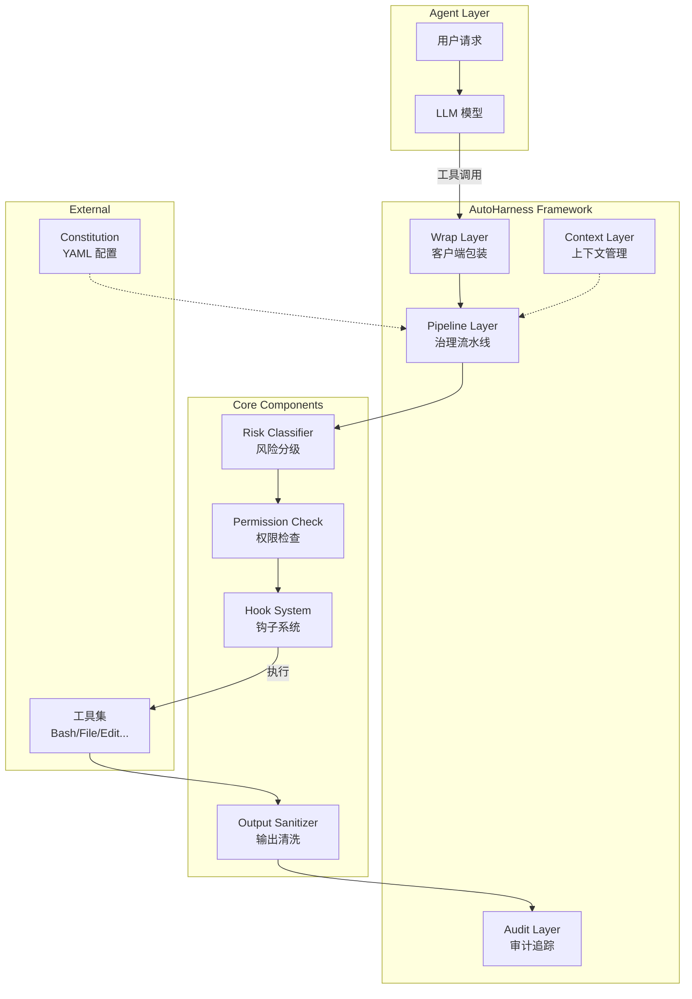
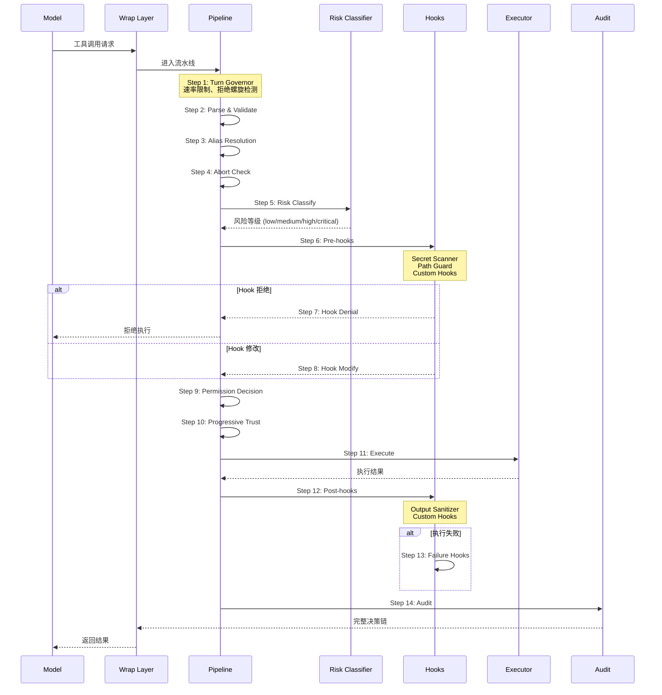
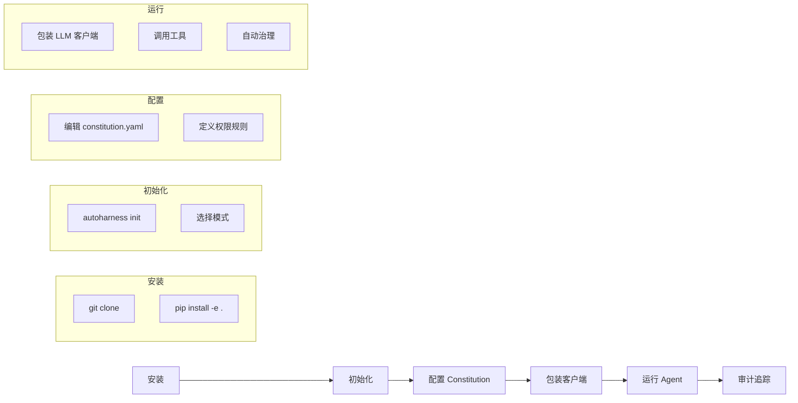

# AutoHarness (Aha) 开源项目技术调研报告

> 项目地址：https://github.com/aiming-lab/AutoHarness
> 调研日期：2026-06-16
> 项目版本：v0.1.1

---

## 📋 基本信息

<p align="center"><b>表1：项目基本信息</b></p>

| 项目 | 内容 |
|-----|------|
| 项目名称 | AutoHarness (代号：Aha) |
| GitHub 地址 | https://github.com/aiming-lab/AutoHarness |
| Star 数 | 325 |
| Fork 数 | 25 |
| License | MIT |
| 主要语言 | Python (3.10+) |
| 当前版本 | v0.1.1 |
| 开源时间 | 2026-04-02 |
| 最后更新 | 2026-06-16 |
| 所属组织 | aiming-lab |

---

## 一、概述与背景

### 1. 项目概述

#### 1.1 项目定位与核心价值

**项目名称**：AutoHarness (代号 "Aha")

**一句话描述**：轻量级 AI Agent 行为治理框架，让每个 Agent 都有它的 "aha" moment。

**核心价值主张**：
- **Agent = Model + Harness**：模型负责推理，Harness 负责其余一切
- **2 行代码集成**：零侵入式设计，立即获得完整治理能力
- **三层治理模式**：Core / Standard / Enhanced，按需选择治理强度
- **958 个测试用例**：经过充分验证的生产级质量

**核心理念**：
> In LLM training, the ***aha* moment** is when a model suddenly learns to reason.
>
> For agents, the ***aha* moment** is when they go from "demo-ready" to truly reliable.

从 "demo-ready" 到 "truly reliable"，这正是 AutoHarness 要解决的问题。

#### 1.2 项目背景与起源

**所属领域**：AI Agent 治理 / Harness Engineering

**问题背景**：
当前 AI Agent 面临的核心挑战：
1. **上下文管理**：Token 爆炸、上下文窗口溢出
2. **工具治理**：Agent 可能执行危险操作（如 `rm -rf /`）
3. **成本控制**：无法追踪每个工具调用的成本
4. **可观测性**：缺乏审计追踪和决策日志
5. **会话持久化**：Agent 状态无法保存和恢复
6. **安全防护**：Prompt 注入攻击、敏感数据泄露

这些问题将 "toy agent" 和 "production agent" 区分开来。AutoHarness 将这种差异称为 **harness engineering**。

#### 1.3 解决的核心问题

**目标痛点**：

| 痛点 | 无 Harness | 有 AutoHarness |
|:-----|:-----------|:---------------|
| 危险操作 | Agent 执行 `rm -rf /`，无法阻止 | 6 步治理流水线拦截、记录、解释原因 |
| 上下文爆炸 | Token 超出限制，对话崩溃 | Token 预算 + 截断策略，自动管理 |
| 成本黑盒 | 不知道哪个工具调用花费多少 | 每次调用都有成本归属，模型感知定价 |
| Prompt 注入 | 攻击绕过检测 | 分层验证：输入护栏 → 执行 → 输出护栏 |
| 审计合规 | 无决策追踪 | JSONL 审计日志，完整决策链 |
| 权限共享 | 所有 Agent 共享同一权限 | 多 Agent Profiles，角色化治理 |

**解决方案核心思路**：
通过治理流水线 (Governance Pipeline) 将所有工具调用纳入可控流程，实现：
- 风险分级 (Risk Classification)
- 权限检查 (Permission Check)
- 输出清洗 (Output Sanitization)
- 审计追踪 (Audit Trail)

#### 1.4 目标用户与使用场景

**目标用户群体**：
1. **AI Agent 开发者**：需要为 Agent 添加安全护栏和治理能力
2. **LLM 应用工程师**：需要管理上下文、控制成本、追踪行为
3. **企业级 AI 部署团队**：需要审计追踪、合规记录、多租户隔离
4. **AI 安全研究员**：需要研究 Agent 行为约束和防御机制

**典型使用场景**：
- 代码助手：防止执行危险命令、保护敏感文件
- 数据分析 Agent：控制数据访问权限、审计操作记录
- 自动化运维 Agent：限制系统操作范围、防止误操作
- 多 Agent 协作：角色分工、权限隔离、消息传递

#### 1.5 项目成熟度评估

<p align="center"><b>表2：项目成熟度指标</b></p>

| 指标 | 数值 |
|:-----|:-----|
| Star 数 | 325 |
| Fork 数 | 25 |
| 测试用例 | 958 个 (全部通过) |
| 代码风格 | Ruff |
| 类型检查 | mypy 严格模式 |
| License | MIT |
| 开源时间 | 2026-04-02 (约 2.5 个月) |

**版本发布节奏**：
- 2026-04-01：v0.1.0 发布，包含三层治理模式、6 步治理流水线、风险模式匹配、YAML Constitution 等

### 2. 设计动机与目标

#### 2.1 设计动机

**为什么要开发这个项目**：

市场上现有的解决方案存在以下问题：

| 方案 | 问题 |
|:-----|:-----|
| LangGraph | 专注于图编排，不提供工具治理 |
| Guardrails AI | 仅关注输出验证，缺少全流程治理 |
| OpenAI SDK | 有简单的 token trimming，但无治理能力 |
| 手写 Harness | 每个环境重复开发，成本高、扩展性差 |

**核心洞察**：
> Agent 的可靠性不是模型能力问题，而是 **harness engineering** 问题。
> 模型负责推理，Harness 负责其余一切：上下文管理、工具治理、成本追踪、安全防护、审计合规。

#### 2.2 与竞品的差异化定位

<p align="center"><b>表3：竞品对比分析</b></p>

| 能力 | AutoHarness | LangGraph | Guardrails AI | OpenAI SDK |
|:-----|:-----------:|:---------:|:-------------:|:----------:|
| 工具治理流水线 | ✅ 6/8/14 步 | ❌ | ⚠️ 仅输出 | ❌ |
| 声明式 YAML 规则 | ✅ | ❌ | ❌ | ❌ |
| 风险模式匹配 | ✅ | ❌ | ⚠️ Hub validators | ❌ |
| 多层上下文管理 | ✅ | ❌ | ❌ | ⚠️ Trimming |
| 追踪诊断 | ✅ | ❌ | ❌ | ❌ |
| 分层验证 | ✅ 输入+执行+输出 | ❌ | ✅ Rails | ❌ |
| 成本归属 | ✅ 每工具/Agent | ❌ | ❌ | ❌ |
| 多 Agent Profiles | ✅ | ✅ Graph | ❌ | ⚠️ Handoff |
| 审计追踪 (JSONL) | ✅ | ❌ | ⚠️ Logfire | ❌ |
| 供应商锁定 | ✅ 无 | ⚠️ LangChain | ✅ 无 | 🔒 OpenAI |
| 集成难度 | ✅ 2 行 | ⚠️ Graph DSL | ⚠️ RAIL XML | ⚠️ SDK |

**核心差异化**：
1. **全流程治理**：从输入到执行到输出的完整流水线
2. **声明式配置**：YAML Constitution 定义行为契约
3. **零侵入集成**：2 行代码包装现有 LLM 客户端
4. **模式分级**：Core / Standard / Enhanced 三种治理强度

#### 2.3 核心设计目标与技术约束

**设计目标及优先级**：

| 优先级 | 目标 | 说明 |
|:------:|:-----|:-----|
| P0 | **零侵入集成** | 2 行代码即可使用，不改变现有工作流 |
| P1 | **分层治理** | Core/Standard/Enhanced 三种模式，按需选择 |
| P2 | **生产级质量** | 958 测试用例、mypy 严格模式、完整文档 |
| P3 | **供应商无关** | 支持 OpenAI、Anthropic、LangChain 等多后端 |

**关键技术约束与取舍**：
- **约束**：不修改模型权重，纯运行时治理
- **取舍**：不提供模型训练/微调能力，专注推理时治理
- **取舍**：不提供图编排 DSL，专注工具治理（可配合 LangGraph 使用）

---

## 二、核心架构

### 3. 整体架构

#### 3.1 架构概览

AutoHarness 采用 **分层治理架构**，核心是 **治理流水线 (Governance Pipeline)**。



**架构设计原则**：

1. **分层解耦**：Wrap → Pipeline → Context → Audit，各层职责清晰
2. **配置驱动**：通过 YAML Constitution 定义行为契约
3. **钩子扩展**：Pre-hooks / Post-hooks 支持自定义逻辑
4. **最小侵入**：通过包装器模式，零修改集成现有客户端

#### 3.2 项目类型分层视角

作为 **框架类项目**，AutoHarness 需要区分 **框架自身的架构** 和 **框架承载的治理实现**：

**框架层（Framework Layer）**：
- **核心循环**：治理流水线 (Governance Pipeline)
- **扩展点**：Hooks、Constitution、Risk Patterns
- **用户配置入口**：YAML 配置文件、CLI 命令、Python API

**实现层（Implementation Layer）**：
- **风险分级**：正则匹配 + 模式库
- **权限检查**：规则引擎 + 拒绝/询问模式
- **上下文管理**：Token 预算 + 截断策略 + 压缩
- **审计追踪**：JSONL 日志 + Trace Store

**两层交互方式**：
```
Constitution (用户配置)
    ↓
Pipeline (框架层) 加载配置
    ↓
Risk/Permission/Hooks (实现层) 执行具体逻辑
    ↓
Audit (框架层) 记录决策链
```

#### 3.3 项目目录结构

```
AutoHarness/
├── autoharness/              # 核心源码
│   ├── __init__.py          # 主入口 (3.5KB)
│   ├── wrap.py              # 客户端包装器 (42KB) - 核心集成层
│   ├── agent_loop.py        # Agent 循环 (27KB) - 完整 Agent 实现
│   ├── core/                # 核心模块
│   │   ├── pipeline.py      # 治理流水线 (52KB) - 核心!
│   │   ├── constitution.py  # 配置管理 (22KB)
│   │   ├── permissions.py   # 权限系统 (23KB)
│   │   ├── risk.py          # 风险分级 (10KB)
│   │   ├── hooks.py         # 钩子系统 (44KB)
│   │   ├── audit.py         # 审计系统 (26KB)
│   │   ├── multi_agent.py   # 多 Agent 支持 (26KB)
│   │   ├── types.py         # 类型定义 (22KB)
│   │   ├── verification.py  # 验证系统 (36KB)
│   │   └── ...              # 其他核心模块
│   ├── agents/              # Agent 类型定义
│   ├── cli/                 # CLI 命令
│   ├── context/             # 上下文管理
│   ├── observability/       # 可观测性
│   ├── rules/               # 规则引擎
│   ├── session/             # 会话管理
│   ├── skills/              # 技能系统
│   ├── tools/               # 工具系统
│   ├── validation/          # 验证模块
│   ├── templates/           # 模板文件
│   └── marketplace/         # 市场/生态
├── examples/                # 示例代码
│   ├── quickstart.py        # 快速开始
│   ├── basic_usage.py       # 基础用法
│   ├── full_pipeline_demo.py # 完整流水线演示
│   ├── constitution.yaml    # 配置示例
│   └── ...                  # 更多示例
├── tests/                   # 测试代码 (958 用例)
├── docs/                    # 文档
├── pyproject.toml           # 项目配置
└── README.md                # 说明文档
```

**关键目录职责**：
- `core/`：框架核心，包含治理流水线、权限系统、风险分级等
- `wrap.py`：客户端包装器，2 行集成入口
- `examples/`：丰富的使用示例，涵盖各种场景

#### 3.4 关键接口概览

**对外暴露的主要接口**：

```python
# 1. 快速包装 (推荐)
from openai import OpenAI
from autoharness import AutoHarness

client = AutoHarness.wrap(OpenAI())

# 2. 完整 Agent 循环
from autoharness import AgentLoop

loop = AgentLoop(model="gpt-5.4", constitution="constitution.yaml")
result = loop.run("Fix the failing tests")

# 3. CLI 命令
# autoharness init --mode enhanced
# autoharness validate constitution.yaml
# autoharness audit summary
```

**配置接口 (Constitution)**：

```yaml
version: "1.0"
mode: enhanced          # core | standard | enhanced

identity:
  name: my-agent
  boundaries:
    - "Only modify files within the project directory"

permissions:
  defaults:
    unknown_tool: ask
    unknown_path: deny
  tools:
    bash:
      policy: restricted
      deny_patterns: ["rm -rf /"]

risk:
  thresholds:
    critical: deny
    high: ask
```

### 4. 核心流程

#### 4.1 核心用例

**主要业务场景**：

| 场景 | 描述 | 优先级 |
|:-----|:-----|:------:|
| 工具调用治理 | 拦截危险操作、记录审计日志 | P0 |
| 上下文管理 | Token 预算、自动截断、压缩 | P0 |
| 多 Agent 协作 | 角色分工、权限隔离、消息传递 | P1 |
| 会话持久化 | 状态保存、恢复、成本追踪 | P1 |
| 安全防护 | Prompt 注入检测、敏感数据保护 | P0 |

#### 4.2 核心流程图/时序图

**Enhanced Mode (14步) 治理流水线**：



**三种模式对比**：

| 步骤 | Core (6步) | Standard (8步) | Enhanced (14步) |
|:----:|:----------:|:--------------:|:---------------:|
| Turn Governor | ❌ | ❌ | ✅ |
| Parse & Validate | ✅ | ✅ | ✅ |
| Alias Resolution | ❌ | ❌ | ✅ |
| Abort Check | ❌ | ❌ | ✅ |
| Risk Classify | ✅ | ✅ | ✅ |
| Interface Check | ❌ | ✅ | ✅ |
| Pre-hooks | ❌ | ✅ | ✅ |
| Hook Denial/Modify | ❌ | ❌ | ✅ |
| Permission Check | ✅ | ✅ | ✅ |
| Progressive Trust | ❌ | ❌ | ✅ |
| Execute | ✅ | ✅ | ✅ |
| Post-hooks & Sanitize | ✅ | ✅ | ✅ |
| Failure Hooks | ❌ | ❌ | ✅ |
| Audit + Trace | ✅ | ✅ | ✅ |

#### 4.3 端到端工作流

**用户从零开始使用的完整流程**：



---

## 三、核心技术实现

### 5. 核心算法与模型

#### 5.1 风险分级算法

**风险分级原理**：

AutoHarness 使用 **正则模式匹配** 进行风险分级，将工具调用分为 4 个等级：

| 等级 | 描述 | 默认策略 |
|:----:|:-----|:--------:|
| Low | 安全操作 | Allow |
| Medium | 需注意操作 | Ask |
| High | 危险操作 | Ask |
| Critical | 极危险操作 | Deny |

**内置风险模式 (9 大类)**：

1. **危险 Shell 命令**：`rm -rf`、`mkfs`、`dd if=`、fork bombs 等
2. **敏感信息检测 (9 种)**：API keys、tokens、密码、私钥、连接字符串、云凭证、JWT secrets、webhook URLs、OAuth secrets
3. **路径遍历**：`../`、symlink 攻击、TOCTOU 保护
4. **网络渗透**：`curl | bash`、reverse shells、编码载荷
5. **权限提升**：`sudo`、`chmod 777`、`chown root`
6. **配置篡改**：`.eslintrc`、`.gitignore`、CI 配置修改
7. **数据销毁**：`DROP TABLE`、`TRUNCATE`、批量删除
8. **凭证文件访问**：`~/.ssh/*`、`~/.aws/*`、`.env` 文件
9. **代码注入**：`eval()`、`exec()`、动态导入不可信源

#### 5.2 上下文管理策略

**多层上下文压缩系统**：

| 层级 | 策略 | 模式 | 描述 |
|:----:|:-----|:----:|:-----|
| L1 | Token Budget | 所有 | 模型感知预算 (200K / 1M 上下文窗口) |
| L2 | Truncation | 所有 | 超预算时最旧优先删除 |
| L3 | Microcompact | Standard+ | 清理旧工具输出，保留最近上下文 |
| L4 | AutoCompact | Enhanced | LLM 摘要 + 熔断器保护 |
| L5 | Image Stripping | Enhanced | 压缩前移除图片 |
| L6 | File Restoration | Enhanced | 压缩后重新注入最近修改的文件 |

**AutoCompact 熔断器**：
- 避免无限循环压缩
- 当压缩效果不佳时自动停止
- 保留关键上下文

#### 5.3 多 Agent 协作模式

**内置 Agent 类型**：

| 类型 | 用途 | 权限配置 |
|:-----|:-----|:---------|
| Explore | 只读快速探索 | 只读工具、低风险阈值 |
| Plan | 架构设计 | 读写权限、中等风险阈值 |
| Verification | 对抗性验证 | 只读 + 验证工具 |
| General | 通用任务 | 完整权限 |

**协作模式**：

| 模式 | 描述 | 模式 | 用例 |
|:-----|:-----|:----:|:-----|
| Profiles | 基于角色的工具/风险限制 | Standard+ | 团队治理 |
| Fork | 子 Agent 继承父上下文 + 共享 prompt cache | Enhanced | 并行探索 (95% 成本降低) |
| Background | 异步执行 + 进度追踪 + 通知 | Enhanced | 长时间任务 |
| Swarm | 并行 Agent 通过 JSONL mailbox 通信 | Enhanced | 分布式工作 |
| Coordinator | 编排器委托所有工具调用给 worker agents | Enhanced | 复杂流水线 |

### 6. 关键模块实现

#### 6.1 核心模块实现原理

**Pipeline 模块 (pipeline.py, 52KB)**：

治理流水线是框架的核心，负责协调所有治理步骤：

```python
# 伪代码示意
class ToolGovernancePipeline:
    def process(self, tool_call):
        # Enhanced Mode: 14 steps
        if self.mode == "enhanced":
            self.turn_governor.check(tool_call)
            self.parse_and_validate(tool_call)
            self.resolve_aliases(tool_call)
            self.check_abort()

        risk_level = self.classify_risk(tool_call)

        if self.mode in ["standard", "enhanced"]:
            self.run_pre_hooks(tool_call)

        decision = self.check_permissions(tool_call, risk_level)

        if decision == "deny":
            return self.audit_and_return(denial)

        result = self.execute(tool_call)

        if self.mode in ["standard", "enhanced"]:
            self.run_post_hooks(result)

        self.audit(tool_call, decision, result)
        return result
```

**关键设计**：
- **步骤可配置**：根据模式选择执行的步骤
- **短路退出**：任意步骤可中断流水线
- **完整追踪**：每步决策都记录到审计日志

#### 6.2 关键数据结构

**Constitution 结构**：

```python
@dataclass
class Constitution:
    version: str
    mode: Literal["core", "standard", "enhanced"]

    identity: AgentIdentity      # 名称、边界
    permissions: Permissions      # 工具权限、路径权限
    risk: RiskConfig             # 风险阈值
    audit: AuditConfig           # 审计配置
    context: ContextConfig       # 上下文管理
    multi_agent: MultiAgentConfig # 多 Agent 配置
```

**ToolCall 生命周期**：

```python
@dataclass
class ToolCallTrace:
    tool_name: str
    tool_input: dict
    risk_level: RiskLevel
    permission_decision: Decision
    execution_result: Any
    timestamp: datetime
    session_id: str
    agent_id: str
```

#### 6.3 核心代码路径分析

**快速集成路径 (wrap.py)**：

```python
# wrap.py 核心逻辑
def wrap(client_class):
    """包装任意 LLM 客户端"""

    class WrappedClient(client_class):
        def __init__(self, *args, constitution=None, **kwargs):
            super().__init__(*args, **kwargs)
            self.pipeline = ToolGovernancePipeline(constitution)

        def chat_completions_create(self, *args, **kwargs):
            # 拦截工具调用
            if "tools" in kwargs:
                return self._governed_create(*args, **kwargs)
            return super().chat_completions_create(*args, **kwargs)

        def _governed_create(self, *args, **kwargs):
            # 流水线处理每个工具调用
            response = super().chat_completions_create(*args, **kwargs)
            for tool_call in response.tool_calls:
                governed = self.pipeline.process(tool_call)
                # 替换为治理后的结果
            return response

    return WrappedClient
```

#### 6.4 创新点与亮点

**技术创新**：

1. **三层模式设计**：Core / Standard / Enhanced，按需选择治理强度
   - 创新点：将治理能力分层，避免过度工程
   - 用户可根据场景选择合适的模式

2. **Progressive Trust**：会话级信任升级
   - 创新点：Agent 可通过用户确认逐步获得更高权限
   - 平衡安全性和易用性

3. **Trace Store**：文件系统级执行追踪
   - 创新点：保留原始 trace 而非摘要
   - 支持事后诊断和模式分析

4. **Anti-Distillation Protection**：防蒸馏保护
   - 创新点：防止 Agent 行为被恶意提取
   - 增强企业级部署安全性

**工程实践亮点**：

1. **958 测试用例**：生产级质量保证
2. **mypy 严格模式**：类型安全
3. **零侵入集成**：2 行代码包装
4. **完整 CLI**：初始化、验证、审计一站式工具

---

## 四、扩展与生态

### 8. 扩展机制

#### 8.1 钩子系统

**Pre-hooks / Post-hooks**：

```python
# 自定义钩子示例
from autoharness import Hook, HookResult

class SecretScannerHook(Hook):
    def pre_execute(self, tool_call):
        # 检测敏感信息
        if self.detect_secrets(tool_call.input):
            return HookResult(deny=True, reason="Secret detected")
        return HookResult(allow=True)

    def post_execute(self, result):
        # 清洗输出中的敏感信息
        return self.sanitize(result)

# 注册钩子
pipeline.register_hook(SecretScannerHook())
```

**内置钩子**：
- Secret Scanner：检测 9 种敏感信息
- Path Guard：路径遍历保护
- Output Sanitizer：输出清洗

#### 8.2 API 与集成

**支持的后端**：

| 后端 | 集成方式 | 状态 |
|:-----|:---------|:----:|
| OpenAI | `AutoHarness.wrap(OpenAI())` | ✅ |
| Anthropic | `AutoHarness.wrap(Anthropic())` | ✅ |
| LangChain | `LangChainIntegration` | ✅ |
| 自定义 | 实现工具调用接口 | ✅ |

**GitHub Action 集成**：

```yaml
# .github/workflows/autoharness.yml
uses: aiming-lab/AutoHarness@main
with:
  constitution: constitution.yaml
```

#### 8.3 配置与自定义

**Constitution 完整示例**：

```yaml
version: "1.0"
mode: enhanced

identity:
  name: code-assistant
  boundaries:
    - "Only modify files within the project directory"
    - "Never access credentials or secret files"

permissions:
  defaults:
    unknown_tool: ask
    unknown_path: deny
    on_error: deny        # Never fail open
  tools:
    bash:
      policy: restricted
      deny_patterns: ["rm -rf /", "curl.*| bash"]
      ask_patterns: ["git push --force", "DROP TABLE"]
    file_write:
      policy: restricted
      deny_paths: ["~/.ssh/*", "**/.env"]
      scope: "${PROJECT_DIR}"

risk:
  thresholds:
    low: allow
    medium: ask
    high: ask
    critical: deny

audit:
  enabled: true
  format: jsonl
  output: .autoharness/audit.jsonl

context:
  token_budget: 180000
  truncation_strategy: oldest_first

multi_agent:
  profiles:
    coder:
      allowed_tools: ["read", "write", "bash"]
      risk_threshold: medium
    reviewer:
      allowed_tools: ["read"]
      risk_threshold: low
```

### 9. 社区与生态

#### 9.1 社区活跃度

| 指标 | 数值 |
|:-----|:-----|
| Star 数 | 325 |
| Fork 数 | 25 |
| 贡献者 | aiming-lab 组织 |
| Issues | 1 open |
| 文档 | 完整 (中/英/日/韩/西/法/德/葡/俄) |

#### 9.2 第三方生态

**集成支持**：
- Claude Code Hook：`autoharness install --target claude-code`
- Cursor IDE：`autoharness export --format cursor`
- OPA Policy：支持 Open Policy Agent
- Cedar Policy：支持 AWS Cedar

### 10. 部署与运维

**安装方式**：

```bash
# 从源码安装
git clone https://github.com/aiming-lab/AutoHarness.git
cd AutoHarness && pip install -e .

# 或通过 pip (未来)
pip install autoharness
```

**依赖要求**：
- Python 3.10+
- pydantic >= 2.0
- pyyaml >= 6.0
- click >= 8.0
- rich >= 13.0

**可选依赖**：
- anthropic >= 0.30.0 (Anthropic 支持)
- openai >= 1.0.0 (OpenAI 支持)
- langchain-core >= 0.2.0 (LangChain 支持)

---

## 五、质量与评估

### 11. 代码质量

**代码规模**：
- 核心代码：~15 个模块，估计 5000+ 行
- 测试代码：958 测试用例
- 示例代码：15 个示例文件

**代码规范**：
- 代码风格：Ruff
- 类型检查：mypy 严格模式
- 测试框架：pytest + pytest-asyncio

**测试覆盖**：
- 单元测试：核心模块全覆盖
- 集成测试：多后端集成
- 异步测试：pytest-asyncio

### 12. 技术评估

#### 12.1 技术优势

**架构优势**：
- 分层解耦，职责清晰
- 模式可选，按需使用
- 零侵入集成，低迁移成本

**性能优势**：
- 流水线高效，最小化延迟
- Token 预算管理，防止上下文爆炸
- 共享 prompt cache，95% 成本降低 (Fork 模式)

**易用性优势**：
- 2 行代码集成
- 声明式 YAML 配置
- 完整 CLI 工具链
- 多语言文档

**生态优势**：
- 支持多后端 (OpenAI、Anthropic、LangChain)
- 支持 IDE 集成 (Claude Code、Cursor)
- 支持策略引擎 (OPA、Cedar)

#### 12.2 技术劣势与风险

**架构局限**：
- 仅支持工具调用治理，不支持模型训练
- 不提供图编排能力，需配合 LangGraph 使用

**性能瓶颈**：
- 风险检测基于正则，可能存在漏报
- LLM 摘要增加额外延迟

**潜在风险**：
- 项目较新 (2.5 个月)，社区生态尚在发展
- Enhanced 模式的 14 步流水线可能引入延迟

#### 12.3 适用场景建议

**推荐使用场景**：
- ✅ 需要为 AI Agent 添加安全护栏
- ✅ 需要管理上下文、控制成本
- ✅ 需要审计追踪、合规记录
- ✅ 需要多 Agent 协作、权限隔离

**不推荐使用场景**：
- ❌ 需要模型训练/微调能力
- ❌ 需要复杂的图编排 DSL
- ❌ 对延迟极度敏感的场景

**使用注意事项**：
1. 根据场景选择合适的模式 (Core/Standard/Enhanced)
2. 配置合理的风险阈值
3. 定期审计日志，优化规则
4. 使用 Fork 模式降低成本

#### 12.4 选型决策建议

**选型评估矩阵**：

| 场景 | AutoHarness | LangGraph | Guardrails AI | 手写 Harness |
|:-----|:-----------:|:---------:|:-------------:|:------------:|
| 工具治理 | ⭐⭐⭐⭐⭐ | ⭐⭐ | ⭐⭐⭐ | ⭐ |
| 图编排 | ⭐ | ⭐⭐⭐⭐⭐ | ⭐ | ⭐⭐ |
| 输出验证 | ⭐⭐⭐⭐ | ⭐⭐ | ⭐⭐⭐⭐⭐ | ⭐⭐ |
| 上下文管理 | ⭐⭐⭐⭐⭐ | ⭐⭐ | ⭐ | ⭐⭐ |
| 集成成本 | ⭐⭐⭐⭐⭐ | ⭐⭐⭐ | ⭐⭐⭐ | ⭐ |

**推荐组合**：
- **AutoHarness + LangGraph**：工具治理 + 图编排
- **AutoHarness + Guardrails AI**：工具治理 + 输出验证

---

## 附录

### A. 参考资源

- **官方仓库**：https://github.com/aiming-lab/AutoHarness
- **文档**：https://autoharness.dev
- **功能详解**：[docs/features.md](https://github.com/aiming-lab/AutoHarness/blob/main/docs/features.md)

### B. 术语表

| 术语 | 解释 |
|:-----|:-----|
| Harness | 脚手架/约束框架，用于管理 Agent 行为的外部代码 |
| Constitution | 行为契约，定义 Agent 权限、风险阈值等的 YAML 配置 |
| Governance Pipeline | 治理流水线，处理工具调用的多步骤流程 |
| Risk Classification | 风险分级，将工具调用分为 low/medium/high/critical |
| Progressive Trust | 渐进式信任，Agent 通过用户确认逐步获得更高权限 |
| Trace Store | 追踪存储，文件系统级执行追踪记录 |

### C. 调研信息

- **调研人**：Claude Code
- **调研时间**：2026-06-16
- **调研版本**：v0.1.1
- **调研深度**：详细
- **重点关注**：架构设计、核心实现、使用方式

---

*报告生成时间：2026-06-16*
