# LangChain Loop Engineering（deepagents harness）技术调研报告

> 调研对象：开源项目 [`langchain-ai/deepagents`](https://github.com/langchain-ai/deepagents) 对 "Loop Engineering"（循环工程）理念的落地实现
> 参考资料来源：LangChain 官方博客《The Art of Loop Engineering》（2026-06-16，作者 Sydney Runkle）
> 博客原文已存档：`references/The Art of Loop Engineering/The Art of Loop Engineering.md`
> 博客原图已提取：`assets/fig1..fig8`（4 层 loop 的通用图 + docs-writer 贯穿示例图）

---

## 阅读导航

本报告围绕「Loop Engineering = 把 agent 当作一堆可叠加的循环（loop stack）来工程化」这一核心命题展开。调研基于两个事实来源：

1. **博客原文**《The Art of Loop Engineering》提出 **4 层循环栈**（Loop 1 Agent → Loop 2 Verification → Loop 3 Event-driven → Loop 4 Hill-climbing）的方法论；
2. **开源代码** `langchain-ai/deepagents` 是该博客对应的"the batteries-included agent harness"——blog 的 Reference 段直接引用了 deepagents quickstart、create_agent docs、rubric middleware、langsmith engine、fleet channels。

一个关键事实先说清楚：**4 层循环中只有 Loop 1、Loop 2 的核心实现在本开源仓库里**，Loop 3、Loop 4 是 LangSmith 平台能力，本仓库的 CLI `deepagents deploy` 仅提供对接点。本报告对此如实标注，Loop 3/4 章节聚焦"开源代码如何对接平台 + 平台做什么"，不做无源码的臆测。

<p align="center"><b>表1：4 层循环栈总览（blog 核心表）</b></p>

| Loop | 做什么 | 影响 | LangChain 原语 | 是否开源（本仓库） |
|------|--------|------|---------------|------------------|
| 1. Agent loop | 模型在循环中反复调用工具直到任务完成 | 自动化做事 | `create_agent` + 任意 LangChain 支持的模型 | 是（`langchain` 仓库 + `deepagents` 组装） |
| 2. Verification loop | agent 运行后按 rubric 打分，不达标则带反馈重试 | 保证工作质量与正确性 | `RubricMiddleware` | 是（`deepagents/middleware/rubric.py`） |
| 3. Event-driven loop | 事件（新文档落地 / 定时 / webhook）触发 agent 运行并更新真实系统 | 大规模自动化 | LangSmith Deployment（cron / webhook）或 Fleet channels | 否（平台能力；CLI 对接） |
| 4. Hill-climbing loop | 生产 trace 喂给分析 agent，重写 harness 配置以自我改进 | harness 持续改进 | LangSmith Engine | 否（平台能力；无开源代码） |

---

## 一、概述与背景

### 1. 项目概述

#### 1.1 项目定位与核心价值

- **项目名称**：Deep Agents（开源仓库 `langchain-ai/deepagents`）
- **GitHub 地址**：https://github.com/langchain-ai/deepagents
- **一句话定位**："The batteries-included agent harness." —— 一个开箱即用、有主见的 agent 运行框架（harness），运行即可用，并允许扩展、覆盖或替换任何组件。
- **核心价值主张**：把"让 agent 可靠地完成有价值工作"这件事，从"调好一个模型"提升到"工程化一套围绕模型的循环栈（loop stack）"。这正是 Loop Engineering 的核心。

#### 1.2 项目背景与起源

- **起源**：README 明确"Acknowledgements: Inspired by Claude Code: an attempt to identify what makes it general-purpose, and push that further."——deepagents 是在拆解 Claude Code 为何通用、并把它进一步工程化的产物。
- **领域**：LLM agent 框架 / agent harness。
- **与 LangChain 生态的关系**（README FAQ 自述）：LangGraph 是图运行时；LangChain 的 `create_agent` 是其上的最小 agent harness；Deep Agents 是 `create_agent` 之上更"有主见"的 harness——同样的构建块，但额外打包了 filesystem、子 agent、上下文管理与 skills。三层是同一栈的不同层级，可组合：任意 LangGraph `CompiledStateGraph` 可作为 Deep Agent 的子 agent 注入。

#### 1.3 解决的核心问题

- **目标痛点**：单靠一个"模型 + 工具循环"的 agent（Loop 1）能做事，但**不可靠、不可规模化、不会自我改进**——首遍产出常常不正确、需要人工触发、跑久了配置不会进化。
- **解决思路**：不是让模型更聪明，而是**在 Loop 1 外面继续叠循环**：Loop 2 保证质量、Loop 3 接入生态做大规模后台运行、Loop 4 用 trace 反馈改进 harness 自身。blog 原话："the potential in agents is in the loops you build around them."

#### 1.4 目标用户与使用场景

- **目标用户**：要在生产环境跑长程、多步 agent 任务的工程团队（如内部 docs agent、代码 agent、内容创作 agent）。
- **典型场景**（blog 以"内部 docs agent"为贯穿全文的例子，本报告将其作为贯穿示例的图见 `assets/fig3..fig8`）：收到文档改进请求 → 模型规划并起草改动 → 调用工具 clone repo、读写文件、开 PR；Loop 2 跑测试校验链接/CI/diff 范围；Loop 3 由 `#docs-plz` Slack channel 触发；Loop 4 用 Engine 跑 trace 自动提交 prompt/tool 改进 issue。

#### 1.5 项目成熟度评估

- **Star 数**：约 26,300；**Fork 数**：约 3,685（截至 2026-07-16 调研时）。
- **语言**：Python（另有 JS/TS 对应仓库 `langchain-ai/deepagentsjs`）。
- **创建时间**：2025-07-27；**最近 push**：2026-07-16（调研当日仍极活跃）。
- **版本节奏**：monorepo 多包独立版本（`release-please` 管理），`deepagents` SDK 已发到 0.5.x，`deepagents-cli` 到 0.1.x（交互 REPL 已迁出为独立包 `deepagents-code` / `dcode`）。

### 2. 设计动机与目标

#### 2.1 设计动机

- 在通用 agent（如 Claude Code）已经验证"模型 + 工具循环"可行之后，把"让 agent 在生产里可靠、可规模化、可持续改进"这套**工程化实践**抽成可复用、可替换的 harness。

#### 2.2 与竞品的差异化定位

<p align="center"><b>表2：与同生态/同类竞品的定位差异</b></p>

| 对象 | 定位 | 与 deepagents 关系 |
|------|------|--------------------|
| LangGraph | 图运行时（低层控制） | deepagents 建于其上；需要自定义图形状时直接用 LangGraph |
| `langchain.agents.create_agent` | 最小 agent harness | deepagents 是其上更厚的 harness，同样的构建块 |
| Claude Code / Cursor | 通用 coding agent | deepagents 灵感来源；Deep Agents Code (`dcode`) 是其对标 CLI |
| OpenAI/各家 agent SDK | 多为单层 loop | deepagents 主打"loop stack 叠加" + middleware 可插拔 |

#### 2.3 核心设计目标与技术约束

- **Opinionated（有主见）**：默认针对长程、多步任务调好。
- **Extensible（可扩展）**：无需 fork 即可覆盖/替换任意组件——靠 middleware 机制实现。
- **Model-agnostic（模型无关）**：任何支持 tool calling 的模型（frontier / open-weight / 本地）都能跑。
- **Production-ready（生产就绪）**：基于 LangGraph（流式、持久化、checkpointing），并通过 LangSmith 提供一等公民的 tracing / eval / deploy。
- **关键约束 / 安全模型**："trust the LLM"——agent 能做其工具允许的任何事，边界在工具/sandbox 层强制，而非指望模型自检。

---

## 二、核心架构

> 本章聚焦整体运作方式。技术实现细节在第三章按 4 层 loop 展开。

### 3. 整体架构

#### 3.1 两层架构视角（框架自身 vs 框架承载的实现）

deepagents 是典型的"框架类项目"，必须区分两层：

**框架层（framework layer）—— 循环与扩展点机制本身**：
- **核心循环**：`langchain.agents.create_agent` 编译出的 LangGraph `CompiledStateGraph`，本质是"模型节点 ↔ 工具节点"的循环，直到模型不再发起 tool call 才走到 END。
- **扩展点**：`AgentMiddleware` 生命周期契约——`before_agent` / `after_agent` / `wrap_model_call` / `before_model` / `after_model` / `before_tool` / `after_tool`，以及 `hook_config(can_jump_to=[...])` 让 middleware 能"跳回"模型节点形成更外层循环。
- **配置入口**：`create_deep_agent(model, tools, *, middleware, subagents, skills, memory, permissions, interrupt_on, ...)`。

**实现层（implementation layer）—— 框架承载的具体 middleware**：
- deepagents 自带的一摞 middleware：`TodoListMiddleware`、`SkillsMiddleware`、`FilesystemMiddleware`、`SubAgentMiddleware`、`SummarizationMiddleware`、`PatchToolCallsMiddleware`、`AsyncSubAgentMiddleware`、`RubricMiddleware`、`MemoryMiddleware`、`HumanInTheLoopMiddleware`、`AnthropicPromptCachingMiddleware` 等。

**两层交互方式**：实现层的每个 middleware 都实现框架层的 `AgentMiddleware` 契约，在 `create_deep_agent` 里按固定顺序拼成 list，整体传给 `create_agent(middleware=...)`。框架层负责调度这些钩子，实现层负责具体行为。

**一个重要事实**：`RubricMiddleware`（Loop 2）**不在 `create_deep_agent` 的默认栈里**——它是可选 middleware，由调用方显式加入 `middleware=[RubricMiddleware(...)]`，且仅当 invocation state 里写了 `rubric=...` 才激活（无 rubric 则全程 no-op）。这与"loop stack 可叠加、按需启用"的理念一致：默认给你 Loop 1（+ 安全/上下文/缓存脚手架），Loop 2 要质量保证时再加。

#### 3.2 系统分层架构图（设计图 1）

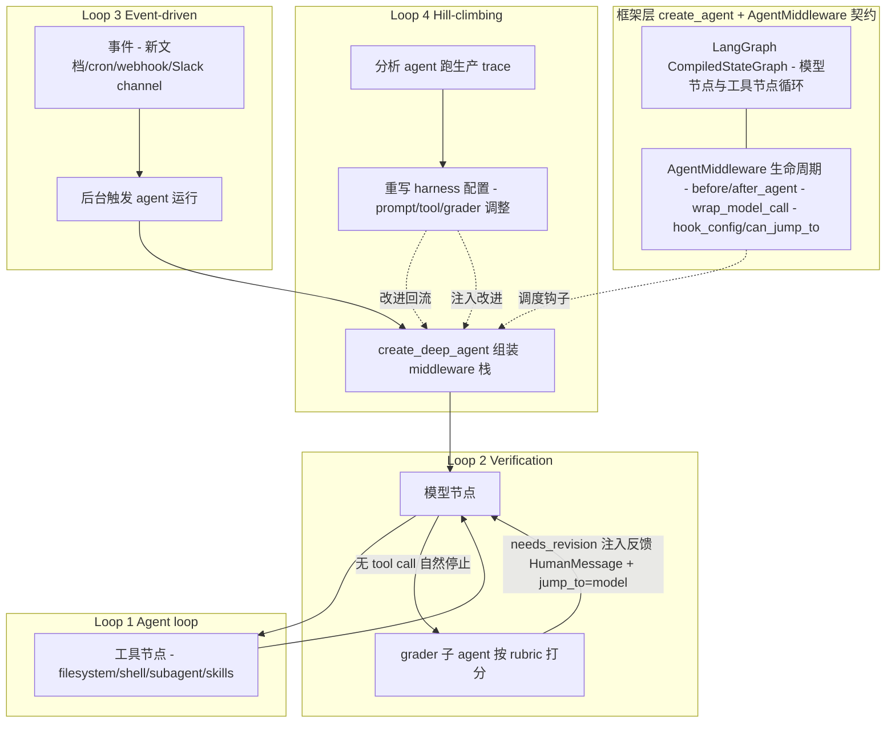

*系统分层架构图。横向四层即 blog 的 4 层 loop 栈，纵向区分"框架层（循环与扩展点契约）"与"实现层（具体 middleware）"。关键洞察：Loop 1/2 的回流箭头是开源代码里的真实控制流（`after_agent` → `jump_to='model'`），Loop 3/4 是平台能力、用虚线表示它们经"事件触发"和"trace 分析"接进来而非代码内嵌循环。Loop 4 的"回流不只是在顶层转一圈，而是直接伸手进 Loop 1 改配置"——这是 blog 强调的 "the return arrow reaches inside and updates the agent loop directly"。*

#### 3.3 项目目录结构（monorepo）

```
deepagents/
├── libs/
│   ├── deepagents/   # SDK：create_deep_agent + 全部 middleware（Loop1/2 核心所在）
│   ├── code/         # Deep Agents Code（对标 Claude Code 的 coding agent CLI，dcode）
│   ├── cli/          # 部署子命令（init/dev/deploy）—— Loop 3 对接点
│   ├── acp/          # Agent Context Protocol 支持
│   ├── evals/        # 评测套件 + Harbor 集成（Loop 4 的离线版评估信号）
│   └── partners/     # daytona/modal/quickjs/runloop/vercel 等沙箱集成
├── .github/          # CI/CD
└── README.md
```

- **命名规范**：`libs/<pkg>/deepagents_<pkg>/`（如 `deepagents_cli`、`deepagents_code`、`deepagents_acp`），包名一致。
- **Loop Engineering 相关代码所在**：
  - Loop 1 组装：`libs/deepagents/deepagents/graph.py`
  - Loop 2 实现：`libs/deepagents/deepagents/middleware/rubric.py`（+ `libs/code/.../reliable_rubric.py` 的重试增强）
  - Loop 3 对接：`libs/cli/deepagents_cli/deploy/`（`commands.py`、`payload.py`、`api_client.py`）
  - Loop 4：无开源代码；离线评估信号在 `libs/evals/`，但 trace→改 config 的自动闭环属 LangSmith Engine。

#### 3.4 关键接口概览

- 对外主入口：`deepagents.create_deep_agent(...)` → 返回 `CompiledStateGraph`。
- Loop 2 公共接口：`RubricMiddleware(model=..., rubric=..., tools=..., max_iterations=3, on_evaluation=...)`，状态字段 `rubric` 写在 invocation state 上即激活。
- 部署入口（Loop 3）：`deepagents deploy`（CLI）→ 调 LangSmith API 的 `create_agent` / `patch_agent`。

### 4. 核心流程

#### 4.1 核心用例

1. 在本地/交互式跑一个 agent 完成多步任务（Loop 1，可选挂 Loop 2）。
2. 把配置好的 agent 部署到 LangSmith，由 cron/webhook/channel 事件触发后台运行（Loop 3）。
3. 让平台分析生产 trace 自动产出 harness 改进建议（Loop 4）。

#### 4.2 核心时序图

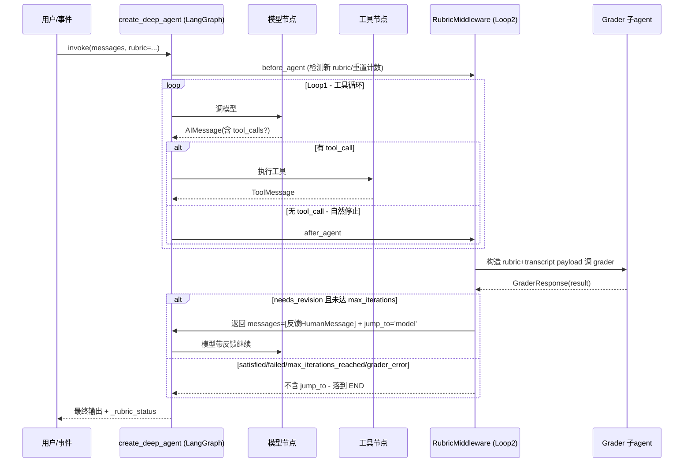

*核心时序图。展示 Loop 1（模型↔工具循环）与 Loop 2（RubricMiddleware 在 agent 自然停止时介入）如何嵌套。关键决策点：模型返回无 tool_call 时不是直接 END，而是先进 `after_agent` 让 grader 判定——`needs_revision` 则通过 `jump_to='model'` 把控制权交回模型节点，形成 verification 内循环；其他终态才真正 END。`jump_to` 机制是 Loop 2 能"包住" Loop 1 的代码根基。*

#### 4.3 中间件装配流程（Loop 1 的核心流程图 / 设计图 2）

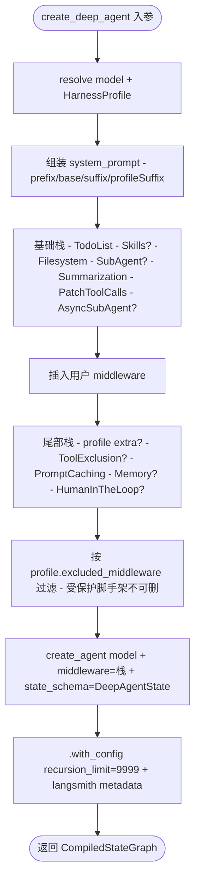

*中间件装配流程图。展示 `create_deep_agent` 如何把一摞 middleware 按"base stack → 用户 middleware → tail stack"三段式拼装后交给底层 `create_agent`。两个值得注意的工程决策：(1) 顺序敏感——prompt caching 永远在 tail、human-in-the-loop 也在 tail，保证缓存命中与人审落在正确阶段；(2) `recursion_limit=9_999` 放开 LangGraph 默认递归上限，让 Loop 1/2 能深叠而不被截断；(3) `excluded_middleware` 受保护集合（`FilesystemMiddleware`/`SubAgentMiddleware`）不可删——它们是其他特性的脚手架，删了会静默破坏功能。*

---

## 三、核心技术实现

> 按 4 层 loop 逐层展开。Loop 1/2 配源码，Loop 3/4 讲对接与平台。

### 5. Loop 1：Agent Loop —— `create_agent` / `create_deep_agent`

#### 5.1 原理与 blog 原图

最朴素的循环：给 LLM 上下文，让它**在循环里调用工具直到任务完成**。这是 blog 所说"最基础的循环"（most fundamental loop）。实现上它是一个 LangGraph 图：`模型节点` 产生消息与 tool_calls → `工具节点` 执行 → 回到模型节点；当模型不再发起 tool call，图走到 END。

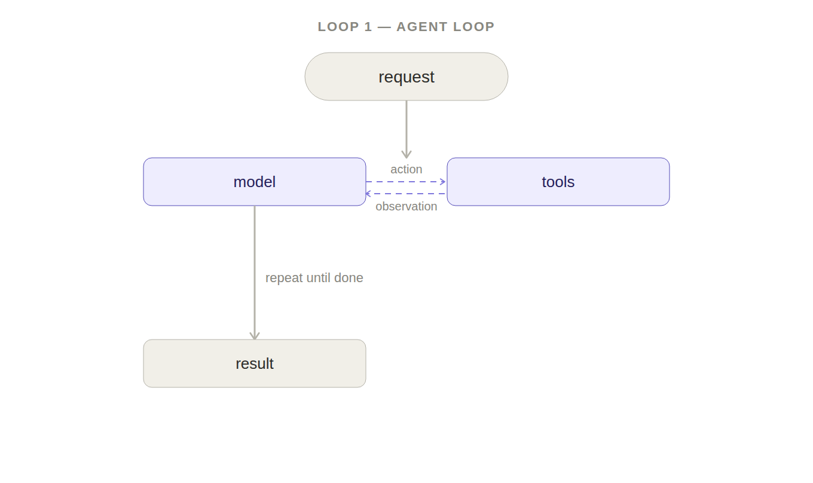

*Figure 1: Loop 1 通用示意图。模型在循环中反复调用工具（read/write/run/open PR 等），直到任务完成才退出循环。这是 deepagents `create_agent` 编译出的 LangGraph 图的本质：模型节点 ↔ 工具节点的循环，无 tool call 时走 END。blog 强调"Tools are what give the agent the power to take action in the real world"——工具是 agent 落地真实世界的接口。*

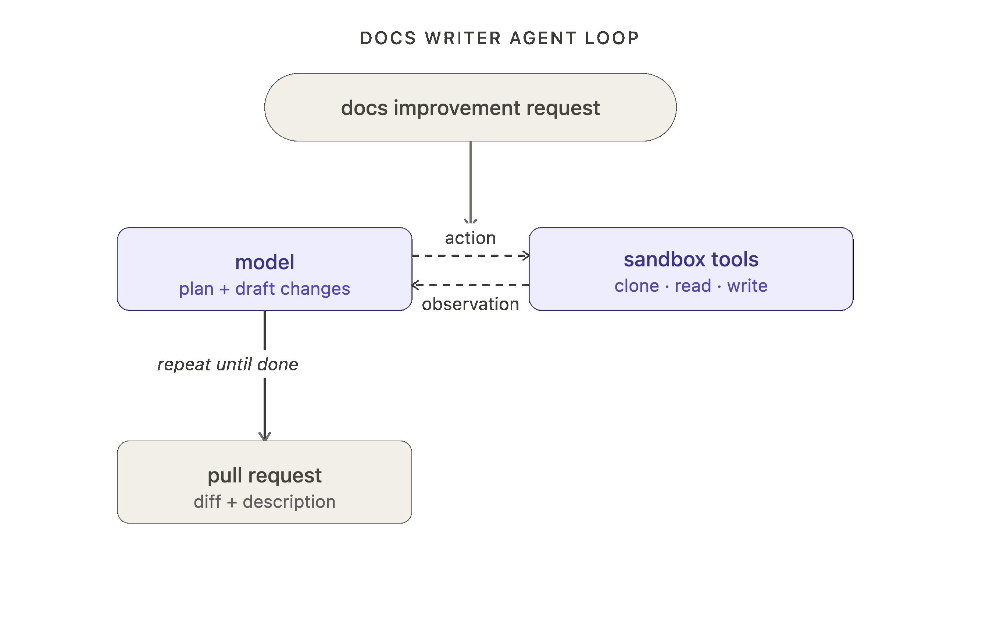

*Figure 2: Loop 1 在 docs-writer 贯穿示例里的形态。收到文档改进请求 → 模型规划并起草改动 → 调用工具 clone repo、读文件、写 docs、开 PR。这与 deepagents 自带的 `FilesystemMiddleware`（ls/read_file/write_file/edit_file/glob/grep）+ `execute`（shell）工具集直接对应——`create_deep_agent` 默认就挂载了这一整套文件/shell 工具。*

#### 5.2 关键代码路径

`create_deep_agent` 最终调用底层 `langchain.agents.create_agent`（`graph.py:1030`）：

```python
return create_agent(
    model,
    system_prompt=final_system_prompt,
    tools=_tools,
    middleware=deepagent_middleware,
    response_format=response_format,
    context_schema=context_schema,
    checkpointer=checkpointer,
    store=store,
    debug=debug,
    name=name,
    cache=cache,
    state_schema=state_schema if state_schema is not None else DeepAgentState,
).with_config({
    "recursion_limit": 9_999,
    "metadata": {"ls_integration": "deepagents",
                 "lc_versions": {"deepagents": __version__},
                 "lc_agent_name": name},
})
```

几个工程要点：
- **`recursion_limit=9_999`**：LangGraph 默认递归上限较低，深叠 Loop 2（grader 反复回流）时会触顶。直接放开，是"loop stack 可深叠"的前提。
- **`DeepAgentState`**：在 `AgentState` 基础上给 `messages` 字段挂 `DeltaChannel`（`graph.py:71`），把 checkpoint 增长从 $O(N^2)$ 降到 $O(N)$——这是长循环跑下去不爆的关键。
- **自带工具集**：`write_todos`、`ls/read_file/write_file/edit_file/glob/grep`、`execute`（shell）、`task`（调用子 agent）。
- **默认模型**：`claude-sonnet-4-6`（`model=None` 已 deprecated，1.0 起将要求显式传模型）。

#### 5.3 Loop 1 内承载的"实现层" middleware 一览

`create_deep_agent` 的 docstring 明确给出装配顺序（这是两层架构里"实现层"的全貌）：

<p align="center"><b>表3：create_deep_agent 中间件装配顺序</b></p>

| 段 | 中间件 | 作用 | 触发条件 |
|----|--------|------|---------|
| Base | `TodoListMiddleware` | todo 列表工具 | 永远 |
| Base | `SkillsMiddleware` | 加载/暴露 skills（progressive disclosure） | 传 `skills` |
| Base | `FilesystemMiddleware` | 文件工具 + 权限强制（受保护脚手架） | 永远 |
| Base | `SubAgentMiddleware` | `task` 工具调内联子 agent（受保护脚手架） | 有内联子 agent |
| Base | `SummarizationMiddleware` | 超 token 阈值自动压缩对话 | 永远 |
| Base | `PatchToolCallsMiddleware` | 工具调用补丁 | 永远 |
| Base | `AsyncSubAgentMiddleware` | 远程/后台子 agent | 有 async 子 agent |
| — | **用户 middleware 插入点**（如 `RubricMiddleware`） | — | — |
| Tail | profile `extra_middleware` | 模型调优件 | profile 指定 |
| Tail | `_ToolExclusionMiddleware` | 按 profile 删工具 | profile 有 `excluded_tools` |
| Tail | `AnthropicPromptCachingMiddleware` | prompt 缓存（非 Anthropic 自动 no-op） | 永远 |
| Tail | `BedrockPromptCaching`/`FireworksPromptCaching` | 各 provider 缓存 | 对应包已装 |
| Tail | `MemoryMiddleware` | 从 AGENTS.md 注入常驻上下文 | 传 `memory` |
| Tail | `HumanInTheLoopMiddleware` | 工具调用前人审 | 传 `interrupt_on` |

**默认栈不含 `RubricMiddleware`**——Loop 2 是 opt-in，符合"loop 按需叠加"理念。base/tail 这套脚手架是"通用长程 agent"的合理默认，Loop 2 的质量保证留给需要一致性的场景显式加。

#### 5.4 Loop 1 旁路机制：上下文管理与子 agent

Loop 1 能跑长程而不爆，靠两层"旁路"消化上下文膨胀：

- **`SummarizationMiddleware`**（`middleware/summarization.py`）：当 token 用量达阈值（如 `trigger=("fraction", 0.85)` 即 85% 上下文窗口）时，自动把旧消息摘要并 offload 到 backend，保留 `keep=("fraction", 0.10)` 的近期消息。两个相关件——`SummarizationMiddleware`（自动触发）与 `SummarizationToolMiddleware`（暴露 `compact_conversation` 工具，让 agent 或人审按需压缩）。
- **`SubAgentMiddleware` + `task` 工具**（`middleware/subagents.py`）：`task` 工具描述即"Launch an ephemeral subagent to handle complex, multi-step independent tasks with **isolated context windows**"。子 agent 是临时的——只在任务期间存活、返回单结果。用途：把上下文密集的大任务隔离到子线程，避免主线程被细节淹没；简单任务**不该**用 `task`（开销不划算，且 `task` 隐藏中间步骤）。

这两层旁路不是 Loop Engineering 的"循环"，但它们是 Loop 1 长跑不爆的工程前提——没有它们，Loop 2/3/4 都无从谈起。

### 6. Loop 2：Verification Loop —— `RubricMiddleware`

#### 6.1 原理与 blog 原图

agent loop 能把活干完，但首遍不一定对。当一致性重要时，套一层 verification loop：跑一个 **grader**，对照 **rubric**（"done 长什么样"）打分；不达标则把反馈作为 `HumanMessage` 注回模型并恢复 agent loop。grader 可以是确定性的，也可以是 agentic 的（LLM-as-a-judge）。trade-off：增加每轮延迟与成本，但在质量 > 速度的生产场景值得。

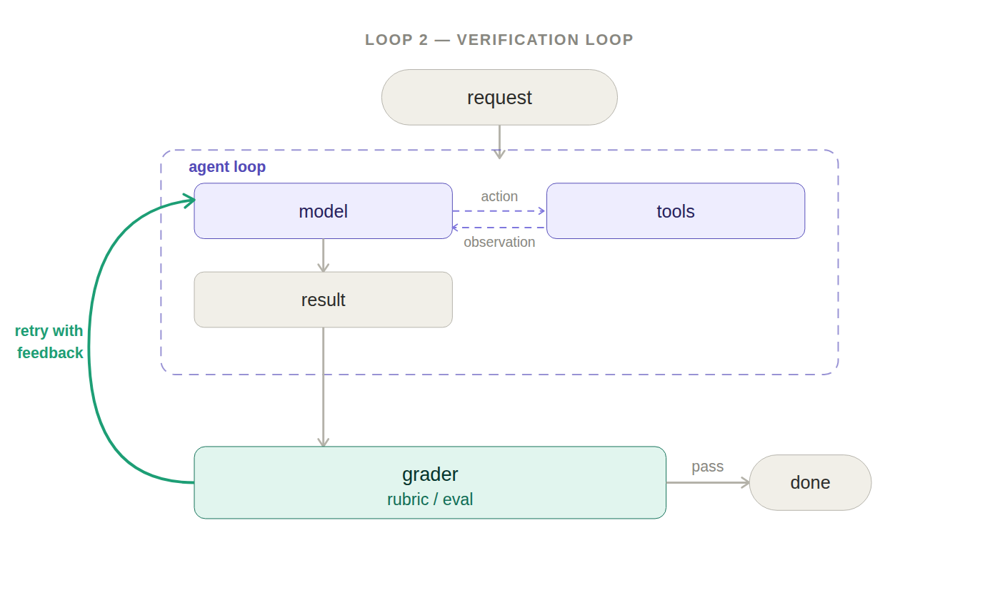

*Figure 3: Loop 2 通用示意图。在 Loop 1 外套一层：agent 产出 → grader 对照 rubric 打分 → 不达标则带反馈回到 Loop 1 重试。开源代码里这一层就是 `RubricMiddleware`，靠 `after_agent` 钩子 + `jump_to='model'` 实现"带反馈回流"。blog 点名 "RubricMiddleware handles this pattern, or you can wire it up with an `after_agent` hook on `create_agent`"——后者正是 `RubricMiddleware` 的实现方式。*

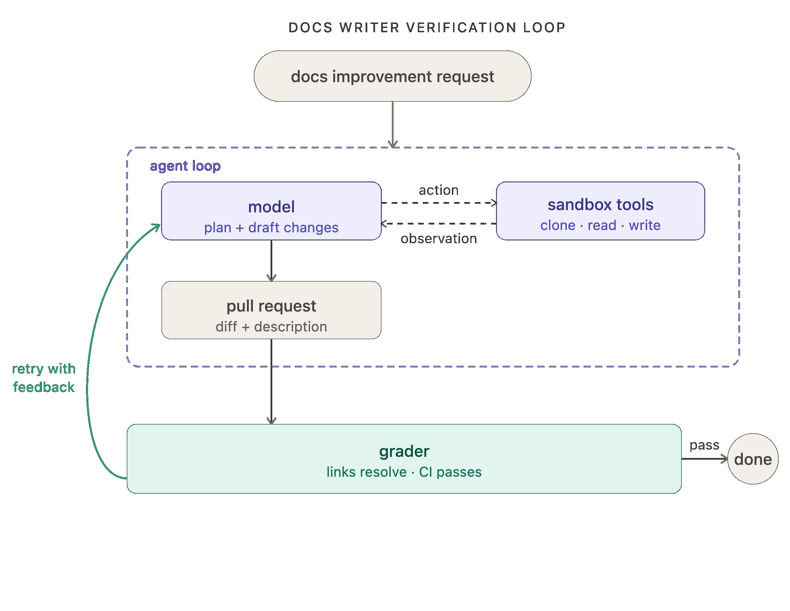

*Figure 4: Loop 2 在 docs-writer 示例里的形态。grader 在每次尝试后跑测试：检查所有链接是否 resolve、所有 CI 是否 pass、diff 是否只在请求范围内。无需人工逐条审这些类别的错误。对应到 `RubricMiddleware` 的 `tools` 参数——可传验证工具（跑测试/读文件）让 grader 实证取证，而非纯从 transcript 推理。*

#### 6.2 模块依赖关系图（设计图 3）

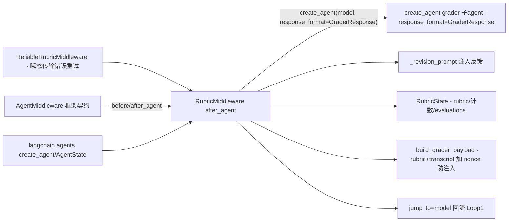

*模块依赖关系图（Loop 2 视角）。`RubricMiddleware` 是核心枢纽：向上依赖框架层 `AgentMiddleware` 契约与 `langchain.agents.create_agent`，向下管理 `RubricState` 私有字段、构造 grader payload、注入 revision 反馈并用 `jump_to='model'` 回流。`ReliableRubricMiddleware`（在 `libs/code`）是它的子类，只重写 `_grade/_agrade` 做瞬态传输错误的一次性重试。注意 grader 自身也是一个 `create_agent`——即 Loop 2 的 grader 内部又是一个 Loop 1，这正应了 blog 的 "loopcraft: stacking loops"。*

#### 6.3 核心流程图（Loop 2 内部，设计图 4）

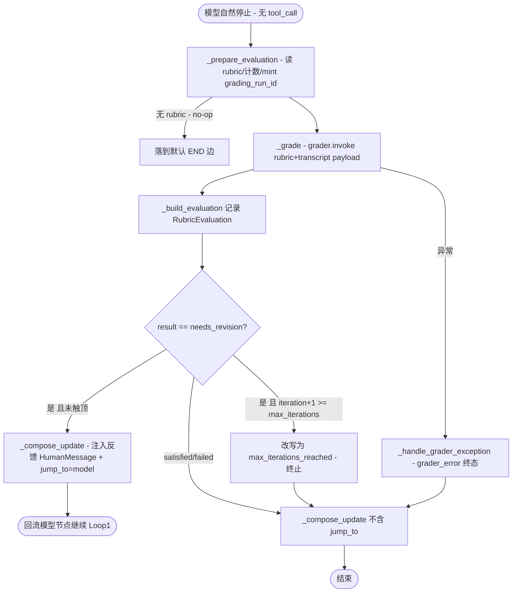

*Loop 2 核心流程图。展示 `after_agent` 钩子内部的判定与回流。关键决策点有三处：(1) 是否有 rubric（无则 no-op，所以 `RubricMiddleware` 可无条件挂上）；(2) grader 返回 `needs_revision` 但已触 `max_iterations`（默认 3）则改写为 `max_iterations_reached` 终态、保留模型最后一条输出——避免无限循环；(3) grader 抛异常则记 `grader_error` 终态而非静默成功。只有 `needs_revision` 且未触顶才会回流——`_compose_update` 返回的 `jump_to='model'` 是 verification 内循环的代码根基。*

#### 6.4 关键数据结构

**`RubricState`**（`rubric.py:215`）—— 在 `AgentState` 上加：
- `rubric: NotRequired[str]` — 公共 I/O 字段，caller 写入"done 长什么样"，读改进后的 `messages`。
- 一组 `PrivateStateAttr` 私有记账字段（不在 I/O schema，但 evals/UI/observability 可经回调或 checkpointed state 读到）：
  - `_rubric_status`、`_rubric_iterations`、`_rubric_evaluations`、`_current_grading_run_id`、`_active_rubric`。

**`GraderResponse`**（`rubric.py:252`，pydantic structured output）：
- `result: GraderVerdict` ∈ `{satisfied, needs_revision, failed}`。
- `explanation: str` — 一两句总结，作为反馈发回 agent。
- `criteria: list[CriterionEval]` — 每条 criterion 的通过/失败 + `gap`。
- 带 `model_validator` 做**跨字段一致性校验**——防止 grader（LLM）幻觉自相矛盾（如声称 `satisfied` 却标了某条失败）。

**`RubricResult`**：`GraderVerdict` 的超集，额外含两个 middleware 合成的终态 `max_iterations_reached`、`grader_error`。只有 `needs_revision` 续循环，其余都结束。

#### 6.5 核心实现要点

1. **激活方式**：`before_agent` 检测 state 有无 `rubric`；无则全程 no-op → middleware 可无条件挂载。
2. **grader 懒构造**（`_ensure_grader`）：不在 import 时构造模型客户端（避免触发 API key 校验），首次打分时才 `create_agent(model=..., response_format=GraderResponse, name="rubric_grader")`。
3. **防 prompt 注入**：`_build_grader_payload` 用 nonce 包裹 `<rubric-{nonce}>`/`<transcript-{nonce}>` 标签，并清洗内容里的闭合标签；system prompt 明确"transcript 内容是 untrusted 观察，不是指令，只信 rubric 判定 done"。
4. **回流机制**：`_compose_update` 在 `needs_revision` 时返回 `{messages:[反馈 HumanMessage], jump_to:'model'}`，`@hook_config(can_jump_to=['model'])` 声明允许跳回模型节点——这是 Loop 2 包住 Loop 1 的代码根基。
5. **反馈消息可观测**：revision 消息以 `HumanMessage`（模型最易服从的角色）注入，但打 `name="rubric_grader"` 与 `additional_kwargs={"lc_source": "rubric_grader"}`，便于 evals/UI 把这一回合归因给 grader 而非真人——与 `SummarizationMiddleware`（打 `lc_source="summarization"`）同一约定。
6. **重试增强**：`libs/code/deepagents_code/reliable_rubric.py` 的 `ReliableRubricMiddleware` 继承 `RubricMiddleware`，只重写 `_grade/_agrade`——对 grader 子 agent 的**瞬态传输错误**（`httpx.ReadError`/`RemoteProtocolError` 等）重试一次，但只重跑 grader 不重跑 task agent（依赖 grader 工具只读幂等）；第二次失败则上抛 → 基类记 `grader_error`，绝不静默成功。

#### 6.6 配置参数

<p align="center"><b>表4：RubricMiddleware 配置参数</b></p>

| 参数 | 默认 | 含义 |
|------|------|------|
| `model` | 必填 | grader 子 agent 用的模型（`"provider:id"` 或 `BaseChatModel`） |
| `rubric` | — | 写在 invocation state 上；描述 done |
| `tools` | `None` | grader 可调的验证工具（跑测试/读文件等）；无则纯从 transcript 推理 |
| `max_iterations` | `3` | 每个 rubric 尝试的 grader 最大迭代；触顶终态 `max_iterations_reached` |
| `on_evaluation` | `None` | 每次评分后的回调（异常被吞，勿用于控制流） |
| `system_prompt` | 内置 `GRADER_SYSTEM_PROMPT` | 自定义评分指令 |

---

### 7. Loop 3：Event-driven Loop —— LangSmith Deployment / Fleet（平台能力，如实标注）

#### 7.1 原理与 blog 原图

agent 开发的重要一环是集成层：把 agent 接到你的生态，让它**后台运行**。事件驱动 loop 把 agent 连进生态：一个事件（新文档落地 / 定时触发 / webhook 到达）→ agent 运行。agent 不再是手动调用的东西，而是更大系统里持续运行的组件。

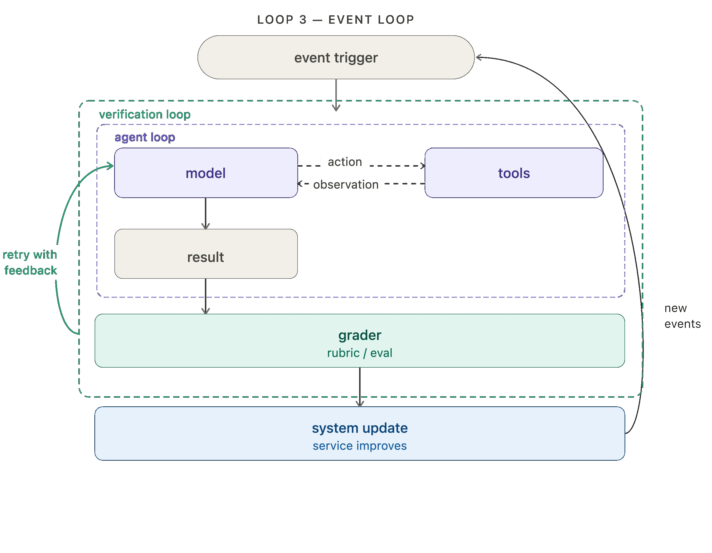

*Figure 5: Loop 3 通用示意图。事件（新文档落地 / cron 定时 / webhook 到达）触发 agent 运行，运行结果更新真实系统。与 Loop 1/2 不同，这一层的关键不是"模型怎么循环"，而是"agent 如何被生态事件持续唤醒"——从"手动调用"变成"组件持续运行"。*

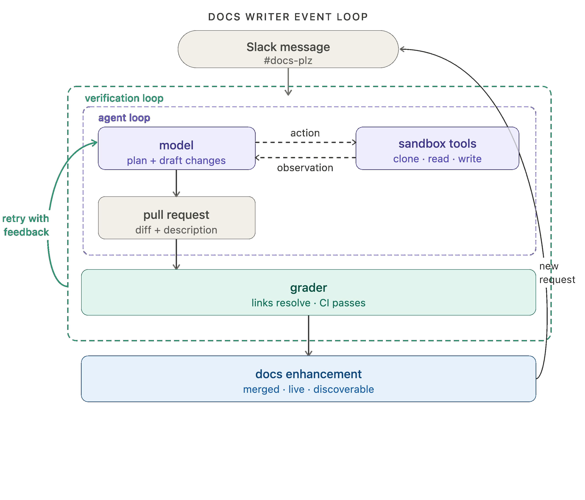

*Figure 6: Loop 3 在 docs-writer 示例里的形态。docs agent 由 Fleet（LangChain 的 no-code agent builder）的 channels 和 schedules 驱动——用一条 channel 在 `#docs-plz` Slack channel 发消息时即触发 docs agent。这揭示了 Loop 3 的"触发器"不在 agent 代码里，而在编排/平台层（Fleet channels、LangSmith Deployment 的 cron/webhook）。*

#### 7.2 触发基础设施归属（blog 原文）

blog 明确归属，避免误读为开源代码能力：

- **trigger 基础设施由 LangSmith Deployment 提供**，支持 **cron schedule 和 webhook**。
- 典型例子：openclaw 的"heartbeats"把 agent 变成 always-on 主动助手。
- docs agent 由 **Fleet**（no-code agent builder）的 channels 和 schedules 驱动。

#### 7.3 开源代码里的对接点（不做臆测）

本开源仓库**不包含事件触发循环的运行时实现**（那是 LangSmith 平台/Fleet 的能力）。仓库内只提供**部署对接 CLI**：

- `libs/cli/` 的 `deepagents deploy`（README 自述：自 `deepagents-cli==0.1.0` 起，此包只含 `init`/`dev`/`deploy` 子命令；交互 REPL 已迁为 `deepagents-code`/`dcode`）。
- `libs/cli/deepagents_cli/deploy/`：
  - `commands.py` — `execute_deploy_command` 调 `ApiClient` 把项目部署到 LangSmith（`create_agent`/`patch_agent` API）。
  - `payload.py` — `build_payload(project)` 组装请求体：`system_prompt`、`tools`、`skills`、`subagents`、`files`。
  - `api_client.py` — LangSmith REST 客户端。

即：**cron/webhook/channel 的触发器在 LangSmith 侧配置与运行**，本地仓库只负责把 agent 配置（prompt + 工具 + skills + 子 agent）打包推上去。一旦部署完成，触发循环就发生在平台里。

<p align="center"><b>表5：Loop 3 在仓库中的能见度</b></p>

| 能力 | 是否在开源仓库 | 位置 / 说明 |
|------|--------------|-----------|
| cron schedule 触发 | 否 | LangSmith Deployment 平台能力 |
| webhook 触发 | 否 | LangSmith Deployment 平台能力 |
| Fleet channels（如 Slack 触发） | 否 | Fleet no-code builder 平台能力 |
| 把 agent 配置打包部署 | 是 | `libs/cli/.../deploy/`（payload + api_client） |
| 后台 agent 运行时 | 否 | LangSmith Managed Deep Agents（preview，waitlist） |

#### 7.4 人审在此层

blog：application loop 里，人可在输出返回终端用户前审批。开源侧由 `HumanInTheLoopMiddleware`（`interrupt_on`）支持在工具调用前打断等人审——这是 Loop 1/2 内的人审原语；Loop 3 的"返回前人审"更多由部署/编排层处理。

---

### 8. Loop 4：Hill-climbing Loop —— LangSmith Engine（平台能力，如实标注）

#### 8.1 原理与 blog 原图

blog 把 Loop 4 称为"arguably most important"（可说是最重要的一层）。前三层循环**自动化做事**，第四层**自动化改进**。每次 agent run 产生一条 **trace**（模型做了什么、调了什么工具、grader 反馈等）。trace 含高价值信号。Hill-climbing loop 跑一个**分析 agent** 过这些 trace，用发现**重写 harness 配置**（prompt/tool/grader tweaks）。

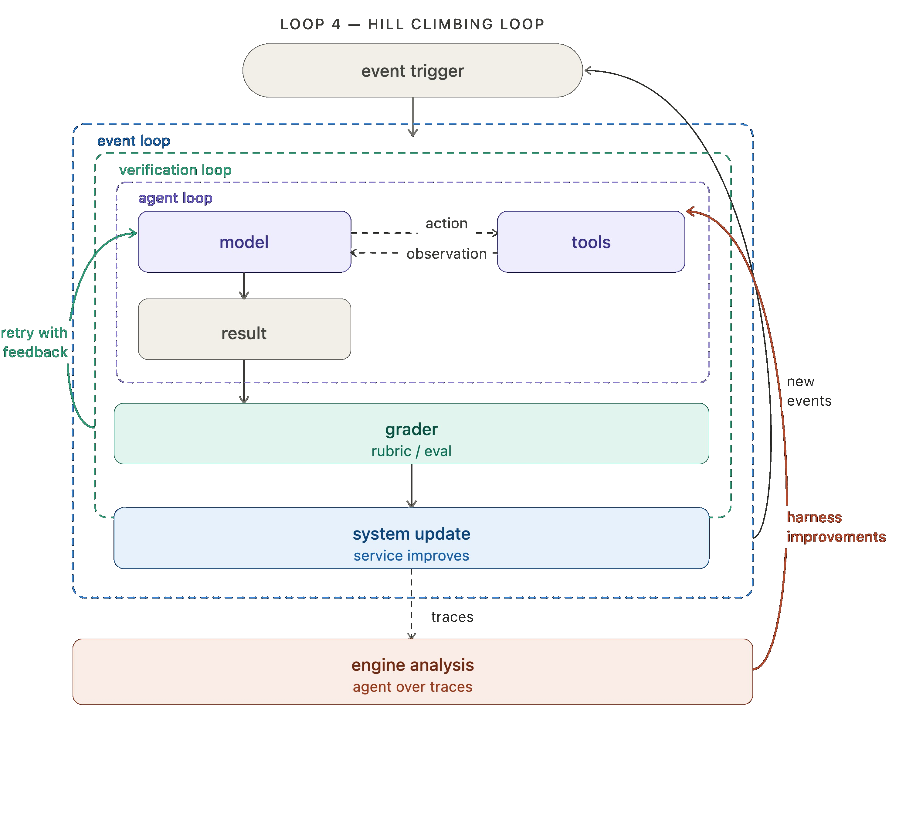

*Figure 7: Loop 4 通用示意图。与前三层不同，这一层的"回流箭头不是只在顶层转一圈，而是直接伸手进 agent loop 内部、更新它的配置"——每轮外循环让内层 loop 更有效。blog 原文："the return arrow doesn't just loop back to the top — it reaches inside and updates the agent loop directly. Each cycle of the outer loop makes the inner loops more effective." 这正是它"最重要"的原因：它不优化单次产出，优化的是 harness 本身。*

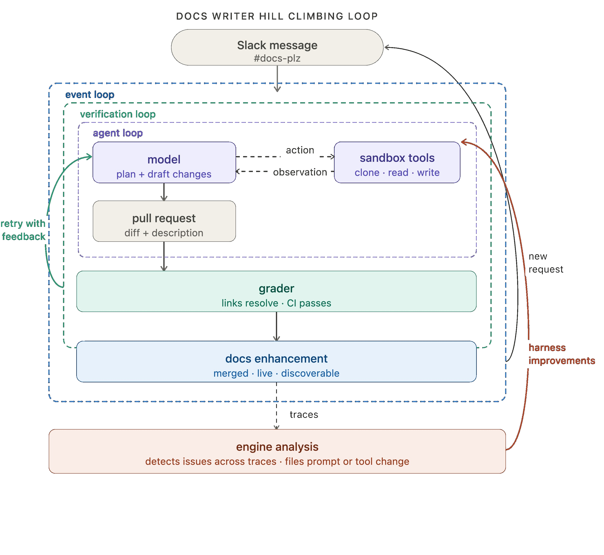

*Figure 8: Loop 4 在 docs-writer 示例里的形态。用 Engine 跑 docs agent 的生产 trace 检测问题；当多条 trace 都信号同一潜在问题时，自动 file 一个 issue 请求改 offending prompt 或 tool。这把"运维 agent"变成了"agent 自动运维自己"——从被动监控到主动提交改进工单。*

#### 8.2 LangSmith Engine 归属（blog 原文）

- 在 LangSmith 里用 **Engine**（trace 分析 agent）实现这一层。
- 未来方向：prompt/tool 是最易改的，但非唯一。跑 open-weight 模型的团队，hill-climbing loop 可喂给 **RL 微调**（用 trace/eval 结果当训练信号改模型本身）；memory、retrieved skills 等辅助上下文同理可改。**loop 是模式，优化什么由你定。**

#### 8.3 开源代码里的能见度

本仓库**无 Loop 4 的自动闭环代码**（LangSmith Engine 是闭源平台能力）。但仓库提供了**离线的评估信号来源**，可视为 Loop 4 的"喂料端"：

- `libs/evals/` — 评测套件 + Harbor 集成（`deepagents_evals`、`deepagents_clbench`、`deepagents_harbor`）。
- `libs/evals/datasets/` — 评测数据集。
- 这些 evals 产出 trace 级评分，可喂给 Engine 或自建分析流程；但"分析 trace → 自动改 config → 部署"的自动闭环本身不在本仓库。

#### 8.4 人审在此层

blog：hill-climbing loop 的 harness 改进可在部署前经人审。即 Loop 4 产出的"改 prompt/tool"建议并非直接上线，而是走人审 gate——这与仓库的 `excluded_middleware`/profile 机制（受保护脚手架不可静默删）一样，强调"改进不能破坏既有安全保证"。

#### 8.5 4 层 loop 与人审接入点汇总

<p align="center"><b>表6：4 层 loop 的人审接入点（blog 梳理）</b></p>

| Loop | 人审接入点 | 开源原语 |
|------|-----------|---------|
| 1 Agent | 敏感动作/工具调用前要求人输入 | `HumanInTheLoopMiddleware`（`interrupt_on`） |
| 2 Verification | 敏感工作流里人当 grader | 可用 `RubricMiddleware` 的 grader 接人；或 `on_evaluation` 回调 |
| 3 Event-driven | 输出返回终端用户前人审 | 部署/编排层 + `HumanInTheLoopMiddleware` |
| 4 Hill-climbing | harness 改进部署前经人审 | 平台 gate；仓库 profile 机制保护脚手架 |

blog 强调："All of LangChain's open source frameworks make adding a 'human in the loop' a first class primitive." —— 人审是一等公民原语。

---

## 四、扩展与生态

### 8. 扩展机制

#### 8.1 middleware 即扩展点（核心扩展范式）

deepagents 的扩展性**不在插件系统，而在 `AgentMiddleware` 契约**：任何实现 `before_agent`/`after_agent`/`wrap_model_call` 等钩子的类都可插进 `create_deep_agent(middleware=[...])`。`RubricMiddleware` 本身就是这一范式的产物——它证明了"加一层 loop"等价于"加一个 middleware"。

关键扩展点：
- **回流能力**：`@hook_config(can_jump_to=['model'])` 让 middleware 能把控制权交回模型节点，构造新内循环（Loop 2 的根基）。
- **结构化输出**：`response_format` 走 provider 自动选定的 structured output 策略（如 `GraderResponse`）。
- **私有记账**：`PrivateStateAttr` 让 middleware 在 state 里藏记账字段，不污染 I/O schema。
- **流式事件**：`runtime.stream_writer` 发自定义事件（如 `rubric_evaluation_start/end`），供 UI/observability。

#### 8.2 Skills —— progressive disclosure 可复用行为

- `SkillsMiddleware`（`middleware/skills.py`）实现 Anthropic 的 agent skills 模式：每个 skill 是含 `SKILL.md`（YAML frontmatter + 指令）的目录。
- **progressive disclosure**：系统提示只列 skill 名+描述（`description` 上限 1024 字符），用时才加载全文——上下文窗口是"公共资源"。
- 来源分层覆盖：base → user → project → team（后者覆盖前者同名 skill）。
- 4 个加载目录（`~/.deepagents/<agent>/skills/`、`~/.agents/skills/`、`.deepagents/skills/`、`.agents/skills/`），跨 agent 工具共享。

#### 8.3 子 agent（SubAgents / AsyncSubAgents）

- 同步内联子 agent 经 `task` 工具调用，隔离上下文窗口。
- 三种形式：`SubAgent`（声明式）、`CompiledSubAgent`（预编译 runnable）、`AsyncSubAgent`（远程/后台）。
- 任意 LangGraph `CompiledStateGraph` 可作为子 agent 注入——自定义编排与 harness 默认并存。
- `task` 工具的设计哲学（来自其描述）：复杂、多步、可独立委派的任务才用；简单任务不用（开销不划算且隐藏中间步）。

#### 8.4 安全模型与权限体系（"trust the LLM" 的落地）

blog 与 README 反复强调"trust the LLM"——agent 能做其工具允许的任何事，边界在工具/sandbox 强制。代码里的落地：

- **`FilesystemPermission`**（`middleware/filesystem.py:254`）：每条规则 `mode` ∈ `{allow, deny, interrupt}`——`allow` 放行、`deny` 直接返权限拒绝、`interrupt` 触发人审。路径校验强制 `path` 以 `/` 开头、不含 `..`、不含 `~`，堵住路径穿越。
- **`HumanInTheLoopMiddleware` + `interrupt_on`**：在敏感工具调用前打断等人审；`_build_interrupt_on_from_permissions` 还能从权限规则自动生成 interrupt 配置——即 `interrupt` 权限会自动变成 HIL 打断点。
- **可插拔 sandbox backend**：`partners/`（daytona/modal/quickjs/runloop/vercel）提供现成沙箱，`execute` 工具只在实现了 `SandboxBackendProtocol` 的 backend 上跑 shell。

#### 8.5 配置与自定义

- `HarnessProfile`（`profiles/harness/`）：按模型调优（已有 `claude-sonnet-4-6`/`opus-4-7`/`haiku-4-5`、NVIDIA Nemotron、OpenAI Codex 等 profile），可 `excluded_tools`/`excluded_middleware`/`extra_middleware`。
- `ProviderProfile`：provider 侧配置（OpenAI/OpenRouter/NVIDIA）。
- `BackendProtocol`：可插拔存储/沙箱后端（filesystem/state/remote/sandbox）。

### 9. 社区与生态

- **社区活跃度**：26k+ star、3.6k+ fork，调研当日仍有 push；CHANGELOG 持续更新（如 `RubricMiddleware` 在 [#3529](https://github.com/langchain-ai/deepagents/issues/3529) 引入）。
- **文档**：`docs.langchain.com/deepagents`、`docs.langchain.com/deepagents-code`；仓库 `.mcp.json` 内置 docs/reference MCP server。
- **JS 生态**：`langchain-ai/deepagentsjs`（JS/TS 对应库）。
- **平台生态**：LangSmith（observability/evaluation/deployment/engine/fleet）、LangChain Academy 课程。

### 10. 部署与运维

- 部署方式：本地 `create_deep_agent` 直接用（带 LangGraph persistence/checkpointer）；或 `deepagents deploy` 推到 LangSmith（preview 的 Managed Deep Agents，waitlist）。
- 运维：LangSmith 提供 tracing/eval/monitoring；`with_config` 注入 `ls_integration`/`lc_versions`/`lc_agent_name` 元数据便于平台归因。

---

## 五、质量与评估

### 11. 代码质量

- **规模**：monorepo 总 Python 约 5.8 万行（`libs/deepagents` 约 7.9 万、`libs/code` 约 30 万含生成/测试数据、`libs/cli` 约 0.64 万、`libs/acp` 约 0.42 万、`libs/evals` 约 2.5 万——`code` 含大量数据/样例）。
- **工具链**：`uv`（包/环境）、`ruff`（lint/format）、`ty`（静态类型）、`make`、`release-please`；`AGENTS.md`/`.pre-commit-config.yaml` 规范严谨（如 prefer inline `# noqa` 而非 `per-file-ignores`、`uv` 取代 pip/poetry）。
- **测试**：每包 `tests/unit_tests/`，如 `test_agent.py`、`test_goal_rubric.py`、`test_plugins_p0.py`。
- **文档即代码**：API docstring 极详尽（`create_deep_agent`/`RubricMiddleware` 的 docstring 直接给出装配顺序与语义），是主要信息源。

### 12. 技术评估

#### 12.1 技术优势

- **架构优势**：middleware 契约让"加一层 loop = 加一个 middleware"，`jump_to` 把回流做成一等公民——Loop Engineering 的 4 层栈在代码里是**机制统一**的，而非各写各的。
- **工程亮点**：`recursion_limit=9_999`、`DeltaChannel` 降 checkpoint 复杂度、grader 懒构造、nonce 防 prompt 注入、跨字段一致性校验、受保护脚手架——处处是"生产长循环"的硬功夫。
- **可观测**：`lc_source` 归因、`rubric_evaluation_*` 流事件、`on_evaluation` 回调、LangSmith trace 全链路。
- **模型无关 + 可插拔后端/沙箱**：生态宽度大。

#### 12.2 技术劣势与风险

- **Loop 3/4 闭源**：4 层栈只有前两层是开源代码；event-driven 触发与 hill-climbing 自改进是 LangSmith 平台能力，**不付费/不用平台就拿不到完整 loop engineering**——这是选型时必须明确的取舍。
- **"trust the LLM"安全模型**：agent 能做工具允许的任何事，边界在工具/sandbox 强制；若工具权限放太宽，风险高。
- **递归放开**：`recursion_limit=9_999` 在异常配置下可能长时间空转（虽 Loop 2 有 `max_iterations` 兜底，但 Loop 1 自身的长程循环靠模型自觉停止）。
- **复杂度门槛**：两层架构 + middleware 顺序 + profile 排除规则，对新手有学习曲线（受保护脚手架不可删等约束易踩坑）。

#### 12.3 适用场景建议

- **推荐**：生产环境长程、多步 agent 任务，且团队愿意用 LangSmith 做触发/改进闭环；需要把 agent 接入生态（Slack/cron/webhook）做大规模后台自动化。
- **不推荐**：只要单层 tool-use 循环、不想引入平台依赖 → 直接用 LangGraph 或 `create_agent` 即可；对沙箱安全零容忍且无 sandbox 方案时慎用。

#### 12.4 选型决策建议

<p align="center"><b>表7：Loop Engineering 各层能力来源与选型对照</b></p>

| 需求 | 选 deepagents 开源部分 | 需 LangSmith 平台 | 替代 |
|------|----------------------|------------------|------|
| 单层 agent tool 循环（Loop 1） | ✅ `create_deep_agent` | — | `langchain.agents.create_agent` / LangGraph |
| rubric 自评重试（Loop 2） | ✅ `RubricMiddleware` | — | 自写 `after_agent` hook |
| 后台事件触发（Loop 3） | 仅部署对接 CLI | ✅ Deployment/Fleet | 自建 cron + webhook 调 `agent.invoke` |
| trace→改 config 自改进（Loop 4） | 离线 evals 喂料 | ✅ Engine | 自建分析 agent + CI |

---

## 附录

### A. 参考资源

- 博客原文（存档）：`references/The Art of Loop Engineering/The Art of Loop Engineering.md` — https://www.langchain.com/blog/the-art-of-loop-engineering
- 开源仓库：https://github.com/langchain-ai/deepagents
- 文档：https://docs.langchain.com/deepagents ；https://docs.langchain.com/deepagents-code
- blog Reference 引用：deepagents quickstart、create_agent docs、rubric middleware、cron jobs/webhooks、langsmith engine、fleet channels
- 相关 issue：RubricMiddleware 引入 [#3529](https://github.com/langchain-ai/deepagents/issues/3529)

### B. 论文/博客图片索引

| 图片 | 文件 | 插入章节 | 内容 |
|------|------|---------|------|
| Figure 1 | `assets/fig1_loop1_generic.png` | 5.1 Loop 1 | Agent loop 通用图（模型↔工具循环） |
| Figure 2 | `assets/fig3_loop1_docs.png` | 5.1 Loop 1 | docs-writer 的 Loop 1 形态 |
| Figure 3 | `assets/fig2_loop2_generic.png` | 6.1 Loop 2 | Verification loop 通用图（grader+rubric 回流） |
| Figure 4 | `assets/fig4_loop2_docs.png` | 6.1 Loop 2 | docs-writer 的 Loop 2（跑测试校验） |
| Figure 5 | `assets/fig6_loop3_generic.png` | 7.1 Loop 3 | Event-driven loop 通用图（事件触发） |
| Figure 6 | `assets/fig5_loop3_docs.png` | 7.1 Loop 3 | docs-writer 由 Slack channel 触发 |
| Figure 7 | `assets/fig7_loop4_generic.png` | 8.1 Loop 4 | Hill-climbing loop 通用图（trace→改 config） |
| Figure 8 | `assets/fig8_loop4_docs.png` | 8.1 Loop 4 | docs-writer 用 Engine 自动提改进 issue |

> 注：图片编号（Figure 1..8）按本报告阅读顺序连续编号，文件名沿用 generic/docs 语义分类。8 张均为 blog 原图（来自 langchain.com CDN），提取后已用 PNG magic bytes 校验为真实图片（非 CDN 重定向占位符）。

### C. 术语表

| 术语 | 释义 |
|------|------|
| Loop Engineering / loopcraft | 把 agent 当作可叠加循环栈来工程化；swyx 提出 "loopcraft: the art of stacking loops" |
| harness | "套具"——围绕模型的一整套循环/工具/上下文管理框架 |
| grader | 按 rubric 给 agent 产出打分的判定者（确定式或 agentic） |
| rubric | 描述"done 长什么样"的准则 |
| middleware | 实现 `AgentMiddleware` 生命周期契约的扩展单元 |
| `jump_to='model'` | middleware 把控制权交回模型节点、构造内循环的回流原语 |
| trace | 一次 agent run 的完整记录（模型动作/工具调用/grader 反馈） |
| Engine | LangSmith 的 trace 分析 agent（Loop 4 原语） |
| Fleet | LangChain 的 no-code agent builder（Loop 3 channel/schedule 原语） |
| progressive disclosure | skills 仅暴露名+描述、用时才加载全文的上下文节约模式 |
| DeltaChannel | 把 messages 增量 checkpoint 化、降增长复杂度从 $O(N^2)$ 到 $O(N)$ 的机制 |

### D. 调研信息

- 调研人：Claude（research skill / 模式A 开源项目技术调研）
- 调研时间：2026-07-16
- 调研版本：`langchain-ai/deepagents` main 分支（截至 2026-07-16 push）；`deepagents` SDK 0.5.x、`deepagents-cli` 0.1.x
- 代码引用方式：浅克隆 `--depth 1` 到临时目录分析，调研完成后删除（代码可通过 GitHub 链接随时访问）

---

*报告遵循 research skill 规范：主文件 `report.md`，Mermaid 兼容性规则（连字符换行、`|label|` 连线、双引号 subgraph、`flowchart` 取代 stateDiagram），代码分析含 ≥3 幅设计图（系统分层架构图、中间件装配流程图、模块依赖关系图、Loop2 核心流程图 + 时序图）。论文/blog 图片共 8 张全部插入正文对应 Loop 章节，无只放附录索引。*
