# Pi agent-core 开源项目技术调研报告

> 调研日期：2026-06-24  
> 项目地址：https://github.com/earendil-works/pi  
> 官网：https://pi.dev/  
> 源码快照：`ec6311beb5b24fc918e5031173608447582d7262`  
> 重点范围：`packages/agent`（`@earendil-works/pi-agent-core`）及 `packages/coding-agent` 对它的集成

---

## 0. 核心结论

Pi 的 `pi-agent-core` 和 `pi-coding-agent` 是**同一个 GitHub monorepo** 里的两个 npm workspace/package，仓库都是 `earendil-works/pi`：

| 包 | npm 包名 | 仓库路径 | GitHub 路径 | 角色 |
|---|---|---|---|---|
| Agent Core | `@earendil-works/pi-agent-core` | `packages/agent` | https://github.com/earendil-works/pi/tree/main/packages/agent | 通用 agent 内核：状态、事件流、LLM turn loop、工具调用、队列、通用 harness/session 抽象 |
| Coding Agent | `@earendil-works/pi-coding-agent` | `packages/coding-agent` | https://github.com/earendil-works/pi/tree/main/packages/coding-agent | 面向终端用户的 Pi CLI/TUI/SDK 产品层：内置工具、扩展系统、会话文件、模型/auth、压缩、重试、交互模式 |

二者的关系是**产品层依赖内核层**，不是两个互相独立的项目，也不是 `coding-agent/src/core` 目录等同于 `agent-core`。具体引用关系有两层：

1. **package 依赖**：`packages/coding-agent/package.json` 在 `dependencies` 中声明 `"@earendil-works/pi-agent-core": "^0.80.2"`，说明 `pi-coding-agent` 通过 npm 包依赖 `pi-agent-core`。
2. **代码 import 和实例化**：`packages/coding-agent/src/core/sdk.ts` 使用 `import { Agent, type AgentMessage, type ThinkingLevel } from "@earendil-works/pi-agent-core";` 引入内核包，并在 `createAgentSession()` 中 `new Agent(...)`。随后它把这个低层 `Agent` 传给 `new AgentSession({ agent, ... })`，由 `AgentSession` 负责 Pi 产品层能力，例如 session JSONL 持久化、extension hooks、内置 `read/bash/edit/write` 工具注册、自动压缩、自动重试和 UI/RPC 模式适配。

因此，最准确的调用链是：

```text
用户 / CLI / TUI / RPC
  -> packages/coding-agent/src/core/agent-session.ts  (Pi 产品会话)
  -> packages/coding-agent/src/core/sdk.ts            (创建并配置 Agent)
  -> @earendil-works/pi-agent-core / packages/agent/src/agent.ts
  -> packages/agent/src/agent-loop.ts                 (核心 LLM + 工具循环)
```

从运行流程看，Pi 的 Agent 可以拆成三层：

| 层级 | 代码位置 | 职责 |
|---|---|---|
| 低层循环 | `packages/agent/src/agent-loop.ts` | 处理 LLM 流式响应、工具调用、turn/agent 生命周期、steering/follow-up 队列 |
| 状态封装 | `packages/agent/src/agent.ts` | 持有 transcript、tools、model、thinkingLevel、pendingToolCalls，并暴露 `prompt()`/`continue()`/`steer()`/`followUp()` |
| Pi 产品会话 | `packages/coding-agent/src/core/agent-session.ts` | 把低层 Agent 接到 session JSONL、扩展系统、内置工具、自动压缩、自动重试和多运行模式 |

---

## 1. 项目概览

Pi 官网将其定位为 “minimal terminal coding harness”，核心主张是“改变 harness，而不是改变你的工作流”。官网说明 Pi 支持 skills、`AGENTS.md`、极简系统提示词、interactive/print/JSON/RPC/SDK 等模式，并通过 extensions、skills、prompt templates、themes 和 packages 扩展能力。

仓库结构中与本报告最相关的是：

```text
packages/
  agent/          # @earendil-works/pi-agent-core
  coding-agent/   # @earendil-works/pi-coding-agent
  ai/             # provider/model/stream abstraction, agent-core 依赖它
  tui/            # terminal UI 组件
```

本地源码快照显示：

| 指标 | 数值 |
|---|---:|
| `packages/agent/src` 文件数 | 25 |
| `packages/agent/test` 文件数 | 20 |
| `packages/coding-agent/src` 文件数 | 167 |
| `packages/agent/package.json` 版本 | 0.80.2 |
| `packages/coding-agent/package.json` 版本 | 0.80.2 |

---

## 2. 包边界：agent-core vs coding-agent

`packages/agent/package.json` 声明包名为 `@earendil-works/pi-agent-core`，描述为 “General-purpose agent with transport abstraction, state management, and attachment support”。它依赖 `@earendil-works/pi-ai`，并导出 `Agent`、agent loop、harness、session 等基础能力。

`packages/coding-agent/package.json` 声明包名为 `@earendil-works/pi-coding-agent`，描述为 “Coding agent CLI with read, bash, edit, write tools and session management”。它依赖 `@earendil-works/pi-agent-core`、`@earendil-works/pi-ai`、`@earendil-works/pi-tui`，并提供 `pi` CLI。

更准确地说，`coding-agent` 对 `agent-core` 的使用分成**初始化组装**和**运行时 prompt 执行**两条链路。

### 2.1 初始化组装关系

启动 Pi 或通过 SDK 创建会话时，`coding-agent` 先读取配置、模型、资源和工具，然后实例化 `agent-core` 的低层 `Agent`，最后把这个 `Agent` 包进产品层 `AgentSession`。

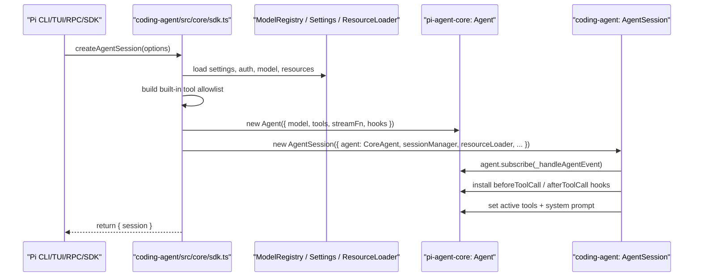

对应代码点：

| 步骤 | 代码 |
|---|---|
| 引入内核包 | `packages/coding-agent/src/core/sdk.ts` 中 `import { Agent, ... } from "@earendil-works/pi-agent-core"` |
| 创建内核 Agent | `packages/coding-agent/src/core/sdk.ts:293` 的 `new Agent({...})` |
| 包装成产品会话 | `packages/coding-agent/src/core/sdk.ts:377` 的 `new AgentSession({ agent, ... })` |
| 订阅内核事件 | `packages/coding-agent/src/core/agent-session.ts:352` 的 `agent.subscribe(...)` |
| 安装工具 hooks | `packages/coding-agent/src/core/agent-session.ts:414` 的 `_installAgentToolHooks()` |

### 2.2 一次 prompt 的运行时调用顺序

用户真正发消息时，有两条线必须分开看：

1. **调用线**：产品层把 prompt 交给 `agent-core`，`agent-core` 调 provider 和工具。
2. **事件线**：`agent-core` 在运行中持续发 `AgentEvent`，事件经 `Agent.processEvents()` 更新内核状态，再通过 `agent.subscribe()` 回到 `coding-agent` 的 `AgentSession._handleAgentEvent()`，最后分发给 UI、extensions 和 session JSONL。

需要先澄清包含关系：

- `packages/coding-agent` 包含 `AgentSession`、`SessionManager`、`ExtensionRunner`、内置工具定义和 UI/RPC/SDK 适配。
- `packages/agent` 也就是 `pi-agent-core`，包含 `Agent` 状态封装和 `agent-loop` 循环实现。
- `packages/ai` provider stream 不属于 `pi-agent-core`，它是 `agent-core` 调用的外部依赖。
- 工具相关逻辑要再拆开看：**工具接口、工具执行调度、工具结果归一化属于 `pi-agent-core` 的 loop**；**hook 的业务实现和具体工具函数体不属于 `pi-agent-core`**，它们由 `coding-agent` 或 extension 注入。
- `AgentTool` 接口属于 `pi-agent-core`：它定义工具需要有 `execute(toolCallId, params, signal, onUpdate)`。
- `read/bash/edit/write` 等具体工具实现主要在 `coding-agent` 或 extension 中注册；`agent-core` 不拥有这些具体实现，只负责按 `AgentTool` 接口调度执行，并把返回值转换成后续 LLM turn 可消费的 tool result message。

下面的图改成纯**上下结构**，并把 `pi-agent-core` 的循环内部逻辑画成一个大容器：容器内是 core loop 自己负责的步骤；容器外是被 core 调用或回调的外部依赖，包括 `packages/ai` provider、hook 实现、具体工具函数体和产品层事件订阅者。

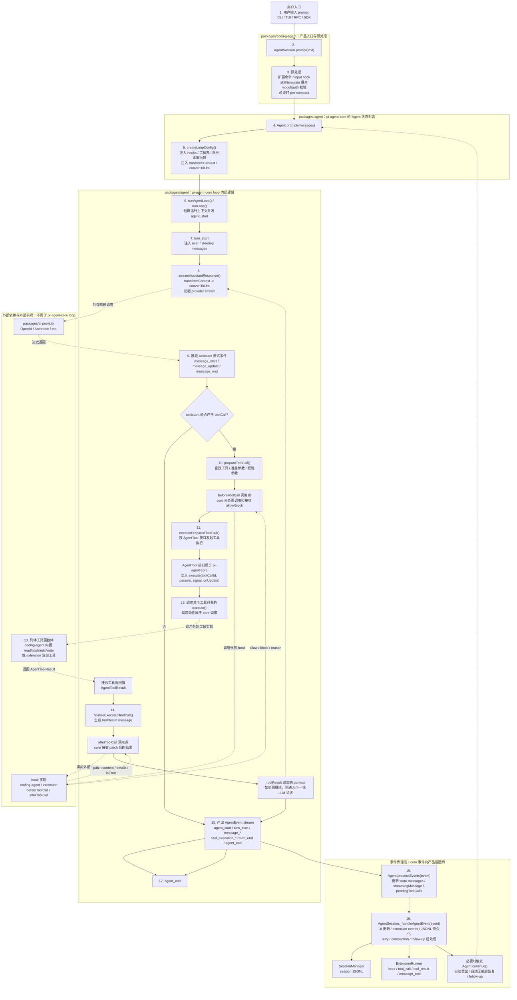

按代码顺序展开就是：

| 顺序 | 所在层 | 发生的事 | 关键代码 |
|---:|---|---|---|
| 1 | 用户入口层 | 用户输入 prompt，或 RPC/SDK 调用发送 prompt | modes / RPC / SDK |
| 2 | 产品编排层 | `AgentSession.prompt(text)` 接收输入 | `packages/coding-agent/src/core/agent-session.ts:997` |
| 3 | 产品编排层 | 扩展命令、input hook、skill/template 展开、模型认证、必要时预压缩 | `agent-session.ts:997-1147` |
| 4 | core 状态层 | 调用低层 `Agent.prompt(messages)` | `packages/agent/src/agent.ts:325` |
| 5 | core 状态层 | `Agent.createLoopConfig()` 把 hooks、队列、context transform、LLM 转换函数注入 loop | `packages/agent/src/agent.ts:422` |
| 6 | core 循环层 | `runAgentLoop()` 创建本次运行上下文并发 `agent_start/turn_start` | `packages/agent/src/agent-loop.ts:101` |
| 7 | core 循环层 | `runLoop()` 进入双层循环，注入 user/steering messages | `packages/agent/src/agent-loop.ts:155` |
| 8 | core 循环层 | `streamAssistantResponse()` 调 provider 前执行 `transformContext -> convertToLlm` | `agent-loop.ts:275` |
| 9 | 外部依赖层 | `pi-ai` provider 返回 assistant 流式事件 | `@earendil-works/pi-ai` |
| 10 | core 循环层 | `prepareToolCall()` 查工具、准备参数、校验参数，并到达 `beforeToolCall` 调用点；hook 函数体来自产品层或 extension | `agent-loop.ts:562` |
| 11 | core 工具接口与调度层 | `executePreparedToolCall()` 属于 `pi-agent-core` loop，负责按 `AgentTool` 接口发起工具执行；`AgentTool` 类型定义也属于 `pi-agent-core` | `packages/agent/src/types.ts:371`, `agent-loop.ts:628` |
| 12 | 工具实现调用边界 | 某个工具对象的 `execute()` 被 core loop 调用；这一步的“调用动作”属于 `agent-core` 调度，但 `execute()` 的具体函数体通常不在 `pi-agent-core` | `AgentTool.execute(...)` |
| 13 | 外部工具实现层 | 具体工具函数体执行，例如 `read/bash/edit/write` 来自 `coding-agent`，extension 也可注册自己的工具 | `packages/coding-agent/src/core/tools/*`, `extensions.registerTool()` |
| 14 | core 工具结果处理层 | `finalizeExecutedToolCall()` 属于 `pi-agent-core` loop，负责接收工具返回值、到达 `afterToolCall` 调用点、归一化成 toolResult message；after hook 函数体仍来自产品层或 extension | `agent-loop.ts:665` |
| 15 | core 状态层 | 每个 loop 事件进入 `Agent.processEvents()`，更新 `state.messages`、`streamingMessage`、`pendingToolCalls` | `packages/agent/src/agent.ts:509` |
| 16 | 产品编排层 | `AgentSession._handleAgentEvent()` 接收订阅事件，做 UI/extension/session 持久化 | `packages/coding-agent/src/core/agent-session.ts:487` |
| 17 | 产品编排层 | `agent_end` 后检查自动重试、自动压缩、follow-up 队列，必要时 `agent.continue()` | `agent-session.ts:947-984` |

### 2.3 使用逻辑总结

可以把 `pi-coding-agent` 理解成“产品外壳”，把 `pi-agent-core` 理解成“agent 发动机”：

| 问题 | 答案 |
|---|---|
| 二者在不在一个代码仓？ | 在，同一个仓库 `https://github.com/earendil-works/pi` |
| `agent-core` 的源码在哪？ | `packages/agent`，GitHub 路径是 `https://github.com/earendil-works/pi/tree/main/packages/agent` |
| `coding-agent` 的源码在哪？ | `packages/coding-agent`，GitHub 路径是 `https://github.com/earendil-works/pi/tree/main/packages/coding-agent` |
| 谁依赖谁？ | `pi-coding-agent` 依赖并调用 `pi-agent-core` |
| 怎么依赖？ | `packages/coding-agent/package.json` 依赖 `@earendil-works/pi-agent-core` |
| 怎么调用？ | `sdk.ts` import `Agent`，`new Agent(...)`，再交给 `AgentSession` 管理 |
| `agent-core` 负责什么？ | `Agent` 状态、事件流、LLM turn loop、工具调用、steering/follow-up 队列 |
| `coding-agent` 负责什么？ | CLI/TUI/RPC/SDK、内置工具、扩展系统、session JSONL、模型认证、自动压缩、自动重试 |

需要特别注意：`packages/agent/src/harness/agent-harness.ts` 提供了通用 `AgentHarness`，但 Pi 的 CLI 产品层当前主要通过 `packages/coding-agent/src/core/sdk.ts` 直接创建低层 `Agent`，再用自己的 `AgentSession` 封装产品能力。也就是说，Pi CLI 的主路径是 `coding-agent AgentSession -> agent-core Agent -> agent-core agent-loop`，而不是 `coding-agent -> agent-core AgentHarness`。

---

## 3. Agent 核心运行流程

### 3.1 入口 API

低层 `Agent` 类位于 `packages/agent/src/agent.ts:166`。它的公开 API 不只包括 `prompt()` 和 `continue()`，还包括可配置的模型/工具钩子、状态访问、队列控制、订阅和运行控制。下面按类别列出 `Agent` 类的公开属性和方法；`normalizePromptInput()`、`runPromptMessages()`、`runContinuation()`、`createContextSnapshot()`、`createLoopConfig()`、`runWithLifecycle()`、`handleRunFailure()`、`finishRun()`、`processEvents()` 是私有实现细节，不属于对外 API。

#### 3.1.1 构造入口

| API | 类型 | 作用 |
|---|---|---|
| `new Agent(options?: AgentOptions)` | 构造函数 | 创建有状态 agent。初始化 `_state`、steering/follow-up 队列、模型流函数、工具钩子、传输方式和工具执行模式。 |

`AgentOptions` 中可传入的主要配置会落到实例属性或初始状态上：

| 配置 | 作用 |
|---|---|
| `initialState` | 初始化 `systemPrompt`、`model`、`thinkingLevel`、`tools`、`messages`。 |
| `convertToLlm` | 将内部 `AgentMessage[]` 转成 provider 可理解的标准 `Message[]`。 |
| `transformContext` | 在每次模型调用前改写/裁剪/注入上下文。 |
| `streamFn` | 替换默认 `streamSimple`，自定义模型 streaming 调用。 |
| `getApiKey` | 在请求 provider 前动态解析 API key。 |
| `onPayload` / `onResponse` | 观察 provider 请求 payload 和响应。 |
| `beforeToolCall` / `afterToolCall` | 工具执行前后 hook，可阻止、修改或替换工具结果。 |
| `prepareNextTurn` | 每个 turn 后更新 context/model/reasoning。 |
| `steeringMode` / `followUpMode` | 控制队列一次 drain 一个消息还是全部消息。 |
| `sessionId` | 传给 provider，用于 cache-aware 后端。 |
| `thinkingBudgets` | 配置不同 thinking level 的 token budget。 |
| `transport` | 指定 provider transport，默认 `"auto"`。 |
| `maxRetryDelayMs` | 限制 provider 建议的最大 retry delay。 |
| `toolExecution` | 工具执行策略，`"parallel"` 或 `"sequential"`，默认 `"parallel"`。 |

#### 3.1.2 可配置运行属性

这些是 `Agent` 实例上的公开属性，产品层可以在运行前或 turn 间调整：

| 属性 | 作用 |
|---|---|
| `convertToLlm` | LLM 边界转换函数，决定哪些 `AgentMessage` 能进入模型上下文。 |
| `transformContext?` | 上下文预处理函数，常用于压缩、裁剪、注入外部上下文。 |
| `streamFn` | 模型 streaming 函数。`runLoop()` 调用 `streamAssistantResponse()` 时最终使用它。 |
| `getApiKey?` | provider API key 动态解析函数。 |
| `onPayload?` | provider 请求发出前的观察回调。 |
| `onResponse?` | provider 响应返回后的观察回调。 |
| `beforeToolCall?` | 工具执行前 hook，参数校验后运行，可 block 或调整调用。 |
| `afterToolCall?` | 工具执行后 hook，可修改工具返回内容、错误标记或终止提示。 |
| `prepareNextTurn?` | turn 结束后返回新的 context/model/thinkingLevel。 |
| `sessionId?` | 当前会话标识。 |
| `thinkingBudgets?` | thinking token budget 配置。 |
| `transport` | 当前 transport 策略。 |
| `maxRetryDelayMs?` | retry delay 上限。 |
| `toolExecution` | 当前工具执行模式。 |

#### 3.1.3 状态访问

| API | 类型 | 作用 |
|---|---|---|
| `state` | getter | 返回当前 `AgentState`。注意 `state.tools` 和 `state.messages` 的 setter 会复制顶层数组。 |
| `signal` | getter | 返回当前 active run 的 `AbortSignal`，没有运行中任务时为 `undefined`。 |

`state` 包含以下字段：

| 字段 | 作用 |
|---|---|
| `systemPrompt` | 当前系统提示词。 |
| `model` | 当前模型。 |
| `thinkingLevel` | 当前 reasoning/thinking 档位。 |
| `tools` | 当前暴露给模型的工具列表。 |
| `messages` | 当前 agent transcript。`message_end` 时追加最终消息。 |
| `isStreaming` | 是否有 active run。由 `runWithLifecycle()` 置 true，`finishRun()` 置 false。 |
| `streamingMessage?` | 当前正在流式更新的消息。 |
| `pendingToolCalls` | 正在执行、尚未结束的工具调用 id 集合。 |
| `errorMessage?` | 最近 assistant turn 的错误信息。 |

#### 3.1.4 队列控制

| API | 类型 | 作用 |
|---|---|---|
| `steeringMode` | getter/setter | 控制 steering 队列 drain 策略：`"one-at-a-time"` 或 `"all"`。 |
| `followUpMode` | getter/setter | 控制 follow-up 队列 drain 策略：`"one-at-a-time"` 或 `"all"`。 |
| `steer(message)` | 方法 | 在当前 assistant turn 结束后、下一次 assistant 响应前插入消息。 |
| `followUp(message)` | 方法 | 在 agent 本来要停止时再追加一条后续消息，驱动外层 follow-up loop 继续。 |
| `clearSteeringQueue()` | 方法 | 清空 steering 队列。 |
| `clearFollowUpQueue()` | 方法 | 清空 follow-up 队列。 |
| `clearAllQueues()` | 方法 | 同时清空两个队列。 |
| `hasQueuedMessages()` | 方法 | 判断任一队列是否还有待处理消息。 |

`steeringMode` 和 `followUpMode` 底层都作用在 `PendingMessageQueue.drain()` 上。队列入队时总是追加到尾部；区别只发生在 loop 消费队列时：

- `"one-at-a-time"`：每次 `drain()` 只取队首第一条消息，并把这条消息从队列中移除。后续消息仍留在队列里，等待下一次 drain。两个队列的默认值都是这个模式。
- `"all"`：每次 `drain()` 取出当前队列里的全部消息，并一次性清空队列。

因此这两个 mode 不改变 `steer()` / `followUp()` 的入队行为，只改变“下一次被 loop 消费时，一次拿多少条”。

#### 3.1.5 运行控制

| API | 类型 | 作用 |
|---|---|---|
| `prompt(input, images?)` | 方法 | 启动一次新 agent run。支持字符串、单个 `AgentMessage`、`AgentMessage[]`，字符串可附带图片。运行中再次调用会抛错，需改用 `steer()` 或 `followUp()`。 |
| `continue()` | 方法 | 从当前 transcript 继续运行。最后一条消息必须是 user 或 toolResult；如果最后是 assistant，会优先 drain 已排队的 steering/follow-up，否则抛错。 |
| `abort()` | 方法 | 通过当前 run 的 `AbortController` 取消运行。 |
| `waitForIdle()` | 方法 | 等待当前 run 以及所有 awaited event listener 完成；没有 active run 时立即 resolved。 |
| `reset()` | 方法 | 清空 transcript、运行态、错误态和两个消息队列。 |

#### 3.1.6 事件订阅

| API | 类型 | 作用 |
|---|---|---|
| `subscribe(listener)` | 方法 | 订阅 agent 生命周期事件。listener 会按注册顺序被 `await`，并收到当前 run 的 `AbortSignal`；返回 unsubscribe 函数。 |

事件处理的核心实现是私有方法 `processEvents(event)`：`runAgentLoop()` 接收到的 `emit` 参数实际是 `(event) => this.processEvents(event)`。因此每个 loop event 都会先更新 `Agent` 内部状态，再调用 `subscribe()` 注册的 listener。

用户侧调用通常从 `Agent.prompt()` 开始（`agent.ts:325`），如果已有运行中的 prompt，会要求调用方使用 `steer()` 或 `followUp()` 入队。`Agent.continue()`（`agent.ts:338`）用于从已有上下文继续，常见场景是 retry 或压缩后恢复。

### 3.2 双层循环

核心循环在 `packages/agent/src/agent-loop.ts:155` 的 `runLoop()`。它是双层循环：

#### 3.2.1 总图：Agent、外循环、内循环与事件处理

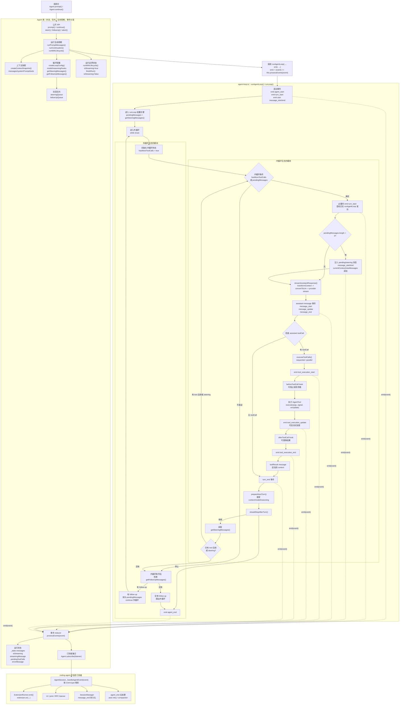

关键点：

- `streamAssistantResponse()` 位于 `agent-loop.ts:275`，在这里把内部 `AgentMessage[]` 先经 `transformContext`，再经 `convertToLlm` 转成 provider 能理解的 `Message[]`。
- LLM 响应是事件流；`start` 时写入 partial assistant message，`text_delta`/`thinking_delta`/`toolcall_delta` 等事件持续更新，`done`/`error` 时落成 final assistant message。
- 如果 assistant message 包含工具调用，`executeToolCalls()`（`agent-loop.ts:373`）执行工具，再把结果作为 `toolResult` message 追加到上下文，触发下一次 LLM 调用。
- 如果没有工具调用，也没有 steering/follow-up，循环结束。
- 事件不是另一套独立调度循环：`runLoop()` 是主控制流，事件是在关键节点被 `emit` 出来的生命周期信号。多数事件由 `AgentSession._handleAgentEvent()` 解析后分发给 extension、UI/RPC/print listener 和 `SessionManager`；`tool_call`、`tool_result` 这类 hook 会反向影响工具参数、阻止执行或替换工具结果。

#### 3.2.2 `prompt()` 流程：启动一次新的 agent run

**功能定位**：`prompt()` 是创建新用户输入的主入口。它负责把调用方输入规范化为 user message，建立一次 active run，然后调用 `runAgentLoop()` 进入双层循环。

| 项 | 内容 |
|---|---|
| 输入 | `string`、`AgentMessage` 或 `AgentMessage[]`；字符串输入可带 `images?: ImageContent[]` |
| 返回 | `Promise<void>` |
| 是否启动 run | 是 |
| 是否进入 `runLoop()` | 是 |
| 并发策略 | 如果已有 `activeRun`，直接抛错，要求调用方使用 `steer()` / `followUp()` 或等待结束 |

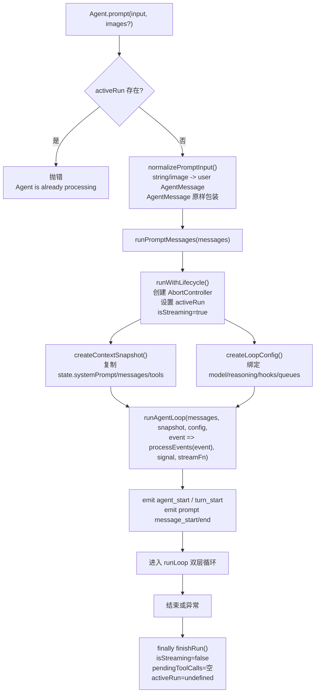

使用场景：

- **普通用户请求入口**：CLI/TUI/RPC 接收到用户的新任务时，通常最终都会落到 `prompt()`。例如“读取这个文件并总结”“修改这个函数”“执行一次诊断”。这类请求需要把用户输入作为新的 user message 放入 transcript，因此应该用 `prompt()`。
- **多模态输入入口**：当用户输入字符串并附带图片时，`prompt(input, images)` 会把文本和图片一起规范化成 user message content，适合视觉上下文参与推理的场景。
- **批量注入初始消息**：调用方已经构造好了 `AgentMessage[]` 时，可以直接传给 `prompt()`，让一组消息作为本次 run 的起点。适合 SDK 层或测试里精确控制上下文。
- **不适合运行中追加**：如果 agent 已经在 streaming 或工具执行中，`prompt()` 会抛错。此时应使用 `steer()` 做运行中插话，或用 `followUp()` 排队下一步。

详细说明：

- `prompt()` 本身不做 LLM 调用，它只做并发保护和输入规范化。
- 真正的运行边界在 `runWithLifecycle()`：这里创建 abort signal，并把 `isStreaming` 置为 true。
- `runAgentLoop()` 会把 prompt 消息追加到新运行的 `currentContext` 中，并发出用户消息的 `message_start/message_end`。
- 这一路径会完整进入 `runLoop()` 的外循环和内循环。

#### 3.2.3 `continue()` 流程：从现有 transcript 续跑

**功能定位**：`continue()` 用于不新增显式 prompt 的续跑。它通常发生在已有 user/toolResult message 之后，需要让模型继续生成下一步；也用于某些 retry 或压缩恢复场景。

| 项 | 内容 |
|---|---|
| 输入 | 无 |
| 返回 | `Promise<void>` |
| 是否启动 run | 是 |
| 是否进入 `runLoop()` | 是 |
| 前置条件 | 当前没有 `activeRun`，且 `state.messages` 至少有一条消息 |

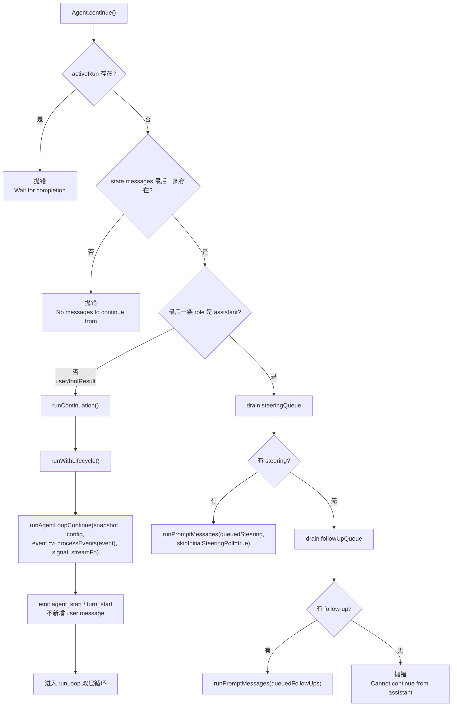

使用场景：

- **工具结果后的继续推理**：当 transcript 最后一条是 `toolResult` 时，模型需要读取工具结果并生成下一步回答。`continue()` 可以从已有上下文继续，而不额外插入用户消息。
- **恢复中断或压缩后的上下文**：如果产品层已经调整了 `state.messages`，例如恢复 session、压缩上下文后放入摘要，再希望 agent 从当前 transcript 继续，可以使用 `continue()`。
- **重试类场景**：当上一轮因为 provider 错误或可恢复错误中断，外层逻辑可能修正状态后调用 `continue()`，让模型沿当前上下文重新尝试。
- **assistant 结尾时的队列兜底**：如果最后一条是 assistant，不能直接继续。源码会优先消费 `steeringQueue` 或 `followUpQueue`，把队列消息作为新的 prompt 启动。这适合“agent 已停，但用户已经提前排了消息”的情况。

详细说明：

- `continue()` 和 `prompt()` 的最大区别：它不调用 `normalizePromptInput()`，也不制造新的 user prompt。
- 如果最后一条消息是 `user` 或 `toolResult`，说明 provider 可以从当前上下文继续，走 `runAgentLoopContinue()`。
- 如果最后一条消息是 `assistant`，直接继续会被 provider 拒绝；源码会先尝试消费已排队的 steering/follow-up，把队列消息作为新的 prompt 运行。
- 如果最后是 assistant 且两个队列都空，`continue()` 抛错。

#### 3.2.4 `steer()` 流程：把消息插入当前 run 的内循环

**功能定位**：`steer()` 是“运行中纠偏/插话”入口。它只把消息放进 steering 队列，不直接启动 run；消息会由内循环中的 `getSteeringMessages()` 消费。

| 项 | 内容 |
|---|---|
| 输入 | `AgentMessage` |
| 返回 | `void` |
| 是否启动 run | 否 |
| 是否进入 `runLoop()` | 间接进入，由当前或下一次 run 的内循环消费 |
| 消费位置 | runLoop 开始前一次，以及每个 turn 结束后的 `getSteeringMessages()` |

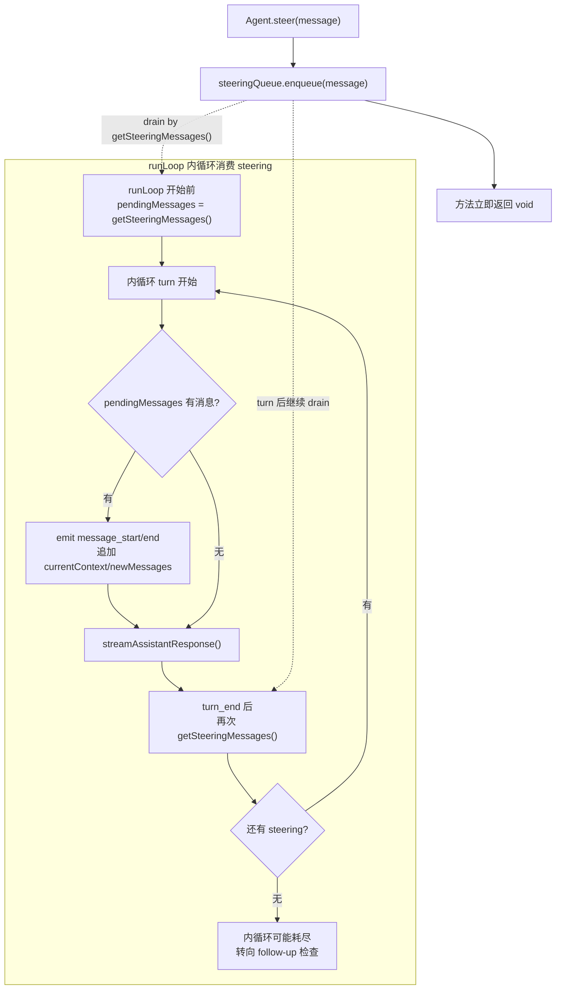

使用场景：

- **运行中纠偏**：用户在 agent 还在思考或工具执行时追加“别改那个文件”“优先跑测试”“刚才方向错了”。这类消息应该尽快进入下一次 assistant 响应前，所以用 `steer()`。
- **交互式 UI 的插话**：TUI 中用户在模型输出过程中提交新输入，如果希望当前 run 不停止、而是在下一个 turn 接上这条输入，可以写入 steering 队列。
- **自动化控制信号**：外层系统发现新约束、预算变化、上下文提示时，可以用 `steer()` 注入一条 user-like message，让内循环下一轮就感知。
- **不适合排队独立任务**：如果希望当前任务自然完成后再做另一件事，应该用 `followUp()`，而不是 `steer()`。`steer()` 更像“打断/修正当前运行方向”。

详细说明：

- `steer()` 不检查 `activeRun`，也不等待模型；它只是 enqueue。
- 如果当前 run 正在进行，steering 会在下一次 `getSteeringMessages()` 被 drain，作为 user message 插入下一次 assistant 响应前。
- 如果当前没有 run，steering 会留在队列里；后续 `continue()` 遇到最后一条为 assistant 时，会优先 drain steering 并启动一次 `runPromptMessages()`。
- `steeringMode` 控制 drain 策略：`"one-at-a-time"` 每次只把一条 steering message 注入下一轮上下文；`"all"` 会把当前排队的所有 steering message 一次性注入下一轮上下文。
- 对 steering 来说，`"one-at-a-time"` 更适合运行中逐步纠偏：每条插话都有机会被模型单独消化，下一条等下一次 drain 再进入。`"all"` 更适合把多条已经确定的即时约束批量送入下一次 assistant 响应，但多条用户意图会同时混在同一轮上下文里。

#### 3.2.5 `followUp()` 流程：把消息挂到外循环尾部

**功能定位**：`followUp()` 是“等当前 run 自然结束后继续下一步”的入口。它只把消息放进 follow-up 队列，不打断当前内循环。

| 项 | 内容 |
|---|---|
| 输入 | `AgentMessage` |
| 返回 | `void` |
| 是否启动 run | 否 |
| 是否进入 `runLoop()` | 间接进入，由外循环在 agent 本来要停时消费 |
| 消费位置 | 内循环耗尽后，外循环调用 `getFollowUpMessages()` |

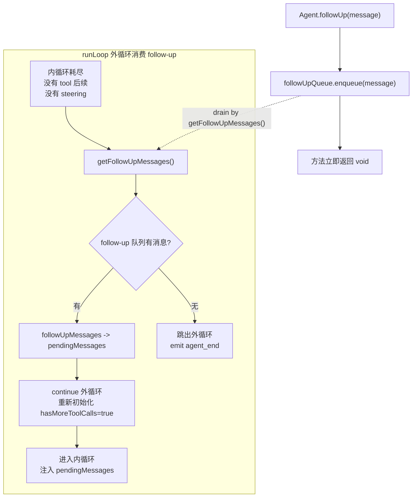

使用场景：

- **顺序任务排队**：用户在当前 run 还没结束时输入“完成后再帮我生成总结”。这不是纠偏当前 turn，而是下一步任务，适合 `followUp()`。
- **长任务分阶段执行**：外层系统可以在当前阶段结束后追加下一阶段，例如“先分析，再生成报告，再提出改进计划”。每一阶段可作为 follow-up 在外循环尾部消费。
- **避免打断当前推理**：当前 assistant 正在围绕已有目标调用工具时，如果插入消息可能扰乱上下文，就用 `followUp()` 等它自然收尾。
- **与 `continue()` 配合**：如果 agent 已经停在 assistant 结尾，而 follow-up 队列里有消息，后续 `continue()` 会优先 drain follow-up 并启动新 run。

详细说明：

- `followUp()` 和 `steer()` 都是 enqueue，但消费时机不同。
- `followUp()` 不会打断当前 turn，也不会在下一次 assistant 响应前立即插入；它要等当前 run 的内循环自然耗尽。
- 外循环拿到 follow-up 后，会把它转成 `pendingMessages`，然后 `continue` 外循环，重新进入内循环。
- `followUpMode` 控制 drain 策略：`"one-at-a-time"` 每次外循环只取一个 follow-up，让后续任务按阶段串行推进；`"all"` 会把当前排队的所有 follow-up 一次性转成 `pendingMessages`，在同一次外循环续跑里交给下一轮 assistant 处理。
- 对 follow-up 来说，`"one-at-a-time"` 更适合“做完 A 再做 B 再做 C”的任务队列，因为每个后续任务会在上一阶段产生的新上下文之后再进入。`"all"` 更适合批处理多个同级追加要求，但它会让这些 follow-up 同时进入同一轮上下文，模型可能把它们合并理解和处理。

#### 3.2.6 `abort()` 流程：请求取消当前 active run

**功能定位**：`abort()` 是取消信号入口。它不直接清理状态，也不直接发 `agent_end`；它只是触发当前 `AbortController`，让 provider stream 和工具执行尽快停止。

| 项 | 内容 |
|---|---|
| 输入 | 无 |
| 返回 | `void` |
| 是否启动 run | 否 |
| 是否进入 `runLoop()` | 否，但会影响当前正在运行的 `runLoop()` |
| 核心动作 | `this.activeRun?.abortController.abort()` |

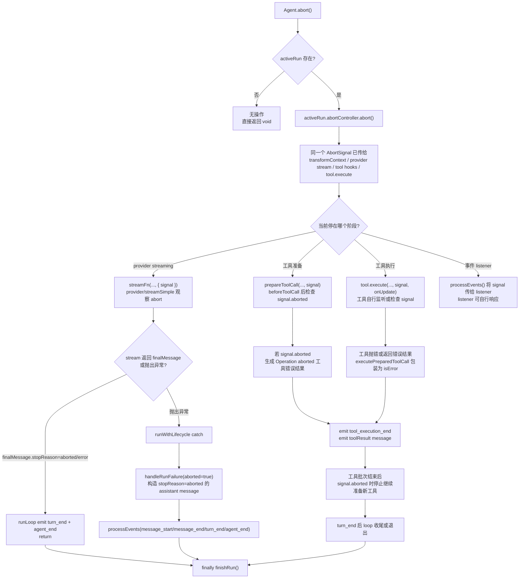

使用场景：

- **用户手动取消**：用户按 Esc/Ctrl+C 或点击停止按钮时，产品层应调用 `abort()`，请求当前 provider streaming 或工具执行尽快终止。
- **切换会话/关闭前收尾**：在切换 session、关闭 UI、执行 compaction 前，如果 agent 仍在运行，可以先 `abort()`，再 `await waitForIdle()` 等待状态稳定。
- **超时或预算控制**：外层检测到运行超过时间、token 或费用预算时，可以调用 `abort()` 中断当前 run。
- **安全拦截**：如果运行中发现危险动作、权限变化或项目信任状态变化，产品层可以调用 `abort()` 停止当前执行链。

详细说明：

- **signal 不是 abort 时才传进去的，而是在 run 启动前就已经传进去了。** `runWithLifecycle()` 创建 `AbortController` 后，把 `abortController.signal` 传给 executor；`runPromptMessages()` / `runContinuation()` 再把同一个 signal 传给 `runAgentLoop()` / `runAgentLoopContinue()`，最终进入 `runLoop()`、provider stream、tool hooks 和工具执行函数。
- 因此 `abort()` 调用时，`runLoop()` 虽然已经在运行，但它和下游 provider/tool/hook 手里早就持有同一个 `AbortSignal` 对象引用。`abort()` 只是调用 `activeRun.abortController.abort()`，把这个共享对象的 `signal.aborted` 状态改成 `true`。
- 可以把它理解成：运行开始时，`Agent` 把同一盏“红灯”交给 `runLoop()`、provider 和工具；运行中调用 `abort()` 只是把这盏红灯点亮。之后各阶段在 await 返回、显式检查或 abort listener 中看到红灯，才开始取消和收尾。
- `abort()` 不直接修改 `runLoop()` 的 `while` 条件，也不会同步 `break` 掉循环。它只调用 `activeRun.abortController.abort()`，把当前 run 的 `AbortSignal` 标记为 aborted。
- 这个 `AbortSignal` 在 `runWithLifecycle()` 创建后一路传给 `runAgentLoop()` / `runLoop()`，再传入 `transformContext()`、`streamAssistantResponse()`、`executeToolCalls()`、`beforeToolCall()`、`afterToolCall()` 和具体工具的 `execute()`。
- 在 provider streaming 阶段，`streamAssistantResponse()` 调用 `streamFunction(config.model, llmContext, { ..., signal })`。如果 provider stream 响应 abort 并产出 `stopReason: "aborted"` 或 `"error"` 的 final message，`runLoop()` 会 emit `turn_end` 和 `agent_end` 后直接 return；如果它抛异常，则由 `runWithLifecycle()` catch。
- 在工具准备阶段，`prepareToolCall()` 会把 signal 传给 `beforeToolCall()`，并在 hook 之后检查 `signal?.aborted`。如果已经 abort，会返回一个 immediate 工具错误结果：`Operation aborted`。
- 在工具执行阶段，`executePreparedToolCall()` 把 signal 传给 `tool.execute(toolCallId, args, signal, onUpdate)`。具体工具决定如何响应：例如 bash 工具会监听 abort 并 kill 进程树，read/grep/find/ls/write/edit 等工具会在异步边界监听或检查 `signal.aborted`。
- 在顺序工具模式下，每个工具完成后会检查 `signal?.aborted`，如果已取消就停止继续执行后续工具。
- 在并行工具模式下，preflight/准备阶段会在 abort 后停止继续准备新工具；已经启动的工具会通过同一个 signal 自行停止，外层仍会等待 `Promise.all` 收齐已启动工具的结果。因此并行工具取消是否立刻结束，取决于工具实现是否及时响应 signal。
- 如果 abort 导致异常冒泡到 `runWithLifecycle()`，`handleRunFailure(error, aborted=true)` 会构造一个 assistant failure message，`stopReason` 为 `"aborted"`，再依次调用 `processEvents(message_start/message_end/turn_end/agent_end)`。
- 最终清理总是在 `finally` 中由 `finishRun()` 完成：`isStreaming=false`、`streamingMessage=undefined`、`pendingToolCalls` 清空、`activeRun=undefined`，并 resolve `activeRun.promise`。
- 因此 `abort()` 的完整推荐用法通常是：`agent.abort(); await agent.waitForIdle();`。前者发取消信号，后者等待 loop、工具、事件 listener 和 `finishRun()` 全部收尾。

#### 3.2.7 `reset()` 流程：直接清空 Agent 内部状态

**功能定位**：`reset()` 是硬清理接口。它不通过事件流，不进入 `runLoop()`，也不等待 listener；它直接修改 `Agent` 内部状态和队列。

| 项 | 内容 |
|---|---|
| 输入 | 无 |
| 返回 | `void` |
| 是否启动 run | 否 |
| 是否进入 `runLoop()` | 否 |
| 核心动作 | 清空 transcript、运行态、错误态、steering/follow-up 队列 |

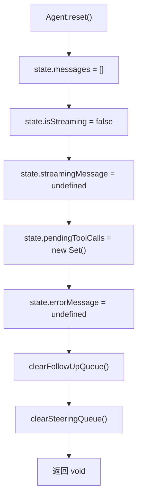

使用场景：

- **新会话或清空上下文**：用户执行 `/clear`、切到新的空 session、或测试里要复用同一个 `Agent` 实例但丢弃历史 transcript 时，可以调用 `reset()`。
- **错误恢复后的硬重置**：当状态已不可继续，例如消息序列污染、工具状态和 transcript 不一致，`reset()` 可以直接回到空 transcript。
- **测试隔离**：单元测试中可以在 case 之间调用 `reset()`，避免上一个 case 的 messages、pending tool calls、队列影响下一个 case。
- **不适合优雅停止**：如果当前 run 正在运行，`reset()` 不会通知 provider/tool 停止，也不会等待 listener。稳妥做法是 `abort()` -> `waitForIdle()` -> `reset()`。

详细说明：

- `reset()` 不会停止正在运行的 `runLoop()`。它没有调用 `activeRun.abortController.abort()`，也不会等待 `activeRun.promise`，因此不是取消接口。
- 如果在 loop 正在运行时调用 `reset()`，它只会同步清空 `Agent._state` 和两个队列；但已经启动的 `runLoop()` 仍然持有启动时的 `currentContext` 快照，provider stream 或工具执行也仍会继续。
- 运行中的 loop 后续如果继续 `emit(event)`，事件仍会回到 `processEvents(event)`。这意味着刚被 `reset()` 清空的 `_state.messages` 可能又被后续 `message_end` 事件重新追加消息，`streamingMessage`、`pendingToolCalls` 等运行态也可能被后续事件再次更新。
- 因此 `reset()` 更适合在 agent 已经空闲时使用。如果需要“停止并清空”，推荐顺序是：`agent.abort(); await agent.waitForIdle(); agent.reset();`。其中 `abort()` 负责发取消信号，`waitForIdle()` 负责等待 loop/tool/listener/`finishRun()` 收尾，`reset()` 最后清空稳定状态。
- `reset()` 不会调用 `abort()`，也不会等待当前 active run。
- 因为它不发事件，`AgentSession`、UI 和 extension 不会通过 agent event 自动得知每一步清理。
- 实践中更稳的使用方式是：如果 agent 正在运行，先 `abort()`，再 `await waitForIdle()`，最后 `reset()`。
- 它适合“丢弃当前 transcript，重新开始”的场景。

#### 3.2.8 `waitForIdle()` 流程：等待 active run 完全收尾

**功能定位**：`waitForIdle()` 是同步点。它不改变状态、不触发 abort、不进入 `runLoop()`；它只是返回当前 active run 的 promise，等待 run 和 awaited listener 都完成。

| 项 | 内容 |
|---|---|
| 输入 | 无 |
| 返回 | `Promise<void>` |
| 是否启动 run | 否 |
| 是否进入 `runLoop()` | 否 |
| 核心动作 | `return this.activeRun?.promise ?? Promise.resolve()` |

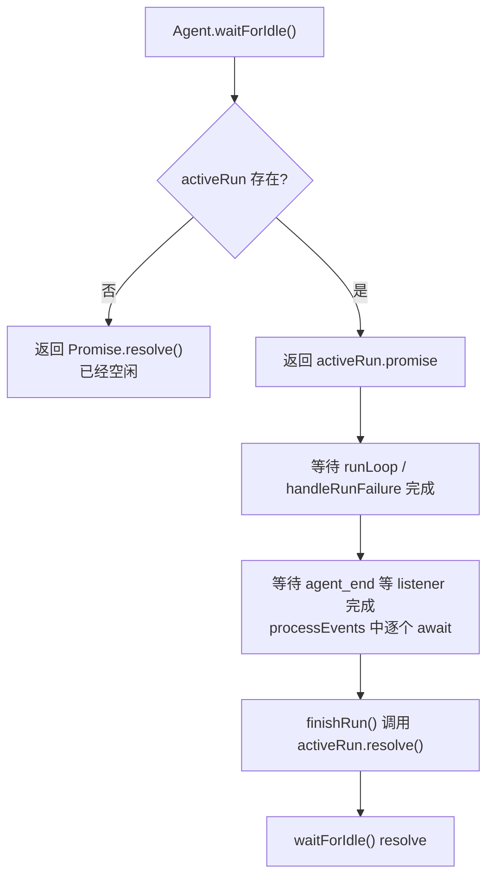

使用场景：

- **取消后等待稳定**：调用 `abort()` 后，通常要 `await waitForIdle()`，确保 provider/tool、事件 listener、`finishRun()` 都完成，再做下一步。
- **会话切换/压缩/导出前同步点**：切 session、compact、导出 transcript 或关闭进程前，需要确保没有正在写入的流式消息和工具事件。
- **测试等待运行结束**：测试中触发 `prompt()`、`steer()`、`followUp()` 后，可以用 `waitForIdle()` 等待事件链完全落定，再断言 state 或 transcript。
- **扩展命令等待 agent 空闲**：extension command 如果需要在 agent 停稳后修改状态或读取最终 transcript，可以调用产品层暴露的 wait-for-idle 能力，底层语义就是 `Agent.waitForIdle()`。

详细说明：

- `waitForIdle()` 的实现非常短：`return this.activeRun?.promise ?? Promise.resolve()`。它本身不轮询、不监听事件，只返回当前 active run 在 `runWithLifecycle()` 中创建的 Promise。
- 这里不会出现“调用 `waitForIdle()` 时不空闲，但函数返回过程中 loop 恰好完成，导致返回错误 Promise”的竞态。原因是 `waitForIdle()` 是同步函数，内部没有 `await`，读取 `this.activeRun` 和返回 Promise 是同一个不可被异步 continuation 插入的小片段。JavaScript 不会在这段同步代码执行到一半时突然去执行 `finishRun()`。
- 可能发生的只有两种顺序：如果 `waitForIdle()` 先执行，它会返回当前 `activeRun.promise`，之后 loop 完成时 `finishRun()` 会 resolve 的正是这个 Promise；如果 `finishRun()` 先执行，`activeRun` 已经是 `undefined`，此时 `waitForIdle()` 返回 `Promise.resolve()` 也正确，因为 agent 已经空闲。
- 换句话说，`waitForIdle()` 只能保证“调用这一刻所看到的 active run 已经完成”。它不保证返回之后没有其他代码又调用 `prompt()` 启动新的 run；也不会等待 listener 内部自行启动但没有被 `await` 的后台任务。
- 这个 Promise 在 `runWithLifecycle()` 启动时创建：
  ```ts
  let resolvePromise = () => {};
  const promise = new Promise<void>((resolve) => {
    resolvePromise = resolve;
  });
  this.activeRun = { promise, resolve: resolvePromise, abortController };
  ```
- `runWithLifecycle()` 随后 `await executor(abortController.signal)`。对于 `prompt()`，这个 executor 会调用 `runAgentLoop(...)`；对于 `continue()`，会调用 `runAgentLoopContinue(...)`。
- loop 中每个事件都会通过 `event => this.processEvents(event)` 回到 `processEvents()`。`processEvents()` 会先更新内部状态，再按注册顺序 `await listener(event, signal)`。因此 `runAgentLoop()` 不会在 listener 尚未处理完时继续越过这些事件屏障。
- 当 `runAgentLoop()` 正常结束，或异常被 `handleRunFailure()` 转成收尾事件后，`runWithLifecycle()` 的 `finally` 会调用 `finishRun()`。
- `finishRun()` 里会执行 `this.activeRun?.resolve()`，也就是 resolve `waitForIdle()` 返回的那个 Promise；随后把 `activeRun` 置为 `undefined`。因此 `waitForIdle()` resolve 的时刻，代表当前 run 的 loop、收尾事件、awaited listener 和运行态清理都已经完成。
- 如果调用 `waitForIdle()` 时没有 `activeRun`，说明 agent 已经空闲，它直接返回 `Promise.resolve()`。
- `waitForIdle()` 没有结果值，只表达“现在已经空闲”。
- 它常和 `abort()` 连用：`agent.abort(); await agent.waitForIdle();`。
- `agent_end` 只表示 loop 不再发新事件；真正 idle 要等 `agent_end` listener 完成，并由 `finishRun()` resolve active run promise。
- 如果调用时没有 active run，它立即返回 resolved promise。

#### 3.2.9 七个接口和双循环的关系总结

| 接口 | 是否启动 run | 是否进入 `runLoop()` | 队列/状态影响 |
|---|---:|---:|---|
| `prompt()` | 是 | 是 | 新增 prompt messages，启动完整 `runAgentLoop()`。 |
| `continue()` | 是 | 是 | 从已有 transcript 继续；assistant 结尾时会优先消费队列。 |
| `steer()` | 否 | 间接 | 写入 steering 队列，内循环消费。 |
| `followUp()` | 否 | 间接 | 写入 follow-up 队列，外循环消费。 |
| `abort()` | 否 | 否 | 触发当前 run 的 `AbortSignal`。 |
| `reset()` | 否 | 否 | 直接清空 transcript、运行态和队列。 |
| `waitForIdle()` | 否 | 否 | 等待当前 active run promise 完成。 |

### 3.3 AgentMessage 与 LLM Message

`packages/agent/src/types.ts` 定义了 `AgentMessage = Message | CustomAgentMessages[...]`。这意味着 agent-core 允许应用层扩展自定义消息类型，但 provider 只认识标准 LLM 消息。因此每次请求模型前必须经过：

```text
AgentMessage[] -> transformContext() -> AgentMessage[] -> convertToLlm() -> Message[] -> provider
```

这个设计把“产品层上下文工程”和“模型 API 边界”分开了。UI-only 消息、扩展自定义消息、分支摘要、压缩摘要都可以先作为 AgentMessage 存在，再由 `convertToLlm` 决定是否进入模型上下文。

---

## 4. 工具调用流程

工具调用由 `executeToolCalls()` 分派，默认并行执行；如果全局 `toolExecution` 是 `sequential`，或任一目标工具声明 `executionMode === "sequential"`，则整批工具按顺序执行。

### 4.1 执行步骤

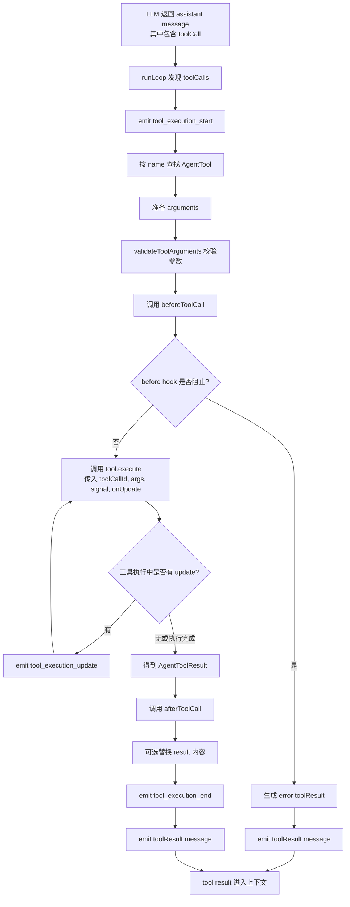

相关代码：

- `prepareToolCall()`：`packages/agent/src/agent-loop.ts:562`
- `executePreparedToolCall()`：`packages/agent/src/agent-loop.ts:628`
- `createToolResultMessage()`：`packages/agent/src/agent-loop.ts:733`

### 4.2 Hook 语义

`beforeToolCall` 在参数校验后、真正执行前运行，可以返回 `{ block: true, reason }` 阻止工具执行。`afterToolCall` 在工具执行后、事件和 toolResult message 发出前运行，可以替换内容、details、错误标志，或设置 `terminate`。

`terminate` 是一个“跳过后续 LLM 调用”的提示，但只有本批所有工具结果都设置 `terminate: true` 时，agent loop 才会提前停止这一批后续循环。这避免混合工具批次中某个工具单方面截断整个 agent。

---

## 5. Pi 产品层如何集成 agent-core

`packages/coding-agent/src/core/sdk.ts:166` 的 `createAgentSession()` 是 SDK/产品层入口。它做了几件事：

1. 解析 `cwd`、`agentDir`、settings、auth storage、model registry、session manager。
2. 通过 `findInitialModel()` 选择模型，恢复已有 session 中的模型和 thinking level。
3. 默认启用 `read`、`bash`、`edit`、`write` 四个内置工具（`sdk.ts:244`）。
4. 创建低层 `Agent`（`sdk.ts:293`）。
5. 注入自定义 `streamFn`：从 `ModelRegistry` 获取 API key/headers/env，再调用 `streamSimple()`。
6. 注入 `transformContext`：交给 extension runner 修改上下文。
7. 创建 `AgentSession`（`sdk.ts:377`），把低层 `Agent` 接入 Pi 的会话和扩展系统。

`AgentSession` 位于 `packages/coding-agent/src/core/agent-session.ts:265`。构造时会：

- 订阅低层 Agent 事件（`agent-session.ts:352`）。
- 安装 tool hooks（`agent-session.ts:414`）。
- 构建运行时工具/扩展注册表（`agent-session.ts:2402`）。

内置工具注册由 `_buildRuntime()` 完成：它调用 `createAllToolDefinitions()` 构建基础工具，并将 extensions 注册的工具合并进 tool registry。随后 `setActiveToolsByName()`（`agent-session.ts:812`）把激活工具写回 `agent.state.tools`，并重建 system prompt。

---

## 6. Pi Agent 的一次完整运行

从用户在 Pi 里输入 prompt 到 agent 停止，大致流程如下：

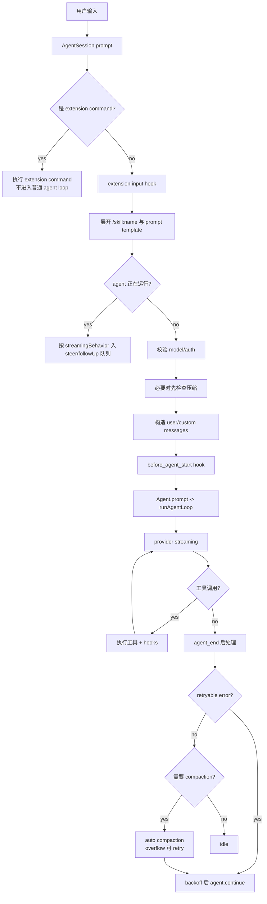

这里有几个产品层增强：

- `prompt()` 会先处理 extension command；扩展命令即使 agent 正在 streaming 也可以立即执行。
- 普通 prompt 在 streaming 中必须显式选择 `steer` 或 `followUp`。
- 每次新 prompt 前会检查上一条 assistant message 是否触发压缩。
- agent_end 后 `_handlePostAgentRun()` 会处理 retry、compaction 和 extension 在 agent_end 阶段追加的新队列消息。

---

## 7. 会话树、分支与压缩

Pi 会话是 JSONL 树结构。官网和 README 都说明 session entry 有 `id` 与 `parentId`，这使 `/tree` 能在单个文件内跳转到历史节点并继续。

agent-core 的通用 session 抽象在 `packages/agent/src/harness/session/session.ts`：

- `buildSessionContext()`：`session.ts:22`
- `Session.appendMessage()`：`session.ts:132`
- `Session.appendCompaction()`：`session.ts:173`
- `Session.moveTo()`：`session.ts:247`

coding-agent 也有自己的 `SessionManager`，位于 `packages/coding-agent/src/core/session-manager.ts:758`。它处理 JSONL 文件、迁移、label、fork、branch summary 等产品细节。

### 7.1 压缩上下文重建

当存在 compaction entry 时，context 重建逻辑不是简单回放所有消息，而是：

1. 先插入 compaction summary message。
2. 从 `firstKeptEntryId` 开始保留压缩前的近期消息。
3. 追加 compaction 之后的新消息。

这既保留了可追溯的完整 JSONL 历史，又让模型上下文变短。

### 7.2 自动压缩与溢出恢复

`AgentSession._checkCompaction()` 位于 `agent-session.ts:1816`。它处理两类情况：

- `overflow`：模型返回上下文溢出，或 usage 超过窗口。若 assistant 未正常 stop，会移除错误 assistant message，运行自动压缩，然后 `agent.continue()` 重试一次。
- `threshold`：上下文接近窗口阈值，自动压缩但不自动重试，因为本次回答已成功完成。

自动压缩实际由 `_runAutoCompaction()`（`agent-session.ts:1910`）完成，支持 extension 通过 `session_before_compact` 提供自定义压缩结果。

### 7.3 自动重试

`_isRetryableError()`（`agent-session.ts:2492` 附近）把 rate limit、429、5xx、网络错误、WebSocket 断连、timeout 等识别为可重试错误，但上下文溢出不走 retry，而走 compaction。`_prepareRetry()` 使用指数退避后让调用方继续 `agent.continue()`。

---

## 8. AgentHarness：agent-core 内置的高层封装

除了低层 `Agent`，`agent-core` 还提供 `AgentHarness`（`packages/agent/src/harness/agent-harness.ts:157`）。它更像一个可复用的“产品化 agent runtime”，内建：

- `ExecutionEnv` 抽象：文件系统与 shell 能力。
- `Session` 抽象：消息、模型、thinking level、active tools、compaction、branch summary。
- hooks：`before_agent_start`、`context`、`before_provider_request`、`before_provider_payload`、`tool_call`、`tool_result`、`session_before_compact`、`session_before_tree` 等。
- `prompt()`、`skill()`、`promptFromTemplate()`、`steer()`、`followUp()`、`nextTurn()`。
- `compact()` 与 `navigateTree()`。

`AgentHarness.createLoopConfig()`（`agent-harness.ts:399`）把这些 hooks 映射到低层 `AgentLoopConfig`，`executeTurn()`（`agent-harness.ts:531`）最终仍调用 `runAgentLoop()`。

换句话说，`AgentHarness` 是一个库级高层 harness；`coding-agent/AgentSession` 是 Pi CLI 自己的产品级 harness。两者都复用了同一个 `agent-loop`。

---

## 9. 设计评价

### 优点

1. **循环边界清晰**  
   `agent-loop.ts` 只关心消息、模型流、工具调用和队列；产品能力放到 `Agent`、`AgentSession` 或 `AgentHarness`。

2. **事件流适合 TUI/RPC/SDK 复用**  
   所有阶段都发事件：`agent_start`、`turn_start`、`message_update`、`tool_execution_update`、`turn_end`、`agent_end`。TUI 可以实时渲染，RPC/JSON 模式也能自然转发。

3. **工具治理点足够靠近执行边界**  
   `beforeToolCall` 在参数校验后运行，适合做权限、审计、拦截；`afterToolCall` 可改写工具结果，适合脱敏、补 metadata 或终止后续循环。

4. **会话树设计支持真实工作流**  
   JSONL + `id/parentId` 让用户能回到任意消息点继续；compaction 不破坏历史，只改变当前 context 重建方式。

5. **扩展优先，而非内置所有高级功能**  
   Pi 官方明确不内置 sub-agents、plan mode、permission popups、MCP 等，而是让 extensions/packages 实现。这使 core 保持小，但也要求扩展生态承担更多能力。

### 风险与代价

| 风险 | 说明 |
|---|---|
| 产品层与 core 有两套 harness 语义 | `AgentHarness` 和 `coding-agent/AgentSession` 都封装会话、hook、压缩，后续可能产生概念重复 |
| hook 能力很强，安全边界取决于 extension 信任 | Pi packages/extensions 可运行任意代码，README 也提示需要审查第三方包 |
| 自动压缩是有损的 | 完整历史仍在 JSONL，但模型看到的是 summary + recent messages，摘要质量会影响后续 agent 行为 |
| 工具并行执行要求工具本身并发安全 | 默认并行提高效率，但文件编辑、shell、副作用工具需要通过 `executionMode: "sequential"` 或产品层队列保护 |
| 上下文/重试逻辑分散在产品层 | 低层 agent-core 不直接管自动压缩和 provider retry，嵌入方如果只用 `Agent` 需要自己实现这些策略 |

---

## 10. 参考资料

- Pi 官网：https://pi.dev/
- GitHub 仓库：https://github.com/earendil-works/pi
- `packages/agent` 源码：https://github.com/earendil-works/pi/tree/main/packages/agent
- `packages/coding-agent` 源码：https://github.com/earendil-works/pi/tree/main/packages/coding-agent
- 本地源码快照：`agent/agent-framework/pi/_src`

---

## 附录：关键代码索引

| 主题 | 文件与行 |
|---|---|
| 低层主循环 | `packages/agent/src/agent-loop.ts:155` |
| LLM 流式响应 | `packages/agent/src/agent-loop.ts:275` |
| 工具调用分派 | `packages/agent/src/agent-loop.ts:373` |
| 工具前置检查 | `packages/agent/src/agent-loop.ts:562` |
| 工具执行 | `packages/agent/src/agent-loop.ts:628` |
| ToolResult message 构造 | `packages/agent/src/agent-loop.ts:733` |
| `Agent` 类 | `packages/agent/src/agent.ts:166` |
| `Agent.prompt()` | `packages/agent/src/agent.ts:325` |
| `Agent.continue()` | `packages/agent/src/agent.ts:338` |
| `Agent.createLoopConfig()` | `packages/agent/src/agent.ts:422` |
| `Agent.processEvents()` | `packages/agent/src/agent.ts:509` |
| `AgentHarness` | `packages/agent/src/harness/agent-harness.ts:157` |
| Pi SDK 创建会话 | `packages/coding-agent/src/core/sdk.ts:166` |
| 创建低层 Agent | `packages/coding-agent/src/core/sdk.ts:293` |
| 创建 AgentSession | `packages/coding-agent/src/core/sdk.ts:377` |
| 产品层 AgentSession | `packages/coding-agent/src/core/agent-session.ts:265` |
| 产品层 prompt | `packages/coding-agent/src/core/agent-session.ts:997` |
| 自动压缩检查 | `packages/coding-agent/src/core/agent-session.ts:1816` |
| 自动压缩执行 | `packages/coding-agent/src/core/agent-session.ts:1910` |
| 产品层运行时构建 | `packages/coding-agent/src/core/agent-session.ts:2402` |
