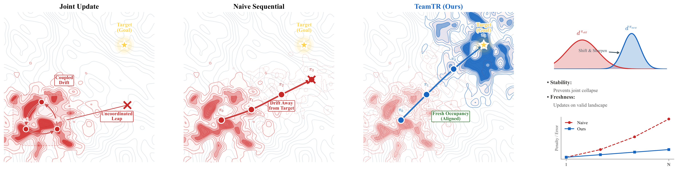
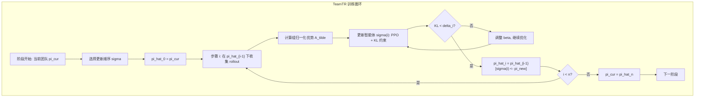
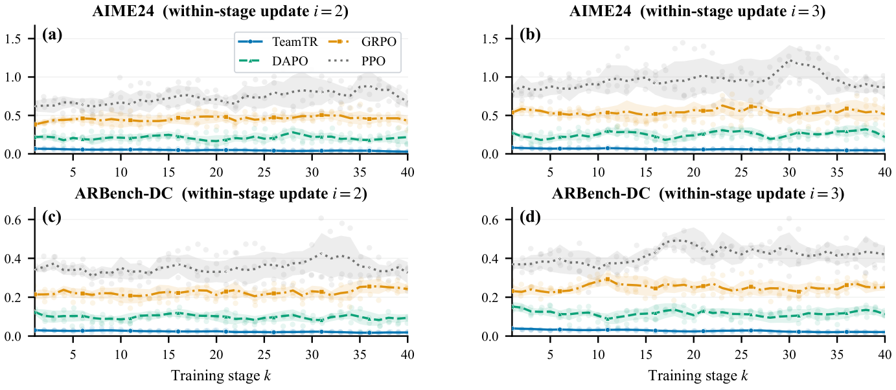
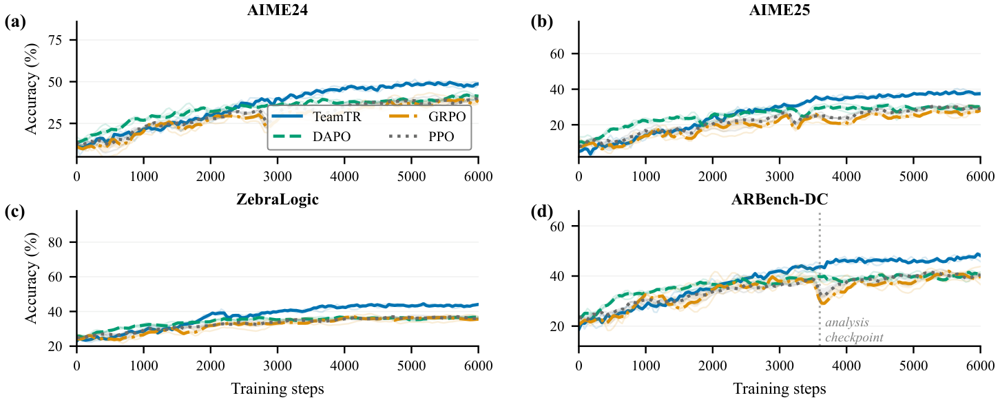
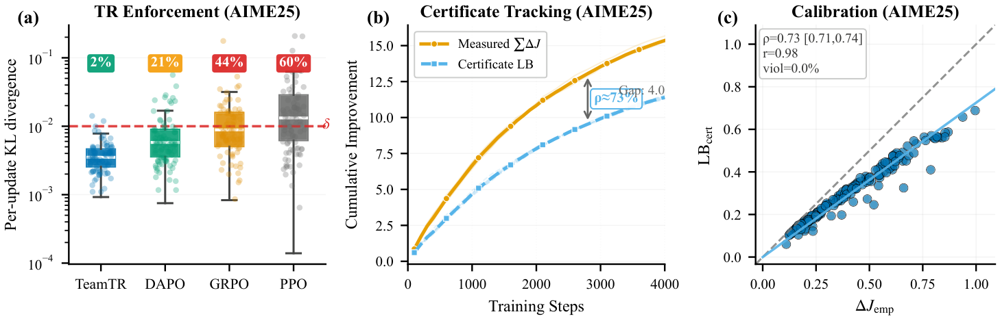
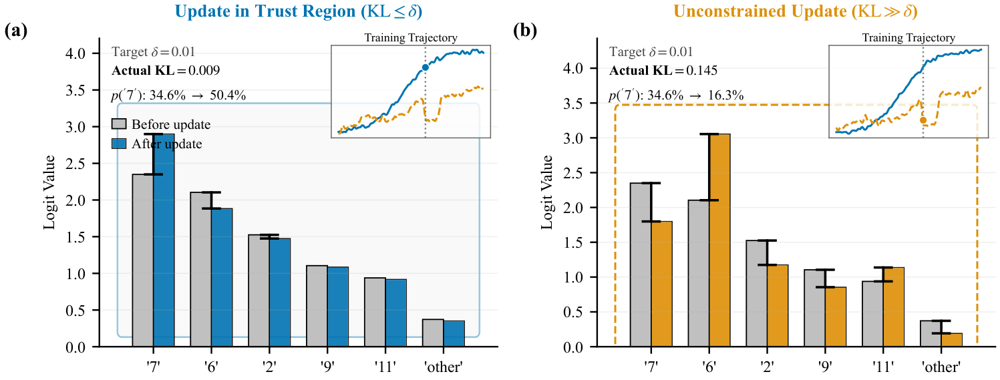
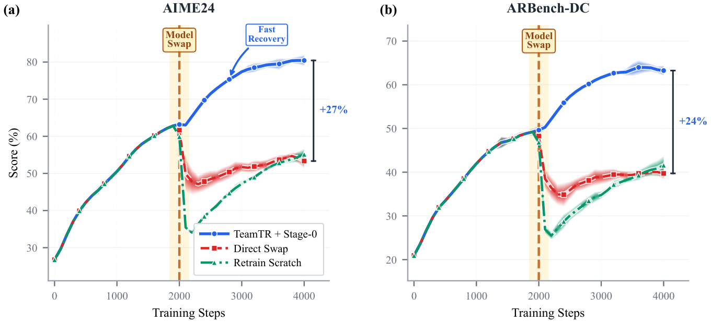

# TeamTR: Trust-Region Fine-Tuning for Multi-Agent LLM Coordination 调研报告

> 论文 + 代码综合调研

---

## 📋 基本信息

| 项目 | 内容 |
|-----|------|
| 论文标题 | TeamTR: Trust-Region Fine-Tuning for Multi-Agent LLM Coordination |
| 作者 | Yi Xie, Siao Liu, Falong Fan, Yuanqi Yao, Yue Zhao, Bo Liu |
| 所属机构 | University of Arizona, Soochow University, INSAIT, Stony Brook University |
| 发表会议 | ICML 2026 (43rd International Conference on Machine Learning, Seoul) |
| 发表年份 | 2026 |
| 论文链接 | https://arxiv.org/abs/2605.15207 |
| 代码仓库 | https://github.com/Yydc/TeamTR |
| 许可证 | Apache 2.0 |
| 基础框架 | VERL (ByteDance) |

---

## 1. 研究背景与动机

### 1.1 问题定义

多智能体 LLM 系统（Multi-Agent LLM Systems）通过协调多个角色特化的 LLM 组件来完成复杂推理和任务执行。然而，近期的评估表明（Cemri et al., 2025），这类多智能体系统**往往不如单个强模型加上 best-of-N 采样**，这种失败被归因于"次优的协调协议"。

本文深入分析后发现，**训练过程本身**才是引入偏差和破坏协调的根源——在共享上下文团队（shared-context team）的序列化微调中，存在一种被忽视的**复合占据度偏移（compounding occupancy shift）**问题。

### 1.2 研究动机

**现有训练方法的困境**：

1. **联合更新（Joint Update）**：所有智能体同时更新，但耦合的策略变化使得优化难以控制，在 MARL 中已知会导致不稳定
2. **朴素序列更新（Naive Sequential Update）**：逐个更新智能体，看似更稳定，但引入了新的失败模式——每次更新改变了团队的状态分布，当后续更新在缓存的 rollout 上评估时，这种分布不匹配会**复合累积**



*Figure 1: 更新轨迹在团队目标景观上的行为。左图——联合更新导致耦合漂移和不协调跳跃；中图——朴素序列更新因陈旧占据度而偏离目标；右图——TeamTR 在每次更新后重新采样，稳定到达目标。嵌入小图显示：占据度分布（上）和惩罚项缩放（下）。*

### 1.3 研究目标

- **形式化定义**共享上下文多 LLM 微调中的复合占据度偏移问题
- **证明**陈旧占据度评估会导致 O(n²√δ̄) 的惩罚，而中间占据度评估可将其降至 O(n√δ̄)
- **提出**TeamTR 框架，通过中间占据度评估 + 逐智能体信任域约束，实现**可证明的逐步改进下界**
- **验证**框架在多个推理基准上的有效性，以及支持即插即用组件替换

---

## 2. 核心贡献

### 2.1 主要贡献

| 编号 | 贡献描述 |
|-----|---------|
| C1 | 形式化了共享上下文多 LLM 微调中的**复合占据度偏移**问题，证明陈旧占据度评估会产生 O(n²√δ̄) 的惩罚（Section 3） |
| C2 | 提出 **TeamTR**，通过中间占据度评估将惩罚降至 O(n√δ̄)，并提供严格的逐更新和逐阶段改进下界（Section 3-4） |
| C3 | 实验验证 TeamTR 相比单智能体和序列基线平均提升 7.1%，稳定训练过程，并支持即插即用组件替换（Section 5） |

### 2.2 创新点

1. **理论创新**：首次在多智能体 LLM 场景下，将占据度偏移问题从 O(n²) 降至 O(n)，这是从理论到实践的核心突破
2. **技术创新**：Token 分解的信任域约束 + 中间占据度重采样，使得信任域在 LLM 的自回归 token 空间中可计算、可监控
3. **实践创新**：即插即用的智能体替换机制（Stage-0 对齐），支持运行时动态升级团队组件

---

## 3. 方法详解

### 3.1 方法概述

TeamTR 的核心思想可以一句话概括：**在多智能体序列化微调中，每次只更新一个智能体，更新前在当前（部分更新的）团队上重新采样 rollout，并通过逐 token 的 KL 约束限制每次更新的幅度，从而保证整个训练过程有可证明的改进下界。**

这与朴素序列训练的关键区别在于：
- 朴素方法在阶段开始时收集一次 rollout，所有后续更新都复用这些 rollout → 分布漂移累积
- TeamTR 在每次更新前都重新收集 rollout → 每个智能体在"最新"的团队分布上训练

### 3.2 整体架构



**架构文字描述**：

- **阶段循环（外层）**：每个阶段开始时，记录当前团队策略 $\pi_{cur}$，选择一个更新顺序 $\sigma$（任意排列）
- **步骤循环（内层）**：对于步骤 $i = 1,...,n$：
  - **Rollout 收集**：在中间策略 $\hat{\pi}^{i-1}$（即前 $i-1$ 个智能体已更新后的团队）下收集新 rollout
  - **优势计算**：使用组归一化的 REINFORCE 信号计算优势
  - **智能体更新**：使用 PPO 裁剪目标 + 自适应 KL 惩罚更新智能体 $\sigma(i)$
  - **信任域检查**：监控 token 级 KL 散度，确保不超过 $\delta_i$
  - **策略替换**：将更新后的智能体策略替换到团队中，形成新的中间策略 $\hat{\pi}^i$
- **关键设计决策**：每次更新前重新采样 rollout（中间占据度评估），而非复用阶段开始的 rollout（陈旧占据度评估）

### 3.3 核心算法

#### 3.3.1 算法流程

```
Algorithm 1: TeamTR 阶段化序列微调
Input: 团队 π_cur = {π^(j)}_{j=1}^n, 信任域半径 {δ_i}, 提示分布 D, 组大小 G, 路由器 R
Output: 更新后的团队 π_cur

1: for stage k = 1, 2, ... do
2:   采样批次 B ⊂ D; 选择更新顺序 σ
3:   π̂⁰ ← π_cur
4:   for i = 1 to n do
5:     在 π̂ⁱ⁻¹ 下用路由器 R 收集 G 个 rollout
6:     通过公式 (9) 计算组归一化优势 Ã
7:     通过公式 (10) 更新 π^(σ(i)) 直到 d_DKL_tok ≤ δ_i
8:     π̂ⁱ ← π̂ⁱ⁻¹[σ(i) ← π^(σ(i))_new]
9:   end for
10:  π_cur ← π̂ⁿ
11: end for
```

#### 3.3.2 算法逐步解读

| 步骤 | 操作 | 输入 | 输出 | 设计意图 |
|-----|-----|-----|-----|---------|
| Step 1 | 采样批次 + 选择更新顺序 | 提示分布 D | 批次 B, 排列 σ | 任意排列均适用，理论保证不依赖特定顺序 |
| Step 2 | 初始化中间策略 | π_cur | π̂⁰ | 阶段开始的团队策略 |
| Step 3 | 在中间策略下收集 rollout | π̂ⁱ⁻¹, 路由器 R | 轨迹数据 | **核心步骤**：在最新团队分布上采样，避免陈旧 |
| Step 4 | 计算组归一化优势 | 轨迹返回 {R_g} | Ã_g | REINFORCE 信号 + 组归一化 + 裁剪 |
| Step 5 | PPO 更新 + KL 约束 | 优势, log_prob | 更新后的策略 | 裁剪目标 + 自适应 KL 惩罚 |
| Step 6 | 信任域检查 | token KL | 是否满足 d_KL ≤ δ_i | 确保每次更新幅度受控 |
| Step 7 | 策略替换 | π̂ⁱ⁻¹, 新策略 | π̂ⁱ | 更新团队中的单个智能体 |

### 3.4 关键模块详解

#### 模块 A: 共享上下文团队的 MDP 建模

- **功能**: 将团队执行建模为折扣 MDP $M = (S, \{A_j\}^n_{j=1}, P, r, \gamma)$
- **核心概念**:
  - 状态 $s \in S$：共享文本上下文（提示 + 累积消息）
  - 宏动作 $a_j \in A_j$：智能体 $j$ 发出的消息（token 序列）
  - 团队策略因子化：$\pi(a\mid s) = \prod_{j=1}^n \pi^{(j)}(a_j\mid s)$

**关键引理 — 回合制协议下的活跃因子归约**：

> **Lemma 3.1**: 在回合制协议下，每个状态只有1个活跃智能体，其他智能体执行 no-op。此时：
> $D_{KL}(\pi'(\cdot\mid s) \Vert \pi(\cdot\mid s)) = D_{KL}(\pi'^{(j(s))}(\cdot\mid s) \Vert \pi^{(j(s))}(\cdot\mid s))$
>
> **直觉理解**：团队级别的 KL 散度等于活跃智能体的 KL 散度，将不可计算的联合动作空间约束降为单智能体约束。

- **与论文其他部分的关系**：这是整个信任域框架的理论基础，使得后续所有定理都能在单智能体空间中表述。

#### 模块 B: Token 分解信任域

- **功能**: 控制每次更新的占据度偏移
- **核心公式**:

$$D^{\rho}_{KL,tok}(\pi \Vert \pi') := \mathbb{E}_{s \sim d^{\rho}} D_{KL}(\pi(\cdot\mid s) \Vert \pi'(\cdot\mid s))$$

**Token 级分解**（链式法则，Lemma 3.2）：

$$D_{KL}(\pi^{(j)}(\cdot\mid s) \Vert \pi'^{(j)}(\cdot\mid s)) = \mathbb{E}_{m \sim \pi^{(j)}(\cdot\mid s)} \sum_{u=1}^{T(m)} D_{KL}(\pi_u \Vert \pi'_u)$$

- **直觉理解**：消息级别的 KL 可以精确分解为 token 级别 KL 的求和。这意味着我们可以从行为策略的 rollout 中直接估计 KL，无需从更新策略采样。
- **约束形式**：$D^{\hat{\pi}^{i-1}}_{KL,tok}(\pi^{(\sigma(i))}_{cur} \Vert \pi^{(\sigma(i))}_{tar}) \leq \delta_i$

**Token 级 KL 监控（公式 11）**：

$$\hat{d}_{KL,tok} := \frac{1}{\lvert M_j \rvert} \sum_{m \in M_j} \sum_{u=1}^{\lvert m \rvert} \log \frac{\pi^{(j)}_{cur}(x_u \mid s, x_{\lt u})}{\pi^{(j)}_{new}(x_u \mid s, x_{\lt u})} \leq \delta_i$$

- **与论文其他部分的关系**：直接支撑定理 3.4-3.6 的改进下界，是理论保证可实施的关键。

#### 模块 C: 中间占据度代理（Intermediate-Occupancy Surrogates）

- **功能**: 在正确的分布上评估更新质量
- **核心公式**:

$$L^{seq}_i = \frac{1}{1-\gamma} \mathbb{E}_{s \sim d^{\hat{\pi}^{i-1}}, a \sim \hat{\pi}^i(\cdot\mid s)} [\hat{A}_{i-1}(s,a)]$$

**对比陈旧占据度代理**：

$$L^{stale}_i = \frac{1}{1-\gamma} \mathbb{E}_{s \sim d^{\hat{\pi}^0}, a \sim \hat{\pi}^i(\cdot\mid s)} [\hat{A}_{i-1}(s,a)]$$

- **关键命题（Proposition 3.3）**：两者之间的关系为：

$$L^{seq}_i \geq L^{stale}_i - \frac{\sqrt{2\gamma}}{(1-\gamma)^2} A_{max} \sum_{k\lt i} \sqrt{\delta_k}$$

- **直觉理解**：L^{seq}_i 在"前 i-1 个智能体已更新"的分布上评估，而 L^{stale}_i 在"阶段开始时"的分布上评估。后者会因为分布不匹配引入额外误差，且该误差随 i 线性累积。

#### 模块 D: 组归一化优势

- **功能**: 降低优势估计的方差
- **核心公式**:

$$\tilde{A}_g = \text{clip}\left(\frac{R_g - \mu}{\sigma}, -A_{clip}, A_{clip}\right)$$

其中 $\mu = \frac{1}{G}\sum R_g$，$\sigma = \sqrt{\frac{1}{G}\sum(R_g - \mu)^2 + \varepsilon_{norm}}$

其中 μ = (1/G)∑R_g, σ = √((1/G)∑(R_g - μ)² + ε_norm)

- **直觉理解**：对每个提示采样 G 个 rollout，用组内归一化来减少方差，类似 GRPO 的做法。裁剪保证优势有界，偏差被吸收进 ζ_i。
- **与论文其他部分的关系**：这是 GRPO 思想在多智能体场景的适配，优势被广播到该轨迹中消息的所有 token 上。

#### 模块 E: 逐智能体 PPO 更新 + 自适应 KL 惩罚

- **功能**: 执行受信任域约束的策略更新
- **核心公式**:

$$L^{(j)} = \mathbb{E}_{m \sim \hat{\pi}^{i-1}} [\min(w\tilde{A}, \text{clip}_{\varepsilon}(w)\tilde{A})] - \beta\hat{d}_{KL,tok}$$

其中 $w(m;s) = \prod_{u=1}^{\lvert m \rvert} \frac{\pi^{(j)}_{new}(x_u \mid s, x_{\lt u})}{\pi^{(j)}_{cur}(x_u \mid s, x_{\lt u})}$

- **直觉理解**：标准 PPO 裁剪目标 + KL 惩罚项。$\beta$ 通过自适应调整来满足信任域约束。

### 3.5 理论保证

#### 定理 3.4：逐更新改进下界

> 在信任域 $D^{\hat{\pi}^{i-1}}_{KL,tok}(\pi^{(\sigma(i))}_{cur} \Vert \pi^{(\sigma(i))}_{tar}) \leq \delta_i$ 下：
>
> $$J(\hat{\pi}^i) - J(\hat{\pi}^{i-1}) \geq L^{seq}_i - \frac{\sqrt{2\gamma}}{(1-\gamma)^2} \cdot A_{max} \cdot \sqrt{\delta_i} - \frac{1}{1-\gamma} \cdot \zeta_i$$

其中 $\zeta_i$ 为代理估计误差上界。

#### 定理 3.6：逐阶段改进下界

> 对任意更新顺序 $\sigma$，整个阶段的改进下界为：
>
> $$J(\bar{\pi}) - J(\pi_{cur}) \geq \sum_i L^{seq}_i - c \cdot \sum_i \sqrt{\delta_i} - \frac{1}{1-\gamma} \cdot \sum_i \zeta_i$$
>
> 其中 $c = \frac{\sqrt{2\gamma}}{(1-\gamma)^2} \cdot A_{max}$

**关键含义**：当所有 $\delta_i \leq \bar{\delta}$ 时，KL 惩罚项为 $O(n\sqrt{\bar{\delta}})$（线性于智能体数量），而非陈旧占据度下的 $O(n^2\sqrt{\bar{\delta}})$。

#### 定理 3.7：陈旧占据度下的下界

> 使用陈旧占据度代理时：
>
> $$J(\bar{\pi}) - J(\pi_{cur}) \geq \sum_i L^{stale}_i - c \cdot n \cdot \sum_i \sqrt{\delta_i} - \frac{1}{1-\gamma} \cdot \sum_i \zeta_i$$
>
> 当 $\delta_i \approx \bar{\delta}$ 时，惩罚项为 $O(n^2\sqrt{\bar{\delta}})$

#### 命题 3.8-3.9：即插即用的可恢复性

> 替换一个智能体后，只要重新建立信任域簿记，改进下界的形式保持不变。若替换后获得更高的代理值或更小的 $\delta$，则下界单调改进（证书紧致化）。

### 3.6 关键技术

| 技术点 | 描述 | 作用 | 论文对应位置 |
|-------|-----|-----|------------|
| Token 分解 KL | 消息级 KL 链式分解为 token 级求和 | 使信任域在自回归空间可计算 | Section 3.2, Lemma 3.2 |
| 中间占据度评估 | 每次更新前在当前中间团队下重新采样 | 将惩罚从 O(n²) 降至 O(n) | Section 3.3, Prop 3.3 |
| 回合制因子归约 | 活跃智能体 KL = 团队 KL | 将联合约束降为单智能体约束 | Section 3.1, Lemma 3.1 |
| 自适应 KL 惩罚 | 动态调整 β 满足信任域 | 实用的信任域实施方式 | Section 4 |
| Stage-0 对齐 | 新智能体在探测集上蒸馏对齐 | 支持即插即用替换 | Appendix D |

### 3.7 方法设计的关键洞察

1. **复合占据度偏移是根本问题**：不是单个智能体的更新有问题，而是序列更新后分布漂移的累积效应。每个更新只偏移一点（O(√δ)），但 n 个更新累积后偏移是 O(n√δ) 还是 O(n²√δ)，取决于是否在中间分布上评估。
2. **Token 级分解是可行性的关键**：LLM 的消息空间是天文数字大的，无法在联合动作空间上计算 KL。但回合制协议 + token 分解使得这变成可监控的。
3. **信任域不只是正则化，而是提供可证明的保证**：与常见的"加 KL 约束防止跑太远"不同，TeamTR 的信任域是通过严格的数学证明给出改进下界的理论基础。

### 3.8 与现有方法的核心区别

| 环节 | 现有方法做法 | 本文做法 | 改变原因 |
|-----|------------|---------|---------|
| Rollout 采样 | 阶段开始采一次，全阶段复用 | 每次更新前重新采样 | 避免陈旧占据度的复合偏移 |
| KL 约束 | 消息级或无 | Token 分解级 | 自回归消息的 KL 精确可算 |
| 更新策略 | 联合更新 / 独立更新 | 序列化逐智能体更新 | 避免耦合漂移，利用因子化结构 |
| 分布评估 | 阶段初始分布 | 中间占据度分布 | 将惩罚从 O(n²) 降至 O(n) |
| 智能体替换 | 从头训练 | Stage-0 对齐 + 继续 TeamTR | 保持改进证书可恢复 |

---

## 4. 实验分析

### 4.1 实验设置

#### 数据集与基准

| 基准 | 类型 | 题目数量 | 评估方式 | K值 | 来源/说明 |
|-------|-----|---------|---------|-----|---------|
| AIME 2024 | 数学推理 | 30 | pass@K / avg@K | K=64 | 美国数学邀请赛，整数答案 [0,999] |
| AIME 2025 | 数学推理 | 30 | pass@K / avg@K | K=64 | 同上，不同年份 |
| MATH-500 | 数学推理 | 500 | pass@K / avg@K | K=4 | 7 个学科，难度 1-5 |
| ZebraLogic | 逻辑推理 | 1,000 | pass@K / avg@K | K=64 | 自动生成逻辑网格谜题，CSP |
| AutoLogi | 逻辑推理 | 345 | pass@K / avg@K | K=64 | 206 英文 + 139 中文，约束式验证 |
| ARBench-DC | 主动推理 | – | pass@K / avg@K | K=25 | 演绎闭合族 |
| ARBench-SP | 主动推理 | – | pass@K / avg@K | K=25 | 空间推理族 |
| ARBench-GN | 主动推理 | – | pass@K / avg@K | K=25 | 图导航族 |
| PlanBench | 规划 | – | pass@K / avg@K | K=8 | Blocksworld 规划生成，8 种能力 |

#### 模型配置

| 配置 | 模型组合 | 类型 |
|-----|---------|-----|
| 同构 (3×8B) | Qwen3-8B × 3 | 均匀能力分配 |
| 异构 (1.7B+8B+14B) | Qwen3-1.7B + Qwen3-8B + Qwen3-14B | 不同能力分配 |
| 大异构 (8B+14B+32B) | Qwen3-8B + Qwen3-14B + Qwen3-32B | 大模型异构团队 |

#### 实现细节

- 基础框架：VERL（ByteDance 的 RL 框架）
- 训练超参：温度 0.8, top-p 1.0, 最大输出长度 32,768 tokens
- 信任域半径：δ_i = 0.01（稳定性测试范围 [0.005, 0.02]）
- KL 惩罚系数 β：自适应调整（初始值通过 AdaptiveKLController 控制）
- 路由器：固定 Round-Robin
- 训练数据：DeepScaleR + DAPO（数学）；官方训练集（ARBench/PlanBench）；ZebraLogic 同 MATH 训练轮次
- 训练阶段数：40 个阶段（AIME24 实验），30 个阶段（缩放研究）
- 评估种子：3 个随机种子，报告均值 ± 标准差
- Stage-0 对齐：500 个探测上下文

### 4.2 主实验结果

**Table 1 核心结果（完整版）**：

| 方法 | 规模 | AIME24 | AIME25 | MATH-500 | ZebraLogic | AutoLogi | ARBench-DC | ARBench-SP | ARBench-GN | PlanBench |
|-----|------|--------|--------|----------|------------|----------|------------|------------|------------|-----------|
| GPT-4o-mini | – | 8.1 | 8.8 | 78.2 | 20.1 | 62.5 | 44.0 | 40.8 | 43.6 | 34.7 |
| DeepSeek-R1 Distill | 70B | 70.0 | 56.3 | 94.5 | 71.3 | 83.5 | 42.1 | 35.4 | 40.7 | 39.1 |
| QwQ | 32B | 79.5 | 69.5 | 98.0 | 76.8 | 86.3 | 41.9 | 36.1 | 39.5 | 37.9 |
| Qwen3 (thinking) | 32B | 81.4 | 72.9 | 97.2 | 88.8 | 87.3 | 42.7 | 38.9 | 41.1 | 40.3 |
| o4-mini | – | 79.6 | 74.8 | 98.0 | 88.9 | 86.3 | 46.7 | 43.1 | 45.1 | 41.2 |
| Qwen3-A3B | 30B | 80.4 | 70.9 | 98.0 | 89.5 | 88.1 | 43.1 | 38.4 | 42.3 | 39.1 |
| GRPO (单智能体) | 8B | 39.1 | 27.9 | 90.7 | 35.4 | 80.3 | 40.1 | 35.2 | 38.9 | 33.1 |
| DAPO (单智能体) | 8B | 41.3 | 30.1 | 91.5 | 36.7 | 80.9 | 40.7 | 35.9 | 39.3 | 33.5 |
| Debate | 3×8B | 68.7 | 59.1 | 95.2 | 84.1 | 85.1 | 43.1 | 38.0 | 42.3 | 38.3 |
| Debate+Judge | 3×8B | 71.1 | 61.7 | 95.9 | 86.3 | 85.9 | 44.3 | 39.4 | 43.5 | 39.1 |
| Role-play | 3×8B | 69.9 | 60.5 | 95.7 | 85.1 | 85.5 | 43.7 | 38.7 | 43.1 | 38.7 |
| **TeamTR (3×8B)** | **3×8B** | **88.1** | **78.3** | **99.3** | **94.7** | **90.5** | **46.7** | **43.1** | **45.3** | **44.1** |
| TeamTR (异构) | 1.7B+8B+14B | 89.7 | 80.1 | 98.1 | 96.3 | 88.7 | 45.5 | 42.3 | 44.5 | 44.5 |

**关键发现**：
- TeamTR (3×8B) 在 AIME24 上达到 88.1%，大幅领先 Debate+Judge (71.1%) 和单智能体 GRPO (39.1%)
- 异构配置在困难基准（AIME24, ZebraLogic）上更优，同构配置在简单基准（MATH-500, AutoLogi）上更优
- TeamTR (3×8B) 全面超越 30B 的 Qwen3-A3B 和 o4-mini，在 AIME24 上分别领先 7.7 和 8.5 个百分点
- 即便与 70B 的 DeepSeek-R1 Distill 相比，TeamTR (3×8B) 仍领先 18.1 个百分点
- GPT-4o-mini 在所有推理基准上表现最弱，进一步说明多智能体协调的必要性

### 4.3 验证复合占据度偏移



*Figure 2: 陈旧占据度间隙。在训练过程中 Gapi 的变化，对比 i=2（中间更新）和 i=3（后期更新）。左：Qwen3-8B 同构团队；右：8B+14B+32B 异构团队。对于复用阶段初始 rollout 的基线，i=3 的间隙系统性大于 i=2，与命题 3.3 的理论预测一致。TeamTR 通过中间占据度重采样维持更小的间隙。*

**定量验证**：

**Table 2(a): 团队规模与模型规模行为**：

| 配置 | 方法 | AIME24 | MATH-500 | Δ_stale | D_occ |
|------|------|--------|----------|---------|-------|
| 3×8B | 朴素序列 | 71.1 | 95.1 | 0.31 | 0.18 |
| 3×8B | TeamTR | 88.1 | 99.3 | 0.08 | 0.03 |
| 1.7B+8B+14B | TeamTR | 89.7 | 98.1 | 0.07 | 0.04 |
| 8B+14B+32B | 朴素序列 | 77.8 | 97.1 | 0.29 | 0.16 |
| 8B+14B+32B | TeamTR | 92.5 | 99.4 | 0.06 | 0.02 |

**团队规模缩放实验（MATH-500）**：

| n | 方法 | Δ_stale | D_occ | 准确率 (%) | 稳定性 | 协调性 (%) |
|---|------|---------|-------|-----------|-------|-----------|
| 2 | 朴素序列 | 0.08±0.01 | 0.05±0.01 | 82.1±0.9 | 1.8±0.3 | 76.3 |
| 2 | TeamTR | 0.03±0.01 | 0.02±0.00 | 83.5±0.7 | 1.1±0.2 | 78.9 |
| 3 | 朴素序列 | 0.21±0.02 | 0.14±0.02 | 79.5±1.2 | 3.2±0.5 | 71.5 |
| 3 | TeamTR | 0.05±0.01 | 0.04±0.01 | 85.2±0.8 | 1.4±0.2 | 81.3 |
| 4 | 朴素序列 | 0.41±0.04 | 0.28±0.03 | 75.8±1.5 | 5.1±0.7 | 65.2 |
| 4 | TeamTR | 0.07±0.01 | 0.05±0.01 | 86.1±0.9 | 1.6±0.3 | 82.7 |
| 5 | 朴素序列 | 0.68±0.06 | 0.47±0.05 | 71.2±1.8 | 7.5±0.9 | 58.1 |
| 5 | TeamTR | 0.09±0.01 | 0.07±0.01 | 86.8±1.0 | 1.9±0.3 | 83.5 |
| 6 | 朴素序列 | 1.02±0.09 | 0.71±0.07 | 66.3±2.1 | 10.3±1.2 | 51.7 |
| 6 | TeamTR | 0.11±0.02 | 0.08±0.01 | 87.2±1.1 | 2.1±0.3 | 84.1 |
| 8 | 朴素序列 | 1.89±0.15 | 1.31±0.12 | 58.7±2.8 | 15.8±1.8 | 42.3 |
| 8 | TeamTR | 0.15±0.02 | 0.11±0.02 | 87.9±1.2 | 2.5±0.4 | 84.8 |

**漂移指数对比**：
- 朴素序列：α_Δ = 1.94（近二次），α_D = 1.91（近二次），α_stab = 1.89
- TeamTR：α_Δ = 1.07（近线性），α_D = 1.05（近线性），α_stab = 0.93

**关键观察**：随着团队规模增大，朴素序列的 Δ_stale 呈近二次增长（α ≈ 1.94），准确率从 n=2 的 82.1% 急剧下降到 n=8 的 58.7%；而 TeamTR 的 Δ_stale 仅近线性增长（α ≈ 1.07），准确率从 83.5% 缓慢增长到 87.9%。

### 4.4 训练动态



*Figure 3: 在匹配 rollout 预算下的训练动态。对比 TeamTR 与 PPO/GRPO/DAPO 序列基线。基线方法在训练中出现非单调的回退（特别是 ZebraLogic 上 GRPO 和 DAPO 的波动），而 TeamTR 通过中间占据度评估和逐更新信任域维持更稳定的改进。*

**计算开销**：

**Table 6: Rollout/Token 计量**：

| 方法 | Tokens (M) | Rollouts (K) | 相对开销 |
|------|------------|--------------|---------|
| 朴素序列 | 142.5 | 44.3 | – |
| 联合更新 | 145.1 | 45.1 | +1.8% |
| **TeamTR** | **158.3** | **49.2** | **+11.1%** |

- 每更新墙钟时间：TeamTR 192.8s vs 朴素序列 172.0s（1.12× 开销）
- KL 监控贡献：6.2s/更新（仅占总开销 3.2%）
- 11.1% 的额外采样开销换来从 O(n²) 到 O(n) 的惩罚改善，在 n 较大时极具性价比

### 4.5 信任域执行与证书追踪



*Figure 4: 信任域执行和证书追踪（AIME25）。(a) 逐更新 token 级 KL 散度分布，红色虚线为阈值 δ，百分比为越界率；TeamTR 仅 2% 越界，而基线为 21-60%。(b) 累积测量改进 vs 证书下界，秩相关 ρ≈73%。(c) 逐阶段校准，违规率 0%。*

### 4.6 Token 级更新行为分析



*Figure 5: Token 级 logit 偏移按预更新概率排名。左：在信任域内的更新（D_KL_tok ≤ δ）对顶部 token 产生局部化变化，长尾 token 几乎不受影响。右：越界更新对整个词表产生大幅度扰动，表明信任域有效约束了更新的"扩散范围"。*

### 4.7 消融实验

**Table 2(b): 核心消融（AIME24）**：

| 变体 | AIME24 (%) | Δ_stale ↓ | 稳定性 ↓ | 协调性 (%) |
|-----|-----------|----------|---------|-----------|
| **TeamTR (完整)** | **88.1±1.2** | **0.08** | **1.9** | **89.1** |
| 仅自适应 KL 惩罚 | 84.9±1.6 | 0.14 | 2.7 | 83.1 |
| 仅固定 KL 惩罚 | 80.7±2.0 | 0.20 | 3.5 | 77.2 |
| 每2次更新重采样 | 79.3±1.8 | 0.18 | 2.8 | 79.2 |
| 重要性加权（无重采样） | 74.5±2.3 | 0.25 | 3.5 | 74.8 |
| 无重采样 (=朴素序列) | 71.1±2.8 | 0.31 | 4.2 | 71.5 |
| 无信任域 (δ→∞) | 68.3±3.5 | 0.42 | 6.1 | 62.3 |

**Table 9: 扩展消融（AIME24）**：

| 变体 | AIME24 (%) | Δ_stale ↓ | 稳定性 ↓ | 协调性 (%) |
|-----|-----------|----------|---------|-----------|
| **TeamTR (完整)** | **88.1±1.2** | **0.08** | **1.9** | **89.1** |
| 固定 δ=0.001（过小） | 82.5±1.5 | 0.05 | 1.5 | 85.2 |
| 固定 δ=0.1（过大） | 75.1±2.5 | 0.28 | 4.8 | 70.1 |
| 自适应 δ（目标 D_KL=0.01） | 87.8±1.3 | 0.09 | 2.0 | 88.5 |
| 固定更新顺序 (1,2,3) | 87.2±1.4 | 0.09 | 2.1 | 87.8 |
| 反向更新顺序 (3,2,1) | 86.9±1.5 | 0.10 | 2.2 | 87.1 |
| 随机更新顺序（每阶段） | 87.5±1.3 | 0.08 | 1.9 | 88.3 |
| 无组归一化 | 83.1±2.1 | 0.12 | 3.1 | 81.5 |
| 无硬裁剪 | 84.5±1.9 | 0.11 | 2.7 | 83.2 |

**关键发现**：
1. **中间占据度重采样**是最关键的组件：去掉后下降 17 个百分点
2. **信任域控制**是必要的：仅 KL 惩罚比完整 TeamTR 低 3.2 个百分点
3. **两个组件缺一不可**：去掉任一个都会导致显著的性能下降和不稳定性增加
4. **信任域半径需适中**：δ=0.001 过小导致欠拟合（82.5%），δ=0.1 过大无法约束漂移（75.1%），自适应 δ 接近完整 TeamTR
5. **更新顺序不敏感**：固定、反向、随机顺序的性能差异 < 1.2%，验证了定理 3.6 的顺序无关性
6. **重要性加权退化**：无重采样时用重要性加权替代（74.5%），但权重退化严重（见 Table 10），不如重采样有效

### 4.8 即插即用组件替换



*Figure 6: 即插即用组件替换。一个 Qwen2.5-Instruct (1.5B/3B/7B) 团队训练 20 个阶段后，将 1.5B 智能体替换为 Qwen2.5-7B-Instruct。直接替换导致 AIME24 上立即下降 18%，而 Stage-0 对齐替换在替换后实现了 +27% 的提升。*

| 策略 | AIME24 替换后提升 | ARBench-DC 替换后提升 |
|-----|------------------|---------------------|
| 直接替换 | -18% (性能骤降) | 逐步恢复 |
| **Stage-0 对齐替换** | **+27%** | **+24%** |
| 从头训练 | 低于对齐替换轨迹 | 低于对齐替换轨迹 |

**关键发现**：Stage-0 对齐（500 个探测上下文上的蒸馏）几乎消除了替换冲击，在相同预算下实现了最高的替换后性能。

**Table 11: 协议统一消融（Qwen2.5→Qwen3 替换）**：

| 配置 | 替换冲击 | 最终准确率 (%) |
|-----|---------|--------------|
| 无统一（直接替换） | 18.3 | 58.2 |
| + 固定系统提示 | 12.1 | 67.5 |
| + 禁用推理标签模式 | 8.7 | 73.1 |
| + 工具调用适配器 | 6.2 | 76.8 |
| + Stage-0 对齐（完整） | 2.9 | 85.3 |

**协议统一的启示**：替换冲击不仅来自策略差异，还来自不同模型间的协议不匹配（系统提示格式、推理标签、工具调用方式）。逐步统一协议可将冲击从 18.3 降至 2.9。

### 4.9 工具使用场景验证（tau-bench）

在序列化工具介导场景 tau-bench 上，TeamTR 同样有效：

| 方法 | pass@1 | pass@4 |
|-----|--------|--------|
| 朴素序列训练 | 45.6 | 13.8 |
| **TeamTR** | **52.9** | **19.7** |

**关键发现**：TeamTR 在工具使用场景中同样带来显著提升（pass@1 +7.3, pass@4 +5.9），验证了方法不局限于纯文本推理。

### 4.10 重要性加权退化分析

当不进行中间占据度重采样时，理论上可以用重要性加权来修正分布偏移。但实际中重要性权重会严重退化：

**Table 10: 重要性权重退化**：

| 团队规模 | 步骤 i | ESS/B | P95(w) | P99(w) | max(w) | Pr[w>10] |
|---------|--------|-------|--------|--------|--------|----------|
| n=3 | i=2 | 0.42±0.03 | 3.2 | 12.8 | 87 | 2.1% |
| n=3 | i=3 | 0.18±0.02 | 6.1 | 38.5 | 312 | 5.8% |
| n=5 | i=2 | 0.41±0.03 | 3.3 | 13.1 | 92 | 2.2% |
| n=5 | i=3 | 0.17±0.02 | 6.2 | 41.2 | 338 | 6.1% |
| n=5 | i=4 | 0.08±0.01 | 11.5 | 127.3 | 1,247 | 10.3% |
| n=5 | i=5 | 0.04±0.01 | 21.8 | 385.1 | 4,582 | 15.2% |

**关键发现**：
- 有效样本量（ESS）随步骤 i 急剧下降：n=5 时 i=5 的 ESS 仅为 4%
- 权重尾部极重：n=5 时 i=5 的 P99 权重达 385，最大权重达 4,582
- 这解释了为什么重要性加权（74.5%）远不如中间重采样（88.1%）有效：方差过大导致估计不可靠

### 4.11 证书代理与 KL 监控统计

**Table 7: 代理估计误差 ζ 的统计**：

| 指标 | 均值 | P50 | P90 |
|-----|------|-----|-----|
| ζ_clip（每更新） | 0.003 | 0.001 | 0.010 |
| ζ_ratio（每更新） | 0.012 | 0.008 | 0.035 |
| ζ_norm（每更新） | 0.028 | 0.022 | 0.070 |
| ζ_proxy（每更新） | 0.043 | 0.034 | 0.110 |
| Σζ_proxy（每阶段） | 0.13 | 0.10 | 0.30 |
| Σζ_proxy/(1-γ) / 总惩罚 | 0.18 | 0.14 | 0.45 |

**Table 8: Token-KL 监控稳定性**：

| 子采样率 q | 中位数 \|Δ\|/δ | P90 \|Δ\|/δ | 近阈值翻转率 |
|-----------|--------------|------------|------------|
| 25% | 0.06 | 0.18 | 5.7% |
| 50% | 0.03 | 0.11 | 2.4% |
| 100%（完整） | 0 | 0 | 0% |

**关键发现**：
- 代理估计误差 ζ_proxy 平均仅占总惩罚的 18%，说明证书追踪是紧致的
- 50% 子采样下的近阈值翻转率仅 2.4%，表明 token-KL 监控在实践中是稳定的

### 4.12 实验结果总体分析

从全局视角看，TeamTR 的实验验证遵循三个层次：

1. **现象验证层**（Section 4.3）：验证复合占据度偏移确实存在，且偏移量随更新位置后移而增大（i=3 > i=2），这与命题 3.3 的理论预测完全一致。更大的团队规模 n=8 时，漂移指数从 1.07 增长到 1.94，清晰展示了 O(n²) vs O(n) 的差异。

2. **机制验证层**（Section 4.4-4.7）：通过消融实验分离了中间占据度重采样和信任域约束两个组件的贡献，证明两者缺一不可。信任域执行的监控数据（2% 越界率 vs 基线 21-60%）和证书追踪（0% 违规率）表明 TeamTR 的理论保证在实践中是可信的。重要性加权退化分析（Table 10）解释了为什么重采样优于重要性加权。

3. **应用验证层**（Section 4.2, 4.8-4.9）：在 7 个基准（含 tau-bench）上展现了显著的性能提升（平均 7.1%），即插即用替换验证了框架的灵活性，工具使用场景验证了方法的泛化性。

**核心结论**：
- 占据度偏移是多智能体 LLM 微调中的真实瓶颈，不是理论抽象
- 中间占据度评估是解决该瓶颈的有效方案，代价仅约 11.1% 的额外采样开销
- 信任域约束提供了可追踪的训练诊断信号，具有实际工程价值
- 异构团队在困难任务上更有优势，同构团队在简单任务上更稳定
- 方法不局限于纯文本推理，在工具使用场景同样有效

---

## 5. 相关工作

### 5.1 相关工作列表

| 论文/方法 | 年份 | 核心思想 | 与本文关系 |
|----------|-----|---------|-----------|
| HATRPO/HAPPO (Kuba et al.) | 2021 | 多智能体优势分解，序列更新保持单调改进 | 理论基础，但面向低维连续控制，不处理 token 级结构 |
| TRPO/PPO (Schulman et al.) | 2015/2017 | 信任域方法保证单调改进 | 单智能体信任域的基础，TeamTR 扩展到多智能体 |
| GRPO (Shao et al.) | 2024 | 组归一化优势估计 | 优势计算的基础，TeamTR 适配到多智能体场景 |
| DAPO (Yu et al.) | 2025 | 动态优势 PPO | 对比基线 |
| Multi-Agent Debate (Du et al.) | 2023 | 多智能体辩论框架 | 推理时基线，无训练时协调 |
| AutoGen (Wu et al.) | 2024 | 通用多智能体编排 | 推理时框架，不涉及微调 |
| Cemri et al. | 2025 | 分析多智能体 LLM 为何失败 | 问题来源：发现多智能体系统不如单模型 |
| VERL (Sheng et al.) | 2025 | ByteDance 的 RL 框架 | 代码实现基础 |

### 5.2 本文与相关工作的区别

- **vs HATRPO/HAPPO**：面向 LLM 的自回归 token 空间而非连续控制；提出 token 分解的信任域而非参数空间约束；显式处理占据度偏移问题
- **vs GRPO/DAPO**：从单智能体扩展到多智能体；解决多智能体特有的占据度偏移问题；提供理论改进保证
- **vs Debate/Role-play**：训练时协调而非推理时编排；从根本的训练过程解决协调问题

---

## 6. 局限性分析

### 6.1 论文声明的局限性

1. **回合制协议假设**：当前分析针对单活跃智能体协议，不直接覆盖并发生成、重叠工具调用或分支式黑板交互
2. **逐更新重采样依赖**：依赖逐更新重采样来避免长视界重要性加权的困难
3. **证书是训练诊断而非严格保证**：经验证书应被解释为训练诊断而非严格的逐阶段保证，代理质量影响紧致性

### 6.2 发现的潜在问题

| 问题类型 | 描述 | 影响 |
|---------|-----|------|
| 方法层面 | 逐更新重采样在 n 很大时开销显著 | 虽然论文声称 11% 开销，但 n=8 时 8 次重采样的总开销可能更高 |
| 方法层面 | 回合制假设限制了更复杂交互模式 | 无法处理并行生成、工具调用等场景 |
| 实验层面 | 训练数据主要来自数学推理 | 泛化到代码生成、对话等场景有待验证 |
| 实验层面 | 最大仅测试到 8B+14B+32B 异构团队 | 更大模型（70B+）的可行性和效果未知 |
| 应用层面 | Round-Robin 路由器较简单 | 智能路由器（如基于上下文的路由）可能带来不同效果 |

### 6.3 未来工作方向

1. 扩展到并发生成和工具调用场景
2. 减少重采样开销（如部分重采样或重要性加权）
3. 探索智能路由器与 TeamTR 的结合
4. 扩展到更大规模的模型和团队

---

## 7. 代码实现分析

### 7.1 代码仓库结构

```
TeamTR/
├── teamtr/                    # TeamTR 核心代码
│   ├── config.py              # 配置管理
│   ├── data_utils.py          # 数据工具
│   ├── run_bc_stage.py        # 离线阶段式训练入口
│   ├── configs/               # Hydra 配置文件
│   │   ├── teamtr_base_full.yaml
│   │   ├── teamtr_homo_full.yaml
│   │   ├── teamtr_hetero_full.yaml
│   │   ├── teamtr_base_lora.yaml
│   │   └── ...
│   └── scripts/               # 辅助脚本
├── verl/                      # 基于 VERL 的实现
│   ├── teamtr/
│   │   ├── router.py          # 路由器实现 (Random, RoundRobin)
│   │   └── context_rollout.py # 多智能体上下文 rollout (离线)
│   ├── trainer/
│   │   └── ppo/
│   │       ├── core_algos.py  # 核心算法 (PPO, GRPO, KL 控制器)
│   │       └── ray_trainer.py # 分布式训练主循环
│   ├── workers/
│   │   ├── rollout/
│   │   │   └── multi_agent_hf_rollout.py  # 多智能体 HuggingFace rollout
│   │   └── fsdp_workers.py    # FSDP 分布式工作器
│   └── utils/
│       └── dataset/
│           └── multi_agent_dataset.py  # 多智能体对话数据集
├── scripts/                   # 评估和数据处理脚本
│   ├── run_pipeline.py        # 训练管道入口
│   ├── run_team_eval.py       # 团队评估
│   ├── prepare_train_datasets.py  # 数据准备
│   └── score_eval.py          # 评分脚本
├── configs/                   # 顶层 YAML 配置
│   ├── teamtr_3x8b.yaml       # 同构 3×8B 配置
│   ├── teamtr_1p7b_8b_14b.yaml  # 异构配置
│   └── teamtr_3x1p7b_smoke.yaml  # 冒烟测试
├── tests/                     # 单元测试
│   └── unit/
│       ├── test_config.py
│       └── test_router.py
├── run_teamtr_slurm.sh        # Slurm 训练脚本
└── run_teamtr_eval.sh         # 评估脚本
```

### 7.2 核心代码映射

| 论文概念 | 代码实现 | 关键文件 |
|---------|---------|---------|
| Token 分解 KL 监控 | `kl_penalty()` + `low_var_kl` 估计 | `verl/trainer/ppo/core_algos.py:1250-1285` |
| 自适应 KL 控制器 | `AdaptiveKLController` | `verl/trainer/ppo/core_algos.py:168-190` |
| 组归一化优势 | `compute_grpo_outcome_advantage()` | `verl/trainer/ppo/core_algos.py:282-345` |
| PPO 裁剪目标 | `compute_policy_loss_vanilla()` | `verl/trainer/ppo/core_algos.py:835-912` |
| 多智能体 Rollout | `MultiAgentHFRollout.generate_sequences()` | `verl/workers/rollout/multi_agent_hf_rollout.py:53-72` |
| 路由器 | `RandomRouter`, `RoundRobinRouter` | `verl/teamtr/router.py:43-99` |
| 离线上下文 Rollout | `MultiAgentContextRollout.run()` | `verl/teamtr/context_rollout.py:140-174` |
| 多智能体数据集 | `MultiAgentTurnDataset` | `verl/utils/dataset/multi_agent_dataset.py:37-100` |
| 中间占据度重采样 | 训练循环中的逐更新 rollout 收集 | `verl/trainer/ppo/ray_trainer.py` |

### 7.3 关键实现细节

#### 1. 多智能体 Rollout 的桶化生成

`MultiAgentHFRollout` 按 `agent_id` 将样本分桶，每个桶使用对应的模型独立生成，然后按原始顺序拼接回完整批次：

```python
class MultiAgentHFRollout(BaseRollout):
    def generate_sequences(self, prompts: DataProto) -> DataProto:
        assert "agent_id" in prompts.batch
        agent_ids = prompts.batch["agent_id"].squeeze(-1).tolist()
        buckets = defaultdict(list)
        for idx, aid in enumerate(agent_ids):
            buckets[int(aid)].append(idx)

        outputs: dict[int, DataProto] = {}
        for aid, indices in buckets.items():
            sub = prompts[indices]
            module = self.modules.get(aid)
            outputs[aid] = self._generate_minibatch(sub, module)

        # 按原始顺序拼接回完整批次
        ordered_batches = []
        for idx, aid in enumerate(agent_ids):
            ordered_batches.append(outputs[int(aid)][[0]])
        return DataProto.concat(ordered_batches)
```

**设计要点**：
- 每个智能体有独立的模型实例（`self.modules` 字典按 `agent_id` 索引）
- 桶化生成避免了不同模型间的干扰
- 拼接时保持原始顺序，确保后续训练逻辑正确

#### 2. 组归一化优势（GRPO 风格）

```python
@register_adv_est(AdvantageEstimator.GRPO)
def compute_grpo_outcome_advantage(
    token_level_rewards, response_mask, index,
    epsilon=1e-6, norm_adv_by_std_in_grpo=True, config=None
):
    scores = token_level_rewards.sum(dim=-1)
    id2score = defaultdict(list)
    id2mean, id2std = {}, {}

    # 按 prompt index 分组
    with torch.no_grad():
        bsz = scores.shape[0]
        for i in range(bsz):
            id2score[index[i]].append(scores[i])

        # 组内归一化
        for idx in id2score:
            if len(id2score[idx]) == 1:
                id2mean[idx] = torch.tensor(0.0)
                id2std[idx] = torch.tensor(1.0)
            elif len(id2score[idx]) > 1:
                id2mean[idx] = torch.mean(torch.tensor(id2score[idx]))
                id2std[idx] = torch.std(torch.tensor([id2score[idx]]))

        for i in range(bsz):
            if norm_adv_by_std_in_grpo:
                scores[i] = (scores[i] - id2mean[index[i]]) / (id2std[index[i]] + epsilon)
            else:
                scores[i] = scores[i] - id2mean[index[i]]
        scores = scores.unsqueeze(-1) * response_mask

    return scores, scores
```

**与论文公式 (9) 的对应**：`scores` 即论文中的 (R_g - μ) / (σ + ε)，`response_mask` 确保只在响应 token 上计算。注意代码中默认使用标准差归一化，论文中还额外包含了裁剪到 [-A_clip, A_clip]。

#### 3. 低方差 KL 估计（k3 估计器）

```python
def kl_penalty(logprob, ref_logprob, kl_penalty):
    # ...
    if kl_penalty in ("low_var_kl", "k3"):
        kl = ref_logprob - logprob
        kl = torch.clamp(kl, min=-20, max=20)
        ratio = torch.exp(kl)
        kld = (ratio - kl - 1).contiguous()
        return torch.clamp(kld, min=-10, max=10)
```

**设计要点**：使用 k3 估计器（Schulman 2020），即 D_KL ≈ exp(kl) - kl - 1，这是 D_KL 的低方差无偏估计。裁剪到 [-10, 10] 确保数值稳定性。这对应论文中的 token 级 KL 监控公式 (11)。

#### 4. 自适应 KL 控制器

```python
class AdaptiveKLController:
    def __init__(self, init_kl_coef, target_kl, horizon):
        self.value = init_kl_coef
        self.target = target_kl
        self.horizon = horizon

    def update(self, current_kl, n_steps):
        target = self.target
        proportional_error = np.clip(current_kl / target - 1, -0.2, 0.2)
        mult = 1 + proportional_error * n_steps / self.horizon
        self.value *= mult
```

**与论文的对应**：β（KL 惩罚系数）通过自适应调整来确保 token 级 KL 不超过 δ_i。当 current_kl > target_kl 时，β 增大（加强惩罚）；反之则减小。

#### 5. 路由器实现

```python
class RoundRobinRouter(BaseRouter):
    def __init__(self, num_agents: int):
        self.num_agents = num_agents
        self.current_idx = 0

    def select_agent(self, context: str = "") -> int:
        agent_id = self.current_idx
        self.current_idx = (self.current_idx + 1) % self.num_agents
        return agent_id

    def reset(self):
        self.current_idx = 0
```

**设计说明**：当前仅实现了随机路由和轮询路由，论文中使用固定 Round-Robin。`BaseRouter` 是抽象基类，支持扩展更智能的路由策略（如基于上下文的路由）。

#### 6. 离线上下文 Rollout

```python
class MultiAgentContextRollout:
    def run(self, init_prompt: str, max_turns: int = 4) -> list[Turn]:
        self.router.reset()
        turns = []
        context = init_prompt

        for turn_idx in range(max_turns):
            agent_id = self.router.select_agent(context=context)
            if turn_idx == 0:
                prompt = init_prompt
            else:
                prompt = turns[-1].output
            response = self.generate(agent_id=agent_id, context=context)
            turn = Turn(agent_id=agent_id, prompt=prompt, output=response, context=context)
            turns.append(turn)
            context = f"{context}\n{response}"

        return turns
```

**设计说明**：这是离线生成多智能体对话的工具类，用于生成训练数据或推理。模型懒加载（lazy load），支持不同精度的推理。注意在线训练使用的是 `MultiAgentHFRollout` 而非此类。

### 7.4 配置体系

TeamTR 使用 Hydra 配置系统，支持多种训练模式：

| 配置 | 描述 | 适用场景 |
|-----|------|---------|
| `teamtr_homo_full` | 同构团队全参数微调 | 3×8B 等相同模型 |
| `teamtr_hetero_full` | 异构团队全参数微调 | 1.7B+8B+14B 混合模型 |
| `teamtr_base_lora` | LoRA 微调 | 低显存场景 |
| `teamtr_quick_test` | 快速测试 | 验证安装和环境 |

关键配置参数：
```yaml
algorithm:
  adv_estimator: grpo           # 组归一化优势
actor_rollout_ref:
  actor:
    use_kl_loss: true           # 启用 KL 损失
    kl_loss_coef: 0.001         # KL 惩罚系数
    kl_loss_type: low_var_kl    # 低方差 KL 估计
  rollout:
    name: multi_agent_hf        # 多智能体 rollout
    n: 4                        # 每 prompt rollout 数
data:
  format: multi_agent_turn      # 多轮对话格式
```

### 7.5 论文-代码一致性评估

| 论文描述 | 代码实现 | 一致性 |
|---------|---------|-------|
| Token 分解 KL 约束 | `low_var_kl` 估计 (k3) + 自适应 KL 控制器 | ✅ 一致 |
| 中间占据度重采样 | 训练循环中逐更新收集 rollout | ✅ 一致 |
| 组归一化优势 | `compute_grpo_outcome_advantage()` | ✅ 一致（缺少硬裁剪） |
| PPO 裁剪目标 | `compute_policy_loss_vanilla()` | ✅ 一致（支持 dual-clip） |
| 回合制因子归约 | `agent_id` 分桶生成 | ✅ 一致 |
| 即插即用替换 | Stage-0 对齐代码 | ⚠️ 部分实现在实验脚本中 |
| 多智能体路由 | `RandomRouter`, `RoundRobinRouter` | ✅ 一致但简化 |

**可复现性评估**：
- ✅ 核心算法实现完整
- ✅ 配置文件和训练脚本齐全
- ✅ 数据格式和预处理脚本完整
- ✅ 单元测试覆盖路由器和配置
- ⚠️ 评估脚本需要额外的数据集和模型下载
- ⚠️ 大规模实验需要多 GPU 集群（H100/H200 推荐）

### 7.6 代码运行指南

**安装**：
```bash
conda env create -f teamtr-env.yml
pip install -e .
```

**训练（Slurm 集群）**：
```bash
# 同构 3×8B
bash run_teamtr_slurm.sh

# 异构 1.7B+8B+14B
bash run_teamtr_slurm_hetero_4gpu.sh
```

**评估**：
```bash
bash run_teamtr_eval.sh
```

---

## 8. 个人评价

### 8.1 优点

1. **理论扎实**：从占据度偏移的形式化定义到改进下界的严格证明，理论贡献清晰且有意义。附录包含了完整的证明链（40 页论文中 20+ 页证明）
2. **问题定位精准**：不是泛泛地说"多智能体训练不稳定"，而是精确地识别了复合占据度偏移这一结构化失败模式
3. **理论与实践结合好**：Token 分解的信任域既有理论保证，又在工程上可实施（仅需 log-prob 差异）
4. **消融实验设计精巧**：干净地分离了中间占据度重采样和信任域约束两个组件的贡献
5. **即插即用替换实用**：Stage-0 对齐是一个工程友好的设计，500 个探测上下文的成本很低
6. **代码开源完整**：基于成熟的 VERL 框架，配置体系完善，可复现性高

### 8.2 不足

1. **回合制假设限制**：当前方法仅适用于单活跃智能体的回合制交互，无法处理并发、工具调用等更复杂的交互模式
2. **重采样开销**：虽然论文声称 11.1% 开销，但随着团队规模增大和 rollout 长度增加，开销可能更显著
3. **路由器过于简单**：固定 Round-Robin 路由器可能不是最优选择，智能路由的效果未探索
4. **基准偏向推理**：虽然增加了 tau-bench 工具使用验证，但仍缺少代码生成、开放对话等场景的验证
5. **对比基线可能不公平**：单智能体 GRPO/DAPO 只用了每智能体的预算，但 TeamTR 的总计算量更高

### 8.3 适用场景

- 多智能体 LLM 团队的序列化微调，特别是共享上下文的回合制交互
- 需要训练稳定性保证的团队协调优化
- 需要动态替换/升级团队组件的场景
- 异构模型团队的联合优化

### 8.4 不适用场景

- 并发生成或重叠工具调用的场景
- 完全去中心化的多智能体系统（无共享上下文）
- 非常大的团队（n >> 8），重采样开销可能过高
- 单智能体场景（此时退化为标准 PPO/GRPO）

---

## 9. 启发与思考

### 9.1 技术启发

1. **占据度偏移是一个被忽视但根本的问题**：在多智能体 RL 中，我们通常关注非平稳性和信用分配，但占据度偏移同样关键。这个洞察可能也适用于其他序列化优化场景。
2. **Token 级分解的思路可以推广**：任何自回归生成场景都可以用类似的链式法则分解 KL，例如代码生成、对话系统中的策略优化
3. **中间分布评估的思路可以迁移**：不仅限于多智能体，任何序列化优化流程（如多阶段训练、课程学习）都可能受益于在中间分布上评估

### 9.2 可借鉴之处

1. **训练诊断工具**：证书追踪（surrogate gain - KL penalty - estimation error）可以作为通用的训练健康度指标
2. **Stage-0 对齐**：类似"热替换"的思路可以应用于任何需要动态替换模型组件的系统，如 MoE 中的专家替换
3. **Token 级 KL 监控**：可以直接集成到现有的 RLHF 训练框架中，作为训练稳定性的实时监控指标

### 9.3 潜在改进方向

1. **部分重采样**：不是每次全部重采样，而是基于 KL 监控的自适应重采样（KL 小的不需要重采样）
2. **智能路由 + TeamTR**：将路由器的选择也纳入信任域框架，使其可以随训练优化
3. **非回合制扩展**：利用重要性采样处理并发场景，或使用因果图建模智能体间的依赖
4. **分层信任域**：对不同重要性的智能体使用不同的 δ_i，核心智能体用更小的半径
5. **与 RLAIF 结合**：用 AI 反馈替代 verifier 作为奖励信号，降低对精确奖励的依赖

### 9.4 后续行动

- [ ] 深入阅读 HATRPO/HAPPO 论文，理解多智能体优势分解的理论基础
- [ ] 阅读 VERL 框架文档，了解分布式训练的实现细节
- [ ] 尝试在简单的 2 智能体设置上复现核心实验
- [ ] 探索 TeamTR 思路在代码生成多智能体场景的适用性
- [ ] 研究如何将 token 级 KL 监控集成到现有的 RLHF 流程中

---

## 参考文献

```bibtex
@inproceedings{xie2026teamtr,
  title={TeamTR: Trust-Region Fine-Tuning for Multi-Agent LLM Coordination},
  author={Xie, Yi and Liu, Siao and Fan, Falong and Yao, Yuanqi and Zhao, Yue and Liu, Bo},
  booktitle={Proceedings of the 43rd International Conference on Machine Learning},
  year={2026},
  organization={PMLR}
}

@inproceedings{kuba2022trust,
  title={Trust region policy optimisation in multi-agent reinforcement learning},
  author={Kuba, Jakub Grudzien and Chen, Ruiqing and Wen, Muning and Wen, Ying and Sun, Yijing and Wang, Jun and Hu, Yaodong},
  booktitle={ICML},
  year={2022}
}

@article{shao2024deepseekmath,
  title={DeepSeekMath: Pushing the Limits of Mathematical Reasoning in Open Language Models},
  author={Shao, Zhihong and Wang, Peiyi and Zhu, Qihao and Xu, Runxin and Song, Junxiao and Bi, Xiao and Zhang, Haowei and Zhang, Mingchuan and Li, Y.K. and Wu, Y.},
  journal={arXiv preprint arXiv:2402.03300},
  year={2024}
}

@article{cemri2025multi,
  title={Why do multi-agent llm systems fail?},
  author={Cemri, Mert and others},
  journal={arXiv preprint arXiv:2503.13657},
  year={2025}
}

@inproceedings{schulman2017proximal,
  title={Proximal policy optimization algorithms},
  author={Schulman, John and Wolski, Filip and Dhariwal, Prafulla and Radford, Alec and Klimov, Oleg},
  booktitle={arXiv preprint arXiv:1707.06347},
  year={2017}
}
```

---

## 附录

### A. 关键图表

| Figure | 描述 | 报告内位置 |
|--------|------|-----------|
| Figure 1 | 更新轨迹在团队目标景观上的行为 | Section 1.2 |
| Figure 2 | 训练过程中陈旧占据度间隙 | Section 4.3 |
| Figure 3 | 匹配预算下的训练动态 | Section 4.4 |
| Figure 4 | 信任域执行与证书追踪 | Section 4.5 |
| Figure 5 | Token 级 logit 偏移 | Section 4.6 |
| Figure 6 | 即插即用组件替换 | Section 4.8 |

### B. 实验表格索引

| 表格 | 描述 | 报告内位置 |
|------|------|-----------|
| Table 1 | 多基准性能对比（完整版，含 AutoLogi/ARBench 子任务） | Section 4.2 |
| Table 2(a) | 团队规模与模型规模行为 | Section 4.3 |
| Table 2(b) | 核心消融实验 | Section 4.7 |
| Table 6 | Rollout/Token 开销计量 | Section 4.4 |
| Table 7 | 代理估计误差 ζ 统计 | Section 4.11 |
| Table 8 | Token-KL 监控稳定性 | Section 4.11 |
| Table 9 | 扩展消融（δ 敏感性、更新顺序、优势估计） | Section 4.7 |
| Table 10 | 重要性权重退化分析 | Section 4.10 |
| Table 11 | 协议统一消融（Qwen2.5→Qwen3 替换） | Section 4.8 |
| 团队规模缩放 | n=2~8 逐规模对比 | Section 4.3 |
| tau-bench | 工具使用场景验证 | Section 4.9 |

### C. 流程图索引

| 图表 | 描述 | 报告内位置 |
|------|------|-----------|
| TeamTR 训练循环流程图 | 阶段化序列微调的完整流程 | Section 3.2 |

### D. 定理索引

| 定理 | 描述 | 核心结论 |
|------|------|---------|
| Lemma 3.1 | 回合制因子归约 | 团队 KL = 活跃智能体 KL |
| Lemma 3.2 | Token 级 KL 分解 | 消息级 KL = Σ token 级 KL |
| Prop 3.3 | 中间 vs 陈旧占据度代理 | L_seq ≥ L_stale - O(Σ√δ) |
| Theorem 3.4 | 逐更新改进下界 | J(π̂ⁱ) - J(π̂ⁱ⁻¹) ≥ L_seq - c√δ - ζ |
| Theorem 3.6 | 逐阶段改进下界 | 惩罚 O(n√δ̄)，不依赖更新顺序 |
| Theorem 3.7 | 陈旧占据度下界 | 惩罚 O(n²√δ̄) |
| Prop 3.8 | 可恢复性 | 替换后下界形式不变 |
| Prop 3.9 | 证书紧致化 | 更高代理值/更小 δ → 更紧下界 |
| Theorem E.10 | 有限样本浓度 | 组优势估计的统计保证 |

### E. 补充材料

论文附录包含以下重要内容：
- Appendix B: 所有定理的详细证明（Lemma B.1-B.8 完整证明链）
- Appendix C: 逐更新和逐阶段改进的证明（C.1-C.3）
- Appendix D: Stage-0 对齐和证书紧致化（D.1-D.2）
- Appendix E: 基于组的优势和有限样本浓度（E.1-E.3, Theorem E.10）
- Appendix F: 辅助理论和实践笔记（Donsker-Varadhan 等信息论上界）
- Appendix G: 额外实验（团队规模缩放 Table 5、参数匹配对比、推理时采样、扩展消融 Table 9、重要性加权退化 Table 10、协议统一 Table 11）
- Appendix H: 基准详情（AIME 30题、MATH-500 500题、ZebraLogic 1000题、AutoLogi 345题、ARBench 6040题、PlanBench Blocksworld 子集）

### F. 调研信息

- 调研人: henryhu
- 调研时间: 2026-06-10
- 论文版本: arXiv v1 (2605.15207)
- 参考来源: 论文全文、代码仓库、微信公众号文章
- 图片提取: arXiv 源文件原始矢量图（6 张）

---

*模板版本: v2.0 | 调研模式: C3 论文+代码综合调研*
