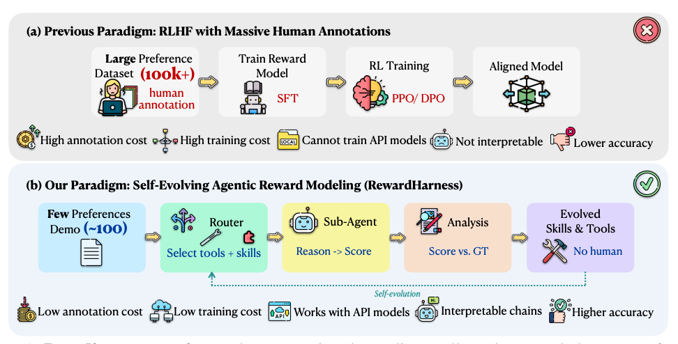
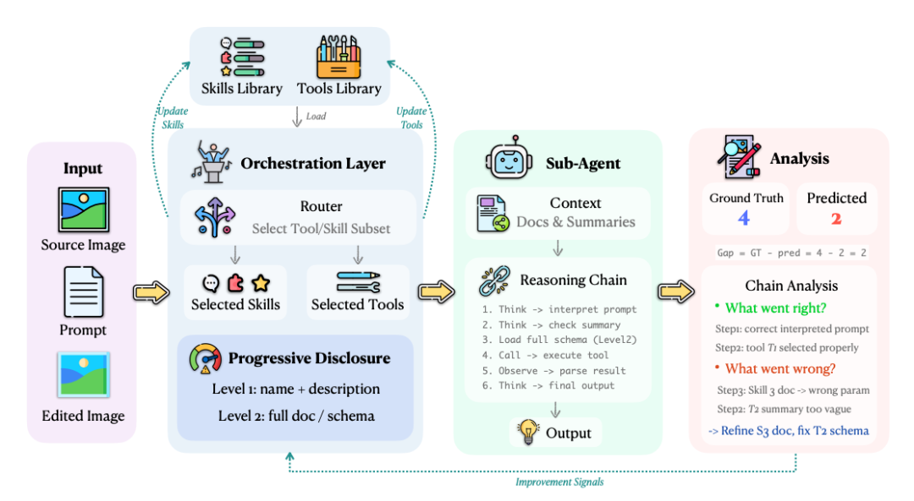
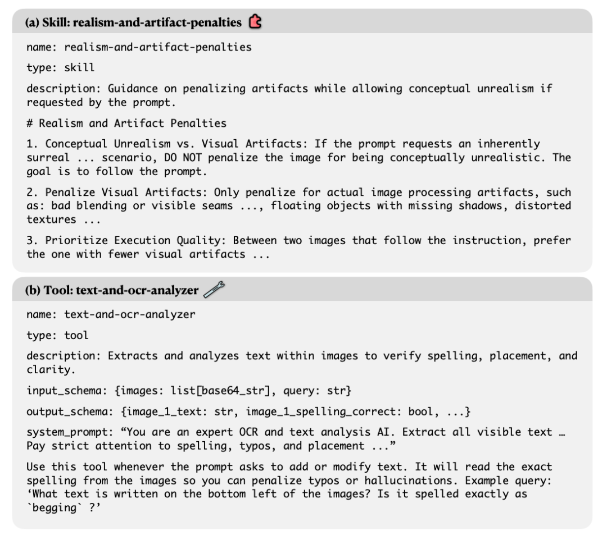
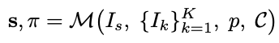
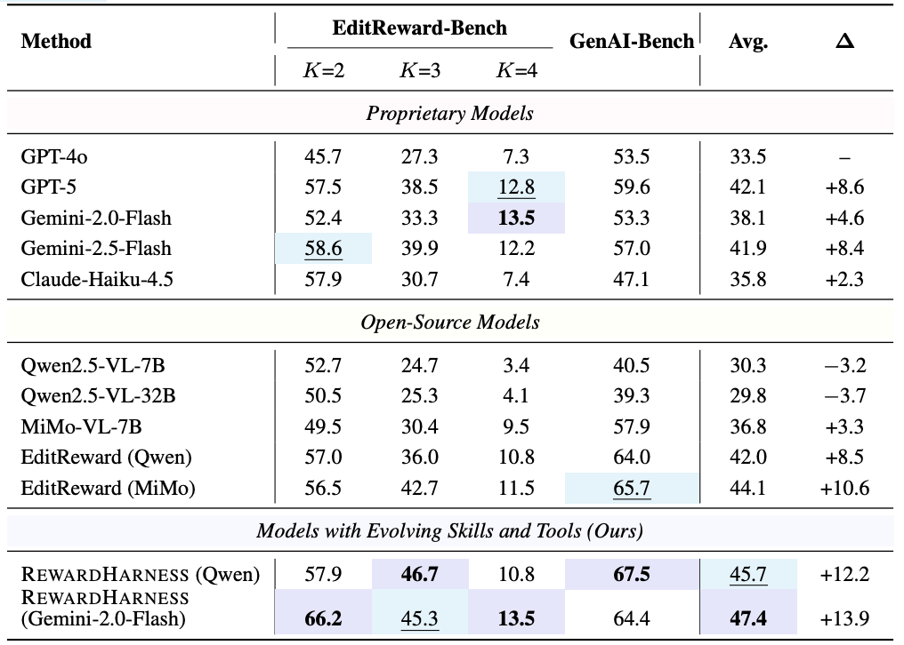
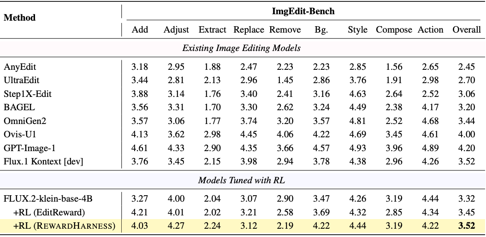
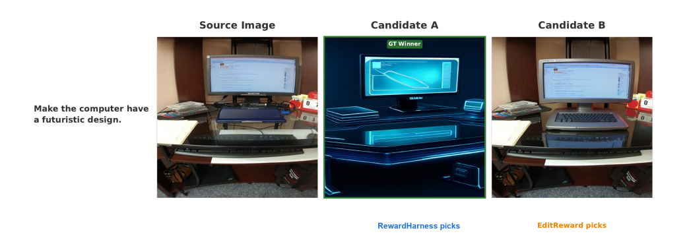
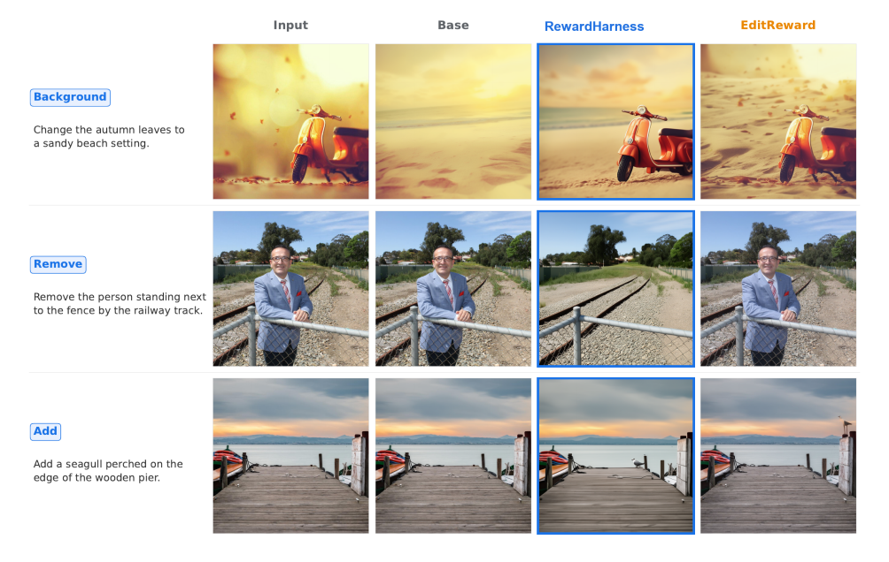
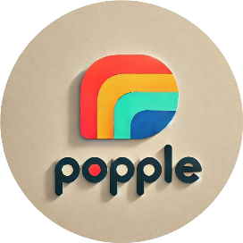

# 100 条示例干翻 GPT‑5，Reward Harness 的数据效率实现可解释奖励建模

Source: https://mp.weixin.qq.com/s/oFDVOJZkJjILgEaV0Tawtw

# 100 条示例干翻 GPT‑5，Reward Harness 的数据效率实现可解释奖励建模

原创

FlerkenS
FlerkenS

[波动智能](javascript:void(0);)

在小说阅读器读本章

去阅读

在小说阅读器中沉浸阅读

# AI 的“创造力”已经溢出，但它的“判断力”却依然贫瘠。 这就像一个天赋异禀的学生，能写诗、能画画、能发明新点子，却永远不知道自己的作品是否优秀。而判断力，恰恰是智能的核心。

# 行业里一直靠 RLHF 来解决这个问题，可 RLHF 的老路子已经走到瓶颈。偏好数据要几十万条起步，训练成本高得离谱，Reward Model 本身还是个黑盒，给出的分数没人能解释。更尴尬的是API 模型根本没法训练，你想对齐它，只能干瞪眼。

但人类评审者完全不是这样。人类只需要看几十个示例，就能总结出“什么是好编辑”。比如哪里有伪影、哪里不符合指令、哪里风格不一致，人类几乎是秒懂。模型为什么不行？这是整个领域一直绕不过去的问题。

5 月 8 日，RewardHarness 的发布就是在正面解决这个问题。它的核心突破非常简单也非常大胆——把奖励建模从“训练权重”变成“进化上下文”。

它不再把奖励能力塞进模型参数，而是把它拆成“技能”和“工具”，让模型在推理时动态组合这些外部知识。模型不再靠训练记住偏好，而是靠阅读和推理学会“如何评估”。这是一种更接近人类的学习方式，也是一种更 Agentic 的思路。

图1：范式比较。传统范式收集大规模的人类偏好数据，训练奖励模型，并将其用作RL对齐的奖励信号。相比之下，奖励从一小部分偏好演示开始，通过迭代评估和分析自我发展出一个技能和工具库，从而产生一个可解释的奖励系统。

说到团队背景，这项研究的作者阵容可以说是“跨界豪华”。来自 UBC、Vector Institute、Waterloo、CMU、Georgia Tech 的学术研究者，带来了多模态和认知推理的理论深度，他们分别是Yuxuan Zhang, Penghui Du, Bo Li, Cong Wei, Junwen Miao, Huaisong Zhang, Songcheng Cai, Yubo Wang, Dongfu Jiang, Yuyu Zhang, Ping Nie, Wenhu Chen, Changqian Yu, Kelsey R. Allen。 RewardHarness 的设计思路、工程结构、可解释性和可扩展性，都能看出这种跨界协作的影子。

项目地址：https://rewardharness.com/

# 01 奖励模型的范式正在改变

如果说过去几年 RLHF 的发展是一条“靠堆数据堆出来的路”，那现在这条路已经越来越难走了。传统奖励模型的痛点几乎人人都知道。

偏好数据量大得吓人，动辄十几万对。训练成本高得让人怀疑人生。模型本身是黑盒，为什么给这个分数？没人知道。泛化能力也不强，换个任务往往就要重新训练。对于 API 模型来说，这条路甚至完全走不通。

但人类的评估方式完全不是这样。人类评审者通过“规则 + 示例”就能快速掌握偏好标准。比如看到几张“好的编辑”和“坏的编辑”，人类就能总结出：哪里有伪影、哪里不符合指令、哪里风格不一致。

人类的评估过程是可解释的、可分解的、可迁移的。RewardHarness 的目标，就是让模型也具备这种能力。它不是让模型记住偏好，而是让模型学会“如何评估”。

# 02 RewardHarness的整体框架｜一个可进化的“外化大脑”

图2:REWARDHARNESS自我进化管道概述。多模式输入（源图像、编辑提示和编辑后的图像候选；排名任务对候选重复此评分）被输入到编排器中，编排器从技能和工具库中选择相关条目。子代理（冻结的VLM，例如Qwen2.5-VL-7B）使用选定的技能和工具构建推理链，产生分数和偏好判断。根据地面实况对输出进行评分；编排器分析推理链以生成更新库的改进信号。

RewardHarness 的结构非常像一个“可进化的评审委员会”。它由四个核心组件组成，每个组件都承担着不同的角色。

最核心的是 Orchestrator，也就是调度器。它负责理解任务、选择技能、调用工具、分析推理链，是整个系统的“大脑”。

Skills Library 是一套“评估规则”，比如如何判断伪影、如何评估风格一致性、如何处理概念性不真实等。它更像是评审者的“评分标准”。

Tools Library 则是一套“视觉分析工具”，比如 OCR、空间关系分析、物体计数、风格识别等。它让模型具备更细粒度的视觉理解能力。

最后是 Sub‑Agent，一个冻结的 VLM，比如 Qwen2.5-VL 或 Gemini。它不需要训练，只需要根据技能和工具文档执行推理链。

整个系统的工作方式非常像一个“带工具的推理型 Agent”。

输入是一张源图、一条编辑指令和若干候选编辑图。Orchestrator 会根据任务选择最相关的技能和工具，把它们塞进上下文里。Sub‑Agent读完这些文档后，会像一个专业评审一样构建推理链，逐条分析每个候选图的优缺点。

最终输出是评分和偏好排序。系统还会把推理链和真实偏好对比，找出错误原因，更新技能库和工具库。这个过程就是所谓的自进化循环。

图3：在进化迭代69时从库中采样的技能和工具示例。技能是指导子代理评估标准的声明性量规；工具是指导子代理执行有针对性的视觉分析的程序规范。

# 03 Skills & Tools：RewardHarness的“外化大脑”

如果说传统奖励模型把“判断能力”藏在权重里，那RewardHarness 做的，就是把这套能力拆开、摊平、外化，让模型在推理时像人一样“翻阅规则”和“调用工具”。这套外化大脑由两部分组成，一部分是 Skills，一部分是 Tools。前者像评分标准，后者像专业仪器。两者加在一起，构成了模型的“可解释评估能力”。

Skills：声明式评估规则

Skill 更像是评委手里的评分表。它不是模型的隐性偏好，而是明明白白写在文档里的“判断依据”。每个 Skill 都有自己的名字、描述、评分 rubric 和示例，结构清晰得像一本小型的视觉评审手册。

Skill 的作用很直接，就是告诉模型“应该怎么评估”。比如看到一张编辑图，模型要知道什么叫伪影、什么叫风格不一致、什么叫背景违和。Skill 就是这些判断的来源。

研究里最典型的几个 Skill，几乎都是人类评审者最常用的那套逻辑。比如真实感与伪影惩罚，强调“概念性不真实可以接受，但视觉伪影绝对不行”。比如背景一致性，要求编辑后的图不能破坏场景逻辑。比如风格遵循，确保编辑结果和原图在光照、纹理、色调上保持连贯。

这些 Skill 的存在，让模型的判断过程变得可解释。它不再是“我觉得 A 比 B 好”，而是“根据真实感规则、风格规则、背景规则，我认为 A 更符合要求”。这种透明度，是传统 Reward Model 做不到的。

Tools：程序化视觉分析

如果说 Skills 是“规则”，那 Tools 就是“工具箱”。它们不是抽象的判断标准，而是具体的视觉分析流程。每个 Tool 都有自己的目的、输入输出 schema、调用条件和执行步骤，像一份小型 SOP。

Tools 的作用，是提供“如何分析图像”的能力。比如 OCR 文本检查，模型需要知道图里有没有字、字是不是对的、位置是不是合理。比如空间关系分析，模型要判断物体之间的距离、方向、遮挡关系。比如物体计数，模型要知道图里到底有几只猫、几把椅子。比如风格和文化识别，模型要判断一幅图是不是符合某种艺术风格或文化语境。

这些工具让模型的视觉理解能力变得更细粒度、更专业。它不再是“看图凭感觉”，而是“按步骤分析”。比如 OCR 工具会要求模型先提取文本，再比对内容，再检查排版。空间工具会要求模型先识别物体，再判断相对位置，再分析是否符合物理逻辑。

Tools 的存在，让 RewardHarness 的评估过程变得像一个真正的视觉专家系统。模型不需要训练，只需要按照工具文档执行，就能获得专业级的视觉分析能力。

# 04 Orchestrator：自进化的核心智能体

如果说 Skills 和 Tools 是外化的大脑，那 Orchestrator 就是这颗大脑的“前额叶皮层”。它负责调度、选择、分析、更新，是整个系统的灵魂。

推理阶段：像导演一样调度整个评估流程

在推理阶段，Orchestrator 的任务是选择最相关的 Skills 和 Tools。它会根据编辑指令、源图和候选图，判断哪些规则和工具最有用。比如涉及文字编辑，它会自动加载 OCR 工具；涉及风格转换，它会加载风格相关的 Skill。

为了避免上下文太大，它还会使用 Progressive Disclosure 的策略。先给 Sub‑Agent 看工具的名字和简介，只有当工具真的需要调用时，才加载完整 schema。这种“按需展开”的方式，让整个系统既高效又灵活。

最终，Orchestrator 会把选好的 Skills 和 Tools 打包成一个上下文，让 Sub‑Agent 去构建推理链。这个推理链就是模型的“思考过程”，从规则应用到工具调用，再到最终评分，全部清晰可见。

进化阶段：像教练一样分析错误并更新大脑

RewardHarness 最迷人的地方，就是它的自进化能力。每次评估完，它都会把模型的推理链和真实偏好对比，分析成功和失败的原因。

如果发现模型缺少某个判断标准，就会新增一个 Skill。 如果发现某个规则写得不够准确，就会修改 Skill。 如果发现模型出现视觉幻觉，就会新增一个 Tool。 如果发现某个 Tool 的schema 不够清晰，就会修改 Tool。

整个 Library 是版本化的，每次更新都要经过验证集的 gating。只有当新版本的表现更好，系统才会接受更新，否则就回滚。这种机制让 RewardHarness 的进化既大胆又稳健。

最终，系统会从一个空白的 Library，进化出一套紧凑而高效的 Skills + Tools 组合，成为一个真正可解释、可扩展、可迁移的奖励系统。

# 05 自进化循环（Self‑Evolution Loop）

如果说 RewardHarness 的 Skills 和 Tools 是“外化的大脑”，那自进化循环就是这颗大脑的“新陈代谢系统”。它让整个奖励系统不是一成不变的，而是像一个真正的智能体一样，会反思、会纠错、会成长。

整个循环的逻辑非常像人类学习。先做题，再对答案，再分析错因，再改规则，再验证有没有变好。唯一的区别是，这一切都由 Orchestrator 自动完成。

在数学上，RewardHarness 的评估过程可以写成一个非常简洁的公式：

意思是，冻结的多模态模型 M 在上下文 C 的引导下，对源图Is、候选图 {Ik} 和指令 p 进行评分 S 和排序 π。 而这个上下文 C 正是自进化循环不断优化的对象。

五步循环的节奏

自进化循环的第一步是评估。系统会用当前的 Skills 和 Tools 去判断每个示例，生成推理链和评分。这个过程就像学生在做练习题。

第二步是评分对比。系统会把模型的判断和人类偏好对齐，标记哪些是对的，哪些是错的。这个阶段就像对答案。

第三步是推理链分析。Orchestrator 会深入推理链内部，找出错误的根因。是缺少某条规则？是某个rubric 写得不够清晰？是模型看图看错了？还是工具的 schema 不够严谨？这一步就像老师批改作业，指出“你错在这里”。

第四步是 Library 更新。根据分析结果，系统会新增 Skill、修改 Skill、增加 Tool、修正Tool，甚至删除误导性的条目。这个阶段就像学生根据老师的反馈重新整理笔记。

第五步是验证集 gating。系统会用一组独立的验证集检查更新后的 Library 是否真的更好。如果准确率下降，就回滚；如果提升，就保留。这一步就像考试，确保“改动不是越改越差”。

Library的演化轨迹

整个 Library 的成长过程非常像一个智能体从“婴儿期”到“成熟期”的进化。

一开始 Library 是空的，系统完全靠 Sub‑Agent 的原生能力评估图像。这时的准确率只有 42.5%，几乎等于瞎猜。

随着迭代推进，系统开始不断生成新的 Skills 和 Tools。Library的规模从 0 项一路涨到 13 项，进入一个“探索阶段”。这段时间里，系统会尝试各种规则和工具，有些有用，有些会误导模型。

当迭代到大约 50 次左右，系统开始进入“收敛阶段”。Orchestrator 会主动进行 pruning，把那些不稳定、重复或误导性的条目删掉。最终 Library 从 13 项收敛到 7项，变得紧凑而高效。

验证准确率也从最初的 42.5% 一路提升到 62.5%。这意味着系统的判断能力提升了将近一半，而且完全没有训练任何模型参数。

表1：图像编辑评价者对编辑奖励基准的比较。突出显示最佳和次佳结果。∆衡量GPT-4o基线的平均改善情况。

# 06 实验结果｜100条示例如何超越GPT‑5？

RewardHarness 最惊艳的地方，就是它的“数据效率”。只用 100 条偏好示例，就能达到甚至超过 GPT‑5 和 EditReward 这种大规模训练的奖励模型。

表2：为了验证REWARDHARNESS作为奖励模型的有效性，我们使用它对FLUX.2-klein-base-4B进行RL调优，并在下游图像编辑基准（ImgEdit Bench）上进行评估。与EditReward相比，REWARDHARNESS在编辑性能方面有更大的改进。

编辑偏好评估：RewardHarness 正面击败 GPT‑5

在 EditReward-Bench 和 GenAI-Bench 这两个主流评估基准上，RewardHarness 的表现非常亮眼。

当 Sub‑Agent 换成 Gemini 时，平均准确率达到 47.4%，直接超过 GPT‑5。 当Sub‑Agent 换成 Qwen 时，平均准确率也有45.7%，超过 EditReward。 更夸张的是，原始的Qwen2.5‑VL‑7B 只有 30.3%，RewardHarness让它直接涨到 45.7%，提升了 15.4 个点。

这说明 RewardHarness 的能力不是来自模型本身，而是来自那套进化出来的Skills + Tools。

图4:EditReward Bench上的偏好评分比较。该图显示了源图像、编辑指令和两个候选编辑（a和B）。GT表示真实的人类偏好标签，REWARDHARNESS表示我们的预测偏好得分，ER表示EditReward得分。REWARDHARNESS将较高的分数分配给人类首选的候选人（标记为“GT获胜者”），而EditReward失败。

作为奖励模型用于 RL：RewardHarness再次胜出

在 ImgEdit-Bench 上，RewardHarness 作为奖励信号用于 RL 微调，效果同样非常强。

基础模型的得分是 3.32。 用 EditReward 做奖励，得分提升到 3.45。 用 RewardHarness 做奖励，得分进一步提升到 3.52，成为最佳。

这说明 RewardHarness 不只是“评估得好”，它还能“指导模型变得更好”。

图5:ImgEdit Bench上的定性比较。每一行都呈现了一个不同的编辑任务，包括源图像、基本模型输出（FLUX.2-klein-base-4B）和两个RL微调变体：REWARDHARNESS和EditReward。REWARDHARNESS始终按照指示进行编辑，同时保持视觉质量和物理一致性，而基础模型和EditReward训练的变体经常无法执行预期的编辑或引入工件。

# 07 RewardHarness的技术洞察与意义

RewardHarness 的意义远不止“做了一个新奖励系统”。它实际上提出了一种全新的对齐范式。

过去我们习惯把奖励能力塞进模型权重里。RewardHarness 告诉我们，这条路不一定是最优的。 奖励建模可以从“训练模型”变成“进化上下文”。 可以从“黑盒”变成“可解释”。 可以从“大数据”变成“小样本”。

这是一种更轻量、更灵活、更人类化的方式。

在整个 Library 里，Tools 的作用往往比 Skills 更关键。 Skill 提供规则，但 Tool 提供能力。 Skill 告诉你“应该怎么评估”，Tool 告诉你“如何分析图像”。 视觉评估的核心不是抽象规则，而是程序化分析。

这也是为什么最终 Library 里 Tools 的数量比 Skills 更稳定。

RewardHarness 的设计思路，几乎可以看作未来 Agentic AI 的雏形。

它展示了一个可进化的外部知识库。 它展示了一个工具增强的智能体。 它展示了一个低成本对齐的路径。 它展示了一个可解释的 RLHF 框架。

如果未来的智能体都能像 RewardHarness 这样，通过 Skills + Tools 的方式不断进化，那我们离“真正可解释的 AI”就更近了一步。（END）

参考资料：https://arxiv.org/pdf/2605.08703

关于波动智能——

波动智能旨在建立一个基于人类意图与反应的真实需求洞察及满足的价值体系，融合人工智能与意识科学，构建覆盖情绪识别、建模与推荐的智能引擎，自主研发面向社交、电商等场景的多模态意图识别引擎、意图标签系统及意图智能推荐算法，形成从情绪采集、意图建模到商业转化的完整解决方案。波动智能提出“意图是连接人、物与内容的新型接口”，其产品广泛应用于AI社交、个性化内容推荐、虚拟陪伴、电商体验优化等领域。波动智能正在探索“EMO-as-a-Service”技术服务架构，赋能企业实现更高效的用户洞察与精准情绪交互，推动从功能驱动到意图驱动的产业范式升级。

亲爱的人工智能研究者，为了确保您不会错过\*波动智能\*的最新推送，请星标\*波动智能\*。我们倾心打造并精选每篇内容，只为为您带来启发和深思，希望能成为您理性思考路上的伙伴！

加入AI交流群请扫码加微信

预览时标签不可点

微信扫一扫  
关注该公众号

继续滑动看下一个

轻触阅读原文

波动智能

向上滑动看下一个

[知道了](javascript:;)

微信扫一扫  
使用小程序

[取消](javascript:void(0);)
[允许](javascript:void(0);)

[取消](javascript:void(0);)
[允许](javascript:void(0);)

[取消](javascript:void(0);)
[允许](javascript:void(0);)

×
分析

微信扫一扫可打开此内容，  
使用完整服务

：
，
，
，
，
，
，
，
，
，
，
，
，
。
 
视频
小程序
赞
，轻点两下取消赞
在看
，轻点两下取消在看
分享
留言
收藏
听过