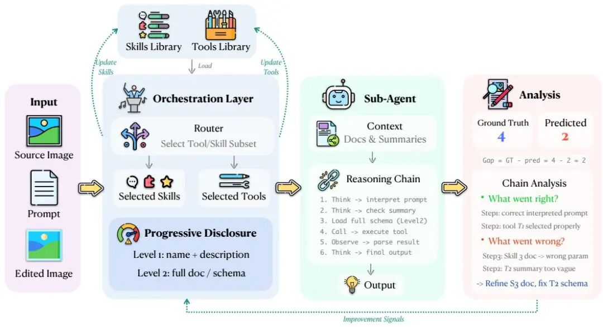

# 仅用0.05%数据超越GPT-5！自演进框架重新定义奖励建模

Source: https://mp.weixin.qq.com/s/_nOnnwReX3i4diQvNh0uxA

# 仅用0.05%数据超越GPT-5！自演进框架重新定义奖励建模

原创

DD&CC
DD&CC

[LLM新视界](javascript:void(0);)

在小说阅读器读本章

去阅读

在小说阅读器中沉浸阅读

**作者：**Yuxuan Zhang1,2,3,6,∗, Penghui Du3,∗, Bo Li3,∗, Cong Wei5,∗, Junwen Miao4, Huaisong Zhang7, Songcheng Cai5, Yubo Wang2,5, Dongfu Jiang2,5,†, Yuyu Zhang8, Ping Nie5,†, Wenhu Chen2,5,†, Changqian Yu3,§, Kelsey R. Allen1,2,†

**机构：**University of British Columbia1, Vector Institute2, Kolors Team, Kuaishou Technology3, Carnegie Mellon University4, University of Waterloo5, Etude AI6, Tsinghua University7, Georgia Institute of Technology8

## 01研究背景

图像编辑技术发展迅速，但可靠的评估方法仍然是一个核心瓶颈。这一挑战在视觉生成和编辑的强化学习中尤为突出，因为进展取决于能够忠实反映人类偏好的奖励信号。

现有方法主要通过收集大规模人类偏好标注，并在此基础上训练专门的奖励模型来解决这一问题。虽然这种方法行之有效，但这个范式既昂贵又缺乏灵活性：它需要大量标注成本、需要额外的模型训练、通常产生不透明的标量奖励，并且难以应用于闭源或仅提供API的基础模型。

|  |
| --- |
| 🏗️**传统范式：**需要数十万次带标签的比较才能获得类似的偏好行为。  ✨**人类能力：**只需要一个小型的校准集就能内化目标评估标准，然后大规模地一致应用这些标准。 |

本文通过 REWARDHARNESS 来回答这个问题，这是一个自我演进的智能体奖励框架，将奖励建模重新定义为上下文进化——在保持模型权重固定的同时进化外部技能和工具——而不是权重优化。关键思想不是将少量演示用于训练更小的奖励模型，而是使用它们迭代构建一个明确且可复用的评估知识库。

|  |
| --- |
| **📊 核心结果** 仅使用 0.05% 的偏好数据，REWARDHARNESS 在图像编辑评估基准测试上达到 47.4% 的平均准确率，超过 GPT-5 5.3 个百分点。当用作 GRPO 微调的奖励信号时，RL 调优模型在 ImgEdit-Bench 上达到 3.52 分。 |

## 02技术方案

我们提出了 REWARDHARNESS，这是一个自演进智能体奖励系统，仅通过上下文演进就能获取人类评估偏好，无需更新任何评估器模型参数。REWARDHARNESS 由两个核心组件构成：一个编排器智能体面一个可共享的可解释评估工件库。

图2：REWARDHARNESS 自演进流程概述

|  |
| --- |
| **📐 问题定义** 给定源图像、编辑指令和 K 个候选编辑图像，生成标量偏好分数（1-5 分）和诱导偏好排序。评分和排序由冻结的 VLM 完全通过推理时组装的上下文来引导。 |

|  |
| --- |
| **🔧 技能和工具库** **技能：**结构化的 Markdown 评估指南，将质量分解为细粒度标准。**工具：**指定针对性的视觉分析过程，提供程序性上下文规范。 |

预览时标签不可点

微信扫一扫  
关注该公众号

继续滑动看下一个

轻触阅读原文

LLM新视界

向上滑动看下一个

[知道了](javascript:;)

微信扫一扫  
使用小程序

[取消](javascript:void(0);)
[允许](javascript:void(0);)

[取消](javascript:void(0);)
[允许](javascript:void(0);)

[取消](javascript:void(0);)
[允许](javascript:void(0);)

×
分析

微信扫一扫可打开此内容，  
使用完整服务

：
，
，
，
，
，
，
，
，
，
，
，
，
。
 
视频
小程序
赞
，轻点两下取消赞
在看
，轻点两下取消在看
分享
留言
收藏
听过