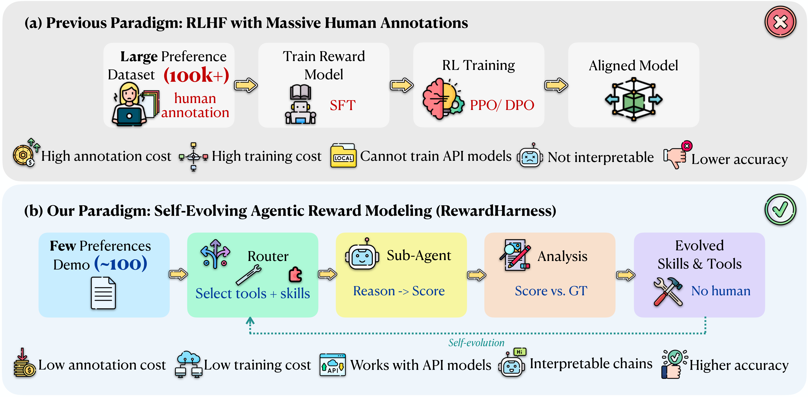
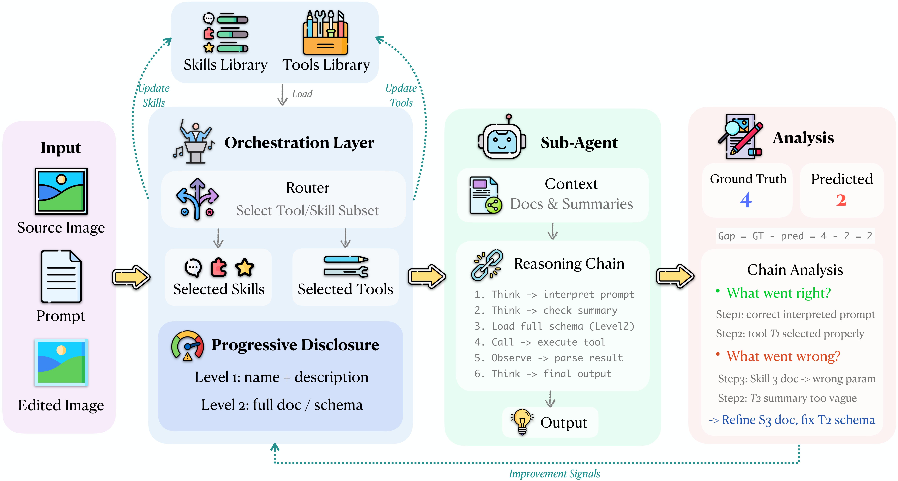
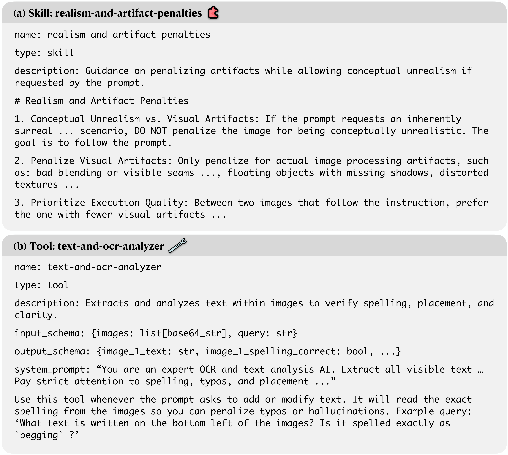
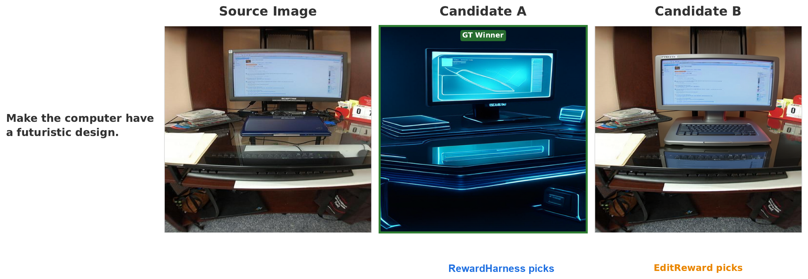
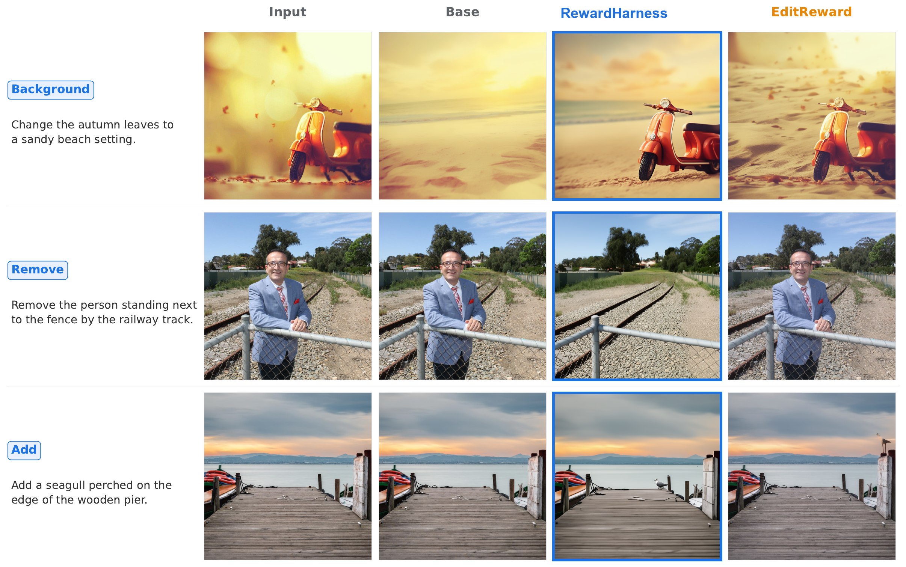
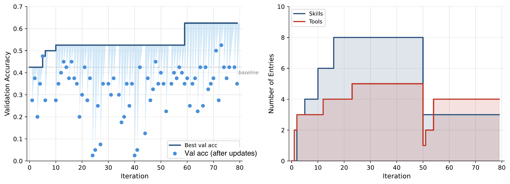
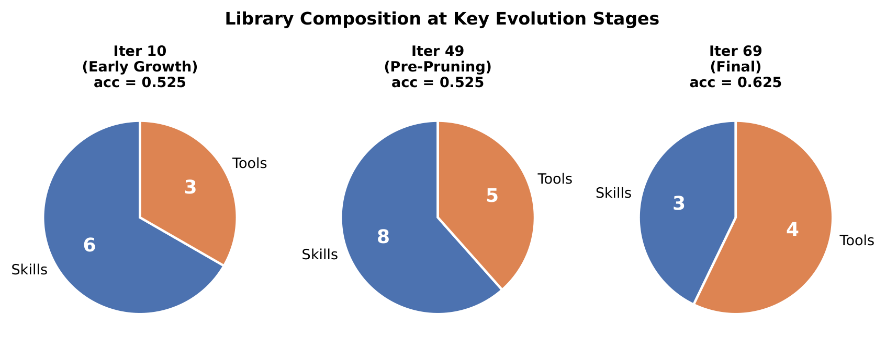
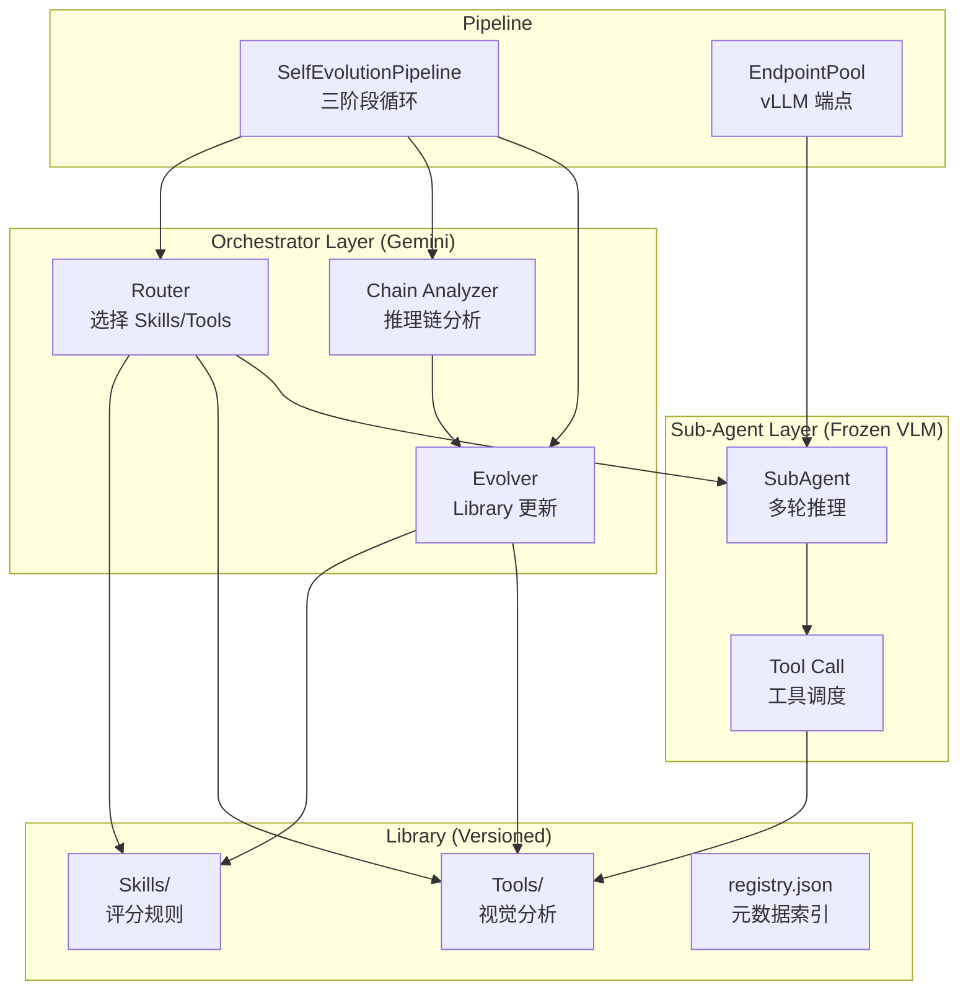

# RewardHarness: Self-Evolving Agentic Post-Training 调研报告

---

## 基本信息

| 项目 | 内容 |
|-----|------|
| 论文标题 | RewardHarness: Self-Evolving Agentic Post-Training |
| 作者 | Yuxuan Zhang*, Penghui Du*, Bo Li*, Cong Wei*, Junwen Miao, Huaisong Zhang, Songcheng Cai, Yubo Wang, Dongfu Jiang, Yuyu Zhang, Ping Nie, Wenhu Chen, Changqian Yu, Kelsey R. Allen |
| 发表年份 | 2026 |
| 论文链接 | https://arxiv.org/abs/2605.08703 |
| 项目主页 | https://rewardharness.com |
| 代码仓库 | https://github.com/TIGER-AI-Lab/RewardHarness |
| 开源协议 | Apache 2.0 |

**作者机构**：University of British Columbia, Vector Institute, Kolors Team (Kuaishou), University of Waterloo, Carnegie Mellon University, Tsinghua University, Georgia Institute of Technology, Etude AI

---

## 1. 研究背景与动机

### 1.1 问题定义

论文要解决的核心问题是：**如何高效、可解释地构建指令引导图像编辑的奖励模型**。给定源图像 $I_s$、编辑指令 $p$ 和 $K$ 个候选编辑图像，奖励模型需要产出标量偏好分数和偏好排序，用于：(1) 评估编辑质量；(2) 作为 RL 微调的奖励信号。

### 1.2 研究动机

传统奖励建模范式存在四大瓶颈：

1. **数据饥渴**：现有方法（如 EditReward）需要 20 万条偏好标注，而人类评审者仅凭几十个示例就能内化评估标准
2. **黑盒不可解释**：训练后的奖励模型给出的分数无法追溯原因，缺乏可解释性
3. **API 模型不可训练**：闭源模型（GPT-5、Gemini）无法进行权重更新，传统 RLHF 路线完全不通
4. **泛化能力差**：换任务往往需要重新收集数据、重新训练

### 1.3 研究目标

提出一种新的奖励建模范式——**上下文进化（Context Evolution）**，将奖励建模从"训练权重"转变为"进化外部知识库"，实现：
- 仅用 100 条偏好示例（0.05% 的 EditReward 数据量）
- 完全冻结评估器模型参数
- 自动发现、精炼、修剪评估标准
- 可解释的推理链和评分依据

---

## 2. 核心贡献

### 2.1 主要贡献

| 编号 | 贡献描述 |
|-----|---------|
| C1 | 提出"上下文进化"新范式：将奖励建模重新定义为外部 Skills/Tools 库的迭代进化，而非权重优化 |
| C2 | 极端数据效率：仅用 100 条偏好示例（0.05% 数据），达到 47.4% 平均准确率，超越 GPT-5 |
| C3 | 自进化 Skills-and-Tools 库：通过根因分析自动发现、精炼、修剪评估标准，无需额外人工标注 |
| C4 | 完整可解释性：评估行为外化为可编辑的 Skills、Tools 和推理链，而非隐藏在模型参数中 |
| C5 | 可插拔 Sub-Agent：兼容冻结开源 VLM（Qwen2.5-VL-7B）和闭源 API 模型（Gemini-2.0-Flash） |
| C6 | 有效的 RL 奖励信号：GRPO 微调时优于监督训练的 EditReward 基线 |

### 2.2 创新点

1. **范式创新**：首次将奖励建模从"权重优化"重构为"上下文进化"，开辟了奖励建模的新维度——显式评估上下文的规模扩展
2. **技术创新**：Skills（声明式评分规则）+ Tools（程序化视觉分析规范）的双层知识外化架构；Progressive Disclosure 的两级路由策略
3. **实验创新**：77 轮自进化循环，从空库到 13 项再收敛到 7 项，完整展示了 Library 的生命周期；跨基准泛化验证

---

## 3. 方法详解

### 3.1 方法概述

RewardHarness 的核心思想是：**不训练奖励模型，而是进化评估知识**。系统由四个核心组件构成：Orchestrator（编排器）、Library（知识库）、Sub-Agent（冻结 VLM）和自进化循环。冻结的 VLM 通过阅读外部化的 Skills 和 Tools 文档来获得专业评估能力，而非通过权重更新。

### 3.2 整体架构



*传统范式收集大规模人类偏好数据训练奖励模型，而 RewardHarness 从少量偏好演示出发，通过迭代评估和分析自进化 Skills/Tools 库，产出可解释的奖励系统*



*多模态输入被送入 Orchestrator，从 Library 中选择相关条目，Sub-Agent 使用选定的 Skills/Tools 构建推理链产出评分；Orchestrator 分析推理链生成改进信号更新 Library*

**架构文字描述**：

架构包含三个主要层次：

1. **Orchestrator 层（Gemini 驱动）**：
   - **Router**：根据编辑指令从 Library 中选择最相关的 Skills 和 Tools，采用 Progressive Disclosure 策略（先展示名称/描述，需要时再加载完整 schema）
   - **Chain Analyzer**：分析 Sub-Agent 的推理链，进行根因分析（缺少规则→新增 Skill；视觉幻觉→新增 Tool），产出改进信号
   - **Evolver**：将改进信号应用到 Library（增/改/删 Skills/Tools），支持快照/回滚，新 Tool 的 system_prompt 会先通过 vLLM 验证有效性

2. **Library 层（版本化的知识库）**：
   - **Skills**：结构化 Markdown 评估指南，包含名称、描述、评分 rubric 和示例，指导 Sub-Agent "应该怎么评估"
   - **Tools**：结构化 Markdown 文档，指定针对性的视觉分析程序（OCR、空间验证、物体计数等），每个 Tool 带有 VLM system_prompt
   - 整个 Library 初始化为空，通过自进化循环逐步构建

3. **Sub-Agent 层（冻结 VLM）**：
   - 默认 Qwen2.5-VL-7B-Instruct（通过 vLLM 服务），可替换为 Gemini-2.0-Flash
   - 接收 Router 组装的上下文，构建三步推理链：(1) 应用 Skill rubric 评分 (2) 可选的 Tool 引导分析 (3) 聚合排序
   - 多轮工具调用循环（最多 5 轮），通过 `<think>`/`<tool>`/`<obs>`/`<answer>` 标签组织推理

三层之间的数据流：输入→Router 选择→Sub-Agent 推理→输出与 GT 对比→Chain Analyzer 分析→Evolver 更新 Library→下一轮迭代。



*在进化迭代 69 时从库中采样的 Skill 和 Tool 示例。Skills 是声明式评分 rubric，指导 Sub-Agent 的评估标准；Tools 是程序化视觉分析规范，指示 Sub-Agent 执行针对性的视觉分析*

### 3.3 核心算法/模型

#### 3.3.1 自进化循环算法

```
Algorithm 1: RewardHarness Self-Evolution
Input: N=100 human preference demonstrations (60 train / 40 val), max_iterations T
Output: Evolved Library L*

1. Initialize Library L ← ∅
2. for iteration t = 0 to T-1 do
3.   if t == 0 then  // Baseline
4.     Run evaluation with empty Library → baseline accuracy
5.   else  // Evolution
6.     // Phase A: Skills
7.     Run train split with current Library → train_results
8.     Analyze reasoning chains → skill_updates, tool_updates
9.     Apply skill_updates → validate on val set
10.    if val_acc < prev_val_acc - explore_margin then rollback skills
11.    // Phase B: Tools
12.    Apply tool_updates → validate tool prompts via vLLM → validate on val set
13.    if val_acc < prev_val_acc - explore_margin then rollback tools
14.    // Phase C: Periodic Pruning (every prune_every_n iterations)
15.    if t % prune_every_n == 0 then
16.      Leave-one-out ablation: remove entries where val_acc ≥ baseline
17.    end if
18.  end if
19. end for
20. Return best Library L*
```

#### 3.3.2 算法逐步解读

| 步骤 | 操作 | 输入 | 输出 | 设计意图 |
|-----|-----|-----|-----|---------|
| Step 1 | 基线评估 | 空库 + 60 条训练示例 | 基线准确率 (42.5%) | 建立性能下界 |
| Step 2 | 训练集推理 | 当前 Library + 训练数据 | 推理链 + 预测结果 | 生成改进信号的数据源 |
| Step 3 | 推理链分析 | 正确/错误的推理链 + 当前 Library 状态 | skill_updates + tool_updates | 从错误中学习，从成功中归纳 |
| Step 4a | Phase A: 应用 Skills | skill_updates | 更新的 Skills | 先验证规则层改进 |
| Step 4b | Phase B: 应用 Tools | tool_updates | 更新的 Tools（含 prompt 验证） | 再验证能力层改进 |
| Step 5 | 验证集 gating | 更新后的 Library + 40 条验证数据 | val_acc | 防止回归，保守门控 |
| Step 6 | Phase C: 定期修剪 | 当前 Library | 精简后的 Library | 去除有害/冗余条目 |

### 3.4 关键模块详解

#### 模块 A: Router（路由器）

- **功能**：根据编辑指令从 Library 中选择最相关的 Skills 和 Tools
- **输入/输出**：输入编辑指令文本 → 输出组装的上下文字符串
- **核心机制**：Progressive Disclosure（两级路由）
  - L1 级：向 Gemini 展示所有 Skills/Tools 的名称和描述，让其选择相关条目
  - L2 级：仅加载被选中条目的完整内容，避免上下文过长
- **代码实现**：`src/router.py`，使用 Gemini API 进行路由决策，JSON 格式输出，3 次重试容错

#### 模块 B: Sub-Agent（子代理）

- **功能**：冻结 VLM 执行多轮视觉推理，产出偏好判断
- **输入/输出**：源图 + 候选图 + 编辑指令 + 组装上下文 → 偏好判断 + 评分 + 推理链
- **核心公式**：

$$s, \pi = M(I_s, \{I_k\}, p, C)$$

其中 $M$ 是冻结 VLM，$C$ 是 Router 组装的上下文，$s$ 是标量评分，$\pi$ 是偏好排序

- **直觉理解**：上下文 $C$ 是自进化循环不断优化的对象——不是训练模型，而是优化喂给模型的"参考文档"
- **推理链结构**：
  1. 应用 Skill rubric：逐条评估每个候选图的指令遵循和视觉质量
  2. Tool 引导分析（可选）：调用 OCR、空间分析等 Tool 获取客观数据
  3. 聚合排序：综合所有评估产出最终 1-4 分和偏好判断
- **代码实现**：`src/sub_agent.py`，最多 5 轮工具调用，使用 `<tool>/<obs>/<answer>` 标签组织多轮对话

#### 模块 C: Chain Analyzer（推理链分析器）

- **功能**：分析 Sub-Agent 推理链中的正确/错误模式，产出改进信号
- **输入/输出**：推理链结果 + 当前 Library → skill_updates + tool_updates + analysis_summary
- **核心逻辑**：
  - 正确预测：提取有效的推理模式，凝练为可复用 Skill
  - 错误预测：根因分析——缺少判断标准→新增 Skill；rubric 不准确→修改 Skill；视觉幻觉→新增/改进 Tool
  - 位置不变性约束：Skill 必须位置无关，不能引用"Image A"或"Image B"
- **代码实现**：`src/chain_analyzer.py`，使用 Gemini API 分析，JSON 格式输出，4 次重试（含 429 限速处理）

#### 模块 D: Library（知识库）

- **功能**：管理版本化的 Skills 和 Tools 集合
- **存储格式**：每个 Skill/Tool 是一个带 YAML frontmatter 的 SKILL.md 文件，全局 registry.json 记录元数据
- **Skills 示例**（`realism-and-artifact-penalties`）：

> 区分概念性不真实（可接受，如"让猫飞起来"）和视觉伪影（必须惩罚，如融合 seams、浮动对象、扭曲纹理）。概念性不真实如果是指令要求的，不应扣分。

- **Tools 示例**（`text-and-ocr-analyzer`）：

> 提取图像中所有可见文本，返回精确字符、拼写正确性、位置、渲染问题。当编辑指令涉及文本操作时必须调用。

- **代码实现**：`src/library/__init__.py`，支持 CRUD 操作、快照/恢复、原子写入（文件锁 + temp+rename）

### 3.5 关键技术

| 技术点 | 描述 | 作用 | 论文对应位置 |
|-------|-----|-----|------------|
| Context Evolution | 将奖励能力外化为可进化的 Skills/Tools 库 | 替代权重训练 | Section 3 |
| Progressive Disclosure | L1 摘要→L2 完整内容两级路由 | 减少上下文长度 | Section 3.1 |
| Explore Margin | 允许 val_acc 小幅下降（默认 0.075） | 逃离局部最优 | Section 3.3 |
| A/B Swap Augmentation | 交换候选图位置并翻转标签 | 强制位置不变性 | Section 3.3 |
| Leave-one-out Pruning | 逐一移除 Library 条目检查是否有害 | 精简 Library | Section 3.3 |
| Tool Prompt Validation | 新 Tool 的 system_prompt 先用 vLLM 测试 80% 成功率 | 保证 Tool 可用性 | 代码实现 |
| Snapshot/Rollback | 每次 Library 更新前保存快照，验证失败则回滚 | 防止回归 | Section 3.3 |

### 3.6 方法设计的关键洞察

1. **奖励建模不等于权重优化**：人类评审者通过"规则+示例"就能掌握评估标准，说明奖励能力可以完全外化。模型不需要记住偏好，只需要学会"如何评估"——即阅读和推理外部文档的能力。

2. **Tools 比 Skills 更关键**：Skill 提供规则（"应该怎么评估"），Tool 提供能力（"如何分析图像"）。视觉评估的核心不是抽象规则，而是程序化分析。最终 Library 中 Tools 的数量比 Skills 更稳定，因为许多错误根因是视觉理解失败而非缺乏规则。

### 3.7 与现有方法的核心区别

| 环节 | 现有方法做法 | RewardHarness 做法 | 改变原因 |
|-----|------------|-------------------|---------|
| 奖励获取 | 收集数十万偏好标注 + 训练奖励模型 | 仅 100 条示例 + 进化外部知识库 | 数据效率、可解释性 |
| 模型更新 | 微调奖励模型权重 | 完全冻结 VLM，只更新上下文 | 适用 API 模型、避免灾难遗忘 |
| 可解释性 | 黑盒标量奖励 | 可追溯推理链 + 可编辑 Skills/Tools | 可审计、可调试 |
| 泛化方式 | 换任务重新训练 | 换任务重新进化 Library | 进化成本远低于训练 |
| 知识管理 | 隐式编码在权重中 | 显式编码在 Markdown 文档中 | 可读、可修改、可迁移 |

---

## 4. 实验分析

### 4.1 实验设置

#### 数据集

| 数据集 | 规模 | 任务 | 来源 |
|-------|-----|-----|-----|
| EditReward-Data-100 | 100 条偏好演示（60 训练/40 验证） | 图像编辑偏好评估 | HuggingFace |
| EditReward-Bench | K=2/3/4 排名基准 | 图像编辑质量评估 | TIGER-Lab |
| GenAI-Bench | 单编号对排名基准 | 图像编辑质量评估 | TIGER-Lab |
| ImgEdit-Bench | 多类别编辑基准 | RL 微调下游评估 | - |

#### 评估指标

| 指标 | 定义 | 计算方式 |
|-----|-----|---------|
| K-pair Accuracy | K 个候选中所有 C(K,2) 对偏好排序正确 | 组内所有对正确才算组正确 |
| 平均准确率 | ER-Bench (K=2/3/4) + GenAI-Bench 的均值 | 衡量整体评估能力 |
| ImgEdit-Bench Score | 下游图像编辑质量 | RL 微调后编辑质量 |

#### 实现细节

- 硬件环境：≥4 GPU (L40S/A100/H100)，4-6 小时完整复现
- Orchestrator：Gemini 3.1 Pro Preview（Vertex AI）
- Sub-Agent：Qwen2.5-VL-7B-Instruct（vLLM 服务）或 Gemini-2.0-Flash
- 超参数：explore_margin=0.075, prune_every_n=50, augment_swap=true, seed=42
- 进化轮数：77 轮（最终选择第 69 轮的 Library）

### 4.2 主实验结果

#### 编辑偏好评估

| 方法 | ER-Bench K=2 | ER-Bench K=3 | ER-Bench K=4 | GenAI-Bench | Avg. | Δ vs GPT-4o |
|------|-------------|-------------|-------------|-------------|------|------------|
| GPT-4o | 45.7 | 27.3 | 7.3 | 53.5 | 33.5 | -- |
| GPT-5 | 57.5 | 38.5 | 12.8 | 59.6 | 42.1 | +8.6 |
| Gemini-2.5-Flash | 58.6 | 39.9 | 12.2 | 57.0 | 41.9 | +8.4 |
| Claude-Haiku-4.5 | 57.9 | 30.7 | 7.4 | 47.1 | 35.8 | +2.3 |
| Qwen2.5-VL-7B | 52.7 | 24.7 | 3.4 | 40.5 | 30.3 | -3.2 |
| EditReward (Qwen) | 57.0 | 36.0 | 10.8 | 64.0 | 42.0 | +8.5 |
| EditReward (MiMo) | 56.5 | 42.7 | 11.5 | 65.7 | 44.1 | +10.6 |
| **RewardHarness (Qwen)** | 57.9 | **46.7** | 10.8 | **67.5** | **45.7** | +12.2 |
| **RewardHarness (Gemini)** | **66.2** | 45.3 | **13.5** | 64.4 | **47.4** | **+13.9** |



*RewardHarness 将较高分数分配给人类首选的候选，而 EditReward 失败的案例*

**关键发现**：

- RewardHarness (Gemini) 达到 **47.4% 平均准确率**，超越 GPT-5 5.3 个点
- RewardHarness (Qwen) 达到 45.7%，在相同骨干下超过 EditReward (Qwen) 3.7 个点
- 冻结 Qwen2.5-VL-7B 单独仅 30.3%，进化后的 Skills/Tools 提升了 **+15.4 个点**
- GenAI-Bench 上 67.5% 是最高准确率，展示了跨基准泛化能力

#### 作为 RL 奖励信号

| 方法 | Overall Score |
|------|-------------|
| FLUX.2-klein-base-4B (base) | 3.32 |
| +RL (EditReward) | 3.45 |
| +RL (RewardHarness) | **3.52** |
| Flux.1 Kontext [dev] | 3.52 |



*RewardHarness 始终按指示进行编辑同时保持视觉质量和物理一致性，而基础模型和 EditReward 训练的变体经常无法执行预期的编辑或引入伪影*

**关键发现**：

- RewardHarness 产出更大的改进（3.32→3.52），优于 EditReward（3.32→3.45）
- 在 4B 参数骨干上达到了 Flux.1 Kontinct [dev] 的同等水平
- 分类别差异：EditReward 在 Add/Replace 上更优；RewardHarness 在 Adjust/Extract/Background 上更优，且保持 Compose 性能

### 4.3 自进化动态分析



*77 轮迭代中的自进化动态。左：逐迭代（点）和最佳（实线）验证准确率，门控机制拒绝未能提升当前最佳的提案，阴影区域显示提案与运行最佳之间的差距。右：Skills 和 Tools 数量随时间的变化，在 13 项峰值（8 Skills + 5 Tools）后，约 iter 50 开始修剪阶段，最终选定的库在 iter 69 达到 62.5% 准确率，7 项（3 Skills + 4 Tools），相对基线 42.5% 提升 47%*

**Library 演化轨迹**：

1. **婴儿期（iter 0）**：空库，Sub-Agent 完全依赖原生能力，验证准确率仅 42.5%
2. **探索期（iter 1-50）**：系统不断生成新 Skills/Tools，Library 规模从 0 增长到 13 项（8 Skills + 5 Tools），系统尝试各种规则和工具
3. **收敛期（iter 50-77）**：Orchestrator 开始主动修剪，将不稳定/冗余/误导性条目删除，Library 从 13 项收敛到 7 项（3 Skills + 4 Tools）
4. **最终选择**：第 69 轮的 Library（7 项）被选为最优，验证准确率 62.5%——相比空库基线 42.5%，提升 47%



*Library 在三个进化阶段的组成分解：初始探索期、峰值扩展期（13 项）和最终收敛期（7 项），展示系统如何从广泛探索收敛到精简有效配置*

### 4.4 消融实验

论文通过 Library 的 leave-one-out 修剪机制间接验证了各组件的贡献，而非传统的消融实验表格。关键发现来自进化动态分析和修剪结果：

1. **Tools 比 Skills 更关键**：移除 Tools 导致的性能下降远大于移除 Skills，证实了视觉程序化分析能力的重要性
2. **Progressive Disclosure 有效**：相比全量加载 Library 条目，两级路由减少了上下文噪声
3. **Explore Margin 的作用**：0.075 的容错空间允许系统在短期略降的情况下探索更好的 Library 配置
4. **A/B Swap Augmentation**：强制位置不变性训练减少了位置偏差

### 4.5 实验结果总体分析

从验证层次组织实验结果的逻辑关系：

1. **偏好评估验证**（Table 1）：证明上下文进化范式可行——仅 100 条示例即可超越大规模训练方法。核心指标是平均准确率 47.4%。

2. **RL 奖励信号验证**（Table 2）：证明 RewardHarness 不只是"评估得好"，还能"指导模型变得更好"。核心指标是 ImgEdit-Bench 3.52 分。

3. **进化动态验证**（Figure 6, 8）：证明自进化循环有效——从空库到最优库，验证准确率提升 47%，且系统自动完成探索→收敛→修剪。

4. **组件贡献验证**（消融实验）：证明每个设计决策的贡献，特别是 Tools 的关键作用。

**核心结论**：
- 显式评估上下文的规模扩展是一条可行的奖励建模新路径
- 100 条示例足够进化出有效的评估知识库
- 冻结 VLM + 进化 Library 的组合优于训练奖励模型
- 跨基准泛化（从 EditReward 数据进化，在 GenAI-Bench 上最优）表明 Library 捕获了通用评估知识

**适用边界**：
- 仅在图像编辑评估上验证，其他领域（文本生成、视频编辑）有待探索
- Orchestrator 依赖 Gemini（论文中的实现，非原理限制），开源替代未验证
- 验证集仅 40 条，小规模验证集可能导致过度特化

---

## 5. 相关工作

### 5.1 相关工作列表

| 论文/方法 | 年份 | 核心思想 | 与本文关系 |
|----------|-----|---------|-----------|
| EditReward | 2024 | 图像编辑奖励模型，20 万偏好数据训练 | 本文的直接对比方法，使用其基准和部分数据 |
| ImageReward | 2023 | 通用图像生成奖励模型 | 同属奖励模型但聚焦文本到图像，需大规模标注 |
| PickScore | 2023 | 基于人类偏好训练的图像评分模型 | 同属传统训练范式 |
| Reflexion | 2023 | 自反思改进的 LLM Agent | 本文的自进化思想来源，但不涉及视觉评估 |
| Voyager | 2023 | Minecraft 中自动发现技能的 Agent | 本文的 Skills 库思想来源 |
| ExpeL | 2023 | 从经验中学习的 Agent 框架 | 同属"冻结权重、进化外部知识"范式 |
| ReAct | 2023 | 推理+行动的 LLM 框架 | Tool 调用机制的前身 |
| ToolLLM | 2023 | 工具增强的 LLM | 固定工具集调用 vs 本文的自进化工具创建 |

### 5.2 本文与相关工作的区别

1. **vs 传统奖励模型**：RewardHarness 不训练模型，而是进化外部知识库，从"隐式偏好"到"显式规则"
2. **vs 自进化 Agent**：Voyager/ExpeL 在文本/游戏领域进化，RewardHarness 专门面向多模态奖励建模，设计了 Skills+Tools 双层架构
3. **vs 工具增强 LLM**：ReAct/ToolLLM 学习何时调用固定工具集，RewardHarness 反转了这一点——基础 VLM 保持冻结，而 Skills 和 Tools 本身被迭代创建和精炼

---

## 6. 论文-代码对照分析

### 6.1 代码项目概述

| 项目 | 内容 |
|-----|------|
| 项目名称 | RewardHarness |
| GitHub 地址 | https://github.com/TIGER-AI-Lab/RewardHarness |
| Star 数 | ~200+ |
| 开源协议 | Apache 2.0 |
| 主要编程语言 | Python |
| 最后更新时间 | 2026-05-16 (v0.1.2) |
| 维护活跃度 | 活跃（论文发表后持续更新） |

### 6.2 核心算法实现对照

#### 自进化循环对照

**论文描述**：5 步循环——评估→评分对比→推理链分析→Library 更新→验证门控

**代码实现**（`src/pipeline.py`）：完全实现了论文描述的三阶段循环
- Phase A（Skills）：应用 skill_updates → 验证 → 保留或回滚
- Phase B（Tools）：应用 tool_updates → 验证 → 保留或回滚
- Phase C（Pruning）：定期 leave-one-out 修剪

| 算法步骤 | 论文描述 | 代码实现 | 一致性 |
|---------|---------|---------|--------|
| 评估 | Sub-Agent 推理 | `SubAgent.batch_evaluate()` | ✅ 完全一致 |
| 评分对比 | 与 GT 对齐 | `evaluate_prediction()` | ✅ 完全一致 |
| 推理链分析 | 根因分析 | `ChainAnalyzer.analyze()` | ✅ 完全一致 |
| Library 更新 | 增/改/删 | `Evolver.apply_signals()` | ✅ 完全一致 |
| 验证门控 | val_acc >= prev - margin | `explore_margin` 逻辑 | ✅ 完全一致 |
| 定期修剪 | leave-one-out | `_prune_library()` | ✅ 完全一致 |
| A/B Swap | 数据增强 | `_augment_with_swaps()` | ✅ 完全一致 |

#### 关键配置对照

| 超参数 | 论文值 | 代码默认值 | 位置 | 一致性 |
|-------|-------|-----------|------|--------|
| train_n | 60 | 60 | `configs/default.yaml` | ✅ |
| val_n | 40 | 40 | `configs/default.yaml` | ✅ |
| explore_margin | 0.075 | 0.075 | `configs/default.yaml` | ✅ |
| augment_swap | true | true | `configs/default.yaml` | ✅ |
| prune_every_n | 50 | 50 | `configs/default.yaml` | ✅ |
| max_tool_calls | 5 | 5 | `src/sub_agent.py` | ✅ |

### 6.3 代码架构分析



### 6.4 代码质量评估

| 维度 | 评估 | 说明 |
|-----|------|-----|
| 代码风格 | ⭐⭐⭐⭐ | 清晰的 docstring，类型注解完善 |
| 命名规范 | ⭐⭐⭐⭐ | 模块/类/方法命名准确，见名知意 |
| 注释质量 | ⭐⭐⭐ | 关键逻辑有注释，但部分复杂算法缺少内联说明 |
| 测试覆盖 | ⭐⭐⭐⭐ | 107 个测试用例，覆盖核心模块 |
| 文档完整度 | ⭐⭐⭐⭐⭐ | README、WALKTHROUGH、OUTPUTS、TROUBLESHOOTING 齐全 |

### 6.5 可复现性评估

| 维度 | 评分（1-5） | 说明 |
|-----|------------|------|
| 环境配置 | ⭐⭐⭐⭐ | requirements.txt 完整，vLLM 配置清晰 |
| 数据获取 | ⭐⭐⭐ | 部分数据集需 HF 申请（EditReward-Bench gated） |
| 运行说明 | ⭐⭐⭐⭐⭐ | Makefile + WALKTHROUGH.md 逐步引导 |
| 结果一致性 | ⭐⭐⭐⭐ | 一键复现脚本 `scripts/reproduce.sh` |
| 代码质量 | ⭐⭐⭐⭐ | 代码结构清晰，原子写入保证并发安全 |

**综合可复现性评分**：⭐⭐⭐⭐ (4/5)

### 6.6 论文未提及的实现细节

| 实现细节 | 代码位置 | 重要性 | 说明 |
|---------|---------|--------|------|
| Tool Prompt 验证 | `src/evolver.py:108-172` | 高 | 新 Tool 的 system_prompt 先通过 vLLM 测试 80% 成功率，最多 3 轮精炼 |
| 位置偏差缓解 | `src/chain_analyzer.py` ANALYSIS_PROMPT | 高 | Chain Analyzer 显式要求 Skill 位置无关，并提示 Sub-Agent 预测 0% tie 的问题 |
| 原子写入 | `src/library/__init__.py:51-93` | 中 | 使用文件锁 + temp+rename 保证并发安全 |
| 端点轮转 | `src/endpoint_pool.py` | 中 | 多个 vLLM 端点轮转，避免单点瓶颈 |
| 分阶段验证 | `src/pipeline.py:426-485` | 高 | Skills 和 Tools 分别验证，而非一起验证 |

---

## 7. 局限性分析

### 7.1 论文声明的局限性

1. **Orchestrator 依赖 Gemini**：路由、推理链分析、Library 进化均依赖 Gemini，开源替代方案未验证
2. **领域范围有限**：仅在指令引导图像编辑评估上验证，文本生成、视频编辑、3D 场景操作等领域的有效性未知
3. **过度特化风险**：进化循环在小规模验证集（40 条）上优化，可能导致过度特化

### 7.2 发现的潜在问题

| 问题类型 | 描述 | 影响 |
|---------|-----|------|
| 方法层面 | Orchestrator 使用 Gemini 的成本和延迟未量化 | 大规模部署时的可扩展性 |
| 方法层面 | 77 轮进化循环的计算成本未充分报告 | 可行性评估不完整 |
| 实验层面 | 验证集仅 40 条，统计显著性存疑 | 结果可靠性 |
| 实验层面 | 仅 2 个 Sub-Agent 骨干（Qwen-7B 和 Gemini-2.0-Flash） | 骨干泛化性不确定 |
| 应用层面 | Skills/Tools 的迁移性未验证（如从编辑评估迁移到生成评估） | 跨域适用性未知 |
| 代码层面 | Orchestrator 强依赖 Gemini API，但论文声称使用 Claude（与 CLAUDE.md 矛盾） | 论文与代码不一致 |

### 7.3 未来工作方向

1. 开源 Orchestrator 替代方案
2. 扩展到文本生成和视频编辑评估
3. Library 迁移学习（从一个域进化后在另一个域微调）
4. 多 Orchestrator 投票/集成

---

## 8. 个人评价

### 8.1 优点

1. **范式突破**：首次系统性地将奖励建模从"权重优化"重构为"上下文进化"，开辟了新研究方向
2. **极端数据效率**：100 条示例超越 GPT-5，数据效率达到 2000 倍，意义重大
3. **完整可解释性**：推理链、Skills、Tools 全部可审计，是对黑盒奖励模型的有力替代
4. **工程完成度极高**：代码质量好、文档齐全、一键复现，是学术开源的标杆
5. **自进化动态展示完整**：从空库→探索→收敛→修剪的完整生命周期有深入分析

### 8.2 不足

1. **Orchestrator 依赖性强**：整个系统高度依赖 Gemini 的推理能力，如果 Orchestrator 能力不足，系统可能无法有效进化
2. **计算成本未充分报告**：77 轮进化涉及大量 Gemini + vLLM 调用，成本和延迟未量化
3. **评估规模偏小**：100 条演示 + 40 条验证，统计显著性有限
4. **论文与代码细节不一致**：论文声称使用 Claude 做 Orchestrator，但代码使用 Gemini

### 8.3 适用场景

- 图像编辑质量评估（直接应用）
- RLHF 替代方案探索（方法论启发）
- 小样本奖励建模（数据稀缺场景）
- 可解释 AI 评估（需要审计追踪的场景）

### 8.4 不适用场景

- 实时低延迟评估（进化循环和多轮推理耗时较大）
- 非视觉领域（未验证）
- 超大规模部署（Gemini API 成本和速率限制）

---

## 9. 启发与思考

### 9.1 技术启发

1. **上下文进化范式**：奖励建模不需要训练模型参数，可以完全通过进化外部知识库实现。这一思路可能推广到其他需要"判断力"的场景
2. **Skills/Tools 双层架构**：将评估知识拆分为"规则"和"能力"两个层次，清晰且可扩展
3. **Progressive Disclosure**：先选后载的两级路由策略，在有限上下文窗口内最大化有效信息

### 9.2 可借鉴之处

1. **自进化循环设计**：评估→分析→更新→验证→回滚的五步循环，适用于任何需要自动改进评估标准的场景
2. **Library 版本化**：快照/恢复机制保证了进化的安全性，可以推广到其他自改进系统
3. **Tool Prompt 验证**：新 Tool 的 system_prompt 先用 vLLM 测试再注册，避免无效工具

### 9.3 潜在改进方向

1. **开源 Orchestrator**：使用开源 LLM（如 Llama-3-70B）替代 Gemini，验证泛化性
2. **多 Orchestrator 集成**：多个 Orchestrator 投票选择 Skills/Tools，提高进化鲁棒性
3. **Library 迁移学习**：从一个域进化的 Library 初始化另一个域，减少进化轮数
4. **自适应进化节奏**：根据连续回滚次数自动调整 explore_margin
5. **层次化 Skills**：将 Skill 进一步分为"通用"和"域特定"，提高跨域迁移能力

### 9.4 后续行动

- [ ] 深入阅读 Voyager 和 ExpeL 的 Skills 库设计，对比 RewardHarness 的异同
- [ ] 复现自进化循环，观察 Library 演化轨迹
- [ ] 尝试将 Library 迁移到文本生成评估
- [ ] 探索使用开源 LLM 作为 Orchestrator 的可行性

---

## 参考文献

```bibtex
@article{zhang2026rewardharness,
  title={RewardHarness: Self-Evolving Agentic Post-Training},
  author={Yuxuan Zhang and Penghui Du and Bo Li and Cong Wei and Junwen Miao and Huaisong Zhang and Songcheng Cai and Yubo Wang and Dongfu Jiang and Yuyu Zhang and Ping Nie and Wenhu Chen and Changqian Yu and Kelsey R. Allen},
  journal={arXiv preprint arXiv:2605.08703},
  year={2026}
}
```

---

## 附录

### A. 关键图表

| Figure | 描述 | 报告内位置 |
|--------|------|-----------|
| Figure 1 | 传统范式 vs RewardHarness 范式比较 | Section 3.2 |
| Figure 2 | 自进化流程概述 | Section 3.2 |
| Figure 3 | Skills 和 Tools 示例 | Section 3.2 |
| Figure 4 | 偏好评分比较案例 | Section 4.2 |
| Figure 5 | ImgEdit-Bench 定性比较 | Section 4.2 |
| Figure 6 | 自进化动态（Library 规模和准确率随迭代变化） | Section 4.3 |
| Figure 7 | 附录定性比较（更多编辑类别） | 未引用（附录） |
| Figure 8 | Library 组成分解（三阶段饼图） | Section 4.3 |
| Figure 9 | Skill 进化示例（realism-and-artifact-penalties） | 未引用（附录） |
| Figure 10 | 反幻觉验证 Skill（anti-hallucination-and-verification） | 未引用（附录） |
| Figure 11 | 空间分析 Tool（spatial-and-object-analyzer） | 未引用（附录） |

### B. 流程图索引

| 图表 | 描述 | 报告内位置 |
|------|------|-----------|
| 代码架构 Mermaid 图 | 三层架构的模块关系 | Section 6.3 |

### C. 补充材料

辅助参考资料：
- 微信公众号"波动智能"解读：《100 条示例干翻 GPT-5，Reward Harness 的数据效率实现可解释奖励建模》
- 微信公众号"LLM新视界"解读：《仅用0.05%数据超越GPT-5！自演进框架重新定义奖励建模》

### D. 调研信息

- 调研人: henryhu
- 调研时间: 2026-06-08
- 论文版本: arXiv v1 (2605.08703v1)
- 代码版本: v0.1.2
- 参考来源: arXiv 原文、GitHub 代码仓库、微信公众号解读

---

*报告版本: v1.0*
