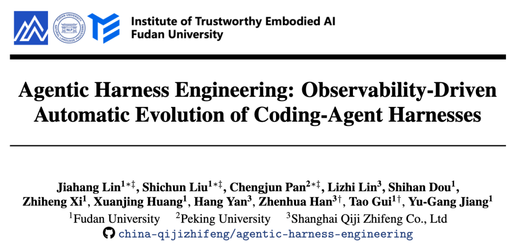
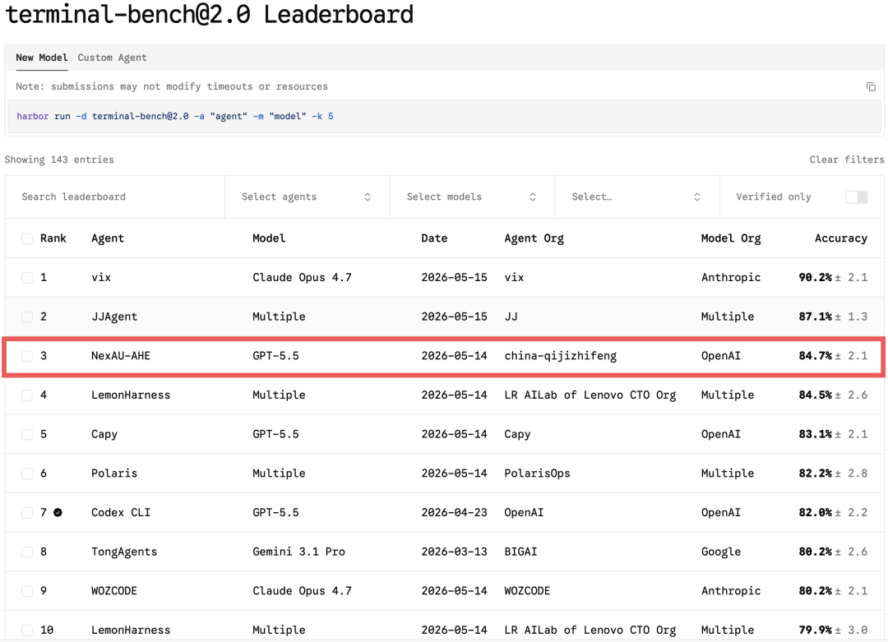
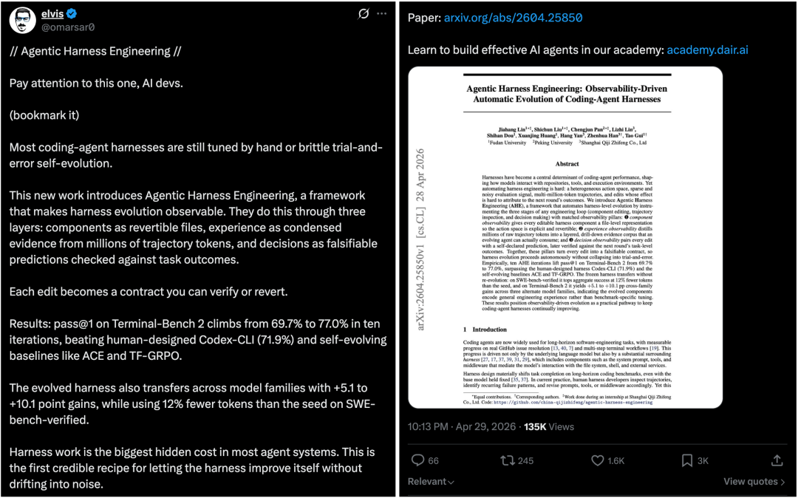
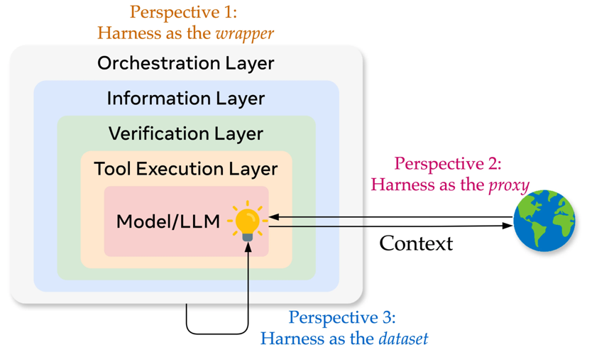
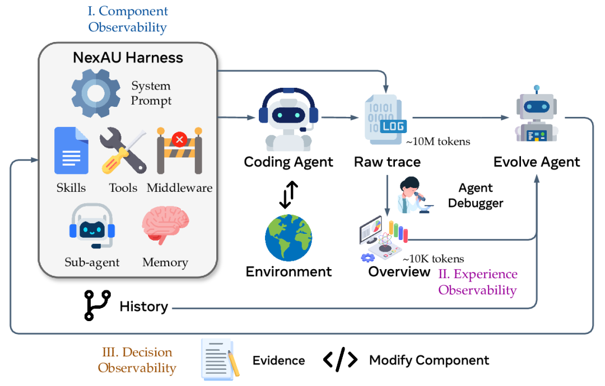
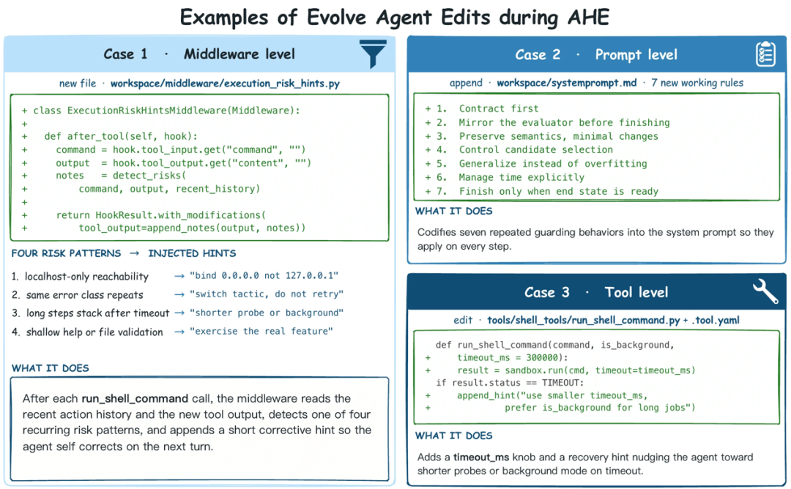
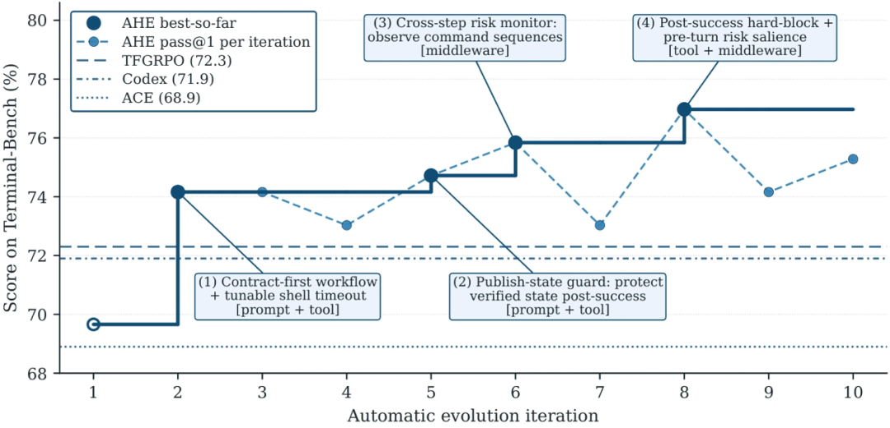
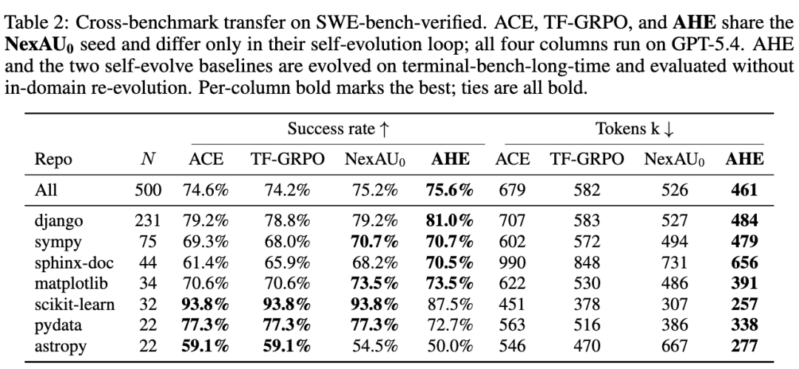
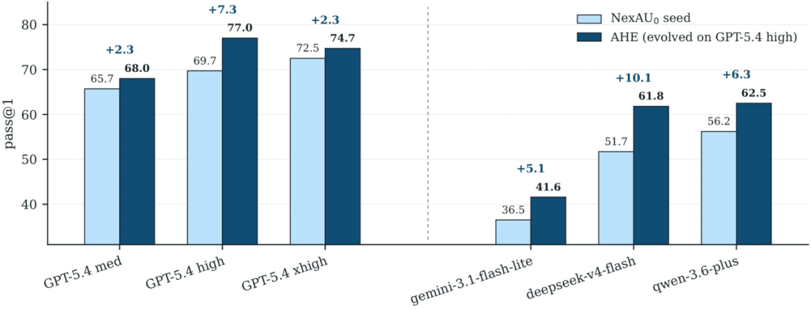
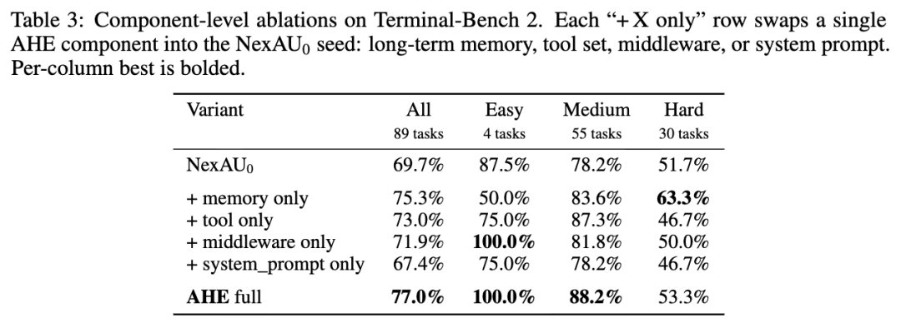

# 全球排名前三，复旦自进化Harness Engineering让GPT‑5.4再涨7个点

Source: https://mp.weixin.qq.com/s/ObREWAzbx9znsfuz1r4ZuQ

# 全球排名前三，复旦自进化Harness Engineering让GPT‑5.4再涨7个点

[机器之心](javascript:void(0);)

在小说阅读器读本章

去阅读

在小说阅读器中沉浸阅读

机器之心编辑部

2026 年以来，OpenAI、Anthropic、LangChain 等机构纷纷发布关于 Harness Engineering 的技术博客，OpenClaw、Hermes Agent 等项目的火爆更让 Harness Engineering 成为业界热词。人们的共识正在形成：模型的能力释放，依赖于一套精密的外部框架。

Harness 的开发与优化是一个工程问题，需要结合模型能力、任务环境共同设计。然而，模型自身以月为单位进化，任务场景往长尾分布发展，Harness 的进化与迭代却高度依赖人工经验。 这引出了一个核心问题：在 Harness Engineering 的迭代循环中，哪些部分可以被自动化？如何让 Harness 自动地从经验中学习并改进？

来自复旦大学、北京大学、上海奇绩智峰的团队提出 Agentic Harness Engineering (AHE)，这是一套可观测性（Observability）驱动的 Harness 自动优化方法，端到端贯穿 Harness Engineering 的全流程，实现了模型能动性的最大程度释放。

* 论文标题：Agentic Harness Engineering: Observability-Driven Automatic Evolution of Coding-Agent Harnesses
* 论文链接：arxiv.org/abs/2604.25850
* 代码仓库：github.com/china-qijizhifeng/agentic-Harness-engineering
* 项目博客：https://dawning-road.github.io/blog/agentic-Harness-engineering

在实验期间，使用 GPT‑5.4，AHE 在 Terminal-Bench 2 上的分数从 69.7 迭代到 77.0。GPT-5.5发布后，AHE迅速迭代出与之适配的Harness，在 Leaderboard 上位列全球第三。

并且，自动迭代得到的 Harness 展现出良好的模型间泛化以及任务间泛化能力，确保不是在 overfit 评测集。

目前论文在社交平台 X 上收获大量关注，已经有 10w + 浏览讨论。

为什么要设计可观测体系？

Harness Engineering 的三个视角

从形态上看，模型和 Harness 共同构成一个主体和环境进行交互。模型的所有行为都发生在概率空间中，是信息压缩、智能发生、不确定性的来源，而 Harness 是包裹在外的确定性组件：system prompt、工具定义与实现、middleware/hook、skill 文档、sub-agent 编排、长期记忆、日志与观测。在 agent 迈向长程、生产力任务过程中，Harness 是让模型行为稳定、一致、可控的重要保证。

从目的上看，Harness 的职能之一是在模型和环境之间管理一条双向的上下文流：一侧在合适的时机把任务、用户意图、环境状态、外部信息传进模型，另一侧把模型的动作忠实地记录、校验后交回环境执行。

过去，开发者需要手动设计 prompt、复制 terminal 输出、复制外部文档内容给模型，上下文分布在互不相通的空间里，人类依据直觉和观察来决定 context 的构成。因此，Harness 的设计目标之一，就是让 context 的流动可以更加精准、更加自主。

基于以上的形态与目标，Harness Engineering 的方法论是什么？

最直观的，是独立优化各个组件代码，或者称之为 Agent Infra。开发者社区贡献了大量有用的 Harness 组件，用于记忆、上下文管理、沙盒环境、轨迹管理，这依赖于扎实的工程开发与优化，让各个部分的独立地变得更加高效、安全、稳定。

进一步地，对于任意一个特定环境，若要找到最优的 Harness，这就成为了一个模型 x Harness x 环境的组合优化问题。不再能像开发单独组件那样有一个明确的规则，不再能利用人类开发者的先验知识一步到位找出最优组合，而是要开发、观测、迭代，根据模型的运行轨迹、评测分数，反复调整。

人类的注意力是稀缺的，因此，必须让 agent 本身也参与到 Harness 优化的过程中来。只要把优化目标、动作空间、状态空间都以一种 agent 可读的方式呈现，那么就可以引入 agent 进行自主优化。这便是 AHE 设计可观测体系的出发点。

可观测体系：组件、经验、决策

Harness 的开发也分为几个阶段：编写组件、运行 agent、收集反馈。这个过程反复迭代，持续运行。如果要想让 agent 接手人类的工作，就需要在此过程中所产生的 context 可观测，并且做好 context 结构化、层次化。

在此过程中，并不限制 agent 的自主决策空间，只依赖评测结果，以及更多分层信息来辅助它精准修改、准确归因。

AHE 方法由三个角色构成：Coding Agent 负责运行测试，Agent Debugger 负责整理轨迹，Evolve Agent 负责修改 Coding Agent 的 Harness 实现进化。

整个可观测体系分三部分：

1. NexAU 提供各部分解耦的 Harness，提供 Harness 组件的可观测性；
2. Agent Debugger 把 10M token 量级的 raw trace 提炼成分层的、可溯源的多维反馈意见，实现经验的可观测性；
3. Evolve Agent 基于 git 溯源的组件历史、反馈结果，构建证据驱动的完整修改链路，对相应组件进行修改，实现优化行为的可观测性。

（1）组件可观测性：解耦的 “声明式 Harness”

Coding Agent 基于 NexAU 框架运行。AHE 把 Harness 拆成了七种正交的文件级组件：System Prompt、Tool Description、Tool Implementation、Middleware、Skill、Sub-agent Config、Long-term Memory。每个组件都是一个独立的文件，有明确的挂载点，彼此之间结构解耦。

这种设计的巧妙之处在于：它让 “失败模式 - 单一组件” 的映射关系变得极其清晰。 所有修改通过 Git 进行版本管理，每次变更都是一次可追溯、可审计、可回滚的 commit。

目标 Coding Agent 则故意从一个 “零先验” 的极简形态起步：只有一个 run\_shell\_command 工具，没有任何 Middleware、Skill 或 Sub-agent。这样做是为了确保后续每一次新增组件、每一次 Prompt 改写，都能被干净地归因。

（2）经验可观测性：Agent Debugger 把轨迹变成可消费资产

一次完整评测所产生的原始轨迹动辄数千万 Token，如果把它们直接丢给 Evolve Agent，其上下文窗口将瞬间被淹没，什么代码都改不了。

AHE 开发了一套名为 Agent Debugger 的分层提炼流水线：底层完整记录所有原始轨迹；中层由 Cleaner 去除重复的工具输出；上层则通过一个 QA Sub-agent，针对每道题的多次 rollout 结果，自动切换提问策略。最后，所有单题分析汇聚成一份约 10K Token 的概览报告，交给 Evolve Agent 消费。

本质上，这是一种渐进式披露的设计。Evolve Agent 默认只需阅读概览，但随时可以查看单题细节，在需要核实结论时回溯原始轨迹。10M 级别的数据由此变成了可并发、可消费、可审计的经验资产。

（3）决策可观测性：Evolve Agent 的 “证据驱动修改”

Evolve Agent 的设计原则极其克制，目的是为了实现稳定进化：

* 只能修改 workspace 内的 Harness 组件文件，评测框架、LLM 配置、原始 System Prompt 均为只读，杜绝任何绕过评测的 hacking 行为。
* 每次修改必须附带一份 “变更清单”，包括：失败的证据（具体哪些任务失败了）、推断的根因、针对性的修改方案，以及自我声明的预测（预计修复哪些任务、可能破坏哪些任务）。每一轮修改后，由下一轮评测充当验证者：预测正确的修改保留，预测错误的修改自主决定回滚。

如此一来，每一次 Harness 变动都不再是工程师的直觉、抽象经验，而是一条可被下一轮实验所证伪的假说。Harness 进化由此从艺术走向工程，从经验走向科学。

实验结果：超越人类专家，跨模型泛化

在主实验上，AHE 将 GPT-5.4 驱动的 Coding Agent 在 Terminal-Bench 2 上的 pass@1 分数从最初的 69.7% 提升到了 77.0%，绝对提升 7.3 个百分点，相对提升 10.5%。这一成绩不仅超过了同样使用 GPT-5.4 的 OpenAI 官方 Codex-CLI（71.9%），也显著优于 ACE 和 Training Free-GRPO 等主流基线。

更让人惊喜的是泛化能力。

（1）跨任务泛化： 将在 Terminal-Bench 2 上演化得到的 Harness 冻结后，直接迁移到 SWE-Bench Verified 上，AHE 以更少的 Token 消耗实现了比 ACE 和 TF-GRPO 更高的成功率。这表明演化学到的不是 “如何刷 Terminal-Bench 2” 的特化知识，而是可迁移的通用工程经验。

（2）跨模型泛化： 同样一份由 GPT-5.4 演化得到的 Harness，分别配到 Qwen-3.6-Plus、Gemini-3.1-Flash 和 DeepSeek-V4 上，不做任何再演化直接评测。结果是三种模型均获得 +5.1 到 +10.1 个百分点的显著提升，且模型越弱，提升越大。这套 Harness 并非为某个特定模型量身定制，而是学到了一些真正普适的结构性原则。

价值到底沉淀在哪里？

事实比策略更可迁移

在博客中，作者还提到了一些前期的失败探索。为了快速迭代，团队最初只在 Terminal-Bench 2 的 30 道 hard 难度的题目上做 10 轮演化。结果题目通过数在 16-20 间反复震荡，基本修一个坏一个。分析最终版本的 Harness 发现，Evolve Agent 对特定任务写了针对性的 hack：Golden Gate 的 splice-offset 检测、Caffe 的完整工作流模板等等。这表明，过小的题集让单一题目的信号过强，抑制不住 agent 的 hack 倾向。

团队将题集扩到 89 题的全集，并在 Evolve Agent 的 System Prompt 中加入显式的方法论指导，比如 “Safety/Creativity/Generality” 原则和 “Middleware > Tool Desc > Skill > Prompt” 的约束层级排序。结果 overfit 确实缓解了，但训练曲线在 75.3% 就早早触顶不再上升，78% 的修改都落在 Middleware 层。人工引入的行为先验，恰恰成了进化的僵化之源。

最终版本做了两个关键改动：一是在评测时每题跑两次，通过 partial-pass 的 diff 定位最精准的诊断信号；二是删掉所有行为指导，只保留证据驱动过程要求和回滚规则。

结果上，不仅分数上稳步提升至 77.0%，修改分布也变得更加健康：middleware 37% + tool 48% + prompt 10%，没有任何层级单独占比超过一半，不同阶段灵活调整。

一个来自社区的惯性思维是 “先调整 Prompt”。然而，把 AHE 演化得到的四类组件（Memory、Tools、Middleware、System Prompt）逐一单独放回最初的 Harness 上进行消融实验时，结果却截然相反：Memory 单独就能恢复全局增幅的 95% 以上，Tool 在中等难度题目上提升显著，而 System Prompt 单独迁移反而导致性能下降。

一个可能的原因是：Prompt 的语义是策略性的（你应该这样做），而 Memory 和 Tool 的语义是事实性的（这里有一段可复用代码）。事实比策略迁移性好，它们保留了信息，同时维持了泛化性。这或许也解释了为什么人类试图通过注入方法论来指导 Evolve Agent 时会遭遇失败：开发者习惯于教策略，而模型更擅长学事实。

结语：可观测的进化循环会让 AGI 加速到来

AHE 带来的最大启示或许在于：当模型足够强，搭建一个结构化的、可观测的演化环境，比直接开发 Harness 更重要。搭建好观测体系（让 Evolve Agent 能访问组件、轨迹、反馈），然后在全量数据上运行测试，就足够演化出有竞争力的 Harness。无需替 Agent 思考任何方法论，只是给它一个清晰的 workspace、明确的修改接口和高质量的反馈信号，Evolve Agent 的行为便自动向真实工程师收敛。

是时候迈出第一步，让 Harness 也开始进化了。

© THE END

转载请联系本公众号获得授权

投稿或寻求报道：liyazhou@jiqizhixin.com

预览时标签不可点

微信扫一扫  
关注该公众号

继续滑动看下一个

轻触阅读原文

机器之心

向上滑动看下一个

[知道了](javascript:;)

微信扫一扫  
使用小程序

[取消](javascript:void(0);)
[允许](javascript:void(0);)

[取消](javascript:void(0);)
[允许](javascript:void(0);)

[取消](javascript:void(0);)
[允许](javascript:void(0);)

×
分析

微信扫一扫可打开此内容，  
使用完整服务

：
，
，
，
，
，
，
，
，
，
，
，
，
。
 
视频
小程序
赞
，轻点两下取消赞
在看
，轻点两下取消在看
分享
留言
收藏
听过