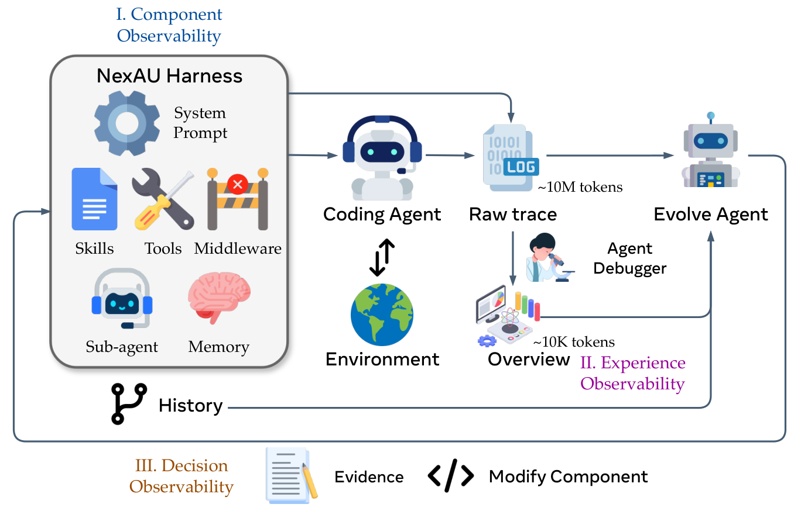
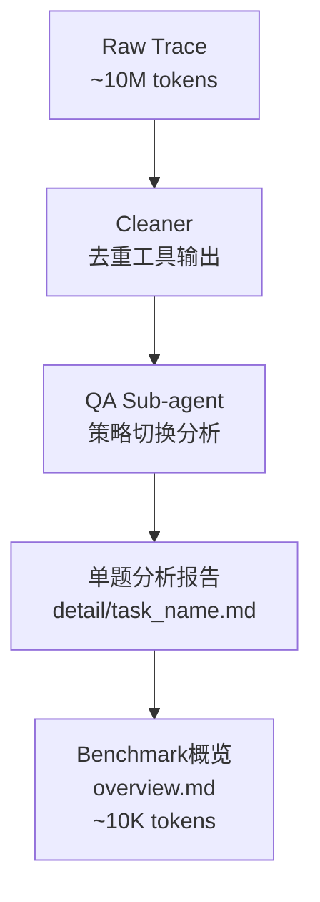
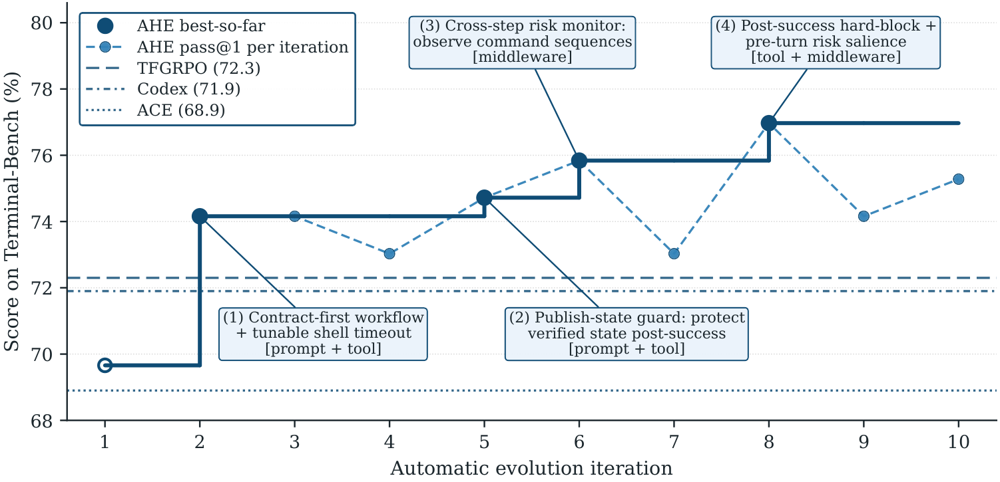
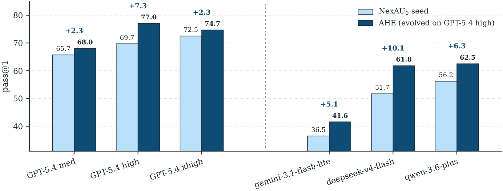
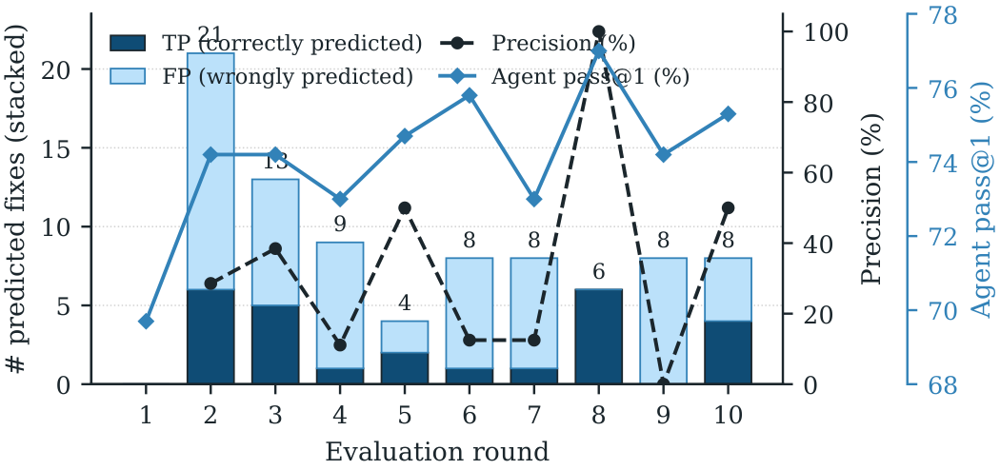

# AHE论文调研报告

> Agentic Harness Engineering: Observability-Driven Automatic Evolution of Coding-Agent Harnesses

---

## 基本信息

| 项目 | 内容 |
|-----|------|
| 论文标题 | Agentic Harness Engineering: Observability-Driven Automatic Evolution of Coding-Agent Harnesses |
| 作者 | Jiahang Lin, Shichun Liu, Chengjun Pan, Lizhi Lin, Shihan Dou, Zhiheng Xi, Xuanjing Huang, Hang Yan, Zhenhua Han, Tao Gui, Yu-Gang Jiang |
| 所属机构 | 复旦大学、北京大学、上海奇绩智峰 |
| 发表年份 | 2026 |
| 论文链接 | arxiv.org/abs/2604.25850 |
| 代码仓库 | github.com/china-qijizhifeng/agentic-harness-engineering |
| 项目博客 | https://dawning-road.github.io/blog/agentic-Harness-engineering |

---

## 1. 研究背景与动机

### 1.1 问题定义

**Harness** 是包裹在LLM外部的可编辑组件集合，包括系统提示词(System Prompt)、工具定义与实现(Tools)、中间件(Middleware)、技能文档(Skills)、子代理配置(Sub-agent)、长期记忆(Long-term Memory)等。这些组件共同决定了模型如何与环境交互，是coding agent性能的关键决定因素。

然而，Harness Engineering 仍是一门手工艺：开发者需要检查轨迹、识别失败模式、手工编辑各组件。随着模型以月为单位快速进化，这种手动循环难以跟上节奏，导致模型能力与所需Harness之间的差距不断扩大。

### 1.2 研究动机

自动化Harness优化面临三大挑战：

1. **异构动作空间**：可编辑组件类型多样（prompt、tool、middleware、skill等），难以统一处理
2. **海量轨迹数据**：原始轨迹动辄数千万token，有效信号被淹没
3. **编辑效果难以归因**：修改哪个组件导致了性能变化难以精确追踪

### 1.3 研究目标

论文提出核心问题：**如何让Evolution Agent联合、稳定地演化coding agent的所有可编辑组件？**

核心洞察：这个问题的瓶颈在于**可观测性(Observability)**，而非agent能力——一旦Evolution Agent获得了清晰动作空间上的结构化上下文，它就能可靠地收敛到更好的Harness设计。

---

## 2. 核心贡献

### 2.1 主要贡献

| 编号 | 贡献描述 |
|-----|---------|
| C1 | 提出AHE框架，通过三大可观测性支柱将Harness演化转变为闭环自动化过程 |
| C2 | 实证表明AHE将Terminal-Bench 2的pass@1从69.7%提升至77.0%，超越人工设计和自动化基线 |
| C3 | 分析揭示组件非加性交互和回归预测盲点，指明未来自演化循环的改进方向 |

### 2.2 创新点

1. **方法创新**：首次提出"可观测性驱动"的Harness演化范式，将每次编辑转化为可证伪的契约
2. **技术创新**：设计分层轨迹蒸馏流水线，将千万级token压缩为10K级可消费证据
3. **实验创新**：通过跨任务、跨模型泛化实验验证演化结果编码的是通用工程经验

---

## 3. 方法详解

### 3.1 方法概述

AHE是一个由另一个Agent驱动的闭环优化系统，基础模型固定，仅编辑显式的Harness组件。设计原则是：**循环的每个阶段都必须可观测**——忠实地记录各阶段产生的产物，并以结构化、分层的形式表示，供另一个Agent读取和操作。

### 3.2 整体架构



*AHE流水线将三个可观测表面连接成一个闭环：组件、轨迹经验和编辑决策各自呈现为结构化工件，每次编辑成为下一轮验证的可证伪预测。*

**架构文字描述**：

AHE包含三个核心角色和三层可观测性：

**三个角色**：
- **Coding Agent**：执行任务的代码代理，运行在NexAU框架上
- **Agent Debugger**：分析轨迹的诊断代理，将原始轨迹提炼为结构化证据
- **Evolve Agent**：执行修改的演化代理，基于证据修改Harness组件

**三层可观测性**：
1. **组件可观测性(Component Observability)**：通过解耦的文件级Harness实现，每个失败模式映射到单一组件类
2. **经验可观测性(Experience Observability)**：通过分层证据库实现，从原始轨迹蒸馏而来
3. **决策可观测性(Decision Observability)**：通过变更清单实现，每次编辑附带自声明预测

**数据流向**：
- Coding Agent执行任务产生Raw Trace（约10M tokens）
- Agent Debugger将Raw Trace提炼为Overview（约10K tokens）
- Evolve Agent基于Overview和Evidence修改Harness组件
- 修改后的Harness进入下一轮迭代

### 3.3 核心算法

#### 3.3.1 算法流程

```
Algorithm 1: AHE Outer Loop
Input: seed harness H0, base model M, benchmark D, rollouts per task k, max iterations N

1: Hbest ← H0
2: for t = 1 to N do
3:     Tt ← ROLLOUT(M, Ht-1, D, k)          # Phase 1: k rollouts per task
4:     T̃t ← CLEAN(Tt)                        # Phase 2: normalize traces
5:     if t ≥ 2 then                         # Phase 3: attribute & rollback
6:         Vt ← ATTRIBUTE(Ct-1, Tt-1, Tt)
7:         Ht-1 ← ROLLBACK(Ht-1, Vt)
8:     else
9:         Vt ← ∅
10:    end if
11:    Rt ← AGENTDEBUGGER(T̃t)               # Phase 4: layered distillation
12:    (Ht, Ct) ← EVOLVE(Ht-1, Rt, Vt)       # Phase 5: workspace edits + manifest
13:    COMMIT(Ht, Ct, t)                      # Phase 6: tag iteration in git
14:    if PASS@1(Tt) > PASS@1(Hbest) then Hbest ← Ht
15:    end if
16: end for
17: return Hbest
```

#### 3.3.2 算法逐步解读

| 步骤 | 操作 | 输入 | 输出 | 设计意图 |
|-----|-----|-----|-----|---------|
| Phase 1 | ROLLOUT | Harness H, Benchmark D | k条轨迹/任务 | 生成任务级别的通过率信号 |
| Phase 2 | CLEAN | 原始轨迹 | 规范化轨迹 | 去除冗余、统一格式 |
| Phase 3 | ATTRIBUTE & ROLLBACK | 上一轮manifest, 两轮轨迹 | 归因裁决Vt | 验证预测，回滚无效修改 |
| Phase 4 | AGENTDEBUGGER | 规范化轨迹 | 分层证据库Rt | 将海量轨迹压缩为可消费证据 |
| Phase 5 | EVOLVE | Harness, 证据, 裁决 | 新Harness + Manifest | 证据驱动的组件修改 |
| Phase 6 | COMMIT | Harness, Manifest | Git提交 | 版本追溯和回滚支持 |

### 3.4 关键模块详解

#### 3.4.1 模块A: NexAU解耦Harness框架

- **功能**：提供组件可观测性，将Harness拆分为七种正交的文件级组件
- **输入/输出**：配置文件 → 可运行的Agent实例
- **七种组件类型**：

| 组件类型 | 文件位置 | 特点 | 适用场景 |
|---------|---------|------|---------|
| System Prompt | `workspace/systemprompt.md` | 全局生效 | 行为规则、工作流指导 |
| Tool Description | `workspace/tool_descriptions/*.tool.yaml` | 模型调用时读取 | 澄清工具用法、添加示例 |
| Tool Implementation | `workspace/tools/` | 直接控制行为 | 新能力、错误处理 |
| Middleware | `workspace/middleware/` | 管道式拦截 | 执行级转换/监控 |
| Skill | `workspace/skills/` | 按需加载 | 可复用工作流模式 |
| Sub-Agent | `workspace/sub_agents/` | 独立上下文 | 委托专项子任务 |
| Long-term Memory | `workspace/LongTermMEMORY.md` | 跨会话持久 | 记录陷阱、策略、环境特性 |

- **直觉理解**：这种设计让"失败模式→单一组件"的映射极其清晰，每个修改都是可追溯、可审计、可回滚的git commit
- **种子Harness**：故意从极简形态起步（仅一个`run_shell_command`工具），确保后续每次新增组件都能被干净归因

#### 3.4.2 模块B: Agent Debugger轨迹蒸馏

- **功能**：提供经验可观测性，将千万级原始轨迹提炼为分层证据库
- **输入/输出**：10M token原始轨迹 → 10K token概览报告
- **核心流程**：



- **渐进式披露设计**：Evolve Agent默认只需阅读概览，但可随时查看单题细节，必要时回溯原始轨迹
- **关键价值**：10M级数据变成可并发消费、可审计的经验资产

#### 3.4.3 模块C: Evolve Agent证据驱动编辑

- **功能**：提供决策可观测性，执行证据驱动的Harness修改
- **两大约束**：

**约束1：可控性边界**
- 只能修改`workspace/`内的文件
- `runs/`目录只读
- LLM配置、tracer、verifier不可修改
- 原始system prompt不可删除

**约束2：证据驱动修改**
- 每次修改必须附带变更清单(change manifest)，包含：
  - 失败证据（哪些任务失败了）
  - 推断根因
  - 针对性修改方案
  - 自声明预测（预计修复哪些任务、可能破坏哪些任务）

- **直觉理解**：每次Harness变动不再是直觉或抽象经验，而是一条可被下一轮实验证伪的假说
- **设计意图**：Harness进化从艺术走向工程，从经验走向科学

### 3.5 关键技术

| 技术点 | 描述 | 作用 | 论文对应位置 |
|-------|-----|-----|------------|
| 解耦组件设计 | 七种正交组件类型，文件级挂载 | 清晰的动作空间和失败归因 | Section 3.1 |
| 分层轨迹蒸馏 | Cleaner → QA Sub-agent → Overview | 将海量轨迹压缩为可消费证据 | Section 3.2 |
| 变更清单机制 | 每次编辑附带预测，下一轮验证 | 使每次编辑成为可证伪契约 | Section 3.3 |
| Git版本管理 | 每次修改一个commit | 文件级回滚粒度 | Section 3.1 |

### 3.6 方法设计的关键洞察

1. **可观测性是瓶颈**：一旦Evolution Agent获得清晰动作空间上的结构化上下文，它就能可靠收敛——问题不在agent能力，而在信息呈现方式

2. **事实比策略更可迁移**：Memory和Tool编码的是事实性知识（这里有段可复用代码），而Prompt编码的是策略性指导（你应该这样做）；论文消融实验表明事实性组件迁移性更好

3. **渐进式披露节省认知开销**：不把千万级原始轨迹直接丢给Evolve Agent，而是分层提炼，按需下钻

### 3.7 与现有方法的核心区别

| 环节 | 现有方法做法 | 本文做法 | 改变原因 |
|-----|------------|---------|---------|
| 编辑范围 | 仅编辑单一组件（通常是prompt） | 联合编辑全部七种组件 | 跨组件权衡变得可见 |
| 轨迹使用 | 直接使用原始轨迹 | 分层蒸馏后再消费 | 避免上下文窗口被淹没 |
| 修改验证 | 无系统化验证机制 | 每次编辑附带预测，下一轮自动验证 | 避免退化为试错循环 |
| 先验知识 | 注入大量方法论指导 | 最小化先验，让模型从rollout中发现 | 避免人工先验成为进化僵化之源 |

---

## 4. 实验分析

### 4.1 实验设置

#### 数据集

| 数据集 | 规模 | 任务 | 用途 |
|-------|-----|-----|-----|
| Terminal-Bench 2 | 89任务（4 Easy, 55 Medium, 30 Hard） | 终端工作流 | 演化训练集 |
| SWE-bench-verified | 500任务，7个仓库 | Issue解决 | 跨benchmark迁移测试 |

#### 评估指标

| 指标 | 定义 | 计算方式 |
|-----|-----|---------|
| pass@1 | 单次尝试成功率 | k次rollout的平均二值奖励 |
| Tokens k | 每次试验的平均token消耗 | (prompt + completion) / trial，单位千 |
| Succ/Mtok | 每百万token期望成功数 | pass@1 × 10^6 / mean tokens |

#### 实现细节

- **硬件环境**：E2B远程沙箱，3600秒/任务超时
- **基础模型**：GPT-5.4（三个角色Agent共用）
- **推理设置**：Code Agent用high，Evolve Agent用xhigh
- **演化参数**：T=10轮迭代，k=2次rollout/任务，96并发

### 4.2 主实验结果



*AHE将bash-only种子演化至超越所有人工设计和自演化基线。图中标注了四个关键里程碑及其对应的组件修改类型。*

**主实验结果表**：

| Method | All (89) | Easy (4) | Medium (55) | Hard (30) |
|--------|----------|----------|-------------|-----------|
| OpenCode | 47.2% | 75.0% | 52.7% | 33.3% |
| Terminus-2 | 62.9% | 75.0% | 74.5% | 40.0% |
| Codex | 71.9% | 75.0% | 80.0% | 56.7% |
| NexAU0 (seed) | 69.7% | 87.5% | 78.2% | 51.7% |
| ACE | 68.9% | 91.7% | 78.2% | 48.9% |
| TF-GRPO | 72.3% | 100.0% | 79.4% | 55.6% |
| **AHE** | **77.0%** | **100.0%** | **88.2%** | 53.3% |

**关键发现**：
- AHE将pass@1从69.7%提升至77.0%，绝对提升7.3个百分点，相对提升10.5%
- 超越人工设计的Codex（71.9%）和自演化基线ACE（68.9%）、TF-GRPO（72.3%）
- Medium任务提升最显著（78.2% → 88.2%）

**四个关键里程碑**：
1. **Iteration 2**：Contract-first workflow + tunable shell timeout [prompt + tool]
2. **Iteration 5**：Publish-state guard保护验证后状态 [prompt + tool]
3. **Iteration 6**：Cross-step risk monitor观察命令序列 [middleware]
4. **Iteration 8**：Post-success hard-block + pre-turn risk salience [tool + middleware]

### 4.3 跨任务泛化（RQ2）

**SWE-bench-verified迁移结果**：

| Method | Success Rate | Tokens k | Succ/Mtok |
|--------|-------------|----------|-----------|
| ACE | 74.6% | 679 | 1.10 |
| TF-GRPO | 74.2% | 582 | 1.27 |
| NexAU0 | 75.2% | 526 | 1.43 |
| **AHE** | **75.6%** | **461** | **1.64** |

**关键发现**：
- AHE在不重新演化的情况下，在SWE-bench-verified上达到最高成功率
- Token消耗比种子减少12%，比ACE减少32%
- ACE和TF-GRPO反而低于种子基线，表明prompt-only方法在跨任务时泛化性差

### 4.4 跨模型泛化



*在GPT-5.4上演化的Harness冻结后迁移到其他模型，不做任何再演化直接评测。*

**跨模型迁移结果**：

| Model | Seed | AHE | Gain |
|-------|------|-----|------|
| GPT-5.4 medium | 65.7% | 68.0% | +2.3 pp |
| GPT-5.4 high | 69.7% | 77.0% | +7.3 pp |
| GPT-5.4 xhigh | 72.5% | 74.7% | +2.3 pp |
| Gemini-3.1-flash-lite | 36.5% | 41.6% | **+5.1 pp** |
| DeepSeek-V4-flash | 51.7% | 61.8% | **+10.1 pp** |
| Qwen-3.6-plus | 56.2% | 62.5% | **+6.3 pp** |

**关键发现**：
- 所有模型都获得正向增益，表明Harness不是为特定模型定制
- 跨模型族增益大于模型族内增益：越远离饱和点的模型，越依赖Harness中的协调模式

### 4.5 消融实验（RQ3a）



*修复预测的精确率和召回率分析。*

**组件级消融结果**：

| Variant | All | Easy | Medium | Hard |
|---------|-----|------|--------|------|
| NexAU0 | 69.7% | 87.5% | 78.2% | 51.7% |
| + memory only | **75.3%** | 50.0% | 83.6% | **63.3%** |
| + tool only | 73.0% | 75.0% | **87.3%** | 46.7% |
| + middleware only | 71.9% | **100.0%** | 81.8% | 50.0% |
| + system_prompt only | 67.4% | 75.0% | 78.2% | 46.7% |
| AHE full | 77.0% | **100.0%** | 88.2% | 53.3% |

**关键发现**：
- Memory单独迁移恢复95%以上增幅，Tool在中难度题目提升显著
- System Prompt单独迁移反而导致性能下降（-2.3 pp）
- 三个正向单组件增益之和（+11.1 pp）超过完整AHE（+7.3 pp），表明组件非加性交互

**组件非加性分析**：
- Memory、Middleware、System Prompt都推动同一种closure-style验证
- 堆叠它们会在长时程预算内消耗turn做冗余重查
- Evolve Agent优化的是以Medium为主的综合得分，因此收敛到Medium-heavy权衡

### 4.6 自归因分析（RQ3b）

**修复预测能力**：
- Fix-Precision: 33.7%（随机基线6.5%）
- Fix-Recall: 51.4%（随机基线10.6%）
- 结论：修复预测是证据驱动的，约5倍于随机

**回归预测能力**：
- Regression-Precision: 11.8%（随机基线5.6%）
- Regression-Recall: 11.1%（随机基线5.4%）
- 结论：回归预测接近盲猜，大多数回归未被预见

**关键发现**：Agent能解释为什么修改有帮助，但无法可靠预测同一修改会破坏哪些任务——这正是演化曲线非单调的原因。

### 4.7 实验结果总体分析

综合所有实验，AHE的有效性可归纳为以下验证层次：

**第一层：现象验证（主实验）**
- 在Terminal-Bench 2上超越所有基线，证明方法有效
- 增益来自多组件联合演化，而非单一组件优化

**第二层：自动化验证（泛化实验）**
- 跨任务迁移成功，证明编码的是通用工程经验而非benchmark-specific技巧
- 跨模型迁移成功，证明不是为特定模型定制

**第三层：机制验证（消融实验）**
- 事实性组件（Memory、Tool）比策略性组件（Prompt）更可迁移
- 组件间非加性交互存在，堆叠有效修改可能抵消增益

**核心结论**：
1. **可观测性驱动有效**：清晰的组件边界、结构化证据、可验证预测三者缺一不可
2. **事实优于策略**：将知识编码在Tool/Middleware/Memory中，比写在Prompt里更稳健
3. **回归预测是瓶颈**：提升回归预见能力是未来自演化循环的核心改进方向

---

## 5. 相关工作

### 5.1 相关工作列表

| 论文/方法 | 年份 | 核心思想 | 与本文关系 |
|----------|-----|---------|-----------|
| Codex CLI [OpenAI] | 2025 | 人工设计的coding agent harness | 本文对比基线 |
| ACE [Zhang et al.] | 2025 | 演化自然语言playbook | 本文对比基线，prompt-only |
| TF-GRPO [Cai et al.] | 2025 | 无训练GRPO强化工具序列 | 本文对比基线，prompt-only |
| SWE-agent [Yang et al.] | 2024 | Agent-Computer Interface设计 | Harness工程基础工作 |
| OpenHands [Wang et al.] | 2025 | 开源软件开发agent框架 | 执行环境参考 |
| Reflexion [Shinn et al.] | 2023 | 自我反思迭代优化 | 单组件编辑先驱 |
| Voyager [Wang et al.] | 2023 | 技能库演化 | 技能编辑参考 |

### 5.2 本文与相关工作的区别

**vs 人工设计Harness（Codex、Terminus等）**：
- 人工设计依赖专家经验，迭代周期长
- AHE自动化演化，10轮迭代32小时超越人工基线

**vs Prompt-only自演化（ACE、TF-GRPO）**：
- ACE和TF-GRPO只能编辑prompt，无法触及Tool/Middleware层
- 论文消融表明增益集中在后者，prompt单独迁移甚至负面
- AHE联合编辑全部组件类型

**vs 单组件优化（Reflexion、Voyager等）**：
- 单组件优化无法处理跨组件权衡
- AHE的全组件视角让权衡变得可见可优化

---

## 6. 局限性分析

### 6.1 论文声明的局限性

1. **Benchmark范围**：仅在Terminal-Bench 2上演化，SWE-bench-verified上测试迁移；更广泛的编程语言、仓库规模部署、人机协同工作流未测试

2. **演化操作点耦合**：Step预算和Per-task超时针对GPT-5.4 high调优，跨模型迁移时操作点耦合影响增益（模型族内增益非单调）

3. **自修改治理不完整**：AHE限制编辑到workspace、版本化manifest、文件级回滚，但缺乏完整的护栏栈；长时程Harness清理和误用防护仍不完整

### 6.2 发现的潜在问题

| 问题类型 | 描述 | 影响 |
|---------|-----|------|
| 方法层面 | 组件非加性交互导致堆叠增益受限 | 需要交互感知演化策略 |
| 方法层面 | 回归预测盲点导致演化曲线非单调 | 需要回归预见机制 |
| 实验层面 | 仅在终端工作流测试，未覆盖IDE/仓库级任务 | 泛化性待验证 |
| 应用层面 | 需要E2B沙箱等基础设施支持 | 部署门槛较高 |

### 6.3 未来工作方向

1. **交互感知演化**：显式建模组件间交互，避免堆叠抵消
2. **回归预见机制**：提升Evolve Agent预测回归的能力
3. **多操作点演化**：在不同推理预算下独立演化
4. **更广覆盖评估**：仓库级任务、多语言、人机协同

---

## 7. 个人评价

### 7.1 优点

1. **问题定位精准**：识别出"可观测性"而非"agent能力"是自动化Harness工程的瓶颈，视角独特

2. **方法论完整**：三层可观测性支柱设计完整，从组件解耦、轨迹蒸馏到决策验证形成闭环

3. **实验充分**：主实验、跨任务泛化、跨模型泛化、消融实验层层递进，验证充分

4. **洞察深刻**："事实比策略更可迁移"的发现对Harness设计有指导意义

### 7.2 不足

1. **基础设施依赖重**：需要NexAU框架、E2B沙箱、Harbor调度等完整基础设施，复现门槛高

2. **代码仓库未公开完整实现**：GitHub仓库在论文发表时可能尚未完全公开

3. **回归预测问题未解决**：论文识别出回归预测是盲点，但未提出有效解决方案

4. **演化效率待优化**：10轮迭代32小时，迭代周期较长

### 7.3 适用场景

**推荐使用场景**：
- 有完整Agent基础设施的团队
- 需要快速适配新模型发布
- 追求最大化模型能力释放

**不推荐使用场景**：
- 缺乏沙箱/调度基础设施
- 任务类型与Terminal-Bench差异大
- 对演化实时性要求高

---

## 8. 启发与思考

### 8.1 技术启发

1. **组件解耦是自动化的前提**：只有当失败模式能清晰映射到单一组件，自动优化才能有效归因

2. **分层信息处理是规模化关键**：从10M到10K的轨迹压缩展示了如何让Agent消费海量数据

3. **可证伪契约是自动化安全的保障**：每次编辑附带预测并由下一轮验证，避免演化退化为随机搜索

### 8.2 可借鉴之处

1. **声明式Harness设计**：将Harness组件表达为独立文件，而非硬编码在代码中
2. **渐进式信息披露**：为Agent提供分层证据，按需下钻，避免上下文溢出
3. **Git驱动的版本管理**：利用Git实现修改追溯和回滚，无需额外基础设施

### 8.3 潜在改进方向

1. **引入组件交互建模**：显式建模组件间依赖关系，优化堆叠策略
2. **增强回归预测能力**：专门训练或设计回归预测模块
3. **多目标优化**：同时优化pass@1、token消耗、时间预算
4. **在线演化**：从离线迭代扩展到在线持续学习

### 8.4 后续行动

- [ ] 阅读NexAU框架文档，理解组件挂载机制
- [ ] 复现Terminal-Bench 2基线实验
- [ ] 尝试在自己的Agent框架中引入三层可观测性设计
- [ ] 探索将Memory/Middleware迁移到现有项目

---

## 参考文献

```bibtex
@article{lin2026ahe,
  title={Agentic Harness Engineering: Observability-Driven Automatic Evolution of Coding-Agent Harnesses},
  author={Lin, Jiahang and Liu, Shichun and Pan, Chengjun and Lin, Lizhi and Dou, Shihan and Xi, Zhiheng and Huang, Xuanjing and Yan, Hang and Han, Zhenhua and Gui, Tao and Jiang, Yu-Gang},
  journal={arXiv preprint arXiv:2604.25850},
  year={2026}
}
```

---

## 附录

### A. 关键图表

| Figure | 描述 | 报告内位置 |
|--------|------|-----------|
| Figure 1 | 训练曲线与四个里程碑 | Section 4.2 |
| Figure 2 | AHE整体架构图 | Section 3.2 |
| Figure 3 | 跨模型迁移结果 | Section 4.4 |
| Figure 4 | 自归因精确率/召回率 | Section 4.6 |

### B. 流程图索引

| 图表 | 描述 | 报告内位置 |
|------|------|-----------|
| 轨迹蒸馏流程 | Agent Debugger处理流程 | Section 3.4.2 |

### C. 补充材料

微信公众号文章已保存至 `references/全球排名前三，复旦自进化Harness Engineering让GPT-5.4再涨7个点/` 目录，提供了论文的中文解读和背景介绍。

### D. 调研信息

- 调研人: henryhu
- 调研时间: 2026-06-10
- 论文版本: arXiv:2604.25850v4
- 参考来源: 论文PDF、arXiv源文件、微信公众号文章

---

*模板版本: v2.0*
