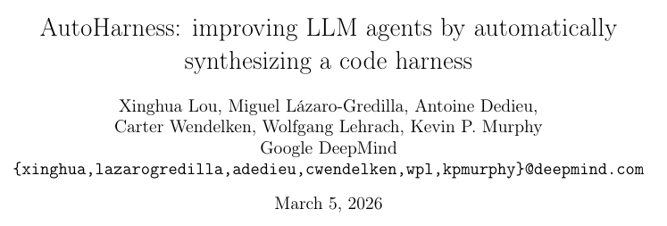
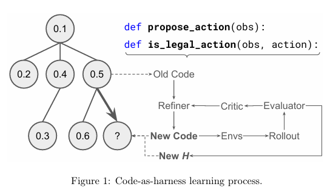
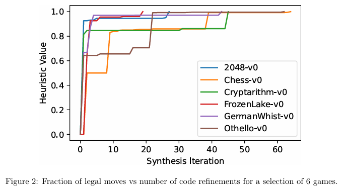
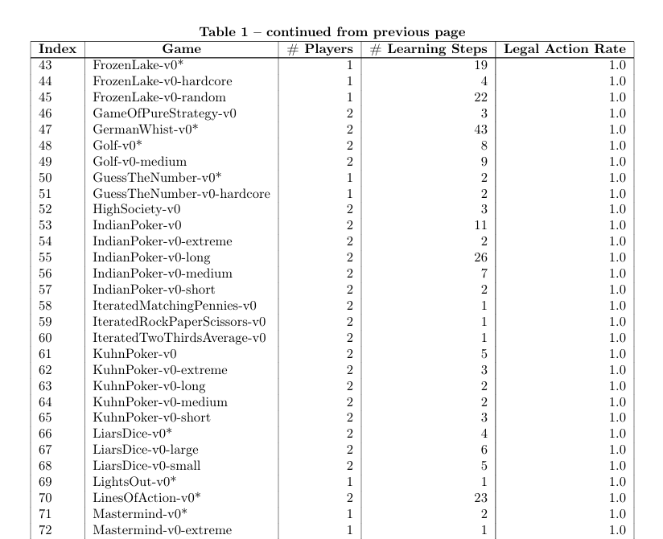
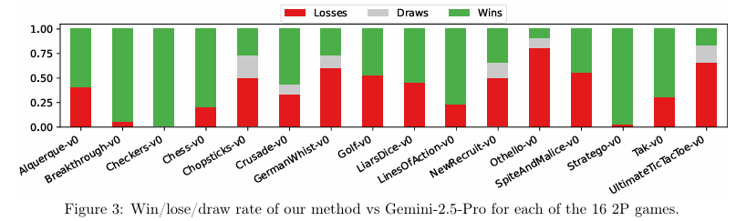
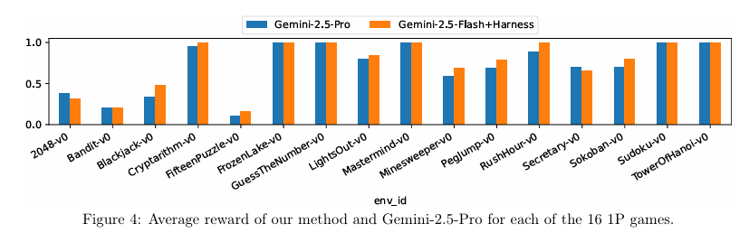
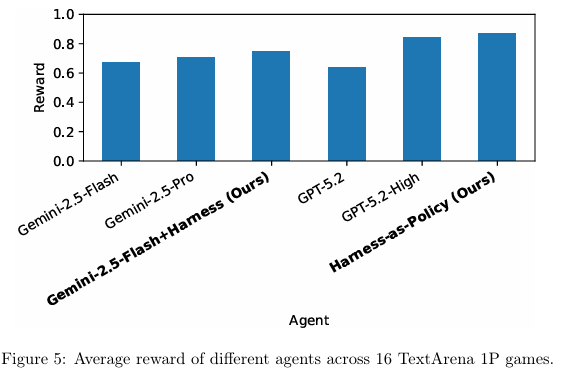

# 145种游戏中合法动作率100%！DeepMind新方法AutoHarness，让LLM自动合成代码约束智能体合规行动

Source: https://mp.weixin.qq.com/s/Q_4dlXLFM15cqqu1r3ZzAg

# 145种游戏中合法动作率100%！DeepMind新方法AutoHarness，让LLM自动合成代码约束智能体合规行动

原创

关注AI智能体
关注AI智能体

[智猩猩AI](javascript:void(0);)

在小说阅读器读本章

去阅读

在小说阅读器中沉浸阅读

智猩猩AI整理

编辑：林夕

在国际象棋比赛中，一位棋手输掉比赛，通常是因为策略失误、计算错误或被对手的妙招击败。但在2025年的一场由Gemini-2.5-Flash参与的Kaggle GameArena国际象棋比赛中，情况却有些荒诞：**78%的败局，不是因为“下得不好”，而是因为“下得不合法”。**

换句话说，这个能解奥数题、能写代码、能读懂复杂文档的大语言模型，却在国际象棋里频频走出“象走田”“马走直”之类的低级错误。它不是不够聪明，而是**不懂规则**。

这种现象并非个例。在需要严格遵循规则的环境中，LLM普遍存在一个矛盾：它能够理解规则，却难以在决策中一致地遵守规则。

现有解决方法主要包括两类：

* **手工编写的规则**：通过外部代码限制LLM只能输出合法动作。但这种方式需要为每个新游戏重新编写代码，成本高、不通用。
* **微调LLM**：让模型学习规则。但微调大模型成本高、时间长，还可能损害模型在其他任务上的能力。

因此，一个核心挑战依然存在：**如何让LLM在不依赖手工规则、不大规模微调的情况下，自动遵守规则？**

针对上述问题，谷歌DeepMind 团队提出AutoHarness方法，基于LLM的代码生成能力，自动合成用于约束Agent行动的代码化Harness，从而减少对人工规则编写和模型微调的依赖。该方法通过多轮迭代代码优化与树搜索机制，使模型在145个TextArena游戏中实现**100%的合法动作率**。进一步，将策略整体转化为代码，形成“代码即策略”模式，在16个单人游戏中取得平均奖励0.870，超越Gemini-2.5-Pro与GPT-5.2-High，且推理成本几乎为零。

* 论文标题: AutoHarness: improving LLM agents by automatically synthesizing a code harness
* 论文链接: https://arxiv.org/pdf/2603.03329

***01***

**方法**

LLM智能体频频违规的根本原因在于：模型对游戏规则的理解与其实际遵循规则的能力之间存在脱节。它能够正确描述规则，却在具体决策中频繁产生违规行为。

AutoHarness的思路是改变这个分工，把规则判断这一任务从LLM的概率性推理中剥离出来，交给确定性执行的代码去完成。代码一旦写对就永远不会犯错。LLM则只需要专注于在代码划定的合法范围内做决策。

接下来的问题是：这段规则代码由谁来写？AutoHarness的答案是——**LLM自己**。通过让LLM与环境反复交互、试错迭代，最终自动生成一份可靠的规则代码。整个过程无需人工编写规则，也无需微调模型。

（一）整体架构

AutoHarness将代码约束框架的生成形式化为一个**程序搜索问题**：在代码空间中寻找最优代码假设，使得智能体的非法动作率最小化。搜索过程由LLM作为变异算子，基于环境反馈对代码进行迭代精炼。

与普通迭代式提示不同，该方法采用**树搜索结构**管理多个代码假设，每个节点代表一个代码版本。搜索过程由**Thompson采样**引导，以平衡探索与利用。整体流程如图1所示。

图1 **AutoHarness流程**

（二）三种Harness模式

根据应用需求，AutoHarness支持三种不同的Harness：

* **动作过滤器（Harness-as-Action-Filter）：代码负责生成候选合法动作集，LLM在合法空间内进行策略选择。该模式将“生成什么动作”与“动作是否合法”解耦，LLM仅在安全区域内决策。**
* ****动作验证器（Harness-as-Action-Verifier）**：**该模式保持LLM作为主要决策者，代码仅作为后置过滤器。LLM生成动作，调用合法性校验函数检查，若非法则**在一个包含非法动作警告的新提示词下**重新生成。该模式实现最简单，但推理时仍需调用LLM。
* **代码即策略（Harness-as-Policy）：**代码直接输出动作，推理时不调用LLM。该模式需要代码同时具备规则理解能力和策略决策能力，实现难度最高，但推理成本几乎为零。

在论文主要聚焦于****动作验证器****，并在实验中展示了**代码策略**的可行性和优势。

（三）训练流程

整体训练流程如下：

* 同时运行10个并行环境，每轮最多执行1000 步；
* 一旦出现非法动作或代码执行错误，则终止当前轮；
* 每次最多采样5个失败步骤，先由Critic整合错误信息，再连同原始代码输入给Refiner；
* Refiner生成新代码，并继续探索。

训练结束条件为：合法动作率达到100%或达到时间上限。平均每款游戏需要14.5次树搜索迭代，32款游戏中有19款游戏在少于10次迭代内完成。其中，最复杂的4款游戏（如 GermanWhist、Cryptarithm、Othello、Chess）所需LLM调用次数最高，但仍控制在合理范围内。

图2  训练迭代次数分布

***02***

**实验结果与分析**

### （一）实验设置

### 

实验选用在TextArena的145种文本游戏上进行评估，涵盖国际象棋、黑白棋、2048、数独、扫雷等经典游戏及其难度变体，为增加任务挑战性，**手动移除了游戏观测中的合法动作列表提示，**这使得智能体必须从环境反馈中推断合法动作，而非直接复制。

基线模型包括Gemini-2.5-Pro、GPT-5.2和GPT-5.2-High。训练基座LLM使用Gemini-2.5-Flash。评估指标为合法动作率和平均奖励，其中平均奖励为归一化得分，范围0到1。

### （二）合法动作率

### 

在全部145种游戏中，AutoHarness实现了100%的合法动作率。

表1注：所有145款游戏的训练步数与合法动作率。全部游戏均达到100%合法动作率。（完整列表见原文第8-10页）

在16款双人游戏中，搭载AutoHarness的Gemini-2.5-Flash对战 Gemini-2.5-Pro胜率达到56.3%，赢下9款游戏；对战原生Gemini-2.5-Flash胜率为64.8%，赢下12款游戏。这表明代码约束层显著提升了规则可靠性，让小模型不再因违规操作失分，在策略对抗中实现以小胜大。

图3 16款双人游戏胜负率

### 

### （三）代码即策略结果

### 

在代码即策略模式下，实验在16种单人游戏上进行了评估。单游戏层面，AutoHarness在3款游戏中获胜，GPT-5.2-High在5款中获胜，其余8款战平。训练设有**256次迭代上限**，平均在**89.4次迭代**后完成，启发式值达到0.939。如图4所示。

图4 各方法平均奖励对比

AutoHarness**16款单人游戏平均奖励**为0.870，超过Gemini-2.5-Pro的0.707和GPT-5.2-High的0.844。GPT-5.2无思考模式的平均奖励为0.635，如图5所示。

图5 各方法平均奖励对比

***03***

**结论**

AutoHarness通过让LLM自动合成代码约束框架，**通过将规则判断从LLM的不确定推理转移到确定性执行的代码，从而有效解决了**智能体动作违规问题。该方法无需人工编写规则，也无需微调模型，仅依赖环境反馈驱动代码迭代优化。通过树搜索与Thompson采样管理多个代码假设，AutoHarness能够高效探索程序空间，最终生成可靠的动作约束或策略，为构建可靠、低成本、可扩展的LLM智能体提供了新的技术路径。

**END**

✦

✦

**入群申请**

✦

**智猩猩矩阵号各专所长，点击名片关注**

预览时标签不可点

微信扫一扫  
关注该公众号

继续滑动看下一个

轻触阅读原文

智猩猩AI

向上滑动看下一个

[知道了](javascript:;)

微信扫一扫  
使用小程序

[取消](javascript:void(0);)
[允许](javascript:void(0);)

[取消](javascript:void(0);)
[允许](javascript:void(0);)

[取消](javascript:void(0);)
[允许](javascript:void(0);)

×
分析

微信扫一扫可打开此内容，  
使用完整服务

：
，
，
，
，
，
，
，
，
，
，
，
，
。
 
视频
小程序
赞
，轻点两下取消赞
在看
，轻点两下取消在看
分享
留言
收藏
听过