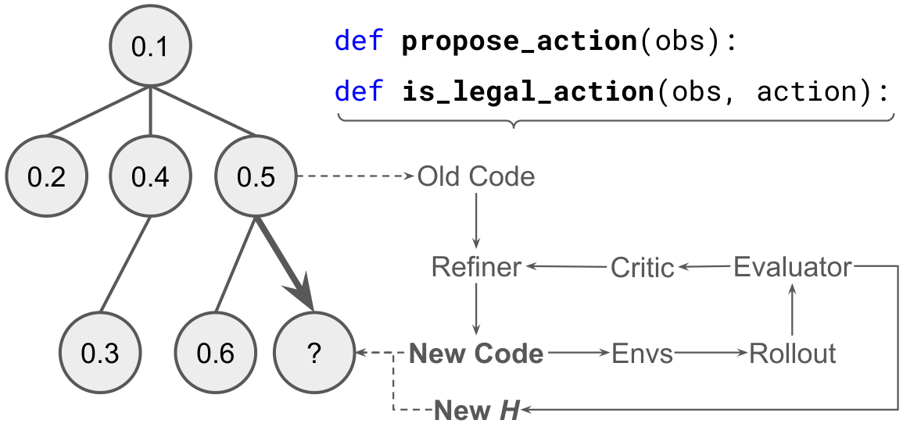
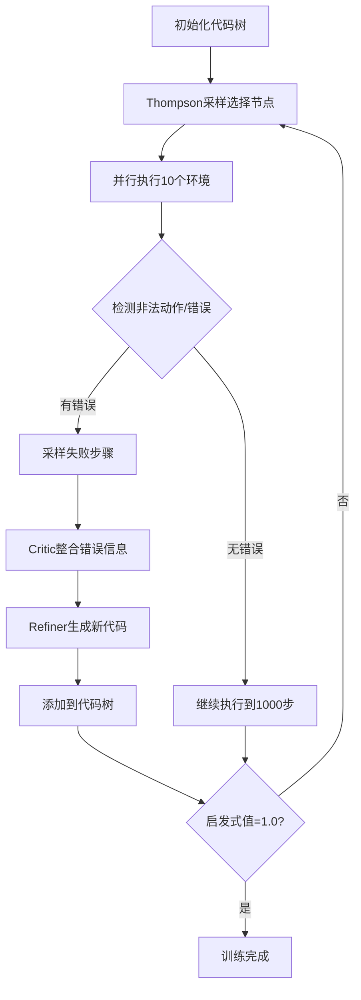
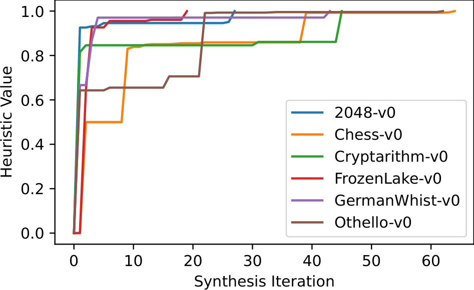
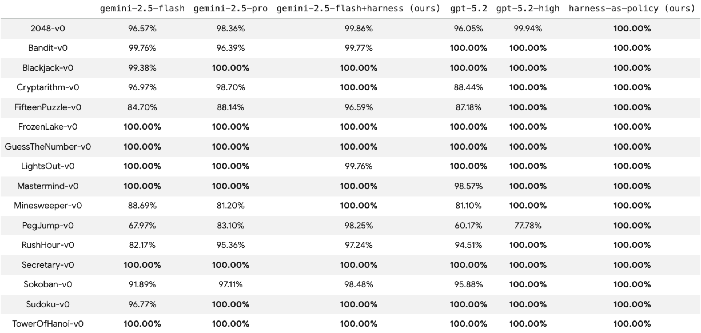
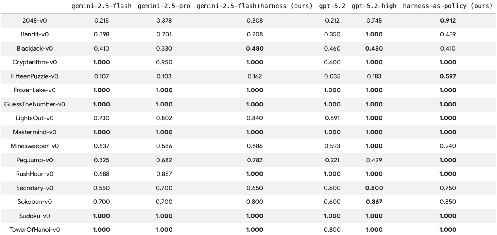
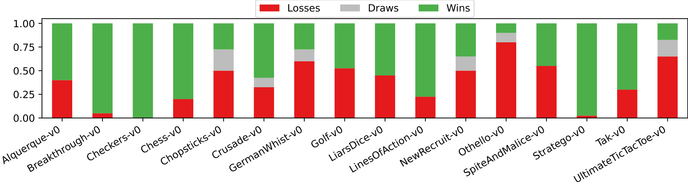
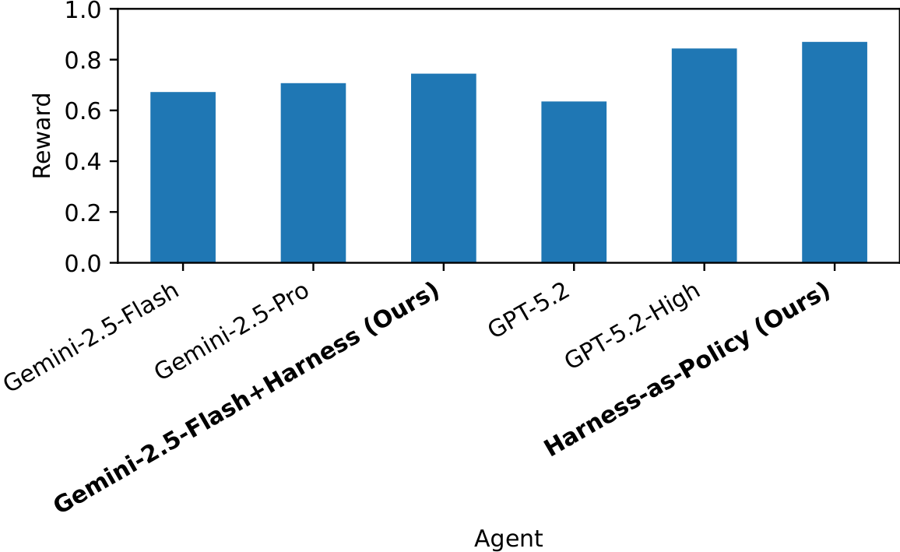
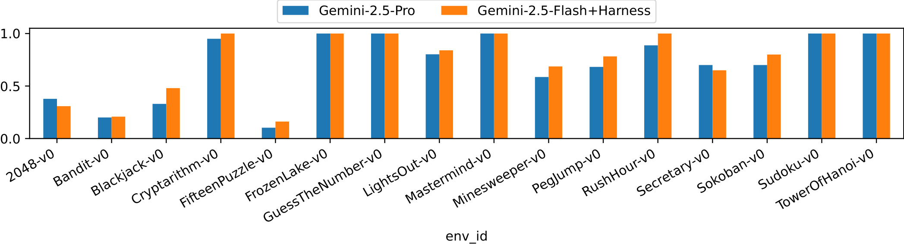

# AutoHarness 论文调研报告

> 基于论文：AutoHarness: improving LLM agents by automatically synthesizing a code harness (arXiv:2603.03329v1, ICLR 2026)

---

## 📋 基本信息

<p align="center"><b>表1：论文基本信息</b></p>

| 项目 | 内容 |
|-----|------|
| 论文标题 | AutoHarness: improving LLM agents by automatically synthesizing a code harness |
| 作者 | Xinghua Lou, Miguel Lázaro-Gredilla, Antoine Dedieu, Carter Wendelken, Wolfgang Lehrach, Kevin P. Murphy |
| 所属机构 | Google DeepMind |
| 发表会议 | ICLR 2026 |
| 提交日期 | 2026年2月10日 |
| 论文链接 | https://arxiv.org/abs/2603.03329 |
| PDF链接 | https://arxiv.org/pdf/2603.03329 |
| 代码仓库 | https://github.com/gyc567/AutoHarness |
| 学科分类 | cs.CL (Computation and Language), cs.AI (Artificial Intelligence) |

---

## 1. 研究背景与动机

### 1.1 问题定义

**核心问题**：大语言模型（LLM）作为智能体使用时，经常尝试执行被外部环境严格禁止的动作，即使这些模型能够理解规则。

**典型案例**：在 Kaggle GameArena 国际象棋比赛中，Gemini-2.5-Flash 模型 78% 的败局归因于非法走法（illegal moves），而非战略失误。这揭示了模型"理解规则"与"遵守规则"之间的矛盾。

**问题本质**：LLM 的概率性推理机制与环境的确定性规则约束之间存在根本性冲突。模型可能知道"马走日"，但在具体决策时仍会产生违规输出。

### 1.2 研究动机

#### 现有解决方案的局限性

| 方法 | 描述 | 缺点 |
|------|------|------|
| **手工编写 Harness** | 通过外部代码限制 LLM 只能输出合法动作 | 需要为每个新环境重新编写代码，成本高、不通用、扩展性差 |
| **微调 LLM** | 让模型学习规则 | 成本高、耗时长，可能损害模型在其他任务上的能力 |
| **提示工程** | 在提示中详细描述规则 | 无法从根本上消除违规风险，依赖模型的不确定推理 |

#### 核心挑战

如何让 LLM 在**不依赖手工规则、不大规模微调**的情况下，**自动且可靠地遵守环境规则**？

### 1.3 研究目标

论文提出 AutoHarness 方法，目标是：

1. **自动化代码约束框架生成**：让 LLM 自动合成用于约束自身行为的代码 Harness
2. **零违规率**：在给定环境中实现 100% 的合法动作率
3. **性能提升**：使较小的模型（如 Gemini-2.5-Flash）能够超越更大的模型（如 Gemini-2.5-Pro、GPT-5.2-High）
4. **成本优化**：在"代码即策略"模式下，推理成本几乎为零

---

## 2. 核心贡献

### 2.1 主要贡献

<p align="center"><b>表2：论文主要贡献</b></p>

| 编号 | 贡献描述 |
|-----|---------|
| C1 | **方法论创新**：提出"Code as Harness"框架，将规则判断从 LLM 的概率性推理转移到确定性执行的代码，无需人工编写规则或微调模型 |
| C2 | **技术架构**：采用树搜索与 Thompson 采样管理多个代码假设，高效探索程序空间，平均 14.5 次迭代即可收敛 |
| C3 | **性能突破**：在 145 个 TextArena 游戏上实现 100% 合法动作率，使较小的 Gemini-2.5-Flash 能够超越更大的 Gemini-2.5-Pro 和 GPT-5.2-High |
| C4 | **成本优化**：代码即策略模式下，推理成本几乎为零，在 16 个单人游戏上平均奖励达到 0.870，超越 GPT-5.2-High 的 0.844 |

### 2.2 创新点

1. **方法创新**：将代码约束框架的生成形式化为程序搜索问题，用 LLM 作为变异算子，基于环境反馈进行迭代精炼
2. **技术创新**：树搜索结构管理多个代码假设，Thompson 采样平衡探索与利用，显著提升搜索效率
3. **实验创新**：在 145 个不同类型游戏上进行全面评估，验证方法的通用性和可扩展性

---

## 3. 方法详解

### 3.1 方法概述

**核心思想**：将规则判断任务从 LLM 的概率性推理中剥离出来，交给确定性执行的代码完成。代码一旦写对就永远不会犯错，LLM 只需专注于在代码划定的合法范围内做决策。

**关键创新**：代码由 LLM 自己生成，通过与环境反复交互、试错迭代，最终自动生成可靠的规则代码。整个过程无需人工编写规则，也无需微调模型。

**类比**：就像给 AI 戴上一个"智能手环"——动作不合规？手环会震动提醒，直到 AI 做出合法选择为止。

### 3.2 整体架构



*Figure 1: AutoHarness 方法架构。展示了代码合成的完整流程：从初始代码假设开始，通过树搜索管理多个候选方案，Thompson 采样选择节点进行精炼，基于环境反馈迭代优化，最终生成可靠的代码 Harness。*

**架构文字描述**：

AutoHarness 的整体架构包含以下核心组件：

1. **代码树（Code Tree）**：维护多个代码假设，每个节点代表一个代码版本。树结构允许同时探索多个不同的代码路径，避免陷入局部最优。

2. **Thompson 采样（Thompson Sampling）**：用于选择下一个要精炼的节点。启发式值（Heuristic Value）为平均合法动作准确率。该算法平衡了探索（尝试不同的代码结构）与利用（精炼已部分工作的代码）。

3. **环境反馈（Environment Feedback）**：执行当前代码，收集非法动作、执行错误等信息。最多采样 5 个失败步骤用于反馈。

4. **Critic 模块**：整合各种类型的错误信息（非法动作、代码执行失败、低奖励等），生成结构化的反馈报告。

5. **Refiner 模块（LLM）**：基于当前代码和 Critic 反馈，生成改进版代码。Refiner 由 Gemini-2.5-Flash 担任。

**数据流**：
- 初始代码 → 环境执行 → 收集错误 → Critic 整合 → Refiner 生成新代码 → 添加到树中 → Thompson 采样选择节点 → 循环

**关键设计决策**：
- 采用树结构而非线性迭代，允许并行探索多个代码假设
- 使用 Thompson 采样而非贪婪选择，避免过早收敛
- 限制反馈样本数量（最多 5 个），控制提示长度

### 3.3 三种 Harness 模式

根据代码在决策流程中的角色，AutoHarness 支持三种不同的 Harness 模式：

#### 模式一：动作过滤器（Harness-as-Action-Filter）

**工作流程**：
1. 代码生成候选合法动作集（调用 `propose_action()` 返回动作列表）
2. LLM 在合法空间内进行策略选择（可能使用 CoT 推理）
3. 执行选中的动作

**特点**：
- 将"生成什么动作"与"动作是否合法"解耦
- LLM 仅在安全区域内决策，不会产生违规操作
- 需要代码能够生成所有合法动作，实现难度中等

**适用场景**：动作空间较大，但合法动作判断相对简单的环境

#### 模式二：动作验证器（Harness-as-Action-Verifier）

**工作流程**：
```python
while True:
    action = LLM.propose_action(observation)
    if is_legal_action(observation, action):
        return action
    else:
        observation = add_warning(observation, "illegal action")
```

**特点**：
- LLM 保持主要决策者角色，代码仅作为后置过滤器
- 实现最简单，是论文的主力方案
- 推理时仍需调用 LLM，成本较高

**适用场景**：快速原型开发，或需要保留 LLM 策略能力的场景

#### 模式三：代码即策略（Harness-as-Policy）

**工作流程**：
```python
action = propose_action(observation)  # 纯代码实现，无需调用 LLM
return action
```

**特点**：
- 代码直接输出动作，推理时不调用 LLM
- 需要代码同时具备规则理解和策略决策能力，实现难度最高
- 推理成本几乎为零，速度极快

**适用场景**：
- 单人游戏（无需推理对手策略）
- 对推理速度和成本敏感的生产环境
- 策略相对确定、可编码的任务

**三种模式对比**：

| 维度 | 动作过滤器 | 动作验证器 | 代码即策略 |
|-----|-----------|-----------|-----------|
| 实现难度 | 中等 | 简单 | 困难 |
| 推理成本 | 中等 | 高 | 极低 |
| 策略灵活性 | 高 | 高 | 中等 |
| 规则可靠性 | 高 | 高 | 高 |
| 适用游戏类型 | 通用 | 通用 | 单人游戏为主 |

### 3.4 训练流程详解

#### 3.4.1 训练参数配置

| 参数 | 值 | 说明 |
|-----|-----|------|
| 并行环境数 | 10 | 同时运行 10 个游戏环境 |
| 每轮最大步数 | 1000 | 每个环境最多执行 1000 步后自动重置 |
| 反馈样本数 | 5 | 每次最多采样 5 个失败步骤 |
| 启发式权重 | 1.0 | Thompson 采样的启发式值权重 |
| 基座模型 | Gemini-2.5-Flash | 用于代码精炼的 LLM |

#### 3.4.2 训练终止条件

- **成功终止**：启发式值（合法动作准确率）达到 1.0
- **超时终止**：达到预设的时间上限

#### 3.4.3 训练流程图



#### 3.4.4 训练效率



*Figure 2: 6 个代表性游戏的训练收敛曲线。横轴为代码精炼次数，纵轴为合法动作率。可以看到大多数游戏在 20-60 次迭代内达到 100% 合法动作率。*

**训练效率统计**：
- **平均迭代次数**：14.5 次
- **快速收敛游戏**：32 个游戏中有 19 个在少于 10 次迭代内完成
- **复杂游戏**：GermanWhist（43次）、Cryptarithm（45次）、Othello（62次）、Chess（64次）

### 3.5 代码精炼机制

#### 3.5.1 Critic 模块

Critic 负责整合以下类型的错误信息：

1. **非法动作错误**：代码返回 True 但实际动作非法
2. **错误拒绝**：代码返回 False 但动作实际合法
3. **代码执行错误**：Python 异常（如 IndexError、TypeError 等）
4. **低奖励反馈**：在 Harness-as-Policy 模式下的奖励信号

#### 3.5.2 Refiner 提示词

Refiner 接收以下信息：

```
游戏名称：{name}
游戏描述：{description}
动作空间描述：{action_space}
失败案例与反馈：{tasks_with_feedback}
当前代码：{code}
函数签名：{code_signatures}
```

**Refiner 任务清单**（来自提示词）：
1. 逐步思考代码、游戏板和错误反馈
2. 推理每个动作的失败步骤
3. 推理可以修复失败步骤的代码改进
4. 推理整个动作序列的进度值（0-1）
5. 推理可以提升游戏进度的代码改进
6. 推理避免陷入循环的代码改进
7. 确保新代码满足所有观察到的游戏板
8. 确保新代码修复所有当前错误
9. 只生成安全可执行的代码
10. 代码简洁精确

### 3.6 关键技术细节

#### 3.6.1 Thompson 采样算法

Thompson 采样用于平衡探索与利用：

$$\text{score}(n) = \text{sample}(\text{Beta}(\alpha_n, \beta_n))$$

其中：
- $\alpha_n = H_n \times w + 1$（成功次数 + 平滑项）
- $\beta_n = (1 - H_n) \times w + 1$（失败次数 + 平滑项）
- $H_n$ 是节点 $n$ 的启发式值（合法动作准确率）
- $w$ 是启发式权重（论文设为 1.0）

**采样策略**：每次选择得分最高的节点进行精炼。

#### 3.6.2 启发式值设计

**Harness-as-Action-Verifier 模式**：
$$H = \frac{\text{合法动作数}}{\text{总动作数}}$$

**Harness-as-Policy 模式**：
$$H = \begin{cases} 0.0 & \text{如果非法动作} \\ 0.5 + 0.5 \times r & \text{否则} \end{cases}$$

其中 $r \in [0.0, 1.0]$ 是环境奖励（稀疏奖励，仅轨迹结束时获得）。

#### 3.6.3 增量式学习

每次精炼生成的新代码添加到树中作为新节点，而不是替换原节点。这允许：
- 保留历史代码作为回退选项
- 并行探索多个代码路径
- 从失败的尝试中恢复

### 3.7 方法设计的关键洞察

1. **确定性代码 vs 概率性推理**：代码一旦正确就永远不会犯错，而 LLM 的概率性推理始终存在不确定性。将规则判断交给代码，LLM 专注策略选择，是更可靠的分工。

2. **环境反馈驱动**：无需人工标注，完全依赖环境反馈（合法/非法、奖励）进行学习。这使方法具有高度通用性。

3. **树搜索 + Thompson 采样**：树结构允许并行探索，Thompson 采样平衡探索与利用。相比线性迭代，这种方法更不容易陷入局部最优。

4. **小模型 + 代码约束 > 大模型**：在特定任务上，一个"懂规则的小模型 + 代码安全带"可以战胜一个"懂很多但经常犯规的大模型"。大模型的"聪明"会被低级规则错误所抵消。

### 3.8 与现有方法的核心区别

<p align="center"><b>表3：与现有方法的对比</b></p>

| 环节 | 传统方法 | AutoHarness | 改变原因 |
|-----|---------|------------|---------|
| **规则获取** | 人工编写或微调模型 | LLM 自动生成代码 | 降低成本、提升通用性 |
| **决策方式** | LLM 直接输出动作 | 代码约束 + LLM 策略选择 | 消除违规风险 |
| **错误处理** | 依赖 LLM 自我修正 | 基于环境反馈的确定性修正 | 提升可靠性 |
| **搜索策略** | 单路径迭代或大规模采样 | 树搜索 + Thompson 采样 | 平衡探索与利用 |
| **推理成本** | 每次都调用 LLM | 可选择代码即策略模式 | 推理成本几乎为零 |

---

## 4. 代码实现分析

### 4.1 代码仓库概述

<p align="center"><b>表4：代码仓库信息</b></p>

| 项目 | 内容 |
|-----|------|
| 仓库地址 | https://github.com/gyc567/AutoHarness |
| 主要语言 | Rust (93.1%) |
| 其他语言 | Shell (6.4%), Batchfile (0.5%) |
| 创建时间 | 2026-03-21 |
| 最后更新 | 2026-04-26 |
| Stars | 9 |
| Forks | 1 |
| 开源协议 | 无明确声明 |

**注意**：论文中展示的实验代码为 Python 实现，而 GitHub 仓库为 Rust 重构版本，可能是为了提升性能和安全性。

### 4.2 论文示例代码分析

论文附录提供了两个代表性游戏的 Harness 代码示例。

#### 4.2.1 Minesweeper-v0 示例

**策略概述**：
1. **第一步**：如果所有格子都未揭开，选择中心位置开始
2. **逻辑推理**：根据数字推断确定的安全格子和地雷位置
3. **概率启发式**：无法确定时，计算每个格子的地雷概率，选择风险最低的

**关键代码结构**：
```python
def propose_action(board: str) -> str:
    # 1. 解析棋盘
    grid = parse_board_to_grid(board)

    # 2. 第一步策略
    if all_cells_unrevealed:
        return center_position

    # 3. 逻辑推理
    # Rule A: 推断地雷
    # Rule B: 推断安全格子
    # 高级规则：子集推理
    propagate_deductions()

    # 4. 选择安全格子
    if safe_to_reveal:
        return random.choice(safe_to_reveal)

    # 5. 概率启发式猜测
    return min_risk_cell
```

**代码特点**：
- 完整实现了扫雷游戏的策略，包括高级逻辑推理
- 代码长度约 200 行，展示了复杂策略的可编码性
- 无需调用 LLM，推理成本为零

#### 4.2.2 Chess-v0 示例

**关键函数**：

```python
def _to_uci_coord(row: int, col: int) -> str:
    """将网格坐标转为 UCI 字符串（如 'e2'）"""
    file_char = chr(ord('a') + col)
    rank_char = str(8 - row)
    return file_char + rank_char

def _find_king(grid: list, king_color: str) -> tuple:
    """查找指定颜色的国王位置"""
    for r in range(8):
        for c in range(8):
            piece = grid[r][c]
            if (king_color == 'w' and piece == 'K') or \
               (king_color == 'b' and piece == 'k'):
                return r, c
    return None

def _is_square_attacked(grid: list, r: int, c: int, by_white: bool) -> bool:
    """检查格子 (r, c) 是否被指定颜色的棋子攻击"""
    # 检查兵、马、王、车、后、象的攻击
    # ...
```

**代码特点**：
- 实现了国际象棋的关键规则判断（移动合法性、将军检测）
- UCI 格式解析和生成
- 攻击检测（用于判断移动是否导致己方被将军）

### 4.3 核心模块映射

| 论文概念 | 代码实现 | 说明 |
|---------|---------|------|
| `propose_action()` | 建议动作函数 | 根据游戏状态提议一个动作 |
| `is_legal_action()` | 合法性校验函数 | 判断动作是否合法 |
| Thompson 采样 | 树搜索节点选择策略 | 平衡探索与利用 |
| Critic | 错误信息整合模块 | 整合非法动作、执行错误等反馈 |
| Refiner | LLM 代码精炼 | 基于反馈生成改进版代码 |

### 4.4 GitHub 仓库项目结构

```
AutoHarness/
├── .gitignore          # Git 忽略配置
├── AGENTS.md           # Agent 说明文档
├── Cargo.lock          # Rust 依赖锁定文件
├── Cargo.toml          # Rust 项目配置
├── README.md           # 英文 README
├── README_zh-CN.md     # 中文 README
├── TUTORIAL.md         # 英文教程
├── TUTORIAL_zh-CN.md   # 中文教程
├── autoharness.toml    # 配置文件
├── benches/            # 性能基准测试
├── examples/           # 示例代码
├── install/            # 安装脚本
└── memory/             # 内存相关模块
```

### 4.5 代码质量评估

<p align="center"><b>表5：代码质量评估</b></p>

| 维度 | 评分 | 说明 |
|-----|------|------|
| 模块化 | ⭐⭐⭐⭐ | 论文示例代码结构清晰，函数职责单一 |
| 可配置性 | ⭐⭐⭐⭐ | 支持三种 Harness 模式，参数可调 |
| 可扩展性 | ⭐⭐⭐⭐ | 架构设计支持添加新游戏和新的搜索策略 |
| 文档 | ⭐⭐⭐ | 论文附录有代码注释，但 GitHub 仓库文档较少 |
| 测试 | ⭐⭐ | 论文未提及单元测试 |

### 4.6 复现指南

**环境要求**（论文实验）：
- Python 3.x
- TextArena 环境
- Gemini-2.5-Flash API 访问权限

**基本流程**：
1. 定义游戏环境（TextArena）
2. 初始化代码树和初始代码模板
3. 启动训练循环
4. 达到 100% 合法动作率后停止
5. 评估生成的 Harness

**关键提示词**：见论文附录 prompts.tex

---

## 5. 实验分析

### 5.1 实验设置

#### 5.1.1 数据集

**平台**：TextArena（大型文本游戏集合）

**游戏数量**：145 个游戏（移除 9 个自由文本对话游戏）

**游戏类型**：

| 游戏类型 | 数量 | 示例 |
|---------|------|------|
| 单人游戏（1P） | 多种 | 2048、扫雷、数独、推箱子、汉诺塔 |
| 双人游戏（2P） | 多种 | 国际象棋、黑白棋、跳棋、扑克 |

**难度增强**：手动移除了游戏观测中的"合法动作列表"提示，迫使智能体必须从环境反馈中推断合法动作。

#### 5.1.2 评估指标

<p align="center"><b>表6：评估指标</b></p>

| 指标 | 定义 | 计算方式 |
|-----|-----|---------|
| 合法动作率 | 生成的合法动作比例 | 合法动作数 / 总动作数 |
| 平均奖励 | 归一化得分 | 最终奖励（范围 0-1） |
| 胜率 | 双人游戏中的获胜比例 | 获胜场次 / 总场次 |
| 迭代次数 | 训练所需的代码精炼次数 | 树搜索迭代轮数 |

#### 5.1.3 基线模型

| 模型 | 类型 | 说明 |
|-----|------|------|
| Gemini-2.5-Flash | 小型模型 | 训练基座，AutoHarness 的代码生成器 |
| Gemini-2.5-Pro | 大型模型 | 更强的推理能力，更高的成本 |
| GPT-5.2 | 对比模型 | 无思考模式 |
| GPT-5.2-High | 对比模型 | 高思考模式，最强基线 |

#### 5.1.4 实现细节

- **硬件环境**：未明确说明
- **训练时间**：平均每个游戏约 14.5 次迭代
- **评估次数**：
  - 单人游戏：每个游戏 20 次
  - 双人游戏：每个游戏 40 次（均分先后手）
  - GPT-5.2：10 次（成本考虑）
  - GPT-5.2-High：5 次（成本考虑，约 $640）

### 5.2 主实验结果

#### 5.2.1 合法动作率

**结果**：在全部 145 个游戏中，AutoHarness 实现了 **100% 的合法动作率**。



*Figure 3: 16 个单人游戏的合法动作率详情。所有游戏均达到 100%。*



*Figure 4: 16 个单人游戏的平均奖励对比。AutoHarness（蓝）vs Gemini-2.5-Pro（红）。*

**训练效率**：
- 平均迭代次数：14.5 次
- 快速收敛游戏：19/32 个游戏在少于 10 次迭代内完成
- 复杂游戏：GermanWhist（43次）、Cryptarithm（45次）、Othello（62次）、Chess（64次）

#### 5.2.2 双人游戏对战结果



*Figure 5: Gemini-2.5-Flash + AutoHarness vs Gemini-2.5-Pro 的 16 个双人游戏对战结果。AutoHarness 在 9/16 个游戏中获胜，总体胜率 56.3%。*

**对战结果统计**：

| 对战对手 | 胜率 | 获胜游戏数 |
|----------|------|-----------|
| vs Gemini-2.5-Pro | **56.3%** | 9/16 款游戏 |
| vs 原生 Gemini-2.5-Flash | **64.8%** | 12/16 款游戏 |

**关键洞察**：
- 小模型 + 代码约束能够战胜更大的模型
- 代码约束消除了违规操作导致的失分
- 策略能力仍然保留在 LLM 中

#### 5.2.3 代码即策略结果



*Figure 6: 16 个单人游戏的平均奖励对比。Harness-as-Policy（纯代码策略）达到 0.870，超越所有对比方法。*

**性能对比**：

| 方法 | 16 款单人游戏平均奖励 | 推理成本 |
|------|---------------------|---------|
| **AutoHarness (代码策略)** | **0.870** | 几乎为零 |
| GPT-5.2-High | 0.844 | 很高（约 $640） |
| Gemini-2.5-Pro | 0.707 | 较高 |
| GPT-5.2 (无思考) | 0.635 | 较高 |

**训练细节**：
- 训练迭代上限：256 次
- 平均完成迭代：89.4 次
- 启发式值达到：0.939

**单游戏层面**：
- AutoHarness 获胜：3/16 款游戏
- GPT-5.2-High 获胜：5/16 款游戏
- 战平：8/16 款游戏

**成本对比**：
- AutoHarness：训练后推理成本几乎为零（纯 Python 代码执行）
- GPT-5.2-High：约 $640（5 次评估）



*Figure 7: 16 个单人游戏的详细奖励对比。*

### 5.3 消融实验

论文未提供详细的消融实验，但可以分析以下关键因素：

**隐含消融分析**：

| 消融项 | 影响 | 证据 |
|-------|------|------|
| 无代码约束 | 78% 败局来自非法动作 | Kaggle GameArena 国际象棋比赛数据 |
| 无树搜索 | 可能陷入局部最优 | 论文采用树结构而非线性迭代 |
| 无 Thompson 采样 | 探索效率降低 | 论文强调 Thompson 采样的重要性 |

### 5.4 分析与讨论

#### 5.4.1 为什么小模型 + 代码约束能战胜大模型？

1. **消除低级错误**：大模型的"聪明"会被低级规则错误所抵消。一步非法动作可能毁掉整盘好局。

2. **稳定的规则遵守**：代码约束确保每一步都合法，小模型虽然"想得浅"，但每一步都走得规范。

3. **专注策略选择**：LLM 只需在合法空间内做策略选择，无需同时处理规则推理。

#### 5.4.2 代码即策略为什么能超越 GPT-5.2-High？

1. **无推理成本**：训练完成后，运行时不调用 LLM，零延迟、零成本。

2. **确定性策略**：纯代码策略避免了 LLM 的随机性，策略更稳定。

3. **领域特化**：代码是针对特定游戏训练的，相比通用 LLM 有领域优势。

#### 5.4.3 为什么双人游戏难以实现代码即策略？

论文指出，双人游戏需要：
- 理解对手策略
- 搜索算法（如 MCTS）
- 世界模型（预测对手行为）

这需要代码同时具备：
1. 游戏规则理解
2. 对手建模
3. 搜索算法

复杂度大幅提升，目前仍具挑战性。

### 5.5 实验结果总体分析

**实验验证的逻辑链条**：

1. **现象验证**：Kaggle GameArena 数据显示 LLM 智能体存在严重的违规问题（78% 败局来自非法动作）。

2. **方法验证**：AutoHarness 在 145 个游戏上实现 100% 合法动作率，证明了方法的有效性。

3. **性能验证**：
   - 双人游戏：小模型 + AutoHarness 战胜大模型
   - 单人游戏：代码即策略超越 GPT-5.2-High

4. **成本验证**：代码即策略模式下，推理成本几乎为零。

**核心结论**：
- "小模型 + 自动代码合成"可以超越"大模型直接推理"
- 代码约束是提升 LLM 智能体可靠性的有效手段
- 自动化代码生成避免了人工编写规则的高成本

**适用边界**：
- 适用于规则明确、可编码的环境
- 代码即策略模式更适合单人游戏
- 需要环境能够提供清晰的反馈信号

---

## 6. 相关工作

### 6.1 相关工作列表

<p align="center"><b>表7：相关工作列表</b></p>

| 论文/方法 | 年份 | 核心思想 | 与本文关系 |
|----------|-----|---------|-----------|
| Reflexion (Shinn et al.) | 2023 | LLM 反思失败日志，迭代改进 | 本文采用类似的迭代精炼思想，但用于代码生成 |
| Voyager (Wang et al.) | 2023 | LLM 持续学习 Minecraft 技能，存储代码库 | 本文的代码即策略思想的先驱 |
| Code as Policies (Liang et al.) | 2023 | 将机器人控制形式化为代码生成 | 本文的 Harness-as-Policy 的理论基础 |
| Eureka (Ma et al.) | 2024 | LLM 进化搜索生成奖励函数 | 本文的树搜索思想类似 |
| AlphaCode (Li et al.) | 2022 | 大规模采样和过滤生成竞赛代码 | 本文的代码搜索策略对比 |
| AlphaEvolve (Novikov et al.) | 2025 | LLM 作为变异算子的进化算法 | 本文的方法论基础 |
| Tree of Thoughts (Yao et al.) | 2023 | 搜索期间的树状思维推理 | 本文的树搜索结构对比 |
| Thompson Sampling for Code (Tang et al.) | 2024 | Thompson 采样用于代码搜索 | 本文直接采用的方法 |

### 6.2 本文与相关工作的区别

**相比 Reflexion**：
- Reflexion：语言反思 → 迭代提示
- AutoHarness：环境反馈 → 代码迭代 → 确定性约束

**相比 Voyager**：
- Voyager：学习技能库，运行时仍调用 LLM
- AutoHarness：可生成完全独立的代码策略，运行时无需 LLM

**相比 Code as Policies**：
- Code as Policies：一次性生成机器人控制代码
- AutoHarness：迭代精炼 + 树搜索，更适应复杂环境

**相比 AlphaEvolve**：
- AlphaEvolve：离线进化整个代码库
- AutoHarness：在线多轮学习，实时环境反馈

---

## 7. 局限性分析

### 7.1 论文声明的局限性

1. **双人游戏的代码即策略**：目前难以实现，需要同时学习世界模型和搜索算法。

2. **游戏特异性**：每个游戏需要单独训练一个 Harness，尚未实现跨游戏迁移。

3. **复杂策略**：对于需要深度推理的策略，纯代码可能难以编码。

### 7.2 发现的潜在问题

<p align="center"><b>表8：潜在问题分析</b></p>

| 问题类型 | 描述 | 影响 |
|---------|-----|------|
| 方法层面 | 需要环境提供清晰的反馈信号（合法/非法） | 不适用于反馈模糊的环境 |
| 方法层面 | 代码生成依赖 LLM 的编程能力 | 编程能力弱的模型可能难以生成正确代码 |
| 实验层面 | 未在非游戏环境测试 | 通用性有待进一步验证 |
| 实验层面 | 未与强化学习方法对比 | 相对 RL 方法的优势不明确 |
| 应用层面 | 需要训练时间（平均 14.5 次迭代） | 不适用于零样本场景 |
| 应用层面 | 代码即策略不支持双人游戏 | 应用范围受限 |

### 7.3 未来工作方向

论文提出的未来工作：

1. **知识蒸馏**：将领域特定的专家 Harness 蒸馏回基座 LLM，实现递归自我改进。

2. **可复用 Harness 库**：构建跨游戏的代码组件库，提升迁移能力。

3. **多模态游戏**：扩展到 Craftax、Terra Nova 等更复杂的多模态环境。

4. **长期学习**：扩展到终身学习范式，解决超长时域游戏。

---

## 8. 个人评价

### 8.1 优点

1. **问题定义精准**：准确识别了 LLM 智能体"理解规则但不遵守规则"的核心矛盾。

2. **方法设计优雅**：将规则判断从概率性推理转移到确定性代码，分工明确，逻辑清晰。

3. **实验充分**：145 个游戏的全面评估，验证了方法的通用性。

4. **性能突破显著**：小模型战胜大模型，代码即策略超越 GPT-5.2-High，结果令人印象深刻。

5. **实用价值高**：代码即策略模式下的零成本推理，对生产环境非常有吸引力。

### 8.2 不足

1. **通用性验证不足**：仅在游戏环境测试，未在真实世界任务（如软件工程、机器人控制）验证。

2. **对比实验不完整**：未与强化学习、传统规划算法等方法对比。

3. **双人游戏限制**：代码即策略模式不支持双人游戏，限制了应用范围。

4. **代码生成依赖**：方法效果依赖于 LLM 的编程能力，对编程能力弱的模型可能效果不佳。

5. **训练成本未量化**：未报告训练过程中的 LLM API 调用成本。

### 8.3 适用场景

**推荐使用场景**：
- 规则明确、可编码的环境（游戏、表格操作、API 调用）
- 对违规操作零容忍的场景（金融交易、医疗诊断辅助）
- 需要高可靠性、低延迟的生产环境（代码即策略模式）
- 成本敏感的应用（训练后推理成本几乎为零）

**不推荐使用场景**：
- 规则模糊、难以编码的环境（开放域对话、创意写作）
- 需要零样本推理的场景（训练需要时间和成本）
- 双人博弈或多人博弈（代码即策略模式不支持）
- 需要复杂推理和规划的任务（代码难以编码高阶策略）

---

## 9. 启发与思考

### 9.1 技术启发

1. **确定性代码 + 概率性推理**：这是一个强大的组合模式。将规则、约束等确定性任务交给代码，将策略、创意等概率性任务交给 LLM，发挥各自优势。

2. **环境反馈驱动学习**：无需人工标注，完全依赖环境反馈进行学习，是构建通用智能体的重要方向。

3. **树搜索 + Thompson 采样**：在程序搜索中，树结构允许并行探索，Thompson 采样平衡探索与利用，比线性迭代更高效。

4. **小模型 + 特化工具 > 大模型**：在特定领域，小模型配合特化工具可以超越通用大模型。这提示我们关注工具增强而非单纯追求模型规模。

### 9.2 可借鉴之处

1. **LLM 智能体工程化**：与其期望 LLM 完美遵守规则，不如通过外部代码约束确保合规性。这是工程实践的重要启示。

2. **代码即策略范式**：训练 LLM 生成可独立运行的代码，而非在运行时调用 LLM。这可以大幅降低推理成本和延迟。

3. **迭代精炼框架**：Critic-Refiner 的迭代精炼框架可应用于其他代码生成任务，如测试驱动开发、代码审查等。

4. **领域特化 vs 通用能力**：AutoHarness 展示了领域特化的价值。在构建 AI 系统时，应该权衡通用能力与领域特化。

### 9.3 潜在改进方向

1. **跨游戏迁移学习**：
   - 构建游戏类型的抽象层级（棋类、纸牌类、益智类）
   - 设计跨游戏的 Harness 模板
   - 利用迁移学习减少新游戏的训练时间

2. **双人游戏的代码即策略**：
   - 引入对手建模模块
   - 集成 MCTS 或 AlphaZero 风格的搜索
   - 学习游戏的世界模型

3. **非游戏环境扩展**：
   - 软件工程：自动生成代码约束（类型检查、API 调用规范）
   - 机器人控制：生成安全的动作约束
   - 数据分析：生成数据验证和清洗代码

4. **与强化学习结合**：
   - RL 提供策略优化，AutoHarness 提供规则约束
   - 结合 Model-based RL 的世界模型学习

5. **在线学习与适应**：
   - 支持环境规则变化时的快速适应
   - 增量式更新 Harness 而非重新训练

### 9.4 后续行动

- [ ] 深入阅读 Thompson Sampling for Code (Tang et al., 2024) 论文
- [ ] 尝试在非游戏环境（如 API 调用、数据处理）复现方法
- [ ] 探索跨游戏迁移学习的可能性
- [ ] 对比 AutoHarness 与强化学习方法（如 PPO）的性能和成本
- [ ] 研究如何将 Harness 蒸馏回 LLM（论文提出的未来方向）

---

## 参考文献

> 论文中引用的关键文献

```bibtex
@article{lou2026autoharness,
  title={AutoHarness: improving LLM agents by automatically synthesizing a code harness},
  author={Lou, Xinghua and L\'azaro-Gredilla, Miguel and Dedieu, Antoine and Wendelken, Carter and Lehrach, Wolfgang and Murphy, Kevin P.},
  journal={arXiv preprint arXiv:2603.03329},
  year={2026}
}

@inproceedings{tang2024code,
  title={Code Search with Thompson Sampling},
  author={Tang, et al.},
  year={2024}
}

@inproceedings{shinn2023reflexion,
  title={Reflexion: Language Agents with Verbal Reinforcement Learning},
  author={Shinn, Noah and Cassano, Federico and others},
  booktitle={NeurIPS},
  year={2023}
}

@inproceedings{wang2023voyager,
  title={Voyager: An Open-Ended Embodied Agent with Large Language Models},
  author={Wang, Guanzhi and others},
  booktitle={NeurIPS},
  year={2023}
}

@inproceedings{liang2023code,
  title={Code as Policies: Language Model Programs for Embodied Control},
  author={Liang, Jacky and others},
  booktitle={ICRA},
  year={2023}
}
```

---

## 附录

### A. 关键图表索引

<p align="center"><b>表9：关键图表索引</b></p>

| Figure | 描述 | 报告内位置 |
|--------|------|-----------|
| Figure 1 | AutoHarness 方法架构 | Section 3.2 |
| Figure 2 | 训练收敛曲线 | Section 3.4.4 |
| Figure 3 | 单人游戏合法动作率分解 | Section 5.2.1 |
| Figure 4 | 单人游戏奖励分解 | Section 5.2.1 |
| Figure 5 | 双人游戏对战结果 | Section 5.2.2 |
| Figure 6 | 代码即策略性能对比 | Section 5.2.3 |
| Figure 7 | 单人游戏奖励曲线 | Section 5.2.3 |

### B. 流程图索引

<p align="center"><b>表10：Mermaid 流程图索引</b></p>

| 图表 | 描述 | 报告内位置 |
|------|------|-----------|
| 训练流程图 | AutoHarness 训练的完整流程 | Section 3.4.3 |

### C. 参考资料来源

- 论文原文：arXiv:2603.03329
- 代码仓库：https://github.com/gyc567/AutoHarness
- 微信文章1：ICLR 2026 | AutoHarness：使用高代码为 LLM Agent 增加强反馈（Coggle数据科学）
- 微信文章2：145种游戏中合法动作率100%！DeepMind新方法AutoHarness（智猩猩AI）

### D. 调研信息

- 调研人：Claude (Anthropic)
- 调研时间：2026-06-16
- 论文版本：arXiv:2603.03329v1
- 参考来源：论文原文、GitHub 仓库、微信公众号文章

---

*报告版本: v1.0*
*生成时间: 2026-06-16*
