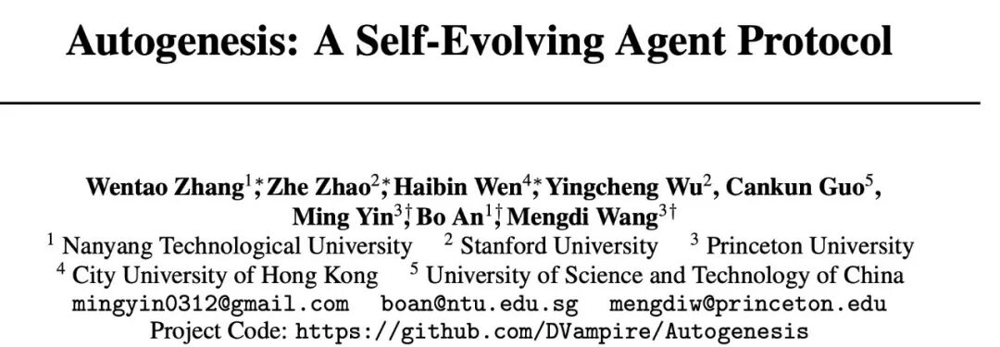
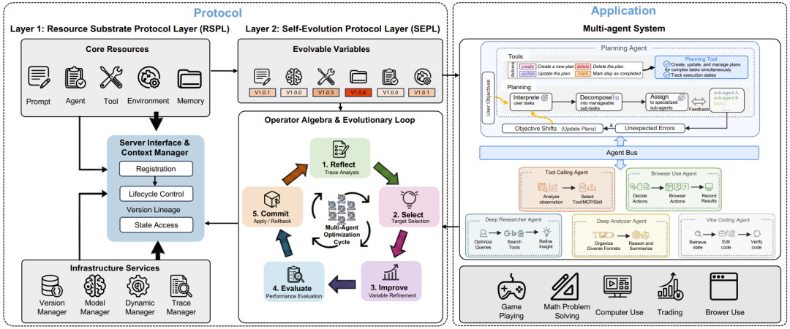
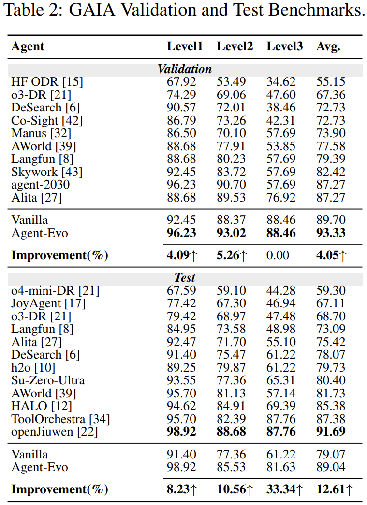
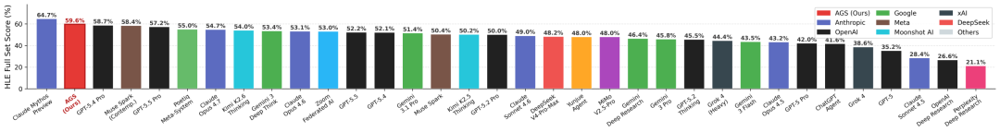
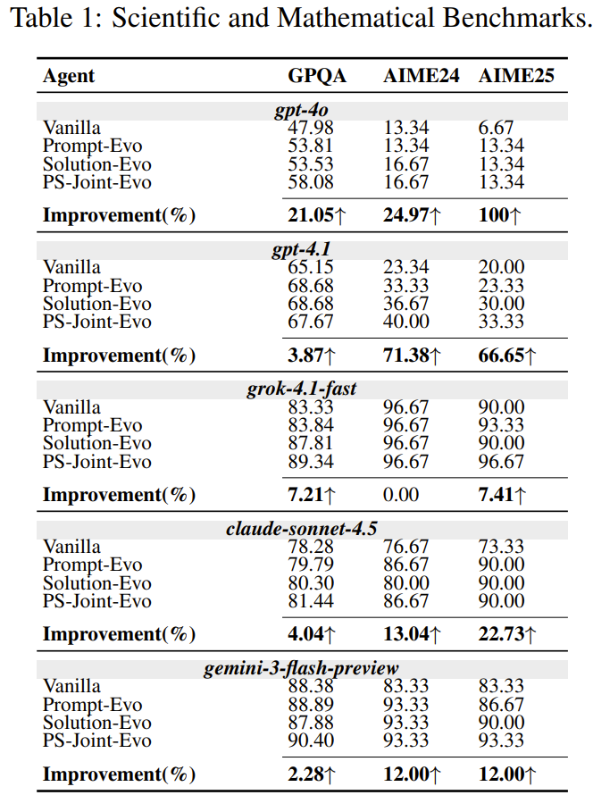
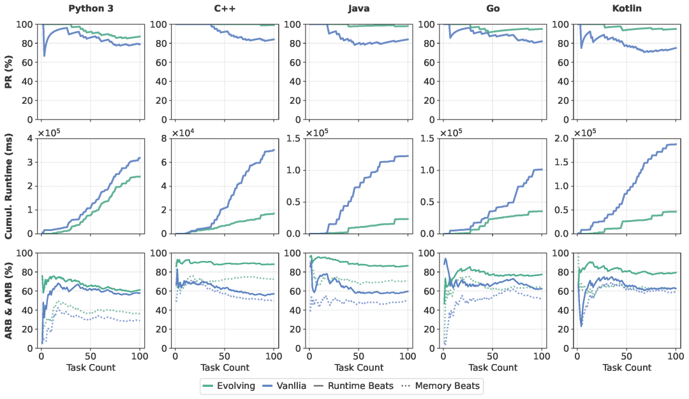
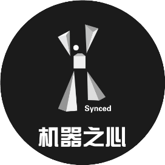

# LeetCode C++近满分！Autogenesis要给智能体装上「自进化操作系统」

Source: https://mp.weixin.qq.com/s/nQXjwCTJIuaQEi6EQpVNIg

# LeetCode C++近满分！Autogenesis要给智能体装上「自进化操作系统」

[机器之心](javascript:void(0);)

在小说阅读器读本章

去阅读

在小说阅读器中沉浸阅读

大模型智能体正在快速演进。从工具调用、网页浏览、多智能体协作，到 MCP、A2A 等协议的出现，Agent 系统似乎已经拥有了越来越强的外部连接能力。

但一个核心问题仍然悬而未决：如果智能体不仅要调用工具，还要在运行过程中安全地修改自己、优化自己、进化自己，现有协议真的够用吗？

近日，来自南洋理工大学、斯坦福大学和普林斯顿大学等机构的一个联合团队提出了一个面向智能体自我进化的双层协议架构 Autogenesis Protocol（AGP），并基于该协议构建了 Autogenesis System（AGS）。

AGS 可以在执行任务过程中动态注册、检索、修改和复用智能体内部资源，包括 Prompt、Agent、Tool、Environment 和 Memory，实现可追踪、可回滚、可审计的闭环自进化。

* 论文标题：Autogenesis: A Self-Evolving Agent Protocol
* 论文链接：https://arxiv.org/abs/2604.15034
* GitHub：https://github.com/DVampire/Autogenesis

本文第一作者是南洋理工大学张文涛，斯坦福大学赵哲和香港城市大学温海斌，主要研究方向包括智能体自进化、强化学习，大语言模型等，通讯作者为普林斯顿大学王梦迪教授，南洋理工大学安波教授和普林斯顿大学尹明研究员。

从 “会用工具” 到 “会进化自己”

当前的智能体系统已经具备较强的任务执行能力，但很多系统仍然高度依赖事先预定好的工具、固定的工作流等。

这带来了三个关键问题：

第一，系统组件高度耦合。Prompt、工具、记忆、环境和 Agent 逻辑通常被写死在同一个框架中。一旦任务变化，系统往往需要人工修改代码或重写工作流。

第二，缺少生命周期和版本管理。智能体如果在运行过程中修改 Prompt、工具代码或记忆内容，如何知道智能体到底改了什么？为什么改？改坏了能不能回滚？

第三，自进化仍然偏 “经验主义”。很多系统所谓的自我改进，本质上是让模型反思一下、改一下 Prompt 或代码。但这种改动缺乏统一接口、缺乏审计机制，也难以复现和安全扩展。

换句话说，现有智能体生态已经有了 “连接协议”，但还缺少真正面向自进化的协议。

核心理念

把 “什么能进化” 和 “如何进化” 解耦

Autogenesis Protocol（AGP）的核心设计非常清晰：

将自进化拆成两层：

1. Resource Substrate Protocol Layer（RSPL）资源基底协议层负责定义 “什么东西可以被进化”。
2. Self-Evolution Protocol Layer（SEPL）自进化协议层则负责定义 “如何安全地进化”。

过去的智能体系统往往把 Prompt、工具、Agent 代码、记忆和环境直接混在执行逻辑里。AGP 则把它们全部抽象成协议注册资源，并为每个资源配备显式状态、生命周期、版本接口和可演化标记。论文将五类资源作为 RSPL 的核心实体：Prompt、Agent、Tool/MCP/Skill、Environment、Memory。

也就是说，在 AGP 中，这些智能体的必要组件都变成了可以被注册、检索、更新、回滚和审计的协议级资源。

这让智能体系统从 “代码工程” 迈向了 “资源治理”。

RSPL：让智能体内部资源变得可管理、可复用、可回滚

在 Autogenesis 中，RSPL 相当于智能体自进化的 “操作系统底座”。

它为每类资源提供统一的上下文管理器和服务接口，支持注册、调用、版本管理、回滚、合约生成、执行追踪等操作。

论文中强调，RSPL 的资源本身是 “被动” 的：它们不会自己偷偷修改自己。所有状态变化都必须通过更高层的 SEPL 接口完成。这样一来，系统既能进化，又不会变成不可控的黑箱。

这也是 AGP 区别于普通工具协议的关键：它不是只让模型 “调用工具”，而是让整个智能体系统的内部组件都进入可治理、可审计、可演化的状态。

SEPL：把自我改进变成闭环控制

如果说 RSPL 定义了 “哪些资源可以进化”，那么 SEPL 就定义了 “进化应该遵循怎样的标准”。

Autogenesis 将自进化形式化为一个闭环操作流程：

Reflect → Select → Improve → Evaluate → Commit

更重要的是，每一次修改都不是直接写进系统，而是通过 RSPL 的版本化接口完成。也就是说，Autogenesis 的自进化不是一句 “请你改进自己” 的 Prompt，生成的不是一个简陋的 patch, 而是一套可组合、可追踪、可回滚的协议操作。

此外，SEPL 并不绑定某一种优化方法。Reflection Optimizer、TextGrad、Reinforce++、GRPO 等不同优化策略，都可以被映射到同一个 SEPL 操作接口中。

这意味着 AGP 不只是一个系统实现，而更像是一个面向未来自进化 Agent 的通用协议框架。

AGS：基于 AGP 构建的自进化多智能体系统

在协议之上，论文还进一步构建了一个多智能体系统 Autogenesis System（AGS）。

AGS 是一个自进化多智能体系统，Planning Agent 和多个子智能体都作为一等参与者注册，通过标准化消息进行通信。这样每个智能体都可以被替换、更新或进化，而不会破坏整个系统。

AGS 中包含多个典型子智能体，包括 Planning Agent，Deep Researcher Agent，Browser-use Agent ，Deep Analyzer Agent，Vibe Coding Agent

AGS 的工作流可以概括为：先规划，再并行执行；边执行，边记录轨迹；发现失败后触发自进化；进化成功后，新能力立刻进入资源注册表，并被后续任务复用。

性能突破：GAIA Validation 达到 93.33%

重新刷新通用智能体上限

在 GAIA 基准测试中，AGS 展现出非常强的通用任务解决能力。论文报告显示，在 GAIA Validation 上，AGS 的 Agent-Evo 版本达到 93.33% 平均准确率；在 GAIA Test 上达到 89.04%，相比 Vanilla baseline 的 79.07% 提升了 12.61%。其中 Level 3 难题提升尤其显著，从 61.22% 提升到 81.63%，相对提升 33.34%。

在 HLE（Humanity’s Last Exam）全量测试中，AGS 也取得了 59.6% 的成绩，论文图表显示其排名第二，仅次于 Claude Mythos Preview。

数学与科学推理

在 GPQA-Diamond、AIME24 和 AIME25 等科学与数学推理任务中，AGS 进一步验证了自进化的普适性。

代码能力：LeetCode 五语言全面提升

C++ 接近满分

为了评估推理期自进化在代码任务中的效果，论文还构建了一个基于 LeetCode 的算法编程 Benchmark，包含 100 道近期发布的问题，并在 Python3、C++、Java、Go、Kotlin 五种语言上进行测试。

结果非常亮眼：

其中 C++ 和 Java 的表现尤其突出，接近 “刷满” 100 题。

更关键的是，自进化不只是提高通过率，还显著减少了编译错误、运行错误、超时和错误答案等执行阻塞问题。论文指出，Solution-Evo 在五种语言中均带来 pass rate 提升，C++、Java、Go、Kotlin 等编译型语言还获得明显运行时优化。

这表明 Autogenesis 不只是会 “想得更好”，也会 “写得更稳、更快”。

下一代 Agent 的关键

是可治理的进化能力

Autogenesis 的意义，不只在于刷新了某些 Benchmark 分数，而在于它把 Agent 系统中一个更底层的问题提了出来：当智能体不再只是执行任务，而是开始修改 Prompt、调用或生成 Tool、更新 Memory、调整 Agent 行为时，这些变化应该如何被管理？

如果缺少统一机制，所谓 “自我改进” 很容易变成一次次临时 patch：改了什么不清楚，为什么改不清楚，效果是否真的变好不清楚，出错后也难以回滚。

Autogenesis 给出的答案是把自进化纳入协议化治理。

通过 AGP，智能体的各个组件被统一注册为可管理资源，通过 RSPL，系统明确 “哪些资源可以被演化”；通过 SEPL，系统把自我修改纳入表中的反思、选择、改进、评估、提交的闭环流程。

因此，Autogenesis 真正强调的不是让 Agent 拥有更多工具，而是让 Agent 拥有一套能够安全管理自身变化的机制。

未来的通用智能体，可能不只是 “工具更多、上下文更长、模型更强”，还需要具备一种更重要的能力：知道自己哪里不够好，并能以可控、可审计、可回滚的方式持续变得更好。

© THE END 

转载请联系本公众号获得授权

投稿或寻求报道：liyazhou@jiqizhixin.com

预览时标签不可点

微信扫一扫  
关注该公众号

继续滑动看下一个

轻触阅读原文

机器之心

向上滑动看下一个

[知道了](javascript:;)

微信扫一扫  
使用小程序

[取消](javascript:void(0);)
[允许](javascript:void(0);)

[取消](javascript:void(0);)
[允许](javascript:void(0);)

[取消](javascript:void(0);)
[允许](javascript:void(0);)

×
分析

微信扫一扫可打开此内容，  
使用完整服务

：
，
，
，
，
，
，
，
，
，
，
，
，
。
 
视频
小程序
赞
，轻点两下取消赞
在看
，轻点两下取消在看
分享
留言
收藏
听过