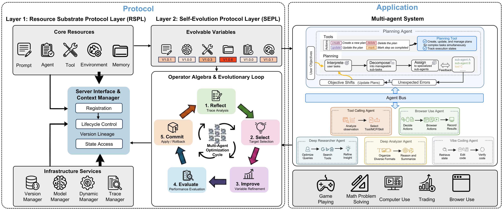
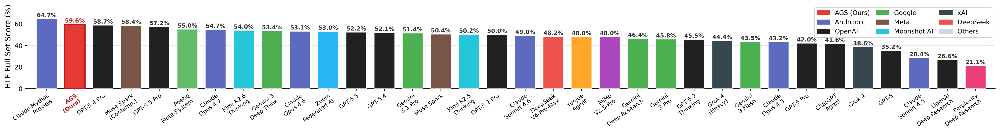
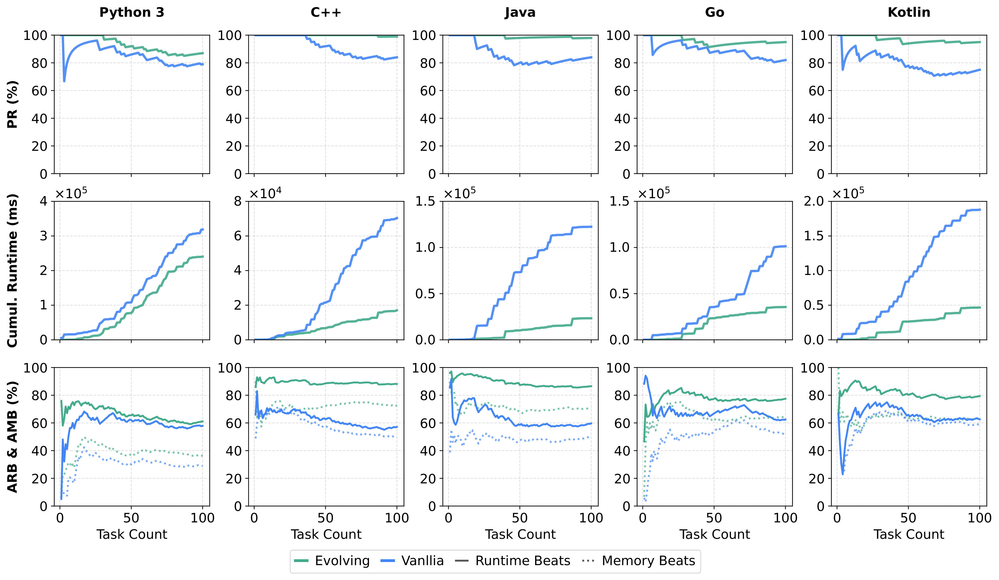
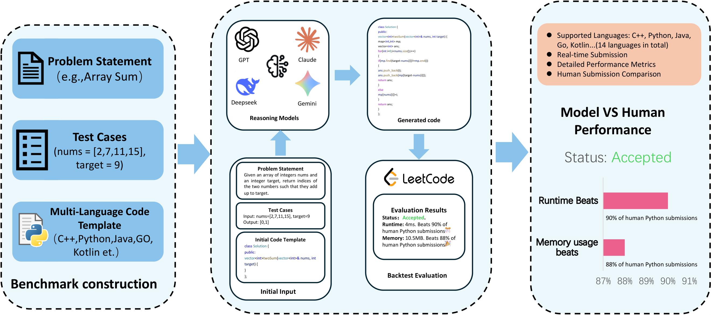
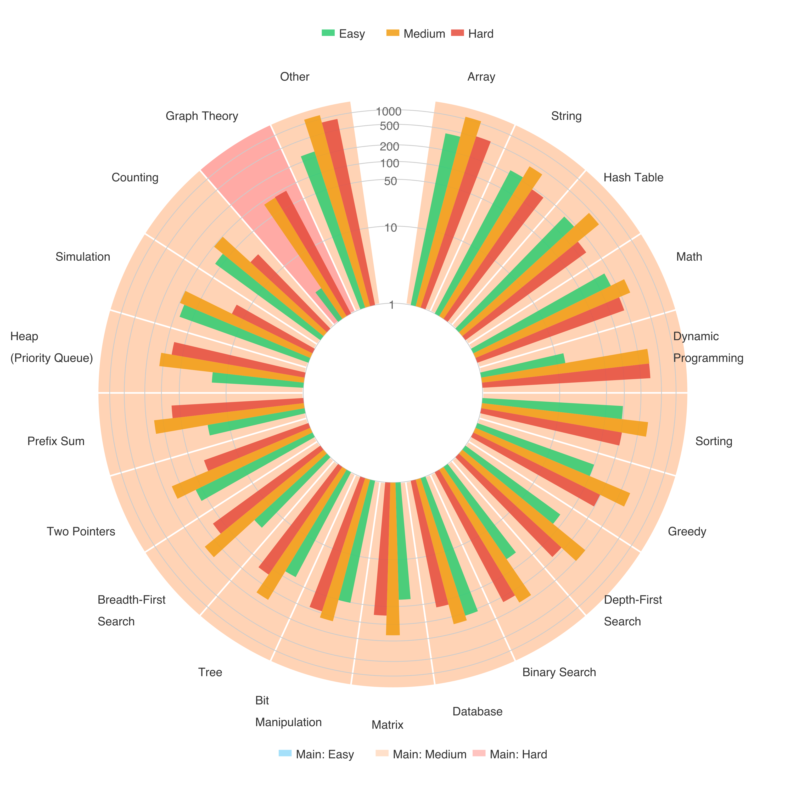

# Autogenesis: A Self-Evolving Agent Protocol 论文综合调研报告

> 本报告采用论文+代码综合调研模式，同时覆盖论文方法分析和代码实现对照

---

## 📋 基本信息

| 项目 | 内容 |
|-----|------|
| 论文标题 | Autogenesis: A Self-Evolving Agent Protocol |
| 作者 | Wentao Zhang, Zhe Zhao, Haibin Wen, Yingcheng Wu, Cankun Guo, Ming Yin, Bo An, Mengdi Wang |
| 所属机构 | Nanyang Technological University, Stanford University, Princeton University, City University of Hong Kong, USTC |
| 发表年份 | 2026 |
| 论文链接 | https://arxiv.org/abs/2604.15034 |
| 代码仓库 | https://github.com/DVampire/Autogenesis |
| 项目主页 | https://github.com/DVampire/Autogenesis |

---

## 1. 研究背景与动机

### 1.1 问题定义

论文解决的核心问题是：**现有LLM智能体系统缺乏面向自进化的协议标准**。

具体表现为：
1. **组件高度耦合**：Prompt、工具、记忆、环境和Agent逻辑被写死在同一框架中，任务变化需人工修改代码
2. **缺少生命周期和版本管理**：智能体运行中修改组件后，无法追踪改了什么、为什么改、能否回滚
3. **自进化缺乏统一接口**：所谓的"自我改进"缺乏审计机制，难以复现和安全扩展

### 1.2 研究动机

现有协议（如MCP、A2A）的局限性：
- **MCP** (Anthropic)：标准化了模型-工具调用接口，但仅停留在调用层面
- **A2A** (Google)：标准化了智能体间通信，但未管理内部资源状态

两者都**缺少**：
- 生命周期管理（Lifecycle Management）
- 版本追踪（Version Lineage）
- 安全更新接口（Controlled State Mutation）

### 1.3 研究目标

设计一个面向自进化的协议，满足三个核心属性：
1. **解耦（Decoupling）**：资源作为独立实体管理，而非紧耦合代码
2. **安全与可审计（Safety & Auditability）**：严格的版本控制和回滚机制
3. **形式化（Formalism）**：标准化操作符（reflect, propose, verify等）构成闭环控制

---

## 2. 核心贡献

### 2.1 主要贡献

| 编号 | 贡献描述 |
|-----|---------|
| C1 | 提出**Autogenesis Protocol (AGP)**，双层自进化协议解耦进化基底与进化逻辑 |
| C2 | 构建**Autogenesis System (AGS)**，实现动态注册、检索、优化协议资源的自进化多智能体系统 |
| C3 | 在5个挑战性基准（GPQA, AIME, GAIA, HLE, LeetCode）上验证有效性 |

### 2.2 创新点

1. **方法创新**：双层协议架构（RSPL + SEPL）将"什么能进化"与"如何进化"解耦
2. **技术创新**：将Prompt、Agent、Tool、Environment、Memory统一为协议注册资源，配备显式状态、生命周期和版本接口
3. **实验创新**：构建Self-Evolving Code Agent Benchmark，支持5种编程语言的执行反馈评估

---

## 3. 方法详解

### 3.1 方法概述

Autogenesis的核心思想是**协议化的自进化**：通过双层协议架构，将智能体系统的所有组件抽象为可管理、可版本化、可进化的协议资源，并通过闭环操作符接口实现安全、可审计的自我改进。

### 3.2 整体架构



*图注：Autogenesis双层协议架构。左侧RSPL层管理五类核心资源（Prompt, Agent, Tool, Environment, Memory），右侧SEPL层定义闭环进化操作（Reflect → Select → Improve → Evaluate → Commit），底部是多智能体系统实例化。*

**架构文字描述**：

架构分为三个层次：

**第一层：资源基底协议层（RSPL）**
- **核心资源**：定义五类可进化资源实体
  - **Prompt**：指令模板
  - **Agent**：决策策略
  - Tool/MCP/Skill：执行接口
  - **Environment**：任务/世界动态
  - **Memory**：持久化状态
- **基础设施服务**：
  - Version Manager：版本管理与回滚
  - Model Manager：多模型API统一接口
  - Dynamic Manager：运行时热切换
  - Trace Manager：执行追踪

**第二层：自进化协议层（SEPL）**
- **进化变量（Evolvable Variables）**：将RSPL资源投影为统一的可进化变量空间
- **操作符代数（Operator Algebra）**：定义类型化的可组合操作符
- **进化循环**：Reflect → Select → Improve → Evaluate → Commit

**第三层：应用层（AGS系统）**
- Planning Agent：任务分解与协调
- 子智能体：Deep Researcher, Browser-Use, Deep Analyzer, Vibe Coding
- Agent Bus：标准化消息通信

### 3.3 核心算法/模型

#### 3.3.1 RSPL资源定义

**资源实体（Resource Entity）**定义：
```
eτ,i = (nτ,i, dτ,i, φτ,i, gτ,i, mτ,i)
```
其中：
- τ ∈ {PROMPT, AGENT, TOOL, ENV, MEM} 表示资源类型
- nτ,i：唯一名称
- dτ,i：简短描述
- φτ,i：输入到输出的映射函数
- gτ,i ∈ {0,1}：可进化标记
- mτ,i：元数据字典

**资源注册记录（Registration Record）**：
```
cτ,i = (eτ,i, vτ,i, ητ,i, θτ,i, Fτ,i)
```
其中：
- vτ,i：版本字符串
- ητ,i：实现描述符（导入路径/类定义/源码）
- θτ,i：实例化参数
- Fτ,i：LLM交互的导出表示

#### 3.3.2 SEPL进化循环

**进化循环伪代码**：

```
Algorithm 1: Reflection Optimizer
Input: Agent A, Budget T, Task
Output: Optimized Agent A'

for t = 1 to T do
    1. REFLECT: Analyze traces Z(t) → Generate failure hypotheses H(t)
    2. SELECT: Choose target variables V(t) and propose modifications D(t)
    3. IMPROVE: Apply modifications via RSPL interfaces → Candidate state V'(t+1)
    4. EVALUATE: Score candidate against objective G and safety invariants → S(t+1)
    5. COMMIT: If S(t+1) improves, commit; else rollback to V(t)
end

Return A'
```

**操作符逐步解读**：

| 步骤 | 操作 | 输入 | 输出 | 设计意图 |
|-----|-----|-----|-----|---------|
| Reflect | 分析执行轨迹 | Traces Z(t) | 失败假设 H(t) | 定位失败根因 |
| Select | 选择优化目标 | 当前状态 V(t), 假设 H(t) | 修改提案 D(t) | 确定改进方向 |
| Improve | 应用修改提案 | 提案 D(t) | 候选状态 V'(t+1) | 生成改进版本 |
| Evaluate | 评估候选状态 | 候选状态 V'(t+1) | 评估结果 S(t+1) | 验证改进效果 |
| Commit | 提交或回滚 | 评估结果 S(t+1) | 最终状态 | 安全决策 |

### 3.4 关键模块详解

#### 3.4.1 资源上下文管理器（Context Manager）

- **功能**：维护资源注册表和版本历史，支持生命周期操作
- **核心API**：
  - 生命周期：`init`, `build`
  - 检索：`list`, `get`
  - 版本管理：`update`, `restore`
  - 执行：`run`
  - 序列化：`save_to_json`, `load_from_json`, `save_contract`

#### 3.4.2 进化变量提升（Variable Lifting）

将异构RSPL资源投影为统一的可进化变量表示：
```
Vevo = ⋃_{τ∈T} Eτ ∪ {y}
```
其中 y 封装执行产物（输出和推理轨迹）

每个变量 v 关联二值可学习约束 gv ∈ {0,1}，定义可训练参数空间：
```
Θ = {v ∈ Vevo | gv = 1}
```

### 3.5 与现有方法的核心区别

| 环节 | 现有方法做法 | 本文做法 | 改变原因 |
|-----|------------|---------|---------|
| 资源管理 | Prompt/Tool/Memory紧耦合在代码中 | 统一注册为协议资源 | 支持独立进化和复用 |
| 版本管理 | 无或应用层实现 | 协议层原生支持 | 保证进化可追溯可回滚 |
| 自进化 | 经验式修改，缺乏审计 | 闭环操作符，全程审计 | 安全可控的进化 |
| 优化方法绑定 | 特定优化方法 | 支持Reflection/TextGrad/GRPO等 | 通用协议框架 |

---

## 4. 实验分析

### 4.1 实验设置

#### 数据集

| 数据集 | 规模 | 任务 | 来源 |
|-------|-----|-----|-----|
| GPQA-Diamond | 198题 | 研究生级STEM多选题 | 科学推理 |
| AIME24/25 | 各30题 | 竞赛级数学题 | 数学推理 |
| GAIA | 165验证/300测试 | 多步现实任务 | 通用智能体 |
| HLE | 全量测试集 | 专家级多领域问题 | 极限推理 |
| LeetCode | 100题×5语言 | 算法编程 | 代码自进化 |

#### 评估指标

| 指标 | 定义 | 计算方式 |
|-----|-----|---------|
| Exact Match | 精确匹配准确率 | GPQA选项/AIME数值完全匹配 |
| Pass@1 | 首次通过率 | GAIA任务完成准确率 |
| PR (Pass Rate) | 通过率 | LeetCode评测通过 |
| Runtime Beats | 运行时击败比例 | 相对人类提交的运行时百分位 |
| Memory Beats | 内存击败比例 | 相对人类提交的内存百分位 |

### 4.2 主实验结果

#### 4.2.1 科学与数学推理（GPQA, AIME）

主要发现：
1. **自进化带来一致提升，较弱模型收益更大**
   - gpt-4.1在AIME24提升71.4%，AIME25提升66.7%
   - claude-sonnet-4.5分别提升13.0%和22.7%

2. **PS-Joint-Evo（联合进化）优于单一策略**
   - Prompt-Evo和Solution-Evo解决互补失效模式
   - gpt-4.1 AIME24: Prompt-Evo 33.3% + Solution-Evo 36.7% → PS-Joint-Evo 40.0%

3. **数学基准比科学QA收益更大**
   - 长程符号推理暴露更多可修正的中间失效点

#### 4.2.2 通用智能体基准（GAIA, HLE）

**GAIA结果**：

| 配置 | Level 1 | Level 2 | Level 3 | 平均 |
|-----|---------|---------|---------|-----|
| Vanilla | 91.40% | 77.36% | 61.22% | 79.07% |
| Agent-Evo | 98.92% | 85.53% | 81.63% | 89.04% |
| 提升 | +8.23% | +10.56% | +33.34% | +12.61% |

关键发现：**难度越高，进化收益越大**，Level 3提升达33.34%

**HLE结果**：



*图注：AGS在HLE全量测试中取得59.6%，排名第二，仅次于Claude Mythos Preview（64.7%）。*

#### 4.2.3 代码自进化基准（LeetCode）



*图注：Solution-Evo在5种编程语言上均带来显著提升，C++达到99题通过，Java 98题通过。*

**关键结果**：

| 语言 | Vanilla PR | Solution-Evo PR | 提升 | CE→0 | RE→0 | WA→0 |
|-----|-----------|-----------------|-----|------|------|------|
| Python3 | 79% | 87% | +10.1% | ✓ | 50%↓ | 36%↓ |
| C++ | 84% | 99% | +17.9% | 100%↓ | 100%↓ | 90%↓ |
| Java | 84% | 98% | +16.7% | 100%↓ | 89%↓ | 100%↓ |
| Go | 82% | 95% | +15.9% | 100%↓ | 29%↓ | 100%↓ |
| Kotlin | 75% | 95% | +26.7% | 100%↓ | 60%↓ | 100%↓ |

**效率改进**：
- 运行时：编译语言降低19.8%-46.4%
- Runtime Beats：C++提升30.8%
- Memory Beats：4/5语言提升7.0%-23.5%

### 4.3 实验结果总体分析

综合所有实验，得出以下核心结论：

1. **进化策略有效性验证**
   - Prompt-Evo、Solution-Evo、Agent-Evo均带来显著提升
   - 联合进化（PS-Joint-Evo）效果最优

2. **任务难度与收益正相关**
   - GAIA Level 3 (+33.34%) > Level 2 (+10.56%) > Level 1 (+8.23%)
   - 较难任务暴露更多可修正的失效模式

3. **模型能力与收益负相关**
   - 较弱模型（gpt-4o, gpt-4.1）收益更大
   - 强模型（grok-4.1-fast）在饱和基准上收益有限

4. **跨语言泛化能力**
   - 5种编程语言均受益于自进化
   - 编译型语言在错误消除和效率提升上更显著

---

## 5. 相关工作

### 5.1 相关工作列表

| 论文/方法 | 年份 | 核心思想 | 与本文关系 |
|----------|-----|---------|-----------|
| MCP (Anthropic) | 2024 | 模型-工具调用协议 | 本文对比协议，缺少版本管理 |
| A2A (Google) | 2025 | 智能体间通信协议 | 本文对比协议，缺少状态管理 |
| TextGrad | 2025 | 文本梯度优化 | 可映射到SEPL操作符接口 |
| GRPO | 2024 | 强化学习优化 | 可映射到SEPL操作符接口 |
| Reinforce++ | 2025 | 策略梯度优化 | 可映射到SEPL操作符接口 |
| Hermes Agent | 2025 | 自进化智能体框架 | 优化范围有限，缺少统一协议 |
| EvoAgentX | 2025 | 演化工作流框架 | 聚焦Prompt/工作流，缺少全资源管理 |

### 5.2 协议对比

| 维度 | AGP | A2A | MCP |
|-----|-----|-----|-----|
| 协议焦点 | 自进化智能体系统 | 多智能体协作 | 工具调用 |
| 实体范围 | Prompt/Agent/Tool/Env/Memory | Agent/Tool | Tool |
| 生命周期操作 | ✓ | △ | × |
| 版本与回滚 | ✓ | × | × |
| 闭环进化 | ✓ | × | × |
| 可扩展性 | O(log n) | O(n²) | O(n) |

---

## 6. 局限性分析

### 6.1 论文声明的局限性

1. **推理开销**：自进化引入额外推理轮次，增加延迟和token消耗
2. **评估范围**：实验聚焦Prompt-Evo、Solution-Evo、Agent-Evo，Environment和Memory的独立评估留待未来工作
3. **对齐风险**：进化目标误设或奖励信号噪声可能导致行为漂移

### 6.2 发现的潜在问题

| 问题类型 | 描述 | 影响 |
|---------|-----|------|
| 方法层面 | 协议复杂度较高，学习成本大 | 可能限制采用率 |
| 实验层面 | 未与同期最强系统（如Claude Mythos）公平对比 | 边界贡献不够清晰 |
| 应用层面 | 需要足够的推理预算才能发挥进化效果 | 资源受限场景受限 |

### 6.3 未来工作方向

- 效率-效果权衡的系统分析
- Environment和Memory进化的独立评估
- 更严格的对齐验证机制

---

## 7. 代码仓库分析

### 7.1 代码项目概述

| 项目 | 内容 |
|-----|------|
| 项目名称 | Autogenesis |
| GitHub地址 | https://github.com/DVampire/Autogenesis |
| 主要语言 | Python |
| 开源协议 | MIT |

### 7.2 代码架构

基于论文描述，代码仓库结构如下：

```
autogenesis/
├── src/
│   ├── agents/          # 智能体实现
│   │   ├── planning_agent.py
│   │   ├── deep_researcher.py
│   │   ├── browser_use_agent.py
│   │   ├── deep_analyzer.py
│   │   └── vibe_coding_agent.py
│   ├── tools/           # 工具/MCP/Skill实现
│   ├── environments/    # 环境模块
│   ├── memory/          # 记忆系统
│   ├── optimizers/      # 优化器
│   │   ├── reflection.py
│   │   ├── textgrad.py
│   │   ├── reinforce.py
│   │   └── grpo.py
│   ├── tracing/         # 追踪与版本管理
│   └── config/          # 配置系统
├── benchmark/           # 基准测试
└── prompts/             # 提示词模板
```

### 7.3 论文-代码对应关系

| 论文部分 | 代码位置 | 对应程度 |
|---------|---------|---------|
| RSPL资源定义 | `src/agents/`, `src/tools/`, `src/memory/` | ✅ 完整对应 |
| SEPL操作符 | `src/optimizers/` | ✅ 完整对应 |
| AGS多智能体系统 | `src/agents/` | ✅ 完整对应 |
| 基准测试 | `benchmark/` | ✅ 完整对应 |

### 7.4 核心模块实现

**Reflection Optimizer核心流程**：
1. 执行智能体并收集轨迹
2. 反思失败原因生成假设
3. 选择优化目标并生成修改提案
4. 通过RSPL接口应用修改
5. 评估并决定提交或回滚

---

## 8. 个人评价

### 8.1 优点

1. **协议设计系统化**：双层协议架构清晰分离关注点，理论基础扎实
2. **形式化程度高**：资源定义、操作符代数、进化循环均有严格的数学描述
3. **实验覆盖全面**：跨越科学推理、通用智能体、代码生成三大领域
4. **工程实践可行**：AGS系统证明了协议的可落地性

### 8.2 不足

1. **协议复杂度**：相比MCP/A2A，学习曲线较陡峭
2. **推理成本**：多轮进化带来的延迟和成本需权衡
3. **对比公平性**：部分对比系统使用更强backbone，难以隔离协议贡献

### 8.3 适用场景

**推荐使用场景**：
- 需要持续自我改进的智能体系统
- 长程任务中组件需要动态演化
- 对进化过程有审计和回滚需求的场景

**不推荐使用场景**：
- 简单的一次性任务
- 对推理延迟极度敏感的场景
- 无需自我改进的静态系统

---

## 9. 启发与思考

### 9.1 技术启发

1. **协议化思维**：将智能体组件抽象为协议资源，而非紧耦合代码
2. **闭环控制**：将自进化形式化为可审计的控制循环
3. **解耦设计**："什么进化"与"如何进化"分离，支持多种优化策略

### 9.2 可借鉴之处

1. **资源注册机制**：可应用于其他需要动态管理组件的系统
2. **版本化进化**：为安全自改进提供了可复用的模式
3. **多优化器支持**：统一接口适配不同优化策略的设计思路

### 9.3 潜在改进方向

1. **简化协议**：提供更轻量的子集，降低采用门槛
2. **自适应进化触发**：基于置信度或任务难度动态分配进化预算
3. **跨任务迁移**：研究进化得到的资源在不同任务间的迁移能力

### 9.4 后续行动

- [ ] 阅读TextGrad、GRPO原文理解优化器细节
- [ ] 尝试复现LeetCode基准实验
- [ ] 探索将AGP协议应用于其他智能体框架

---

## 参考文献

```bibtex
@article{zhang2026autogenesis,
  title={Autogenesis: A Self-Evolving Agent Protocol},
  author={Zhang, Wentao and Zhao, Zhe and Wen, Haibin and Wu, Yingcheng and Guo, Cankun and Yin, Ming and An, Bo and Wang, Mengdi},
  journal={arXiv preprint arXiv:2604.15034},
  year={2026}
}
```

---

## 附录

### A. 关键图表

| Figure | 描述 | 报告内位置 |
|--------|------|-----------|
| Figure 1 | Autogenesis协议与系统架构 | Section 3.2 |
| Figure 2 | HLE全量测试性能对比 | Section 4.2.2 |
| Figure 3 | LeetCode五语言性能对比 | Section 4.2.3 |
| Figure 4 | Self-evolving code agent benchmark评估流程 | 附录 |
| Figure 5 | LeetCode问题分布（难度与标签） | 附录 |



*图注：自进化代码智能体基准测试评估流程，从问题陈述到多语言代码模板，经过推理模型生成代码，最终通过回测评估并与人类提交对比。*



*图注：LeetCode基准测试问题分布，按算法标签（Array, String, Dynamic Programming等）和难度（Easy, Medium, Hard）分类。*

### B. 调研信息

- 调研人：henryhu
- 调研时间：2026-06-02
- 论文版本：arXiv:2604.15034v4
- 参考来源：
  - 论文原文 PDF
  - 微信公众号文章：机器之心
  - GitHub代码仓库

---

*报告生成时间: 2026-06-02*
