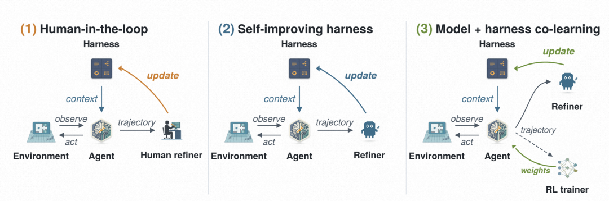
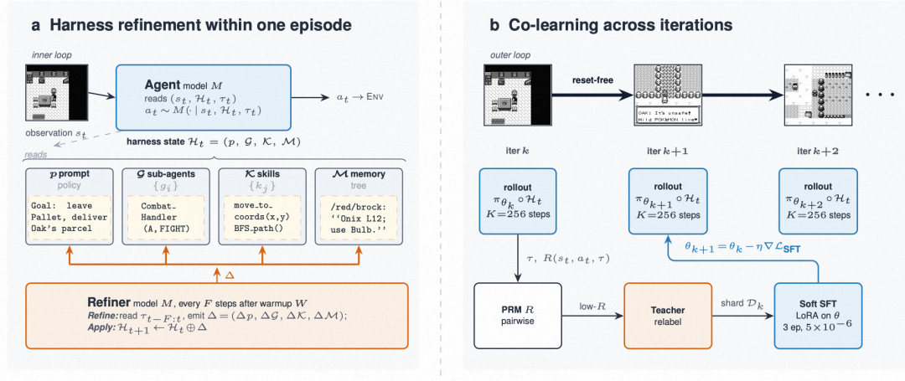
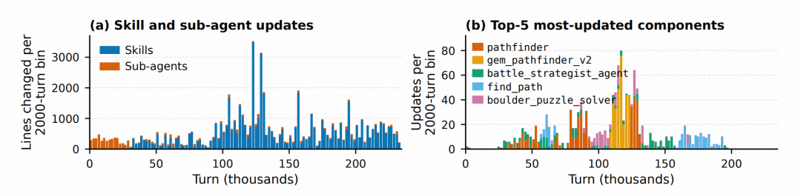
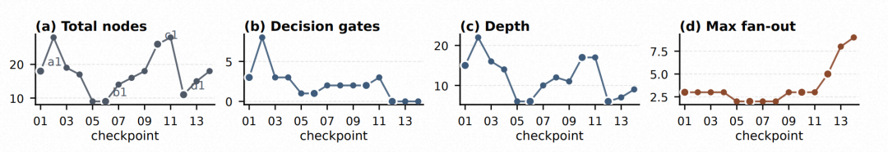
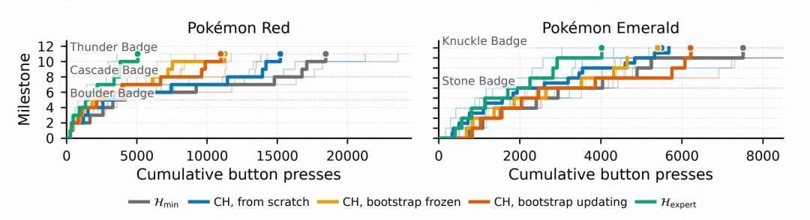
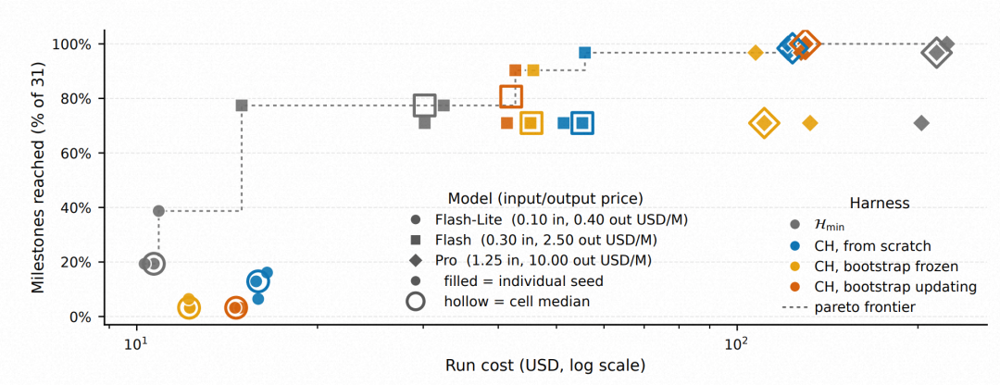
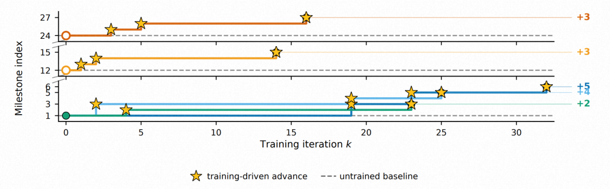
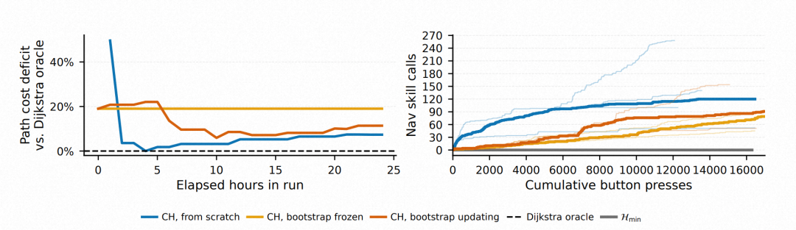
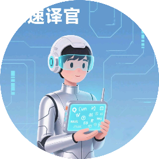

# Princeton + DeepMind: Agent自我进化的新范式

Source: https://mp.weixin.qq.com/s/DD4uIV4kqjc9FSTs_42MbA

# Princeton + DeepMind: Agent自我进化的新范式

原创

AI速译官
AI速译官

[AI速译官](javascript:void(0);)

在小说阅读器读本章

去阅读

在小说阅读器中沉浸阅读

> 今天我们分享解读的是来自 **Princeton × ARISE × Google DeepMind** 联合团队的最新工作 **《Continual Harness: Online Adaptation for Self-Improving Foundation Agents》**。这篇论文做了一件听起来既硬核又浪漫的事——**让 Gemini 3 在不断打宝可梦的同时,自己改写自己的 prompt、子智能体、技能库和记忆,完全不需要 reset 环境**。更厉害的是,他们的 GPP 项目已经成为**第一个通关多款宝可梦 RPG 的 AI 系统**(Blue / Yellow Legacy 困难模式 / Crystal 一战无败)。

📄 论文标题:Continual Harness: Online Adaptation for Self-Improving Foundation Agents  
🏢 作者机构:Princeton University · ARISE Foundation · Google DeepMind  
🌐 项目主页:https://sethkarten.ai/continual-harness

---

## 一、导读:为什么"具身智能体"卡在了脚手架 (Harness) 上?

如果你用过 Claude Code、OpenHands、OpenClaw 这些编程智能体,你应该已经习惯了一个事实:**真正让 LLM 跑起来的不是模型本身,而是包裹在模型外面的那一层"脚手架"(harness)**——工具、记忆、规划、子智能体、提示词。对于编程任务,这个基础设施已经非常成熟。

**但对具身智能体 (embodied agents),没有对等的标准化方案。**

PokeAgent Challenge 已经报告过:在缺乏领域脚手架的情况下,**前沿的视觉语言模型在 RPG 上几乎毫无进展**。这意味着:你给 Gemini-3-Pro 一张宝可梦的截图和按键接口,它甚至连第一个道馆都打不下来。

那么 harness 从哪里来?作者团队过去一年的 GPP (Gemini Plays Pokémon) 项目给出了一种朴素的答案:**人工迭代**。他们花了数千小时直播游戏,人类读轨迹、人类改 harness,从一个截图–按键接口一步步演化成多智能体系统,最终让 GPP 通关了 Pokémon Blue、Yellow Legacy 困难模式和 Crystal。

> 在 Yellow 和 Crystal 最艰难的阶段,**模型自己开始通过长上下文记忆迭代自身策略**——这种"涌现的自我改进"信号,与人类闭环改进并行出现。

Continual Harness 这篇论文,就是把这种"涌现"形式化、自动化:**把人类从这个 loop 里完全拿掉**,从最小的环境接口开始,让 agent 自己在单次连续 episode 内交替地"行动 + 重写自己的 harness"。

[图1: Continual Harness 的三种模式 ——(1) 人在回路的 GPP;(2) 自改进 harness;(3) 模型 + harness 联合学习]

---

## 二、Preliminaries:具身环境与 Agentic Harness 的形式化

### 2.1 具身环境接口

智能体在每个时间步接收:

•

帧观察:渲染后的环境状态图像

•

文本地图:用 ASCII 描述可见 tile 和附近可走位置(用来弥补 VLM 对像素网格空间推理的不足)

•

从离散按键集= {UP, DOWN, LEFT, RIGHT, A, B, START, SELECT} 中选动作

注意:**文本地图只编码当前可见信息,不含任何 walkthrough、目标列表、寻路结果**——这只补 VLM 的空间推理弱点,绝不补领域知识。环境是部分可观测的(NPC 意图、战斗机制等内部状态都看不到)。

### 2.2 Agentic Harness 的四元组分解

参考 Karten et al. [7],一个 harness被分解为四个部分:

•

**System prompt**:每个推理步骤喂给模型的指令和策略指导

•

**Sub-agents**:可被 orchestrator 调用的专用模块(战斗策略、解谜、自反思等)

•

**Skills**:可复用 routine,包括**文本级行为**(推理中引用的启发式)和**可执行程序**(寻路器、工具封装)。harness 自带的 primitive 如 `press_buttons`、`get_game_state` 也算 skill;新 skill 也可以在游戏中现写。

•

**Memory**:跨轨迹累积的事实/策略/观察存储

此外,harness 暴露一组**固定的 meta-tools**——`define_agent`、`run_code`、`process_memory` 等——让 agent 通过这些接口**原地编辑**。

文中三种 harness 设置:

| Harness | 含义 |
| --- | --- |
|  | 最小:只有接口 + 通用系统 prompt,无子智能体/记忆/skill |
|  | 手工:全部组件人工填充(A\* 寻路、属性克制表、伤害计算器等) |
|  | **Continual Harness:从起步,游戏中自动 refine** |

---

## 三、Methodology:两层循环架构

整体方法见 [图2: 上图为 Episode 内 harness refinement,下图为 DAgger+PRM 跨 iteration 联合训练]。

### 3.1 内层循环:Agent 行动

写表示 agent 在时刻的观察。模型在当前 harness包裹下产生动作:

其中是到当前时刻的轨迹。这是标准的 agent step。

### 3.2 外层循环:Refiner 重写 Harness

每步,在初始 warm-up步之后,**Refiner** 读取最近的轨迹窗口,识别失败签名(navigation loops、tool-call failures、stalled objectives、missed exploration opportunities),然后**对四个组件各跑一遍** CRUD 编辑(create / read / update / delete):

1

**重写 prompt**:基于识别到的失败和轨迹窗口

2

**编辑子智能体**:为重复的多步模式创建新子智能体,修改已存在的子智能体以应对失败,删除从未被有效调用的子智能体

3

**编辑 skill**:从成功序列中编码出新 skill,修复抛异常的可执行代码

4

**编辑 memory**:补充缺失条目,更新过时条目,降低 agent 已经走过的区域的重要性

更新后的 harness:

**关键:** Agent 不重置,环境也不重置,harness 直接在下一步进入 agent 的上下文。Agent 和 Refiner **共享同一个模型**——只是被调用的时机和被读到的轨迹窗口不同。

### 3.3 为什么"无 reset"很关键?

这是本文与 GEPA、MIPRO 等 prompt-optimization 方法的本质区别。这些方法每个迭代要跑完整 episode 再 reset,每次 reset 就重启了"失败信息的累积"。**Continual Harness 在 episode 内更新,使得 refinement 质量随 episode 长度复利累积**——而且它能针对那些**只在 episode 深处才出现**的失败模式(后期对战、多步谜题、对话链),这是 reset-based 方法在结构上够不到的。

更现实地说:**对于长跑的编程 agent、具身 agent、运维任务,免费 reset 本来就不存在**——reset-free 是实际部署中占主导的 regime。

### 3.4 联合学习循环:模型权重也更新

图2(b) 把 Continual Harness 进一步实例化为开源模型的训练 loop:

1

**每个在线 iteration**:策略在活生生 refine 中的内跑步

2

**PRM 打分**:成对的 process reward model对每个转移在滑动窗口内打分

3

**教师重标**:低 reward 窗口由前沿 teacher (Gemini-3.1-pro) 重新生成

4

**Soft SFT 更新**:在重标 shard 上做 LoRA SFT,得到

5

**Reset-free**:iter结束时的 emulator state 直接作为 iter的起点——**模型的游戏内位置跨训练而累积,而不是每次重启**

这是论文最酷的部分:**模型权重跨 iteration 更新,harness 状态在 iteration 内更新,两个时间尺度的"共进化"通过同一组轨迹数据闭合**。

---

## 四、实验:从手工脚手架到自动脚手架的 majority 恢复

### 4.1 实验设置

•

**环境**:Pokémon Red 和 Emerald(同一类型 RPG,地图布局、机制、难度都不同)

•

**指标**:**累积按键数 → 里程碑**(PokeAgent Challenge 的标准评估)。注意:单次 `press_buttons([A, A, DOWN])` 算 3 次按键,这样无论 harness 如何 batch,和复杂 harness 都直接可比。

•

**模型**:Gemini 3 的三个变体(Pro / Flash / Flash-Lite);开源端用 Gemma-4 (E2B、E4B、26B MoE、31B dense)

•

**种子数**:至少 3 个种子,报告中位数 + 个体种子淡线

### 4.2 GPP 项目:第一个通关多款 Pokémon 的 AI

[图3: Yellow Legacy harness refinement —— (a) 全程 CRUD 操作分布在整个 run 而非收敛到固定脚手架;(b) 少数导航/战斗组件占绝大多数更新]

GPP 项目的实证证据:

•

**2025 年 5 月**:Pokémon Blue 通关

•

**2025 年 8 月**:Yellow Legacy 困难模式击败四天王

•

**2025 年 11 月**:Crystal 通关,**终局战斗无败**

[图4: Yellow Legacy battle\_strategist\_agent prompt 在四天王阶段经历的结构演化 —— 节点数 / 决策门 / 深度 / 最大扇出在 14 个 checkpoint 上的变化]

**涌现的 Continual Harness 行为(令人印象深刻的例子):**

•

模型把 `autopress_buttons` 沙盒漏洞**自动包装成通用 `press_sequence` primitive**

•

自行发明命名多阶段战斗策略——比如 Crystal 终局红队战的 **"Operation Zombie Phoenix"**

•

在 notepad 里**显式写出**金黄市地下通道开关谜题的真值表

### 4.3 Continual Harness 关闭了与专家 harness 的差距

[图5: 里程碑达成数 vs 累积按键数 —— Red(左)11 个里程碑到 Thunder Badge;Emerald(右)9 个里程碑到 Knuckle Badge]

关键发现:

•

**Continual Harness 在两个游戏上都显著降低了每个里程碑的按键成本** vs

•

**回收了→效率差距的大部分**——而且没有访问游戏反编译、里程碑表、手工子智能体中的任何一个

•

残留差距集中在对话密集的道馆内部和多回合战斗策略

•

**Bootstrap-updating 优于 from-scratch**:refinement 信号在 episode 内累积,前一轮 refine 过的 harness 加速后一轮——**即使游戏状态本身 reset 了**

### 4.4 Harness 增益依赖模型能力

[图6: Emerald 的成本–完成度 Pareto 平面 —— 三种 Gemini 模型 × 4 种 harness 配置]

**最有意思的结论:harness 增益与模型能力强相关**。

•

**Pro**:Continual Harness 严格 Pareto-dominant。From-scratch HCH 在 $130 中位数下达到 100% 里程碑;在 $215 下只到 98%——**约 40% 成本下降零完成度损失**

•

**Flash**:harness 收益方差很大,bootstrap-updating 在 $42 下达到 80%,微高于的 77%($30)

•

**Flash-Lite**:只能 20%,**所有 Continual Harness 变体都掉到 3–13%**——**能力地板存在:模型若不够强,根本无法正确使用 refinement 出来的 harness 组件**

### 4.5 开源学生模型与 refining harness 联合学习

[图7: Reset-free DAgger+PRM 训练在 Pokémon Red 上驱动持续里程碑前进 —— 5 个 advancing run 的里程碑指数 vs 训练 iteration]

•

Gemma-4 26B 作为初始 policy(经过 SFT + offline GRPO 预热,但单独这两个阶段都不能产生有意义的游戏内推进)

•

每个 iteration 跑步的 DAgger rollout

•

**Reset-free**:emulator state 跨 iteration 加载——所以 Figure 7 的每条曲线都是**同一个 agent 在它自己的训练过程中走出的游戏内单轨迹**,不是独立 rollout 的聚合

•

**从游戏开始**和**从中游 checkpoint**都能持续推进——训练信号不专属于早期分布

•

跨家族 Qwen3.5 (27B, 35B) 不经过 SFT warm-up,**能生成可解析的 tool call 但走不出起始区域**——排除了 rollout 协议本身的工件

### 4.6 Skill 朝 Oracle 自我改进:可测量的证据

[图8: 寻路 skill 机制 —— 左:相对 Dijkstra oracle 的路径成本赤字随时间下降到个位数 %;右:导航 skill 调用次数随训练累积]

作者在 warp-to-warp 障碍感知导航任务上,把 refined 的 skill 路径成本与 **Dijkstra oracle** 做直接对比:

•

:从不调用任何 navigation skill

•

Continual Harness:在 24 小时 run 内积累数百次调用

•

From-scratch run:路径成本赤字从近一半的代价**降到单位数百分比并稳定保持**

•

**这种改进是 in-loop 且 reset-free 的**:早期调用的失败被 Refiner 诊断,受影响的 skill 在**同一个 episode 内**被修复

Bootstrap-updating 始终 ≥ bootstrap-frozen,说明在继承的 skill 集上**继续 refine 仍然加价值**;frozen 的平直曲线则界定了"继承 ≠ 持续改进"的上界。

---

## 五、思考:Agent 进化的下一个范式——"harness 作为可学习的层"

读完这篇论文,我最强烈的感受是:**作者把 LLM Agent 工程的核心矛盾向前推进了一步**。

过去一年,Agent 圈在讨论 self-improvement 时大致有几条路线:

1

**Model-side**:RLHF / GRPO / DPO,改的是模型参数(代表:DeepSeek-R1、SkillRL)

2

**Memory-side**:ReasoningBank、MemP、SkillOS,改的是显式记忆 / skill 仓库

3

**Prompt-side**:GEPA、MIPRO、Self-Refine、Reflexion,改的是 prompt 或局部反思

而 Continual Harness 提出的是一个更整体的视角:**这四类东西其实都是同一个 harness 状态的不同切片,应该被同一个 Refiner 在同一条 trajectory 上联合优化**。这种"统一论"的力量在于它直接对应工程师的真实操作——你在 debug 一个 production agent 时,你不会只改 prompt 或只改记忆,你会同时改 system message、加新工具、补 prompt 里的反例、调子智能体——**那么为什么 agent 自己不能做同样的事?**

这种视角还带来了几个更深的启示:

**① 涌现的真实性证明**。GPP 是论文的"实证锚点"——人类在 Yellow Legacy 后期看到模型自己开始把 `autopress_buttons` 漏洞包装成 `press_sequence`、给战斗策略命名、写真值表。这些**不是 prompt 工程的结果,而是 agent 自己面对 episode 深处的失败做出的结构化响应**。这种"内生的工程师行为"才是 Continual Harness 真正想自动化的东西——很多 prompt-optimization 论文优化的其实是 toy 任务上的浅层 prompt 调整,跟这种行为没有可比性。

**② Reset-free 是被严重低估的设定**。学术圈太习惯"每个 iteration 重置环境"了——但凡你试过 deploy 一个真实的 agent,你就知道 reset 本身就是不存在的。Continual Harness 论文里那句 "**failure record and the repair sit inside the same trajectory**" 简直应该写到所有 Agent 教科书的封面上。Refinement 信号的复利累积、对深层 failure mode 的可达性——这些都是 reset-based 框架在结构上做不到的。

**③ 能力地板的 honest 暴露**。论文里 Flash-Lite 全线翻车的结果非常重要——它说明 **harness 增益不是免费午餐**。当模型不够强、无法正确使用 refinement 出来的复杂组件时,自动化反而是负贡献。这给整个领域一个 healthy reminder:**self-improvement 框架的下界总是模型能力本身**。

**④ Co-learning 是真正的 holy grail**。论文最有野心的部分是 Section 3.3 的 model + harness 联合训练。Harness refinement 改变了模型的 trajectory 分布,模型的新行为暴露了新的 failure mode,Refiner 再据此重写 harness——**这是一个完整的协同进化闭环**。如果 Gemma-4 31B 这种规模就能跑出 sustained progress,那当未来开源模型能力跟上 Gemini-3.1-pro 时,**同一个模型既做 teacher 又做 trainee 的完全自闭环学习就近在眼前**。

值得继续推的方向:

•

**跨任务的 harness 迁移**:Yellow Legacy 上 refine 出来的 harness 能不能直接搬到 Crystal?如果能,**harness 就成了真正可迁移的"领域知识载体"**——一种 model-agnostic 的"经验晶体"

•

**Harness 的版本控制与可解释性**:文中已经把 harness 的 CRUD 变化做成了可视化的演化图。这套工具如果做成生产级,**就能让 agent 调试变得像 git log 一样自然**

•

**多 agent 共享 harness**:多个 agent 是否能共同写、读、修同一个 harness?这是一种新的"群体学习"形式

•

**Capability floor 的预测**:能不能在不实跑的情况下,提前判断某个模型是否在 capability floor 之下?这对实际部署的成本控制至关重要

•

**跨域:把这套放到 SWE-bench、网页操作、机器人控制**:Pokémon 是一个 high-fidelity 验证场,但真正的杀手锏是把这套迁移到工业应用——**而论文里反复提到的"reset 不可得"恰恰是真实工业场景的常态**

最后一个观察:Continual Harness 的"两个时间尺度的 alternation"——harness 在每步更新 + 模型权重在每 iteration 更新——**像极了人类学习的双时间尺度:在做的时候改方法,做完一批后总结经验更新世界模型**。这或许才是 self-improving agent 走向真正"持续学习"的范式雏形。

---

> 📌 **一句话总结**:Continual Harness = 不 reset 的两层循环(每 F 步 Refiner 对 prompt/sub-agents/skills/memory 做 CRUD + 跨 iteration DAgger+PRM 训练模型权重),把 GPP 通关多款宝可梦的人工脚手架迭代过程**完全自动化**——在 Gemini 3 Pro 上以 ~40% 更低的成本达到 100% Emerald 里程碑,且开源 Gemma-4 26B 的训练表现出持续游戏内推进。

预览时标签不可点

微信扫一扫  
关注该公众号

继续滑动看下一个

轻触阅读原文

AI速译官

向上滑动看下一个

[知道了](javascript:;)

微信扫一扫  
使用小程序

[取消](javascript:void(0);)
[允许](javascript:void(0);)

[取消](javascript:void(0);)
[允许](javascript:void(0);)

[取消](javascript:void(0);)
[允许](javascript:void(0);)

×
分析

微信扫一扫可打开此内容，  
使用完整服务

：
，
，
，
，
，
，
，
，
，
，
，
，
。
 
视频
小程序
赞
，轻点两下取消赞
在看
，轻点两下取消在看
分享
留言
收藏
听过