# Continual Harness: Online Adaptation for Self-Improving Foundation Agents

> 论文+代码综合调研报告

---

## 📋 基本信息

| 项目 | 内容 |
|-----|------|
| 论文标题 | Continual Harness: Online Adaptation for Self-Improving Foundation Agents |
| 作者 | Seth Karten*, Joel Zhang*, Tersoo Upaa Jr, Ruirong Feng, Wenzhe Li, Chengshuai Shi, Chi Jin, Kiran Vodrahalli |
| 作者机构 | Princeton University · ARISE Foundation · Google DeepMind |
| 发表年份 | 2026 |
| 论文链接 | https://arxiv.org/abs/2605.09998 |
| 项目主页 | https://sethkarten.ai/continual-harness |
| 代码仓库 | https://github.com/sethkarten/continual-harness |
| 引用数 | 待补充（2026年5月发布） |

---

## 1. 研究背景与动机

### 1.1 问题定义

论文要解决的核心问题是：**具身智能体（embodied agents）在长时序、部分可观测环境中的脚手架（harness）如何自动构建和持续改进**。

编程智能体（如 Claude Code、OpenHands）已通过成熟的 scaffolding（prompt、tools、memory、sub-agents）取得成功，但具身智能体领域缺乏对等的标准化方案。PokeAgent Challenge 报告表明：在没有领域脚手架的情况下，前沿视觉语言模型在 RPG 游戏上几乎毫无进展。

### 1.2 研究动机

**现有方法的三大局限：**

1. **手工脚手架成本高昂**：GPP 项目花费数千小时人工迭代 harness 才通关多款宝可梦
2. **Prompt 优化方法需要 reset**：GEPA、MIPRO 等方法每轮迭代需跑完完整 episode 再重置，无法触及 episode 深处的失败模式
3. **单一维度优化不够**：仅改 prompt 或仅改记忆都不够，实际工程中工程师会同时修改 system message、工具、子智能体和记忆

**关键观察**：在 GPP 项目中最艰难的阶段，模型自身开始通过长上下文记忆迭代策略——这种"涌现的自我改进"信号表明，自动化这个循环是可行的。

### 1.3 研究目标

将 GPP 中人工驱动的 harness 迭代过程**完全自动化**：从最小环境接口出发，在单次连续 episode 内让 agent 交替"行动 + 重写自身 harness"，无需任何 reset。

---

## 2. 核心贡献

### 2.1 主要贡献

| 编号 | 贡献描述 |
|-----|---------|
| C1 | **GPP 项目成果**：首个通关多款宝可梦 RPG 的 AI 系统（Blue / Yellow Legacy 困难模式 / Crystal 一战无败），通过 harness 迭代实现 |
| C2 | **Continual Harness 框架**：reset-free 框架，通过在线 in-context learning 从最小环境接口自动组装 harness |
| C3 | **效率恢复**：在 Pokémon Red/Emerald 上，Continual Harness 从零开始恢复了到手工专家 harness 效率差距的大部分，且增益与模型能力正相关 |
| C4 | **在线协同学习管道**：DAgger + PRM 训练循环驱动开源模型在 Pokémon Red 上持续游戏内里程碑推进，实现模型-harness 协同学习 |

### 2.2 创新点

1. **方法创新**：首次将 harness 四元组 (p, G, K, M) 作为统一可优化状态，由同一个 Refiner 在同一条 trajectory 上联合优化——而非分别优化 prompt、memory 或 skills
2. **技术创新**：reset-free 在线更新机制——Refiner 在 episode 内直接 CRUD 编辑 harness，失败信息和修复在同一个 trajectory 中累积，质量随 episode 长度复利增长
3. **实验创新**：双时间尺度协同进化——harness 状态在 episode 内步级更新，模型权重跨 iteration 级更新，两个更新共享同一组轨迹数据

---

## 3. 方法详解

### 3.1 方法概述

Continual Harness 的核心思想是：**在单次连续 episode 内，agent 交替执行"行动"和"重写自身 harness"，所有更新在原地（in-place）进行，无需 reset**。

一个 LLM Refiner 读取最近的轨迹窗口，识别失败签名，对 harness 的四个组件（prompt p、sub-agents G、skills K、memory M）各执行一轮 CRUD 编辑。更新后的 harness 直接在下一步进入 agent 上下文。

### 3.2 整体架构

Continual Harness 的架构围绕**两个嵌套循环**组织，共享同一组轨迹数据，在不同时间尺度上分别驱动 harness 状态和模型权重的更新。

#### 三种演进模式

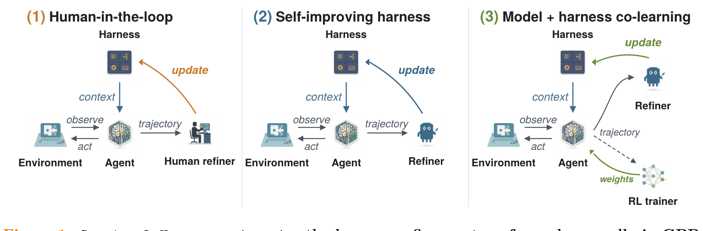

*Figure 1: Continual Harness 三种模式共享同一拓扑（环境、agent、harness、refiner），仅 refiner 身份不同：从人类 → 自动化 Refiner → RL trainer*

论文呈现了同一拓扑结构下的三种实例，区别仅在于 **Refiner 的身份**：

1. **人在回路 (Human-in-the-loop)**：GPP 项目的原始形态。人类观察 agent 的实时游戏轨迹，手动重写 harness 的 prompt、添加子智能体和 skill。这是最原始的 harness 迭代方式，也是 Continual Harness 要自动化的对象。
2. **自改进 Harness (Self-improving harness)**：Continual Harness 的核心贡献。用同一模型 M 扮演的自动化 Refiner 替代人类，每 F 步读取轨迹窗口并执行四组件 CRUD 编辑。Agent 不重置，环境不重置，harness 在 episode 内原地演化。
3. **模型+Harness 联合学习 (Model + harness co-learning)**：在自改进 harness 的基础上，增加跨 iteration 的模型权重训练循环。开源模型在 live-refining harness 中的 rollout 被前沿 teacher 重标，通过 soft SFT 更新权重。Emulator 状态跨 iteration 保持，形成 reset-free 的训练闭环。

#### 双循环结构

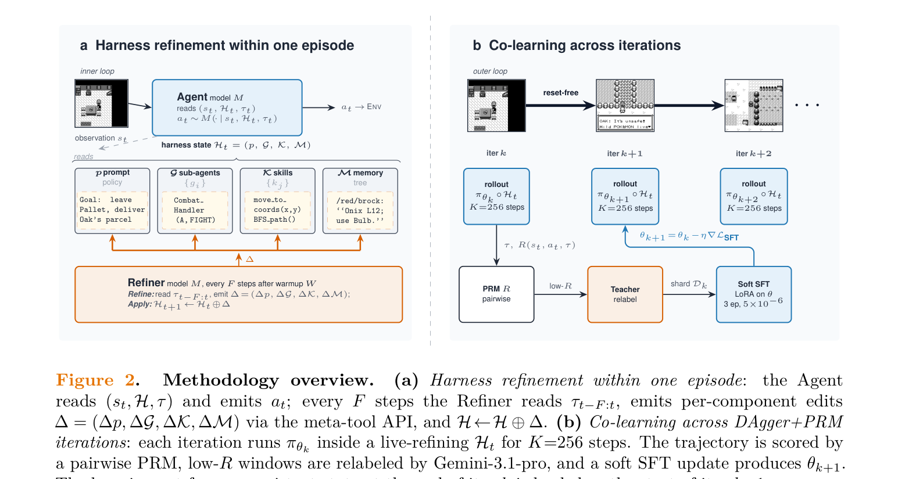

*Figure 2: (a) Agent 读取 (st, Ht, τt) 产生动作；每 F 步 Refiner 读取轨迹窗口并发出 CRUD 编辑 Δ=(Δp, ΔG, ΔK, ΔM)；Ht+1=Ht⊕Δ。(b) 每个迭代在 live-refining harness 中跑 K=256 步，PRM 打分后 teacher 重标低 reward 窗口，soft SFT 更新 θ。*

**内层循环（步级）**是标准的 agent-environment 交互：在每个时间步 t，模型 M 被当前 harness 状态 Ht 包裹后，读取观察 st=(ot, mt) 和到当前时刻的轨迹 τt，产生动作 at 作用于环境。Harness 的四个组件（prompt p 指导推理方向、sub-agents G 提供专业模块、skills K 提供可复用程序、memory M 存储累积知识）共同中介了模型与环境的交互。

**外层循环（精化级）**在每 F 步（经过 W 步 warmup 后）触发一次：Refiner（与 Agent 共享同一模型 M）读取最近 F 步的轨迹窗口 τt-F:t，识别四类失败签名——导航循环（agent 在同一区域反复移动）、工具调用失败（skill 抛异常或参数错误）、目标停滞（长时间未达成里程碑）、探索遗漏（错过可达区域）。然后对四个组件各执行一轮 CRUD 编辑：重写 prompt 以针对观察到的失败模式、创建/修改/删除子智能体、编码新 skill 或修复异常代码、补充/更新/降级记忆条目。编辑结果 Δ=(Δp, ΔG, ΔK, ΔM) 通过原地合并 Ht+1=Ht⊕Δ 立即生效，agent 在下一步直接使用更新后的 harness，无需任何环境重置。

**精化频率是自适应的**：在 episode 早期（前 200 步）每 25 步触发一次，快速构建基础 harness；200 步后降为每 100 步一次，在 harness 趋于稳定后减少不必要的 LLM 调用开销。这种设计确保了 bootstrap 阶段的快速收敛，同时避免了稳定期的过度精化。

**联合学习循环（跨 iteration）**将 harness refinement 扩展到模型权重更新：每个训练 iteration 中，开源策略 πθk 在实时精化的 harness Ht 中跑 K=256 步产生 rollout；成对 PRM (Process Reward Model) 对滑动窗口内的转移打分；低 reward 窗口由前沿 teacher（Gemini-3.1-pro）重新生成正确动作；在重标 shard 上做 LoRA soft SFT 更新得到 θk+1。关键的是，iteration k 结束时的 emulator 状态直接加载为 iteration k+1 的起点——模型的游戏内位置跨训练累积而非重启。两个循环共享同一组轨迹数据：harness 的精化改变了 trajectory 分布，模型的新行为暴露了新的 failure mode 供 Refiner 修复，形成完整的协同进化闭环。

#### 双循环架构总览

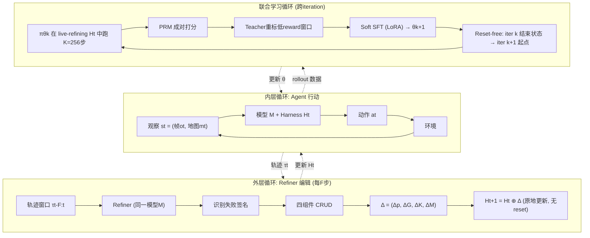

#### Harness 四组件 CRUD 编辑详情

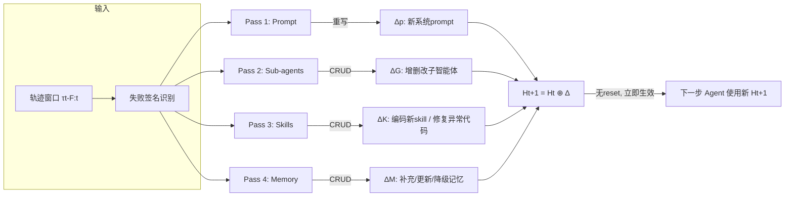

#### 自适应精化频率

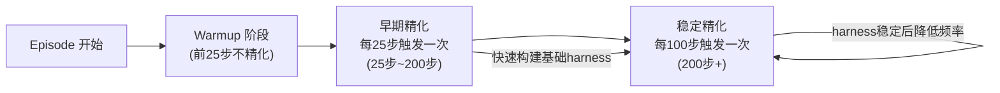

### 3.3 核心算法/模型

#### 3.3.1 算法流程

```
Algorithm 1: Continual Harness
Input: 模型M, 最小环境接口, warmup步数W, 精化频率F, 轨迹窗口大小L
Output: 持续演化的harness Ht

1. 初始化: H0 = Hmin (只有接口 + 通用system prompt, 无子智能体/记忆/skill)
2. FOR t = 1, 2, 3, ... DO:
3.   // 内层: Agent行动
4.   st = (ot, mt)  // 帧观察 + ASCII文本地图
5.   at ~ M(· | st, Ht, τt)  // 模型在当前harness包裹下产生动作
6.   执行at, 记录到轨迹τ
7.
8.   // 外层: Refiner编辑 (每F步, warmup后)
9.   IF t > W AND t % F == 0 THEN:
10.    读取轨迹窗口 τt-L:t
11.    识别失败签名 (导航循环、工具调用失败、目标停滞、探索遗漏)
12.    ∆p = Refine_Prompt(τt-L:t, 失败签名)  // 重写prompt
13.    ∆G = Refine_SubAgents(τt-L:t, 失败签名) // CRUD子智能体
14.    ∆K = Refine_Skills(τt-L:t, 失败签名)   // 编码/修复skill
15.    ∆M = Refine_Memory(τt-L:t, 失败签名)   // 补充/更新/降级memory
16.    Ht+1 = Ht ⊕ (∆p, ∆G, ∆K, ∆M)  // 原地更新
17.  ELSE:
18.    Ht+1 = Ht
19. END FOR
```

#### 3.3.2 算法逐步解读

| 步骤 | 操作 | 输入 | 输出 | 设计意图 |
|-----|-----|-----|-----|---------|
| 初始化 | 设定 Hmin | 最小接口 | 空 harness | 从零开始，证明无需人工知识 |
| Agent行动 | 模型决策 | 观察+当前harness | 动作 at | 标准agent step，harness作为中介层 |
| Refiner触发 | 检查条件 | 当前步数t | 是否运行refine | 自适应频率：早期频繁(每25步)，后期稀疏(每100步) |
| Prompt精化 | 重写系统prompt | 轨迹窗口+失败签名 | ∆p | 针对观察到的失败模式调整策略指导 |
| Sub-agent精化 | CRUD编辑 | 轨迹窗口 | ∆G | 为重复模式创建新agent，修复失败agent，删除无用agent |
| Skill精化 | 编码/修复 | 轨迹窗口 | ∆K | 从成功序列编码新skill，修复报异常的可执行代码 |
| Memory精化 | 补充/更新/降级 | 轨迹窗口 | ∆M | 填补信息缺口，更新过时条目，降低已过区域重要性 |
| Harness更新 | 原地合并 | Ht + ∆ | Ht+1 | 无reset，更新立即生效 |

### 3.4 关键模块详解

#### 模块A: Harness 四元组

- **功能**: 定义 agent 与环境之间的完整中介层
- **输入/输出**: 环境观察 → harness 包裹 → 模型动作

- **System Prompt (p)**: 每个推理步骤喂给模型的指令和策略指导。Refiner 基于识别到的失败签名和轨迹窗口重写 prompt
- **Sub-agents (G)**: 可被 orchestrator 调用的专用模块（战斗策略、解谜、自反思等）。CRUD 操作：为重复多步模式创建新子智能体，修改已有子智能体以应对失败，删除从未被有效调用的子智能体
- **Skills (K)**: 可复用 routine，包括文本级行为（推理中引用的启发式）和可执行程序（寻路器、工具封装）。新 skill 可在游戏中现写
- **Memory (M)**: 跨轨迹累积的事实/策略/观察存储。添加缺失条目，更新过时条目，降低 agent 已走过区域的重要性

- **直觉理解**: 如果把 agent 比作一个人，prompt 是他的"策略手册"，sub-agents 是他的"专业顾问团"，skills 是他的"工具箱"，memory 是他的"笔记本"。Continual Harness 让这个人边干活边自己改手册、聘顾问、添工具、记笔记。

#### 模块B: Refiner

- **功能**: 读取轨迹窗口，识别失败签名，对四个组件各执行 CRUD 编辑
- **输入**: 最近 F 步的轨迹窗口 τt-F:t
- **输出**: ∆ = (∆p, ∆G, ∆K, ∆M)

- **核心公式**:
$$H_{t+1} = H_t \oplus \Delta, \quad \Delta = (\Delta_p, \Delta_G, \Delta_K, \Delta_M)$$

- **直觉理解**: Refiner 就像一个"事后复盘助手"——每隔一段时间，它翻看 agent 最近的表现记录，找出哪里卡住了、哪里做错了，然后同时修改策略手册、调整顾问团、增补工具箱、更新笔记本。

- **与 Agent 的关系**: Agent 和 Refiner 共享同一个模型 M（Gemini 3 变体），只是被调用的时机和读到的轨迹窗口不同。

#### 模块C: 在线协同学习循环

- **功能**: 将 harness refinement 扩展为开源模型的训练循环
- **输入**: 开源模型 πθk 在 live-refining harness 中的 rollout
- **输出**: 更新的模型权重 θk+1

- **核心流程**:
  1. 策略 πθk 在实时 refine 的 harness Ht 中跑 K=256 步
  2. 成对 PRM (Process Reward Model) R(st, at, τ) ∈ [0,1] 对每个转移在滑动窗口内打分
  3. 低 reward 窗口由前沿 teacher (Gemini-3.1-pro) 重新生成
  4. 在重标 shard 上做 LoRA soft SFT 更新，得到 θk+1
  5. **Reset-free**: iter k 结束的 emulator state 直接作为 iter k+1 起点

- **直觉理解**: 这就像"边玩边学"——agent 在实时改进的 harness 中打游戏，打完后老师（前沿模型）给低分片段示范正确做法，agent 从中学习。游戏进度跨训练保持，不会每次从头开始。

### 3.5 关键技术

| 技术点 | 描述 | 作用 | 代码位置 |
|-------|-----|-----|---------|
| HarnessEvolver | 全 harness 组件演化器 | 统一管理四组件 CRUD | `agents/utils/harness_evolver.py` |
| PromptOptimizer | Prompt 级别精化 | 基于 GEPA 风格的 prompt 演化 | `agents/utils/prompt_optimizer.py` |
| 自适应频率调度 | 早期每25步，后期每100步 | 快速启动后稳定精化 | `HarnessEvolver.should_evolve()` |
| evolve_harness 工具 | 暴露给 agent 的单工具接口 | 触发 Refiner 运行 | `agents/tools/registry.py` |
| Bootstrap 机制 | 从前一次 run 的 harness 初始化 | 利用已积累的精化信号 | `--bootstrap-from` 参数 |
| Store 机制 | Memory/Skill/Subagent 持久化存储 | CRUD 操作的原子载体 | `utils/stores/` |
| DAgger+PRM | 过程奖励模型 + 教师重标 | 开源模型的在线训练 | 训练管道（论文 Section 3.3） |

### 3.6 方法设计的关键洞察

1. **洞察1: 四类 harness 组件是同一状态的不同切片**。Prompt、sub-agents、skills、memory 不是独立优化的问题——它们是同一个 harness 状态的不同维度，应该被同一个 Refiner 在同一条 trajectory 上联合优化。这直接对应工程师 debug production agent 时的真实操作：同时改 system message、加新工具、补 prompt 反例、调子智能体。

2. **洞察2: Reset-free 是被严重低估的设定**。失败记录和修复在同一个 trajectory 内累积，精化质量随 episode 长度复利增长。而且 reset-free 能触及 episode 深处的失败模式（后期对战、多步谜题、对话链）——这是 reset-based 方法在结构上无法达到的。对于长跑的编程 agent、具身 agent、运维任务，免费 reset 本来就不存在。

3. **洞察3: 双时间尺度协同进化**。Harness 在每步更新 + 模型权重在每 iteration 更新——像极了人类学习的双时间尺度：做事时改方法，做完一批后总结经验更新世界模型。

### 3.7 与现有方法的核心区别

| 环节 | 现有方法做法 | 本文做法 | 改变原因 |
|-----|------------|---------|---------|
| 优化范围 | 仅优化 prompt (GEPA, MIPRO) 或仅优化 memory/skill | 联合优化全部四组件 (p, G, K, M) | 四组件是同一状态的不同切片，独立优化次优 |
| 更新时机 | 完整 episode 后 reset 再更新 | 每 F 步 mid-episode 更新，无 reset | 失败信息在 trajectory 内复利累积；可达深层失败模式 |
| 环境假设 | 假设可免费 reset | 完全 reset-free | 真实部署中 reset 不存在或成本极高 |
| 训练范式 | 独立训练模型权重 | 模型权重 + harness 状态联合更新 | harness 改变 trajectory 分布，模型的新行为暴露新 failure mode |
| 起始状态 | 从手工设计 harness 开始 | 从 Hmin (最小接口) 开始 | 证明无需领域知识即可自举 |

---

## 4. 实验分析

### 4.1 实验设置

#### 数据集

| 数据集 | 规模 | 任务 | 来源 |
|-------|-----|-----|-----|
| Pokémon Red | 18个里程碑至Thunder Badge | RPG游戏通关 | Game Boy, 1996 |
| Pokémon Emerald | 31个里程碑至Dynamo Badge | RPG游戏通关 | Game Boy Advance, 2004 |

#### 评估指标

| 指标 | 定义 | 计算方式 |
|-----|-----|---------|
| 累积按键数 | 达成里程碑的总按键次数 | 单次 `press_buttons([A, A, DOWN])` 算 3 次按键 |
| 里程碑达成率 | 达成的里程碑数 / 总里程碑数 | 百分比 |
| 成本效率 | API 调用费用 vs 里程碑达成 | Pareto 平面分析 |
| 路径成本赤字 | 导航 skill 路径成本 vs Dijkstra oracle | 百分比 |

#### 实现细节

- 硬件环境: Gemini API 调用（Pro: $1.25/$10.00 per M tokens in/out; Flash: $0.30/$2.50; Flash-Lite: $0.10/$0.40）
- 模型: Gemini 3 Pro / Flash / Flash-Lite；开源端 Gemma-4 (E2B, E4B, 26B MoE, 31B dense)
- 种子数: 至少 3 个种子，报告中位数 + 个体种子淡线
- 运行时长: 24 小时 / seed

#### Harness 配置

| 配置 | 含义 |
|-----|------|
| Hmin | 最小：只有接口 + 通用 system prompt，无子智能体/记忆/skill |
| Hexpert | 手工专家：全部组件人工填充（A* 寻路、属性克制表、伤害计算器等） |
| CH from scratch | Continual Harness 从 Hmin 开始，游戏中自动 refine |
| CH bootstrap frozen | 从前一次 run 的 harness 初始化，不再 refine |
| CH bootstrap updating | 从前一次 run 的 harness 初始化，继续 refine |

### 4.2 主实验结果

#### GPP 项目成果

| 时间 | 成就 | 模型 |
|-----|------|------|
| 2025年5月 | Pokémon Blue 通关 | Gemini |
| 2025年8月 | Yellow Legacy 困难模式击败四天王 | Gemini |
| 2025年11月 | Crystal 通关，终局战斗无败 | Gemini |

**涌现的 Continual Harness 行为**:
- 模型把 `autopress_buttons` 沙盒漏洞自动包装成通用 `press_sequence` primitive
- 自行发明命名多阶段战斗策略——"Operation Zombie Phoenix"
- 在 notepad 里显式写出金黄市地下通道开关谜题的真值表

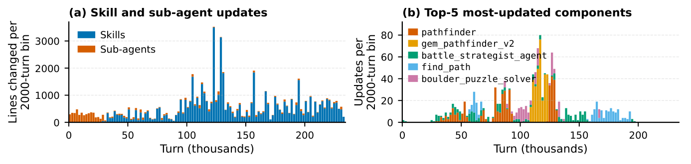

*Figure 3: (a) Skill 和 Sub-agent 的 CRUD 操作在整个 run 期间持续发生；(b) 更新集中在 pathfinder、battle_strategist_agent 等少数核心组件*

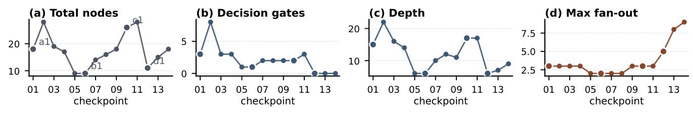

*Figure 4: battle_strategist_agent prompt 在四天王阶段的 14 个结构 checkpoint 上的演化。prompt 在成长与简化之间循环，并经历结构重写（per-decision 逻辑被吸收到 master_battle_agent 中）。*

#### Continual Harness 效率恢复

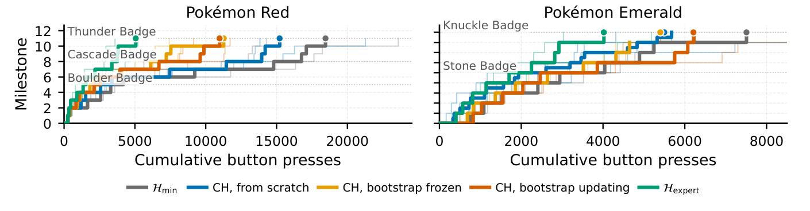

*Figure 5: Continual Harness 变体在两个游戏上都显著降低每里程碑按键成本。CH bootstrap-updating 在每个里程碑都优于 from-scratch——refinement 信号在 episode 内累积。*

**Pokémon Red (11 里程碑至 Thunder Badge)**:
- CH from scratch: 显著降低每里程碑按键成本 vs Hmin
- CH bootstrap updating: 每个里程碑都优于 from-scratch——refinement 信号在 episode 内累积
- 回收了 Hmin → Hexpert 效率差距的大部分

**Pokémon Emerald (9 里程碑至 Knuckle Badge)**:
- 相似趋势：CH 变体显著优于 Hmin

#### 模型能力与 Harness 增益的关系

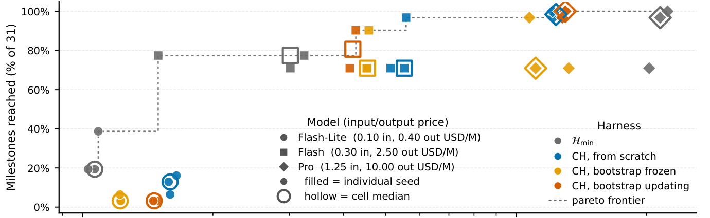

*Figure 6: Pro 上 Continual Harness 严格 Pareto dominant；Flash 收益高方差；Flash-Lite 全线翻车*

| 模型 | Hmin 里程碑率 | CH from scratch | 成本变化 | 结论 |
|-----|-------------|---------------|---------|------|
| Gemini 3 Pro | 98% ($215) | 100% ($130) | -40% 成本 | **严格 Pareto dominant** |
| Gemini 3 Flash | 77% ($30) | ~80% ($42) | 高方差 | 收益方差大 |
| Gemini 3 Flash-Lite | 20% ($11) | 3-13% | 反而下降 | **能力地板：模型太弱无法使用 harness 组件** |

#### 能力地板与 Harness 增益关系

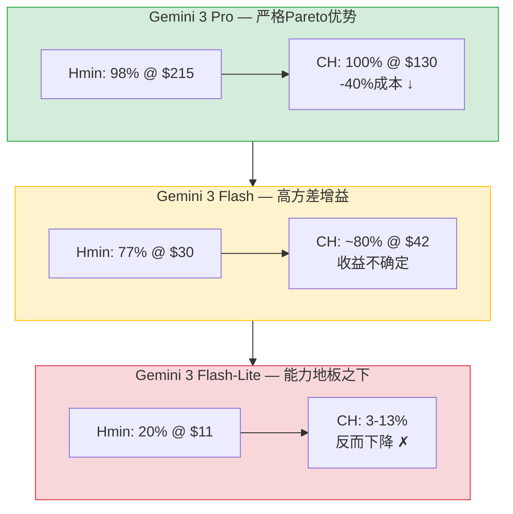

### 4.3 消融实验

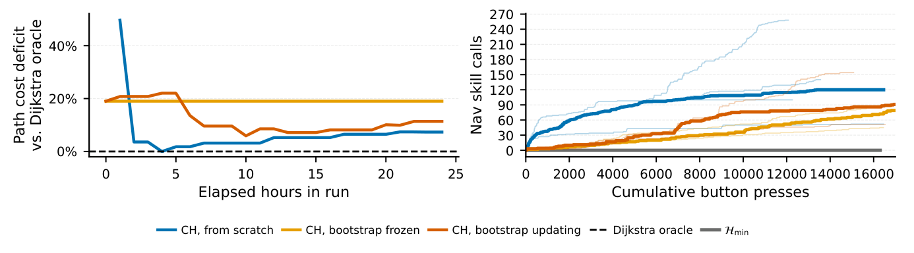

*Figure 8: CH from scratch 的路径成本赤字从近一半代价降到单位数百分比；bootstrap-updating 始终优于 frozen——继续精化仍有价值*

| 配置 | 路径成本赤字 | 说明 |
|-----|------------|------|
| Hmin | 从不调用 navigation skill | 无路径优化能力 |
| CH from scratch | 从~50%降到单位数%并稳定 | in-loop reset-free 自我改进 |
| CH bootstrap updating | 始终 ≥ bootstrap frozen | 继续精化仍有价值 |
| CH bootstrap frozen | 平直曲线 | 界定了"继承 ≠ 持续改进"的上界 |

### 4.4 开源模型协同学习

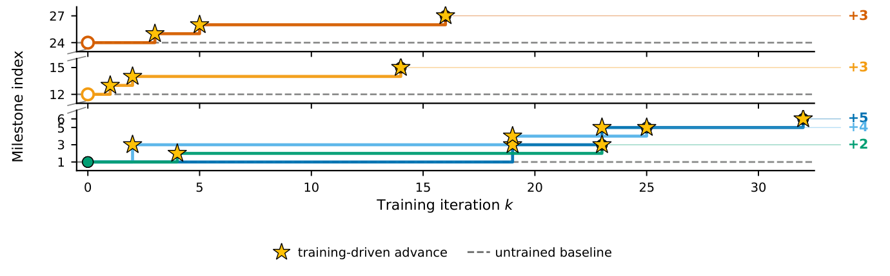

*Figure 7: 5个 advancing run 的里程碑指数 vs 训练 iteration。从游戏开始和从中游 checkpoint 都能持续推进。每条曲线是同一 agent 在自己训练过程中走出的游戏内单轨迹。*

**Pokémon Red 上的 DAgger+PRM 训练结果**:
- 5 个 advancing run 展示持续里程碑推进
- 从游戏开始和从中游 checkpoint 都能持续推进
- 跨家族 Qwen3.5 (27B, 35B) 不经 SFT warm-up，能生成可解析 tool call 但走不出起始区域——排除了 rollout 协议本身的工件

### 4.5 分析与讨论

1. **能力地板的存在**: Flash-Lite 全线翻车表明 harness 增益不是免费午餐。当模型不够强、无法正确使用 refinement 出来的复杂组件时，自动化反而是负贡献。Self-improvement 框架的下界总是模型能力本身。

2. **Reset-free 的优势是结构性的**: 失败信息和修复在同一 trajectory 内累积——"failure record and the repair sit inside the same trajectory"——这比 reset-based 方法的逐轮独立迭代有本质优势。

3. **Bootstrap 信号可跨 run 迁移**: Bootstrap-updating 优于 from-scratch 证明前一轮 refine 过的 harness 能加速后一轮，即使游戏状态本身 reset 了。

4. **Harness refinement 是持续非收敛的**: Yellow Legacy 数据显示 CRUD 操作分布在整个 run 而非收敛到固定脚手架——少量导航/战斗组件占绝大多数更新，且更新是周期性的（成长-简化-重构）。

### 4.6 实验结果总体分析

Continual Harness 的实验从三个层面系统验证了其有效性，形成了一条从"现象观察"到"自动化复现"再到"权重级协同"的完整证据链。

**第一层：现象验证（GPP 项目）**。GPP 项目用数千小时的人工 harness 迭代通关了三款宝可梦游戏，证明了 harness 对具身 agent 的决定性作用——没有 harness，前沿模型连第一个道馆都打不过。更重要的是，在 Yellow Legacy 和 Crystal 的最艰难阶段，模型自己开始通过长上下文记忆迭代策略（自建工具、命名战斗策略、写真值表），这种"涌现的自我改进"行为为自动化提供了实证基础。Yellow Legacy 的 CRUD 数据进一步揭示了 harness 迭代的两个结构特征：更新是持续非收敛的（整个 run 期间一直在发生），且集中在少数核心组件（pathfinder、battle_strategist_agent）。

**第二层：自动化验证（Continual Harness 主实验）**。Continual Harness 从 Hmin 出发，在不使用任何领域知识、手工工具和预制脚手架的前提下，在 Pokémon Red 和 Emerald 两个游戏上均显著降低了每个里程碑的按键成本，恢复了 Hmin 到 Hexpert 效率差距的大部分。Bootstrap 实验进一步表明，refinement 信号可以跨 run 迁移——前一轮精化过的 harness 即使在游戏状态重置的情况下仍能加速下一轮。模型能力的梯度实验（Pro/Flash/Flash-Lite）揭示了一条关键规律：harness 增益与模型能力正相关。Pro 严格 Pareto dominant（-40% 成本），Flash 高方差，Flash-Lite 全线翻车。这划定了 Continual Harness 的适用边界——能力地板以下的模型不仅无法受益，反而会被自动化 harness 拖累。寻路 skill 的 Dijkstra oracle 对照实验提供了最直接的自我改进证据：路径成本赤字从近 50% 降到个位数百分比，且这一改进完全在 episode 内通过 Refiner 诊断-修复循环实现，无需任何 reset。

**第三层：协同学习验证（DAgger+PRM）**。开源模型 Gemma-4 在 live-refining harness 中的 rollout，经过 PRM 打分和前沿 teacher 重标后，通过 soft SFT 更新权重，在 Pokémon Red 上实现了持续的里程碑推进。每个 training iteration 结束时的 emulator 状态直接作为下一轮的起点，整个训练过程完全 reset-free。从游戏开始和从中游 checkpoint 出发的 run 都能持续推进，说明训练信号不专属于早期游戏分布。跨家族 Qwen3.5 的阴性对照（能生成可解析 tool call 但走不出起始区域）排除了 rollout 协议本身的工件。

综合三层实验，Continual Harness 的核心结论可以归纳为：**在模型能力达到地板阈值的前提下，reset-free 的在线 harness 精化能从最小接口出发自动恢复专家 harness 的大部分效率，且这种精化信号可以跨 run 迁移；进一步地，harness 精化与模型权重训练可以通过共享同一组轨迹数据实现协同进化**。这个结论的边界同样清晰：能力地板以下的模型无法受益，残留差距集中在对话密集场景和多回合战斗策略，协同学习循环尚未建立收敛点。

---

## 5. 代码仓库分析

### 5.1 仓库概览

| 项目 | 内容 |
|-----|------|
| 仓库名 | sethkarten/continual-harness |
| 语言 | Python |
| 核心依赖 | mGBA (Emerald), PyBoy (Red), Google Gemini API, FastAPI |
| 运行方式 | `python run.py --scaffold continualharness --enable-prompt-optimization` |

### 5.2 目录结构

#### 代码架构图

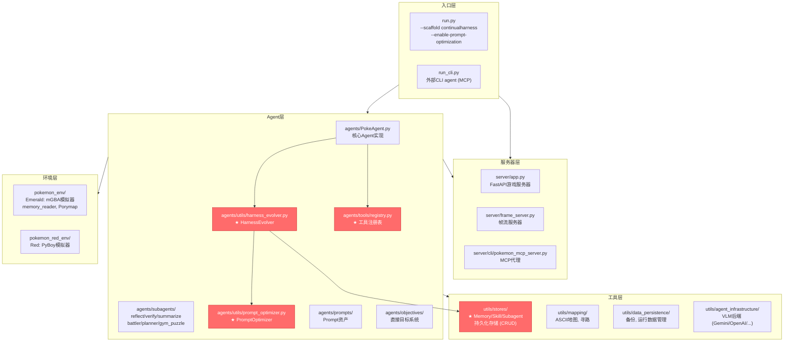

#### HarnessEvolver 运行时序图

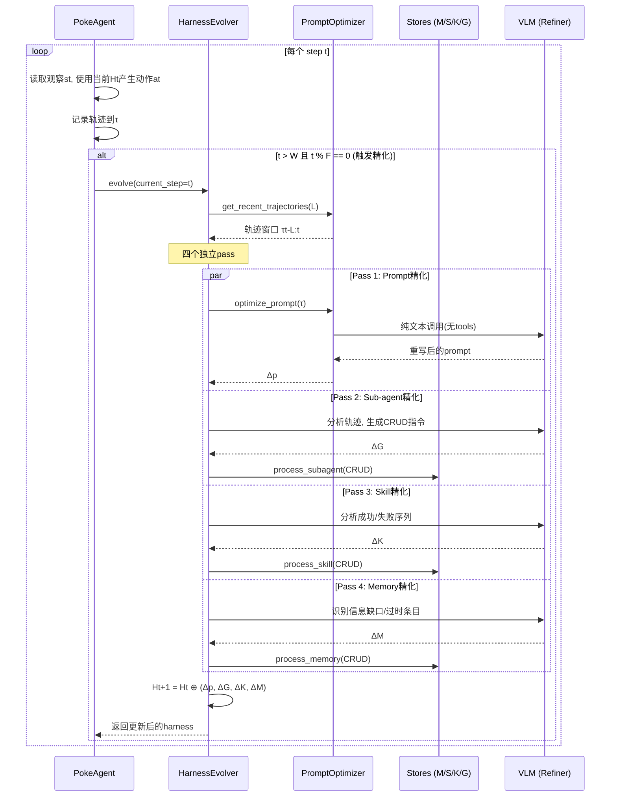

#### Scaffold 选择与工具可见性

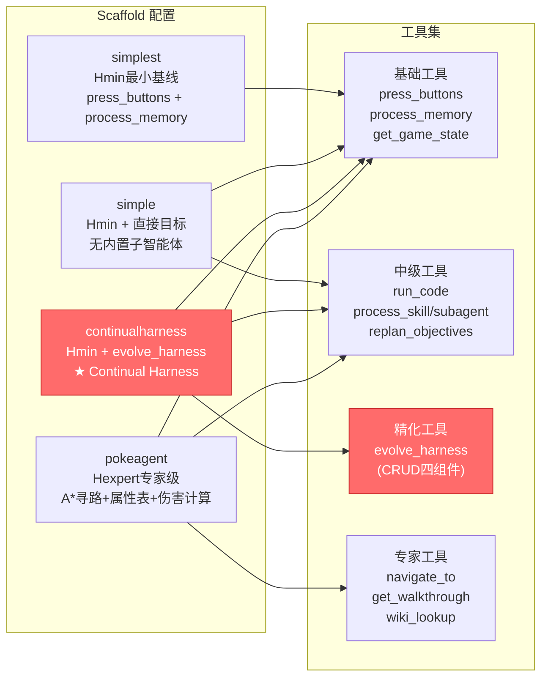

### 5.2 目录结构（文本）

```
continual-harness/
├── run.py                    # 主入口: 启动server + agent
├── run_cli.py                # 外部CLI agent入口 (MCP)
├── agents/
│   ├── PokeAgent.py          # 核心agent实现
│   ├── vision_only_agent.py  # 纯视觉agent
│   ├── subagents/            # reflect, verify, summarize, battler, planner, gym_puzzle
│   ├── utils/
│   │   ├── harness_evolver.py    # ★ 核心harness演化器
│   │   └── prompt_optimizer.py   # Prompt精化器
│   ├── objectives/           # 直接目标系统
│   ├── prompts/              # Prompt资产和路径助手
│   └── tools/
│       └── registry.py       # ★ 工具注册表(per-scaffold可用性)
├── server/
│   ├── app.py                # FastAPI游戏服务器
│   ├── frame_server.py       # 帧流服务器
│   └── cli/
│       └── pokemon_mcp_server.py  # MCP代理
├── pokemon_env/              # Emerald: mGBA模拟器, memory reader, Porymap
├── pokemon_red_env/          # Red: PyBoy模拟器, memory/map readers
├── utils/
│   ├── stores/               # ★ Memory/Skill/Subagent持久化存储
│   ├── mapping/              # ASCII地图, 寻路, Porymap
│   ├── data_persistence/     # 备份, 运行数据管理, LLM日志
│   ├── agent_infrastructure/ # VLM后端, CLI agent后端
│   └── metric_tracking/      # 会话读取, 服务器指标
├── System-Design/            # 架构设计文档
├── tests/                    # 测试套件
└── docs/                     # 文档
```

### 5.3 核心代码映射

#### 论文概念 → 代码实现对应

| 论文概念 | 代码实现 | 关键类/函数 |
|---------|---------|-----------|
| Hmin (最小harness) | `simplest` scaffold | `CUSTOM_AGENT_CONFIGS["simplest"]` |
| Hexpert (专家harness) | `pokeagent` scaffold | `CUSTOM_AGENT_CONFIGS["pokeagent"]` |
| HCH (Continual Harness) | `continualharness` scaffold | `CUSTOM_AGENT_CONFIGS["continualharness"]` |
| Refiner | `HarnessEvolver` | `agents/utils/harness_evolver.py` |
| Prompt 精化 (Δp) | `PromptOptimizer._evolve_prompt()` | `agents/utils/prompt_optimizer.py` |
| Sub-agent 精化 (ΔG) | `HarnessEvolver._evolve_subagents()` | `agents/utils/harness_evolver.py` |
| Skill 精化 (ΔK) | `HarnessEvolver._evolve_skills()` | `agents/utils/harness_evolver.py` |
| Memory 精化 (ΔM) | `HarnessEvolver._evolve_memory()` | `agents/utils/harness_evolver.py` |
| evolve_harness 工具 | `registry.py` 中的工具声明 | `agents/tools/registry.py` |
| 自适应频率 | `should_evolve()` | 早期每25步，后期每100步 |
| Bootstrap | `--bootstrap-from` 参数 | `run.py` + `utils/stores/bootstrap.py` |
| 轨迹窗口 | `read_last_jsonl_lines()` | `agents/subagents/utils/trajectory_window.py` |

### 5.4 关键代码设计分析

#### HarnessEvolver (核心)

```python
class HarnessEvolver:
    """Evolves all harness components: prompt, subagents, skills, memory."""

    def evolve(self, current_step, num_trajectory_steps=50):
        # 四个独立pass——一个失败不阻塞其他
        for name, fn in [
            ("prompt", lambda: self._evolve_prompt(current_step, num_trajectory_steps)),
            ("subagents", lambda: self._evolve_subagents(trajectories, current_step)),
            ("skills", lambda: self._evolve_skills(trajectories, current_step)),
            ("memory", lambda: self._evolve_memory(trajectories, current_step)),
        ]:
            try:
                results[name] = fn()
            except Exception as e:
                results[name] = {"error": str(e)}
```

**设计要点**:
- 四个 pass 独立运行，容错性好
- 使用同一个 text-only VLM 实例做 Refiner 调用
- 委托 PromptOptimizer 处理 prompt 级精化
- 自适应频率: `MIN_WARMUP_STEPS=25`, `EARLY_FREQUENCY=25`, `STABLE_FREQUENCY=100`

#### PromptOptimizer

```python
class PromptOptimizer:
    """Optimizes agent base prompt based on trajectory analysis."""
    # 加载 system prompt 让 optimizer 知道 agent 有什么工具
    # 创建独立的 text-only VLM 实例（无 tools）
    # 支持从 bootstrap 覆盖初始 prompt
```

**设计要点**:
- GEPA 风格的 prompt 演化
- 使用无 tools 的 VLM 做纯文本精化调用
- Bootstrap 支持: `initial_prompt_override` 参数

#### 工具注册表

```python
TOOL_REGISTRY  # 每个工具带 scaffolds 字段控制可见性

EXPERT_SCAFFOLDS = {"pokeagent", "autonomous_cli"}        # 专家级工具
NO_BUILTINS_SCAFFOLDS = {"simple", "continualharness"}    # 无内置子智能体
```

**设计要点**:
- Per-scaffold 工具可见性控制
- continualharness scaffold 只暴露通用 primitive (press_buttons, process_memory, run_code, process_subagent, process_skill 等)
- 不暴露专家级工具 (navigate_to, walkthrough, wiki)

### 5.5 代码质量评估

| 维度 | 评估 | 说明 |
|-----|------|------|
| 架构清晰度 | ★★★★ | 模块化好，scaffold 抽象清晰 |
| 可复现性 | ★★★★ | 多 seed 支持，配置完整，checkpoint/backup 机制完善 |
| 代码文档 | ★★★ | README 详细，但部分核心函数缺 docstring |
| 测试覆盖 | ★★★ | 有测试套件但未覆盖 harness evolution 逻辑 |
| 扩展性 | ★★★★ | 新 scaffold/model 后端添加简单，tool registry 可扩展 |

### 5.6 论文-代码一致性

| 论文描述 | 代码实现 | 一致性 |
|---------|---------|--------|
| 四组件 CRUD 精化 | HarnessEvolver 四个独立 pass | ✅ 完全一致 |
| 自适应频率 (F步后触发) | should_evolve() 自适应调度 | ✅ 一致 |
| Agent/Refiner 共享模型 | 同一 VLM 实例 | ✅ 一致 |
| Reset-free 更新 | 原地 Ht+1 = Ht ⊕ Δ | ✅ 一致 |
| Bootstrap 变体 | --bootstrap-from + enable-prompt-optimization 组合 | ✅ 一致 |
| Meta-tools (define_agent, run_code) | 工具注册表中的声明 | ✅ 一致 |
| DAgger+PRM 训练循环 | 训练代码未在主仓库中 | ⚠️ 论文有，代码库未包含训练管道 |

---

## 6. 相关工作

### 6.1 相关工作列表

| 论文/方法 | 年份 | 核心思想 | 与本文关系 |
|----------|-----|---------|-----------|
| GEPA (Agrawal et al.) | 2025 | 反射式 prompt 演化 | 本文的对比方法——仅优化 prompt，需 reset |
| Meta-Harness (Lee et al.) | 2026 | 端到端优化 model harness | 同期工作——优化 harness 但需完整 episode |
| Self-Refine (Madaan et al.) | 2023 | 迭代自反馈精化 | 本文的对比方法——局部反思，不编辑完整 harness |
| Reflexion (Shinn et al.) | 2023 | 语言 agent 的言语强化学习 | 本文的对比方法——反思在 episode 间 |
| Voyager (Wang et al.) | 2023 | 开放式具身 agent，自建工具 | 同期工作——自建工具但不联合优化 harness |
| PokeAgent Challenge (Karten et al.) | 2026 | 具身 RPG benchmark + 专家 harness | 本文的基础——提供评估环境和 Hexpert |
| DAgger (Ross et al.) | 2011 | 从专家策略在线学习 | 本文训练循环的理论基础 |
| Claude Code (Anthropic) | 2025 | 编程 agent scaffolding | 本文的参照——编程 harness 的成熟范式 |

### 6.2 本文与相关工作的区别

Continual Harness 的核心区别在于三个维度同时突破：**全组件联合优化**（vs 仅优化 prompt 或仅优化 memory）、**reset-free 在线更新**（vs episode 间 reset 更新）、**双时间尺度协同进化**（vs 仅训练模型或仅优化 harness）。

---

## 7. 局限性分析

### 7.1 论文声明的局限性

1. **能力地板**: Flash-Lite 全线翻车——模型若不够强，根本无法正确使用 refinement 出来的 harness 组件
2. **开源模型不够自闭环**: Gemma-4 (up to 31B) 还不够强，无法同时做 teacher 和 trainee
3. **协同学习循环未饱和**: 报告了持续里程碑推进但未建立收敛点
4. **残留差距**: 与专家 harness 的差距集中在对话密集的道馆内部和多回合战斗策略

### 7.2 发现的潜在问题

| 问题类型 | 描述 | 影响 |
|---------|-----|------|
| 方法层面 | 仅在 Pokémon 游戏上验证，泛化性未确认 | 不确定是否适用于其他具身场景（机器人、网页操作等） |
| 方法层面 | Refiner 和 Agent 共享同一模型，模型偏差会自我放大 | 可能陷入局部最优的 harness 状态 |
| 实验层面 | 24小时运行限制，长期演化行为未知 | 无法确认更长时间是否继续改进或收敛 |
| 实验层面 | DAgger+PRM 训练管道代码未开源 | 可复现性受限 |
| 应用层面 | 每个 step 需要 LLM 调用，成本可能很高 | 实际部署需考虑成本-收益平衡 |

### 7.3 未来工作方向

1. 跨任务 harness 迁移（Yellow Legacy → Crystal？）
2. Harness 版本控制与可解释性（像 git log 一样调试 agent）
3. 多 agent 共享 harness（群体学习新形式）
4. Capability floor 预测（不实跑即可判断模型是否在地板之下）
5. 跨域验证（SWE-bench、网页操作、机器人控制）

---

## 8. 个人评价

### 8.1 优点

1. **范式创新**: 首次将 harness 四元组作为统一可优化状态，提出"harness 作为可学习层"的范式，把 agent 研究焦点从"更大模型"转向"模型与动态 harness 的持续协同进化"
2. **Reset-free 设计的理论和实践意义**: 失败信息和修复在同一 trajectory 内累积，既有结构优势（可达深层失败），又贴合真实部署场景
3. **实验说服力强**: GPP 通关多款游戏的实证锚点 + 三种模型能力的梯度验证 + Dijkstra oracle 对照的 skill 自改进测量
4. **诚实的负面结果报告**: Flash-Lite 翻车结果的公开报告，给领域提供健康提醒

### 8.2 不足

1. **评估范围窄**: 仅 Pokémon RPG，未在其他具身场景验证泛化性
2. **训练管道不完整开源**: DAgger+PRM 部分代码未包含在仓库中
3. **Refiner 质量缺乏量化分析**: 四个 pass 的具体贡献缺乏独立消融
4. **成本分析不够深入**: 未报告 Refiner 调用本身的 API 成本

### 8.3 适用场景

- 长时序、部分可观测的具身任务（游戏、机器人导航、运维）
- 部署环境不支持 reset 的实际场景
- 需要自动构建和迭代脚手架的 agent 开发
- 开源模型与前沿模型的协同训练

### 8.4 不适用场景

- 模型能力在地板以下的场景（Flash-Lite 级别）
- 短 episode、可免费 reset 的场景（传统 prompt 优化即可）
- 对成本极度敏感的场景（Refiner 调用需要额外 LLM 推理）

---

## 9. 启发与思考

### 9.1 技术启发

1. **Harness 是可学习的层**: 传统观点把 harness 视为固定的工程产物，Continual Harness 证明它可以作为与模型权重并列的学习对象——这改变了 agent 系统的设计范式
2. **双时间尺度是人类学习的本质映射**: "做事时改方法，做完一批后更新世界模型"——这个框架可能适用于更广泛的 AI 系统设计
3. **涌现行为的真实性**: GPP 中模型自建工具、命名策略、写真值表的行为，不是 prompt 工程的结果，而是 agent 面对 episode 深处失败的结构化响应

### 9.2 可借鉴之处

1. **对 AI Agent 工程的启示**: 构建 agent 时应优先投入可在线迭代、模型可控的 harness 设计，而非仅关注模型能力提升
2. **对评估方法的启示**: 当前静态 benchmark 无法捕捉 self-refinement 能力，需要设计能测量自精化能力的长时序、reset-scarce 基准
3. **对训练范式的启示**: 模型-Harness 联合优化可能是开源模型追赶前沿模型的有效路径

### 9.3 潜在改进方向

1. **跨域泛化验证**: 将框架迁移到 SWE-bench、网页操作、机器人控制等场景
2. **Refiner 质量保障**: 引入 Refiner 输出验证机制，避免自我放大偏差
3. **分层 Refiner 架构**: 不同能力的模型可以承担不同复杂度的 Refiner 角色
4. **Harness 迁移学习**: 研究 harness 跨任务/跨模型的迁移效率

### 9.4 后续行动

- [ ] 深入阅读 GEPA 和 Meta-Harness 论文，对比 prompt 优化方法
- [ ] 复现 Continual Harness 在 Pokémon Red 上的 from-scratch 实验
- [ ] 尝试将 harness 四元组设计迁移到编程 agent 场景
- [ ] 设计测量 self-refinement 能力的评估指标

---

## 参考文献

```bibtex
@article{karten2026continual,
  title={Continual Harness: Online Adaptation for Self-Improving Foundation Agents},
  author={Karten, Seth and Zhang, Joel and Upaa Jr, Tersoo and Feng, Ruirong and Li, Wenzhe and Shi, Chengshuai and Jin, Chi and Vodrahalli, Kiran},
  journal={arXiv preprint arXiv:2605.09998},
  year={2026}
}

@article{karten2026pokeagent,
  title={The PokeAgent Challenge: Competitive and Long-Context Learning at Scale},
  author={Karten, Seth and Grigsby, Joel and others},
  journal={arXiv preprint arXiv:2603.15563},
  year={2026}
}

@article{agrawal2025gepa,
  title={GEPA: Reflective Prompt Evolution Can Outperform Reinforcement Learning},
  author={Agrawal, L.A. and Tan, S. and others},
  journal={arXiv preprint arXiv:2507.19457},
  year={2025}
}

@article{lee2026meta,
  title={Meta-Harness: End-to-End Optimization of Model Harnesses},
  author={Lee, Y. and Nair, R. and others},
  journal={arXiv preprint arXiv:2603.28052},
  year={2026}
}

@inproceedings{ross2011dagger,
  title={A Reduction of Imitation Learning and Structured Prediction to No-Regret Online Learning},
  author={Ross, S. and Gordon, G. and Bagnell, D.},
  booktitle={AISTATS},
  year={2011}
}

@article{wang2023voyager,
  title={Voyager: An Open-Ended Embodied Agent with Large Language Models},
  author={Wang, G. and others},
  journal={arXiv preprint arXiv:2305.16291},
  year={2023}
}

@inproceedings{shinn2023reflexion,
  title={Reflexion: Language Agents with Verbal Reinforcement Learning},
  author={Shinn, N. and others},
  booktitle={NeurIPS},
  year={2023}
}

@inproceedings{madaan2023selfrefine,
  title={Self-Refine: Iterative Refinement with Self-Feedback},
  author={Madaan, A. and others},
  booktitle={NeurIPS},
  year={2023}
}
```

---

## 附录

### A. 关键图表

| Figure | 描述 | 报告内位置 |
|--------|------|-----------|
| Figure 1 | Continual Harness 三种演进模式 | Section 3.2 |
| Figure 2 | 方法论概览 (a) harness refinement (b) DAgger+PRM | Section 3.2 |
| Figure 3 | Yellow Legacy CRUD 操作分布 | Section 4.2 |
| Figure 4 | battle_strategist_agent 决策复杂度演化 | Section 4.2 |
| Figure 5 | 里程碑达成 vs 累积按键数 | Section 4.2 |
| Figure 6 | Emerald 成本-完成度 Pareto 平面 | Section 4.2 |
| Figure 7 | Reset-free DAgger+PRM 训练持续里程碑推进 | Section 4.4 |
| Figure 8 | 寻路 skill 朝 Dijkstra oracle 自我改进 | Section 4.3 |

### B. 流程图索引

| 图表 | 描述 | 报告内位置 |
|------|------|-----------|
| 双循环架构总览 | 内层Agent行动 + 外层Refiner编辑 + 联合学习循环 | Section 3.2 |
| 四组件 CRUD 编辑详情 | Prompt/Sub-agents/Skills/Memory 四个 pass 的编辑流程 | Section 3.2 |
| 自适应精化频率 | Warmup → 早期精化(每25步) → 稳定精化(每100步) | Section 3.2 |
| 能力地板与 Harness 增益 | Pro/Flash/Flash-Lite 三档模型的效果对比 | Section 4.2 |
| 代码架构图 | 入口层/服务器层/Agent层/环境层/工具层 | Section 5.2 |
| HarnessEvolver 运行时序图 | Agent 与 Evolver 的交互时序 | Section 5.2 |
| Scaffold 选择与工具可见性 | 四种 scaffold 的工具集差异 | Section 5.2 |
| Continual Harness 完整运行视图 | 从启动到持续演化的端到端流程 | Appendix D |

### C. 补充材料

- 论文附录包含：Pokémon 环境详情、GPP 额外证据、Harness 消融实验、训练设置与结果
- Battle-agent 演化 checkpoint 的 Mermaid 决策图
- Power Plant 路线循环案例研究

### D. Continual Harness 完整运行视图

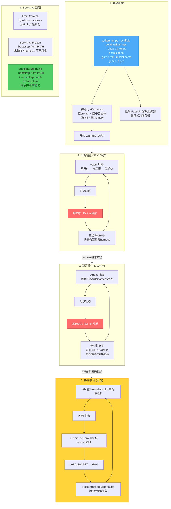

#### 与现有方法的核心区别

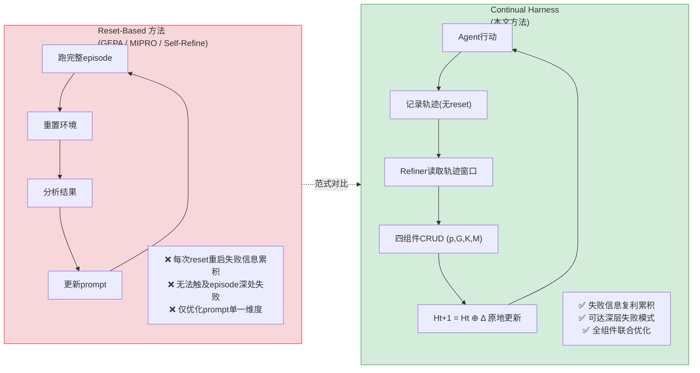

### E. 调研信息

- 调研人: henryhu
- 调研时间: 2026-05-30
- 论文版本: arXiv:2605.09998v1 (2026-05-11)
- 参考来源: 论文PDF原文 + GitHub 代码仓库 + 微信公众号分析文章
- 图片来源: 论文PDF页面渲染截图

---

*模板版本: v1.0 (论文+代码综合调研)*
