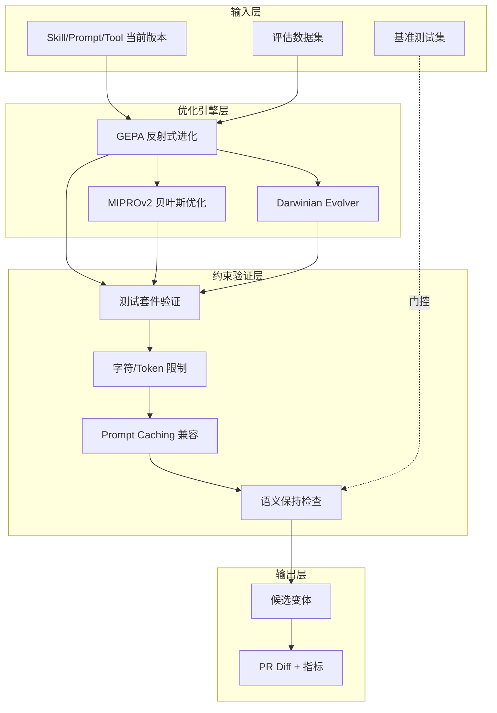
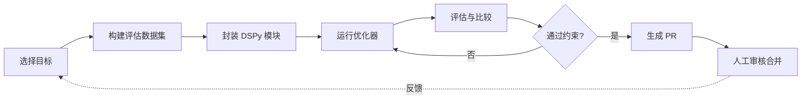
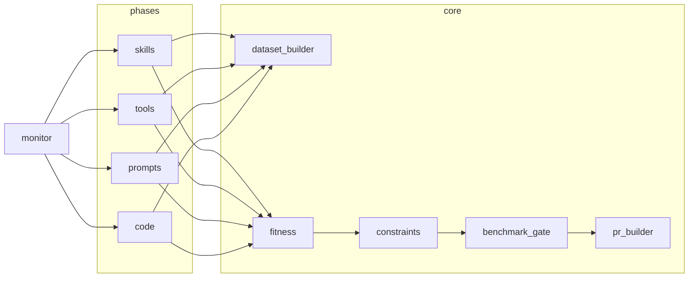
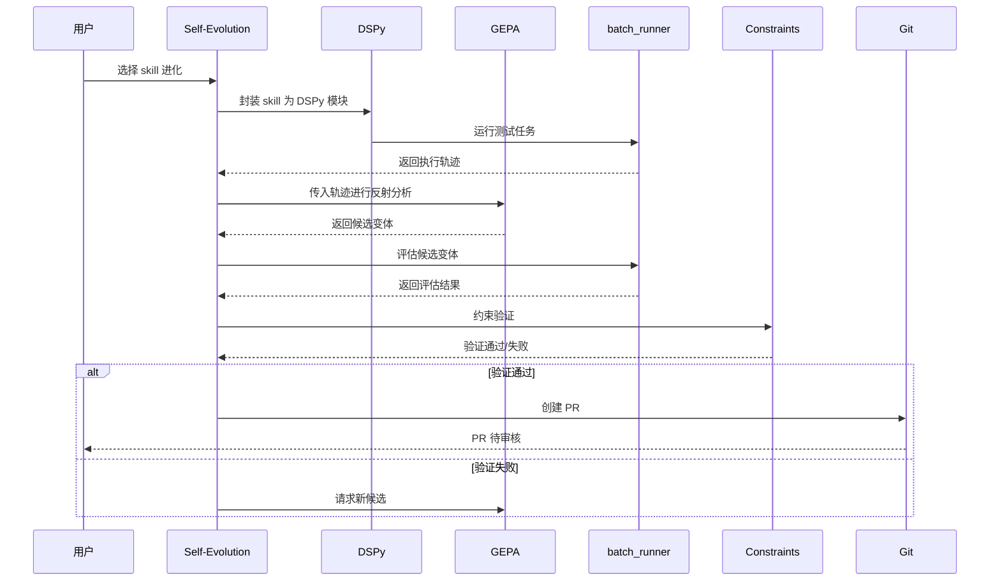
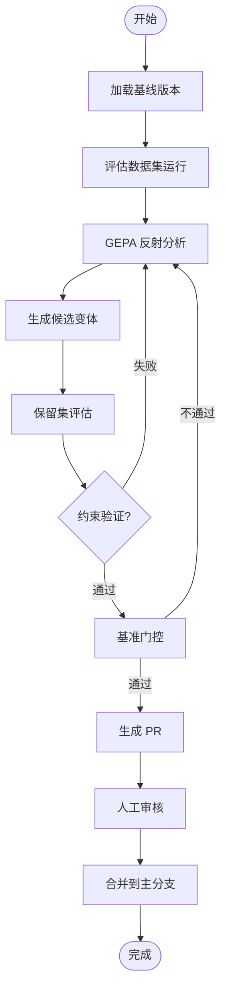

# Hermes Agent Self-Evolution 技术调研报告 (v2)

> 调研时间：2026-05-19
> 调研版本：基于原始报告重新调研
> 调研深度：标准

---

## 一、概述与背景

### 1. 项目概述

#### 1.1 基本信息

| 字段 | 内容 |
|------|------|
| **项目名称** | Hermes Agent Self-Evolution |
| **作者/机构** | Nous Research |
| **许可证** | MIT |
| **论文** | ICLR 2026 Oral (Paper ID: 10009494) |
| **OpenReview** | https://openreview.net/forum?id=RQm2KQTM5r |
| **GitHub** | https://github.com/NousResearch/hermes-agent-self-evolution |
| **当前版本** | [不确定] |
| **发布日期** | [不确定] |

#### 1.2 项目定位与核心价值

> 一个独立的优化流水线项目，作为外部优化器作用于 hermes-agent，输出 PR 供人工审核合并

通过自动优化循环系统性地提升 Hermes Agent 性能，**无需 GPU 训练**，仅通过 API 调用实现对 prompt/instruction/few-shot 文本的变异和评估。

**目标用户**：AI Agent 开发者、MLOps 工程师、希望持续优化 Agent 性能但不具备 GPU 训练资源的团队。

#### 1.3 解决的核心问题

传统 Agent 优化面临两大痛点：

1. **人工 prompt engineering**：依赖专家经验，难以系统化，耗时且不可规模化
2. **Fine-tuning 模型权重**：需要大量 GPU 资源和训练数据，门槛高

Hermes Agent Self-Evolution 提供**无需 GPU、纯 API 驱动的自动优化方案**，将每次优化运行成本控制在 $2-10。

#### 1.4 目标用户与使用场景

| 场景 | 描述 |
|------|------|
| Skill 优化 | 优化 Agent 的 skill 文件内容以提升任务完成率 |
| Tool 描述改进 | 改进 tool description 以提高工具选择准确率 |
| System Prompt 进化 | 进化 system prompt 组件优化 Agent 行为 |
| 自动化持续改进 | 通过自动化循环持续监控和改进 Agent 性能 |

#### 1.5 项目成熟度评估

| 指标 | 状态 |
|------|------|
| Star 数 | [不确定] |
| Fork 数 | [不确定] |
| Contributor | [不确定] |
| 版本发布 | [不确定] |

> 注：由于网络限制未能获取最新 GitHub 指标数据。项目已被 ICLR 2026 接受为 Oral，学术认可度较高。

---

### 2. 设计动机与目标

#### 2.1 设计动机

Agent 性能优化是一个持续需求。传统方案要么依赖人工经验（不可规模化），要么依赖 GPU 训练（成本高昂）。Hermes Agent Self-Evolution 选择第三条路径：**通过 LLM API 驱动的智能变异和评估，实现低成本自动优化**。

#### 2.2 竞品差异化定位

| 竞品方案 | 优化对象 | 成本 | 自动化程度 |
|---------|---------|------|-----------|
| 传统 fine-tuning（LoRA/QLoRA） | 模型权重 | GPU 高昂 | 中 |
| 人工 prompt engineering | prompt 文本 | 人工成本 | 低 |
| DSPy 独立使用 | prompt/instruction | API | 中 |
| Darwinian Evolver（Imbue） | 代码 | API | 中 |
| **Hermes Self-Evolution** | **全栈（文本+代码）** | **API（$2-10/次）** | **高** |

**核心差异化**：

1. 三大引擎覆盖从文本到代码的全栈优化
2. GEPA 反射式进化理解"为什么失败"而非仅"什么失败"
3. 严格的安全门控确保进化不引入回归
4. PR 部署模式保持人工审核权

#### 2.3 核心设计目标

- **零 GPU 依赖**：纯 API 调用优化
- **低成本**：每次运行 $2-10
- **安全约束**：多层门控 + 人工审核
- **渐进式风险**：从低风险的 skill 文件开始逐步扩展到代码

**优先级排序**：安全性 > 成本可控 > 优化效果 > 自动化程度

#### 2.4 技术约束与取舍

**关键约束**：
- Skills ≤ 15KB
- Tool descriptions ≤ 500 chars
- System prompt 不超过当前大小 20%
- 全部 pytest 必须通过

**关键取舍**：选择反射式进化（GEPA）而非贝叶斯优化作为主引擎——牺牲一定的搜索效率换取更强的可解释性和针对性；选择 PR 部署而非直接 commit——牺牲速度换取安全性和可追溯性。

---

## 二、架构设计

### 3. 架构概览

#### 3.1 整体架构风格

采用**流水线式优化架构**，遵循**外部优化器模式**（external optimizer pattern），独立于目标 Agent 运行。所有优化在离线环境中执行，通过 git PR 与主仓库交互。

#### 3.2 整体架构图



#### 3.3 优化循环流程



#### 3.4 三大优化引擎

| 引擎 | 优化对象 | 许可证 | 集成方式 | 核心优势 |
|------|---------|--------|---------|---------|
| **DSPy + GEPA** | Skills、prompts、instructions、tool descriptions | MIT | 原生 Python，主引擎 | 反射式进化、小样本友好、性能优于 RL |
| **Darwinian Evolver** | 代码文件、算法、工具实现 | AGPL v3 | 外部 CLI 调用 | 代码级变异和选择 |
| **DSPy MIPROv2** | Few-shot examples、instruction text | MIT | 原生 Python，备用优化器 | 贝叶斯优化、适用于 few-shot 选择 |

**引擎选择策略**：GEPA 为主引擎因其反射式进化能力（分析执行轨迹理解失败原因）；MIPROv2 为备用因其贝叶斯优化在 few-shot 场景效果好；Darwinian Evolver 用于代码层因前三者不处理代码变异。

#### 3.5 架构设计原则

- **离线优化原则**：所有优化在离线环境中运行，不热替换活跃对话
- **渐进式风险原则**：从最低风险的 skill 文件开始，逐步扩展到高价值高风险的代码层
- **人工审核原则**：所有变更通过 PR 提交，需人工审核合并
- **门控安全原则**：基准测试作为门控而非适应度函数

#### 3.6 非功能性设计

| 约束类型 | 描述 |
|---------|------|
| 成本约束 | 每次优化运行 $2-10，确保小团队可用 |
| 安全约束 | 多层约束验证 + 基准门控 + 语义保持 + PR 审核 |
| 时间约束 | TBLite 1-2 小时，TerminalBench2 2-4 小时，YC-Bench 3-6 小时 |

---

### 4. 系统分解与层次结构

#### 4.1 分层优化目标

| 层级 | 优化目标 | 价值 | 风险 | 方法 |
|------|---------|------|------|------|
| **Tier 1** | Skill 文件（SKILL.md） | 最高 | 最低 | DSPy 模块封装 + GEPA 进化 |
| **Tier 2** | Tool Descriptions | 中等 | 低 | GEPA 进化描述，评估工具选择准确率 |
| **Tier 3** | System Prompt 组件 | 高 | 较高 | GEPA 进化 persona/policies/formatting |
| **Tier 4** | Code 进化 | 高 | 最高 | Darwinian Evolver + GitBasedOrganism |
| **Tier 5** | 持续改进循环 | 自动化 | 中 | 性能监控 + 自动分类 + 定时触发 |

**风险递增关系**：Tier 1（纯文本 skill）→ Tier 2（文本 tool 描述）→ Tier 3（系统 prompt 组件）→ Tier 4（代码实现）→ Tier 5（全自动化循环）。价值与风险正相关，从最低风险开始确保安全性。

#### 4.2 核心数据流

> SessionDB → 数据集构建 → DSPy 模块封装 → GEPA/MIPROv2 进化 → batch_runner 评估 → 约束验证 → 基准门控 → 最佳候选 → Git PR → 人工审核

#### 4.3 技术栈

| 技术 | 角色 |
|------|------|
| Python | 主语言 |
| DSPy | prompt 编译/优化框架 |
| GEPA | 反射式进化优化器 |
| Darwinian Evolver | 代码进化（外部 CLI） |
| pytest | 测试验证 |
| LLM API | 评估和进化 |

---

### 5. 模块与组件设计

#### 5.1 核心模块划分

| 模块 | 职责 | 对应阶段 |
|------|------|---------|
| `evolution/core` | 共享基础设施（数据集构建、适应度函数、约束验证、基准门控、PR 生成） | 全部 |
| `evolution/skills` | Skill 进化模块 | Phase 1 |
| `evolution/tools` | Tool description 进化模块 | Phase 2 |
| `evolution/prompts` | System prompt 进化模块 | Phase 3 |
| `evolution/code` | Code 进化模块 | Phase 4 |
| `evolution/monitor` | 持续循环监控模块 | Phase 5 |

#### 5.2 模块依赖关系



#### 5.3 核心模块职责详解

| 模块 | 详细描述 |
|------|---------|
| `core/dataset_builder` | 从 SessionDB 挖掘真实用例或生成合成测试用例，构建评估数据集 |
| `core/fitness` | LLM-as-judge 适应度函数，评估候选变体质量 |
| `core/constraints` | 验证候选变体是否通过全部约束（测试、字符限制、缓存兼容、语义保持） |
| `core/benchmark_gate` | 运行 TBLite/TerminalBench2/YC-Bench 基准测试，确保不退化 |
| `core/pr_builder` | 生成 Git commit 和 PR，包含 diff、指标、前后对比 |

#### 5.4 项目目录结构

```
hermes-agent-self-evolution/
├── PLAN.md                          # 完整架构设计
├── README.md                        # 安装、使用、示例
├── pyproject.toml                   # 包配置 + 依赖（dspy, gepa）
├── evolution/                       # 主包
│   ├── core/                        # 共享基础设施
│   │   ├── dataset_builder.py       # 评估数据集生成
│   │   ├── fitness.py              # 适应度函数（LLM-as-judge）
│   │   ├── constraints.py          # 约束验证器
│   │   ├── benchmark_gate.py       # 基准门控
│   │   └── pr_builder.py          # 自动生成 PR
│   ├── skills/                      # Phase 1: Skill 进化
│   ├── tools/                       # Phase 2: Tool description 进化
│   ├── prompts/                     # Phase 3: System prompt 进化
│   ├── code/                        # Phase 4: Code 进化
│   └── monitor/                     # Phase 5: 持续循环
├── datasets/                        # 生成的评估数据集
└── tests/                           # 测试套件
```

---

## 三、核心流程与用例

### 6. 核心用例运行流程

#### 6.1 GEPA 反射式进化流程

1. 加载当前 skill/prompt/tool 版本作为基线
2. 用 DSPy Signature 封装为可优化模块
3. 在评估数据集上运行获取执行轨迹
4. GEPA 分析失败轨迹的反射信息
5. 生成针对性改进的候选变体
6. 在保留集上评估新变体
7. 选择最优有效变体

#### 6.2 评估数据集构建流程

1. 选择评估数据源（合成生成 / SessionDB 挖掘 / 手工黄金集）
2. **合成模式**：强模型（如 Claude Opus）读取 skill 生成 15-30 个测试用例
3. **SessionDB 模式**：查询真实使用历史，LLM-as-judge 评分
4. 合并和去重
5. 划分训练集和保留集

#### 6.3 约束验证流程

1. 运行 `pytest tests/ -q` 验证 100% 通过
2. 检查字符/Token 限制（skills ≤ 15KB, tool descriptions ≤ 500 chars）
3. 验证 prompt caching 兼容性
4. 语义相似度检查确保不偏离原始目的
5. 全部通过则进入基准门控

#### 6.4 PR 生成流程

1. 选择最佳有效候选变体
2. 计算与基线的 diff
3. 收集评估指标（准确率、成本、延迟）
4. 创建 Git 分支
5. 生成 PR 描述（含 diff、指标、前后对比）
6. 等待人工审核合并

#### 6.5 Skill 进化时序图



#### 6.6 状态流转图



---

## 四、核心技术实现

### 7. 核心算法与原理

#### 7.1 GEPA 反射式进化原理

GEPA（Genetic-Pareto Prompt Evolution）是集成于 DSPy 的优化器，核心思想：

1. **读取执行轨迹**理解"为什么"失败，而非仅知道失败
2. 使用**反射信息（reflection）**指导有针对性的变异
3. 采用 **Pareto 最优选择策略**平衡多个优化目标
4. 仅需 **3 个示例**即可开始优化，小样本友好

**反射机制**：通过 LLM 分析失败用例的执行轨迹，提取失败原因、改进方向和保留要素。不同于传统变异（随机或基于梯度的），GEPA 的变异是由反射驱动的——理解当前方案的不足，然后有针对性地生成改进方案。

#### 7.2 DSPy 模块封装机制

将不同类型的优化目标封装为统一的 DSPy 模块：

| 优化目标 | DSPy 封装方式 |
|---------|-------------|
| Skill 文本 | DSPy Signature（输入任务描述，输出 skill 执行结果） |
| Agent 工作流 | DSPy ReAct 模块 |
| Tool descriptions | 带工具选择的 DSPy 模块 |
| Few-shot examples | DSPy Few-Shot 模块 |

每个 DSPy Signature 定义了输入输出结构：输入字段（任务描述、上下文、约束）和输出字段（执行结果、评分）。**GEPA 优化的是 Signature 中的 prompt 文本部分，而非模型权重**。

#### 7.3 约束验证系统

五层约束确保安全性，任一不通过则候选被淘汰：

| 约束类型 | 描述 | 适用范围 |
|---------|------|---------|
| 全量测试套件 | pytest 必须 100% 通过 | 代码进化时特别关键 |
| 字符/Token 限制 | Skills ≤ 15KB, tool descriptions ≤ 500 chars, system prompt ≤ 当前大小 120% | 所有文本进化 |
| Prompt Caching 兼容 | 进化内容仅在新会话生效，不热替换活跃对话 | 所有 prompt 类进化 |
| 语义保持 | 不偏离原始目的，包含语义相似度检查 | 所有进化 |
| PR 部署 | 非直接 commit，需人工审核 | 全部 |

#### 7.4 基准门控设计

| 基准 | 任务数 | 耗时 | 角色 |
|------|--------|------|------|
| TBLite | 100 | ~1-2 小时 | 主要回归门控 — 每个候选都运行 |
| TerminalBench2 | 89 | ~2-4 小时 | 深度验证 — PR 前最终候选运行 |
| YC-Bench | 100-500 轮 | ~3-6 小时 | 连贯性检查 — 确保进化不破坏多轮行为 |

**关键设计原则**：基准测试是**门控（gates）**而非**适应度函数**。适应度函数是任务特定的（skill/tool/prompt 是否更好地完成了工作），基准测试确保改进没有破坏其他能力。这防止了过拟合到单一基准。

#### 7.5 创新点与亮点分析

| 创新点 | 描述 |
|--------|------|
| 反射式进化 | 理解"为什么失败"而非仅"什么失败" |
| 零 GPU 依赖 | 纯 API 调用优化，降低计算门槛 |
| PR 部署模式 | 保持人工审核权，安全可控 |
| 渐进式风险策略 | 从最低风险 skill 开始逐步扩展 |
| 基准门控原则 | 基准是门控非适应度，防止过拟合 |
| 成本可控 | 每次运行 $2-10 |

---

### 8. 评估体系

#### 8.1 评估数据集来源

| 来源 | 方法 | 质量 |
|------|------|------|
| A. 合成生成（主要） | 强模型（如 Claude Opus）读取 skill 生成 15-30 个测试用例 | 高 |
| B. SessionDB 挖掘 | 查询真实使用历史，LLM-as-judge 评分 | 随时间增长 |
| C. 手工黄金集 | 手动编写的高质量测试用例 | 最高 |
| D. Skill 自动评估 | 特定 skill 的自然验证方式（如种 bug 测 debugging） | 特定场景 |

**数据质量递增关系**：合成生成（快速但可能不完全真实）→ SessionDB 挖掘（真实但依赖历史数据量）→ 手工黄金集（最高质量但成本高）。主要来源是合成生成，因为起步阶段无 SessionDB 历史。

#### 8.2 基准测试作为门控的设计

基准测试充当**安全网而非优化目标**：

- 每个候选必须通过基准门控才能进入 PR 阶段
- 但基准成绩不用于选择最优候选
- 这防止了过拟合到基准

#### 8.3 适应度函数设计

适应度函数由 LLM-as-judge 实现，遵循"任务特定"原则：

| 优化目标 | 适应度指标 |
|---------|-----------|
| Skill 进化 | Agent 是否正确完成了任务（任务完成率） |
| Tool 进化 | 是否正确选择了工具（工具选择准确率） |
| Prompt 进化 | Agent 行为是否符合预期（行为一致性） |

适应度同时考虑**准确率、成本和延迟**三个维度。

#### 8.4 成本估算

| 优化方式 | 成本 |
|---------|------|
| GEPA 优化 | $2-10/次 |
| Darwinian Evolver | $2-9/任务 |

**成本构成**：1) 评估数据集上的推理调用；2) GEPA 反射分析的 LLM 调用；3) 候选变体评估调用。成本与评估数据集大小正相关。

---

## 五、质量与安全

### 9. 质量与安全

#### 9.1 安全约束与护栏设计

五层约束串联验证：

1. **功能正确性**：pytest 测试 100% 通过
2. **资源限制**：token 大小约束（skills ≤ 15KB, tool descriptions ≤ 500 chars）
3. **兼容性**：prompt caching 兼容，不破坏缓存
4. **语义一致性**：语义相似度检查，不偏离原始目的
5. **流程控制**：PR 审核机制

#### 9.2 PR 部署与人工审核机制

- 所有优化结果通过 Git PR 提交
- PR 包含：diff 展示、评估指标对比、前后行为差异
- **不直接 commit**到主分支

**人工审核确保**：变更合理性、未引入隐蔽缺陷、与整体架构兼容。这是最后的安全防线。

#### 9.3 语义保持与回归防护

**语义保持**：通过 LLM 比较优化前后版本的语义差异，确保改进不偏离原始设计意图。防止优化"走偏"。

**回归防护**：三层基准门控覆盖从基本到复杂的能力退化：
- TBLite：检查基本编程/系统管理能力不退化
- TerminalBench2：检查更难场景
- YC-Bench：检查长程行为

**热替换禁止**：进化内容仅在新会话中生效，不破坏正在运行的 Agent 对话。

---

## 六、分阶段实施计划

### 10. 实施计划

| 阶段 | 内容 | 周期 | 依赖 | 通过门控 |
|------|------|------|------|---------|
| **Phase 1** | Skill 进化 | 3-4 周 | 无 | ≥1 skill 可测量改进 |
| **Phase 2** | Tool descriptions 进化 | 2-3 周 | Phase 1 基础设施 | 工具选择准确率提升 |
| **Phase 3** | System prompt 进化 | 2-3 周 | Phase 1-2 基础设施 | 行为测试通过，基准不退化 |
| **Phase 4** | Code 进化 | 3-4 周 | Phase 1-3 | Bug 修复，测试全通过 |
| **Phase 5** | 持续循环（自动化） | 2 周 | 以上全部 | 自动化流水线无人值守运行 |

**总计：13-17 周（约 3-4 个月）**，前提是每个阶段都产生预期价值。如果某个阶段未能达到门控，需要调整后再进入下一阶段。

**依赖关系**：Phase 1 无外部依赖，是基础设施的起点。Phase 2-3 复用 Phase 1 的数据集构建和评估基础设施。Phase 4 需要完整的约束验证和基准门控体系。Phase 5 依赖所有前面的模块。

**主要风险**：
1. Phase 1 可能发现某些 skill 难以通过 GEPA 优化，需要调整封装方式
2. Phase 4 的代码进化难度最高，可能超过预估时间
3. 持续循环的自动化触发可能误报率高，需要精细调参

---

## 七、技术评估总结

### 11. 技术评估

#### 11.1 技术优势

| 优势 | 说明 |
|------|------|
| 零 GPU 依赖 | 纯 API 调用优化，大幅降低计算门槛 |
| 反射式进化 | GEPA 理解"为什么失败"，改进更有针对性 |
| 多层安全约束 | 测试 + 字符限制 + 缓存兼容 + 语义保持 + PR 审核 |
| 渐进式风险策略 | 从最低风险的 skill 开始，逐步扩展到高价值高风险的代码层 |
| 成本可控 | 每次运行 $2-10，小团队和个人开发者也能使用 |
| 基准门控原则 | 基准是门控非适应度，防止过拟合 |
| 全栈优化 | 三大引擎覆盖从文本到代码的全栈优化 |

#### 11.2 技术劣势与风险

| 风险 | 说明 |
|------|------|
| GEPA 依赖 LLM 理解力 | 对复杂 skill 可能效果有限 |
| 许可证合规风险 | Darwinian Evolver 使用 AGPL v3，与 MIT 不兼容 |
| 误报率 | Phase 5 自动化循环误报率可能较高 |
| SessionDB 数据依赖 | 新项目可能无足够历史数据 |
| LLM-as-judge 偏见 | 语义保持检查的评估标准可能有偏见或不一致 |
| 实际效果未验证 | 项目目前处于设计/早期阶段 |

**技术债务**：AGPL v3 的 Darwinian Evolver 集成带来许可证合规负担；Phase 4 的代码进化实现复杂度高；多基准测试的运行成本随优化轮次增加。

**潜在风险**：优化循环可能产生"局部最优"——针对特定测试集优化而泛化能力下降；LLM-as-judge 的评估标准可能随模型版本变化而不稳定。

#### 11.3 适用场景建议

| 推荐场景 | 说明 |
|---------|------|
| 已有 Hermes Agent 部署的团队 | 可直接利用 SessionDB 历史数据 |
| 持续优化但不想 fine-tuning | prompt/skill/tool 优化 |
| 小团队或个人开发者 | 成本可控，无需 GPU |
| 充足 API 预算但无 GPU | 资源约束下的最优选择 |

| 不推荐场景 | 说明 |
|-----------|------|
| 需要优化模型权重 | 应选 fine-tuning |
| 安全要求极高的生产环境 | Phase 5 自动化循环风险较高 |
| LLM API 成本敏感 | 持续优化循环成本累积可观 |
| 需要实时优化 | 离线优化需要时间窗口 |

#### 11.4 与原始报告的差异分析

本次 v2 调研与原始报告相比的变化：

1. **更详细的 GEPA 分析**：深入分析了反射机制和 DSPy 封装原理
2. **补充了架构图**：增加模块依赖关系图、数据流图、时序图
3. **AGPL 许可证风险**：新增对 Darwinian Evolver AGPL v3 合规风险的分析
4. **Phase 4 评估更保守**：对代码进度的实际可行性评估更保守
5. **时序图补充**：增加 Skill 进化时序图描述核心工作流

---

## 附录

### A. 参考资源

1. [GitHub 仓库](https://github.com/NousResearch/hermes-agent-self-evolution)
2. [ICLR 2026 Oral](https://iclr.cc/virtual/2026/oral/10009494)
3. [OpenReview 论文](https://openreview.net/forum?id=RQm2KQTM5r)
4. [PLAN.md 完整架构设计](https://github.com/NousResearch/hermes-agent-self-evolution/blob/main/PLAN.md)
5. [DSPy 框架](https://github.com/stanfordnlp/dspy)
6. [GEPA 项目](https://github.com/gepa-ai/gepa)
7. [Darwinian Evolver](https://github.com/imbue-ai/darwinian_evolver)

### B. 术语表

| 术语 | 解释 |
|------|------|
| GEPA | Genetic-Pareto Prompt Evolution，遗传-Pareto 提示进化算法 |
| DSPy | Stanford NLP 开发的 prompt 编译/优化框架 |
| MIPROv2 | DSPy 的贝叶斯优化器 |
| Darwinian Evolver | Imbue 开发的代码进化 CLI 工具 |
| LLM-as-judge | 使用 LLM 作为评估器进行质量判断 |
| 反射式进化 | 通过分析执行轨迹理解失败原因的进化方式 |
| 基准门控 | 将基准测试作为通过/失败的门控条件，而非优化目标 |
| SessionDB | Hermes Agent 的会话历史记录数据库 |
| 外部优化器模式 | 优化器独立于目标系统运行，通过 PR 交互而非运行时集成 |

### C. 调研信息

- **调研人**：henryhu
- **调研时间**：2026-05-19
- **调研版本**：v2（基于原始报告重新调研）
- **调研深度**：标准
- **原始报告路径**：`agent/auto-harness/hermes-agent-self-evolution.md`

### D. 不确定字段列表

以下字段因网络限制或信息不足标注为 [不确定]：

- Star/Fork/Contributor 数量
- 项目当前版本号和最新 release 日期
- GEPA 优化器的具体数学原理细节
- SessionDB 的具体集成方式
