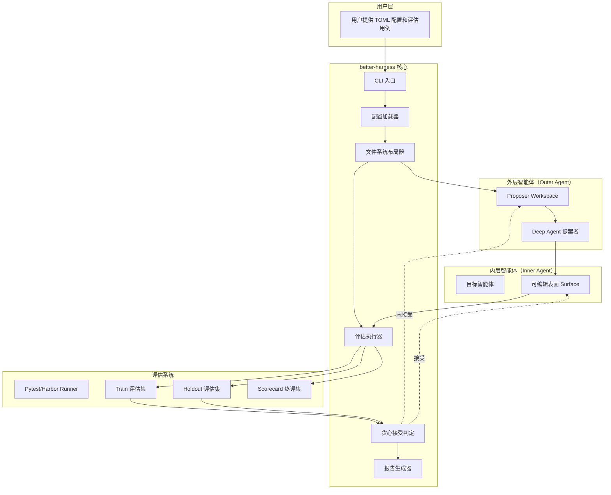
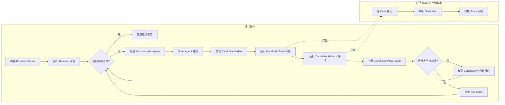
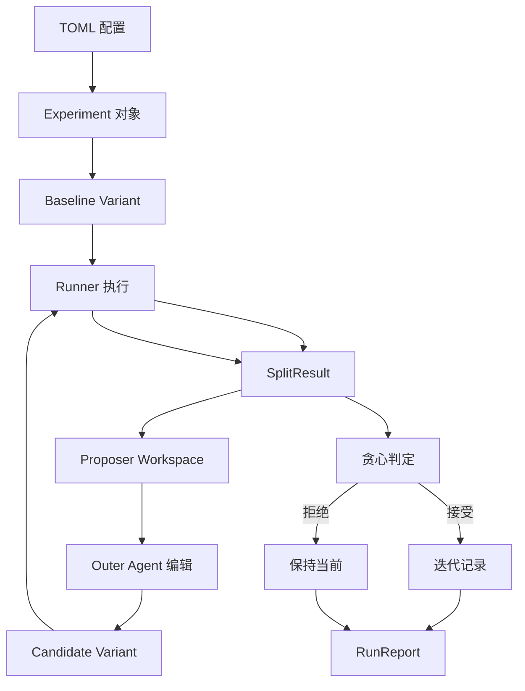
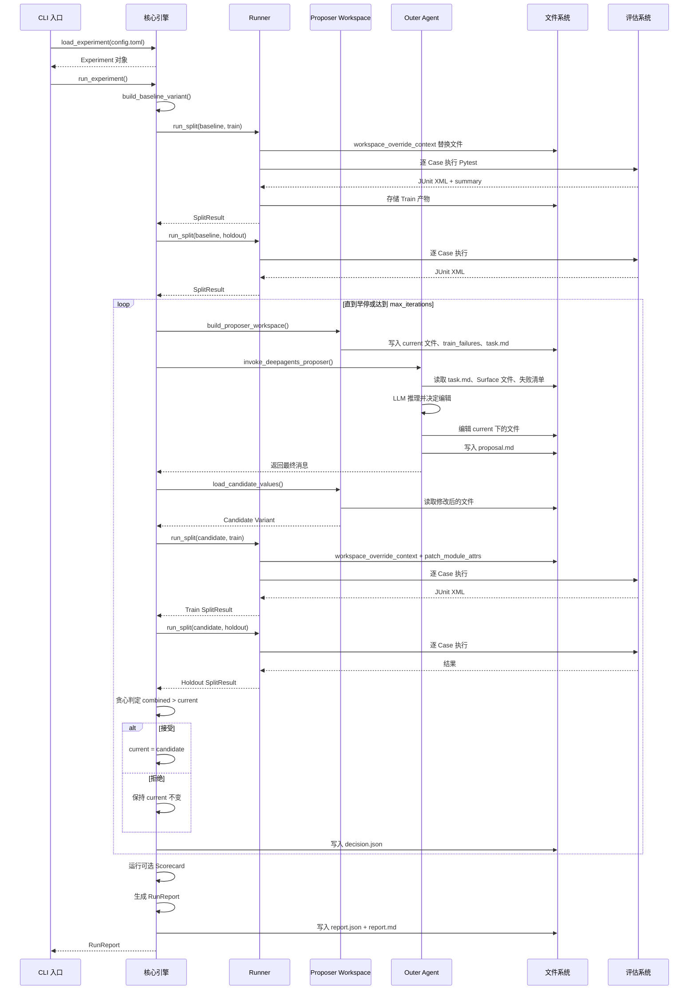
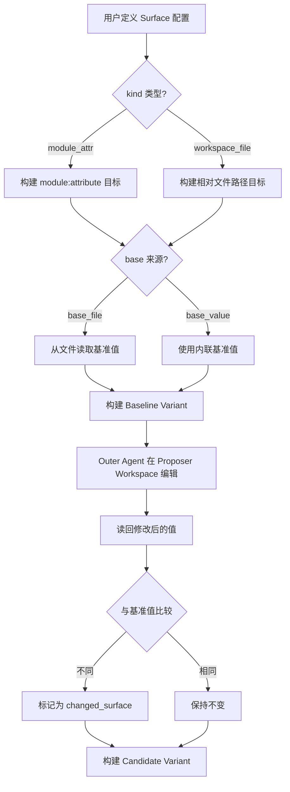
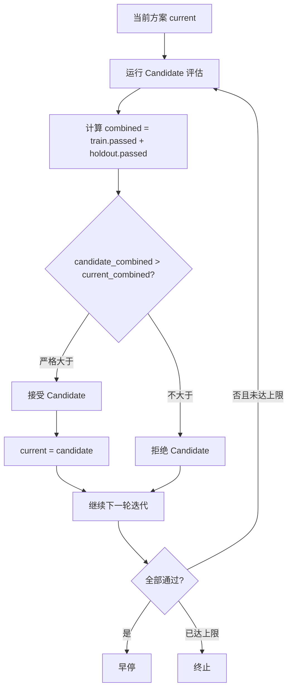
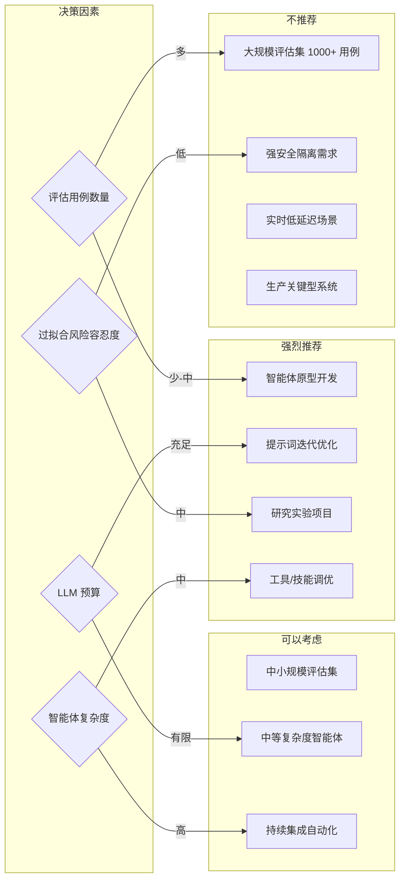

# LangChain Better Harness 技术调研报告

> 调研时间：2026-05-19
> 调研版本：0.1.0（随 Deep Agents 主仓库发布）
> 调研深度：标准（主要章节）

---

## 一、概述与背景

### 1. 项目概述

**项目名称**：LangChain Better Harness (better-harness)

**GitHub 地址**：[https://github.com/langchain-ai/deepagents](https://github.com/langchain-ai/deepagents)（位于 `examples/better-harness` 目录）

**父项目**：[LangChain Deep Agents](https://github.com/langchain-ai/deepagents)

**一句话描述**：一个由评估驱动的智能体（Agent）优化框架，通过外层 Deep Agent 自动改进内层智能体的提示词、工具、技能和中间件等可编辑表面。

**核心价值主张**：让一个智能体去优化另一个智能体——将传统的人工调参过程转变为自主的、评估驱动的迭代优化循环，无需人工干预即可持续提升智能体性能。

### 2. 设计动机与目标

**项目起源**：该项目是 LangChain 团队在「Harness Engineering（框架工程）」方向上的研究产物，灵感来源于三个方面：

1. LangChain 自身的深度智能体优化工作（Improving Deep Agents with Harness Engineering）
2. Karpathy 的 [autoresearch](https://github.com/karpathy/autoresearch) 项目（让 LLM 自动研究和改进代码）
3. Meta-Harness 论文（[arxiv.org/abs/2603.28052](https://arxiv.org/abs/2603.28052)，元智能体框架）

**核心设计目标**：
- 将智能体调优从手动变为自动
- 通过评估反馈驱动优化，而非人工经验
- 提供简单、可编辑、易于适配到自有智能体栈中的研究基础设施

**技术约束与取舍**：作为研究原型（research artifact），选择极简主义设计——零第三方依赖（仅用 Python 标准库），所有状态通过文件系统持久化，无数据库、无网络服务依赖。定位为研究基础架构，不建议直接用于生产环境。

### 3. 项目成熟度评估

| 指标 | 详情 |
|------|------|
| 版本 | 0.1.0（随 Deep Agents 主仓库发布，不作为独立包） |
| Star 数 | 见父仓库 deepagents 的 Star 数（LangChain 官方项目） |
| 贡献者 | LangChain 团队开发 |
| 发布节奏 | 随 Deep Agents 主仓库统一发布，使用 release-please 自动化 |
| 活跃度 | 父仓库活跃度高（持续迭代），better-harness 作为示例子项目随主线更新 |
| 成熟度 | 研究原型阶段 |

---

## 二、架构设计

### 3. 架构概览

**整体架构风格**：双层智能体 + 评估驱动的迭代循环架构。核心由三个层次构成：外层提案智能体（Outer Agent）、内层目标智能体（Inner Agent）、评估执行器（Runner），三者通过 TOML 配置文件和文件系统产物协同工作。

**核心设计理念**：极简主义——所有状态通过文件系统持久化，无数据库依赖；可见/私有隔离实现训练集与验证集信息隔离；配置驱动，用户仅需编写 TOML 文件即可启动优化。

#### 整体架构图



#### 组件交互图



### 4. 系统分解与层次结构

**Outer Agent 与 Inner Agent 的关系**：始终存在两个智能体——外层智能体（Outer Agent）是一个 Deep Agent，负责读取可见的评估数据并编辑智能体表面；内层智能体（Inner Agent）是被优化的目标智能体。外层智能体不能直接编辑目标仓库，而是在临时的 Proposer Workspace 中进行编辑。

**Surface（表面）定义**：目标智能体在评估时加载的真实可编辑组件，包括：

| Surface 类型 | 说明 |
|-------------|------|
| 提示词文本 | 系统提示词内容 |
| 工具文件 | 自定义工具实现 |
| 技能文件 | 技能描述文件 |
| 中间件代码 | 中间件实现逻辑 |
| 中间件注册代码 | 中间件注册/引用代码 |

每种 Surface 必须定义其加载方式（`module_attr` 或 `workspace_file`）和基准值。

**三层评估体系**：

| 层级 | 对 Outer Agent | 影响优化循环 | 用途 |
|------|---------------|-------------|------|
| Train | 可见 | 是（combined 的一部分） | 指导优化方向 |
| Holdout | 不可见 | 是（combined 的一部分） | 验证泛化能力 |
| Scorecard | 不可见 | 否（只跑 baseline/final） | 最终对比验证 |

#### 数据流图



### 5. 模块与组件设计

#### 5.1 核心模块划分

| 模块 | 文件 | 职责 |
|------|------|------|
| 核心引擎 | `better_harness/core.py` | 数据模型定义、配置加载、运行循环 |
| Outer Agent | `better_harness/agent.py` | 外层 Deep Agent 实现、提案者调用 |
| Runner | `better_harness/runners.py` | Pytest/Harbor 评估执行器 |
| Patching | `better_harness/patching.py` | Surface 补丁机制 |

#### 5.2 技术栈

| 组件 | 技术 |
|------|------|
| 语言 | Python 3.12+ |
| 核心框架 | LangChain Deep Agents SDK（`create_deep_agent`、`FilesystemBackend`） |
| 测试 | Pytest（评估执行器）、Harbor（任务型评估框架） |
| 追踪 | LangSmith（评估追踪、Trace 链接） |
| 配置 | TOML（Python 内置 `tomllib`） |
| 包管理 | uv |
| Linting | Ruff |
| 构建 | setuptools |

#### 5.3 核心数据模型

全部使用 Python `dataclass(frozen=True)` 不可变结构，共 9 个核心模型：

| 模型 | 关键字段 |
|------|---------|
| **Surface** | name, kind, target, base_value, filename |
| **EvalCase** | case_id, split, stratum |
| **Experiment** | surfaces, cases, runner, model, max_iterations |
| **Variant** | label, model, changed_surfaces, surfaces, values |
| **CaseOutcome** | case_id, status, score, duration_s, failure_message, trace_ref |
| **SplitResult** | split, variant, passed, total, score, outcomes |
| **Proposal** | changed_surfaces, workspace_dir, summary, final_message |
| **CandidateEvaluation** | variant, proposal, train, holdout, accepted, reason |
| **IterationRecord** | iteration, starting_variant, candidate |
| **RunReport** | baseline, final, iterations, scorecard |

---

## 三、核心流程与用例

### 6. 核心用例运行流程

#### 6.1 优化循环完整流程

优化循环是 better-harness 的核心执行流程：

1. **构建 Baseline Variant**：从配置中所有 Surface 的 `base_value`/`base_file` 读取初始值
2. **运行 Baseline 评估**：分别在 Train 和 Holdout 分集上执行评估
3. **检查早停条件**：如果两个分集都已全部通过则终止
4. **构建 Proposer Workspace**：复制当前 Surface 文件、Train 失败清单、Train 用例源文件、历史迭代摘要到临时工作目录
5. **调用 Outer Agent**：使用 Deep Agent 读取工作区内容并编辑 Surface 文件
6. **加载候选 Variant**：从 Proposer Workspace 读取修改后的文件内容
7. **运行候选评估**：在 Train 和 Holdout 分集上分别执行评估
8. **贪心判定**：比较 `candidate_combined`（Train 通过数 + Holdout 通过数）与 `current_combined`
9. **接受或拒绝**：严格大于则接受，否则拒绝
10. **迭代**：接受后用候选替换当前，重复步骤 3-9
11. **终评（可选）**：在 Baseline 和 Final 版本上分别运行 Scorecard
12. **生成报告**：输出 JSON 和 Markdown 格式的最终报告

#### 6.2 关键用例时序图



#### 6.3 Surface 编辑工作流

支持两种 Surface 类型：

**module_attr 类型**：通过 Python `importlib` 动态修改模块属性值（如修改 `deepagents.graph:BASE_AGENT_PROMPT`）。补丁通过 `sitecustomize.py` 在 Python 进程启动时自动注入，实现无侵入式修改。

**workspace_file 类型**：临时替换目标工作空间中的文件内容（如替换 `tools.py` 的完整内容）。通过上下文管理器在评估运行时替换，评估完成后自动恢复原始文件。



#### 6.4 接受/拒绝判定流程



---

## 四、核心技术实现

### 7. 核心算法与原理

#### 7.1 贪心爬山算法

**单候选策略**：每轮迭代 Outer Agent 只产生一个候选方案（而非多个并行方案），简化了判定逻辑但限制了探索空间。

**接受准则**：

```
candidate_combined = candidate_train.passed + candidate_holdout.passed
current_combined = current_train.passed + current_holdout.passed
仅当 candidate_combined > current_combined 时接受
```

**终止条件**：
- 正常终止：达到 `max_iterations` 上限
- 早停终止：Train 和 Holdout 所有用例全部通过
- 无变更终止：Outer Agent 未产生任何 Surface 修改

**复杂度分析**：
- 时间复杂度：O(max_iterations × n_cases × T_eval)
- 空间复杂度：O(max_iterations × S)，S 为单轮产物大小
- 瓶颈：LLM 调用延迟 + 评估执行时间

### 8. 关键模块/特性实现

#### 8.1 Outer Agent 机制

Outer Agent 是优化循环的核心驱动力：

| 组件 | 说明 |
|------|------|
| 提案者 | 使用 `create_deep_agent` 创建，配合 `FilesystemBackend` 实现文件系统交互 |
| 系统提示词 | 明确职责约束：仅编辑 `/current` 目录、偏好通用改进、不要过拟合、最小化编辑 |
| 重试逻辑 | 三次重试，指数退避（2s, 4s, 6s），针对瞬时错误（overloaded、rate limit、timeout） |
| 调用模式 | 默认模块导入模式；指定 `deepagents_root` 时使用 uv 子进程模式 |

**系统提示词核心规则**：
- 仅编辑 `/current` 目录下的文件
- 偏好通用的智能体改进，而非针对特定用例的修补
- 不要过拟合到可见示例，推断更广泛的策略或行为模式
- 最小化编辑范围
- 如果修改工具或中间件行为，同时更新实现和注册/引用

#### 8.2 Patching 机制

实现了对目标智能体的无侵入式修改：

| 机制 | 说明 |
|------|------|
| `workspace_override_context` | Python 上下文管理器，临时替换 workspace_file 类型 Surface 对应的目标文件 |
| `sitecustomize.py` 注入 | Python 启动时自动执行的补丁注入，读取环境变量指向的 Variant JSON |
| `patch_module_attrs` | 解析 `module:attribute` 格式，使用 `importlib` 动态加载并替换属性 |
| `PYTHONPATH` 管理 | 确保运行时目录在搜索路径最前面，保证补丁在目标模块加载前生效 |

#### 8.3 Runner 实现

**PytestRunner**：
- 使用 `uv run --project` 在评估项目目录下执行 Pytest
- 每个 Case 独立调用，附加 `--junitxml` 和 `--evals-report-file` 标志
- 通过 `-p better_harness_plugin` 注册插件加载 Variant 补丁
- 从 JUnit XML 解析结果，收集缺失用例
- 逐 Case 存储完整产物（command.json、stdout.log、stderr.log、summary.json）

**HarborRunner**：
- 调用 Harbor 命令行工具执行任务型评估
- 通过 `task.toml` 扫描任务目录构建 inventory
- 从 `result.json` 或 `reward.txt` 解析评分

#### 8.4 配置系统

使用 TOML 格式配置：

```toml
[experiment]
name = "my-deepagents-harness"
runner = "pytest"
workspace_root = "${DEEPAGENTS_ROOT}"
model = "claude-sonnet-4-6"
max_iterations = 3

[better_agent]
model = "claude-sonnet-4-6"
max_turns = 11000

[surfaces.prompt]
kind = "module_attr"
target = "deepagents.graph:BASE_AGENT_PROMPT"
filename = "prompt.txt"
base_value = """You are a helpful agent..."""

[[cases]]
case_id = "tests/evals/test_tool_selection.py::test_email[{model}]"
split = "train"
stratum = "tool_use"
```

**校验规则**：
- 至少定义一个 Surface
- Train 和 Holdout 必须各包含至少一个 Case
- 所有渲染后的 Case ID 必须唯一
- Train 和 Holdout 必须覆盖相同的 stratum 集合
- `max_iterations >= 1`

#### 8.5 状态持久化

完全基于文件系统，无数据库依赖：

```
runs/{experiment-name}-{timestamp}/
├── manifest.json                    # 实验元信息
├── split.json                       # 分集清单
├── variants/
│   ├── baseline.json                # baseline variant
│   └── iter-001.json                # candidate variant
├── history/
│   ├── visible/                     # Outer Agent 可见
│   │   ├── train/                   # Train 评估结果
│   │   └── iterations/
│   │       └── 001/
│   │           ├── decision.json
│   │           └── proposer_workspace/
│   └── private/                     # Outer Agent 不可见
│       └── holdout/
├── _runtime/
│   └── sitecustomize.py
├── report.json
└── report.md
```

#### 8.6 算法局限性

| 局限性 | 影响 |
|--------|------|
| 单候选爬山 | 缺乏多方案并行探索，容易陷入局部最优 |
| 无编辑粒度控制 | Outer Agent 可自由编辑整个 Surface 文件，可能引入不相关变更 |
| 无历史记忆 | 没有跨轮次经验学习，相同错误可能反复出现 |
| 无多目标优化 | 仅优化组合通过数，未考虑质量、效率、鲁棒性等维度 |
| 无回溯机制 | 一旦接受无法回退，即使错过了更好的路径 |
| 沙盒隔离不严格 | 可见/私有分层仅用于信息隔离，非严格执行沙盒 |

---

## 五、质量与安全

### 11. 代码质量分析

#### 11.1 评估体系

**三层评估结构**：

| 层级 | 可见性 | 用途 |
|------|--------|------|
| Train | Outer Agent 可见 | 指导优化方向 |
| Holdout | Outer Agent 不可见 | 验证泛化能力 |
| Scorecard | Outer Agent 不可见 | 最终对比验证（可选） |

**用例设计原则**：每个用例覆盖特定 stratum（如 tool_use、conversation、reasoning），Train 和 Holdout 的 stratum 分布必须一致。

#### 11.2 测试体系

| 组件 | 说明 |
|------|------|
| 测试框架 | Pytest（>= 8.4.2），使用 `uv run pytest` 运行 |
| 测试覆盖 | 配置加载、Variant 构建、补丁机制、结果解析、Proposer Workspace、LangSmith Trace、端到端循环、CLI |
| 测试特点 | 所有测试基于临时目录，不依赖外部环境；使用 monkeypatch 模拟 Outer Agent 行为，跳过真实 LLM 调用 |

### 12. 安全性设计

**沙盒隔离**：当前可见/私有分层仅用于信息隔离，不是严格的执行沙盒。代码自述为 research artifact，不建议在对安全性要求高的环境中直接使用。

---

## 六、运维与生态

### 13. 部署与运维

**使用方式**：

```bash
# 安装依赖
uv sync --extra dev

# 复制示例配置
cp examples/deepagents_example.toml my_experiment.toml

# 验证配置
uv run better-harness validate my_experiment.toml

# 运行优化
uv run better-harness run my_experiment.toml \
  --output-dir runs/my-harness \
  --max-iterations 3
```

### 14. 扩展生态

**双 Runner 后端**：同时支持 Pytest 和 Harbor 两种评估后端，适配不同评估场景。

**自定义 Surface**：用户可根据自身智能体框架定义任意 Surface，不限于内置类型。

---

## 七、技术评估总结

### 15. 技术评估

#### 15.1 技术优势

| 优势 | 说明 |
|------|------|
| 评估驱动自动优化 | 将人工调参过程完全自动化，显著降低智能体优化的时间成本 |
| Train/Holdout 防过拟合 | 通过物理层面的可见/私有隔离，确保泛化能力 |
| 通用表面编辑能力 | 支持 module_attr 和 workspace_file 两种加载模式，覆盖各类可编辑组件 |
| 极简架构设计 | 零第三方依赖，无数据库、无网络服务依赖 |
| 完整可追溯性 | 每轮迭代、每个评估用例的所有产物完整记录 |
| 高度可配置 | TOML 配置灵活调整模型、迭代次数、Runner 类型等 |
| 双 Runner 后端 | 同时支持 Pytest 和 Harbor |

#### 15.2 技术劣势与风险

| 劣势/风险 | 说明 |
|-----------|------|
| LLM 提案质量依赖 | 优化效果高度依赖 Outer Agent 所用 LLM 的推理能力 |
| 单候选策略局限 | 缺乏多样性探索，容易陷入局部最优 |
| 无回溯机制 | 一旦接受无法回退 |
| 无编辑粒度控制 | 可能引入不相关变更 |
| 评估成本高昂 | LLM 调用次数和评估时间随迭代次数线性增长 |
| 沙盒隔离不严格 | 非严格执行沙盒 |
| 研究原型阶段 | 未经大规模生产验证 |
| 仅支持 Deep Agents | 不直接支持其他智能体框架 |

#### 15.3 适用场景建议

**推荐场景**：
- 研究和实验性项目：作为智能体自动优化的研究基础
- 复杂智能体调优场景：当提示词、工具、中间件需要反复迭代优化时
- 持续集成中的智能体回归测试：定期自动优化智能体版本
- 多模型对比实验：对比不同 Outer Agent 模型对优化效果的影响

**不推荐场景**：
- 对延迟敏感的实时应用：每次优化需要大量 LLM 调用和评估运行
- 需要强安全隔离的生产环境：沙盒隔离尚未严格实现
- 评估用例极其庞大且昂贵的场景：数千用例且每个耗时较长时，时间成本不可接受

#### 15.4 场景适用性评估



---

## 附录

### A. 参考资源

- [Deep Agents GitHub 仓库](https://github.com/langchain-ai/deepagents)
- [Better Harness 示例目录](https://github.com/langchain-ai/deepagents/tree/main/examples/better-harness)
- [官方博客：Better Harness](https://www.langchain.com/blog/better-harness-a-recipe-for-harness-hill-climbing-with-evals)
- [官方博客：Harness Engineering](https://www.langchain.com/blog/improving-deep-agents-with-harness-engineering)
- [Karpathy autoresearch](https://github.com/karpathy/autoresearch)
- [Meta-Harness 论文](https://arxiv.org/abs/2603.28052)

### B. 术语表

| 术语 | 说明 |
|------|------|
| Better Harness | eval 驱动的 agent harness 自动优化系统 |
| Deep Agent | LangChain 的 "batteries-included" 智能体框架 |
| Outer Agent | 外层智能体，充当提案者优化 Inner Agent |
| Inner Agent | 被优化的目标智能体 |
| Surface | 可编辑的 harness 表面（prompt、tools、skills、middleware 等） |
| Hill Climbing | 贪心爬山算法，仅接受严格改进的变更 |
| Train/Holdout/Split | 三层评估体系，防止过拟合 |
| Proposer Workspace | 每轮迭代为 Outer Agent 创建的隔离工作目录 |

### C. 调研信息

- 调研人：Claude Agent
- 调研时间：2026-05-19
- 调研版本：0.1.0

### D. 不确定字段

以下字段因信息有限标注为不确定：

| 字段 | 原因 |
|------|------|
| maturity_metrics.stars | 父仓库 Star 数随时间变化，未获取确切值 |
| maturity_metrics.contributors | 具体贡献者列表未详细分析 |
| eval_catalog.train_holdout_distribution | 评估用例分布取决于用户自定义配置 |
| algorithm_limitations.回溯机制实现细节 | 代码中未实现回溯，仅为设计层面的分析 |
