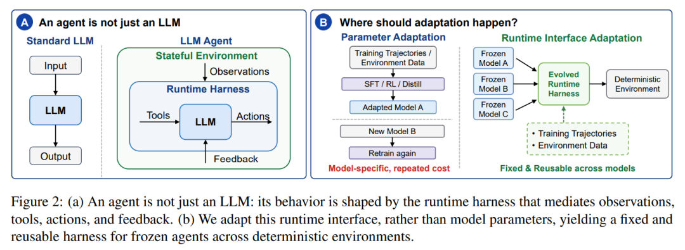
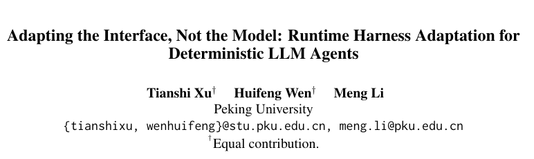
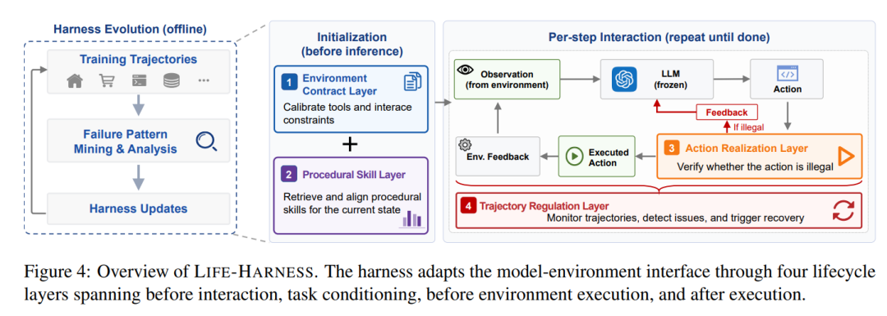
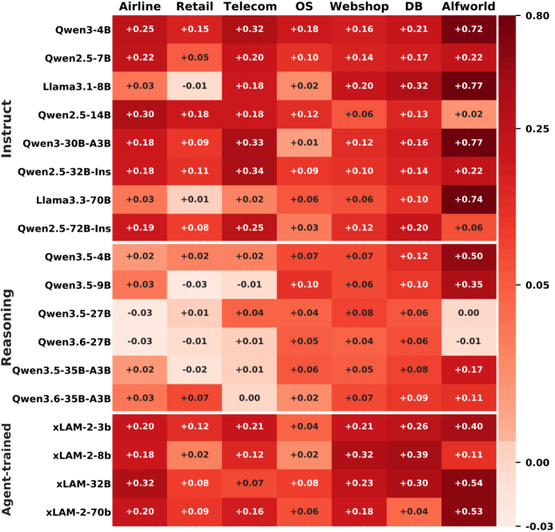
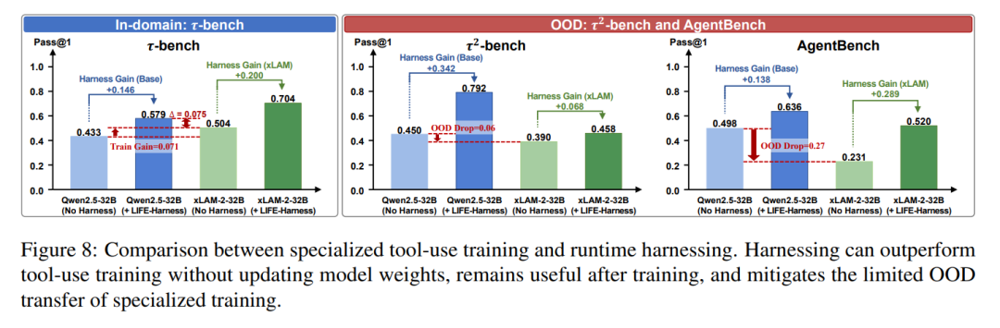
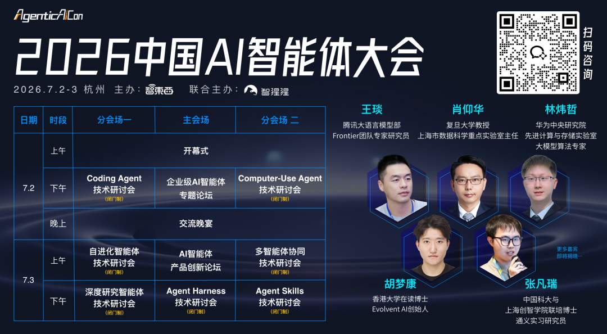
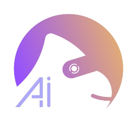

# Agent适配新方法！北大提出Runtime Harness范式，只适配模型与环境的运行时接口

Source: https://mp.weixin.qq.com/s/Bg13OemUFq31-DyqWZBDBA

# Agent适配新方法！北大提出Runtime Harness范式，只适配模型与环境的运行时接口

关注AI智能体
关注AI智能体

[智猩猩AI](javascript:void(0);)

在小说阅读器读本章

去阅读

在小说阅读器中沉浸阅读

北大研究团队投稿

智猩猩AI整理

**提升 LLM Agent 的能力，一定要重新训练模型吗？**

现在很多 Agent 适配方法，本质上还是在做模型适配：更大的模型、更强的指令微调、更复杂的 RL、更精细的蒸馏。

这些方法当然有效，但也意味着更高的训练成本、更强的模型绑定，以及每换一个模型就可能需要重新适配。

但在很多垂直领域 Agent 任务中，失败未必完全来自模型参数。

很多时候，问题发生在**模型与环境的接口处**。

比如，模型没有正确理解工具 schema；本来应该调用 tool，却把动作写成了自然语言；动作意图是对的，但格式无法被环境执行；环境已经返回错误反馈，但模型没有触发恢复；或者轨迹陷入重复和停滞，直到耗尽 step budget。

换句话说，**Agent 不只是一个 LLM**。

它是一个运行时系统：模型观察环境、调用工具、执行动作、接收反馈，并在多轮交互中持续决策。最终表现不仅由模型本身决定，也由这套 runtime harness 决定。

因此，来自北大的研究团队提出了一个不同的方向：不改模型，而是适配模型与环境之间的运行时接口，并提出了**LIFE-HARNESS（**从训练轨迹中演化运行时接口**）方法**，一个面向确定性 LLM Agent 的 lifecycle-aware runtime harness。

* **论文标题: Adapting the Interface, Not the Model: Runtime Harness Adaptation for Deterministic LLM Agents**
* **论文链接: https://arxiv.org/pdf/2605.22166**

***01***

**方法**

它的目标很直接：保持模型权重不变，保持评测环境不变，只从训练轨迹中挖掘可复用的失败模式，并将这些失败模式转化为运行时干预。

LIFE-HARNESS 包含 4 层：

**1. Environment Contract Layer**

在交互开始前，显式化工具规则、调用协议、答案格式、环境约束和常见陷阱，帮助模型更准确地理解“这个环境到底要求我怎么做”。

**2. Procedural Skill Layer**

从训练轨迹中提取可复用的过程技能，并在新任务中检索相关经验。比如在 WebShop、数据库查询、业务流程任务中，很多任务共享稳定的操作流程，这些经验不一定非要写进模型参数。

**3. Action Realization Layer**

在模型输出动作之后、环境执行动作之前，检查动作是否真的可执行。它可以处理一些“模型意图合理，但提交格式错误”的问题，例如 tool call 缺失、JSON 错误、参数缺失、函数名错误或 SQL 格式问题。

**4. Trajectory Regulation Layer**

监控长轨迹中的重复、停滞和无效恢复。当 Agent 反复搜索、反复点击、重复执行无效动作，或者快要耗尽预算时，这一层会触发恢复提示或纠偏指令。

这 4 层分别作用在 Agent 生命周期的不同阶段：

交互前明确环境契约，任务开始时提供过程技能，执行前规范动作，执行后调控轨迹。

它们共同适配的是**模型与环境之间的 runtime interface**，而不是模型权重本身。

***02***

实验结果及分析

研究团队在 3 个 benchmark suite 上评测了 LIFE-HARNESS：τ-bench、τ²-bench、AgentBench。

覆盖 7 个确定性 Agent 环境：Airline、Retail、Telecom、ALFWorld、WebShop、OS 和 DBBench。

模型方面，研究团队评测了 18 个不同 backbone，包含 instruction-tuned models、reasoning models 和 agent-specialized models。

结果显示：

**LIFE-HARNESS 在 116 / 126 个 model-environment 设置中带来提升，平均相对提升 88.5%。**

更重要的是，harness 的演化只使用了 Qwen3-4B-Instruct 的训练轨迹，但最终可以迁移到另外 17 个模型上。

这说明 LIFE-HARNESS 学到的并不是某个模型的特殊行为，而是环境侧可复用的稳定结构。

**Harness 和模型训练是替代关系吗？**

并不是。

模型训练、指令微调、RL 和蒸馏仍然很重要。但它们主要是在改模型参数，而 LIFE-HARNESS 改的是模型与环境之间的运行时接口。

这两者是互补的。

实验中发现，即使是经过 tool-use 训练的 agent-specialized model，加入 LIFE-HARNESS 后仍然可以继续提升。

也就是说，工具使用训练并不会完全消除接口层、动作层和轨迹层的失败。

***03***

**总结**

**为什么这件事重要？**

对很多垂直领域 Agent 来说，重新训练模型并不总是最现实的选择。

训练成本高、迭代慢，而且强依赖特定模型。

但很多 Agent 失败不是模型能力不足，而是模型与环境之间的接口没有被正确适配。

因此，Agent 适配不一定只能发生在模型内部。它也可以发生在观察、工具、动作、反馈和轨迹控制组成的运行时系统中。

LIFE-HARNESS 试图回答一个问题：能否不更新模型权重，只通过适配**runtime harness 来提升确定性 LLM Agent？**

实验结果表明，在确定性、规则明确的垂域 Agent 任务中，这是可行的。

LIFE-HARNESS 在 7 个环境和 18 个模型上带来了广泛提升，并展示出良好的跨模型迁移能力。

与其每次都重新训练模型，不如先问一句：**这个问题，真的需要改模型吗？还是只需要把模型与环境之间的接口适配好？**

**END**

✦

✦

**2026中国AI智能体大会**

✦

*7月2-3日，智猩猩主办的2026中国AI智能体大会将在杭州举行，设有开幕式，企业级AI智能体、AI智能体产品创新2场论坛，以及Coding Agent、自进化智能体、深度研究智能体、Computer-Use Agent、多智能体协同、*Agent Skills*、Agent Harness7场技术研讨会。*

✦

✦

**入群申请**

✦

**智猩猩矩阵号各专所长，点击名片关注**

预览时标签不可点

修改于

微信扫一扫  
关注该公众号

继续滑动看下一个

轻触阅读原文

智猩猩AI

向上滑动看下一个

[知道了](javascript:;)

微信扫一扫  
使用小程序

[取消](javascript:void(0);)
[允许](javascript:void(0);)

[取消](javascript:void(0);)
[允许](javascript:void(0);)

[取消](javascript:void(0);)
[允许](javascript:void(0);)

×
分析

微信扫一扫可打开此内容，  
使用完整服务

：
，
，
，
，
，
，
，
，
，
，
，
，
。
 
视频
小程序
赞
，轻点两下取消赞
在看
，轻点两下取消在看
分享
留言
收藏
听过