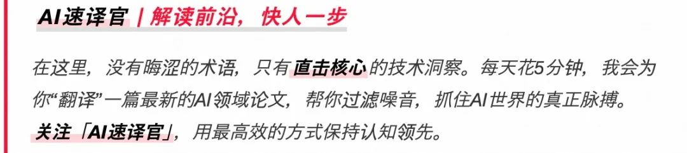
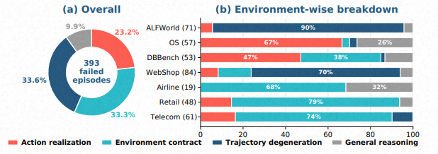
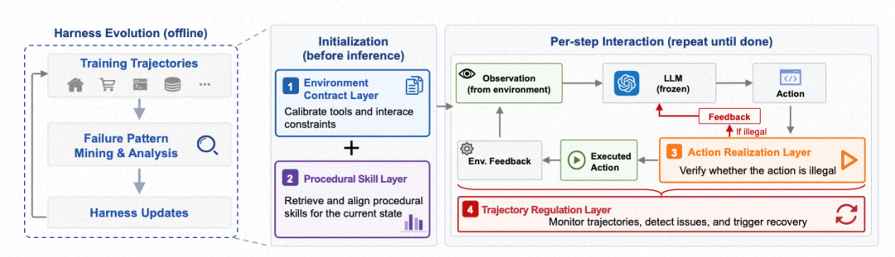
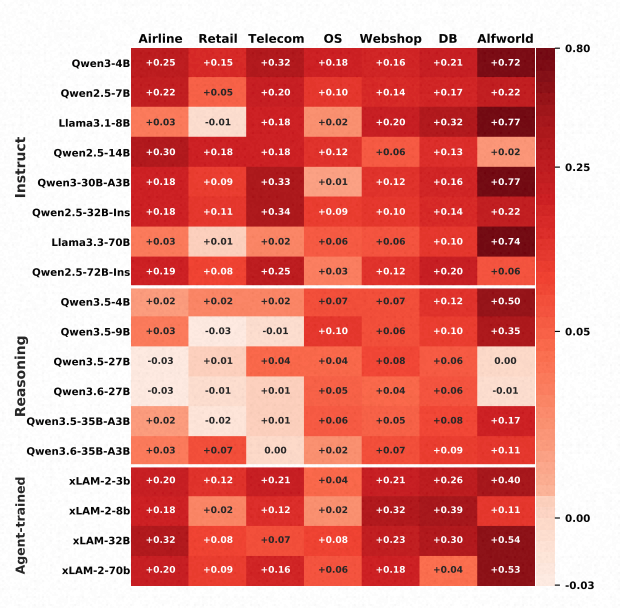
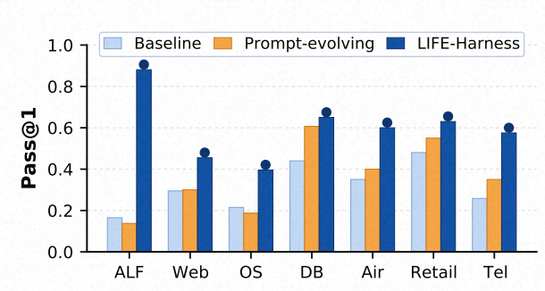

# 不动模型权重也能让 Agent 提升 88.5%：北大团队提出生命周期感知的运行时"外挂"

Source: https://mp.weixin.qq.com/s/uS4q8qA_IVHNGFRCNC33Mw


# 不动模型权重也能让 Agent 提升 88.5%：北大团队提出生命周期感知的运行时"外挂"

原创

AI速译官
AI速译官

[AI速译官](javascript:void(0);)


在小说阅读器读本章

去阅读


在小说阅读器中沉浸阅读



> 今天我们分享解读的是来自**北京大学团队**的 *Adapting the Interface, Not the Model: Runtime Harness Adaptation for Deterministic LLM Agents*。作者把 LLM Agent 的失败重新归类——许多错误并非来自模型"不够聪明",而是来自模型与环境之间那层"接口"没对齐。基于这个观察,他们提出了 **LIFE-HARNESS**:在不更新任何模型参数的前提下,通过演化出一个生命周期感知的运行时 harness,让 18 个不同规模、不同家族的开源模型在 7 个 deterministic Agent 环境中平均相对提升 **88.5%**。

---

## 一、导读:Agent 不只是 LLM

近一年关于 Agent 的工作,几乎全部围绕"训模型"展开——SFT、RL、偏好优化、专门为工具调用做的蒸馏……方法各异,但底层假设是一致的:**Agent 的能力 = 模型本身的能力**。

但作者一开篇就指出一个被严重低估的事实:**一个 Agent 远不只是一个 LLM**。它是一个嵌入在有状态交互循环里的策略:环境给观察、harness(运行时支撑)定义可用的工具与动作、模型输出动作、执行器作用到环境、反馈又回到下一步决策。

也就是说,Agent 的表现既取决于**模型策略 πθ**,也取决于这一层**运行时 harness**——它决定了模型怎么"看到"环境、怎么理解工具、怎么把意图落地成可执行动作、怎么解读反馈、以及怎么管控多步轨迹。

一个有意思的反差数据:

•

**Qwen3.5-4B** 在 HMMT(竞赛级数学)上能拿 **74.0%**;

•

但在 **ALFWorld**(确定性的具身交互基准)上只有 **43.1%**。

这种差距通常不是"模型不会推理",而是模型与环境的接口出了问题:观察被组织得很乱、工具协议被误解、动作不可执行、反馈没转化成纠错信号、轨迹陷入重复……作者认为,这部分结构本就属于环境一侧,完全可以通过适配 harness 来解决,不必把它强行塞进模型权重里。

于是核心问题被提出来了:

> **能不能用训练轨迹演化出一个结构化的运行时接口,让冻结模型在未见过的任务、甚至换到新的模型骨干上,都能持续受益?**

---

## 二、从参数适配到接口适配:重新切分"在哪里适配"

作者首先把 Agent 形式化为一个运行时系统。一个 episode 由任务描述 `x`、环境 `E`、环境契约 `C`(描述可用工具、参数格式、反馈格式、答案格式、任务策略等)和步数预算 `B` 组成。初始化与每一步的交互形式如下:

```
s0, o0 = E.INIT(x)at ~ πθ(· | τt)        
```

```
# τt 为当前轨迹st+1, ot+1 = E.STEP(st, at)τt+1 = (C, x, o0, a0, o1, ..., at, ot+1)
```

在这个统一视角下,作者把 Agent 适配区分成两类:

**1. 参数适配(Parameter Adaptation)**

把任务结构吸收进模型权重。问题在于,这种适配既是 **model-specific**(换模型要重训),又是 **task-specific**(换环境也要重训)。

**2. 运行时接口适配(Runtime Interface Adaptation)**

模型权重冻结,只演化 harness。它的性质恰好倒过来:**环境特定、但模型无关**——同一份 harness 可以套在任何遵循同样交互协议的模型上,不用重训、不用切 checkpoint。

这就是这篇工作的核心切口:adaptation 不一定要发生在模型那一侧。

---

## 三、失败诊断:Agent 究竟为什么会挂?

在动手设计 harness 之前,作者先做了一件非常踏实的事:把 baseline Agent(冻结的 Qwen3-4B-Instruct)在七个环境上跑训练任务,**人工 + Codex 协助**地对所有失败轨迹做了归因(具体规则见附录 A.1,采用优先级判定,避免后期症状掩盖早期接口失败)。



393 个失败 episode 被分成四类(见 `[图3: 失败诊断饼图与各环境分布]`):

| 失败类型 | 占比 | 含义 |
| --- | --- | --- |
| Action realization | 23.2% | 意图合理,但动作无法被环境执行(自由文本、缺参数等) |
| Environment contract | 33.3% | 动作合法,但违反工具用法或调用协议 |
| Trajectory degeneration | 33.6% | 单步合法,轨迹却陷入重复、停滞或无效恢复 |
| General reasoning | 9.9% | 协议都对,但推理/计算/决策错了 |

两个关键结论:

1

**失败极度异质**——没有哪种类型可以一家独大,不同环境的失败分布差别也极大(比如 Airline 的 79% 来自环境契约失误,ALFWorld 的 67% 来自动作落地失败)。

2

**绝大多数失败都发生在"模型与环境的接口"上**——这才是真正能撬动表现的杠杆点。

这直接催生了 LIFE-HARNESS 的四层结构。

---

## 四、LIFE-HARNESS:生命周期感知的四层 harness

LIFE-HARNESS 把 harness 的干预点对齐到 Agent 生命周期的四个阶段(见 `[图4: LIFE-HARNESS 总览]`)。



### ❶ Environment Contract Layer(交互前:契约层)

在交互开始之前,把环境里**稳定的约束**显式化。形式上它对契约 `C` 做一次增量更新:

`ΔC` 来自环境策略、API 行为和训练轨迹中的高频失败,告诉模型:工具应该怎么调用、哪些动作在当前协议下是合法的、哪些环境特定的坑应该避开。增强后的 `C'` 被替代原契约展示给模型。

### ❷ Procedural Skill Layer(任务条件化:技能层)

从训练轨迹中**蒸馏可复用的过程性技能**,形成技能记忆库 `S`。对于一个任务 `x`,通过 BM25 计算相关性并取 Top-K:

检索到的技能被插入到初始 system prompt 中,给模型提供非参数化的引导。注意:作者在所有实验中只用 Top-1,刻意避免无关技能污染上下文。

### ❸ Action Realization Layer(执行前:动作落地层)

这一层在模型输出动作之后、环境执行之前介入:

它依据工具 schema、合法动作集、参数约束和任务策略,**对确定会失败的调用直接阻断**,或者对接口层的"无歧义错误"做规范化(比如把 SQLite 风格的写法改成 MySQL)。

### ❹ Trajectory Regulation Layer(执行后:轨迹调控层)

很多 Agent 失败是**自我强化**的:不断重复同一个无效命令、在两个等价状态之间震荡、把预算耗完却毫无进展。这些模式在轨迹层面非常容易识别(根本不需要深度语义理解)。这一层根据已执行动作、返回观察、剩余预算 `bt = B − t − 1` 和环境证据计算:

`rt` 可以是空、可以是软提醒、可以是重复失败的警告,也可以是更强力的强制纠偏指令。

### 整体算法

整个 loop 长这样(原文 Algorithm 1)

四层各司其职:契约层校准接口、技能层提供过程知识、动作层把守执行入口、轨迹层监管多步动态。**模型权重、环境、评测协议三者完全不变。**

---

## 五、Harness 是怎么"演化"出来的?

作者用 **Codex 作为编码 Agent** 来迭代演化 harness:

1

用冻结的 Qwen3-4B-Instruct 反复跑训练任务,收集完整交互轨迹;

2

Codex 读这些轨迹 + 当前 harness 实现 + 四层设计指南,提出针对性的更新;

3

目标有两个——**扩大对高频失败模式的覆盖**、**检测过度触发或破坏正确行为的回归案例**;

4

演化只在训练集上做,**测试集始终隐藏**,以保证泛化性评估的干净。

附录 A.2 给出了完整的 prompt 模板,要求 Codex:

•

找出反复出现的失败模式,定位到最早能可靠检测/预防的生命周期点;

•

每个干预必须由"精确的环境/轨迹证据"触发;

•

必须最小化、本地化,不在动作模糊时覆盖模型推理;

•

不能用任何 oracle 信息、不能改环境、不能改评测;

•

每轮更新后必须做回归检查,如有副作用就回退。

这套循环让"反复失败"被转化为**可审计的运行时干预**,而不是黑盒的权重更新。

---

## 六、实验:7 个环境 × 18 个模型 × 88.5% 平均相对提升

### 主结果

作者在三个 benchmark 套件(τ-bench、τ²-bench、AgentBench)的 7 个场景上评测,模型覆盖 Qwen、Llama、xLAM 三个家族,共 18 个 backbone,包括指令模型、推理模型和专为 Agent 任务做后训练的模型。

| Suite | Benchmark | Metric | w/o | w/ LIFE-HARNESS | Rel. Gain | Improved |
| --- | --- | --- | --- | --- | --- | --- |
| AgentBench | ALFWorld | Pass@1 | 41.1% | **75.7%** | +84% | 17/18 |
| AgentBench | WebShop | Pass@1 | 31.4% | **44.0%** | +40% | 18/18 |
| AgentBench | OS | Pass@1 | 34.7% | **41.2%** | +19% | 18/18 |
| AgentBench | DBBench | Pass@1 | 48.4% | **64.6%** | +34% | 18/18 |
| τ-bench | Airline | Pass@1 | 49.7% | **62.6%** | +26% | 16/18 |
| τ-bench | Airline | Pass^3 | 34.7% | **52.2%** | +50% | 17/18 |
| τ-bench | Retail | Pass@1 | 56.2% | **61.8%** | +10% | 14/18 |
| τ-bench | Retail | Pass^3 | 37.9% | **45.3%** | +19% | 15/18 |
| τ²-bench | Telecom | Pass@1 | 55.3% | **69.0%** | +25% | 17/18 |
| τ²-bench | Telecom | Pass^3 | 41.5% | **52.6%** | +27% | 18/18 |



汇总:**126 个 model-environment 设置中,116 个出现提升,平均相对增益 88.5%**。最关键的是——所有 harness 都只在 Qwen3-4B-Instruct 的轨迹上演化得到,却能**直接迁移到其他 17 个模型**,涵盖指令、推理、Agent 专训三类骨干(见 `[图5: 18 个模型 × 7 个 benchmark 的绝对提升热力图]`)。这恰好印证了作者最早的猜想:harness 抓住的是**环境一侧的可复用结构**,而不是模型行为的拟合。

### 演化动态


`[图6: 训练集表现随演化轮数的变化曲线]` 显示,Qwen3-4B-Instruct 的训练集表现随着 harness 迭代轮数稳定提升并最终饱和。作者特别指出:**快速收敛恰好得益于四层结构**——更新是定位到具体失败模式的、局部的,而不是像 Meta-Harness 那样把 harness 当成自由代码整体改写。

### 与 Prompt 演化对比



`[图7: LIFE-HARNESS vs Prompt-evolving 在 7 个 benchmark 上的 Pass@1]` 中,纯 prompt 演化(如 GEPA、OPRO 这类只优化输入 prompt 的方法)虽然有改善,但 LIFE-HARNESS 比它们再高出 **120% 的平均相对增益**。原因很直观:Agent 表现不只取决于初始 prompt,还取决于运行时如何中介工具调用、动作落地、反馈解读和多步轨迹——这些是纯 prompt 优化覆盖不到的。

### 消融:四层都不可少

表 2 的 leave-one-layer-out 显示了去掉任一层后的相对准确率下降:

| Setting | Airline | Retail | Telecom | ALFWorld | WebShop | OS | DBBench |
| --- | --- | --- | --- | --- | --- | --- | --- |
| LIFE-HARNESS | 0.0% | 0.0% | 0.0% | 0.0% | 0.0% | 0.0% | 0.0% |
| w/o Contract | -8.3% | -17.5% | -16.0% | -1.0% | -4.4% | -14.1% | -16.9% |
| w/o Skill | -8.3% | -15.9% | -17.4% | -1.0% | -2.2% | -14.1% | -3.1% |
| w/o Action | **-61.7%** | -15.9% | -10.1% | -1.0% | -6.6% | **-59.6%** | -4.6% |
| w/o Trajectory | -3.3% | -16.7% | **-36.2%** | **-86.5%** | -26.4% | -14.1% | -4.6% |

显然每一层都不可或缺,不同环境的"主导失败模式"决定了它最依赖哪一层——ALFWorld 极度依赖轨迹调控、Airline 和 OS 高度依赖动作落地、Telecom 和 Retail 几乎所有层都重要。

### 训了模型还需要 harness 吗?

作者特意拿了一个 **xLAM-2-32B**(基于 Qwen2.5-32B-Instruct,专门为 τ-bench 类工具调用做了后训练)做对比(`[图8: 训练 vs harness 的对照]`):

•

**In-domain(τ-bench)**:Qwen2.5-32B + LIFE-HARNESS 反而**比 xLAM-2-32B 高 7.5 个百分点**——不更新权重就赢过了专门的工具训练。

•

**Harness 仍可叠加在训练后**:把 LIFE-HARNESS 套在 xLAM 上,各项继续涨 6.8 ~ 28.9 个百分点。

•

**专项训练在 OOD 上反而掉点**:在 τ²-bench 和 AgentBench 上,xLAM 居然**低于其基座 Qwen2.5**;同样的现象在 xLAM-2-8B(基于 Llama-3.1-8B)上也观察到了。

结论很有力:**训练 vs harness 适配的是不同对象**。训练把参数拟合到训练分布——in-domain 有效,但 model-specific、distribution-specific;harness 适配的是确定性环境的接口——environment-specific、model-agnostic,而且**和训练互补**。

---

## 七、附录:每个环境的 harness 究竟长什么样?

附录 A.3 (表 3-5)给出了七个场景里每一层的具体实现,这部分对理解"harness 到底在做什么"非常关键。举几个典型例子:

**Airline(τ-bench)**

•

Contract 层:在工具描述里直接写清楚,搜索只接受出发地、目的地、日期;取消工具列出四种合法取消条件;预订工具说明支付方式上限、五位乘客上限、可预订航班状态、保险与行李规则。

•

Action 层:`book_reservation` 检查重复 payment ID、最多一张证书、一张信用卡、三张礼品卡、五位乘客上限、连续行程、座位充足、行李费正确、支付金额精确;`cancel_reservation` 拦截"已飞航班取消"等死局。

•

Trajectory 层:`get_user_details` 自动追加每个 reservation 的一行摘要;`cancel_reservation` 自动追加退款金额与目标支付工具。

**ALFWorld**

•

Contract 层:从任务描述里抽取任务类型、目标物体、目的容器、所需变换、物体数量、子目标链。

•

Skill 层:按任务类型先过滤再 BM25 排序,强制注入"先拿物体再 clean/heat/cool"、"看物体要用 examine X with desklamp 而不是 examine X"等高频规则。

•

Trajectory 层:维护一个 WorldModel,记录持有物、当前位置、已访问位置、目标位置、灯位等,自动推进子目标状态机,捕捉震荡、空回合、open/close 重复、look/inventory 死循环。

**OS / DBBench**

•

对工具调用做"救援"——把模型写偏的自然语言或半结构化文本(JSON、关键词、bare-command、XML-like)解析回 `bash` / `execute_sql` / `commit_final_answer`;

•

自动对识别出的表名/列名加反引号;

•

把 NULL 聚合结果在评测期望 0 时归零;

•

重复相同 bash 命令超过阈值后强制阻断,陷入纯文本循环时根据候选值强制提交答案。

这套设计的精神可以概括为一句话:**把高频、机械、可被环境信号识别的失败,在合适的生命周期点上拦下来,而不要去训练模型记住所有这些"潜规则"。**

---

## 八、思考

这篇工作放在 2026 年这个时间点上,某种意义上是给"训练万能论"打的一个补丁。回顾过去两年的 Agent 研究路线,**默认范式一直是把所有领域结构吸收进模型权重**——SFT 一次、RL 一次、蒸馏一次、再针对新场景重训一次,每个新模型来了都要重新跑一遍。LIFE-HARNESS 做的事正相反:它把"反复失败"看作**环境一侧的、可被显式表达的结构**,然后用一个可审计、可演化、可跨模型迁移的运行时层来承载它。

值得展开的几点:

**1. "在哪里适配"是 Agent 设计的真正分水岭**

参数适配是"把领域知识写进模型",harness 适配是"把领域知识写进接口"。前者的代价是 model-specific + distribution-specific,后者的代价是 environment-specific——但后者带来**模型可替换、可叠加、可审计**的工程性优势。在 deterministic 环境(数据库、企业流程、客服、操作系统),这种"接口知识"几乎天然存在,只是过去被默认塞进了模型权重而已。xLAM 在 OOD 上掉点的现象,其实是参数适配范式难以避免的副作用。

**2. 失败诊断的方法学价值**

很多 Agent 工作只报告最终指标,不剖析失败构成。作者把 393 个失败 episode 严格按"最早可识别失败点"的优先级分类,这种**接口级 root-cause 分析**值得被更广泛采用。它让人意识到:被笼统称为"Agent 推理失败"的问题,其实有 90% 是接口问题,真正的"reasoning 失败"只占 9.9%。

**3. 与 Claude Code、Codex、OpenCode 等编码 Agent 范式的呼应**

可以发现,作者用 Codex 来演化 harness 这个动作本身,就是"Agent 帮 Agent 调 harness"的真实案例。这暗示了一种正在浮现的开发范式:**人类负责定义生命周期结构和约束规范,Agent 负责在结构内具体地适配**。可类比为"人定义 IDE 的 lint 规则、Agent 负责执行 lint 修复"。

**4. 局限与未来方向**

作者诚实地指出,这套思路在 deterministic、规则化的环境里非常有效,但对 fully open-ended 的 Agent 任务(每个 task 用不同工具、不同资源、不同成功标准)很难定义一个稳定的运行时接口。未来一个有意思的方向是:**能不能让 harness 自己也具备某种"运行时学习/演化"能力**——例如把演化循环从离线训练阶段延伸到在线服务阶段,在保证可控性的前提下持续吸纳新的失败模式。Continual Harness、Workspace Optimization 等并行工作其实已经在探这条路。

**5. 一个工程师视角的实用观察**

如果你正在做一个生产级 Agent,这篇文章给出的最直接启发是:**先做一遍失败归因,再决定优化方向**。如果 70% 的失败来自动作落地或环境契约理解,那训模型大概率不是性价比最高的选项——花两周写一个对应的运行时 harness,可能就能把指标拉到一个新台阶,而且换模型还能继续用。

> 一句话总结:LIFE-HARNESS 提醒我们,Agent 的瓶颈未必在模型本身;在模型与世界之间,还有一层长期被忽视、但完全可以被工程化的"接口"。

预览时标签不可点


微信扫一扫  
关注该公众号

继续滑动看下一个

轻触阅读原文


AI速译官

向上滑动看下一个

[知道了](javascript:;)


微信扫一扫  
使用小程序

[取消](javascript:void(0);)
[允许](javascript:void(0);)

[取消](javascript:void(0);)
[允许](javascript:void(0);)

[取消](javascript:void(0);)
[允许](javascript:void(0);)

×
分析


微信扫一扫可打开此内容，  
使用完整服务

：
，
，
，
，
，
，
，
，
，
，
，
，
。
 
视频
小程序
赞
，轻点两下取消赞
在看
，轻点两下取消在看
分享
留言
收藏
听过