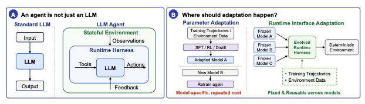
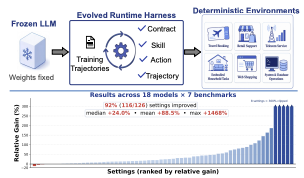
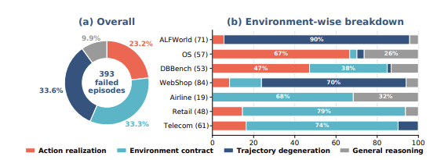
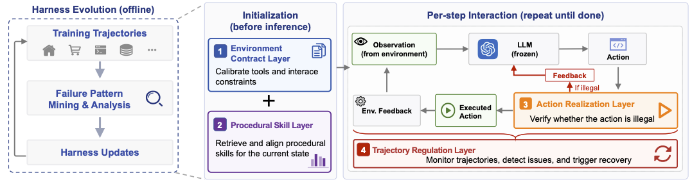

# 不改模型不重训！运行时外壳让LLM Agent性能暴涨88.5%，彻底激活现有模型潜力

Source: https://mp.weixin.qq.com/s/rfhRXee1afRyVlKAiAP0Aw

# 不改模型不重训！运行时外壳让LLM Agent性能暴涨88.5%，彻底激活现有模型潜力

原创

峥嵘岁月AI
峥嵘岁月AI

[峥嵘岁月AI](javascript:void(0);)

在小说阅读器读本章

去阅读

在小说阅读器中沉浸阅读

在AI Agent智能体越来越火的今天，很多朋友和我一样，都在持续关注如何让大模型真正变成靠谱的“数字员工”，而不是只会聊天的工具。尤其是在操作系统控制、数据库操作、电商购物、家庭机器人等这些需要严格规则和确定性执行的任务上，大家经常会发现：模型本身已经很强了，但实际用起来还是容易出错、卡住、反复失败。不知道大家都使用什么方案来解决这一问题！？

今天要分享给大家的这篇2026年5月北京大学刚出的arXiv论文，《Adapting the Interface, Not the Model: Runtime Harness Adaptation for Deterministic LLM Agents》（Life-Harness）正是针对这个共同痛点，给出了一个非常有启发性的解决方案，让我眼前一亮。

Life-Harness的核心洞见是：与其反复重训模型把领域知识硬塞进权重，不如把这些“接口适配”工作交给一个可进化的运行时外壳（Runtime Harness）。它从少量训练轨迹中学习，把反复出现的失败转化为可复用的干预规则，模型权重完全不改，评估环境也不变。结果惊人：在7个真实确定性基准上，覆盖18个不同模型，126个设置里116个大幅提升，平均相对改进88.5%。更牛的是，用一个小模型（Qwen3-4B）生成的Harness能直接迁移到17个其他大模型上，证明它捕捉的是环境侧的稳定结构，而非模型特定行为。

这不是又一个“提示词优化”小技巧，而是一种系统级、生命周期感知的新思路。它提醒我们：智能体的智能是模型+运行时接口的联合产物。在2026年大模型参数越来越贵、推理成本居高不下的今天，这条路线可能成为更经济、更可控、更可迁移的智能体优化路径。下面我用通俗语言，带你完整拆解这篇论文。

另外，由于项目实践中遇到问题的原因，本一直都很关注智能体或harness自进化的框架，往期类似这类智能体harness自进化的论文每少关注大概有3篇(OpenClaw-RL,Meta-Harness和HyperAgents），在文末会结合这次的Life-Harness,把它们做个对比，也算是对目前关注自进化harness的一个小总结。

## 为什么说“智能体不只是大模型”？

想象你雇了一个超级聪明的实习生（大模型LLM），让他帮你完成任务。但你只给了他模糊的指令、乱七八糟的工具箱、没讲清楚公司规章制度、出了错也没及时反馈纠正。结果呢？他聪明是聪明，但经常干傻事：用错工具、卡在死循环、重复无效操作。

论文用一张图生动说明：传统LLM是单次输入输出，而**LLM Agent智能体**是一个闭环系统。环境给出观察（observation），运行时系统（Runtime Harness）定义可用工具和动作格式，模型输出动作，执行器应用到环境，反馈回来更新轨迹……整个行为是**模型能力和接口调解的共同结果**。

图示：(A) Agent不只是LLM，它是一个闭环系统，由运行时外壳（Runtime Harness）来调解观察、工具、动作和反馈；(B)论文的核心思路——适配运行时接口而非模型参数。

在软件工程助手、OS控制、网页导航、数据库操作、具身交互、业务工作流等场景中，这种接口层的作用越来越关键。可惜，目前的主流适应方法还是“模型中心”的：SFT(监督微调)、RL(强化学习)、偏好优化、蒸馏等。这些方法强大，但把所有领域特定知识都吸收到模型权重里，导致：

* 换个模型就要重训
* 换个环境又要重训
* 成本高、泛化差、调试黑箱

而在**确定性、规则严格**的环境里，很多结构其实是环境侧稳定的：工具schema、API合约、反馈规则、停止条件、恢复策略等。这些东西硬塞进模型参数，既浪费又不优雅。

论文举例：Qwen3.5-4B在数学竞赛题上能拿74%，但在ALFWorld（确定性家庭交互基准）上只有43.1%。问题往往出在“接口失配”：观察没组织好、工具调用格式不对、动作不可执行、反馈没转成恢复信号、轨迹退化成重复。

图示：整体方法对比——传统方式不断更新模型权重，

而Life-Harness保持模型固定，只进化可复用的运行时外壳(runtime-harness)。

**核心假设**：训练轨迹中反复出现的失败，可以转化为可审计的运行时干预，而非模型更新。

## Life-Harness：生命周期感知的运行时外壳

Life-Harness是论文提出的方案。它不碰模型权重，不改评估环境，从训练轨迹中“进化”出一个固定的Harness，在评估时保持不变。

它按智能体交互的**生命周期**组织成四个互补层级，每层针对特定失败模式：

图示：训练任务上的失败模式诊断结果。显示不同环境中主导失败类型差异很大（动作实现、环境合约、轨迹退化、一般推理），这正是需要多层互补干预的原因。

1. **环境合约层（Environment Contract Layer）**  
   交互开始前就生效。作用是把环境特定的规则、工具描述、政策约束、常见坑明确化，减少模型用通用工具调用先验去猜特定环境的合约。  
   比如：明确哪些参数必须提供、格式要求、禁止行为等。让模型少犯“语法正确但语义违规”的错误。
2. **程序化技能层（Procedural Skill Layer）**  
   在任务启动时，根据任务描述从训练轨迹中提炼的可复用“技能库”里检索相关流程。  
   这相当于给模型一个非参数化的“操作手册”：遇到类似子任务，就直接参考成功案例的步骤框架。
3. **动作实现层（Action Realization Layer）**  
   模型输出动作后、环境执行前。负责验证动作是否可执行、规范化明显接口错误、阻挡必然失败的动作。  
   比如模型想调用工具但参数少了一个，这层可以自动补全或修正（如果意图明确），或直接拒绝并给出清晰反馈。把“意图合理但表达有误”的情况救回来。
4. **轨迹调控层（Trajectory Regulation Layer）**  
   环境反馈回来后生效。监控整个轨迹，检测退化模式（如重复相同动作、停滞不前、无效重试、预算快耗尽），触发恢复策略。  
   这层专门对付“单个动作都对，但整体卡死”的问题，比如主动切换策略、总结当前状态、请求更高级规划等。

图示：Life-Harness四层架构概览。清晰展示了四个层级在智能体生命周期不同阶段如何

协同工作。

整个过程像给实习生配了一个“智能助理秘书”：秘书在任务前整理规则和技能手册、实时帮他检查动作格式、监控进度并在卡住时干预纠偏。模型本身（实习生）保持不变，但整体表现大幅提升。

**进化过程**：研究者先用一个冻结的Qwen3-4B-Instruct在训练任务上跑，收集失败轨迹，手动+自动诊断主要失败类型。然后把这些失败转化为具体的干预规则（提示词、检索机制、验证函数、恢复逻辑），组装成Harness。Harness进化完就固定下来，用于所有评估任务和所有模型。

## 实验设置与惊人结果

他们测试了7个确定性环境，来自τ-bench（业务工作流）、τ²-bench和AgentBench（OS、数据库、网页购物、家庭交互等）。覆盖了真实世界中Agent最常见的挑战场景。

**模型**：18个不同backbone，包括各种规模的Qwen系列、Llama、指令微调模型、推理模型、Agent专用模型等。

**关键协议**：

* Harness只从Qwen3-4B-Instruct的训练轨迹进化
* 评估时模型权重完全冻结
* 环境不变
* Harness在评估中可使用当前episode历史，但不从评估失败中创建新干预（避免数据泄漏）

**结果**：

* 126个模型-环境组合中，116个获得提升
* 平均相对改进 **88.5%**
* 跨模型迁移极强：一个小模型生成的Harness对大模型同样有效，证明捕捉的是环境通用结构
* 与模型训练互补：让基础Qwen2.5-32B-Instruct超越其工具专用衍生版xLAM，同时还能进一步提升xLAM本身

这意味着：**你可以用一个廉价小模型“进化”出高质量Harness，然后赋能一堆昂贵大模型**，性价比极高。

论文还分析了不同环境的主导失败模式不同（动作实现、合约失配、轨迹退化、一般推理），证明需要多层互补干预，而不是单一修复。

## 为什么这个工作重要？技术与产业启示

1. **范式转变**：从“模型中心”转向“系统中心”。智能体优化不再只是参数游戏，而是接口工程+模型能力的协同。
2. **成本效率**：模型训练越来越贵（尤其是大参数RL），而Harness进化可以用小模型+少量轨迹完成，且一次进化多模型复用。
3. **可解释与可控**：干预是显式的、可审计的规则（合约、技能、验证、恢复），比黑箱权重好调试和维护。
4. **泛化潜力**：环境侧结构往往比模型特定行为更稳定，跨模型、跨类似任务的迁移性强。
5. **与现有方法的互补**：可以和提示优化、模型微调叠加使用。论文显示它能进一步提升已优化的Agent。

对从业者来说，这打开了新工具箱：在开发垂直Agent时，先花精力把运行时接口打磨好，可能比盲目堆参数效果更好。

## 局限与未来方向

论文聚焦**确定性**环境（规则明确、无随机性），在高度开放、创造性任务中效果可能打折。Harness进化目前有一定人工参与（失败诊断），未来可更自动化。

未来可探索：

* 更自动化的Harness进化（用LLM自我诊断+验证）
* 动态Harness（在部署中持续轻量进化，但保持评估分离）
* 多智能体协作场景下的接口适配
* 与推理时计算分配、记忆系统等的深度结合

## Life-Harness和其他自进化框架对比

先列一下往期介绍过的框架:

[OpenClaw-RL:仅对话就能训练AI智能体!?](https://mp.weixin.qq.com/s?__biz=MzE5MTYwMjQ3NQ==&mid=2247485074&idx=1&sn=b8d762f5723f71f858a741f6f0e536a6&scene=21#wechat_redirect)

[HyperAgents:AI自己'进化'自己的超级智能体](https://mp.weixin.qq.com/s?__biz=MzE5MTYwMjQ3NQ==&mid=2247485314&idx=1&sn=e9c15327c459f59d8f971624f0632636&scene=21#wechat_redirect)

[MetaHarness:自动优化'外挂代码',让大模型性能起飞！](https://mp.weixin.qq.com/s?__biz=MzE5MTYwMjQ3NQ==&mid=2247485354&idx=1&sn=9870c2c6b419c81ad0e71012e24503e4&scene=21#wechat_redirect)

再来把他们做一个对比：

**1. Life-Harness vs Meta-Harness**两者都强调“Harness”的重要性，但路径完全不同：

+ Life-Harness **不写代码、不搜索代码**，而是把失败模式转化为**结构化、可解释的运行时干预规则**（合约层、技能层、动作层、轨迹层），强调**固定且轻量**。

+ Meta-Harness 则是让Agent自动写代码来优化Harness，属于端到端代码搜索方法，更灵活但也更重、更依赖大模型的编码能力。
+ 结论：Life-Harness更适合确定性强、生产环境需要稳定、可审计的场景；Meta-Harness更适合需要高度定制化、探索性的任务。

**2. Life-Harness vs HyperAgents**

+ HyperAgents 是典型的**自指代自我改进**系统（Task Agent + Meta Agent 合二为一，能修改自身代码）。

+ Life-Harness **严格分离**模型和运行时接口，模型保持完全冻结，Harness进化一次后固定。

+ HyperAgents 则鼓励持续自我修改，属于**开放式、长期进化**路线。

+ **结论**：Life-Harness追求**稳定与可控**，HyperAgents追求**无限自我进化潜力**。

**3. Life-Harness vs OpenClaw-RL**

+ OpenClaw-RL 的核心是通过用户对话、纠正、工具反馈等“next-state信号”进行**在线强化学习**，本质是**持续训练模型**。

+ Life-Harness **完全避免模型训练**，把所有适应工作放在运行时外壳上。

+ **结论**：一个是“**不训练只适配**”，一个是“**边用边训练**”，代表了两种完全不同的Agent优化哲学。

这四篇论文共同说明了一个趋势：2026年的Agent研究已经从“调大模型”转向“调系统、调接口、调进化机制”。最后一句话的总体评价：

+ **Life-Harness：在 “不碰模型权重”这个维度上最为彻底，特别适合确定性任务 + 多模型部署的工业场景，性价比最高、可迁移性最强。**
+ **Meta-Harness：是最接近的“同类”，但更偏向自动化编程。**
+ **HyperAgents：代表了激进的自我进化方向。**
+ **OpenClaw-RL：则是传统RL路线的在线版。**

## 结语：AI智能体的“操作系统”时代来了

这篇论文最打动我的地方，不是88.5%的数字，而是它重新定义了“智能体适应”的边界。LLM是强大的大脑，但要成为可靠的Agent，需要一个精心设计的“身体和神经系统”——即运行时接口。

在2026年，当大家还在比谁的模型更大、更贵时，Life-Harness提醒我们：**聪明不是全部，接口才是瓶颈**。通过适配接口而非模型，我们能让已有模型发挥更大潜力，让Agent开发更工程化、更可持续。

强烈推荐所有做Agent的朋友读原文，代码已在GitHub开源。未来，真正厉害的Agent团队，可能不是参数最多的，而是“系统接口”设计得最好的。

（欢迎讨论、转发，如果你正在开发Agent，欢迎分享你的接口优化经验！）

## 参考资料

https://arxiv.org/pdf/2605.22166

## 推荐阅读

[OpenClaw-RL:仅对话就能训练AI智能体!?](https://mp.weixin.qq.com/s?__biz=MzE5MTYwMjQ3NQ==&mid=2247485074&idx=1&sn=b8d762f5723f71f858a741f6f0e536a6&scene=21#wechat_redirect)

[HyperAgents:AI自己'进化'自己的超级智能体](https://mp.weixin.qq.com/s?__biz=MzE5MTYwMjQ3NQ==&mid=2247485314&idx=1&sn=e9c15327c459f59d8f971624f0632636&scene=21#wechat_redirect)

[MetaHarness:自动优化'外挂代码',让大模型性能起飞！](https://mp.weixin.qq.com/s?__biz=MzE5MTYwMjQ3NQ==&mid=2247485354&idx=1&sn=9870c2c6b419c81ad0e71012e24503e4&scene=21#wechat_redirect)

[SkillOS：让AI智能体像人类一样从经验中不断进化](https://mp.weixin.qq.com/s?__biz=MzE5MTYwMjQ3NQ==&mid=2247486109&idx=1&sn=2d21c315184495e6c74e315ef42a8c58&scene=21#wechat_redirect)

[智能体驾驭工程：用可观测性驱动编码智能体自动进化](https://mp.weixin.qq.com/s?__biz=MzE5MTYwMjQ3NQ==&mid=2247486012&idx=1&sn=f2a1cc5d2c1ba09a42cd03b5cbc0ab48&scene=21#wechat_redirect)

[Skillify法则:Garry Tan让智能体不重犯同一个错](https://mp.weixin.qq.com/s?__biz=MzE5MTYwMjQ3NQ==&mid=2247485714&idx=1&sn=76a7c29a40ac6b7a8e60a62bc10b7783&scene=21#wechat_redirect)

[用AI让技能自进化:Autoresearch出Claude Skill了](https://mp.weixin.qq.com/s?__biz=MzE5MTYwMjQ3NQ==&mid=2247485331&idx=1&sn=cf3029c7e0fcb5360fa8c9023a858d2c&scene=21#wechat_redirect)

预览时标签不可点

修改于

微信扫一扫  
关注该公众号

继续滑动看下一个

轻触阅读原文

峥嵘岁月AI

向上滑动看下一个

[知道了](javascript:;)

微信扫一扫  
使用小程序

[取消](javascript:void(0);)
[允许](javascript:void(0);)

[取消](javascript:void(0);)
[允许](javascript:void(0);)

[取消](javascript:void(0);)
[允许](javascript:void(0);)

×
分析

微信扫一扫可打开此内容，  
使用完整服务

：
，
，
，
，
，
，
，
，
，
，
，
，
。
 
视频
小程序
赞
，轻点两下取消赞
在看
，轻点两下取消在看
分享
留言
收藏
听过