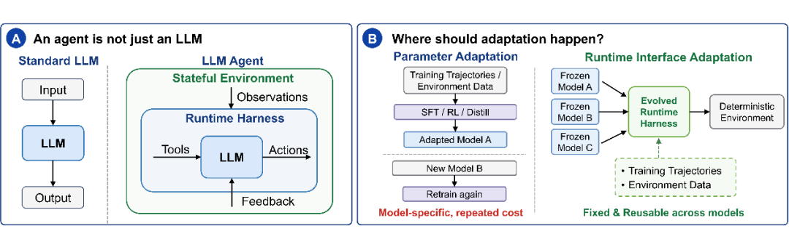
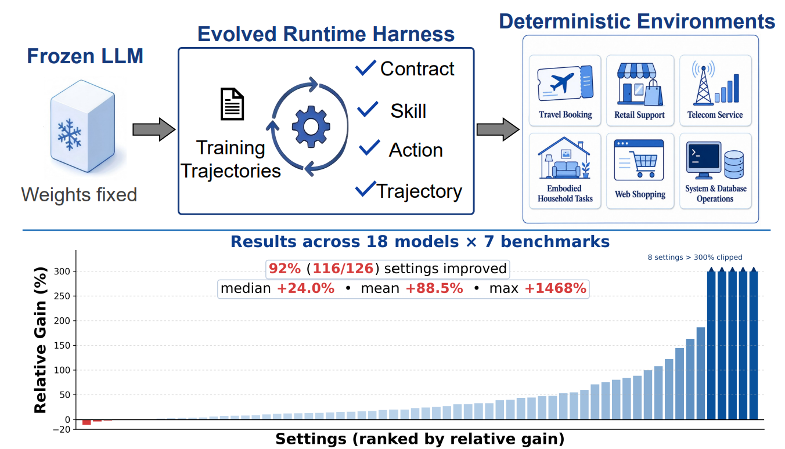
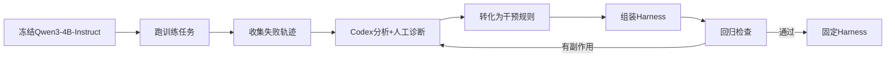
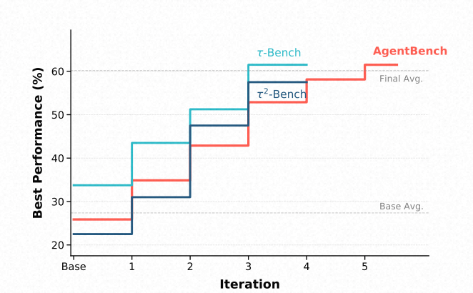
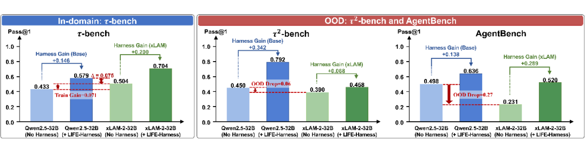
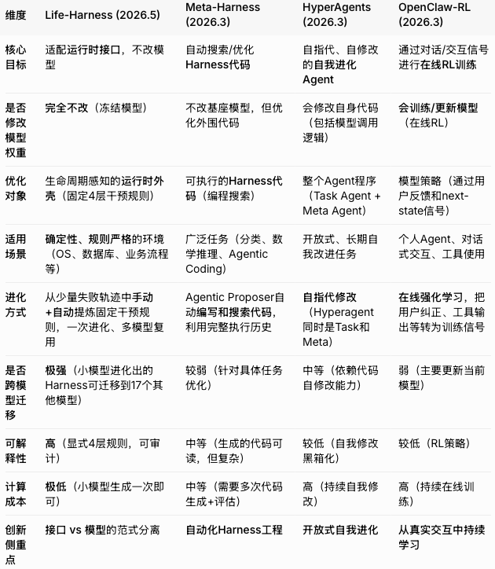

# LIFE-HARNESS 论文调研报告

> 调研时间：2026-06-15
> 论文来源：arXiv:2605.22166

---

## 📋 基本信息

| 项目 | 内容 |
|-----|------|
| 论文标题 | Adapting the Interface, Not the Model: Runtime Harness Adaptation for Deterministic LLM Agents |
| 作者 | Tianshi Xu 等（北京大学团队） |
| 发表年份 | 2026 |
| 论文链接 | https://arxiv.org/abs/2605.22166 |
| 代码仓库 | https://github.com/Tianshi-Xu/Life-Harness |
| 核心贡献 | 提出LIFE-HARNESS，一个面向确定性LLM Agent的生命周期感知运行时外壳 |

---

## 1. 研究背景与动机

### 1.1 问题定义

提升LLM Agent的能力，一定要重新训练模型吗？

当前主流的Agent适配方法本质上还是在做**模型适配**：
- 更大的模型
- 更强的指令微调（SFT）
- 更复杂的强化学习（RL）
- 更精细的蒸馏

这些方法虽然有效，但也带来显著问题：
- **训练成本高**：需要大量计算资源
- **模型绑定强**：换模型就要重新适配
- **迭代周期慢**：每次改进都要重新训练

### 1.2 研究动机

在很多垂直领域Agent任务中，失败未必完全来自模型参数。很多时候，问题发生在**模型与环境的接口处**：

<p align="center"><b>表1：接口失败类型</b></p>

| 接口失败类型 | 具体表现 |
|------------|---------|
| 工具理解错误 | 模型没有正确理解工具schema |
| 动作格式错误 | 本来应该调用tool，却写成自然语言 |
| 执行失败 | 动作意图正确，但格式无法被环境执行 |
| 反馈处理失败 | 环境返回错误反馈，但模型没有触发恢复 |
| 轨迹退化 | 轨迹陷入重复和停滞，耗尽step budget |

**核心洞察**：Agent不只是一个LLM，它是一个运行时系统。模型观察环境、调用工具、执行动作、接收反馈，并在多轮交互中持续决策。最终表现不仅由模型本身决定，也由这套**runtime harness**决定。


<p align="center"><i>图1：Agent系统架构对比。(A) Agent不只是LLM，它是一个闭环系统，由运行时外壳（Runtime Harness）来调解观察、工具、动作和反馈；(B) 论文的核心思路——适配运行时接口而非模型参数。</i></p>

### 1.3 反差数据：模型能力与Agent表现的gap

论文给出了一个发人深省的对比数据：

<p align="center"><b>表2：模型能力与Agent表现对比</b></p>

| 模型 | HMMT（竞赛级数学） | ALFWorld（确定性具身交互） |
|-----|-------------------|---------------------------|
| Qwen3.5-4B | **74.0%** | **43.1%** |

**结论**：这种差距通常不是"模型不会推理"，而是模型与环境的接口出了问题——观察被组织得很乱、工具协议被误解、动作不可执行、反馈没转化成纠错信号、轨迹陷入重复……

### 1.4 研究目标

论文提出一个不同的方向：

> **Adapting the Interface, Not the Model**
>
> 不改模型，而是适配模型与环境之间的运行时接口。

核心问题：**能否不更新模型权重，只通过适配runtime harness来提升确定性LLM Agent？**

---

## 2. 核心贡献

### 2.1 主要贡献

| 编号 | 贡献描述 |
|-----|---------|
| C1 | 提出LIFE-HARNESS，一个面向确定性LLM Agent的lifecycle-aware runtime harness |
| C2 | 设计四层架构（环境契约层、技能层、动作层、轨迹层），覆盖Agent生命周期全流程 |
| C3 | 证明harness可以从训练轨迹演化，且跨模型迁移能力强 |

### 2.2 创新点

1. **范式创新**：从"模型中心"转向"系统中心"，Agent优化不再只是参数游戏
2. **方法创新**：将失败模式转化为可审计的运行时干预，而非模型更新
3. **工程创新**：四层结构各司其职，覆盖交互前、任务启动、执行前、执行后四个阶段

---

## 3. 方法详解

### 3.1 方法概述

LIFE-HARNESS的核心思想：

> **保持模型权重不变，保持评测环境不变，只从训练轨迹中挖掘可复用的失败模式，并将这些失败模式转化为运行时干预。**

### 3.2 整体架构

LIFE-HARNESS包含**4层**，分别作用在Agent生命周期的不同阶段：


<p align="center"><i>图2：整体方法对比——传统方式不断更新模型权重，而Life-Harness保持模型固定，只进化可复用的运行时外壳(runtime-harness)。</i></p>

**架构文字描述**：

四层结构按Agent交互生命周期组织，每层针对特定失败模式：

- **环境契约层**：在交互开始前生效，将环境特定的规则、工具描述、政策约束显式化
- **程序化技能层**：在任务启动时，根据任务描述从训练轨迹提炼的技能库中检索相关流程
- **动作实现层**：模型输出动作后、环境执行前介入，验证动作是否可执行
- **轨迹调控层**：环境反馈后生效，监控整个轨迹，检测退化模式并触发恢复策略

### 3.3 核心模块详解

#### 3.3.1 环境契约层（Environment Contract Layer）

**作用时机**：交互开始前

**核心功能**：
- 显式化工具规则、调用协议、答案格式
- 明确环境约束和常见陷阱
- 帮助模型准确理解"这个环境到底要求我怎么做"

**实现方式**：
对契约 $C$ 做一次增量更新：
$$C' = C \oplus \Delta C$$

$\Delta C$ 来自：
- 环境策略
- API行为
- 训练轨迹中的高频失败

**示例（Airline环境）**：
- 搜索只接受出发地、目的地、日期
- 取消工具列出四种合法取消条件
- 预订工具说明支付方式上限、五位乘客上限、可预订航班状态、保险与行李规则

#### 3.3.2 程序化技能层（Procedural Skill Layer）

**作用时机**：任务启动时

**核心功能**：
- 从训练轨迹中蒸馏可复用的过程性技能
- 形成技能记忆库 $S$
- 对于任务 $x$，通过BM25计算相关性并取Top-K

**实现方式**：
$$s^* = \text{argmax}_{s \in S} \text{BM25}(s, x)$$

检索到的技能被插入到初始system prompt中，给模型提供非参数化的引导。

**关键设计**：
- 实验中只用Top-1，刻意避免无关技能污染上下文
- 按任务类型先过滤再BM25排序

#### 3.3.3 动作实现层（Action Realization Layer）

**作用时机**：模型输出动作后、环境执行前

**核心功能**：
- 依据工具schema、合法动作集、参数约束验证动作
- 对确定会失败的调用直接阻断
- 对接口层的"无歧义错误"做规范化

**处理的问题类型**：
- Tool call缺失
- JSON格式错误
- 参数缺失
- 函数名错误
- SQL格式问题

**示例（OS/DBBench环境）**：
- 把模型写偏的自然语言/半结构化文本解析回 `bash` / `execute_sql`
- 自动对识别出的表名/列名加反引号
- 把NULL聚合结果在评测期望0时归零

#### 3.3.4 轨迹调控层（Trajectory Regulation Layer）

**作用时机**：环境反馈后

**核心功能**：
- 监控整个轨迹，检测退化模式
- 根据已执行动作、返回观察、剩余预算计算调控信号

**监控的退化模式**：
- 重复相同动作
- 在两个等价状态之间震荡
- 把预算耗完却毫无进展

**输出调控信号**：
$$r_t = f(a_{0:t}, o_{0:t}, b_t, E)$$

$r_t$ 可以是：
- 空（无需干预）
- 软提醒
- 重复失败的警告
- 强制纠偏指令

### 3.4 四层架构图示


<p align="center"><i>图3：LIFE-HARNESS四层架构概览。交互前明确环境契约，任务开始时提供过程技能，执行前规范动作，执行后调控轨迹。它们共同适配的是模型与环境之间的runtime interface。</i></p>

### 3.5 失败诊断分析

作者对393个失败episode进行归因分析：


<p align="center"><i>图4：训练任务上的失败模式诊断结果。显示不同环境中主导失败类型差异很大（动作实现、环境合约、轨迹退化、一般推理），这正是需要多层互补干预的原因。</i></p>

<p align="center"><b>表3：失败类型分布</b></p>

| 失败类型 | 占比 | 含义 |
|---------|------|------|
| Action realization | 23.2% | 意图合理，但动作无法被环境执行 |
| Environment contract | 33.3% | 动作合法，但违反工具用法或调用协议 |
| Trajectory degeneration | 33.6% | 单步合法，轨迹陷入重复、停滞或无效恢复 |
| General reasoning | 9.9% | 协议都对，但推理/计算/决策错了 |

**关键发现**：
1. 失败极度异质——没有哪种类型可以一家独大
2. **90%以上的失败都发生在"模型与环境的接口"上**
3. 不同环境的失败分布差别极大（如Airline的79%来自环境契约失误，ALFWorld的67%来自动作落地失败）

### 3.6 Harness演化过程

演化流程：



**演化约束**：
- 每个干预必须由"精确的环境/轨迹证据"触发
- 必须最小化、本地化，不在动作模糊时覆盖模型推理
- 不能用任何oracle信息、不能改环境、不能改评测
- 每轮更新后必须做回归检查，如有副作用就回退

**演化方法**：作者用 **Codex 作为编码 Agent** 来迭代演化 harness：
1. 用冻结的 Qwen3-4B-Instruct 反复跑训练任务，收集完整交互轨迹
2. Codex 读这些轨迹 + 当前 harness 实现 + 四层设计指南，提出针对性的更新
3. 目标有两个——**扩大对高频失败模式的覆盖**、**检测过度触发或破坏正确行为的回归案例**
4. 演化只在训练集上做，**测试集始终隐藏**，以保证泛化性评估的干净

---

## 4. 实验分析

### 4.1 实验设置

#### 数据集

<p align="center"><b>表4：实验数据集</b></p>

| Benchmark Suite | 环境 | 任务类型 |
|----------------|------|---------|
| τ-bench | Airline, Retail | 业务工作流 |
| τ²-bench | Telecom | 业务工作流 |
| AgentBench | ALFWorld, WebShop, OS, DBBench | 具身交互、网页购物、操作系统、数据库 |

#### 模型

18个不同backbone，包含：
- **指令微调模型**：Qwen系列、Llama系列
- **推理模型**：DeepSeek-R1-Distill等
- **Agent专用模型**：xLAM系列

#### 评估指标

<p align="center"><b>表5：评估指标</b></p>

| 指标 | 说明 |
|-----|------|
| Pass@1 | 单次通过率 |
| Pass^3 | 三次尝试通过率 |

#### 实验协议

- Harness只从Qwen3-4B-Instruct的训练轨迹演化
- 评估时模型权重完全冻结
- 环境不变
- Harness在评估中可使用当前episode历史，但不从评估失败中创建新干预

### 4.2 主实验结果


<p align="center"><i>图5：18个模型 × 7个benchmark的绝对提升热力图。</i></p>

<p align="center"><b>表6：LIFE-HARNESS在7个benchmark上的主实验结果</b></p>

| Suite | Benchmark | Metric | w/o | w/ LIFE-HARNESS | Rel. Gain | Improved |
|-------|-----------|--------|-----|-----------------|-----------|----------|
| AgentBench | ALFWorld | Pass@1 | 41.1% | **75.7%** | +84% | 17/18 |
| AgentBench | WebShop | Pass@1 | 31.4% | **44.0%** | +40% | 18/18 |
| AgentBench | OS | Pass@1 | 34.7% | **41.2%** | +19% | 18/18 |
| AgentBench | DBBench | Pass@1 | 48.4% | **64.6%** | +34% | 18/18 |
| τ-bench | Airline | Pass@1 | 49.7% | **62.6%** | +26% | 16/18 |
| τ-bench | Airline | Pass^3 | 34.7% | **52.2%** | +50% | 17/18 |
| τ-bench | Retail | Pass@1 | 56.2% | **61.8%** | +10% | 14/18 |
| τ-bench | Retail | Pass^3 | 37.9% | **45.3%** | +19% | 15/18 |
| τ²-bench | Telecom | Pass@1 | 55.3% | **69.0%** | +25% | 17/18 |
| τ²-bench | Telecom | Pass^3 | 41.5% | **52.6%** | +27% | 18/18 |

**汇总结果**：
- **126个model-environment设置中，116个获得提升**
- **平均相对改进88.5%**
- 跨模型迁移极强：一个小模型生成的Harness对大模型同样有效

### 4.3 演化动态分析


<p align="center"><i>图6：训练集表现随演化轮数的变化曲线。Qwen3-4B-Instruct的训练集表现随着harness迭代轮数稳定提升并最终饱和。</i></p>

**关键观察**：快速收敛恰好得益于四层结构——更新是定位到具体失败模式的、局部的，而不是像Meta-Harness那样把harness当成自由代码整体改写。

### 4.4 消融实验

<p align="center"><b>表7：去一层消融实验（相对准确率下降）</b></p>

| Setting | Airline | Retail | Telecom | ALFWorld | WebShop | OS | DBBench |
|---------|---------|--------|---------|----------|---------|-----|---------|
| LIFE-HARNESS | 0.0% | 0.0% | 0.0% | 0.0% | 0.0% | 0.0% | 0.0% |
| w/o Contract | -8.3% | -17.5% | -16.0% | -1.0% | -4.4% | -14.1% | -16.9% |
| w/o Skill | -8.3% | -15.9% | -17.4% | -1.0% | -2.2% | -14.1% | -3.1% |
| w/o Action | **-61.7%** | -15.9% | -10.1% | -1.0% | -6.6% | **-59.6%** | -4.6% |
| w/o Trajectory | -3.3% | -16.7% | **-36.2%** | **-86.5%** | -26.4% | -14.1% | -4.6% |

**关键发现**：
- 每一层都不可或缺
- 不同环境的"主导失败模式"决定最依赖哪一层
- ALFWorld极度依赖轨迹调控（-86.5%）
- Airline和OS高度依赖动作落地（-61.7%, -59.6%）

### 4.5 与Prompt演化对比


<p align="center"><i>图7：LIFE-HARNESS vs Prompt-evolving 在7个benchmark上的Pass@1对比。</i></p>

LIFE-HARNESS vs 纯prompt演化（如GEPA、OPRO）：
- 纯prompt演化虽然有改善
- LIFE-HARNESS比它们**再高出120%的平均相对增益**

**原因**：Agent表现不只取决于初始prompt，还取决于运行时如何中介工具调用、动作落地、反馈解读和多步轨迹——这些是纯prompt优化覆盖不到的。

### 4.6 与模型训练的互补性


<p align="center"><i>图8：训练 vs harness的对照实验。即使是经过tool-use训练的agent-specialized model，加入LIFE-HARNESS后仍然可以继续提升。</i></p>

使用xLAM-2-32B（基于Qwen2.5-32B-Instruct，专门为τ-bench类工具调用做了后训练）做对比：

<p align="center"><b>表8：训练与Harness对比结果</b></p>

| 设置 | 结果 |
|-----|------|
| Qwen2.5-32B + LIFE-HARNESS vs xLAM-2-32B | 前者高7.5个百分点 |
| xLAM + LIFE-HARNESS | 继续提升6.8~28.9个百分点 |
| xLAM在OOD（τ²-bench, AgentBench） | 居然低于其基座Qwen2.5 |

**结论**：
- 训练vs harness适配的是不同对象
- 训练把参数拟合到训练分布——in-domain有效，但model-specific、distribution-specific
- Harness适配的是确定性环境的接口——environment-specific、model-agnostic
- **两者互补**

### 4.7 实验结果总体分析

基于上述实验结果，总结以下关键发现：

1. **跨模型迁移性强**：用Qwen3-4B生成的Harness能直接迁移到其他17个模型，证明它捕捉的是环境侧的稳定结构，而非模型特定行为

2. **不同环境依赖不同层**：
   - ALFWorld：轨迹调控层最关键（具身交互任务容易陷入重复）
   - Airline/OS：动作实现层最关键（工具调用格式要求严格）
   - Telecom/Retail：四层都重要（复杂的业务流程）

3. **与训练互补**：即使经过工具使用训练的Agent专用模型，加入LIFE-HARNESS后仍可继续提升

---

## 5. 相关工作

### 5.1 相关工作列表

<p align="center"><b>表9：相关工作列表</b></p>

| 论文/方法 | 年份 | 核心思想 | 与本文关系 |
|----------|-----|---------|-----------|
| SFT/RL-based Agent | 2023-2026 | 通过训练提升Agent能力 | 本文的对比范式 |
| Meta-Harness | 2024 | 让Agent自动写代码优化Harness | 同类工作，但更偏向自动化编程 |
| HyperAgents | 2024 | 自指代自我改进系统 | 更激进的进化方向 |
| OpenClaw-RL | 2024 | 通过对话信号进行在线RL | 边用边训练范式 |

### 5.2 与相关工作的区别

<p align="center"><b>表10：四种框架对比</b></p>

| 维度 | Life-Harness | Meta-Harness | HyperAgents | OpenClaw-RL |
|-----|-------------|--------------|-------------|-------------|
| 核心路径 | 结构化干预规则 | 自动化代码搜索 | 自我修改代码 | 在线RL训练 |
| 模型权重 | 完全冻结 | 冻结 | 允许修改 | 持续训练 |
| 适配对象 | 运行时接口 | Harness代码 | 自身代码 | 模型参数 |
| 可审计性 | 高（显式规则） | 中 | 低 | 低 |
| 适用场景 | 确定性环境 | 需要定制化任务 | 开放式进化 | 在线学习 |

### 5.3 四种框架对比图


<p align="center"><i>图9：Life-Harness与其他自进化框架（Meta-Harness、HyperAgents、OpenClaw-RL）的对比。</i></p>

**详细对比**：

**1. Life-Harness vs Meta-Harness**
- Life-Harness **不写代码、不搜索代码**，而是把失败模式转化为**结构化、可解释的运行时干预规则**
- Meta-Harness 让Agent自动写代码来优化Harness，属于端到端代码搜索方法
- **结论**：Life-Harness更适合确定性强、生产环境需要稳定、可审计的场景

**2. Life-Harness vs HyperAgents**
- HyperAgents 是典型的**自指代自我改进**系统
- Life-Harness **严格分离**模型和运行时接口，模型保持完全冻结
- **结论**：Life-Harness追求**稳定与可控**，HyperAgents追求**无限自我进化潜力**

**3. Life-Harness vs OpenClaw-RL**
- OpenClaw-RL 通过用户对话、纠正、工具反馈等进行**在线强化学习**
- Life-Harness **完全避免模型训练**
- **结论**：一个是"**不训练只适配**"，一个是"**边用边训练**"

---

## 6. 局限性分析

### 6.1 论文声明的局限性

1. **环境限制**：聚焦确定性环境（规则明确、无随机性），在高度开放、创造性任务中效果可能打折

2. **演化自动化程度**：Harness进化目前有一定人工参与（失败诊断），未来可更自动化

### 6.2 潜在问题

| 问题类型 | 描述 | 影响 |
|---------|-----|------|
| 方法层面 | 对fully open-ended的Agent任务难以定义稳定运行时接口 | 适用范围受限 |
| 实验层面 | 只在确定性环境验证，开放环境效果未知 | 泛化性待验证 |
| 应用层面 | 需要领域专家参与失败诊断 | 部署成本 |

### 6.3 未来工作方向

- 更自动化的Harness演化（用LLM自我诊断+验证）
- 动态Harness（在部署中持续轻量进化，但保持评估分离）
- 多智能体协作场景下的接口适配
- 与推理时计算分配、记忆系统等的深度结合

---

## 7. 个人评价

### 7.1 优点

1. **范式创新**：从"模型中心"转向"系统中心"，打开了Agent优化的新视角
2. **工程价值高**：可审计、可迁移、成本低，适合工业场景
3. **实验充分**：7个环境、18个模型、126个设置，验证全面
4. **与训练互补**：不是替代，而是补充，可以叠加使用

### 7.2 不足

1. **适用范围受限**：主要针对确定性环境，开放环境效果待验证
2. **人工参与度**：失败诊断需要领域专家参与
3. **动态性不足**：Harness进化后固定，无法在线适应

### 7.3 适用场景

- **适合**：
  - 确定性、规则明确的垂域Agent任务
  - 数据库操作、业务流程、客服系统
  - 需要多模型部署的场景
  - 对可审计性要求高的场景

- **不适合**：
  - 高度开放、创造性的任务
  - 每个任务用不同工具、不同资源、不同成功标准的场景
  - 需要在线快速适应的场景

---

## 8. 启发与思考

### 8.1 技术启发

1. **"在哪里适配"是Agent设计的真正分水岭**：
   - 参数适配：把领域知识写进模型（model-specific + distribution-specific）
   - Harness适配：把领域知识写进接口（environment-specific + model-agnostic）

2. **失败诊断的方法学价值**：接口级root-cause分析值得被更广泛采用

3. **与Coding Agent范式的呼应**：作者用Codex来演化harness本身就是"Agent帮Agent调harness"的真实案例

### 8.2 可借鉴之处

1. **先做失败归因，再决定优化方向**：如果70%的失败来自动作落地或环境契约理解，训模型可能不是性价比最高的选项

2. **把高频、机械、可被环境信号识别的失败，在合适的生命周期点上拦下来**，而不是训练模型记住所有"潜规则"

3. **四层结构的设计思路**可以应用到其他Agent系统：
   - 交互前：明确规则
   - 任务开始：检索经验
   - 执行前：验证动作
   - 执行后：监控轨迹

### 8.3 潜在改进方向

1. **更自动化的失败诊断**：用LLM自动分析失败轨迹，减少人工参与
2. **动态Harness**：在部署中持续轻量进化
3. **多环境联合Harness**：让Harness能适应类似但不完全相同的环境
4. **与模型微调的结合**：探索harness和参数适配的最优结合方式

### 8.4 后续行动

- [ ] 阅读Meta-Harness论文，对比两种harness演化方法
- [ ] 复现LIFE-HARNESS在τ-bench上的实验
- [ ] 尝试将四层结构应用到自己的Agent项目中

---

## 参考文献

```bibtex
@article{xu2026lifeharness,
  title={Adapting the Interface, Not the Model: Runtime Harness Adaptation for Deterministic LLM Agents},
  author={Xu, Tianshi and others},
  journal={arXiv preprint arXiv:2605.22166},
  year={2026}
}
```

---

## 附录

### A. 四层结构详细设计

#### A.1 环境契约层实现

**Airline环境示例**：
- Contract层：在工具描述里直接写清楚
  - 搜索只接受出发地、目的地、日期
  - 取消工具列出四种合法取消条件
  - 预订工具说明支付方式上限、五位乘客上限、可预订航班状态、保险与行李规则

**ALFWorld环境示例**：
- Contract层：从任务描述里抽取
  - 任务类型、目标物体、目的容器、所需变换、物体数量、子目标链

#### A.2 动作实现层实现

**Airline环境示例**：
- `book_reservation`检查：
  - 重复payment ID
  - 最多一张证书、一张信用卡、三张礼品卡
  - 五位乘客上限、连续行程、座位充足
  - 行李费正确、支付金额精确
- `cancel_reservation`拦截：
  - "已飞航班取消"等死局

**OS/DBBench环境示例**：
- 对工具调用做"救援"
  - 把模型写偏的自然语言/半结构化文本解析回 `bash` / `execute_sql`
- 自动对识别出的表名/列名加反引号
- 把NULL聚合结果在评测期望0时归零

#### A.3 轨迹调控层实现

**Airline环境示例**：
- `get_user_details`自动追加每个reservation的一行摘要
- `cancel_reservation`自动追加退款金额与目标支付工具

**ALFWorld环境示例**：
- 维护一个WorldModel，记录：
  - 持有物、当前位置、已访问位置、目标位置、灯位等
- 自动推进子目标状态机
- 捕捉：震荡、空回合、open/close重复、look/inventory死循环

### B. 调研信息

- 调研人：Claude
- 调研时间：2026-06-15
- 参考来源：
  - 论文arXiv:2605.22166
  - 微信公众号文章（PaperWeekly、峥嵘岁月AI、智猩猩AI、AI速译官）
  - GitHub仓库：https://github.com/Tianshi-Xu/Life-Harness
