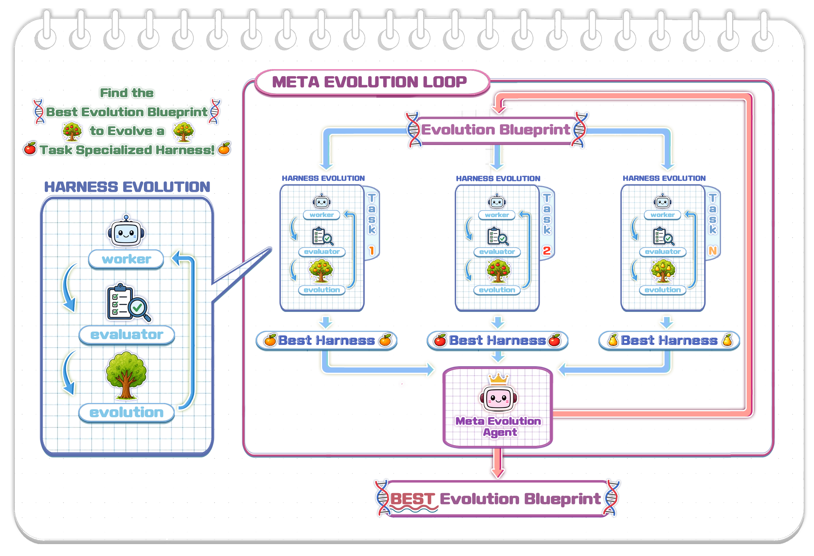

# The Last Harness You'll Ever Build 论文调研报告

> arXiv:2604.21003 | ICLR 2026 Conference

---

## 📋 基本信息

<p align="center"><b>表1：论文基本信息</b></p>

| 项目 | 内容 |
|-----|------|
| 论文标题 | The Last Harness You'll Ever Build |
| 作者 | Haebin Seong, Li Yin, Haoran Zhang, Zhan Shi |
| 所属机构 | Sylph.AI |
| 发表会议 | ICLR 2026 Conference |
| 发表年份 | 2026 |
| 论文链接 | https://arxiv.org/abs/2604.21003 |
| 项目主页 | 暂无 |
| 代码仓库 | 暂无开源代码 |
| 引用数 | 暂无数据（新发表） |

---

## 1. 研究背景与动机

### 1.1 问题定义

AI Agent 越来越多地被部署在复杂的、领域特定的工作流程中：
- 企业 Web 应用导航（需要数十次点击和表单填写）
- 多步骤研究流水线编排（搜索、提取、综合）
- 跨陌生代码库的自动化代码审查
- 需要领域知识的客户升级处理

**核心问题**：每个新的任务领域都需要艰苦的、专家驱动的 Harness 工程——设计提示词、工具、编排逻辑和评估标准，使基础模型能够有效执行任务。

### 1.2 研究动机

现有 Harness 工程方法存在严重局限性：

1. **高度专业化的人力投入**：
   - Lopopolo et al. (2026) 构建了自定义 linter、仓库级可观测性栈、Chrome DevTools 集成和结构化文档层次结构——全部为手工艺品
   - Rajasekaran et al. (2026) 经历了多轮评估器提示校准、设计四个主观设计质量评分标准、构建三智能体架构

2. **需要深度领域专业知识**：Harness 能改进 Agent，但改进 Harness 仍需大量人类专业知识应用于每个特定任务领域

3. **现有自动化方法的局限**：自动提示优化方法（如 LLM-AutoDiff）只能调优单个组件，无法解决完整的 Harness——工具、编排逻辑、基础设施及其交互

### 1.3 研究目标

论文提出一个**两层框架**，实现 Harness 工程的完全自动化：

1. **第一层目标**：Harness Evolution Loop —— 自动优化单个任务的 Worker Agent Harness
2. **第二层目标**：Meta-Evolution Loop —— 学习一个通用的进化蓝图，使其能在任何新任务上快速收敛

**终极愿景**：将手动 Harness 工程转变为自动化 Harness 工程，更进一步——**自动化设计自动化本身**。

---

## 2. 核心贡献

### 2.1 主要贡献

<p align="center"><b>表2：论文主要贡献</b></p>

| 编号 | 贡献描述 |
|-----|---------|
| C1 | 提出 **Harness Evolution Loop**：一个闭环架构，通过迭代执行、对抗性评估和代码修改自动优化 AI Agent 的 Harness |
| C2 | 提出 **Meta-Evolution Loop**：跨多样化任务优化进化蓝图本身，学习如何演化 Harness |
| C3 | 建立与元学习的形式化对应关系，为框架提供理论基础 |

### 2.2 创新点

1. **方法创新**：
   - 将 Harness 工程形式化为可优化的对象
   - 提出两层优化框架，实现"学会如何学习"
   - 建立 Agent = Model + Harness 的形式化定义

2. **技术创新**：
   - 分离评估（Evaluator）与演化（Evolution）Agent，避免自我合理化失败
   - 设计两层评分指标（先通过/失败，再执行时间作为决胜）
   - 全历史记录驱动演化，避免重复失败策略

3. **理论创新**：
   - 与元学习建立精确对应关系
   - 将 Harness 定义扩展到演化蓝图层面

---

## 3. 方法详解

### 3.1 方法概述

论文提出一个两层优化框架：

**核心思想**：将 Harness 工程从手动过程转变为自动化优化过程，更进一步，将优化过程本身也作为优化的对象。

- **Level 1 - Harness Evolution Loop**：优化单个任务的 Worker Harness $\mathcal{H}$
- **Level 2 - Meta-Evolution Loop**：优化进化蓝图 $\Lambda$ 本身

### 3.2 整体架构



*Figure 1: 系统整体架构。绿色外层为 Meta-Evolution Loop，跨多个训练任务优化进化蓝图 $\Lambda$；蓝色内层为 Harness Evolution Loop，针对单个任务优化 Worker Harness $\mathcal{H}$。*

**架构文字描述**：

该系统采用嵌套的两层循环结构：

**外层（Meta-Evolution Loop）**：
- 输入：训练任务集 $\mathcal{T}_{\text{train}} = \{t_1, t_2, \dots, t_n\}$，初始进化蓝图 $\Lambda^{(0)}$
- 执行：对每个任务运行内层 Harness Evolution Loop
- 聚合：收集所有任务的分数和历史
- 优化：Meta-Evolution Agent 修改蓝图 $\Lambda$
- 输出：最优进化蓝图 $\Lambda^{(\text{best})}$

**内层（Harness Evolution Loop）**：
- 输入：单个任务 $t$，当前蓝图 $\Lambda$
- 执行：Worker Agent 使用 Harness $\mathcal{H}$ 执行任务
- 评估：Evaluator Agent 对抗性诊断失败并评分
- 演化：Evolution Agent 分析历史并修改 Harness
- 输出：最优 Worker Harness $\mathcal{H}^{(\text{best})}$

**关键设计决策**：
1. 评估器与演化器分离：评估器对抗性验证，演化器建设性修改
2. 全历史驱动：演化器可访问所有历史迭代，避免重复错误
3. 从最优演化：每次从当前最优 Harness 开始修改

### 3.3 核心算法/模型

#### 3.3.1 Harness Evolution Loop 算法

```
Algorithm 1: The Harness Evolution Loop
Input: Task t, Worker Agent W_H, initial harness H^(0), 
       Evaluator Agent V, Evolution Agent E, iterations K
Output: Best harness H^(best), best_score, history

1. H^(best) ← H^(0); best_score ← -∞
2. history ← []  // Log of (H^(k), report, score, verdict) per iteration
3. FOR k = 1, 2, ..., K DO
4.     Rebuild W_H^(k-1) from H^(k-1)
5.     Prepare target environment; reset to clean state
6.     trace ← W_H^(k-1).execute(t)  // Worker runs task
7.     (report, score) ← V.evaluate(trace, t)  // Evaluator diagnoses
8.     IF score > best_score THEN
9.         verdict ← IMPROVED; H^(best) ← H^(k-1); best_score ← score
10.    ELSE
11.        verdict ← REGRESSED
12.    END IF
13.    history ← history ∪ {(H^(k-1), report, score, verdict)}
14.    H^(k) ← E.evolve(history, H^(best))  // Evolve from best harness
15. END FOR
16. RETURN H^(best), best_score, history
```

#### 3.3.2 算法逐步解读

<p align="center"><b>表3：Harness Evolution Loop 算法步骤解读</b></p>

| 步骤 | 操作 | 输入 | 输出 | 设计意图 |
|-----|-----|-----|-----|---------|
| Step 1-2 | 初始化 | $\mathcal{H}^{(0)}$ | 初始最优 Harness 和空历史 | 建立迭代起点 |
| Step 4-5 | 环境准备 | Harness | 干净的执行环境 | 确保公平、可复现的执行条件 |
| Step 6 | 任务执行 | 任务 $t$ | 执行轨迹 trace | Worker Agent 实际执行任务 |
| Step 7 | 评估诊断 | trace, $t$ | report, score | 对抗性验证结果、识别失败模式 |
| Step 8-12 | 更新最优 | score, best_score | verdict, $\mathcal{H}^{(\text{best})}$ | 追踪最佳表现、记录改进/退化 |
| Step 14 | Harness 演化 | history, $\mathcal{H}^{(\text{best})}$ | 新 Harness $\mathcal{H}^{(k)}$ | 基于全历史修改 Harness |

#### 3.3.3 Meta-Evolution Loop 算法

```
Algorithm 2: The Meta-Evolution Loop
Input: Meta-train tasks T_train, Meta-Evolution Agent E_meta,
       initial blueprint Λ^(0), inner-loop budget K
Output: Best blueprint Λ^(best), best_meta_score, meta_history

1. Λ^(best) ← Λ^(0); best_meta_score ← -∞
2. meta_history ← []
3. FOR j = 0, 1, 2, ... DO
4.     task_results ← []
5.     FOR each task t_i ∈ T_train DO
6.         H^(best)_i, score_i, history_i ← HarnessEvolutionLoop(t_i, Λ^(j), K)
7.         task_results ← task_results ∪ {(t_i, score_i, history_i)}
8.     END FOR
9.     meta_score ← Aggregate(task_results)  // Mean score across tasks
10.    IF meta_score > best_meta_score THEN
11.        verdict ← IMPROVED; Λ^(best) ← Λ^(j); best_meta_score ← meta_score
12.    ELSE
13.        verdict ← REGRESSED
14.    END IF
15.    meta_history ← meta_history ∪ {(Λ^(j), task_results, meta_score, verdict)}
16.    Λ^(j+1) ← E_meta.evolve(meta_history, Λ^(best))
17. END FOR
18. RETURN Λ^(best), best_meta_score, meta_history
```

### 3.4 关键模块详解

#### 模块A: Agent Harness 定义

- **功能**: 形式化定义 Agent 的 Harness 结构
- **核心概念**: $\mathbf{Agent = Model + Harness}$

**Harness 组件清单**：

| 组件 | 描述 |
|-----|------|
| System/Task Prompts | 系统级指令（身份、约束）和任务级指令（目标、成功标准、示例） |
| Tools/Skills | Agent 可调用的能力（文件编辑、Shell 执行、UI 交互、Web 搜索、MCP 服务器） |
| Bundled Infrastructure | 执行环境（文件系统、沙箱、浏览器、可观测性栈） |
| Orchestration Logic | 控制流（子 Agent 生成、交接、模型路由、反馈循环） |
| Hooks/Middleware | 确定性执行保证（压缩、续写、Lint 检查、验证循环） |
| Model Configurations | 模型选择、推理参数（温度、采样策略、Token 限制） |

- **意义**: Harness——而非模型——决定了 Agent 能感知什么、如何行动、工作如何编排和验证

#### 模块B: Worker Agent ($W_{\mathcal{H}}$)

- **功能**: 执行任务的 Agent，由 Harness $\mathcal{H}$ 参数化
- **接口**: $W_{\mathcal{H}}.\text{execute}(t) \rightarrow \tau$
- **输入**: 任务 $t = (I, S)$（指令 $I$ + 成功标准 $S$）
- **输出**: 执行轨迹 $\tau$（环境观察、动作日志、时间信息）

**代表性 Worker Agent**：
- AdaL、Claude Code、Codex：通用软件工程 Harness
- OpAgent：自主 Web 导航 Harness（Planner + Grounder + Reflector + Summarizer）

#### 模块C: Evaluator Agent ($V$)

- **功能**: 对抗性审查员，诊断失败并评分
- **接口**: $V.\text{evaluate}(\tau, t) \rightarrow (\text{report}, \text{score})$

**四大功能**：

| 功能 | 描述 |
|-----|------|
| 状态验证 | 交叉验证 Worker 观察与真实环境状态，检测幻觉或误解 |
| 标准检查 | 评估最终状态是否满足每个成功标准 $s_i \in S$ |
| 性能审计 | 分解执行时间为 LLM 时间 vs 工具时间，识别瓶颈 |
| 评分 | 两层指标：先通过/失败，再执行时间决胜 |

**设计原理**：评估器对抗性、怀疑性——验证声明与证据对比；演化器建设性——综合模式生成修复。分离这两个角色防止系统合理化失败而非诊断失败。

#### 模块D: Evolution Agent ($E$)

- **功能**: 演化驱动器，基于历史修改 Harness
- **接口**: $E.\text{evolve}(\text{history}, \mathcal{H}^{(\text{best})}) \rightarrow \mathcal{H}'$

**三大功能**：

| 功能 | 描述 |
|-----|------|
| 聚合诊断 | 读取完整演化历史，了解哪些 Harness 变体尝试过、报告内容、分数、改进/退化情况 |
| 识别失败模式 | 分类失败为重复类别（错误工具使用、推理循环、环境状态误解、延迟过高） |
| 修改 Harness | 基于诊断修改 Worker Harness（工具实现、系统提示、编排逻辑、观察结构、模型配置） |

**关键设计**：可修改 Harness 的每一部分（除模型参数外），实现最大可定制性。

#### 模块E: Evolution Blueprint ($\Lambda$)

- **定义**: $\Lambda = (W_{\mathcal{H}}, \mathcal{H}^{(0)}, V, E)$
- **意义**: 完整指定 Harness 如何被演化

**$\Lambda$ 的可优化组件**：

| 组件 | 可修改内容 |
|-----|----------|
| Evaluator Prompt | 检查什么失败模式、如何评分、需要什么证据 |
| Evolution Prompt | 如何诊断失败模式、优先什么代码修改、修改 Worker 的激进程度 |
| Worker Observation | 从 Worker 执行中显示什么遥测、轨迹、中间状态 |
| Inter-Agent Observation | 各步骤间 Agent 间流动什么信息 |
| Scoring Function | 指标结构（两层 vs 多维）、阈值、决胜条件 |
| Loop Hyperparameters | 迭代次数、并行度、回滚阈值、停止标准 |

### 3.5 关键技术

<p align="center"><b>表4：关键技术点</b></p>

| 技术点 | 描述 | 作用 | 论文对应位置 |
|-------|-----|-----|------------|
| Harness 形式化 | Agent = Model + Harness | 明确优化对象边界 | Section 2.1 |
| 两层评分指标 | 先通过/失败，再时间决胜 | 确保正确性优先，效率为次 | Section 2.4 |
| 全历史演化 | Evolution Agent 可访问所有历史迭代 | 避免重复失败策略 | Algorithm 1 |
| 从最优演化 | 每次从当前最优 Harness 开始修改 | 稳步提升，不浪费已获得改进 | Algorithm 1 Line 14 |
| 元学习对应 | 内层=任务适应，外层=元优化 | 提供理论框架和优化目标 | Section 3.2 |
| Blueprint 作为 Harness | $\Lambda$ 本身也是 Harness | 实现两层优化的统一视角 | Section 3.1 |

### 3.6 方法设计的关键洞察

1. **洞察1：Harness 是可优化的完整对象**
   - 传统方法只优化单个组件（如提示词），忽略了工具、编排逻辑、基础设施的协同优化
   - 将 Harness 视为整体优化对象，可以解锁更大的性能提升空间

2. **洞察2：演化过程本身也是 Harness**
   - 演化蓝图 $\Lambda$ 由提示词、工具、观察、编排逻辑组成——与普通 Harness 结构相同
   - 因此可以用同样的 Harness 优化方法来优化 $\Lambda$ 本身
   - 这是"自动化设计自动化本身"的理论基础

3. **洞察3：分离评估与演化的必要性**
   - 评估器需要对抗性、怀疑性——验证声明与证据
   - 演化器需要建设性——综合模式、生成修复
   - 合并这两个角色会导致系统"合理化"失败而非诊断失败

### 3.7 与现有方法的核心区别

<p align="center"><b>表5：与现有方法的对比</b></p>

| 环节 | 现有方法做法 | 本文做法 | 改变原因 |
|-----|------------|---------|---------|
| Harness 工程方式 | 手工设计、专家驱动 | 自动化演化循环 | 减少人力投入、实现规模化 |
| 优化对象 | 单个组件（如提示词） | 完整 Harness（工具、编排、基础设施） | 考虑组件间协同、解锁更大优化空间 |
| 评估方式 | 内嵌或后验 | 独立对抗性 Evaluator Agent | 提供无偏诊断、避免自我合理化 |
| 迭代策略 | 仅使用当前结果 | 全历史驱动 | 避免重复错误、积累学习 |
| 跨任务泛化 | 每任务从头设计 | Meta-Evolution 学习通用蓝图 | 新任务快速适应、无需重新设计 |
| 理论基础 | 实验驱动 | 元学习形式化 | 提供优化目标和收敛保证 |

---

## 4. 与元学习的对应关系

### 4.1 元学习框架映射

论文建立了与元学习的精确对应关系：

<p align="center"><b>表6：Meta-Learning 与 Meta-Evolution 对应关系</b></p>

| Meta-Learning | Meta-Evolution |
|--------------|----------------|
| 被适应的参数：$\theta$ | 被演化的 Harness：$\mathcal{H}$ |
| 适应过程（$\theta^{(0)}$、优化器、损失） | 进化蓝图 $\Lambda = (W_{\mathcal{H}}, \mathcal{H}^{(0)}, V, E)$ |
| 内层循环：任务 $t_i$ 上的梯度更新 | 内层循环：$\textsc{HarnessEvolutionLoop}(t_i, \Lambda, K)$ |
| 外层循环：元梯度更新 | 外层循环：$E_{\text{meta}}.\text{evolve}(\text{meta\_history}, \Lambda^{(\text{best})})$ |
| 元训练任务 | 训练任务集 $\mathcal{T}_{\text{train}}$ |
| 元测试任务 | 持有任务集 $\mathcal{T}_{\text{test}}$ |
| 目标：快速适应新任务 | 目标：新任务上快速 Harness 收敛 |

### 4.2 优化目标

**外层优化目标**：

$$\Lambda^{(\text{best})} = \arg\max_{\Lambda} \; \mathbb{E}_{t_i \sim \mathcal{T}_{\text{train}}} \left[ \text{best\_score}\big(\textsc{HarnessEvolutionLoop}(t_i, \Lambda, K)\big) \right]$$

**评估指标**：

| 指标 | 描述 |
|-----|------|
| 收敛速度 | 达到目标性能阈值所需的内层迭代次数 |
| 最终性能 | 固定迭代次数后的任务通过率 |
| 鲁棒性 | 不同元测试任务间收敛速度的方差 |

---

## 5. 相关工作

### 5.1 相关工作列表

<p align="center"><b>表7：相关工作列表</b></p>

| 论文/方法 | 年份 | 核心思想 | 与本文关系 |
|----------|-----|---------|-----------|
| Lopopolo et al. (Harness Engineering) | 2026 | 构建 Harness 使 Agent 更有效，但需要深度专业知识 | 本文的问题来源：Harness 工程是人力密集型 |
| Rajasekaran et al. (Harness Engineering) | 2026 | 三 Agent 架构、迭代评估器校准 | 本文的问题来源：每个领域需要定制 Harness |
| Trivedy et al. (Harness) | 2026 | Agent = Model + Harness 形式化 | 本文的基础概念 |
| LLM-AutoDiff (Yin et al.) | 2025 | 自动提示优化 | 本文的对比：只优化单个组件，非完整 Harness |
| AdaL (Sylph.AI) | 2026 | 通用软件工程 Harness | 可作为 Worker Agent |
| Claude Code (Anthropic) | 2025 | 通用软件工程 Harness | 可作为 Worker Agent |
| Codex (OpenAI) | 2025 | 通用软件工程 Harness | 可作为 Worker Agent |
| OpAgent (Guo et al.) | 2026 | Web 导航 Harness（WebArena SOTA） | 可作为 Worker Agent |
| WebArena (Zhou et al.) | 2024 | Web Agent 基准测试 | OpAgent 的评估环境 |
| Thrun (Meta-Learning) | 1998 | 元学习框架 | 本文的理论基础 |

### 5.2 本文与相关工作的区别

**与 Harness Engineering 工作的区别**：
- 现有工作：展示精心设计的 Harness 能显著提升 Agent 能力，但 Harness 本身需要专家手工构建
- 本文：自动化 Harness 构建，消除对领域专家的依赖

**与自动提示优化的区别**：
- 现有工作（如 LLM-AutoDiff）：只调优单个组件（提示词）
- 本文：优化完整 Harness（提示词 + 工具 + 编排逻辑 + 基础设施 + 模型配置）

**与元学习的关系**：
- 元学习提供了理论基础和形式化框架
- 本文将 Harness 演化映射到元学习，使得已有的元学习理论和算法可以应用

---

## 6. 局限性分析

### 6.1 论文声明的局限性

论文目前是理论框架论文，作者在结论中声明：

1. **暂无实验验证**：论文提出了框架和算法，但尚未提供实验结果
2. **待后续发表**：作者计划后续发表在"多样化的、一直抗拒自动化的工作流程"上的实验结果

### 6.2 发现的潜在问题

<p align="center"><b>表8：潜在问题分析</b></p>

| 问题类型 | 描述 | 影响 |
|---------|-----|------|
| 方法层面 | Evolution Agent 和 Meta-Evolution Agent 本身需要精心设计 | 可能只是将问题从 Worker Harness 转移到了 Evolution Harness |
| 方法层面 | 全历史演化的计算成本可能很高 | 大规模应用可能受限 |
| 方法层面 | 两层循环的收敛性未理论证明 | 不确定在所有任务上都能收敛 |
| 实验层面 | 论文未提供任何实验数据 | 无法评估方法实际效果 |
| 应用层面 | 需要大量训练任务才能学到有效的元蓝图 | 冷启动问题 |
| 应用层面 | 对环境重置要求严格（每次迭代需要干净状态） | 某些任务难以满足 |

### 6.3 未来工作方向

论文提出的未来方向：

1. **实验验证**：在多样化工作流程上验证框架效果
2. **产品发布**：基于学习到的 $\Lambda^{(\text{best})}$ 发布产品，让用户无需 Harness 工程专业知识即可将通用 Agent 适配到新任务领域

---

## 7. 个人评价

### 7.1 优点

1. **概念创新**：提出"Harness 是可优化的完整对象"这一核心洞察，将分散的优化问题统一
2. **框架优雅**：两层循环结构清晰，与元学习对应自然
3. **理论扎实**：形式化定义完整，与元学习框架的映射精确
4. **愿景宏大**：从自动化到"自动化设计自动化"，层层递进
5. **实用价值高**：解决了 AI Agent 领域的真实痛点（Harness 工程人力密集）

### 7.2 不足

1. **缺少实验验证**：目前只是理论框架，无法判断实际效果
2. **复杂性转移疑虑**：将 Worker Harness 工程问题转移到 Evolution Harness 设计，可能只是换了个地方
3. **成本分析缺失**：未分析两层循环的计算成本和收敛时间
4. **失败案例未讨论**：未讨论什么情况下方法可能失效

### 7.3 适用场景

- **适用**：
  - 需要部署多个领域特定 Agent 的组织
  - 有大量相似任务可做元训练数据的场景
  - 任务环境可精确重置的场景
  - 有充足计算资源的场景

- **不适用**：
  - 只有少量任务的场景（元学习需要多样性）
  - 环境难以重置的任务（如持久化数据修改）
  - 对成本敏感的场景（两层循环成本高）

---

## 8. 启发与思考

### 8.1 技术启发

1. **Harness 作为一等公民**：将 Harness 与 Model 同等重视，打开新的优化空间
2. **演化作为学习**：将"修改代码"作为学习机制，类比于但不同于梯度下降
3. **历史作为上下文**：全历史记录驱动演化，类似人类工程师的经验积累

### 8.2 可借鉴之处

1. **两层优化思想**：可用于其他"优化器本身需要优化"的问题
2. **对抗性评估设计**：评估与演化分离的原则可推广
3. **元学习映射方法**：将非传统优化问题映射到已知框架的思路

### 8.3 潜在改进方向

1. **理论分析**：
   - 证明收敛性条件
   - 分析计算复杂度
   - 研究泛化界

2. **实验验证**：
   - 在多个领域（Web、代码、研究）验证
   - 对比手工 Harness vs 演化 Harness
   - 消融研究（全历史 vs 最近历史、两层评分 vs 单层）

3. **方法改进**：
   - 研究如何减少对训练任务数量的依赖
   - 探索增量式环境重置（非完全重置）
   - 引入并行演化提高效率

### 8.4 后续行动

- [ ] 关注论文后续实验结果发布
- [ ] 阅读 Harness Engineering 相关论文（Lopopolo 2026, Rajasekaran 2026）
- [ ] 阅读元学习经典论文（Thrun 1998）
- [ ] 思考如何将框架应用到自己的 Agent 项目

---

## 参考文献

```bibtex
@inproceedings{seong2026lastharness,
  title={The Last Harness You'll Ever Build},
  author={Seong, Haebin and Yin, Li and Zhang, Haoran and Shi, Zhan},
  booktitle={ICLR 2026 Conference},
  year={2026}
}

@article{lopopolo2026harness,
  title={Harness Engineering for AI Agents},
  author={Lopopolo and others},
  year={2026}
}

@article{rajasekaran2026harness,
  title={Harness Engineering for AI Agents},
  author={Rajasekaran and others},
  year={2026}
}

@article{trivedy2026harness,
  title={Agent = Model + Harness},
  author={Trivedy and others},
  year={2026}
}

@article{yin2025llmautodiff,
  title={LLM-AutoDiff: Automatic Prompt Optimization},
  author={Yin, Li and others},
  year={2025}
}

@book{thrun1998learning,
  title={Learning to Learn},
  author={Thrun, Sebastian and Pratt, Lorien},
  year={1998},
  publisher={Springer}
}
```

---

## 附录

### A. 关键图表

<p align="center"><b>表9：关键图表索引</b></p>

| Figure | 描述 | 报告内位置 |
|--------|------|-----------|
| Figure 1 | System Architecture - 系统整体架构（双层循环） | Section 3.2 |

### B. 流程图索引

<p align="center"><b>表10：Mermaid流程图索引</b></p>

| 图表 | 描述 | 报告内位置 |
|------|------|-----------|
| 无 | 本论文已有清晰的算法伪代码，无需额外流程图 | - |

### C. 补充材料

论文暂无补充材料。

### D. 调研信息

- 调研人: Claude (Research Skill)
- 调研时间: 2026-06-16
- 论文版本: arXiv v3 (Updated May 1, 2026)
- 参考来源: arXiv PDF, arXiv Source Files

---

*模板版本: v2.2*
