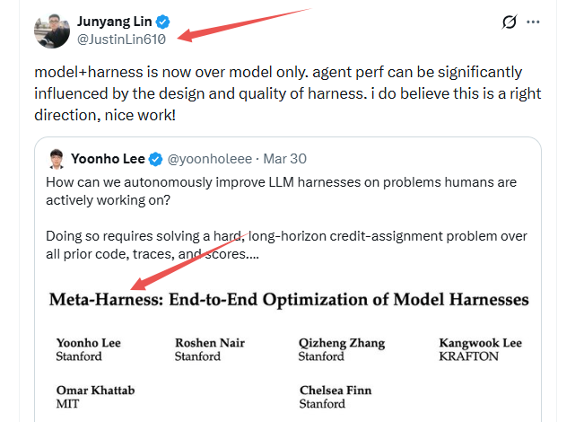
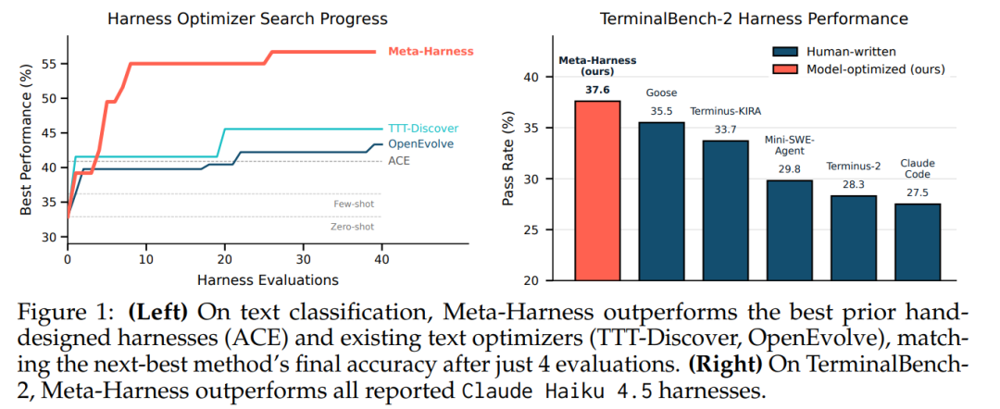
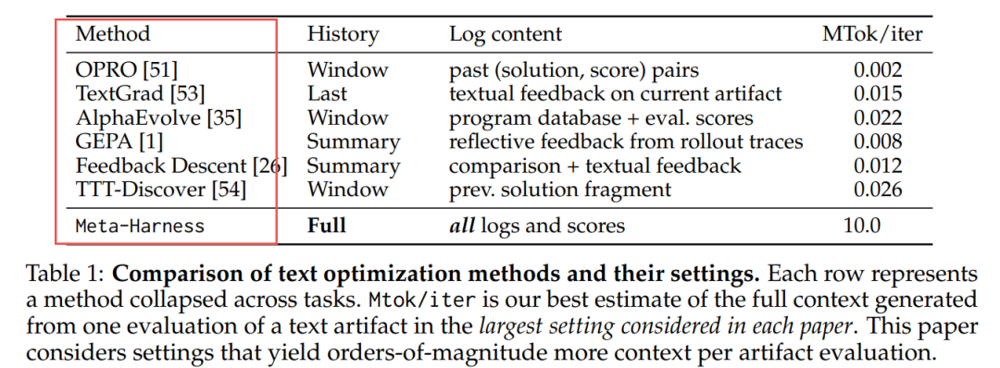
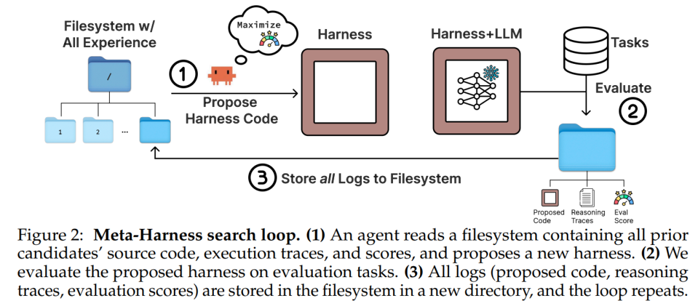
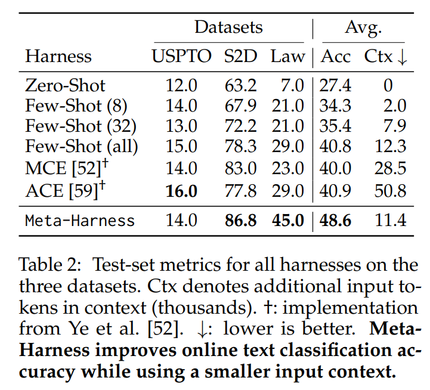
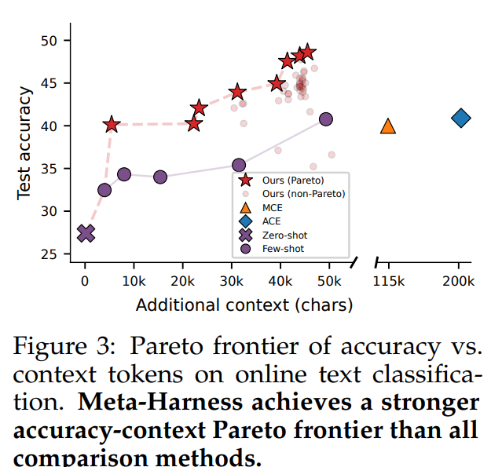
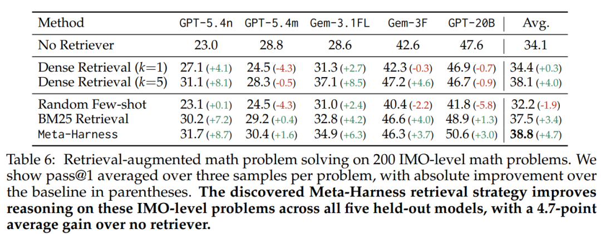
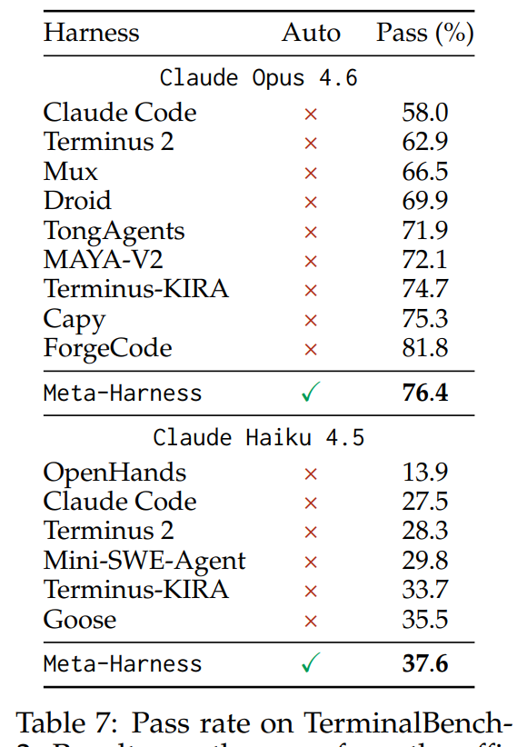
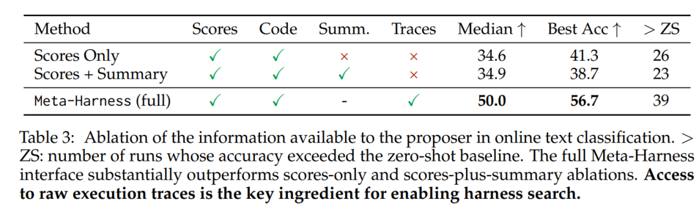

# Meta-Harness：斯坦福最新Harness论文，林俊旸点赞

Source: https://mp.weixin.qq.com/s/vEdDLMXsMsXsOgFIhO0sqQ


# Meta-Harness：斯坦福最新Harness论文，林俊旸点赞

[PaperAgent](javascript:void(0);)


在小说阅读器读本章

去阅读


在小说阅读器中沉浸阅读

大家好，我是PaperAgent，不是Agent！

今天分享**林俊旸（担任过阿里Qwen负责人）** 大佬点赞的一篇斯坦福最新**Harness**论文，他直言：“nice work”   [美团LongCat-Next这波开源突破，挺颠覆的~](https://mp.weixin.qq.com/s?__biz=Mzk0MTYzMzMxMA==&mid=2247505843&idx=1&sn=9a8a4915606ee747998015395413db87&scene=21#wechat_redirect)

> "模型+Harness"的组合已经超越了单纯的模型本身。Agent性能在很大程度上会受到Harness设计与质量的显著影响。我坚信这是一个正确的研究方向，干得漂亮！



**Meta-Harness** 提出了一种**外循环优化框架**，让编程代理（Coding Agent）自动搜索和优化大语言模型的"Harness"（即控制信息存储、检索和展示的代码）。通过给予代理对完整历史经验（源代码、执行轨迹、评分）的文件系统访问权限，该系统在文本分类、数学推理和Agentic编码三个领域均大幅超越人工设计的Harness，实现了**10倍搜索效率提升**和**显著的性能突破**。[大模型冗余Token的问题被破解了](https://mp.weixin.qq.com/s?__biz=Mzk0MTYzMzMxMA==&mid=2247505863&idx=1&sn=c01f32b302494009fa08ccd0a2fac3a9&scene=21#wechat_redirect)

## 为什么需要优化Harness？

大语言模型（LLM）的性能不仅取决于模型权重，还严重依赖于其**Harness**——即包裹在模型外部的代码逻辑，决定：

* **存储什么**：哪些历史信息值得保留
* **检索什么**：何时从记忆中提取相关内容
* **展示什么**：如何构建给模型的上下文



*图1: (左) 在文本分类任务上，Meta-Harness仅用4次评估就达到了其他方法40次评估才能达到的精度；(右) 在TerminalBench-2上，Meta-Harness discovered的Harness超越所有Claude Haiku基线*

研究表明，改变固定模型的Harness可在同一基准上产生**高达6倍的性能差距**[47]。然而，目前的Harness工程仍主要依赖人工试错：开发者检查失败案例、调整启发式规则、迭代少量设计。

### 现有文本优化方法的局限

现有文本优化器（如OPRO、TextGrad、AlphaEvolve）虽然能迭代改进文本，但它们**过度压缩反馈**：

* 仅依赖标量分数
* 只访问当前候选（无记忆）
* 将反馈限制在短模板或LLM生成的摘要中



*表1: 文本优化方法对比。Meta-Harness每步可处理高达1000万token的诊断信息，比现有方法高3个数量级*

这种压缩在Harness工程中尤为致命：Harness的影响具有**长程依赖性**——一个关于存储或检索的决策可能在很多步后才显现影响。压缩后的反馈往往丢失了将失败追溯到早期Harness决策所需的信息。

## Meta-Harness 核心方法

Meta-Harness的核心创新是**通过文件系统暴露完整历史经验**，让编程代理（而非固定的优化算法）决定如何诊断和改进Harness。

### 搜索循环（Search Loop）



*图2: Meta-Harness搜索循环。(1) 代理读取包含所有先前Harness源代码、执行轨迹和评分的文件系统；(2) 评估新提出的Harness；(3) 将所有日志存入文件系统的新目录*

**关键设计**：

1. **Agentic Proposer**: 使用Claude Code等编程代理，而非原始LLM，可调用grep、cat等工具主动查询文件系统
2. **完整经验存储**: 每个候选Harness的目录包含：

* 完整源代码
* 评估分数
* 执行轨迹（提示、工具调用、模型输出、状态更新）

3. **选择性诊断**: 代理每轮读取中位数82个文件（41%源代码+40%执行轨迹），而非一次性加载所有内容

### 为什么这在代码空间有效？

Harness优化发生在**代码空间**：

* **结构性影响**：小的检索/内存逻辑改动可能在多步后产生大影响
* **可解释性**：通过检查执行轨迹，代理可推断失败原因（如"第15步的检索导致后续状态污染"）
* **自然正则化**：代码模型倾向于提出连贯算法而非脆弱的硬编码方案

## 实验结果

### 1. 在线文本分类（Online Text Classification）

在LawBench、Symptom2Disease、USPTO三个数据集上，使用GPT-OSS-120B作为分类器：



*表2: 在线文本分类测试结果。Meta-Harness在平均精度上超越ACE 7.7分，同时上下文token使用量减少4倍*

**关键发现**：

* **精度提升**: 48.6% vs ACE的40.9%，提升7.7分
* **上下文效率**: 仅使用11.4K token，而ACE使用50.8K（减少4倍）
* **速度**: 仅用4次评估就达到OpenEvolve/TTT-Discover 40次评估的精度（10倍效率提升）

*图3: 准确率-上下文token的Pareto前沿。Meta-Harness发现了广泛的精度-成本权衡曲线*

**OOD泛化**: 在9个未见过的文本分类数据集上，Meta-Harness平均精度73.1%，超越ACE的70.2%（表5）。

### 2. 检索增强数学推理（Retrieval-Augmented Math）

在200道IMO级别数学题上测试，检索语料库包含50万+解题过程：



*表6: 检索增强数学问题求解。单个发现的Harness在5个held-out模型上平均提升4.7分*

**惊人发现**：

* 发现的Harness**跨模型泛化**：在GPT-5.4-nano、GPT-5.4-mini、Gemini-3.1-Flash-Lite、Gemini-3-Flash和GPT-OSS-20B上均 consistently 提升
* 平均提升4.7分，超越BM25检索（+3.4分）和Dense Retrieval（+0.3分）

**发现的路由策略**（图8）：

* **组合数学**: BM25取20→去重至8→按难度重排→取前3
* **几何**: 1个困难NuminaMath参考 + 2个BM25邻居（无重排）
* **数论**: BM25取12→按词汇分数、难度和技术显式性重排
* **代数/其他**: 自适应K值选择

### 3. Agentic编码：TerminalBench-2

在89个高难度终端任务上评估（需长程自主执行）：



*表7: TerminalBench-2通过率。Meta-Harness在Claude Opus 4.6上排名第2，在Claude Haiku 4.5上排名第1*

**突破**：

* **Opus 4.6**: 76.4%通过率，超越Terminus-KIRA（74.7%），仅次于ForgeCode（81.8%，但无法复现）
* **Haiku 4.5**: 37.6%通过率，超越Goose（35.5%），在较弱模型上提升更显著

**发现的关键机制**：**环境引导（Environment Bootstrapping）**在Agent循环开始前，执行shell命令收集环境快照（OS、已安装语言、包管理器、/app目录），注入初始提示，节省3-5轮探索步骤。

## 深入分析

### 信息访问的消融实验

什么让Meta-Harness如此有效？对比三种信息访问方式：



*表3: Proposer信息消融。仅访问分数：41.3%最佳精度；分数+摘要：38.7%；完整访问（含执行轨迹）：56.7%*

**结论**: 访问原始执行轨迹是Harness优化的关键 ingredient。摘要反而可能压缩掉诊断有用的信息。

### 定性分析：代理如何学习？

在TerminalBench-2搜索日志中（附录A.2），代理展现出**因果推理能力**：

1. **第1-2轮**: 同时修改结构修复和提示模板 → 性能回归
2. **第3轮**: 明确诊断"回归根因是提示模板变更，而非结构修复" → 隔离测试
3. **第7轮**: 转向纯加法修改（环境快照）→ 最佳候选
4. **第8轮**: 尝试组合（环境快照+早期修复）→ 进一步优化

这种从失败中识别混杂因素（confound）并调整策略的能力，正是完整文件系统访问赋予的。

## 发现的Harness示例

### Draft-Verification 分类Harness（图5）

```
# 两阶段流程  
Stage 1: 检索5个相似示例 → 生成Draft标签D  
Stage 2: 检索5个确认者(=D) + 5个挑战者(≠D) → 验证或修正D
```

### Label-Primed Query Harness（图6）

构建单个大提示，包含：

* **Label Primer**: 列出所有有效标签
* **Coverage Block**: 每类标签最相关的示例
* **Contrastive Block**: 相似但标签不同的示例对

```
https://arxiv.org/pdf/2603.28052  
Project page   https://yoonholee.com/meta-harness/  
Optimized harness: https://github.com/stanford-iris-lab/meta-harness-tbench2-artifact  
Meta-Harness: End-to-End Optimization of Model Harnesses
```

[动手设计AI Agents：（编排、记忆、插件、workflow、协作）](https://mp.weixin.qq.com/s?__biz=Mzk0MTYzMzMxMA==&mid=2247492838&idx=2&sn=1e25832e7300ef312721325d0def30b4&scene=21#wechat_redirect)

[分享两篇Claude Skills最新论文，有3个核心结论](https://mp.weixin.qq.com/s?__biz=Mzk0MTYzMzMxMA==&mid=2247505843&idx=1&sn=9a8a4915606ee747998015395413db87&scene=21#wechat_redirect)

[会学习的龙虾，才是好龙虾：OpenClaw-RL](https://mp.weixin.qq.com/s?__biz=Mzk0MTYzMzMxMA==&mid=2247505225&idx=1&sn=4b32282cf6853e29f884bdfb85f89f2e&scene=21#wechat_redirect)    
[2026，做Agentic AI，绕不开这两篇开年综述](https://mp.weixin.qq.com/s?__biz=Mzk0MTYzMzMxMA==&mid=2247502666&idx=1&sn=d6a467896c6753c8d8634c7400d8dbb4&scene=21#wechat_redirect)

---

每天一篇大模型Paper来锻炼我们的思维~已经读到这了，不妨点个👍、❤️、↗️三连，加个星标⭐，不迷路哦~

预览时标签不可点


微信扫一扫  
关注该公众号

继续滑动看下一个

轻触阅读原文


PaperAgent

向上滑动看下一个

[知道了](javascript:;)


微信扫一扫  
使用小程序

[取消](javascript:void(0);)
[允许](javascript:void(0);)

[取消](javascript:void(0);)
[允许](javascript:void(0);)

[取消](javascript:void(0);)
[允许](javascript:void(0);)

×
分析


微信扫一扫可打开此内容，  
使用完整服务

：
，
，
，
，
，
，
，
，
，
，
，
，
。
 
视频
小程序
赞
，轻点两下取消赞
在看
，轻点两下取消在看
分享
留言
收藏
听过